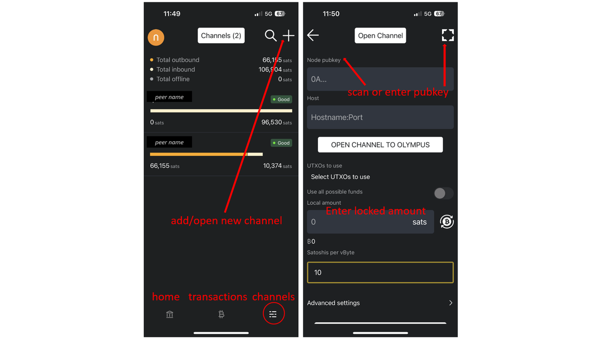

Kendi Bitcoin ve Lightning Full node'inizi çalıştırmak artık teknik uzmanlarla sınırlı karmaşık bir görev olmak zorunda değil. Geleneksel olarak, düğümleri kurmak ve yönetmek kriptografi, ağ oluşturma ve yazılım geliştirme konularında derinlemesine bilgi sahibi olmayı gerektiriyordu. Nakamochi, teknik geçmişi ne olursa olsun düğümleri herkes için erişilebilir hale getirerek bunu değiştiriyor.

Nakamochi ile herkes evinden bir düğüm kurabilir ve işletebilir, bu da tam gizlilik ve finansal bağımsızlık sağlar. Bir Full node çalıştırmak yalnızca kendi işlemlerinizi güvence altına almakla kalmaz, aynı zamanda Bitcoin ağının gücüne de katkıda bulunur. Merkezi olmayan ve esnek bir Bitcoin ağı, güvenliğini ve bağımsızlığını sağlamak için geniş bir düğüm dağılımına dayanır.

### İçindekiler

- Nakamochi Nedir ve Nasıl Çalışır?
- Nakamochi'nin Kurulumu
- Lightning Network Hakkında
- Lightning Network'da Kanal Açma ve İşlem Yapma

## Nakamochi Nedir ve Nasıl Çalışır?

Nakamochi, hem Bitcoin hem de Lightning ağlarını destekleyen, yalnızca Full node'e özel bir Bitcoin'dur. Entegre bir Bitcoin ve Lightning Wallet içerir ve kullanıcıların Lightning Network'nin hızından ve düşük işlem maliyetlerinden yararlanırken güvenli, kendi kendine egemen bir Bitcoin düğümü çalıştırmalarını sağlar.

Nakamochi node'unuz, [BitBanana (Android)](https://bitbanana.app) ve [Zeus (iOS)](https://bitbanana.app) mobil uygulamaları aracılığıyla yönetilir ve her yerden rahatça kontrol etmenizi sağlar. Bu uygulamalar node'unuz için uzaktan kumanda görevi görerek doğrudan Bitcoin veya Lightning ile ödeme yapmanızı, işlemleri yönetmenizi, kanalları açmanızı veya kapatmanızı, bakiyeleri kontrol etmenizi ve node'unuzun performansını kolaylıkla izlemenizi sağlar.

## Nakamochi'nin kurulumu sadece 5 dakika sürer

### Adım 1: Takın ve Başlayın

1. Nakamochi'yi güce ve Wi-Fi'ye bağlayın.

2. "Yeni Wallet Kur "** seçeneğine tıklayın ve 24 kelimelik kurtarma cümlenizi güvenli bir şekilde saklayın.

3. Nakamochi'nize bağlanmak için bir düğüm yönetimi uygulaması (Zeus veya BitBanana) kullanın:

4. Uygulamayı açın ve Nakamochi'nizde görüntülenen QR kodunu tarayın.

5. Daha fazla güvenlik için cihazınızda bir PIN kodu ayarlayın.

_Celektriğe bağlanın ve 24 kelimelik seed cümlenizi yazın_

_Blockchain yetişene kadar bekleyin_

_Yıldırım Sekmesinde yeni Wallet kurun_

_Node Management Uygulaması ile QR Kodunu Tarayın_

_Ek güvenlik için bir PIN kodu ayarlayın_

**Not:** _Nakamochi düğümünüzün Blockchain ile senkronize olmasına izin verin. Bu işlem internet bağlantınıza bağlı olarak biraz zaman alabilir._

## Lightning Network Hakkında

Bitcoin Lightning Network, Bitcoin işlemlerini daha hızlı, daha ucuz ve daha verimli hale getirerek devrim yaratır. Günlük kullanım için mükemmeldir, minimum ücretlerle neredeyse anında ödeme yapılmasını sağlar, kahve satın almak veya sık sık yapılan küçük alışverişler gibi mikro işlemler için idealdir.

Lightning, off-chain'i çalıştırarak, ana Bitcoin Blockchain'yi aşırı yüklemeden saniyede binlerce işlemi destekleyecek şekilde ölçeklendirmek üzere tasarlanmıştır. Bu da onu Bitcoin'nin pratik, küresel bir ödeme sistemine evrilmesinde kilit bir oyuncu haline getiriyor.

Lightning'deki işlemler doğrudan Blockchain'e kaydedilmek yerine özel ödeme kanalları üzerinden yönlendirildiği için gizlilik bir başka avantajdır. Bu, Bitcoin'ün sağlam güvenliğini korurken işlem yapmak için daha gizli bir yol sağlar.

#### Ödeme Kanalları Açıklandı

Lightning Network, doğrudan Blockchain ile etkileşime girmeden birden fazla işleme izin veren iki taraf arasındaki bağlantılar olan ödeme kanalları aracılığıyla çalışır. Bir kanal açık olduğunda, iki taraf arasındaki bakiye her işlem için bu ikinci Layer Lightning çözümünde güncellenerek hızlı, düşük maliyetli ödemeler sağlanır. Yalnızca kanalın açılışı ve kapanışı On-Chain kaydedilerek Bitcoin Blockchain'daki tıkanıklık azaltılır. Bu tasarım, bireysel işlemler genel Ledger'da kaydedilmediği için ölçeklenebilirlik ve gizlilik sağlar.

**Örnek:** Alice ve Bob, Bitcoin'ü taahhüt ederek bir kanal açar. Alice, Bob'e Bitcoin gönderir ve off-chain bakiyeleri On-Chain kaydı olmadan anında güncellenir. Alice daha sonra Charlie'ye ödeme yaparsa ve Alice'ün Charlie'ye doğrudan bir kanalı yoksa, ödeme Charlie'ye ulaşmak için Bob'in kanalı üzerinden yönlendirilebilir. Aracı düğümler üzerinden yönlendirme, doğrudan bağlantılar olmasa bile ödemelerin yapılmasını sağlayarak ağı son derece verimli hale getirir.

## Lightning Network'da Kanalların Açılması ve İşlemlerin Yapılması

Nakamochi'niz kurulduktan ve bir node yönetim uygulamasına bağlandıktan sonra, kanallar açarak ve işlemler yaparak Lightning Network'yi kullanmaya başlayabilirsiniz.

### Zeus (iOS) üzerinde Kanal Açma:

1. "Kanallar "** sekmesine gidin (alt menü).

2. Yeni bir kanal açmak için **"+"** işaretine tıklayın.

3. Bağlanmak istediğiniz düğümün pubkey'ini tarayın veya girin.

4. Kilitli tutarı girin (eşinizle birlikte seçin veya iyi bilinen düğümler için minimum sabit tutarı kullanın).

5. "Kanal Aç "** üzerine tıklayın.

_ZEUS Ekran Görüntüsü_

Daha fazla bilgi için: [Kanallar | Zeus Dokümantasyonu](https://docs.zeusln.app/)

### BitBanana'da Kanal Açma (Android):

1. Hamburger menüsünü açın (solda).

2. "Kanallar "** bölümüne gidin.

3. Yeni bir kanal eklemek/açmak için **"+"** işaretine tıklayın.

4. Pubkey'i tarayın veya yapıştırın.

5. Kilitli tutarı girin (eşinizle birlikte seçin veya iyi bilinen düğümler için minimum sabit tutarı kullanın).

_Bitbanana Ekran Görüntüsü_

Daha fazla bilgi için: [BitBanana](https://bitbanana.com)

Kanalınız açıldıktan sonra, ödemeler bu kanal üzerinden ağdaki diğer katılımcılara yönlendirilebilir. Bakiyeler off-chain'i ayarlayarak işlemlerin neredeyse anında gerçekleşmesini ve minimum ücrete tabi olmasını sağlar.

Artık bir kanala ihtiyacınız yoksa, onu kapatabilirsiniz. Bu işlem, siz ve eşiniz arasındaki nihai bakiyeyi belirler ve On-Chain olarak kaydeder. İdeal olarak her iki taraf da "işbirliğine dayalı bir kapatma" için hemfikirdir ve çevrimiçidir (yanıt vermeyen/çevrimdışı bir eşle "zorla kapatmaya" kıyasla daha hızlı ve daha az ücret).

Genel olarak, maliyetleri azaltmak ve ağ güvenilirliğini ve verimliliğini artırmak için kanalları açık bırakmanızı öneririz. Kanalları açık tutarak On-Chain işlem ücretlerini en aza indirir, kanal yeniden bağlantıları için kesinti sürelerini önler ve sorunsuz ödeme işlemleri için istikrarlı bir yönlendirme kapasitesi sağlarsınız. Bu yaklaşım, sağlam ve esnek bir ağı teşvik ederken genel kullanıcı deneyimini geliştirir ve operasyonel ek yükü azaltır.

### Faydalı Bağlantılar

- [Nakamochi Hakkında](https://nakamochi.io/)
- [Nakamochi'nin Bültenine Abone Olun](https://90c7addc.sibforms.com/serve/MUIFAHG7H5YBPpm-kZ8G6TuS-nmL4uaq85rlpBfI__S79tZ5jheIJfF3kJYudycgs_6_RUdDBkt8Sd7OyNL_JDTTJvOb36ifF6vcQoabBXKp4cbefzh1DYqnok_jItexICcQL13ucd2aS581ngqy7jr0Q1H3HhxV3z2eWKE5-Z-YMasj-MMotQeDvdorMCSi0XgCWDqs8rEMQC7E)