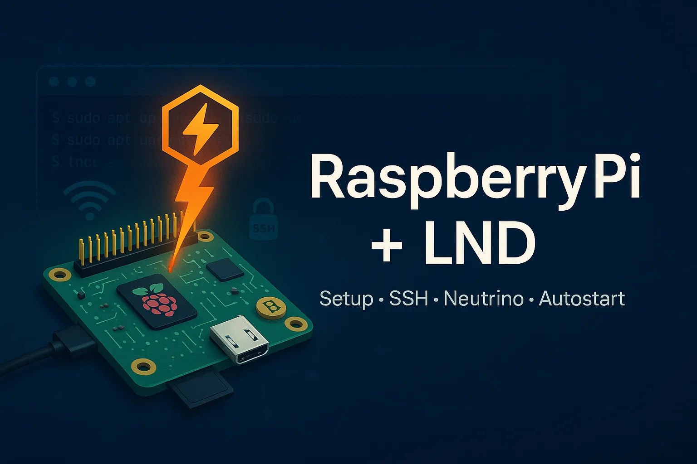

## Raspberry Pi -konfiguraatio LND:n kanssa


### 1. Lataa Raspberry Pi OS Lite


Ohjeet imagon lataamiseen ja asentamiseen micro SD-kortille Windowsissa, Macissa ja Linuxissa löytyvät [tältä sivulta](https://www.raspberrypi.org/software/operating-systems/).


### 2. SD-kortin alustaminen


Käytä Raspberry Pi Imageria tai balenaEtcheriä.


**Huomautus:** Symbolia `$` käytetään kehotteena ja sen avulla käyttäjä voi syöttää komentoja tietokoneelle, komentoja tulkitsee Linuxin bash. Symboli `#` rivin alussa osoittaa, että seuraava teksti on kommentti.


### 3. Ota SSH käyttöön


Ennen kuin Raspberry Pi käynnistetään alustetulla muistilla, meidän on asetettava se tietokoneeseen ja luotava kaksi tiedostoa, joiden avulla voimme muodostaa etäyhteyden. Käyttämällä komentoa `touch` luomme tyhjän tiedoston /boot-osioon, mikä mahdollistaa SSH-yhteyden muodostamisen ensimmäisellä käynnistyskerralla juuri alustetulla SD-kortilla.


```
# NOTE: If the microSD card has been mounted at /media/microSD, the command
# should be $ sudo touch /media/microSD/boot/ssh
$ touch /boot/ssh
```


### 4. Luo tiedosto Wi-Fi-yhteyttä varten


Käyttämällä nano-komentoa luomme tiedoston `wpa_supplicant.conf` ja aloitamme suoraan sen muokkaamisen. Tässä tiedostossa meidän täytyy kopioida wlan-konfiguraatio, kopioida teksti STARTin ja ENDin väliin ja muuttaa sen wlanin SSID ja salasana, johon haluat muodostaa yhteyden.


```
$ nano /boot/wpa_supplicant.conf

------ START -------
country=ar
update_config=1
ctrl_interface=/var/run/wpa_supplicant

network={
ssid="MyNetworkSSID"
psk="password"
}
------ END -------
```


### 5. Yhteys


Sitten asetamme SD-kortin Raspberry Pi:hen ja kytkemme Piin virtalähteeseen käyttöjärjestelmän käynnistämiseksi. Meidän on tunnistettava se verkossa, ja mDNS-protokolla antaa sille todennäköisesti nimen raspberrypi.local. Yritetään muodostaa yhteys SSH:n kautta.


```
$ ssh pi@raspberrypi.local
password: raspberry
```


Jos se ei toimi, meidän on selvitettävä verkko. Selvitetään IP Address, johon olemme yhteydessä.


```
$ ifconfig
```


Jos se on esimerkiksi 192.168.0.0, käytä nmapia Pi:n etsimiseen.


```
nmap -v 192.168.0.0/24
```


Oletetaan, että löydämme uuden IP-osoitteen verkostostamme, ja mennään sisään SSH:n kautta.


```
$ ssh pi@192.168.0.30
password: raspberry
```


### 6. Määritä Pi


```
$ sudo raspi-config
```


- Valitse vaihtoehto (1) ja vaihda käyttäjän pi salasana.
- Valitsemme vaihtoehdon (8) päivittääksemme konfigurointityökalun uusimpaan versioon
- Valitsemalla vaihtoehdon (4) valitsemme aikavyöhykkeen
- Valitsemme vaihtoehdon (7) ja sitten Laajenna tiedostojärjestelmä
- Viimeistely


### 7. Päivitä nyt käyttöjärjestelmä


```
$ sudo apt update && sudo apt upgrade -y
$ sudo apt install htop git curl bash-completion jq qrencode dphys-swapfile vim --install-recommends -y
```


### 8. Lisää Bitcoin-käyttäjä


```
$ sudo adduser bitcoin
```


### 9. Suojaa rpi


```
$ sudo apt install ufw
$ sudo ufw default deny incoming
$ sudo ufw default allow outgoing
$ sudo ufw allow 22 comment 'allow SSH from LAN'
$ sudo ufw allow 9735 comment 'allow Lightning'
$ sudo ufw allow 10009 comment 'Lightning gRPC'
$ sudo ufw enable
$ sudo systemctl enable ufw
$ sudo ufw status
$ sudo apt install fail2ban
```


### 10. Asenna Go


Jos et käytä raspberry pi, lataa go for your architecture [täällä](https://golang.org/dl/).


```
$ wget https://golang.org/dl/go1.15.linux-armv6l.tar.gz
$ sudo tar -C /usr/local -xzf go1.15.linux-armv6l.tar.gz
$ echo "export PATH=$PATH:/usr/local/go/bin" >> ~/.bashrc
$ echo "export GOPATH=$HOME/go" >> ~/.bashrc
$ echo "export PATH=$PATH:$GOPATH/bin" >> ~/.bashrc
$ source ~/.bashrc
$ go version # should display the following message 'go version go1.13.5 linux/arm'
```


### 11. Käännä ja asenna LND


```
$ git clone https://github.com/lightningnetwork/lnd.git
$ cd lnd
$ make
$ make install tags="autopilotrpc chainrpc experimental invoicesrpc routerrpc signrpc walletrpc watchtowerrpc wtclientrpc"
$ sudo cp $GOPATH/bin/lnd /usr/local/bin/
$ sudo cp $GOPATH/bin/lncli /usr/local/bin/
$ lncli --version
lncli version 0.11.0-beta commit=v0.11.0-beta-61-g6055b00dbbcedf45cd60f12e57dc5c1a7b97746f
```


### 12. Luo LND conf-tiedosto


Luo LND:n konfigurointitiedosto, tämä on tehtävä Bitcoin-käyttäjällä


```
$ sudo su - bitcoin
$ mkdir .lnd
$ nano .lnd/lnd.conf
```


```
[Application Options]
# enable spontaneous payments
accept-keysend=1

# Public name of the node
alias=YOUR_ALIAS
# Public color in hexadecimal
color=#000000
debuglevel=info
maxpendingchannels=5
listen=localhost
# gRPC socket
rpclisten=0.0.0.0:10009

[Bitcoin]
bitcoin.active=1
bitcoin.mainnet=1
bitcoin.node=neutrino

[neutrino]
neutrino.connect=bb2.breez.technology
```


### 13. LND service autostart


Jotta LND käynnistyy rpi-käynnistyksen jälkeen, meidän on luotava .service-tiedosto systemd:hen. Jos olemme kirjautuneet sisään Bitcoin-käyttäjänä ja haluamme siirtyä takaisin pi-käyttäjäksi, kirjoitamme yksinkertaisesti 'exit'


```
$ exit
$ sudo nano /etc/systemd/system/lnd.service
```


```
[Unit]
Description=LND Lightning Network Daemon
After=network.target

[Service]

# Service execution
###################

ExecStart=/usr/local/bin/lnd


# Process management
####################

Type=simple
Restart=always
RestartSec=30
TimeoutSec=240
LimitNOFILE=128000

# Directory creation and permissions
####################################

# Run as bitcoin:bitcoin
User=bitcoin
Group=bitcoin

# /run/lightningd
RuntimeDirectory=lightningd
RuntimeDirectoryMode=0710

# Hardening measures
####################

# Provide a private /tmp and /var/tmp.
PrivateTmp=true

# Mount /usr, /boot/ and /etc read-only for the process.
ProtectSystem=full

# Disallow the process and all of its children to gain
# new privileges through execve().
NoNewPrivileges=true

# Use a new /dev namespace only populated with API pseudo devices
# such as /dev/null, /dev/zero and /dev/random.
PrivateDevices=true

# Deny the creation of writable and executable memory mappings.
MemoryDenyWriteExecute=true

[Install]
WantedBy=multi-user.target
```


```
$ sudo systemctl enable lnd
$ sudo systemctl start lnd
$ systemctl status lnd
```


Voimme tarkastella lokitietoja suorittamalla komennon journalctl


```
$ sudo journalctl -f -u lnd
```


### 14. Nyt aloitamme LND:n


```
$ sudo su - bitcoin
$ lncli create
```


### 15. Lisää varoja solmuun


```
$ lncli newaddress p2wkh
```

Voit nyt lähettää btc:tä LND:n palauttamaan Address:een.


tällä komennolla voit tarkistaa saldon:


```
$ lncli walletbalance
{
"total_balance": "500000",
"confirmed_balance": "0",
"unconfirmed_balance": "500000"
}
```


Kun tapahtuma on vahvistettu, voimme avata kanavan. Jos et tiedä, millä solmulla kanava avataan, voit mennä osoitteeseen 1ml.com ja valita solmun.


Avaa yhteys solmuun:


```
$ lncli connect 031015a7839468a3c266d662d5bb21ea4cea24226936e2864a7ca4f2c3939836e0@212.129.58.219:9735
```


Avaa sitten kanava:


```
$ lncli openchannel 031015a7839468a3c266d662d5bb21ea4cea24226936e2864a7ca4f2c3939836e0 1000000 0
```


Tarkista rahastomme:


```
$ lncli walletbalance
$ lncli channelbalance
```


Voimme tarkastella vireillä olevia ja aktiivisia kanavia:


```
$ lncli pendingchannels
$ lncli listchannels
```


Maksamaan salaman Invoice:


```
$ lncli payinvoice lnbc1p0kkhgwpp5sn9y6xe9hx7swrjj4057674vh73nwk6rxg8j8zedztkn3vdzgjafacqmud86h
```


Jos haluat vastaanottaa maksun, luo Invoice tiettyä summaa varten:


```
$ lncli addinvoice --memo 'my first payment on LN' --amt 100
```


Voit tarkastella tietoja solmusta:


```
$ lncli getinfo
```


Täydellinen luettelo komennoista on nähtävissä yksinkertaisesti suorittamalla komento lncli:


```
$ lncli
```


Lopuksi, LND API:n kutsuminen:


```
$ MACAROON_HEADER="Grpc-Metadata-macaroon: $(xxd -ps -u -c 1000 .lnd/data/chain/bitcoin/mainnet/admin.macaroon)"
$ curl -X GET --cacert .lnd/tls.cert --header "$MACAROON_HEADER" https://localhost:8080/v1/getinfo |jq
```


Oppaan LOPPU!