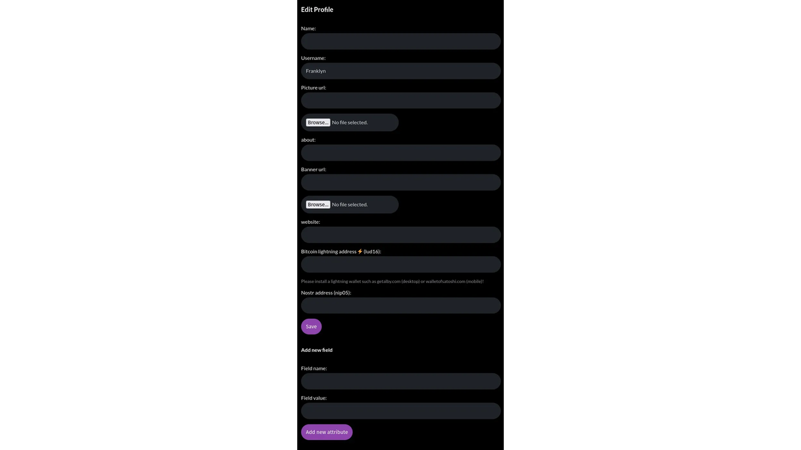

Bu kılavuzun sonunda, Nostr'un ne olduğunu anlayacak, bir hesap oluşturmuş olacak ve onu kullanabileceksiniz.

## Nostr nedir?

Nostr, Twitter, Telegram ve diğer sosyal medya platformlarının yerini alma gücüne sahip bir protokoldür. Bir kez ve herkes için küresel olarak dirençli bir sosyal ağ oluşturabilen basit bir açık protokoldür.

## Nasıl çalışıyor?

Nostr üç bileşene dayanmaktadır: anahtar çiftleri, istemciler ve aktarıcılar.

Her kullanıcının bir veya daha fazla kimliği vardır ve her kimlik bir kriptografik anahtar çifti tarafından belirlenir.

Ağa erişmek için istemci yazılımı kullanmanız ve içerik almak ve iletmek için rölelere bağlanmanız gerekir.

## 1. Kriptografik Anahtarlar

Kullanıcıların özel bir şirkete bir e-posta Address ve çok sayıda bilgi vermek zorunda olduğu Facebook veya Twitter'ın aksine, Nostr merkezi bir otorite olmadan çalışır. Kullanıcılar generate bir kriptografik anahtar çifti, bir gizli anahtar (özel anahtar olarak da bilinir) ve bir açık anahtar.

Yalnızca kullanıcı tarafından bilinen gizli anahtar nsec, kimlik doğrulama ve içerik yayınlama için kullanılır.

Genel anahtar, npub, bir kullanıcı tarafından yayınlanan tüm içeriğin eklendiği benzersiz bir tanımlayıcıdır. Ortak anahtarınız, diğer kullanıcıların sizi bulmasını ve Nostr akışınıza abone olmasını sağlayan bir kullanıcı adı gibidir.

## 2. Müşteriler

İstemciler, Nostr ile etkileşime izin veren yazılımlardır. Ana istemciler şunlardır:

- iOS: damus
- Android: ametist
- Web: iris.to; snort.social; astral.ninja

İstemciler, kullanıcıların generate yeni bir anahtar çifti (bir hesap oluşturmaya eşdeğer) veya mevcut bir anahtar çifti ile kimlik doğrulaması yapmasına olanak tanır.

## 3. Röleler

Aktarıcılar, size sundukları içeriği beğenmediğiniz takdirde istediğiniz zaman terk edebileceğiniz basit sunuculardır. Dilerseniz kendi aktarıcınızı da çalıştırabilirsiniz.

💡 **Pro ipucu:** Ücretli aktarıcılar genellikle spam ve istenmeyen içeriği filtrelemede daha etkilidir.

### Kılavuz

Artık Nostr hakkında, başlamak ve bu protokol üzerinde ilk kimliğinizi oluşturmak için yeterli bilgiye sahipsiniz.

Bu kılavuzun amaçları doğrultusunda, bu web istemcisi her platformda çalıştığı için iris.to (https://iris.to/) kullanacağız.

## Adım 1: Anahtarların oluşturulması

ris, profiliniz için bir isim (gerçek veya hayali) girmekten başka bir şey yapmanıza gerek kalmadan sizin için bir dizi anahtar oluşturacaktır. Sonra GO'ya tıklayın ve işiniz bitti!

⚠️ **Dikkat!** Oturumunuz kapandıktan sonra profilinize tekrar erişebilmek istiyorsanız anahtarlarınızı takip etmeniz gerekecektir. Bunu nasıl yapacağınızı bu kılavuzun en sonunda göstereceğim.

## Adım 2: İçerik yayınlayın

İçerik yayınlamak, yayın alanına birkaç kelime yazmak kadar basit ve sezgiseldir.

İşte bu kadar! Nostr'da ilk notunuzu yayınladınız.

## 3. Adım: Bir arkadaş bulun

Beni Nostr'da bulun ve bir daha asla yalnız kalmayın. Beslememe abone olan herkese geri abone olacağım. Bunu yapmak için açık anahtarımı girmeniz yeterli

npub1hartx53w6t3q5wv9xdqdwrk7h6r5866t8u775q0304zedpn5zgssasp7d3 arama çubuğunda.

"Takip et" seçeneğine tıklayın ve en fazla birkaç gün içinde ben de sizin akışınıza abone olacağım. Arkadaş olacağız. Bana bir mesaj yazmak isterseniz mesajınızı okumaktan da mutluluk duyarım.

Son olarak, her yeni bir şey yayınladığımızda bir not almak için Agora256'nın beslemesine abone olduğunuzdan emin olun: npub1ag0rawstycy7nanuc6sz4v287rneen2yapcq3fd06972f8ncrhzqx

## Adım 4: Profilinizi özelleştirin

Profilinizi özelleştirmek için hala yapmanız gereken bazı işler var. Bunu yapmak için, ekranın sağ üst köşesinde iris'in sizin için otomatik olarak oluşturduğu avatara tıklayın ve ardından "profili düzenle" seçeneğine tıklayın.

Şimdi tek yapmanız gereken iris'e resminizi ve profil banner'ınızı interweb'de nerede bulacağını söylemek. Kendi içeriğinizi barındırmanızı tavsiye ederim: size ait olanı koruyun.

İsterseniz, resimleri de yükleyebilirsiniz, bunlar sizin için iris tarafından Nostr için ücretsiz bir görsel içerik barındırma hizmeti olan nostr.build'de saklanacaktır.

Gördüğünüz gibi, istemcinizi Sats alabilecek ve gönderebilecek şekilde de yapılandırabilirsiniz. Bu şekilde, beğendiğiniz içeriklerin yazarlarını ödüllendirebilir veya daha da iyisi, yayınlayacağınız harika içerikler için Sats biriktirebilirsiniz.

## Adım 5: Anahtar çiftini yedekleyin

İstemciden çıkış yaptıktan veya oturumunuzun süresi dolduktan sonra profilinize erişmeye devam etmek istiyorsanız bu adım çok önemlidir.

İlk olarak, bir dişli ile temsil edilen "ayarlar" simgesine tıklayın

Ardından, npub, npub hex, nsec ve nsec hex dosyalarınızı tek tek kopyalayıp güvende tutacağınız bir metin dosyasına yapıştırın. Nasıl yapılacağını biliyorsanız bu dosyayı şifrelemenizi tavsiye ederim.

⚠️ **Iris'in size verdiği uyarıya dikkat edin:** açık anahtarınızı korkmadan paylaşabilirsiniz, ancak özel anahtarınız için durum farklıdır. İkincisine sahip olan herkes hesabınıza erişebilecektir.

## Sonuç

İşte küçük devekuşu, Nostr'daki ilk adımlarını attın. Şimdi, yıldırım hızında koşmayı öğrenmeniz gerekecek. Yakında anahtarlarınızı nasıl yöneteceğinizi ve getalby kullanarak lightning'i Nostr deneyiminize nasıl entegre edeceğinizi gösteren kılavuzlar yayınlayacağız.