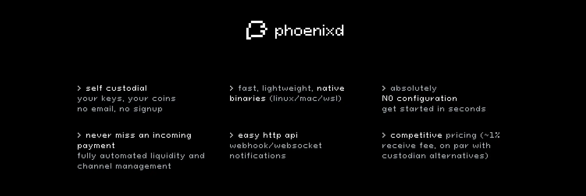
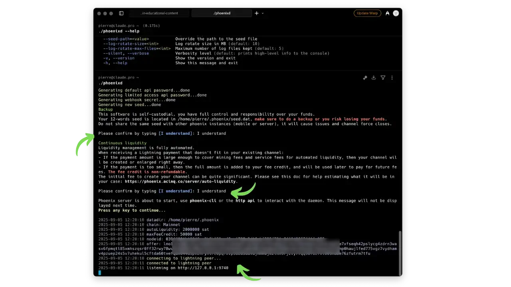
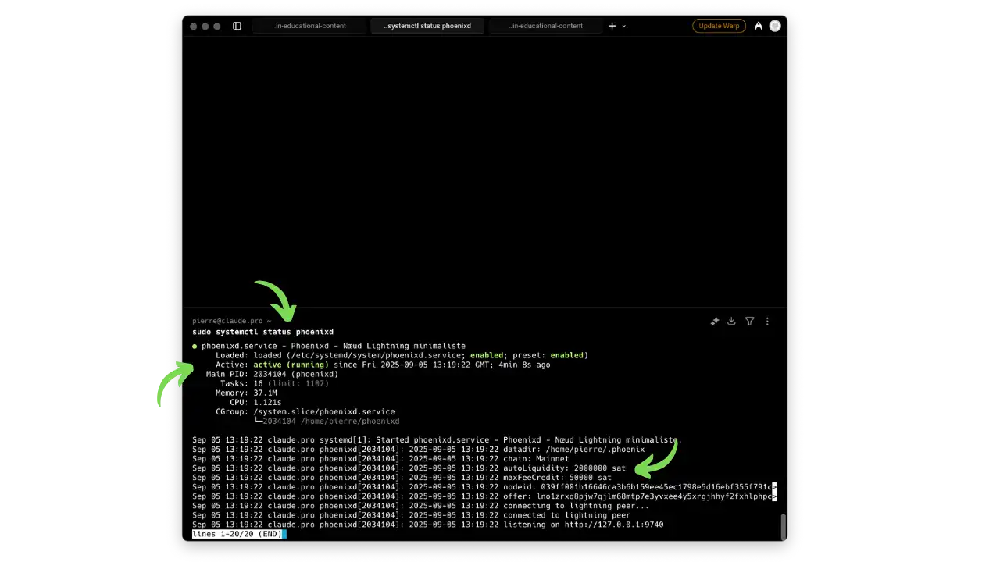
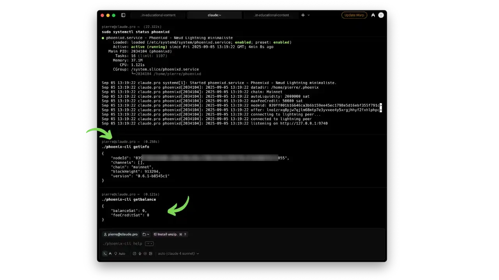
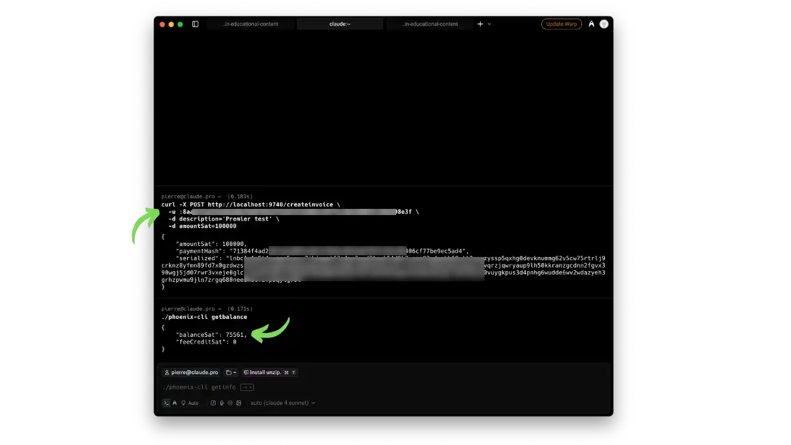
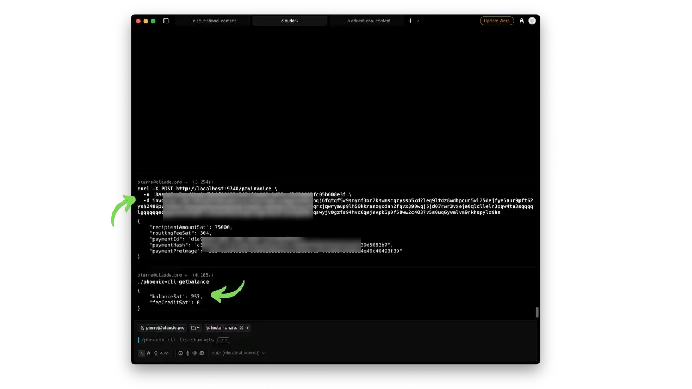

L'autonomie financière passe aussi par la maîtrise de son infrastructure Lightning. Pour les développeurs et entreprises souhaitant intégrer Bitcoin Lightning dans leurs applications, **Phoenixd** représente la solution idéale : un nœud Lightning minimaliste et spécialisé avec gestion automatique de la liquidité.

Phoenixd est un serveur Lightning développé par ACINQ, conçu spécifiquement pour l'envoi et la réception de paiements Lightning via une API HTTP. Contrairement aux implémentations complètes comme LND ou Core Lightning, Phoenixd abstrait toute la complexité de gestion des canaux tout en préservant l'auto-garde de vos fonds.

Dans ce tutoriel, nous verrons comment installer, configurer et utiliser Phoenixd pour développer des applications Lightning avec une infrastructure auto-hébergée et une API simple d'utilisation.

## Qu'est-ce que Phoenixd ?

Phoenixd est un nœud Lightning minimal et spécialisé développé par ACINQ. Il s'agit d'une solution conçue pour les développeurs et entreprises qui souhaitent intégrer Lightning dans leurs applications sans la complexité de gestion d'un nœud complet.

### Principe de fonctionnement

**Architecture spécialisée :** Phoenixd est un nœud Lightning minimal qui utilise ACINQ comme LSP (Lightning Service Provider) pour la liquidité automatique. Lorsque vous recevez des paiements Lightning, il ouvre automatiquement des canaux avec les nœuds d'ACINQ pour vous allouer la capacité entrante nécessaire. Cette liquidité "à la volée" est instantanée mais facturée exactement **1% + frais de minage** du montant reçu.

**Gestion automatisée :** Le système gère trois éléments clés :
- **Canaux Lightning** : Ouverture, fermeture et gestion automatique selon les besoins
- **Liquidité entrante/sortante** : Provisionnement automatique via splicing et ouverture de canaux
- **Crédit de frais** : Les petits paiements insuffisants pour justifier un canal sont stockés comme provision pour les frais futurs

### Avantages de Phoenixd

**Auto-garde complète :** Vous contrôlez vos clés privées (seed de 12 mots) et vos fonds. Phoenixd génère votre portefeuille localement sans jamais partager vos clés.

**Infrastructure personnelle :** Phoenixd tourne sur votre serveur, vous donnant accès aux logs détaillés, à la configuration et au contrôle de l'API. Vous n'êtes plus dépendant d'un service tiers pour l'accès à vos fonds.

**API intégrée :** Phoenixd expose une API HTTP permettant l'intégration avec d'autres services, le support LNURL natif et le développement d'applications personnalisées.

**Facilité d'intégration :** Grâce à son API REST simple, Phoenixd peut être intégré dans n'importe quelle application ou service nécessitant des paiements Lightning.

**Note importante :** La liquidité automatique provient toujours d'ACINQ comme LSP (Lightning Service Provider). Phoenixd utilise le même mécanisme que Phoenix mobile pour la gestion automatique des canaux.

## Installation de Phoenixd

### Prérequis

Phoenixd nécessite un environnement Linux (Ubuntu/Debian recommandé), avec quelques compétences de base en ligne de commande. Pour un fonctionnement optimal, prévoyez :

- **Serveur Linux** : VPS ou machine locale avec connexion stable
- **OpenJDK 21** : Environnement d'exécution Java
- **Connexion internet stable** : Pour la synchronisation avec le réseau Lightning
- **Nom de domaine** (optionnel) : Pour l'accès HTTPS sécurisé à l'API

### Téléchargement et installation

**1. Télécharger Phoenixd**

Rendez-vous sur la page des [releases GitHub](https://github.com/ACINQ/phoenixd/releases) et téléchargez la dernière version pour votre architecture :

```bash
# For Linux x86_64
# Replace with the latest release
wget https://github.com/ACINQ/phoenixd/releases/download/v0.6.1/phoenixd-0.6.1-linux-x64.zip
unzip -j phoenixd-0.6.1-linux-x64.zip
chmod +x phoenixd phoenix-cli
```

**2. Premier démarrage**

Lancez Phoenixd pour l'initialisation :

```bash
./phoenixd
```

Au premier lancement, vous devrez confirmer deux étapes importantes en tapant "I understand" :

**Message 1 - Sauvegarde :**
```
This software is self-custodial, you have full control and responsibility over your funds.
Your 12-words seed is located in /home/<user>/.phoenix, make sure to do a backup or you risk losing your funds.
Do not share the same seed with other phoenix instances (mobile or server), it will cause issues and channel force closes.
```

**Sauvegardez impérativement ces 12 mots** - c'est votre seule garantie de récupération.

**Message 2 - Liquidité automatique :**
```
Continuous liquidity
Liquidity management is fully automated.
When receiving a Lightning payment that doesn't fit in your existing channel:
- If the payment amount is large enough to cover mining fees and service fees for automated liquidity, 
  then your channel will be created or enlarged right away.
- If the payment is too small, then the full amount is added to your fee credit, 
  and will be used later to pay for future fees. The fee credit is non-refundable.
```

Tapez `I understand` pour chaque confirmation.



*Premier démarrage de Phoenixd : confirmations de sauvegarde et liquidité automatique*

**3. Configuration en service**

Pour un fonctionnement en continu, créez un service systemd :

```bash
sudo nano /etc/systemd/system/phoenixd.service
```

```ini
[Unit]
Description=Phoenixd - Minimalist Lightning node
After=network.target

[Service]
User=your_user
WorkingDirectory=/home/your_user
ExecStart=/home/your_user/phoenixd
Restart=on-failure
RestartSec=5

[Install]
WantedBy=multi-user.target
```

```bash
sudo systemctl daemon-reload
sudo systemctl enable phoenixd
sudo systemctl start phoenixd
```



*Service Phoenixd actif et opérationnel via systemd et `auto-liquidity` à 2m sat*

## Configuration et sécurisation

### Fichier de configuration

Phoenixd crée automatiquement `~/.phoenix/phoenix.conf` avec les paramètres essentiels :

```conf
# Network (mainnet by default)
chain=mainnet

# Size of automatic channels and requested liquidity amount (in satoshis)
auto-liquidity=2000000

# API configuration
http-bind-address=127.0.0.1
http-bind-port=9740
http-password=auto_generated_password
http-password-limited-access=limited_password
```

**Paramètres clés :**
- `auto-liquidity` : Taille des canaux ouverts automatiquement (2M sats par défaut)
- `http-password` : Mot de passe admin pour l'API (création de factures ET envoi de paiements)
- `http-password-limited-access` : Mot de passe restreint (création de factures uniquement)

### Accès sécurisé avec HTTPS

Par défaut, l'API Phoenixd n'est accessible qu'en HTTP local (`http://127.0.0.1:9740`). Pour utiliser votre nœud depuis l'extérieur (applications mobiles, autres serveurs, intégrations web), vous devez configurer un accès HTTPS sécurisé.

**Principe du proxy inverse :**
```
Internet → nginx (port 443 HTTPS) → Phoenixd (port 9740 HTTP local)
```

**Nginx** agit comme un **proxy inverse** : il écoute les requêtes HTTPS depuis Internet sur le port 443, les redirige vers Phoenixd en local (port 9740), puis renvoie les réponses chiffrées au client.

**Le certificat SSL/TLS** est un fichier numérique qui :
- **Prouve l'identité** de votre serveur (évite les attaques man-in-the-middle)
- **Active le chiffrement HTTPS** : toutes les données, y compris vos mots de passe API, sont chiffrées pendant le transport
- **Délivré gratuitement** par Let's Encrypt via l'outil certbot

Cette configuration permet de :
- **Accéder à l'API depuis Internet** de manière sécurisée
- **Chiffrer vos mots de passe API** pendant le transport (éviter qu'ils transitent en clair)
- **Intégrer Phoenixd** dans des applications externes nécessitant HTTPS
- **Respecter les standards de sécurité** pour les APIs financières

Configurez ce proxy inverse HTTPS avec nginx :

**1. Configuration nginx**

```bash
sudo apt install nginx certbot python3-certbot-nginx
sudo nano /etc/nginx/sites-available/phoenixd.conf
```

```nginx
server {
    listen 80;
    server_name phoenixd.your-domain.com;
    
    location / {
        proxy_pass http://127.0.0.1:9740;
        proxy_set_header X-Real-IP $remote_addr;
        proxy_set_header Host $host;
    }
}
```

```bash
sudo ln -s /etc/nginx/sites-available/phoenixd.conf /etc/nginx/sites-enabled/
sudo nginx -t && sudo systemctl reload nginx
```

**2. Certificat SSL**

```bash
sudo certbot --nginx -d phoenixd.your-domain.com
```

### Test de fonctionnement

Vérifiez que Phoenixd fonctionne correctement :

```bash
./phoenix-cli getinfo
./phoenix-cli getbalance
```

Ces commandes devraient retourner des informations JSON sur l'état du nœud et le solde (vide initialement).



*Commandes getinfo et getbalance pour vérifier l'état du nœud*

## Utilisation de l'API

### Premier test de réception

**1. Créer une facture Lightning**

Utilisez l'API pour créer votre première facture :

```bash
curl -X POST http://localhost:9740/createinvoice \
  -u :your_password \
  -d description='First test' \
  -d amountSat=100000
```

### Comprendre le mécanisme de liquidité automatique

**Principe fondamental :** Lorsque vous recevez un paiement Lightning, Phoenixd doit parfois ouvrir un nouveau canal pour avoir la capacité de le recevoir. Cette ouverture de canal coûte des frais qui sont **automatiquement déduits** du montant reçu.

**Exemple concret avec 100 000 sats :**



*Premier test de réception : 100k sats reçus, solde final de 75,561 sats après déduction des frais de liquidité*

```bash
# Payment received: 100,000 sats
# Channel created: 2,115,000 sats total capacity
# Liquidity fee: 24,439 sats
# Final balance: 75,561 sats
```

**Calcul des frais :**
- **Frais de service** : 1% de la capacité du canal (2 115 000 sats) = 21 150 sats
- **Frais de minage** : ~3 289 sats (pour la transaction on-chain)
- **Total** : 24 439 sats déduits automatiquement

**Vérification avec les commandes CLI :**
```bash
# View details of all channels
./phoenix-cli listchannels

# Important output:
# "toLocal": 75561000 (your balance in milli-sats)
# "toRemote": 2039439000 (ACINQ's balance)
# Total channel: 2,115,000 sats
```



*Solde final après paiement envoyé : 257 sats restants après avoir effectué un envoi Lightning*

**Fee credit pour petits paiements :** Si vous recevez des paiements trop petits pour justifier l'ouverture d'un canal (< 25k sats environ), ils sont stockés dans un "crédit de frais" non remboursable. Ce crédit servira à payer les frais d'un canal futur quand vous recevrez un montant suffisant.

**2. Suivre l'ouverture de canal**

Surveillez les logs de Phoenixd :

```bash
journalctl -u phoenixd -f
```

Vous verrez l'ouverture du canal et la déduction automatique des frais de liquidité. Les frais varient selon les conditions du mempool Bitcoin mais incluent toujours 1% de frais de service plus les frais de minage actuels.

**3. Vérifier le canal**

```bash
./phoenix-cli listchannels
```

Cette commande affiche vos canaux actifs avec leur état et leur solde.

### Opérations API complètes

Phoenixd expose une API REST sur le port 9740 permettant :

**Opérations de base :**
```bash
# Create an invoice
curl -X POST http://localhost:9740/createinvoice \
  -u :your_password \
  -d description='Test payment' \
  -d amountSat=100000

# Send a payment (routing fee 0.4%)
curl -X POST http://localhost:9740/payinvoice \
  -u :your_password \
  -d invoice='lnbc...'

# Check balance
curl http://localhost:9740/getbalance \
  -u :your_password

# Send on-chain funds (in case of channel closure)
./phoenix-cli sendtoaddress \
    --address bc1q... \
    --amountSat 50000 \
    --feerateSatByte 12
```

**Important sur les frais :** 
- **Réception** : 1% + frais de minage pour la liquidité automatique
- **Envoi** : 0.4% de frais de routage sur le réseau Lightning

**Webhooks :** Les webhooks permettent à Phoenixd de **notifier automatiquement** vos applications quand un événement se produit (paiement reçu, facture payée, canal ouvert, etc.). Au lieu de demander constamment à Phoenixd s'il y a du nouveau, votre application reçoit une notification HTTP instantanée.

**Exemple d'usage :** Votre boutique en ligne reçoit automatiquement une notification quand un client paie sa commande, permettant de valider instantanément la transaction.

Configuration dans `phoenix.conf` :
```conf
webhook-url=https://your-app.com/webhook-phoenixd
webhook-secret=votre_secret_de_verification
```

## Utilisations avancées

### Intégrations LNURL

Phoenixd supporte nativement les protocoles LNURL pour des intégrations avancées :

**LNURL-Pay :** Payer des services compatibles LNURL
```bash
curl -X POST http://localhost:9740/lnurlpay \
  -u :your_password \
  -d lnurl=LNURL1DP68GURN8GHJ7MRWW4EXCTN... \
  -d amountSat=100
```

**LNURL-Withdraw :** Récupérer des fonds depuis des services LNURL
```bash
curl -X POST http://localhost:9740/lnurlwithdraw \
  -u :your_password \
  -d lnurl=lightning:LNURL1DP68GURN8GHJ7MRW...
```

**LNURL-Auth :** Authentification via Lightning pour accéder à des services
```bash
curl -X POST http://localhost:9740/lnurlauth \
  -u :your_password \
  -d lnurl=lnurl1dp68gurn8ghj7um5v93kket...
```

### Intégration avec LNbits

LNbits peut utiliser Phoenixd comme source de financement selon sa [documentation officielle](https://docs.lnbits.org/guide/wallets.html) :

**Configuration LNbits :**
```bash
LNBITS_BACKEND_WALLET_CLASS=PhoenixdWallet
PHOENIXD_API_ENDPOINT=http://localhost:9740/
PHOENIXD_API_PASSWORD=your_password_phoenixd
```

Cette intégration permet de créer des sous-comptes LNbits alimentés par votre nœud Phoenixd, offrant une interface web pour gérer multiple wallets Lightning.

### Applications personnalisées

Grâce à son API REST complète, vous pouvez développer :

**E-commerce :** Intégration directe des paiements Lightning dans votre boutique
**Services de donation :** Systèmes de dons avec factures et webhooks automatiques  
**Bots de réseaux sociaux :** Bots Telegram/Discord avec fonctions de pourboire
**Paywall Lightning :** Contenus premium accessibles contre paiement Lightning

## Sécurité et bonnes pratiques

### Protection des accès

**Mots de passe API :** Les mots de passe générés automatiquement sont les clés de votre trésorerie Lightning. Ne les partagez jamais et changez-les en cas de doute.

**Pare-feu :** Ne laissez jamais le port 9740 ouvert directement sur Internet. Utilisez toujours nginx avec HTTPS.

**Authentification renforcée :** Envisagez un VPN ou Tailscale pour limiter l'accès à votre serveur aux seuls appareils autorisés.

### Sauvegardes essentielles

**Seed de récupération :** Sauvegardez vos 12 mots dans un endroit sûr, hors du serveur. C'est votre seule garantie de récupération des fonds.

**Répertoire ~/.phoenix :** Sauvegardez régulièrement ce dossier (après arrêt de Phoenixd) pour préserver l'état des canaux et accélérer une éventuelle restauration.

**Codes de récupération des services :** Conservez également les codes de secours de tous les services où vous activez la 2FA avec votre Phoenix.

### Surveillance et maintenance

**Logs de surveillance :**
```bash
journalctl -u phoenixd -f  # Real-time logs
./phoenix-cli getinfo      # Node status
```

**Mises à jour :** Surveillez les [releases GitHub](https://github.com/ACINQ/phoenixd/releases) pour les nouvelles versions. La mise à jour se fait simplement en remplaçant le binaire et redémarrant le service.

## Comparaison avec les alternatives

### Phoenixd vs Phoenix standard

**Phoenix standard (mobile) :**
- ✅ Installation immédiate, configuration zéro
- ✅ Interface mobile intuitive
- ✅ Même auto-garde que Phoenixd
- ❌ Pas d'API pour développeurs
- ❌ Pas d'accès aux logs détaillés

**Phoenixd (serveur) :**
- ✅ API HTTP pour intégrations
- ✅ Accès complet aux logs
- ✅ Infrastructure personnelle
- ❌ Nécessite compétences techniques
- ❌ Maintenance serveur requise

**Point commun important :** Les deux utilisent ACINQ comme LSP pour la liquidité automatique.

### Phoenixd vs LND/Core Lightning

**LND/Core Lightning :**
- ✅ Contrôle total, protocole Lightning complet
- ✅ Communauté large, écosystème mature
- ❌ Gestion manuelle de la liquidité complexe
- ❌ Courbe d'apprentissage importante

**Phoenixd :**
- ✅ Gestion automatique de la liquidité (comme Phoenix mobile)
- ✅ API pour développeurs
- ✅ Configuration simplifiée
- ❌ Utilise ACINQ comme LSP (pas de routage indépendant)
- ❌ Moins flexible que les nœuds complets

## Résolution de problèmes courants

### Problèmes d'accès API

**Erreur "Authentication failed" :**
1. Vérifiez le mot de passe dans le fichier `~/.phoenix/phoenix.conf`
2. Contrôlez le format d'authentification `-u :mot_de_passe`
3. Assurez-vous que Phoenixd fonctionne (`./phoenix-cli getinfo`)

**Timeouts de connexion :**
- Vérifiez que Phoenixd écoute sur le bon port (9740)
- Testez l'accès local avant de configurer HTTPS
- Contrôlez les logs : `journalctl -u phoenixd -f`

### Problèmes de liquidité

**Paiements qui n'arrivent pas :**
1. Vérifiez que le montant dépasse le seuil minimal (~30k sats)
2. Consultez les logs pour identifier les erreurs de canal
3. Redémarrez Phoenixd si nécessaire

**Solde en "crédit de frais" :**
Les petits paiements sont stockés comme provision. Recevez un montant plus important pour déclencher l'ouverture de canal et débloquer ces fonds.

## Conclusion

Phoenixd représente un excellent compromis entre simplicité d'usage et souveraineté technique pour les développeurs. Il offre une API Lightning simple et puissante avec gestion automatique de la liquidité, éliminant la complexité des nœuds Lightning traditionnels.

Cette solution convient particulièrement aux développeurs et entreprises souhaitant :
- Intégrer Bitcoin Lightning dans leurs applications
- Éviter la complexité de gestion des canaux Lightning
- Bénéficier d'une infrastructure auto-hébergée
- Disposer d'une API simple et fiable

Avec Phoenixd, vous construisez votre propre infrastructure Lightning privée avec une API REST moderne et une gestion automatique des aspects techniques. C'est la solution idéale pour démocratiser l'intégration de Lightning dans vos projets.

## Ressources utiles

### Documentation officielle
- **GitHub Phoenixd** : [github.com/ACINQ/phoenixd](https://github.com/ACINQ/phoenixd) - Code source et releases
- **Site Phoenix Server** : [phoenix.acinq.co/server](https://phoenix.acinq.co/server) - Documentation complète
- **FAQ Phoenixd** : [phoenix.acinq.co/server/faq](https://phoenix.acinq.co/server/faq) - Questions fréquentes

### Support communautaire
- **GitHub Issues** : [github.com/ACINQ/phoenixd/issues](https://github.com/ACINQ/phoenixd/issues) - Support technique
- **Twitter ACINQ** : [@ACINQ_co](https://twitter.com/ACINQ_co) - Actualités et annonces
