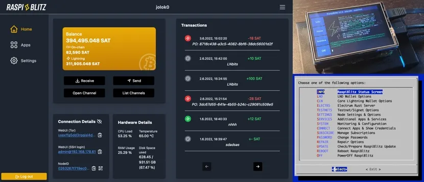

RaspiBlitz เป็นโหนดสายฟ้าแบบทำเอง (LND และ/หรือ Core Lightning) ที่ทำงานร่วมกับ Bitcoin-Fullnode บน RaspberryPi (1TB SSD) และมีหน้าจอที่สวยงามสำหรับการตั้งค่าและการตรวจสอบที่ง่ายดาย


RaspiBlitz มุ่งเน้นไปที่การเรียนรู้วิธีการรันโหนดของคุณเองแบบกระจายศูนย์จากที่บ้าน - เพราะ: ไม่ใช่โหนดของคุณ ไม่ใช่กฎของคุณ ค้นพบและพัฒนาอีโคซิสเต็มที่เติบโตของ Lightning Network โดยการเป็นส่วนหนึ่งอย่างเต็มที่ สร้างมันขึ้นมาเป็นส่วนหนึ่งของเวิร์กช็อปหรือเป็นโปรเจกต์สุดสัปดาห์ของคุณเอง


RASPIBLITZ - วิธีการรัน Lightning และ Bitcoin Full Node โดย BTC session


## คู่มือการตั้งค่า Raspiblitz ของ Parman


Raspiblitz เป็นระบบที่ยอดเยี่ยมสำหรับการรัน Bitcoin Node และแอปที่เกี่ยวข้อง ฉันแนะนำสิ่งนี้และ My Node node ให้กับผู้ใช้ส่วนใหญ่ (ควรมีสองโหนดเพื่อความซ้ำซ้อน) ข้อได้เปรียบหลักคือ Raspiblitz node เป็น “Free Open Source Software” ซึ่งแตกต่างจาก MyNode หรือ Umbrel [ทำไมถึงสำคัญ? Vlad Costa อธิบาย](https://bitcoin-takeover.com/why-bitcoin-free-open-source-software-matters/amp/?__twitter_impression=true) คุณยังสามารถรัน RaspbiBlitz ด้วยการเชื่อมต่อ WiFi แทนที่จะเป็นอีเธอร์เน็ต – นี่คือ [คู่มือเสริม](https://armantheparman.com/headless-wifi/) สำหรับสิ่งนั้น (ฉันยังไม่พบวิธีทำเช่นนี้กับ MyNode)


คุณสามารถซื้อโหนดสำเร็จรูปที่มาพร้อมกับหน้าจอขนาดเล็ก หรือคุณสามารถสร้างมันเอง (คุณไม่จำเป็นต้องมีหน้าจอ)


[คู่มือบน GitHub](https://github.com/rootzoll/raspiblitz) นั้นยอดเยี่ยม แต่บางทีอาจละเอียดเกินไปสำหรับผู้ใช้ที่มีประสบการณ์ปานกลาง คำแนะนำของฉันจะกระชับกว่าและหวังว่าจะง่ายต่อการปฏิบัติตาม


โดยพื้นฐานแล้ว กระบวนการนี้คล้ายกับกระบวนการตั้งค่า [MyNode node](https://armantheparman.com/mynode-bitcoin-node-easy-setup-guide-raspberry-pi/) ด้วย Raspberry Pi 4 มาก คู่มือ Raspiblitz แนะนำให้คุณซื้อจอภาพ แต่จริงๆ แล้วคุณไม่จำเป็นต้องมี และฉันไม่แนะนำให้ซื้อ คุณไม่จำเป็นต้องมีคีย์บอร์ดหรือเมาส์เพิ่มเติมด้วยซ้ำ เพียงแค่เข้าถึงเมนูเทอร์มินัลของอุปกรณ์ผ่านคอมพิวเตอร์ที่อยู่ในเครือข่ายเดียวกัน และใช้คำสั่ง ssh ผ่านเทอร์มินัล ซึ่งสามารถทำได้ง่ายบน Linux/Mac และยากขึ้นเล็กน้อยบน Windows


### ขั้นตอนที่ 1: ซื้ออุปกรณ์


คุณต้องใช้อุปกรณ์เดียวกันกับที่คุณต้องใช้ในการรันโหนด MyNode คุณสามารถลองใช้อย่างใดอย่างหนึ่ง ความแตกต่างเพียงอย่างเดียวคือข้อมูลบนการ์ด micro SD


- Raspberry Pi 4, หน่วยความจำ 4Gb หรือ 8Gb (4Gb เพียงพอแล้ว)
- Official Raspberry Pi Power (สำคัญมาก! อย่าใช้ของทั่วไป, จริงจังนะ)
- เคสสำหรับ Pi (เคส FLIRC นั้นยอดเยี่ยมมาก เคสทั้งหมดทำหน้าที่เป็นฮีทซิงค์และคุณไม่จำเป็นต้องใช้พัดลมซึ่งอาจมีเสียงดัง)
- การ์ด microSD ขนาด 32 Gb (คุณต้องการหนึ่งอัน แต่มีหลายอันก็สะดวก)
- เครื่องอ่านการ์ดหน่วยความจำ (คอมพิวเตอร์ส่วนใหญ่จะไม่มีช่องสำหรับการ์ด microSD)
- External SSD 1Tb hard drive.
- สายเคเบิลอีเธอร์เน็ต (เพื่อเชื่อมต่อกับเราเตอร์ที่บ้านของคุณ)


คุณไม่จำเป็นต้องมีจอภาพ (หรือคีย์บอร์ดหรือเมาส์)


หมายเหตุ: นี่คือฮาร์ดไดรฟ์ที่ผิด: นี่คือฮาร์ดไดรฟ์ภายนอกแบบพกพา ไม่ใช่ SSD SSD มีความสำคัญ นี่คือเหตุผลที่มันราคาถูก (ราคาเป็น AUD)


นี่คือประเภทที่ถูกต้องที่จะได้รับ:


นี่เร็วกว่านี้ แต่มีราคาแพงโดยไม่จำเป็น:


### ขั้นตอนที่ 2: ดาวน์โหลดภาพ Raspiblitz


ไปที่ [เว็บไซต์ Raspiblitz github](https://github.com/rootzoll/raspiblitz) และค้นหาลิงก์ “download image”:


แฮช sha-256 ของไฟล์ที่ดาวน์โหลดมีให้บนเว็บไซต์ มันจะเปลี่ยนไปกับการอัปเดตแต่ละครั้ง หากคุณไม่เข้าใจว่านี่เกี่ยวกับอะไร คุณควรเข้าใจ ดังนั้นฉันจึงเขียน[คู่มือที่คุณสามารถอ่านได้ที่นี่](https://armantheparman.com/gpg/)


### ขั้นตอนที่ 3: ตรวจสอบภาพ


ก่อนดำเนินการต่อ หากคุณไม่รู้วิธีการใช้ระบบไฟล์บนบรรทัดคำสั่ง มันเรียนรู้ได้ง่าย และคุณควรเรียนรู้


นี่คือ[วิดีโอที่มีประโยชน์สำหรับ Linux แต่ใช้กับ Mac ได้เช่นกัน](https://youtu.be/id3DGvljhT4?list=PLtK75qxsQaMLZSo7KL-PmiRarU7hrpnwK)


สำหรับ Windows นี่คือ [บทแนะนำง่ายๆ](https://www.youtube.com/watch?v=MBBWVgE0ewk&t=1s)


_UPDATE: pgp/gpg verification is now available. You’ll need Openoms’s public key. [Here](http://parman.org/downloadable/openoms.txt) it is (you might need incognito mode for the link to work – http, not https)_


Mac/Linux


รอให้ไฟล์ดาวน์โหลดเสร็จ (สำคัญ!) จากนั้นเปิดเทอร์มินัล นำทางไปยังตำแหน่งที่คุณดาวน์โหลดไฟล์ และพิมพ์คำสั่งต่อไปนี้:

```bash
shasum -a 256 xxxxxxxxxxxxxx
```


where `xxxxxxxxxxxxxx` is the name of the file you just downloaded. If you are not in the directory where that file is, you have to type the full path.


คอมพิวเตอร์คิดเป็นเวลา 20 วินาทีหรือประมาณนั้น ตรวจสอบว่าไฟล์แฮชที่ได้ตรงกับไฟล์ที่ดาวน์โหลดจากเว็บไซต์ในขั้นตอนก่อนหน้า หากตรงกัน คุณสามารถดำเนินการต่อได้

Windows


เปิด Command Prompt และไปที่ตำแหน่งที่ไฟล์ถูกดาวน์โหลด จากนั้นพิมพ์คำสั่งนี้:


```bash
certUtil -hashfile xxxxxxxxxxxxxxx SHA256
```


where `xxxxxxxxxxxxxx` is the name of the file you just downloaded. If you are not in the director where that file is, you have to type the full path.


คอมพิวเตอร์คิดเป็นเวลา 20 วินาทีหรือประมาณนั้น ตรวจสอบว่าไฟล์แฮชที่ได้ตรงกับไฟล์ที่ดาวน์โหลดจากเว็บไซต์ในขั้นตอนก่อนหน้า หากเหมือนกัน คุณสามารถดำเนินการต่อได้


### ขั้นตอนที่ 4: Flash การ์ด SD


คุณสามารถใช้ Balena Etcher เพื่อทำสิ่งนี้ได้ [ดาวน์โหลดที่นี่](https://www.balena.io/etcher/)


Etcher ใช้งานได้ง่ายและเข้าใจได้ด้วยตนเอง ใส่การ์ด micro SD ของคุณและแฟลชซอฟต์แวร์ Raspiblitz (.img file) ลงบนการ์ด SD


เมื่อเสร็จสิ้นแล้ว ไดรฟ์จะไม่สามารถอ่านได้อีกต่อไป คุณอาจได้รับข้อผิดพลาดจากระบบปฏิบัติการ และไดรฟ์ควรหายไปจากเดสก์ท็อป ดึงการ์ดออก


### ขั้นตอนที่ 5: ตั้งค่า Pi และใส่การ์ด SD


ชิ้นส่วน (ไม่แสดงเคส):


เชื่อมต่อสายอีเธอร์เน็ตและตัวเชื่อมต่อ USB ของฮาร์ดไดรฟ์ (ยังไม่ต้องเชื่อมต่อพลังงาน) หลีกเลี่ยงการเชื่อมต่อกับพอร์ต USB สีฟ้าตรงกลาง เพราะเป็น USB 3 ใช้พอร์ต USB 2 แม้ว่าฮาร์ดไดรฟ์อาจรองรับ USB 3 (มีความน่าเชื่อถือมากกว่า)


การ์ด micro SD ใส่ตรงนี้:


สุดท้ายนี้ เชื่อมต่อพลังงาน:


### ขั้นตอนที่ 6: ค้นหาที่อยู่ IP ของ Pi


คุณไม่จำเป็นต้องมีหน้าจอสำหรับ Raspiblitz อย่างไรก็ตาม คุณจำเป็นต้องมีคอมพิวเตอร์เครื่องอื่นในเครือข่ายภายในบ้าน หาก Pi ของคุณไม่ได้เชื่อมต่อผ่านอีเธอร์เน็ต และคุณต้องการพึ่งพา WiFi การค้นหา IP จะต้องใช้ทักษะคอมพิวเตอร์บางอย่าง ขอโทษที่ช่วยไม่ได้ คุณจำเป็นต้องมีการเชื่อมต่ออีเธอร์เน็ต (ปัญหามาจากการที่ต้องการเข้าถึงหน้าจอและระบบปฏิบัติการเพื่อเชื่อมต่อ WiFi และป้อนรหัสผ่าน)


ตรวจสอบเราเตอร์ของคุณเพื่อดูรายการ IP ทั้งหมดของอุปกรณ์ที่เชื่อมต่อทั้งหมด


ฉันพิมพ์ 192.168.0.1 ในเบราว์เซอร์ (ตามคำแนะนำที่มาพร้อมกับเราเตอร์ของฉัน) เข้าสู่ระบบ และสามารถเห็นอุปกรณ์ของฉันที่มี IP 192.168.0.191 โปรดทราบว่า IP เหล่านี้ไม่สามารถมองเห็นได้ต่อสาธารณะบนอินเทอร์เน็ต (พวกมันจะผ่านเราเตอร์ก่อน) พวกมันเป็นเพียงตัวระบุสำหรับอุปกรณ์ในเครือข่ายภายในบ้านของคุณเท่านั้น


การค้นหา IP เป็นสิ่งสำคัญ


**หมายเหตุ:** คุณสามารถใช้เทอร์มินัลบนเครื่อง Mac หรือ Linux เพื่อค้นหาที่อยู่ IP ของอุปกรณ์ที่เชื่อมต่อผ่าน Ethernet ทั้งหมดในเครือข่ายภายในบ้านโดยใช้คำสั่ง “arp -a” ผลลัพธ์ที่ได้อาจไม่สวยงามเท่ากับที่เราเตอร์จะแสดง แต่ข้อมูลทั้งหมดที่คุณต้องการอยู่ที่นั่น หากไม่ชัดเจนว่าอันไหนคือ Pi ให้ลองผิดลองถูกดู


### ขั้นตอนที่ 7: SSH เข้าไปใน Pi


อย่าลืมใส่การ์ด SD ลงใน Pi ก่อนเปิดเครื่อง รอสักครู่ จากนั้นบน Linux/Mac เครื่องอื่น ให้เปิดเทอร์มินัลขึ้นมา


สำหรับ Mac/Linux ในเทอร์มินัลพิมพ์:


```bash
ssh admin@You_Pi's_IP_address
```


สำหรับ Windows คุณจะต้องติดตั้ง [putty](http://putty.org/) เพื่อ ssh เข้าไปใน Pi พิมพ์คำสั่งเดียวกันกับด้านบน


ครั้งแรกที่คุณทำเช่นนี้ หรือเมื่อใดก็ตามที่คุณเปลี่ยนระบบปฏิบัติการของ Pi โดยการเปลี่ยนการ์ด SD คุณอาจจะได้รับหรือไม่ก็ได้ข้อผิดพลาดนี้…


วิธีแก้ไขคือไปที่ตำแหน่งที่ไฟล์ “known_hosts” อยู่ (มันบอกคุณในข้อความแสดงข้อผิดพลาด) และลบมัน คำสั่งคือ "rm known_hosts"


จากนั้น ให้ทำคำสั่ง ssh ซ้ำเพื่อเข้าสู่ระบบ สิ่งนี้จะเกิดขึ้น…


พิมพ์ใช่ (คำเต็ม) เพื่อดำเนินการต่อ


หากสำเร็จ คุณจะถูกขอให้ใส่รหัสผ่าน นี่ไม่ใช่สำหรับคอมพิวเตอร์ของคุณ แต่สำหรับ raspiblitz รหัสผ่านทั่วไปคือ “raspiblitz” และคุณจะเปลี่ยนในภายหลัง หน้าต่างเทอร์มินัลจะเปลี่ยนเป็นสีน้ำเงินและคุณจะมีตัวเลือกเมนูเหมือนเมนู DOS เก่า นำทางด้วยปุ่มลูกศรหรือเมาส์


ทำตามคำแนะนำ ตั้งรหัสผ่านของคุณ จากนั้นระบบจะตรวจจับฮาร์ดไดรฟ์ของคุณและให้ตัวเลือกในการฟอร์แมตหากจำเป็น


จากนั้นคุณจะถูกถามว่าต้องการคัดลอกข้อมูลบล็อกเชนจากแหล่งอื่นหรือดาวน์โหลดใหม่ การคัดลอกเป็นกระบวนการเรียนรู้และคำแนะนำค่อนข้างดี และควรเก็บไว้ใกล้มือ...


วิธีที่ง่ายแต่ช้ากว่าคือการดาวน์โหลดทั้งเชนตั้งแต่เริ่มต้น…


ข้อความจำนวนมากจะปรากฏขึ้นบนหน้าจอเทอร์มินัล คุณอาจเข้าใจผิดว่าเป็นกระบวนการดาวน์โหลดบล็อกเชน แต่สำหรับฉันแล้ว มันดูเหมือนกำลังสร้างกุญแจส่วนตัวสำหรับการสื่อสาร


จากนั้นตัวเลือกสายฟ้าจะปรากฏขึ้น


สร้างรหัสผ่านใหม่เพื่อล็อคไฟ wallet ของคุณ จากนั้นจะมีการสร้าง wallet ใหม่และคุณจะได้รับคำ 24 คำเพื่อจดบันทึก…


อย่าลืมจดบันทึกและเก็บรักษาให้ปลอดภัย ฉันเคยได้ยินเรื่องของคนหนึ่งที่ไม่ได้ทำเช่นนั้นเพราะเขาไม่ได้วางแผนที่จะใช้ lightning แต่แล้วหนึ่งปีต่อมาตัดสินใจที่จะใช้มันและเปิดช่องทาง จากนั้นก็ตระหนักว่าคำของเขาไม่ได้รับการสำรองข้อมูล และฉันจำได้ว่ามันไม่สามารถดึงคำเหล่านั้นออกจากอุปกรณ์ได้อีก เขาต้องปิดช่องทางทั้งหมดและเริ่มใหม่ เขารอดพ้นไปได้ แต่คนอื่นอาจจะไม่โชคดีเช่นนั้น


หลังจากนั้น ข้อความเลื่อนลงมาที่หน้าต่างเทอร์มินัลไม่กี่นาที แล้ว…


คุณจะถูกออกจากระบบเซสชัน ssh ให้เข้าสู่ระบบอีกครั้ง คราวนี้ด้วยรหัสผ่านใหม่ของคุณ รหัสผ่าน A เมื่อเข้าสู่ระบบแล้ว คุณจะถูกขอให้ใส่รหัสผ่าน C เพื่อปลดล็อก lightning wallet ของคุณ


ตอนนี้เรารอ เจอกันใน 2 สัปดาห์ คุณสามารถปิดเทอร์มินัลได้ มันไม่ได้ทำอะไรกับ Pi มันเป็นแค่หน้าต่างสื่อสารเท่านั้น


หากด้วยเหตุผลใดก็ตาม คุณต้องการปิดเครื่อง Pi ก่อนที่การดาวน์โหลดบล็อกเชนจะเสร็จสิ้น ก็ไม่เป็นไรตราบใดที่คุณทำอย่างถูกต้อง บล็อกเชนจะดำเนินการดาวน์โหลดต่อจากจุดที่ค้างไว้เมื่อคุณเชื่อมต่อใหม่


กด CTRL+c เพื่อออกจากหน้าจอสีน้ำเงิน คุณจะเข้าสู่เทอร์มินัล Linux ของ Pi ที่นี่คุณสามารถพิมพ์ "menu" ซึ่งจะโหลดหน้าจอต่อไปนี้ และจากนั้นคุณสามารถปิดเครื่อง Pi ได้


สิ้นสุดคู่มือ


ดังนั้นจากนี้ไปโหนดของคุณพร้อมใช้งานแล้ว หากคุณยังต้องการความช่วยเหลือในการนำทางตัวเลือกเพิ่มเติม โปรดดูที่ github สำหรับบทเรียนและคำแนะนำเพิ่มเติม https://github.com/raspiblitz/raspiblitz#feature-documentation