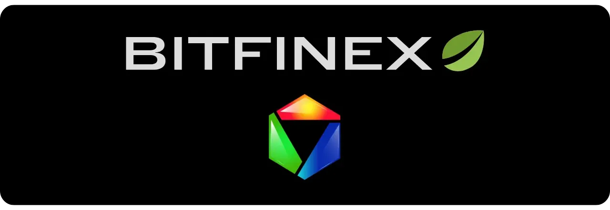
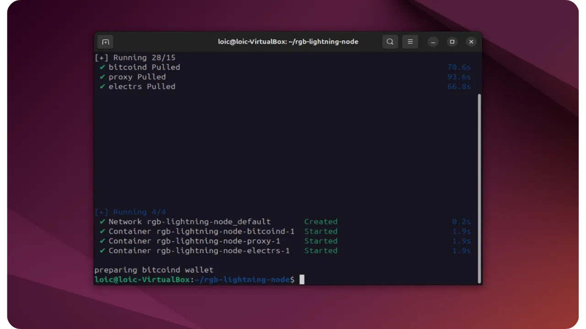
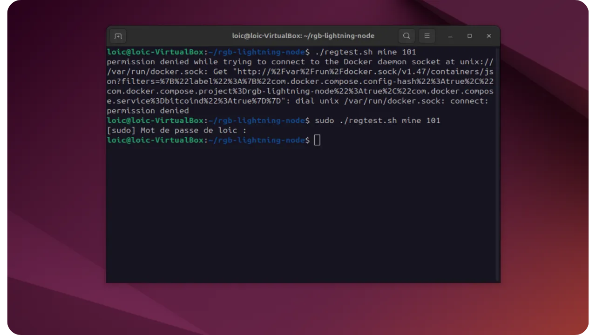
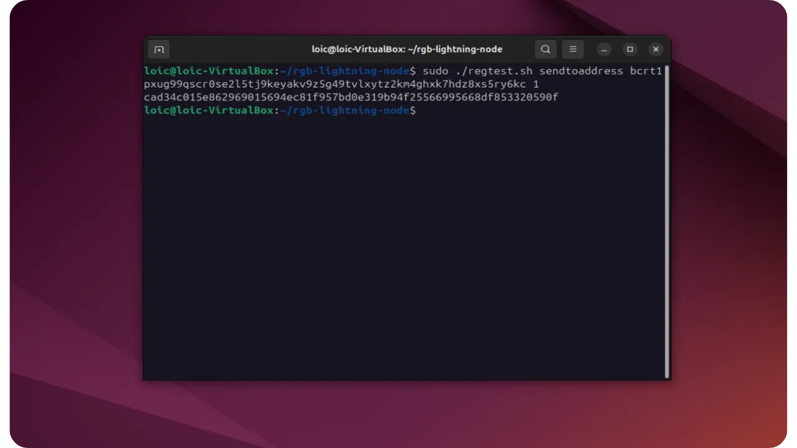
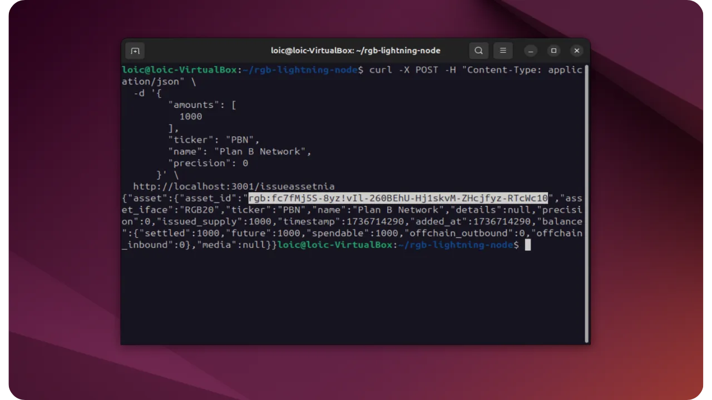
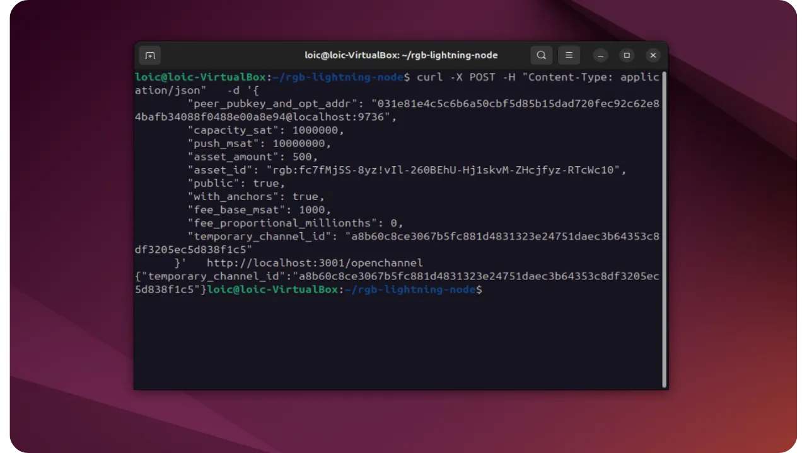
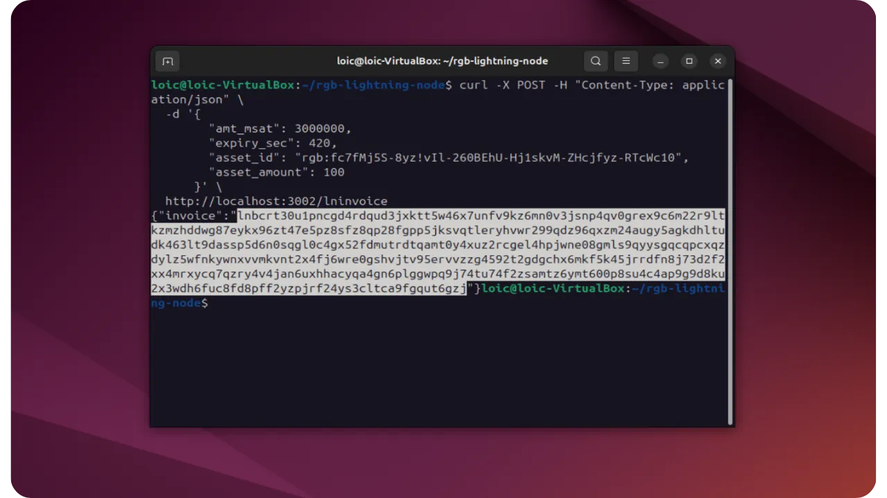

Bu adım adım eğitimde, Regtest ortamında bir Lightning RGB düğümünün nasıl kurulacağını öğreneceksiniz. RGB token'larının nasıl oluşturulacağını ve kanallarda nasıl dolaştırılacağını göreceğiz.


## RLN projesi


Bitfinex'in RGB ekibi, eksiksiz bir teknoloji yığını geliştirerek RGB ekosistemini zenginleştirmek için 2022'den beri çalışıyor. Tek bir ticari ürün hedeflemek yerine, çabaları açık kaynaklı yazılım tuğlalarını kullanılabilir hale getirmeye, RGB protokol spesifikasyonlarına katkıda bulunmaya ve uygulama referansları oluşturmaya odaklanmıştır.


Bitfinex'in RGB ekosistemine kayda değer katkıları arasında, Rust'te yazılmış ve karmaşık doğrulama ve katılım mekanizmalarını kapsülleyerek RGB uygulamalarının geliştirilmesini büyük ölçüde basitleştiren Kotlin ve Python'daki bağlamalar aracılığıyla erişilebilen [*RGBlib* kütüphanesi] (https://github.com/RGB-Tools/RGB-lib) bulunmaktadır.


Bitfinex ekibi ayrıca Android'de kullanılabilen "[*Iris Wallet*](https://iriswallet.com/)" adlı bir RGB mobil Wallet tasarladı. Bu Wallet, RGB üzerinde *Client-side Validation* için off-chain veri alışverişlerini (*satışlar*) kolayca yönetmek üzere bir RGB proxy sunucusunun kullanımını entegre etmektedir.


Bitfinex ayrıca `RGB-lightning-node` (RLN) projesini de geliştirmiştir. Bu, bir kanaldaki Rust varlıklarının varlığını hesaba katmak için değiştirilmiş bir `Rust-lightning` (LDK) Fork'ye dayanan bir Rust daemon'dir. Bir kanal açıldığında, RGB belirteçlerinin varlığı belirtilebilir ve kanal durumu her güncellendiğinde, Lightning çıktılarındaki belirteçlerin dağılımını yansıtan bir State Transition oluşturulur. Bu sayede :


- Örneğin USDT'de Lightning kanalları açın;
- Yönlendirme yollarının yeterli likiditeye sahip olması koşuluyla, bu tokenları ağ üzerinden yönlendirin;
- Lightning'in ceza ve zaman kilidi mantığından değişiklik yapmadan yararlanın: Commitment Transaction'in ek bir çıkışında RGB geçişini Anchor yapmanız yeterlidir.


RLN kodu hala alfa aşamasındadır: sadece **regtest** veya **Testnet** üzerinde kullanmanızı öneririz.


## RGB protokol hatırlatması


RGB, Bitcoin'in üzerinde çalışan ve dayandığı Blockchain'e aşırı yük bindirmeden Smart contract işlevselliğini ve dijital varlık yönetimini taklit eden bir protokoldür. Geleneksel On-Chain akıllı sözleşmelerinin aksine (örneğin Ethereum'da olduğu gibi), RGB bir "*Client-side Validation*" sistemine dayanır: verilerin ve durum geçmişlerinin çoğu yalnızca ilgili katılımcılar tarafından değiş tokuş edilir ve saklanırken, Bitcoin Blockchain yalnızca küçük kriptografik taahhütleri barındırır (*Tapret* veya *Opret* gibi mekanizmalar aracılığıyla). RGB protokolünde, Bitcoin Blockchain bu nedenle yalnızca zaman damgası sunucusu ve Double-spending koruma sistemi olarak hizmet vermektedir.


Bir RGB Contract evrimsel bir durum makinesi gibi yapılandırılmıştır. Başlangıç durumunu (örneğin Supply, ticker veya diğer meta verileri tanımlayan) katı bir şekilde yazılmış ve derlenmiş bir Schema'e göre tanımlayan bir Genesis ile başlar. Daha sonra bu durumu değiştirmek veya genişletmek için Durum Geçişleri ve gerekirse Durum Uzantıları uygulanır. İster değiştirilebilir varlıkların aktarılması (RGB20) ister benzersiz varlıkların oluşturulması (RGB21) olsun, her işlem *Tek kullanımlık Mühürler* içerir. Bunlar Bitcoin UTXO'ları off-chain durumlarına bağlar ve gizlilik ve ölçeklenebilirlik sağlarken çifte harcamayı önler.


RGB protokolünün nasıl çalıştığı hakkında daha fazla bilgi edinmek için bu kapsamlı eğitim kursuna katılmanızı tavsiye ederim:


https://planb.network/courses/3ce1d37c-05ba-4f54-aa15-7586d37b2bb7

## RGB uyumlu Lightning düğümü kurulumu


RGB-lightning-node` ikilisini derlemek ve kurmak için, depoyu ve alt modüllerini klonlayarak başlıyoruz, ardından :


```bash
git clone https://github.com/RGB-Tools/rgb-lightning-node --recurse-submodules --shallow-submodules
```


- Recurse-submodules` seçeneği de gerekli alt aygıtları klonlar (`Rust-lightning`in değiştirilmiş sürümü dahil);
- Shallow-submodules' seçeneği, indirmeyi hızlandırmak için klonun derinliğini kısıtlarken, yine de temel taahhütlere erişim sağlar.


Proje kökünden, ikili dosyayı derlemek ve yüklemek için aşağıdaki komutu çalıştırın :


```bash
cargo install --locked --debug --path .
```


- locked` bağımlılıkların sürümüne uyulmasını sağlar;
- `--debug` zorunlu değildir, ancak odaklanmanıza yardımcı olabilir (tercih ederseniz `--release` kullanabilirsiniz) ;
- `--path .`, `cargo install`a geçerli dizinden yükleme yapmasını söyler.


Bu komutun sonunda, `$CARGO_HOME/bin/` dizininizde bir `RGB-lightning-node` çalıştırılabilir dosyası bulunacaktır. Bu yolun `$PATH` içinde olduğundan emin olun, böylece komutu herhangi bir dizinden çağırabilirsiniz.


## Ön Koşullar


Çalışması için `RGB-lightning-node` daemon'un varlığına ve yapılandırılmasına ihtiyaç duyar:


- Bir `bitcoind`** düğümü


Her RLN örneğinin On-Chain işlemlerini yayınlamak ve izlemek için `bitcoind` ile iletişim kurması gerekecektir. Kimlik doğrulama (giriş/parola) ve URL'nin (ana bilgisayar/port) daemon'e sağlanması gerekecektir.


- Bir indeksleyici** (Electrum veya Esplora)


daemon, özellikle bir varlığın sabitlendiği UTXO'yi bulmak için On-Chain işlemlerini listeleyebilmeli ve keşfedebilmelidir. Electrum sunucunuzun veya Esplora'nın URL'sini belirtmeniz gerekir.


- Bir RGB** proxy


Proxy sunucusu, Lightning eşleri arasındaki Exchange RGB *atamalarını* basitleştirmek için bir bileşendir (isteğe bağlı, ancak şiddetle tavsiye edilir). Bir kez daha, bir URL belirtilmelidir.


Kimlikler ve URL'ler, daemon API aracılığıyla *kilidi açıldığında* girilir.


## Regtest lansmanı


Basit kullanım için, Docker aracılığıyla bir dizi hizmeti otomatik olarak başlatan bir `regtest.sh` betiği vardır: `bitcoind`, `electrs` (dizinleyici), `RGB-proxy-server`.


Bu, yerel, yalıtılmış, önceden yapılandırılmış bir ortam başlatmanıza olanak tanır. Her yeniden başlatmada kapsayıcıları ve veri dizinlerini oluşturur ve yok eder. Başlamak için :


```bash
./regtest.sh start
```


Bu komut dosyası :


- Depolamak için bir `docker/` dizini oluşturun ;
- Regtest'te `bitcoind'ün yanı sıra indeksleyici `electrs` ve `RGB-proxy-server'ı çalıştırın;
- Her şey kullanıma hazır olana kadar bekleyin.





Daha sonra, birkaç RLN düğümü başlatacağız. Ayrı kabuklarda, örneğin çalıştırın (3 RLN düğümü başlatmak için) :


```bash
# 1st shell
rgb-lightning-node dataldk0/ --daemon-listening-port 3001 \
--ldk-peer-listening-port 9735 --network regtest
# 2nd shell
rgb-lightning-node dataldk1/ --daemon-listening-port 3002 \
--ldk-peer-listening-port 9736 --network regtest
# 3rd shell
rgb-lightning-node dataldk2/ --daemon-listening-port 3003 \
--ldk-peer-listening-port 9737 --network regtest
```


- Ağ regtest` parametresi regtest yapılandırmasının kullanılacağını gösterir;
- `--daemon-listening-port` Lightning düğümünün API çağrıları için hangi REST bağlantı noktasını dinleyeceğini gösterir (JSON);
- `--ldk-peer-listening-port` hangi Lightning P2P bağlantı noktasının dinleneceğini belirtir;
- `dataldk0/`, `dataldk1/` depolama dizinlerine giden yollardır (her düğüm bilgilerini ayrı ayrı depolar).


API sayesinde artık tarayıcınızdan RLN düğümleriniz üzerinde komutlar çalıştırabilirsiniz. Özellikle, daemonların kilidini *açabileceğiniz* yer burasıdır. Düğümlerinizle aynı bilgisayarda bir tarayıcı açmanız ve URL'yi girmeniz yeterlidir :


```url
https://rgb-tools.github.io/rgb-lightning-node/
```


Bir düğümün bir kanal açabilmesi için öncelikle aşağıdaki komutla oluşturulan bir Address üzerinde bitcoinlere sahip olması gerekir (örneğin n°1 düğümü için):


```bash
curl -X POST http://localhost:3001/address
```


Cevap size bir Address sağlayacaktır.


bitcoind' Regtest'te birkaç bitcoin madenciliği yapacağız. Çalıştır :


```bash
./regtest.sh mine 101
```





Yukarıda oluşturulan Address düğümüne para gönderin:


```bash
./regtest.sh sendtoaddress <address> <amount>
```





Ardından işlemi onaylamak için bir blok kazın:


```bash
./regtest.sh mine 1
```


## Testnet başlatma (Docker olmadan)


Daha gerçekçi bir senaryoyu test etmek istiyorsanız, RLN düğümlerini Regtest yerine Testnet'te başlatabilir, genel hizmetlere veya kontrol ettiğiniz hizmetlere işaret edebilirsiniz:


```bash
rgb-lightning-node dataldk0/ --daemon-listening-port 3001 \
--ldk-peer-listening-port 9735 --network testnet
rgb-lightning-node dataldk1/ --daemon-listening-port 3002 \
--ldk-peer-listening-port 9736 --network testnet
rgb-lightning-node dataldk2/ --daemon-listening-port 3003 \
--ldk-peer-listening-port 9737 --network testnet
```


Varsayılan olarak, herhangi bir yapılandırma bulunamazsa, daemon :


- `bitcoind_rpc_host`: `electrum.iriswallet.com`
- `bitcoind_rpc_port`: `18332`
- indexer_url`: `ssl://electrum.iriswallet.com:50013`
- `proxy_endpoint`: `rpcs://proxy.iriswallet.com/0.2/json-RPC`


Giriş ile :


- `bitcoind_rpc_username`: `user`
- `bitcoind_rpc_username`: `password`


Bu Elements'yı `init`/`unlock` API'si aracılığıyla da özelleştirebilirsiniz.


## Bir RGB token düzenlenmesi


Bir token yayınlamak için, "renklendirilebilir" UTXO'lar oluşturarak başlayacağız:


```bash
curl -X POST -H "Content-Type: application/json" \
-d '{
"up_to": false,
"num": 4,
"size": 2000000,
"fee_rate": 4.2,
"skip_sync": false
}' \
http://localhost:3001/createutxos
```


Elbette siparişi uyarlayabilirsiniz. İşlemi onaylamak için bir :


```bash
./regtest.sh mine 1
```


Şimdi bir RGB varlığı oluşturabiliriz. Komut, oluşturmak istediğiniz varlığın türüne ve parametrelerine bağlı olacaktır. Burada 1000 birimlik bir Supply ile "PBN" adında bir NIA (*Şişirilemeyen Varlık*) token oluşturuyorum. Hassasiyet' birimlerin bölünebilirliğini tanımlamanıza olanak tanır.


```bash
curl -X POST -H "Content-Type: application/json" \
-d '{
"amounts": [
1000
],
"ticker": "PBN",
"name": "Plan B Network",
"precision": 0
}' \
http://localhost:3001/issueassetnia
```


Yanıt, yeni oluşturulan varlığın kimliğini içerir. Bu tanımlayıcıyı not etmeyi unutmayın. Benim durumumda, :


```txt
rgb:fc7fMj5S-8yz!vIl-260BEhU-Hj1skvM-ZHcjfyz-RTcWc10
```





Daha sonra bunu On-Chain'e aktarabilir veya bir Lightning kanalına tahsis edebilirsiniz. Bir sonraki bölümde yapacağımız şey tam olarak bu.


## Bir kanal açma ve bir RGB varlığını aktarma


Önce `/connectpeer` komutunu kullanarak düğümünüzü Lightning Network üzerindeki bir eşe bağlamanız gerekir. Benim örneğimde, her iki düğümü de kontrol ediyorum. Bu yüzden ikinci Lightning düğümümün açık anahtarını bu komutla alacağım:


```bash
curl -X 'GET' \
'http://localhost:3002/nodeinfo' \
-H 'accept: application/json'
```


Komut, node n°2'nin açık anahtarını döndürür:


```txt
031e81e4c5c6b6a50cbf5d85b15dad720fec92c62e84bafb34088f0488e00a8e94
```


Daha sonra, ilgili varlığı (`PBN`) belirterek kanalı açacağız. Openchannel` komutu, kanalın boyutunu satoshis cinsinden tanımlamanıza ve RGB varlığını dahil etmeyi seçmenize olanak tanır. Ne oluşturmak istediğinize bağlı, ancak benim durumumda komut :


```bash
curl -X POST -H "Content-Type: application/json" \
-d '{
"peer_pubkey_and_opt_addr": "031e81e4c5c6b6a50cbf5d85b15dad720fec92c62e84bafb34088f0488e00a8e94@localhost:9736",
"capacity_sat": 1000000,
"push_msat": 10000000,
"asset_amount": 500,
"asset_id": "rgb:fc7fMj5S-8yz!vIl-260BEhU-Hj1skvM-ZHcjfyz-RTcWc10",
"public": true,
"with_anchors": true,
"fee_base_msat": 1000,
"fee_proportional_millionths": 0,
"temporary_channel_id": "a8b60c8ce3067b5fc881d4831323e24751daec3b64353c8df3205ec5d838f1c5"
}' \
http://localhost:3001/openchannel
```


Daha fazlasını burada bulabilirsiniz:


- `peer_pubkey_and_opt_addr`: Bağlanmak istediğimiz eşin tanımlayıcısı (daha önce bulduğumuz açık anahtar);
- `capacity_sat`: Satoshi cinsinden toplam kanal kapasitesi;
- `push_msat`: Kanal açıldığında başlangıçta eşe aktarılan milisatoshis cinsinden miktar (burada hemen 10.000 Sats aktarıyorum, böylece daha sonra bir RGB aktarımı yapabilir) ;
- `asset_amount`: Kanala taahhüt edilecek RGB varlıklarının miktarı ;
- `asset_id` : Kanalda yer alan RGB varlığının benzersiz tanımlayıcısı;
- `public`: Kanalın ağ üzerinde yönlendirme için herkese açık hale getirilip getirilmeyeceğini belirtir.





İşlemi onaylamak için 6 blok çıkarılır:


```bash
./regtest.sh mine 6
```


Lightning kanalı artık açıktır ve ayrıca n°1 düğümü tarafında 500 `PBN` jetonu içerir. Eğer n°2 düğümü `PBN` jetonlarını almak isterse, generate ve Invoice yapmalıdır. İşte nasıl yapılacağı:


```bash
curl -X POST -H "Content-Type: application/json" \
-d '{
"amt_msat": 3000000,
"expiry_sec": 420,
"asset_id": "rgb:fc7fMj5S-8yz!vIl-260BEhU-Hj1skvM-ZHcjfyz-RTcWc10",
"asset_amount": 100
}' \
http://localhost:3002/lninvoice
```


Ile :


- `amt_msat`: Milisatoshis cinsinden Invoice miktarı (minimum 3000 Sats) ;
- `expiry_sec` : Saniye cinsinden Invoice sona erme süresi;
- `asset_id` : Invoice ile ilişkili RGB varlığının tanımlayıcısı;
- varlık_miktarı`: Bu Invoice ile aktarılacak RGB varlığının tutarı.


Yanıt olarak bir RGB Invoice alacaksınız:


```txt
lnbcrt30u1pncgd4rdqud3jxktt5w46x7unfv9kz6mn0v3jsnp4qv0grex9c6m22r9ltkzmzhddwg87eykx96zt47e5pz8sfz8qp28fgpp5jksvqtleryhvwr299qdz96qxzm24augy5agkdhltudk463lt9dassp5d6n0sqgl0c4gx52fdmutrdtqamt0y4xuz2rcgel4hpjwne08gmls9qyysgqcqpcxqzdylz5wfnkywnxvvmkvnt2x4fj6wre0gshvjtv95ervvzzg4592t2gdgchx6mkf5k45jrrdfn8j73d2f2xx4mrxycq7qzry4v4jan6uxhhacyqa4gn6plggwpq9j74tu74f2zsamtz6ymt600p8su4c4ap9g9d8ku2x3wdh6fuc8fd8pff2yzpjrf24ys3cltca9fgqut6gzj
```





Şimdi bu Invoice'yi, `PBN` token ile gerekli nakdi tutan ilk düğümden ödeyeceğiz:


```bash
curl -X POST -H "Content-Type: application/json" \
-d '{
"invoice": "lnbcrt30u1pncgd4rdqud3jxktt5w46x7unfv9kz6mn0v3jsnp4qv0grex9c6m22r9ltkzmzhddwg87eykx96zt47e5pz8sfz8qp28fgpp5jksvqtleryhvwr299qdz96qxzm24augy5agkdhltudk463lt9dassp5d6n0sqgl0c4gx52fdmutrdtqamt0y4xuz2rcgel4hpjwne08gmls9qyysgqcqpcxqzdylz5wfnkywnxvvmkvnt2x4fj6wre0gshvjtv95ervvzzg4592t2gdgchx6mkf5k45jrrdfn8j73d2f2xx4mrxycq7qzry4v4jan6uxhhacyqa4gn6plggwpq9j74tu74f2zsamtz6ymt600p8su4c4ap9g9d8ku2x3wdh6fuc8fd8pff2yzpjrf24ys3cltca9fgqut6gzj"
}' \
http://localhost:3001/sendpayment
```


Ödeme yapılmıştır. Bu, şu komutu çalıştırarak doğrulanabilir :


```bash
curl -X 'GET' \
'http://localhost:3001/listpayments' \
-H 'accept: application/json'
```


RGB varlıklarını taşımak üzere modifiye edilmiş bir Lightning düğümünün nasıl konuşlandırılacağı aşağıda açıklanmıştır. Bu gösterim, :


- Bir regtest ortamı (`./regtest.sh` aracılığıyla) veya Testnet ;
- Bir `bitcoind`, bir dizinleyici ve bir `RGB-proxy-server` tabanlı bir Lightning düğümü (`RGB-lightning-node`);
- Kanal açma/kapama, token verme, Lightning aracılığıyla varlık aktarma vb. için bir dizi JSON REST API'si.


Bu süreç sayesinde :


- Yıldırım angajman işlemleri, bir RGB geçişinin sabitlenmesiyle birlikte ek bir çıktı (OP_RETURN veya Taproot) içerir;
- Transferler, geleneksel Lightning ödemeleriyle tamamen aynı şekilde, ancak bir RGB token eklenerek yapılır;
- Birden fazla RLN düğümü, yol üzerinde hem bitcoin hem de RGB varlığında yeterli likidite olması koşuluyla, birden fazla düğüm arasında ödemeleri yönlendirmek ve denemek için bağlanabilir.


Bu öğreticiyi yararlı bulduysanız, aşağıya bir Green başparmağı koyarsanız çok minnettar olurum. Lütfen bu makaleyi sosyal ağlarınızda paylaşmaktan çekinmeyin. Çok teşekkür ederim!


RGB Contract oluşturmak için LNP/BP derneği tarafından geliştirilen RGB CLI aracının nasıl kullanılacağını açıkladığım bu diğer öğreticiyi de tavsiye ederim:


https://planb.network/tutorials/node/others/rgb-cli-1f8a28d4-fa99-4261-9d80-48275b496fd4