*Ehe inyigisho y'amasanamu ivuye muri Bitcoiner yo mu Bumanuko, inyigisho y'amasanamu yerekana ingene woshiraho no gukoresha server y'umuntu ku giti ciwe Start9 / StartOS, n'ingene wokoresha node ya bitcoin.*


## 1️⃣ Intangamarara


### None Start9 ni iki nyabuna?


Start9 ni ishirahamwe ryashinzwe mu mwaka w’2020, rizwi cane mu gutegura [**StartOS**,](https://github.com/Start9Labs/start-os) ubuhinga bwo gukoresha Linux bugenewe ama server y’abantu ku giti cabo. Bituma abakoresha bashobora kwikorera mu buryo bworoshe ibikorwa vyinshi vy’amaporogarama—nk’ibikoresho vya Bitcoin na Lightning, porogarama zo gutumako ubutumwa canke abacungera amajambo y’ibanga, mu gihe bagumana ububasha bwose ku makuru yabo no gukuraho kwizigira amaporogarama y’ubuhinga bwa none. StartOS ifise uburyo bwo gukoresha, bushingiye ku mucukumbuzi, Isoko ry’ugushiramwo ibikorwa, n’ibikoresho vy’ubuzima bwite vyubatswemwo nk’ugushiramwo Tor n’ugushiramwo amakuru ya HTTPS muri sisitemu yose. Start9 kandi itanga ibikoresho vy’ubuhinga bwa none vyashizwemwo OS, naho nyene iyo porogarama ishobora gushirwa ku bikoresho bihuye canke ku mashini zisanzwe (VMs).


### Ni ubuhe buryo bwo kubigira?


Start9 itanga uburyo bwo gukoresha imbere y’igihe n’ubuhinga bwo gukoresha DIY. [**Server One**](https://ububiko.tanguriro9.com/amakoraniro/amaserveri/ibicuruzwa/serveri-imwe) na [**Server Pure** ](https://ububiko.tanguriro9.com/amakoraniro/amaserveri/ibicuruzwa/serveri-isukuye) ni ibikoresho vyemewe vy'ubuhinga bwa none bifise: Ryzen 7 5825U** ifise RAM ishobora guhindurwa (16GB–64GB) n’ububiko (2TB–4TB NVMe SSD), mu gihe Server Pure ifise **Intel i7-10710U**, na yo nyene itanga RAM n’ububiko bishobora guhindurwa. Ivyo vyose birimwo **ubufasha bw'ubuhinga bw'ubuzima bwose** iyo uguriye kuri Start9. Ku bakoresha bakunda guhinduranya, StartOS ishobora gushirwa ku buntu ku bikoresho vyinshi biriho, harimwo ama laptops, desktops, mini PCs, na mudasobwa zifise urupapuro rumwe, canke mu ma VMs.


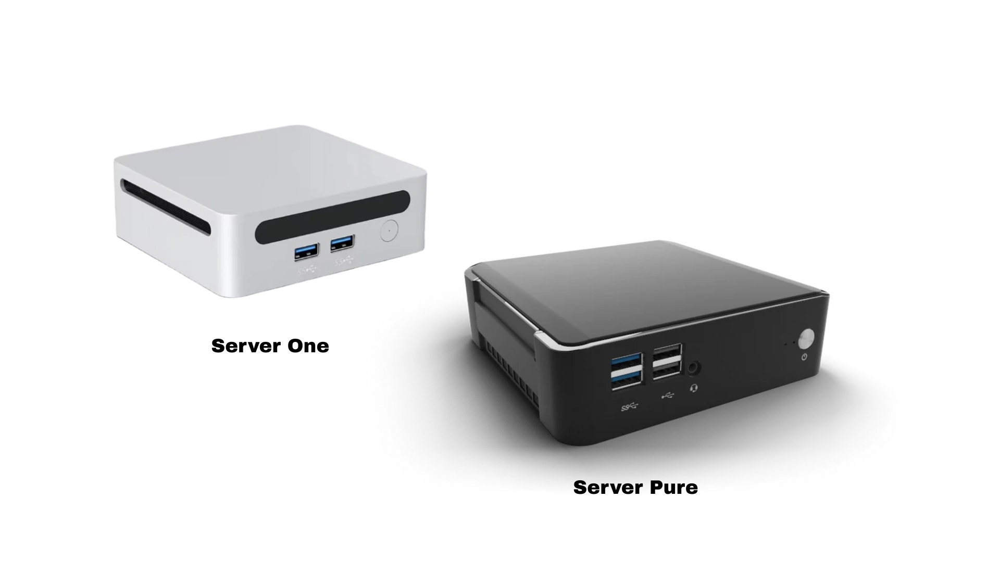


### Ni ibiki bitandukanye na Umbrel?


StartOS na Umbrel vyose biroroshe gushiramwo serivisi y’ukwikorera ariko bitandukanye mu vy’ubwubatsi n’ibiranga. Umbrel ikora nk’urugero rw’ibikorwa ku bikoresho vya Debian/Ubuntu canke VMs, mu gihe Start9 ari ubuhinga bwo gukoresha bwihariye busaba gushiramwo ibikoresho canke gushiramwo VM. Umbrel ifise interface isukuye, ihumekewe na macOS, mu gihe Start9 ishira imbere ubuhinga bukora, bukeyi. Umbrel itanga [uguhitamwo kw’ibikorwa] vyinshi (https://apps.umbrel.com/), mu gihe [Isoko ry’Itanguriro9](https://isoko.intango9.com/) ryishura n’ubushobozi bw’ubuhinga buteye imbere. Start9 yorosha gushika ku mirongo iteye imbere biciye ku mafishi ya UI yemejwe, igabanya ivy’ugukorana n’umurongo w’amabwirizwa. Irahambaye kandi mu gucunga ububiko bw’inyuma n’ububiko bw’inyuma bufise ubuhinga bwo gukanda rimwe, ikintu Umbrel idafise. StartOS itanga ibikoresho vyubatswemwo vyo kugenzura kandi igashira mu ngiro uburyo bwo gukoresha HTTPS kugira ngo umuntu ashobore gushika ku rubuga rwo mu karere, ivyo bikaba bituma umutekano urushiriza kuba mwiza. Umbrel ikoresha HTTP itashizwemwo amakuru mu karere, naho izo nzira zompi zishigikira uburenganzira bwo gushika kure biciye kuri Tor. Umbrel ni nziza ku bakoresha bashira imbere ivy’ubutunzi n’ivy’ubuhinga bwa none. Start9 ni ihitamwo rikomeye ku bantu baha agaciro umutekano, ubushobozi bwo guhindura, ukwizigirwa, n’uburongozi buteye imbere bw’ibikorwa bitasaba ubuhinga bwo gukoresha umurongo w’amabwirizwa. Kugira ngo umenye vyinshi ku bijanye na Umbrel n’itandukaniro riri hagati ya Start9, genda kuri iri shure:


https://planb.academy/courses/3cd9cb94-82e8-417a-9c5a-02afc2589426

## 2️⃣ Ibisabwa: Ibikenewe n'Ibikenewe


Ku gukoresha vy’ishimikiro n’ibikorwa bike, **ibisobanuro bike** ni: **1 vCPU core (2.0GHz+ boost), 4GB RAM, 64GB ububiko**, n’icuma ca Ethernet. Ivyo bivuzwe, ndagusavye kurenga ivyo, cane cane nimba uriko urakoresha Bitcoin Node. Ku bwanje, natanguye na 1TB nca nca nsubira inyuma ningoga. Intumbero nziza cane yo **nibura ububiko bwa 2TB**, hamwe n’**CPU y’imirongo ine (2.5GHz+)** na **8GB+ RAM**. Bitera itandukaniro rikomeye mu bijanye n’ugukora no mu kubaho igihe kirekire. Niba ushaka kwisuka ibwina, ng’uru urudodo rw’abanyagihugu rugezweho rwerekeye [Ibikoresho Bishobora Gukoresha StartOS](https://community.start9.com/t/urutonde rw’ibikoresho-vyiza-bishobora-gukoresha-startos/66/229).


## 3️⃣ Gukuraho no gucapura Firmware


Kugira ngo utangure gutegura, koresha mudasobwa itandukanye kugira ngo usubire ku rubuga rwa [Start9](https://start9.com/), hanyuma ugende ku gice c'inyandiko ukanda `DOCS`. Uvuye ng'aho, ushike ku `Flashing Guides` kugira uronke verisiyo ibereye ya StartOS. Hariho uburyo bubiri:


- GutanguraOS (Ikimera ca Pi)
- Gutangura OS (X86/ARM)


Iyi nyigisho ivuga ku mahitamwo ya `x86/ARM`.


Verisiyo ya OS nshasha ishobora gukurwa kuri [paje y’isohorwa rya Github] [Imbere y’ugusohoka](https://github.com/Start9Labs/start-os/releases) na vyo nyene biraboneka ku bakoresha bipfuza kugerageza ibintu bishasha. Hasi kuri paji, munsi ya `Itunga`, fungura `x86_64` canke `x86_64-nonfree.iso`.  Ishusho ya `x86_64-nonfree.iso` irimwo porogaramu zitari ku buntu (inkomoko yugaye) zikenewe kuri Server One n'ibikoresho vyinshi vy'ubuhinga bwa none, cane cane ku bishushanyo n'ibikoresho vy'urubuga.


Kugenzura ubutungane bwa dosiye mu kugenzura hash yayo SHA256 n'iyo iri ku rutonde rwa GitHub ni vyiza. Ku Linux, itegeko `sha256sum startos-0.3.4.2-efc56c0-0.3.4.2-efc56c0-20230525_x86_64.iso` rishobora gukoreshwa, n'izindi sisitemu zikoreshwa zivugwa mu nyandiko.


Amaze gukura no kugenzura ishusho ya StartOS, itegerezwa guca ku nzira ya USB. `BalenaEtcher` ni porogaramu nziza kuri iki gikorwa. Ni igikoresho c’ubuntu, gifunguye co kwandika amadosiye y’amashusho ya OS ku bikoresho vya USB no ku makarita ya SD, kiboneka kuri Windows, macOS, na Linux. Gukuraho verisiyo ibereye ku rubuga rwemewe rwa [Balena Etcher](https://www.balena.io/etcher/) hanyuma ukoreshe igikoresho co gushiramwo. Huza umuduga wa USB canke ikarita SD, ufungure Balena Etcher, hanyuma ukande `Flash from dosiye` kugira uhitemwo ishusho ya OS yavanwe. Etcher izokwibonera ubwo nyene ama drive ahuye; hitamwo intego ibereye nimba hariho vyinshi. Fyonda `Flash!` kugira ngo utangure kwandika ishusho. Etcher ihita yemeza uburyo bwo kwandika iyo irangije. Uhejeje, ukureho iyo drive ata nkomanzi maze uyikoreshe kugira ngo ufungure igikoresho.


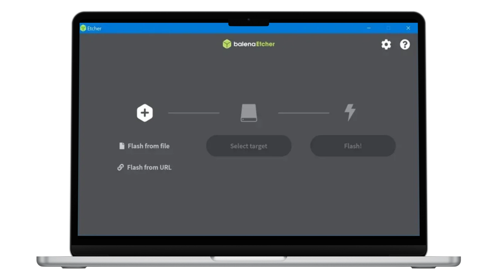


## 4️⃣ Gutegura mbere


Ku bijanye n'ugutegura kwa mbere, raba urupapuro rwa Start9 [inyandiko](https://docs.start9.com/0.3.5.x/) munsi ya `IGITABO C'UMUKORESHA` hakurikijwe `Gutangura - Gutegura kwa mbere`.  Iyi nkuru yemewe ikwiye kurabwa kugira ngo ubone amakuru agezweho.


Hariho uburyo bubiri bushikirizwa:


- Tangira bushasha
- Amahitamwo yo gukira


Kugira ngo ushireho server nshasha, hitamwo `Tangira bushasha`. Ubwa mbere, ushire server ku nguvu be n’umugozi wa Ethernet. Raba neza ko mudasobwa ikoreshwa mu gutegura iri ku rubuga rumwe rwo mu karere. Kura muri mudasobwa iyo USB iherutse guca, hanyuma uyishire muri server.


Ushobora gucungera server uri kure ukoresheje mudasobwa iyo ari yo yose iri kuri iyo nzira nyene. Gufungura umucukumbuzi w'urubuga maze ugende kuri `http://tanguriro.local`.


**Iciyumviro**: Iyo ibibazo vyo guhuza bishitse kuri iyi aderesi, kenshi biterwa n'imihora yo muhira idashobora gutorera umuti amazina y'itongo `.local`. Ikibazo gishobora gutorwa umuti mu gushika kuri server ataco uhinduye biciye kuri IP yayo. IP ishobora kuronswa mu kwinjira mu nzira y’ubuyobozi bwa router (mu bisanzwe kuri `192.168.1.1` canke aderesi isa n’iyo), no gutora igikoresho mu bakiriya ba DHCP canke mu rutonde rw’ikarita y’urubuga. Hanyuma, winjize aderesi IP yuzuye (nk'akarorero `http://192.168.1.105`) mu mucukumbuzi. Ivyo bica ku nzira ya DNS. Niba ibibazo bikomeza, raba [Urupapuro rw’Ibibazo Bisanzwe](https://docs.start9.com/0.3.5.x/gufasha/ibibazo-bisanzwe.html#gushinga-ugutorera umuti ingorane) canke [shikira abagufasha.](https://start9.com/contact/)


Igishushanyo co gutegura StartOS gikwiye kuboneka. Fyonda `Start Fresh` kugira ngo utangure gutegura server nshasha.


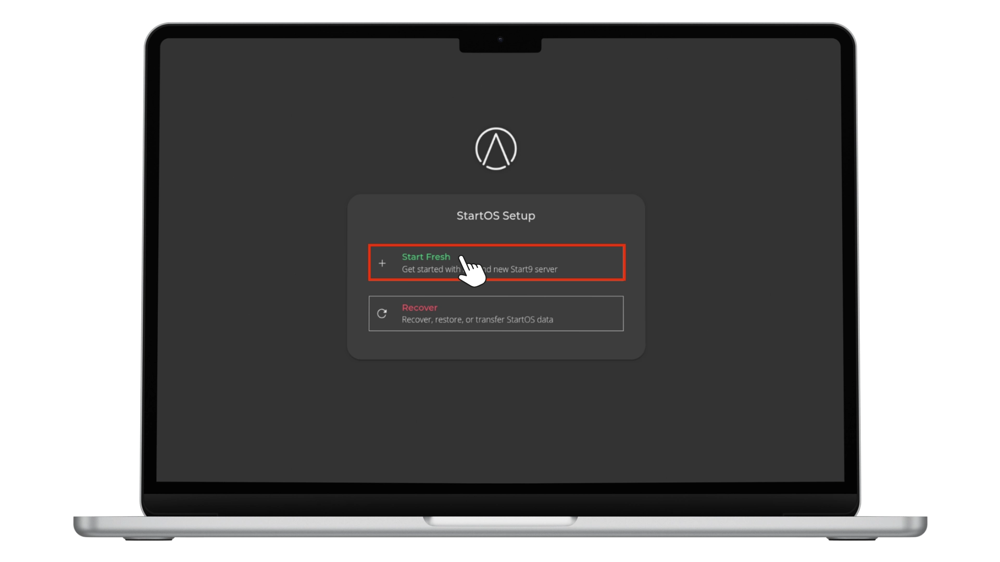


Intambwe ikurikira ni uguhitamwo umuduga wo kubika aho amakuru ya StartOS azobikwa.


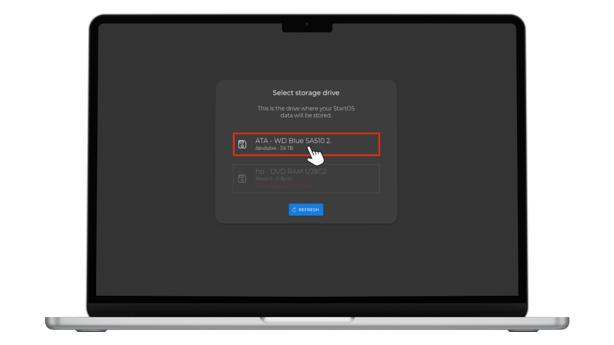


Gushinga `Ijambobanga` rikomeye kuri server. Bishire mu nyandiko nk'uko vyahanuwe na Start9, hanyuma ukande `FINISH`.


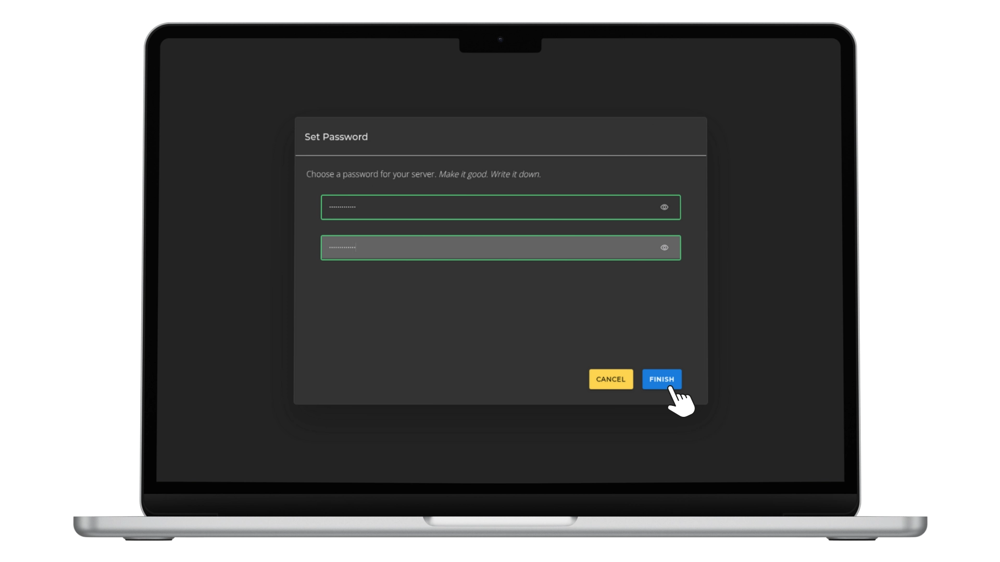


Igishushanyo kizokwerekana ko StartOS iriko iratangura no gushinga server. Intambwe ikurikira ni `Gukuraho amakuru y'aderesi` kuko aderesi `start.local` ari iyo gutegura gusa kandi ntizokora inyuma.


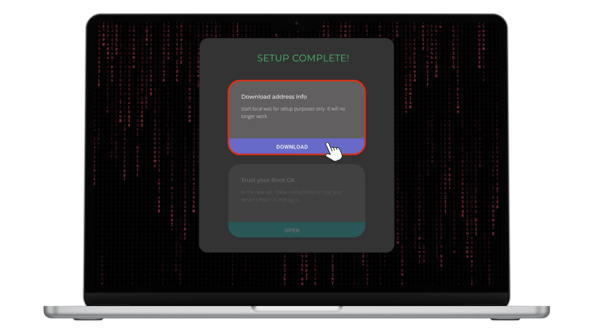


Dosiye y'imiterere irimwo aderesi zibiri zihambaye zo gushikira: imwe y'urubuga rwo mu karere (LAN)` n'iyindi y'ugushikira mu buryo butekanye biciye ku `Tor`. Izo aderesi zompi zikwiye kubikwa mu mucungerezi w’ijambobanga ry’umutekano. Intambwe ikurikira ni `Kwizigira CA yawe y'umuzi`. Gufungura urubuga rushasha rw'umucukumbuzi maze ukurikize amabwirizwa kugira ngo wizere Root CA maze winjire.Icemezo ca Root CA gishobora kandi gukurwako ukanda `Download certificate` muri dosiye yakuweho.


## 5️⃣ Wizere CA yawe y'Imizi


Inyuma yo gukuraho icemeza, `Root CA` ya server itegerezwa kwizigirwa na sisitemu ikoresha. Fyonda `Raba Amabwirizwa` maze urondere amabwirizwa y'ivyo bikoresho.


Ku bijanye na Linux, amabwirizwa akurikira arakoreshwa. Mbere, fungura Terminal maze ushiremwo amapaki akenewe:


```shell
sudo apt update

sudo apt install -y ca-certificates p11-kit
```


Kugendera ku bubiko aho icemeza cavuye, kenshi na kenshi `~/Downloads` . Shira mu ngiro aya mabwirizwa kugira ngo wongere icete ku bubiko bw'ukwizigira bwa OS. Hindura muri dosiye y'ivyo ushobora gukuraho n' `cd ~/Ivyo ushobora gukuraho`. Rema ububiko busabwa na `sudo mkdir -p /usr/gusangira/ca-ivyemezo/intango9`. Kopa dosiye y'icete, usubirize `izina rya dosiye yawe.crt` n'izina rya dosiye nyayo, ukoresheje `sudo cp "izina rya dosiye yawe.crt" /usr/share/ca-ivyemezo/start9/`. Kwandika icemeza ubudasiba mu kwongerako inzira yaco ku miterere ya sisitemu na `sudo bash -c "echo 'intango9/izina-ry'idosiye yawe.crt' >> /etc/ca-icete.conf"`. Ubwa nyuma, wongere wubake ububiko bw'ukwizigira n'ivyemezo vya sudo update-ca`. Ni ngombwa cane gukoresha izina rya dosiye y'icemezo nyaco no kugenzura inzira zose imbere yo gushitsa aya mabwirizwa. Iyi nzira ishiraho ukwizigira guhoraho ku mahuriro ya HTTPS ya server ya Start9.


Gushiramwo neza bizokwerekanwa n'igisohoka kivuga `1 yongeweko`. Porogaramu nyinshi zizoshobora gukorana neza biciye kuri `https`. Niba ukoresha Firefox, [intambwe ya nyuma] y’inyongera irakenewe. Ku Chrome canke Brave, intambwe itandukanye (intambwe ya nyuma] irakenewe kugira ngo utunganye umucukumbuzi kugira ngo yubahirize Root CA. Gerageza ihuriro mu gusubiramwo urupapuro. Nimba ingorane igumaho, nureke maze wongere ufungure umucukumbuzi imbere y’uko usubira kuri iyo paji.


## 6️⃣ Gutangura gukoresha StartOS


Ubu rero vyoshoboka ko umuntu yinjira akoresheje uruja n’uruza rwa HTTPS rutekanye. Injira `Ijambobanga` kugira ngo ushikire `Igishushanyo c'Ikaze`.


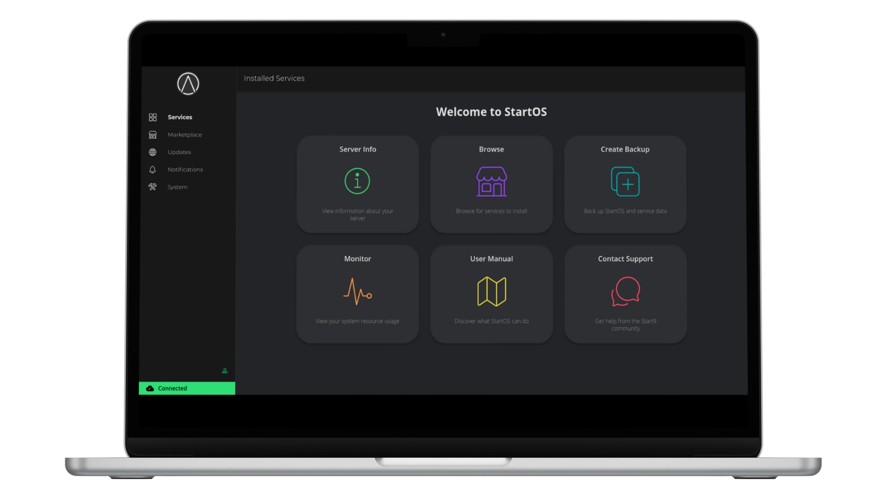


Iyi skrini itanga inzira ngufi ngirakamaro zo gutangura. Umurongo w'ibubamfu urimwo ibintu nyamukuru vyo mu rutonde rwo kugenderamwo.


## 7️⃣ Uburyo


Igipande ca Sisitemu muri StartOS gitanga uburyo bwo gushika ku bikorwa nyamukuru vya sisitemu vyo gucunga server y’umuntu ku giti ciwe. Itanga ibikoresho vyo gucungera sisitemu, umutekano, gupima, no gutunganya ataco bisaba ubuhinga bwo gukoresha umurongo w’amabwirizwa.


Igice ca `Backups` kiremesha gukora backups z'uburyo bwose, harimwo ibikorwa, imiterere, n'amakuru, bishobora gusubirwamwo mu nyuma. Ivyo ni ngombwa kugira ngo umuntu ashobore gusubirana mu gihe c’ivyago canke kwimukira mu bikoresho bishasha. Ivyiyumviro bishobora kubikwa ku bikoresho vyo hanze kandi bikaba bishirwa mu nzira hakoreshejwe ijambobanga ry’umukuru.


Igice ca `Gucungera` mu gice ca Sisitemu kiremesha kugenzura ibikorwa vya sisitemu. Abakoresha barashobora gusuzuma no gukoresha n’amaboko ivyagezwe vya StartOS, bagakomeza kugenzura uburyo bwo guhindura sisitemu. Birashoboka gushiramwo ku ruhande ibikorwa vy’imigenzo canke vy’abandi bitaboneka ku isoko ryemewe. Iyo server idahuye biciye kuri Ethernet, amasetingi ya Wi-Fi arashobora gutunganirizwa kuva muri iki gice. Abakoresha bateye imbere barashobora gutuma SSH ishobora gushika ku rwego rw'uburongozi bwa sisitemu.


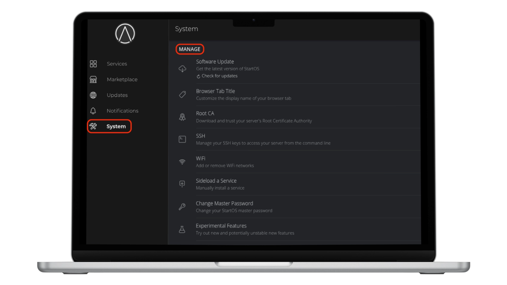


Igice ca `Insights` gitanga ubugenzuzi bw’igihe nyaco bw’imikorere ya server n’ubuzima bwayo, kigaragaza CPU, RAM, n’ikoreshwa rya disiki biciye ku bishushanyo. Igaragaza kandi ubushuhe bwa sisitemu, ariko ni ngirakamaro ku bikoresho nka Raspberry Pi bitagira ubukonje bukora. Igihe co gukora n'ibipimo vy'umuzigo bifasha gusuzuma ukudahungabana kwa sisitemu, kandi inyandiko ziriho ziraboneka ku bijanye no gutorera umuti ingorane za serivisi canke ibibazo vya sisitemu.


Igice ca `Infashanyo` kiratanga uburyo bwo kuronka ibibazo vyubatswemwo, inyandiko zizwi, n'imirongo y'infashanyo y'abanyagihugu. Ivyanditswe vyo gukosora bishobora gukurwa muri iki gice kugira ngo ubisangize n'abafasha ba Start9 kugira ngo ibibazo bitorerwe umuti vyihuse.


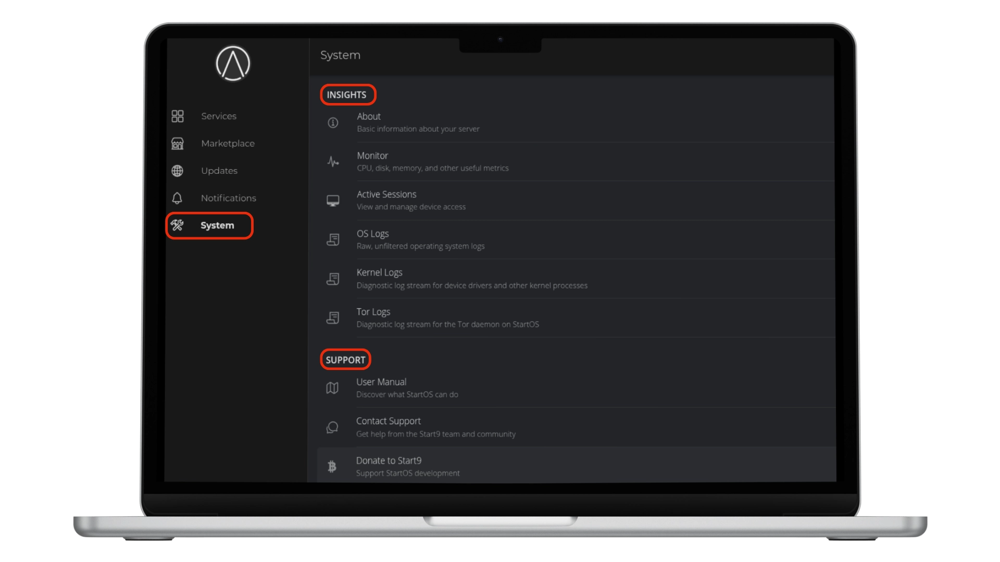


## 8️⃣ Isoko


`Isoko` rikoreshwa mu kuvumbura, gushiramwo, no gucunga ibikorwa kuri server y'umuntu ku giti ciwe. Itanga uburyo bwo gukoresha porogarama nka Bitcoin Core, Server ya BTCPay, n’amashanyarazi. StartOS ishigikira amasoko menshi, harimwo n’Ivyandikano vyemewe vya Start9 n’ivyandikano vy’abanyagihugu. Ivyo bishobora kwongerwako mu gufyonda `CHANGE` hanyuma ugahindukira ukaja ku `Igitabu c'abanyagihugu`, kigatanga uburenganzira bwo kuronka ibikorwa vyinshi.


## 9️⃣ Gushiramwo Node yuzuye ya Bitcoin


Gushiramwo Bitcoin full node kuri StartOS bitanga ubusegaba bushitse ku bumenyi bwa Bitcoin. Bishoboza kwemeza amafaranga kandi bikongera ubuzima bwite n’umutekano mu gukuraho ukwizigira ibikorwa vyo hanze bishobora kwandika ibikorwa. Ubugenzuzi bushitse ku bijanye n’ibikorwa buraronswa, bikaba bituma bishobora gutangazwa ataco bimaze ku rubuga. Ihitamwo ry'imbere ni `Bitcoin Core`, ryifatanya na StartOS kandi ryemerera gukorana n'amasakoshi nka Spectre, Sparrow, canke Electrum kugira ngo ushobore kwibungabunga. Iyindi nzira, `Bitcoin Knots`, iraboneka kandi biciye mu gitabu c’abanyagihugu.


Kugira ngo ushiremwo Bitcoin Core, genda ku Isoko. Munsi y’inyandiko y’imbere, rondera maze ushiremwo igikorwa ca Bitcoin Core. Inyuma yo gushiramwo, `Needs Config` izoboneka, isaba ko amasetingi arangizwa imbere y'uko iyo serivisi ishobora gukora. Ivyo bishika inyuma y'uguhindura canke gushiramwo bishasha kandi bikaba bisaba gusubiramwo `imiterere ya RPC`. Bandanya n'imiterere mburabuzi hanyuma ukande `Bika`.


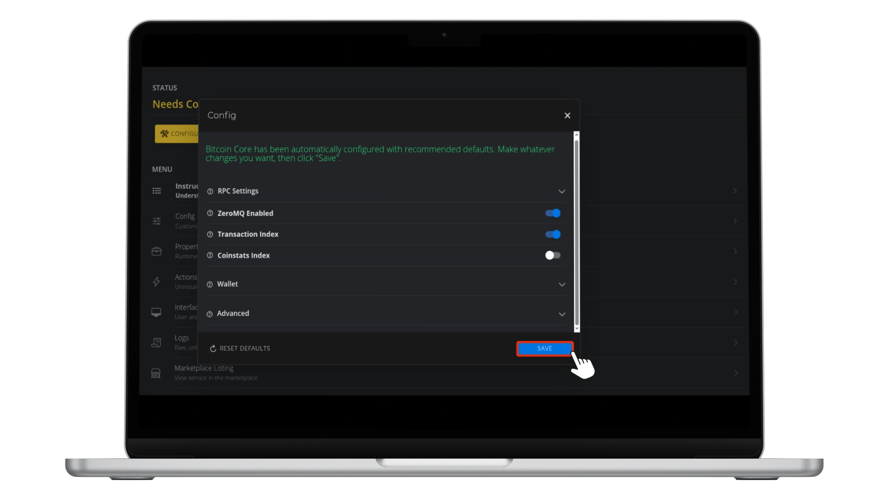


Iyo imaze gukorana neza, node yawe irashobora gukora nk’inyuma y’ibanga y’amasakoshi nka Sparrow, itanga ubuzima bwite n’ukwemeza ibikorwa. Ariko rero, ku bakoresha babika amahera menshi, birahambaye cane gutahura umutekano w’iyi nzira y’uguhuza. Iyo wallet ihuye ataco ihinduye kuri Bitcoin Core, irashobora gushikiriza amakuru y’agaciro, kuko Bitcoin Core ibika imfunguruzo za bose (xpubs) n’imirongo ya wallet idashizwemwo amakuru ku mashini y’umushitsi. Uburyo bushobora gutuma uwugutera abona ivyo ufise maze akagutera.


Kugira ngo ugabanye ivyo bibazo no gushika ku citegererezo c'umutekano gikomeye, urashobora gushinga Electrum Server y'umwihariko. Iyi server ikora nk’umuhuza, ikora index y’uruzitiro rw’ibintu ata makuru yose yihariye ya wallet ibitse. Mu gufatanya wallet yawe na server yawe bwite ya Electrum aho gufatanya na Bitcoin Core, urabuza wallet gushika ku makuru y’agaciro y’iyo node.


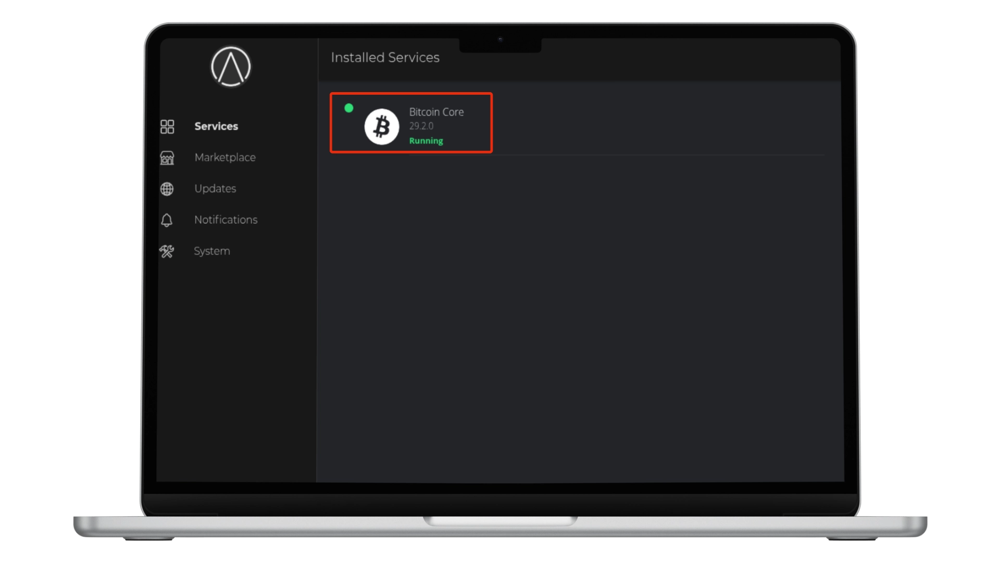


## 🔟 Gushiraho amashanyarazi


`electrs` (Electrum Rust Server) ni urutonde rwihuta, rukora neza rufatanya n'uruzitiro rwawe rwa Bitcoin Core kandi rushoboza amasakoshi ahuye na Electrum kubaza amateka y'ibikorwa n'imibare mu gihe nyaco. Mu gukoresha electrs kuri StartOS, ukuraho kwizigira ama server ya Electrum y’abandi, ugatuma ubuzima bwite n’umutekano bigenda neza cane—ibibazo vyawe vya wallet bica bishika ku nzira yawe wikorera.


Kugira ngo uyishireho, banza ushiremwo umuyagankuba uva ku isoko rya StartOS. Ubuhinga buzosaba ko Bitcoin Core ihurizwa hamwe neza imbere y’uko ikomeza. Inyuma yo gushiramwo, wemeze `Needs Config` n’ivyo ushobora gukoresha maze electrs itangure gukora indexing y’ivyo ukoresha, bishobora gutwara umusi umwe bivanye n’ibikoresho vyawe.


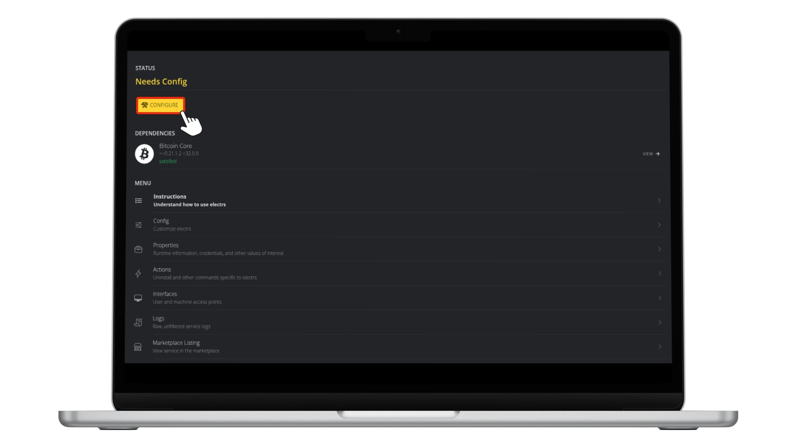


Iyo umaze guheza, urashobora gufatanya ama wallet nka Sparrow canke Spectre. Ihuriro ryiza rituma wallet yawe ikorana n’uruzitiro rwawe, igatanga ubumenyi bwa Bitcoin butekanye, bwihariye kandi bwishingira.


## 1️⃣1️⃣ Huza Sparrow Wallet


Kugira ngo uhuze `Sparrow Wallet` n'uruzitiro rwawe rwa StartOS ukoresheje ugushirwa mu ngiro kwa electrs, banza urabe ko Bitcoin Core ihuriweko neza kandi electrs ishizweho kandi ikora. Gufungura Sparrow Wallet ku gikoresho cawe maze ugende kuri `Dosiye` -> `Ivyagezwe` -> `Serveri`. Hanyuma uhitemwo `Electrum Server y'ibanga`. Mu mwanya wa URL, shiramwo `Izina ry'umushitsi wa Tor` na `Ikivuko` c'amashanyarazi, ushobora kugisanga muri StartOS munsi ya `Ibikorwa` -> `amashanyarazi` -> `Imiterere` (mu bisanzwe bihera muri `.onion:50001`).


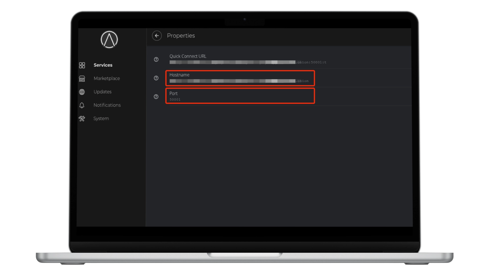


Ibikurikira, fungura Tor mu gusuzuma `Koresha Proxy`, ushireho aderesi ya proxy kuri `127.0.0.1` n'icuma kuri `9050`. Fyonda `Igerageza ry'Ihuza` hanyuma urindire umwanya muto. Ihuza ryiza rizokwerekana ubutumwa bwo kwemeza nk'uko `Ihuzwa n'amashanyarazi`. Igihe umaze kugenzura, funga amasetingi maze ubandanye kurema canke gusubizaho wallet yawe. Iyi setup ituma wallet yawe ibaza node yawe bwite biciye ku electrs, itanga ubuzima bwite bushitse n’ugukora ata kwizigirwa.


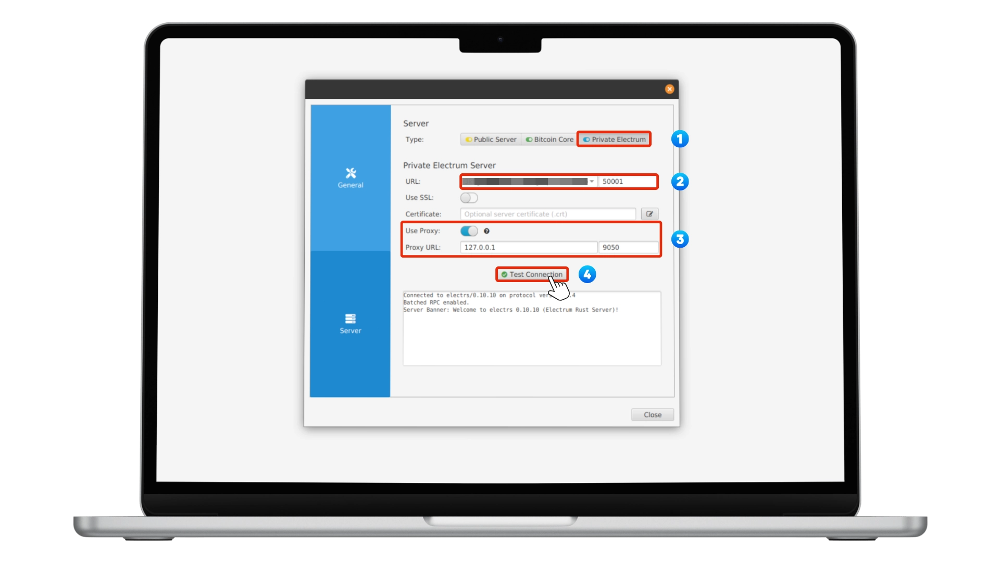


## 🎯 Insozero


StartOS by Start9 ni urubuga rworoshe gukoresha, rwibanda ku buzima bwite rwagenewe kwiyakira ibikorwa vy’ingenzi nka Bitcoin na Lightning nodes, amasakoshi, n’amaporogarama y’umuntu ku giti ciwe. Ikuraho ivy’ubuhinga bwo gukoresha umurongo w’amabwirizwa mu gutanga urubuga rw’ibishushanyo rusukuye, gukora amakuru yikora, kugenzura ubuzima, no gukoresha Tor mu buryo butekanye, bikaba bituma ari vyiza ku batari abahinga mu vy’ubuhinga. Ubwubatsi bwayo bushingiye ku bice bufasha gukorana n’ibikoresho nk’amashanyarazi canke Sparrow, bikaguha ububasha bwose ku busegaba bwawe bw’ivy’amahera n’ivy’ubuhinga bwa none. Kubera ko StartOS yibanda cane ku guseruka, kugenzura mu karere, no kwagura, iha ubushobozi abakoresha bwo gusubira kuronka uburenganzira ku mbuga zihurikiye hamwe no gukoresha ibikorwa remezo vyabo vy’ibanga, bikomeye.