## はじめに


ThunderHubは、Lightningノード（LND）用の**オープンソースマネージャー**であり、あらゆるデバイスやブラウザからアクセス可能な直感的なInterfaceを提供する。


**主な特徴


- モニタリング残高、チャネル、トランザクション、ルーティング統計のグローバルビュー
- 管理**：チャネルの開閉、入出金、チャネルのバランシング
- 統合**：LNURLサポート、Boltz経由のスワップ、Ambossバックアップ
- Interfaceレスポンシブ**：ダーク/ライトテーマでモバイル、タブレット、デスクトップデバイスに対応


ThunderHubは**Umbrel**、**Voltage**、**RaspiBlitz**、**MyNode**と簡単に統合でき、ノードの日々の管理を簡素化します。


**ThunderHubは特に、人間工学に基づいたInterfaceでチャネル管理、流動性管理（リバランス）、取引監視、Ambossなどのサードパーティ・サービスの統合を行いたい運用者に適している。セキュリティーはローカルまたはTor接続で保証されています。


まだライトニング・ノードを持っていない場合は、LNDアンブレルのチュートリアルに従うことをお勧めします：


https://planb.network/tutorials/node/lightning-network/umbrel-lnd-b12e0b5b-12ff-45f1-978e-62f4b4a8ba16

## インストール


ThunderHubは、お使いのLightningノードホスティング環境に応じて、様々な方法でインストールすることができます。ターンキーソリューション（Umbrel、Voltage、RaspiBlitz、MyNode、Start9など）を利用する場合でも、手動でインストールする場合でも、ThunderHubは多くの場合、大きな労力をかけずに利用できます。以下では、Umbrel App Store経由と手動インストール（サーバーまたはセルフホストディストリビューションに適用）の2つの一般的なアプローチについて説明します。


### アンブレルを使ったインスタレーション


UmbrelはThunderHubを**App Store**に統合しているため、インストールが非常に簡単です。コマンドラインや手動設定は必要ありません：全てはInterface Umbrelを介して行われます。以下の手順に従ってください：


- Umbrel ダッシュボード** を開く：Umbrel ノードの Interface ウェブ（ローカルネットワーク上の `http://umbrel.local` や、Tor を使用している場合は `.onion` Address 経由など）に接続します。
- App Store** にアクセスします：Umbrelのメインメニューから "App Store"（または "App"）をクリックします。利用可能なアプリケーションのリストから**ThunderHub**を検索します。


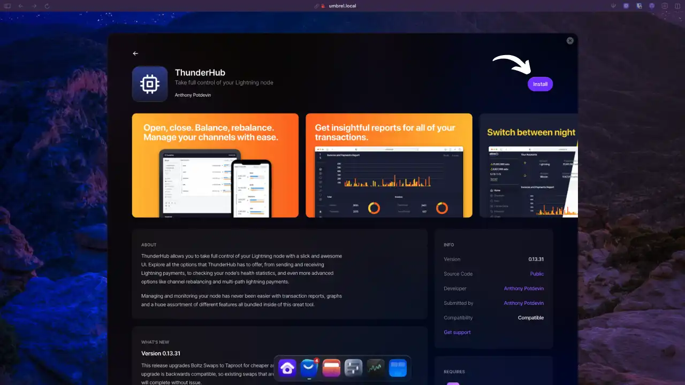


- ThunderHub**をインストールします：ThunderHubアプリケーションをクリックし、インストールボタンをクリックします。必要に応じて確認してください。Umbrel が自動的に ThunderHub をダウンロードし、ノードにデプロイします。


- アプリケーションを起動します：インストールが完了すると（数十秒）、ThunderHubがホームページに表示されます。アイコンをクリックして開いてください。ThunderHubがブラウザで起動します。


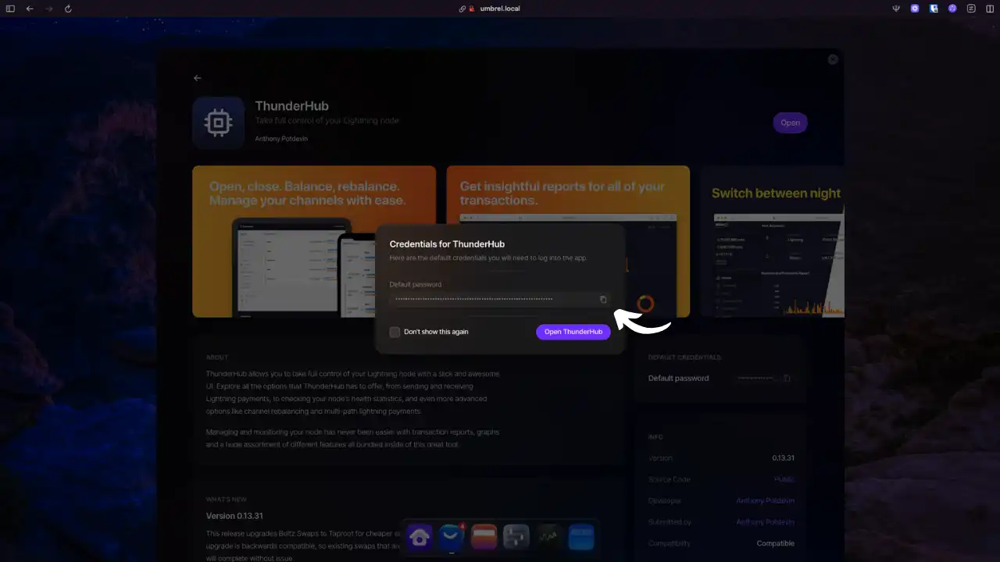


**重要:** ThunderHubを最初に開いたとき、ログインに必要な**デフォルトパスワード**が自動的に表示されます。Don't show this again "オプションにより、今後の接続のためにこの表示を非表示にすることができます。 **以下のことを強くお勧めします。


- このパスワードをすぐに**パスワードマネージャーに保存する
- 次のステップで使用するためにコピーする。
- パスワードが保存されたら、"Don't show this again "をチェックする。


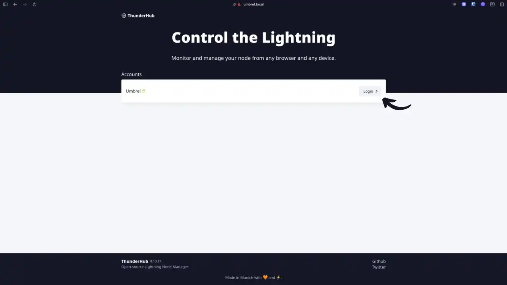


Interfaceのロックを解除するには、前のステップでコピーしたパスワードを入力する必要があります。


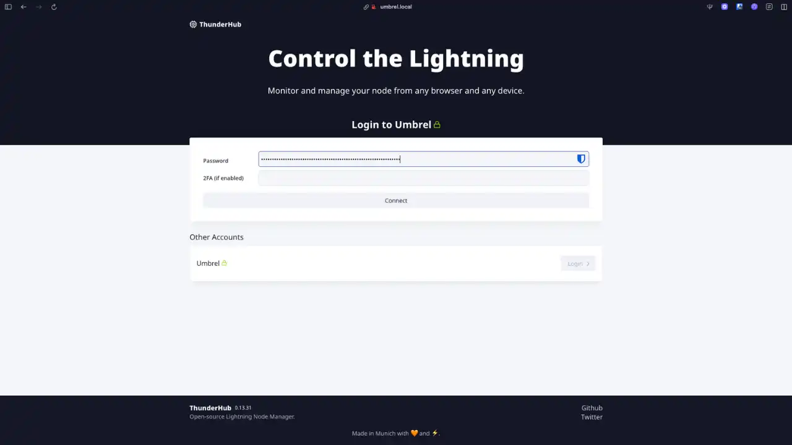


Umbrel が ThunderHub に LND 接続情報（TLS 証明書、管理マカロンなど）をバックグラウンドで提供するため、追加の設定は必要ありません。数回クリックするだけで、Umbrel ノード上で ThunderHub を稼働させることができます。


### 手動インストール（セルフホスト、Umbrelを除く）


Umbrel 以外のユーザー（例えば、個人サーバー、RaspiBlitz を搭載した Raspberry Pi、または *スタンドアロン* のインストール）の場合、ThunderHub のインストールにはいくつかの追加手順が必要です。以下では、[公式 ThunderHub ドキュメント](https://docs.thunderhub.io) に従って、ソースからのインストールと設定について説明します。


#### インストール


**前提条件:** [documentation setup](https://docs.thunderhub.io/setup)に従って、システムが最小要件を満たしていることを確認してください：


- Node.js**バージョン18以上
- npm** インストール済み
- LND認証ファイルへのアクセス ：
  - LND TLS証明書 (`tls.cert`)
  - LND管理マカロン (`admin.macaroon`)
  - LND gRPCサービス Address (ホスト名:ポート) (ローカルではデフォルト `127.0.0.1:10009`)


**1.ThunderHub コードの取得:** [インストールドキュメント](https://docs.thunderhub.io/installation) にあるように、プロジェクトの GitHub リポジトリをクローンする：


```bash
git clone https://github.com/apotdevin/thunderhub.git
cd thunderhub
```


**依存関係をインストールし、アプリケーションをビルドする。


```bash
npm install
npm run build
```


これらのコマンドは必要なモジュールをすべてインストールし、アプリケーションをコンパイルする（ThunderHubはTypeScript/Reactで書かれている）。


**3.後日アップデート:** ThunderHubは将来のアップデートのためにいくつかの方法を提供しています：


```bash
# Méthode rapide
npm run update

# Ou méthode manuelle
git pull
npm install
npm run build
```


#### コンフィギュレーション（設定）


**1.メイン設定ファイル:** 設定をカスタマイズするために ThunderHub フォルダのルートに `.env.local` ファイルを作成します（アップデート時に設定が上書きされるのを防ぎます）。メインの変数は[setup documentation](https://docs.thunderhub.io/setup)に従ってください：


```bash
# -----------
# Server Configs
# -----------
LOG_LEVEL='info' # 'error' | 'warn' | 'info' | 'http' | 'verbose' | 'debug' | 'silly'
PORT=3000
NODE_ENV=production

# -----------
# Interface Configs
# -----------
THEME='dark' # 'dark' | 'light' | 'night'
CURRENCY='sat' # 'sat' | 'btc' | 'fiat'

# -----------
# Privacy Configs
# -----------
FETCH_PRICES=true # Récupération des prix BTC/fiat depuis Blockchain.com
FETCH_FEES=true # Récupération des frais on-chain depuis Earn.com
DISABLE_LINKS=false # Liens vers 1ml.com et Blockchain.com
NO_VERSION_CHECK=false # Vérification de version depuis GitHub

# -----------
# TOR (optionnel)
# -----------
TOR_PROXY_SERVER='socks://127.0.0.1:9050' # Pour proxifier via TOR

# -----------
# Account Configs
# -----------
ACCOUNT_CONFIG_PATH='/chemin/vers/thubConfig.yaml' # Fichier de comptes
```


**2.Server Accounts configuration:** `ACCOUNT_CONFIG_PATH` で指定された YAML ファイルを作成する：


```yaml
masterPassword: 'votre_mot_de_passe_principal'
accounts:
- name: 'Mon Nœud LND'
serverUrl: '127.0.0.1:10009'
macaroonPath: '/home/user/.lnd/data/chain/bitcoin/mainnet/admin.macaroon'
certificatePath: '/home/user/.lnd/tls.cert'
password: 'mot_de_passe_compte_specifique'
# Optionnel : compte avec macaroon en hexadécimal
- name: 'Nœud Distant'
serverUrl: 'ip.distante:10009'
macaroon: '0201056c6e6402f8...' # Macaroon en HEX ou Base64
certificate: '0202045c7365...' # Certificat en HEX ou Base64
```


**3.リモート・アクセス:** 遠隔地の LND ノードに接続するには、`LND.conf` に追加します：


```bash
# Option 1 : accès par IP
tlsextraip=<ip-externe-accessible>
rpclisten=0.0.0.0:10009

# Option 2 : accès par domaine
tlsextradomain=<domaine-externe-accessible>
rpclisten=0.0.0.0:10009
```


**4.セキュリティ:** ThunderHub は初回起動時に、`masterPassword` とすべてのアカウントのパスワードを YAML ファイルに自動的に** 隠します。


**5.ThunderHubを起動する。


```bash
npm start
```


デフォルトでは、サーバーはポート3000でリッスンする。http://localhost:3000`（またはローカルネットワークから`http://ip-serveur:3000`）にアクセスする。


**6.Dockerの代替:** ThunderHubは公式のDockerイメージを提供しています：


```bash
# Image standard
docker pull apotdevin/thunderhub:latest
docker run --rm -it -p 3000:3000/tcp apotdevin/thunderhub:latest

# Image avec base path /thub
docker pull apotdevin/thunderhub:base-v0.11.1
```


ThunderHub ログインページが表示されます。設定したアカウントを選択し、パスワードを入力してダッシュボードにアクセスします。


**他のディストリビューションへのインストール:** パッケージ化されたノードディストリビューション（RaspiBlitz、MyNode、Start9など）は、一般的にそれぞれの管理インターフェイスを介してネイティブなThunderHubサポートを提供しています。


*より詳しい情報：*** 完全な公式文書を参照してください：


- インストール:** [docs.thunderhub.io/installation](https://docs.thunderhub.io/installation)
- 設定:** [docs.thunderhub.io/setup](https://docs.thunderhub.io/setup)


これらのリソースは、SSOアカウント、暗号化マカロン、TOR設定などの高度なオプションについて詳しく説明しています。


ThunderHubがインストールされ、アクセスできるようになれば、すべての機能を利用する準備が整います。次のセクションでは、Interface ThunderHubとその様々なタブを紹介し、使い方を説明します。


## Interfaceプレゼンテーション


Interface ThunderHubは、メインメニュー（通常は左側のカラムに表示）を中心に構成されており、いくつかの主要なセクションで構成されています。それぞれがLightningノードを管理するための側面に対応しています。一つずつ見ていきましょう：


- ホーム** - 一般的なダッシュボードを備えたホームタブ（ノードの概要とクイックアクション）。
- ダッシュボード** - ウィジェットと高度なメトリクスを備えたカスタマイズ可能なダッシュボード。
- Peers** - ライトニング・ピアの管理（他のノードとの接続）。
- チャンネル** - ライトニング・チャンネルを詳細に管理。
- リバランス** - チャンネルバランシングツール（循環支払い）。
- 取引** - ライトニングの支払い履歴（LN取引）。
- Forwards** - ルーティング統計（あなたのノードによってリレーされた支払い）。
- チェーン** - ノードのOn-Chainポートフォリオ（On-Chain BTC：UTXO、取引）。
- Amboss** - Ambossとの統合（ノード監視、バックアップなど）。
- ツール** - その他のツール（バックアップ、署名入りメッセージ、マカロン、レポートなど）。
- スワップ** - ボルツを介したOn-Chainとライトニングのスワップ機能。
- Stats** - 高度な統計とノード・パフォーマンス・メトリクス。


*(注：ThunderHubのバージョンにより、見出しが若干異なったり、追加機能があるセクションもありますが、一般的な原則は変わりません)*。


### ホーム（総合コントロールパネル）


ThunderHubの**ホーム**タブは、ログイン後に表示されるホームページです。このタブには **一般ダッシュボード** があり、Lightning ノードのステータスの **全体的な概要** を提供し、ルーチン操作のための **クイックアクション** を提案します。以下は一般的な内容です：


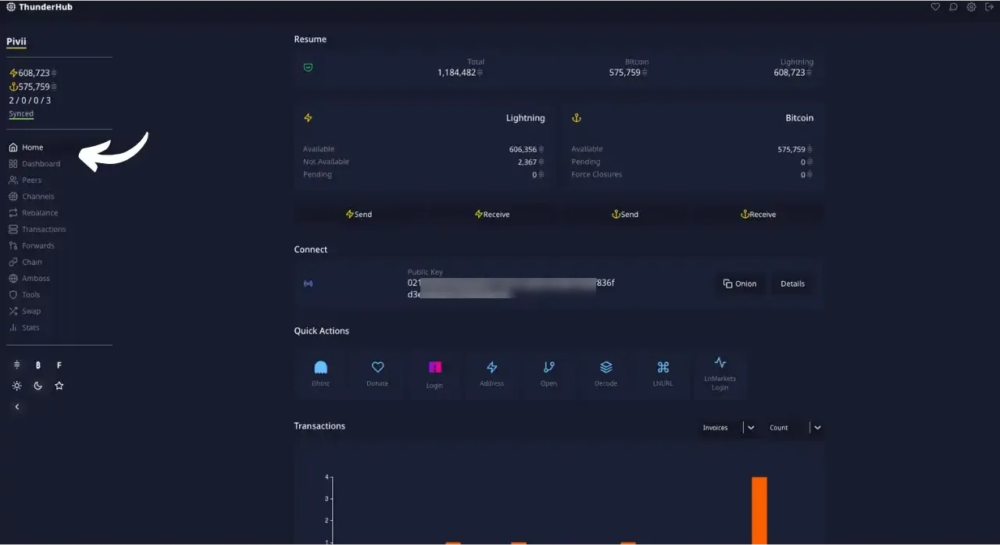


- 残高と容量:** ThunderHubのページ上部には、利用可能な残高が表示されます。ここには通常、On-Chain残高（ノードのWalletのBitcoin On-Chain、Anchor ⚡で表示）とLightning残高（あなたのチャンネルの容量、Lightning Bolt ⚡で表示）が表示されます。これで、On-ChainとLightningの資金がすぐにわかります。複数のアカウントやチャンネルを持っている場合は、正しいチャンネルを選んでください（例：MainnetとTestnet）。


- 主な統計:** ダッシュボードには、ノードのグローバル・メトリクスを表示できます。例えば、オープン・チャンネル数、接続ピア数、獲得したルーティング料金（該当する場合）などです。これはノードの最近のアクティビティと健全性の要約です。


- クイックアクション:** ダッシュボードには、メニューをナビゲートすることなく、最も一般的なタスクを素早く実行するためのボタンがあります。これらのクイックアクションには以下が含まれます：


  - Ghost**です：Amboss経由でライトニングAddressのカスタムを設定。
  - 寄付する**：Lightningで寄付をする。
  - ログイン/移動**：Ambossアカウントに接続し（クイックコネクト）、Amboss.spaceに直接アクセスしてノードの情報をご覧ください。
  - Address** ：ライトニングAddressを入力してお支払いください。
  - 開く**：新しいライトニング・チャネルを開く。クリックすると、チャネルを開くリモートノードのURI、金額、および該当する場合は使用するOn-Chain手数料の上限を入力するフォームが開きます。
  - デコード**：ライトニングInvoiceまたはLNURLをデコードし、支払い前に詳細を表示します。
  - LNURL**：Lightningの支払いまたは引き出しのためにLNURLを処理する。
  - LnMarketsログイン**：LnMarketsにログインして取引を行う。


これらのクイックアクションは、Interfaceの様々なタブをナビゲートすることなく、ホームページから直接最も頻繁に使用する操作を実行することができます。


つまり、ThunderHubダッシュボードはノードの**クイックルック**を提供し、ワンクリックで最も頻繁に使用する操作（送受信、チャンネルを開く）を実行することができます。日々の管理には理想的なスタート地点です。


### ダッシュボード


ダッシュボード**セクションはホームタブとは別にあり、より高度でカスタマイズ可能なダッシュボードを提供します。このセクションでは、ノードオペレータとしてのニーズに応じて、特定のウィジェットでカスタマイズされたビューを作成することができます。


- カスタマイズ可能なウィジェット:** 固定レイアウトのホームページとは異なり、ダッシュボードではどのElementsを表示し、どのようにそれらを整理するかを正確に選択することができます。


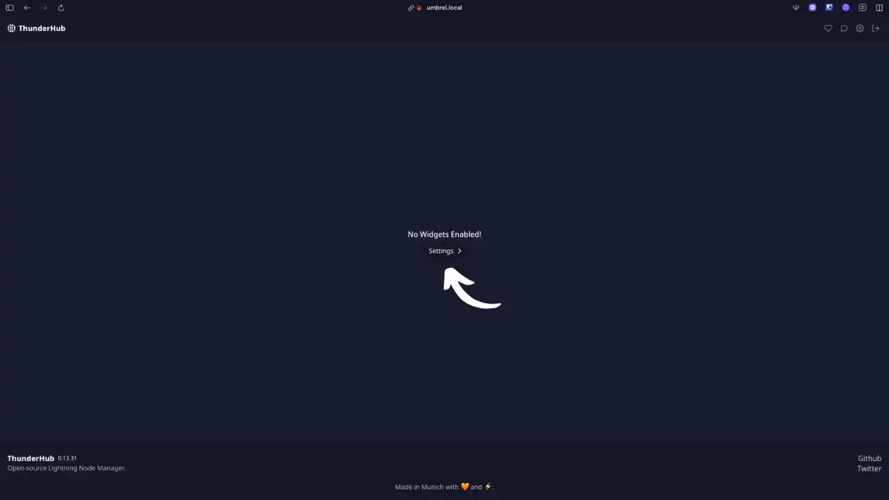


ウィジェットが有効になっていない場合、"No Widgets Enabled!"メッセージが表示され、カスタマイズパラメータにアクセスするための "Settings "ボタンが表示されます。


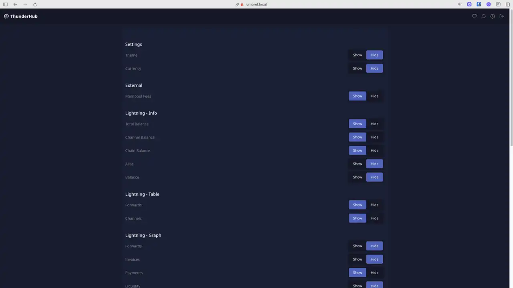


設定では、カテゴリ別に整理された幅広いウィジェットから選択することができます：「Lightning - Info"、"Lightning - Table"、"Lightning - Graph "など。各ウィジェットは "表示/非表示 "ボタンで個別に有効/無効を切り替えることができます。


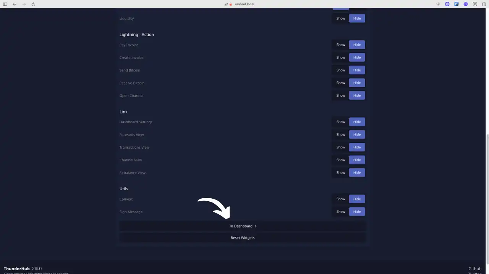


設定の一番下には、ダッシュボードに戻るための "To Dashboard "ボタンと、デフォルトの表示をリセットするための "Reset Widgets "ボタンがあります。


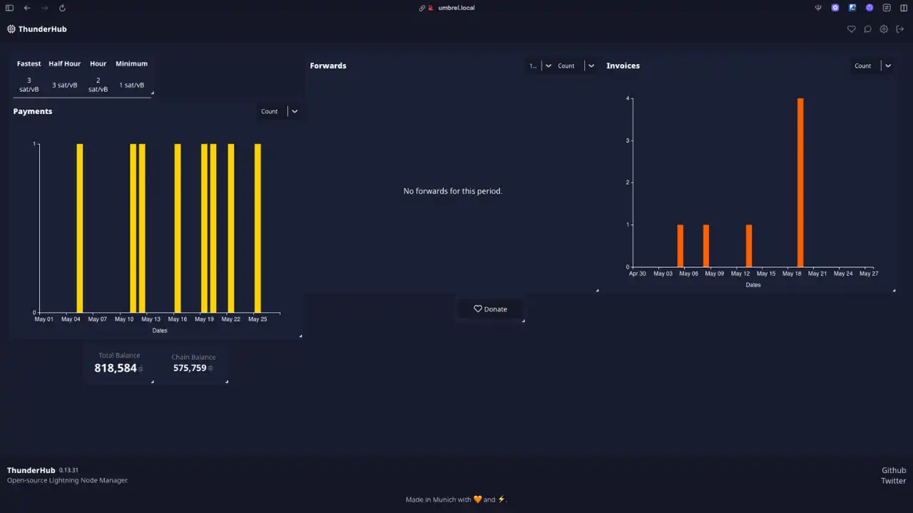


一度設定すれば、ダッシュボードに様々なグラフや指標を表示することができます：ライトニング決済グラフ、請求書発行数、フォワード統計、詳細残高など。


- 高度なメトリクス:** グラフやリアルタイムのデータを使って、ノードのパフォーマンスに関するより詳細な統計情報にアクセスできます。


- 設定可能なオーバービュー:** カジュアル・ユーザーでも、複数のルーティング・チャンネルを管理するプロフェッショナル・オペレーターでも、お好みに合わせてディスプレイを調整できます。


- モジュラーInterface:** 必要に応じてウィジェットを追加または削除：フォワードチャート、流動性メトリクス、ノードの健全性アラートなど。


このセクションは、特定のメトリクスを監視したり、Lightning ノードのより技術的な概要を把握したい上級ユーザに特に便利です。情報の表示方法をより柔軟にコントロールすることで、Homeセクションを補完します。


### ピアーズ


ピア**セクションには、現在あなたのノードとピアとして接続されているすべてのライトニング・ノードが表示されます。ピア**とは、Lightning Network上のノード間の直接接続のことです。あなたのノードは、オープンチャネルがなくてもピアに接続することができます（例：ネットワーク上のExchangeゴシップ情報）。


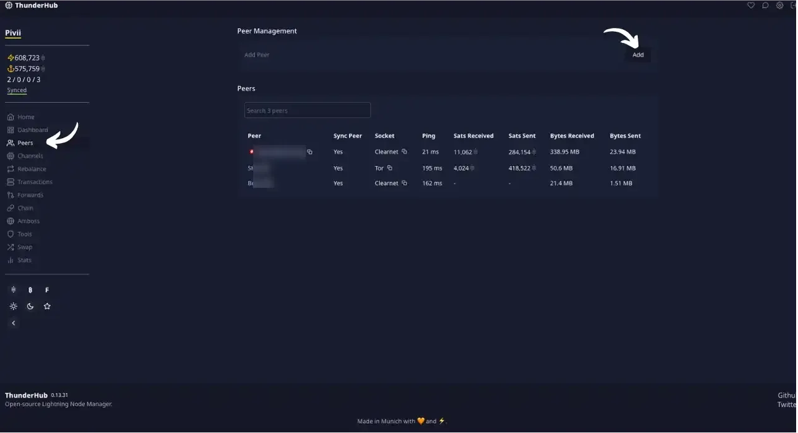


ピア "タブには、：


- 情報欄：** Interfaceには、同期状態、接続タイプ（クリアネットまたはTor）、ping、受信/送信されたサトシ、交換されたデータ量などの便利な詳細情報が表示されます。
- ピアの追加:** ThunderHubでは、右上の**"Add "**ボタンから手動で新しいピアに接続することができます。ノードの URI (`<public_key>@<socket>` 形式) を入力する必要があります。認証されると、ThunderHub は対応する `lncli connect` コマンドを送信する。そのノードがオンラインかつアクセス可能であれば、ピアリストに追加される。


### チャンネル


チャネル**タブは、Lightningチャネル管理の中心です。おそらく最も頻繁に参照するセクションです。すべてのLightningチャネル**とその詳細が表示され、これらのチャネルに対して管理アクションを実行できます。


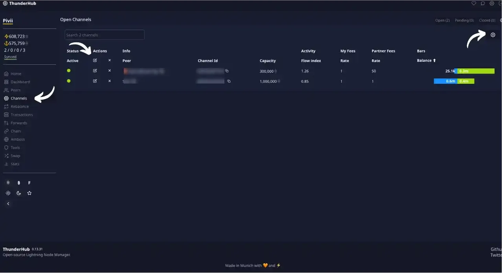


チャンネルページにはこんなものがある：


- チャンネルリストビュー:** 開いている(または開いている/閉じている)各チャンネルは、通常リモートノードのエイリアス、合計チャンネル容量、ローカルとリモートの流動性の分布を示す色付きのバーと共に一覧表示されます。ThunderHubでは、カラーコード(多くの場合、青/Green)またはパーセンテージを使用してチャネルのバランスを示す。チャネルのバランスが完全に取れている場合（50/50）、バーは各色の半分になります。これにより、どのチャンネルがアンバランスかを一目で識別できます（すべて青＝ほぼすべてローカル、すべてGreen＝ほぼすべてリモート）。


- 情報コラム：*** Interfaceは、ステータス、利用可能なアクション、ピア情報、チャネルID、容量、アクティビティ、料金、残高などの詳細コラムをグラフィカルな流動性表示で表示します。


- 表示設定：**右上の歯車で、チャンネル表示を好みに合わせてカスタマイズできます。


- ステータス:** ステータス・インジケータも表示されます。例えば、`Active` (チャンネルはオープンで使用可能)、`Offline` (ピアは切断され、チャンネルは一時的に使用不可)、`Pending` (On-Chainの確認待ちのオープンまたはクローズ)。


- チャンネル上のアクション:** 各チャンネルには、ThunderHubのアクションボタンが用意されています：


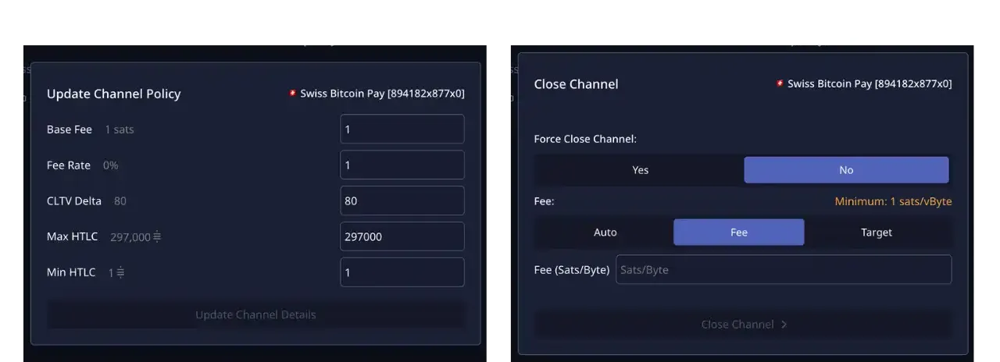


  - 料金の編集：*** Interfaceの「チャンネル・ポリシーの更新」では、すべてのチャンネル・パラメーターを調整できます：基本料金、料金レート（ppm）、CLTVデルタ、最大HTLC、最小HTLC。これにより、ルーティングトラフィックを誘致（または抑制）する目的で、チャンネルごとに個別に料金ポリシーを調整することができます。 *(注：ThunderHubは自動料金管理ツールの代わりにはなりませんが、手動調整には非常に有効です）*。
  - クローズ・チャンネル (*Close*)**：Interfaceの "クローズ・チャンネル "では、**協調クローズ**（デフォルト）か**強制クローズ**（*Force Close*）のどちらかを、手数料（Sats/vByte）を定義することによって選択することができます。 **重要:**On-Chainの決済遅延と高い手数料を避けるため、可能な限り常に協調決済を選択してください。ThunderHubは相手がオンライン（協調可能）かどうかを教えてくれます。フォースクローズの場合、不可逆的であり、タイムロック（Bitcoin Mainnetでは通常144ブロックまたは～1日）を伴うスイープトランザクションが発生するため、必ず確認してください。
  - 新しいチャンネルを開く:** 新しいチャンネルを開くには、チャンネルページの右上にある歯車をクリックし、「開く」を選択します。新規または既存のピアにチャンネルを開始することができます。このページを使用する利点は、既存のチャネルのリストが目の前にあることです。


つまり、「チャンネル」セクションは、各チャンネルを **細かくコントロール** することができる。ここで流動性の割り当てを行い、どのチャンネルを残すか閉じるかを決定し、チャンネルごとのルーティングパラメータを設定します。ThunderHubはこれらの重要なノード管理操作にInterfaceを提供しています。


### リバランス


リバランス**タブは**チャンネル・バランシング**専用です。バランシング (または **リバランス**) は、Lightning Networkを経由して、あるチャンネルから別のチャンネルへ**循環支払い**を行うことで、送出チャンネルと受入チャンネル間の資金配分を再調整することを含みます。これにより、新たな資金を入れることなく、流動性を満杯のチャンネルから空っぽのチャンネルに移すことができ、チャンネルをより有用なものにすることができます（バランスの取れたチャンネルは、支払いの送信と受信の両方を行うことができます）。


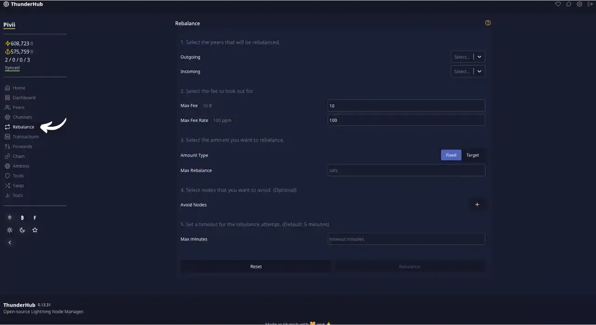


ThunderHubを使えば、コマンドラインでは面倒なこの操作が非常に簡単になります。以下は、Rebalanceセクションの使い方です：


- 初期チャンネル表示:** Rebalanceに入ると、ThunderHubはチャンネルのリストを表示し、各チャンネルのバランスインジケーターが表示されます（チャンネルページにあるものと同様です）。どのチャンネルがバランスを崩しているかすぐにわかります。ThunderHubはバランスの良い順にチャンネルを並べ替えることができ、最もバランスの悪いチャンネルがリストの一番上に表示されます（0.0は完全にローカルまたはリモートを意味します）。


- ピア選択：** Interfaceは、リバランシングのための発信・着信ピアの選択を容易にします。


- パラメータ設定：** ：
  - あなたが支払うことをいとわない**最大料金**（Satsおよびppm単位
  - 固定」または「目標」オプションで**リバランス**する金額
  - ルーティング時に避けるべきノード
  - ルート探索の最大試行時間


- ソース****チャネルを選択する：まず、**発信(ソース)**チャネルを選択する。つまり、ローカル の流動性が高すぎて移動できないチャネルを選択する。実際には、ローカル・シェア が高い（50％以上）チャンネルを指す。例えば、Aチャネルに1,000,000のサットがあり、そのうちの900,000が ローカルチャネルである場合を考えてみよう。このAチャンネルを「発信」としてクリックすると、ThunderHubはこのチャンネルを発信元としてマークします。


- ターゲット・チャネルを選択する：次に、流動性を受け取る必要のある**流入（ターゲット）***チャネルを選択する。一般的に、このチャネルは流動性が低い側のチャネルとなります（例：1,000,000のうち100,000のローカルサッツのみ）。ThunderHubは、ソース・チャンネルを選択すると、他のチャンネルを逆順（残高の少ない順）にソートし、最も補完的なチャンネルを特定しやすくします。ローカル側に余裕のあるBチャンネルを選択します。ThunderHubはどの2つのチャンネルが選択されたかを明確に表示します（ソースAとターゲットB）。


- 手数料の金額と許容範囲を設定する：


  - リバランスする**量**（Sats単位）。多くの場合、両チャンネルをバランスさせる量に等しい量を選びます。ThunderHubは、例えばソースチャンネルの余剰容量の半分を事前に充填することができます。
  - この操作に支払ってもよい**最大料金**（オプション）。この料金は Sats (循環経路の総コスト) で表されます。空白のままだと、ThunderHubはコストに関係なく経路を探しますが、これは一般的にお勧めできません（小さなリバランスの場合は10Sats、最大ppmなど、制限を設定する方が良いでしょう）。


- Find Route:**ボタンをクリックしてルートを検索します。ThunderHubはLNDに問い合わせ、送信元チャンネルからネットワークを経由してターゲットチャンネルまでのルートを計算します。料金条件を満たすルートが見つかった場合、ホップの詳細と料金が表示されます。例えば、Satsを合計2回使用する3ホップの経路が見つかったと表示されます。


- リバランス開始:**提案されたルートに問題がなければ、**Balance Channel**をクリックします。ThunderHubがLND経由でサーキュラーペイメントを開始します。支払いが成功すると、成功通知が表示され、チャンネルAとBの残高がリアルタイムで変更されます。ThunderHubはこれらのチャンネルの残高インジケータを更新します（理想的には、以前よりも緑色になり、残高が良くなることを示します）。


- 調整と反復:** 最初の試行でルートが見つからなかった場合（あるいは高すぎる場合）、パラメータを調整することができます：


  - 少額で試してみてください（大量のリバランスが失敗する一方で、部分的なリバランスがうまくいくこともあります）。
  - 手数料の上限は徐々に上げていくが、価値以上の手数料を支払わないように注意すること。
  - 別のルートを取得する**ボタンがあれば、それを使って別のルートを試してください。
  - もし、本当に粘着質になるようなら、別のチャンネルを試してみてほしい。


ThunderHubは、このプロセスを非常に**直感的で視覚的**なものにします。たった4つのステップ（送信チャネルの選択、受信チャネルの選択、金額、検証）で、これまで複雑な手動コマンドを必要としていたことが可能になります。このツールは、バランスの取れたノードを維持し、ルーティングのパフォーマンスとエクスペリエンスを向上させる（すべてのチャネルでより簡単に支払いを送受信できる）貴重なツールです。


最後に、リバランスは（中間ノードに支払う）ルーティングコストを消費するので、ノードをより流動的にするための**投資**であることに注意してください。例えば、よく利用するサービスへのチャネル（インバウンドの流動性）をサポートするためや、大規模なルーティングチャネルのバランスを取るためなど、賢く利用してください。ThunderHubはこれを**簡単かつ効率的に**行うことができます。


### トランザクション


ThunderHubの**Transactions**セクションは、あなたのノードの**Lightning**取引履歴に対応します。これは、LNの業務に関する明細書のようなものです。


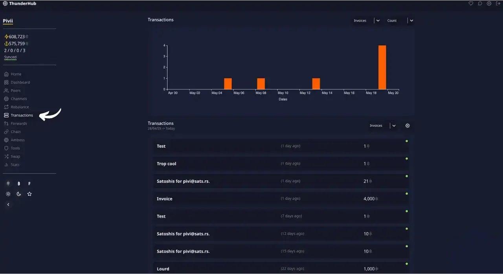


このタブには ：


- Invoiceグラフ:** 右上に、請求書の経年変化をグラフで表示し、ノードの活動を可視化することができます。


- あなたのノードから*または*あなたのノードへ*行われたすべてのLightningトランザクションの時系列リスト。各エントリには ：


  - 操作のタイプ： **支払い送信**（送信支払い）または**支払い受領**（受信、支払い済みInvoice経由）。
  - Satsの金額。
  - 日時
  - 支払いID（HashまたはRHashのプリイメージ）またはコメント（Invoiceにメモを追加した場合）。
  - ステータス： **completed**、または場合によっては**in progress**/*failed*（決済待ちの支払いなど。）


つまり、「取引」セクションは**LNのアクティビティログ**として機能します。支払いが完了したか、手数料がいくらかかったかを確認したり、Lightning 交換の履歴を追跡したりするのに非常に便利です。次に説明するForwardsセクションと併用することで、ノードを通過した資金を完全に把握することができます。


### フォワード


Forwards**タブはあなたのノードの**routing**アクティビティ、つまり（Lightning Networkで仲介ノードとして機能する場合）あなたのチャネルを**通過する支払い専用です。あなたのノードをルーティング・ノードとして運用している場合、このセクションはあなたのパフォーマンスを追跡するための重要なセクションです。


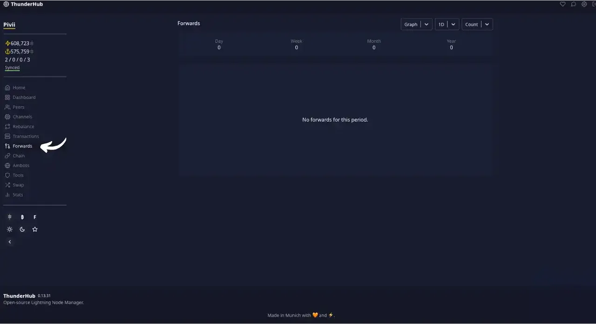


フォワード』では、ThunderHubが：


- フィルターと表示オプション:** 右上のフィルターでは、データを日/週/月/年で並べ替えたり、グラフ表示か表形式表示かを選択できます。


- アクティビティメッセージ：**選択した期間にルーティングが実行されていない場合、Interfaceはこの例のように「No forwards for this period」と表示します。


- 各エントリーは、あなたのノードを介して**転送**された支払いに対応しています。各フォワードに対して、通常、：


  - Timestamp、
  - ルーティングされた金額（単位：Sats）、
  - このフォワードで獲得した**フィー**（Satsでは、受信チャンネルで受信したものと送信チャンネルで送信したものとの差額）、
  - 使用される送受信チャンネル（ピアエイリアスまたはチャンネルIDで識別されることが多い）。
  - ステータス（通常は*完了*、フォワードが途中で失敗した場合は失敗）。


- 集計統計**：ThunderHubは、一定期間（24時間、7日間など、設定可能な場合もあります）の集計と統計を計算し、ページ上部に表示します。


つまり、Forwardsセクションは、Lightningノードのルーティングアクティビティ**の概要をリアルタイムで提供します。ChannelsおよびRebalanceセクションと組み合わせることで、ノードを最適化するための完全なパッケージが形成されます：Channels/Rebalanceは流動性を、Forwardsは結果（フローと利益）を観察します。


### チェーン


チェーン**セクションは、LNDノードのBitcoin On-Chainポートフォリオ管理に対応しています。このInterfaceでは、Bitcoinの資金を表示および管理することができます。この資金は、チャネルを開いたり、閉じたチャネルから資金を受け取ったりするために使用されます。


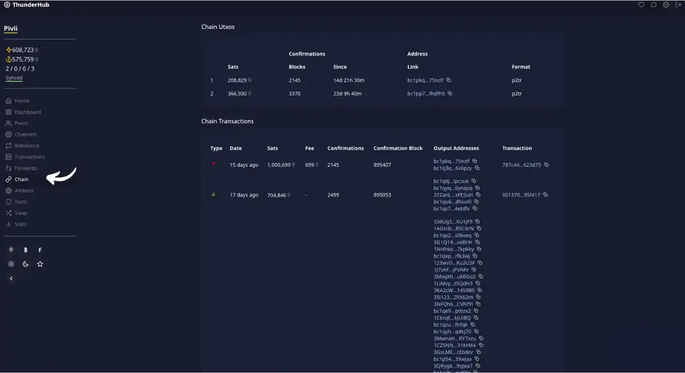


チェーンでは、：


- Balance On-Chain :** Wallet LND で利用可能な BTC 残高の合計を表示します。


- UTXOリスト:** すべての未使用アウトプット（UTXO）を、各アウトプットの金額、確認、Address、フォーマットとともに表示します。


- 取引履歴：*** Bitcoinの全取引の詳細な表で、タイプ（イン/アウト）、日付、金額、チャージ、確認、包含ブロック、住所、txidを表示。


### アンボス


ThunderHubは**Amboss**プラットフォーム（amboss.space）と統合されており、Lightningノードの詳細情報、流動性マーケットプレイス、暗号化チャネルのバックアップや可用性監視などの便利な機能を提供している。


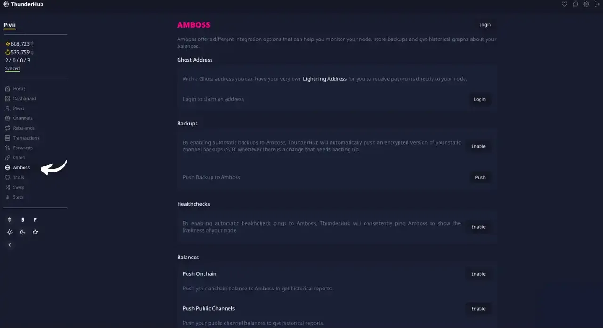


ThunderHubのAmbossセクションで、ノードをAmbossアカウントに**リンク**することができます：


- ゴーストAddress:**あなたのノードに**あなた専用のライトニングAddress**をセットアップし、入金を促進します。


- 自動チャンネルバックアップ:** Ambossの暗号化チャンネルバックアップ** (SCBファイル)の主要機能です。設定で**Amboss Auto Backup = Yes**を有効にすると、チャンネルを変更するたびに暗号化されたバックアップの更新が自動的に送信されます。障害が発生した場合、この外部バックアップのおかげで資金を回復することができます。


- ヘルスチェック:** **Amboss Healthcheck = Yes** を有効にすると、ノードが定期的にAmbossにpingを送信します。ノードがオフラインのように見えるとアラートが表示されます。


- その他の機能：**自動残高プッシュ、**マグマ/ハイドロ**統合（流動性市場）、詳細なパフォーマンス統計へのアクセス。


Ambossの統合により、自動的な外部バックアップと可用性監視を備えた**セキュリティLayer**が追加され、ThunderHubから直接アクセスできるようになりました。


### ツール


ツール**セクションには、ノードを管理するための様々な高度なツールがまとめられています。主なElementsはこちらです：


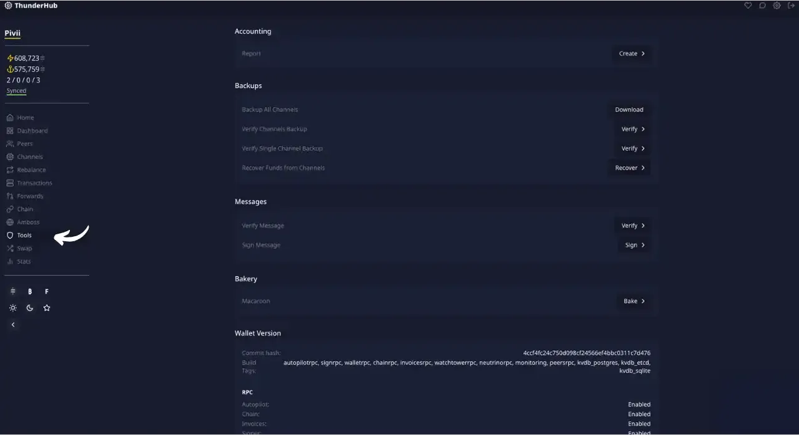


- バックアップ:** チャンネルのバックアップ(SCB)を手動で管理します。ThunderHubでは、**チャンネルの完全なバックアップファイル**をダウンロードすることができます（オプション "Backup all channels -> Download"）。この`channel-all.bak`ファイルは安全な場所に保管してください - クラッシュ時に資金を回復するために不可欠です。ノードの再デプロイ時にバックアップファイルを**インポート**することもできます。


- 会計:** 一定期間に獲得/支払われた料金やルーティングされたボリュームを含む財務レポートのためのエクスポートツール。
- 署名付きメッセージ:** **暗号化署名により、Lightning ノードの Ownership を証明するために、自分のノードで署名または検証** を行います。
- マカロン(ベーカリーセクション):** LND**マカロンを管理し、カスタマイズされたアクセスを作成します。Interfaceの「ベーカリー」では、各権限を細かく選択することができます：Interfaceの "ベーカリー "では、"ピアの追加と削除"、"チェーンアドレスの作成"、"請求書の作成"、"マカロンの作成"、"キーの導出"、"アクセスキーの取得"、"チェーン取引の取得"、"請求書の取得"、"Wallet情報の取得 "などの各権限を正確に選択することができます、「支払いの取得"、"ピアの取得"、"請求書の支払い"、"アクセス ID の取り消し"、"チェーン・アドレスへの送信"、"バイトの署名"、"メッセージの署名"、"daemon の停止"、"バイトの署名の検証"、"メッセージの検証 "など。各許可は "Yes/No "ボタンで個別に有効化でき、オーダーメイドのマカロンを作成できる。
- システム情報：** Wallet のバージョンと有効な RPC を表示します。


つまり、「ツール」セクションは、バックアップ、アカウンティング、セキュリティ、アクセス管理といった高度な管理機能を、統一されたInterfaceにまとめている。


### スワップ


ThunderHubの**スワップ**タブでは、Boltzサービス経由でLightningサトシをBitcoin On-Chainにスワップすることができます。この機能は、チャンネルを閉じることなく、余分なLightningの流動性をチャンネルに「捨てる」のに便利です。


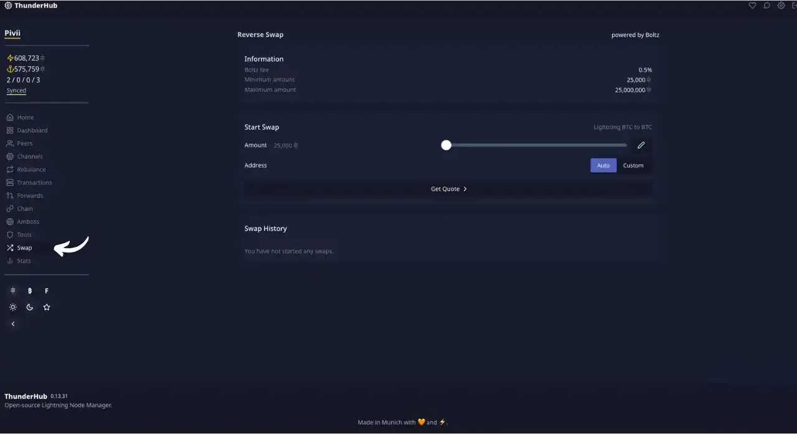


やり方は簡単だ：


- 金額**：交換する金額を指定する。
- Address** ：Bitcoin受信 Addressを入力
- 実行**：ThunderHubはBoltzと通信し、Exchangeを自動的に処理する。


**福利厚生


- 非保管サービス（現金預かりなし）
- 既存のチャンネルを維持する
- 使いやすい一体型Interface


Boltzは少額の手数料を請求し、お客様は標準的なBitcoin取引手数料を支払います。ThunderHubは確認前にすべての費用を表示します。


### 統計


ThunderHubの**統計**セクションは、Lightningノードの**詳細統計**を提供し、パフォーマンスを分析し、ルーティングを最適化します。


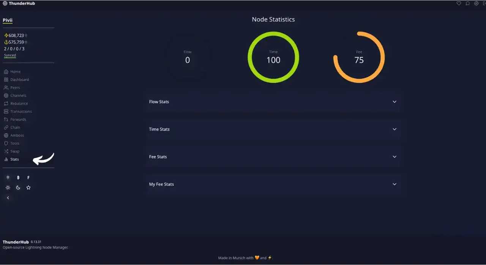


このセクションは、コストを最適化し、成功するチャネルを特定し、ノードの拡大を計画するために不可欠である。


## 結論


**ThunderHub**は、Lightning **LND**ノードを簡単に管理するための不可欠なツールです。この最新のInterfaceは、チャネル管理、決済、モニタリング、自動リバランスやAmboss統合などの高度な機能など、必要な機能をすべて備えています。


**主な利点:**


- Interface 洗練された直感的なデザイン
- 強力なツール（リバランス、ボルツスワップ、自動バックアップ）
- Umbrel、Voltage、RaspiBlitz、その他のディストリビューションと互換性があります。


ThunderHubは、高度なLightningノード管理を民主化し、以前は複雑な技術コマンドが必要だったものを利用しやすくします。初心者でも経験豊富なオペレーターでも、ThunderHubを使えば、最新の包括的なInterfaceでLightningノードを効率的に管理できます。


## リソース


**公式リンク


- 公式サイト:** [thunderhub.io](https://thunderhub.io)
- ドキュメント：** [docs.thunderhub.io](https://docs.thunderhub.io)
- GitHubソースコード：** [github.com/apotdevin/thunderhub](https://github.com/apotdevin/thunderhub)