## Giới thiệu

Hướng dẫn nâng cao này sẽ hướng dẫn bạn từng bước cài đặt, cấu hình và sử dụng ứng dụng Lightning Node (LND) trên nút Umbrel của bạn. Bạn sẽ học cách mở kênh, quản lý thanh khoản và đồng bộ hóa nút của mình với ứng dụng di động.

## 1. Điều kiện tiên quyết: nút Bitcoin Umbrel chức năng

Trước khi triển khai Lightning, bạn cần có một nút Bitcoin hoạt động đầy đủ trên Umbrel. Điều này bao gồm việc cài đặt Umbrel (trên Raspberry Pi, NAS hoặc máy khác) và đồng bộ hóa hoàn toàn Blockchain Bitcoin.

Để cài đặt Umbrel và cấu hình nút Bitcoin của bạn, chúng tôi khuyên bạn nên làm theo hướng dẫn chuyên dụng của chúng tôi:

https://planb.network/tutorials/node/bitcoin/umbrel-8b0e3b5b-d3cf-4a1e-8bb8-1ad2db4dd848

Đảm bảo nút Bitcoin của bạn được cập nhật và hoạt động bình thường vì Lightning Network dựa vào nút này cho tất cả các giao dịch off-chain.

## 2. Giới thiệu về Lightning Network

Lightning Network là giao thức Layer thứ hai được thiết kế để tăng tốc và giảm chi phí cho các giao dịch Bitcoin bằng cách thực hiện chúng bên ngoài Blockchain chính.

Cụ thể, Lightning sử dụng mạng lưới các kênh thanh toán giữa các nút: hai người dùng mở một kênh bằng cách chặn On-Chain BTC (giao dịch ban đầu), sau đó có thể ngay lập tức Exchange thanh toán trong kênh này. Các giao dịch off-chain này không được ghi lại trên Blockchain, do đó tốc độ của chúng và chi phí hầu như bằng không.

Thanh toán có thể được định tuyến qua nhiều kênh (nhờ các nút trung gian) để đến bất kỳ người nhận nào trên mạng, cho phép mở rộng quy mô giao dịch tức thời gần như không giới hạn. Do đó, Lightning cung cấp các giao dịch rất nhanh, chi phí thấp, lý tưởng cho các khoản thanh toán hàng ngày hoặc các giao dịch nhỏ, đồng thời giảm tải cho Blockchain Bitcoin.

Để hoạt động, một nút Lightning phải được kết nối vĩnh viễn với mạng và tương tác với các nút Lightning khác. Có nhiều triển khai phần mềm khác nhau (LND, Core Lightning, Eclair, v.v.), tất cả đều tương thích với nhau. Umbrel sử dụng LND (Lightning Network Daemon) làm một phần của ứng dụng Lightning Node chính thức của mình. Hướng dẫn này tập trung vào LND.

Để có phần giới thiệu lý thuyết đầy đủ về Lightning Network, chúng tôi khuyên bạn nên tham gia khóa học chuyên sâu của chúng tôi:

https://planb.network/courses/34bd43ef-6683-4a5c-b239-7cb1e40a4aeb

Khóa học này sẽ cung cấp cho bạn nền tảng vững chắc về các khái niệm cơ bản của Lightning Network trước khi chuyển sang thực hành với nút LND của bạn.

## 3. Tại sao nên tự lưu trữ LND?

Vận hành nút Lightning của riêng bạn (LND) trên Umbrel giúp bạn có toàn quyền quản lý tiền và kênh của mình, so với các giải pháp lưu ký hoặc bán lưu ký.

### So sánh các giải pháp Lightning:

**Giải pháp lưu trữ (ví dụ: Wallet của Satoshi)** :

- Bitcoin Lightning của bạn được quản lý bởi bên thứ ba đáng tin cậy
- Dễ sử dụng, không phức tạp về mặt kỹ thuật
- Người điều hành giữ tiền của bạn và có thể theo dõi các giao dịch của bạn
- Bạn hy sinh quyền kiểm soát và tính bảo mật

**Danh mục đầu tư tiêu dùng phi hàng hóa (ví dụ: Phoenix, Breez)**:

- Người dùng giữ lại khóa riêng của họ và do đó Ownership BTC của họ
- Không có quản lý nút hoàn chỉnh - ứng dụng quản lý các kênh ở chế độ nền
- Sự thỏa hiệp giữa sự đơn giản và chủ quyền
- Sự phụ thuộc vào cơ sở hạ tầng của nhà cung cấp để đảm bảo thanh khoản
- Giới hạn kỹ thuật (một điện thoại thông minh không thể định tuyến thanh toán cho những điện thoại khác)

**Nút LND tự lưu trữ (Umbrel)**:

- Chủ quyền tối đa: BTC On-Chain và off-chain của bạn hoàn toàn nằm trong tầm kiểm soát của bạn
- Không có bên thứ ba nào tham gia vào việc mở kênh hoặc quản lý thanh toán của bạn
- Tăng tính bảo mật (các kênh và giao dịch của bạn chỉ được bạn và những người ngang hàng trực tiếp của bạn biết)
- Tự do sử dụng: kết nối với các dịch vụ và ví của riêng bạn
- Khả năng định tuyến giao dịch cho người khác (thù lao phí nhỏ)
- Tăng trách nhiệm kỹ thuật (bảo trì, quản lý thanh khoản, sao lưu)

Tóm lại, tự lưu trữ LND mang lại cho bạn khả năng kiểm soát tối đa, nhưng đòi hỏi nhiều kỹ năng kỹ thuật hơn. Đây là sự đánh đổi giữa sự tiện lợi và chủ quyền.

## 4. Hướng dẫn từng bước

### 4.1 Cài đặt và cấu hình ứng dụng Lightning Node trên Umbrel

Sau khi nút Umbrel (Bitcoin) của bạn được đồng bộ hóa, hãy làm theo các bước sau:

Cài đặt ứng dụng Lightning Node từ mục "App Store" của Interface Umbrel.

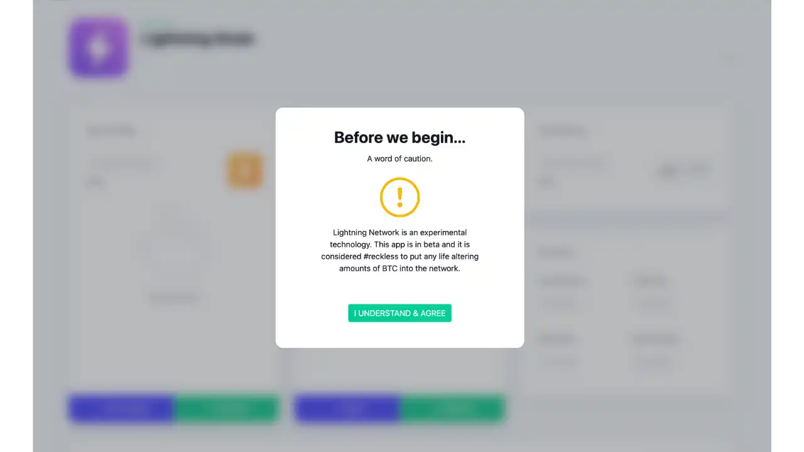

LND (Lightning Network Daemon) sẽ được triển khai trên Umbrel của bạn dưới dạng ứng dụng. Khi bạn mở lần đầu, bạn sẽ thấy một thông báo cảnh báo cho bạn biết rằng Lightning là công nghệ thử nghiệm.

Bạn có thể chọn giữa việc tạo một nút mới hoặc khôi phục một nút từ bản sao lưu/seed. Đối với lần cài đặt đầu tiên, hãy chọn tạo một nút mới. Ứng dụng Lightning Node sẽ generate một cụm từ Mnemonic gồm 24 từ (seed Lightning của bạn): hãy viết nó ra thật cẩn thận (tốt nhất là ngoại tuyến, trên giấy), vì nó sẽ được sử dụng để khôi phục tiền Lightning của bạn nếu cần.

**Lưu ý: Trên các phiên bản Umbrel gần đây, việc cài đặt ứng dụng Lightning sẽ cung cấp seed gồm 24 từ này (bản thân nút Bitcoin Umbrel thì không).**

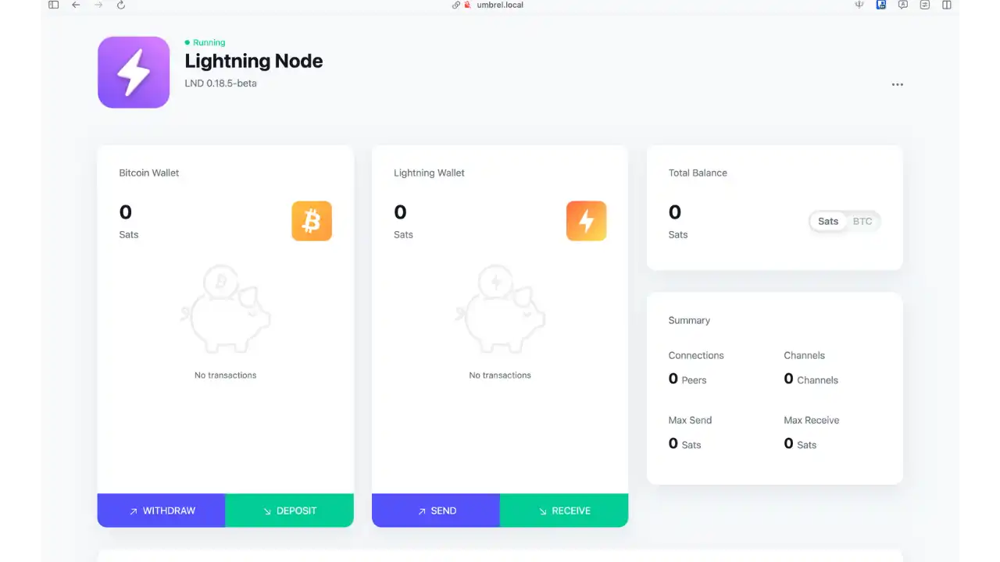

Sau khi khởi tạo, bạn sẽ truy cập vào Interface chính của Lightning Node.

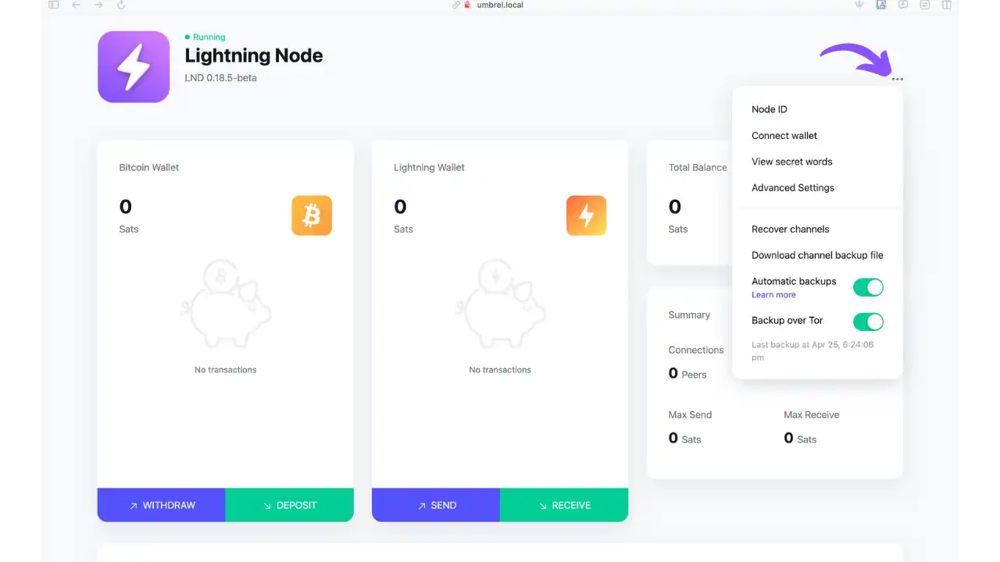

Trong phần cài đặt ứng dụng, bạn sẽ tìm thấy một số tùy chọn quan trọng:

   - Tham khảo ID nút của bạn (mã định danh duy nhất của nút của bạn)
   - Kết nối Wallet bên ngoài (Kết nối Wallet)
   - Xem từ bí mật
   - Truy cập Cài đặt nâng cao
   - Phục hồi kênh
   - Tải xuống tệp sao lưu kênh
   - Bật sao lưu tự động
   - Cấu hình sao lưu qua Tor (Sao lưu qua Tor)

Các tùy chọn này rất cần thiết cho việc bảo mật và quản lý nút Lightning của bạn. Hãy đảm bảo bạn kích hoạt sao lưu tự động và giữ an toàn cho các từ bí mật của mình.

**Tài nguyên hữu ích:**

- [Cộng đồng Umbrel](https://community.umbrel.com) - Diễn đàn thảo luận để người dùng chia sẻ các vấn đề và giải pháp liên quan đến Umbrel và hệ sinh thái của nó

> - [Umbrel App Store - Lightning Node (LND)](https://apps.umbrel.com/app/lightning) - Mô tả các tính năng của ứng dụng Lightning Node trên Umbrel
> - [Tài liệu LND - Khởi động nhanh](https://docs.lightning.engineering/lightning-network-tools/LND/run-LND) - Tài liệu chính thức của LND

### 4.2 Mở kênh Lightning

Sau khi LND được thiết lập và chạy, bạn có thể mở kênh Lightning đầu tiên của mình. Để tìm các nút chất lượng để kết nối:

[Amboss.space](https://amboss.space/) là một trình khám phá dùng để tìm các nút đáng tin cậy để mở kênh.

Ví dụ, [nút ACINQ](https://amboss.space/node/03864ef025fde8fb587d989186ce6a4a186895ee44a926bfc370e2c366597a3f8f) là một nút được công nhận có số liệu thống kê về tính khả dụng và thanh khoản tuyệt vời.

Đối với hướng dẫn này, chúng tôi sẽ mở một kênh với [Swiss Bitcoin Pay](https://amboss.space/node/03c181e13a09a649c13f60ea3ddbeefc66123c43280da8eebc19f54445f35173ca). Thông tin cần thiết để kết nối (pubkey@ip:port) được cung cấp trên trang Amboss của họ.

Để mở kênh:

Trên trang chủ Lightning Node, nhấp vào nút "+ MỞ KÊNH"

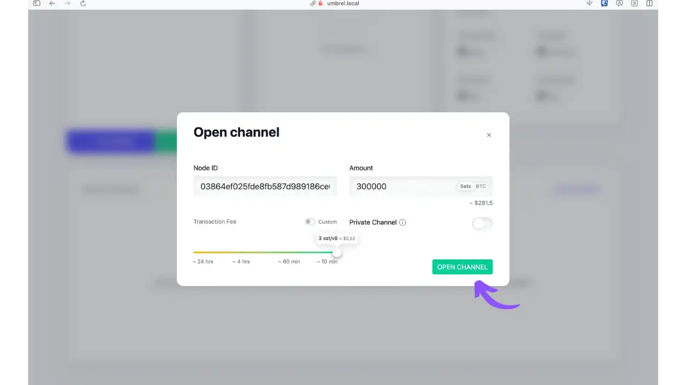

Trong trang cấu hình kênh:

   - Dán ID nút được sao chép từ Amboss (định dạng: pubkey@ip:port)
   - Xác định lượng dung lượng kênh (một số nút như ACINQ có mức tối thiểu, ví dụ: 400k Sats)
   - Điều chỉnh phí giao dịch mở nếu cần thiết

Sau khi giao dịch được gửi đi, kênh sẽ hiển thị là "đang mở" trên trang chủ. Chờ xác nhận giao dịch On-Chain.

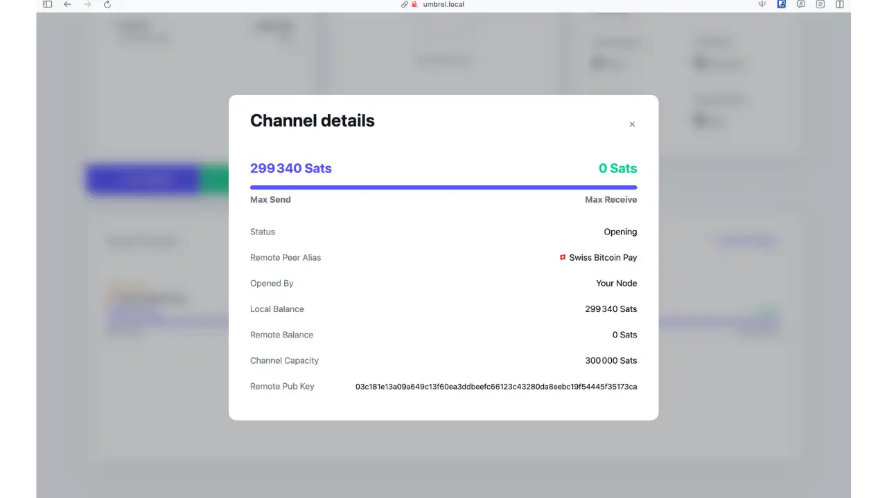

Nhấp vào kênh để xem thông tin chi tiết:

   - Tình trạng hiện tại
   - Tổng công suất
   - Phân tích thanh khoản (vào/ra)
   - Khóa công khai của nút từ xa
   - Và các thông tin kỹ thuật khác

### Sử dụng Lightning Network+ để có được thanh khoản đầu vào

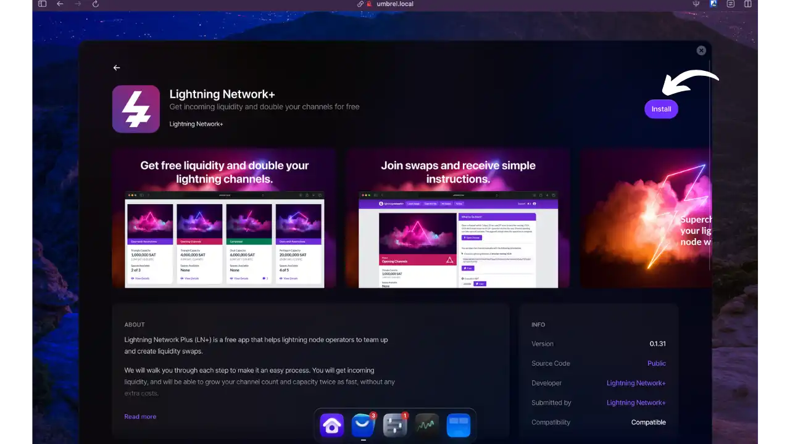

Lightning Network+ có sẵn trên Umbrel App Store giúp bạn dễ dàng nhận tiền mặt hơn.

Interface chính cung cấp ba tùy chọn quan trọng:

- "Hoán đổi thanh khoản: khám phá các ưu đãi hoán đổi có sẵn
- "Mở cho tôi": lọc các giao dịch hoán đổi mà bạn đủ điều kiện
- "To Docs": truy cập tài liệu

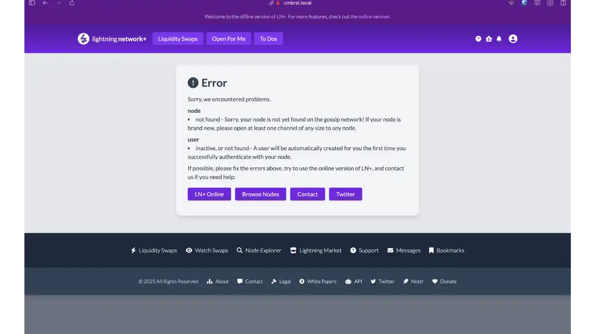

Lưu ý: Nếu bạn chưa mở kênh nào, bạn sẽ thấy thông báo lỗi này khi nhấp vào "Mở cho tôi".

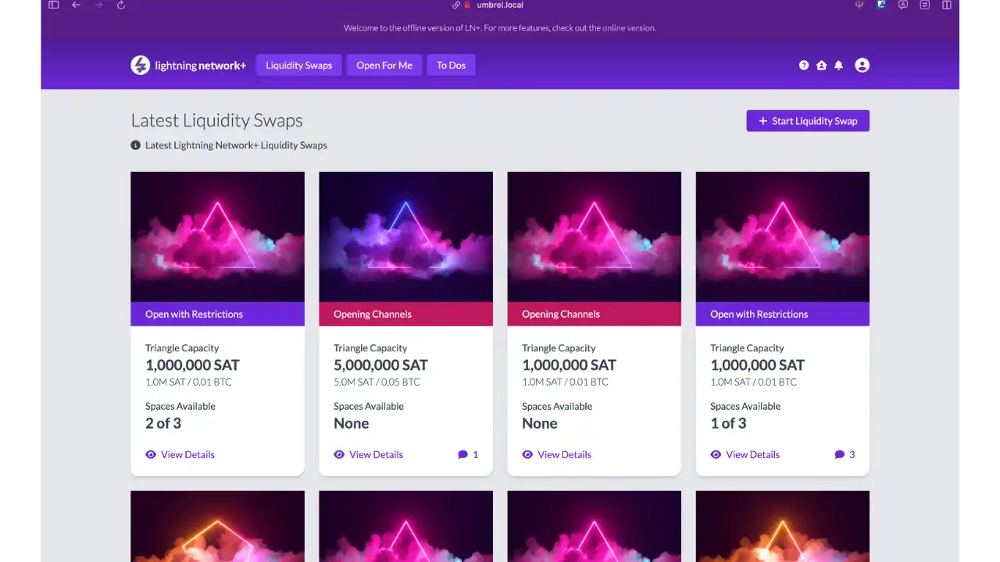

Trang "Hoán đổi thanh khoản" hiển thị tất cả các ưu đãi hoán đổi có sẵn trên mạng.

"Mở cho tôi" chỉ lọc những giao dịch hoán đổi mà nút của bạn đáp ứng các điều kiện bắt buộc.

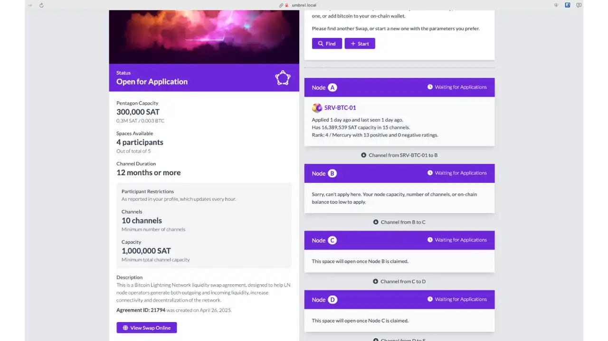

Ví dụ về chi tiết hoán đổi:

- Cấu hình Lầu Năm Góc (5 người tham gia)
- Công suất 300k Sats cho mỗi kênh
- Điều kiện tiên quyết: tối thiểu 10 kênh mở với tổng dung lượng 1M Sats
- Số chỗ còn trống: 4/5

### 4.3 Đồng bộ hóa với ứng dụng di động (Zeus)

Để điều khiển nút Lightning từ xa (trên điện thoại thông minh), bạn có thể sử dụng Zeus (ứng dụng mã nguồn mở có sẵn trên iOS/Android).

**Cấu hình Zeus với Umbrel :**

Đảm bảo rằng nút Umbrel của bạn có thể truy cập được (theo mặc định là qua Tor).

Trong Interface Umbrel, hãy mở ứng dụng Lightning Node, sau đó nhấp vào nút "Kết nối Wallet" theo chỉ dẫn bằng mũi tên.

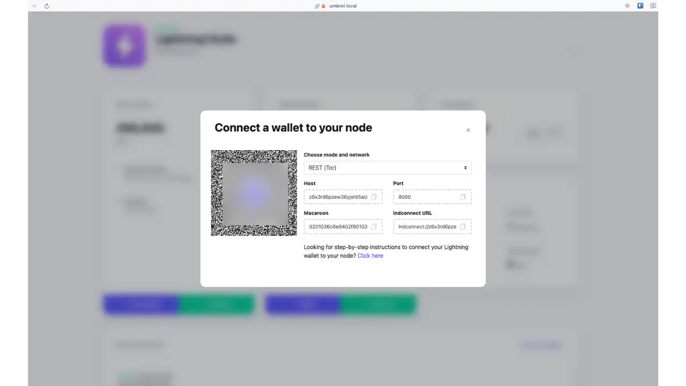

Mã QR xuất hiện, chứa dữ liệu truy cập LND của bạn ở định dạng lndconnect. Mã QR này đặc biệt chứa nhiều thông tin, vì vậy đừng ngần ngại phóng to để dễ đọc hơn.

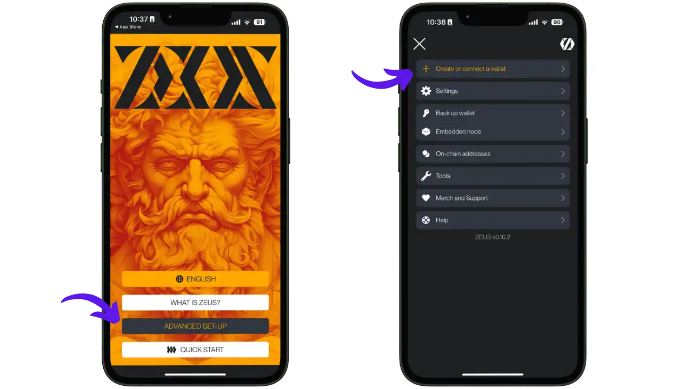

Trên điện thoại của bạn:

   - Mở Zeus
   - Trên trang chủ, nhấp vào "Cài đặt nâng cao" để kết nối nút Lightning của riêng bạn
   - Trong các thông số, chọn "Tạo hoặc kết nối Wallet"

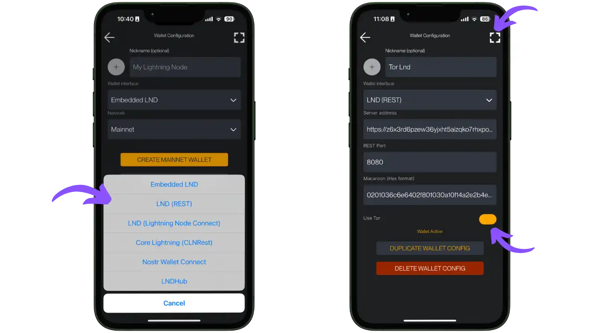

Trong Zeus:

   - Chọn "LND (REST)" làm loại kết nối
   - Bạn có thể quét mã QR (phương pháp được khuyến nghị) hoặc nhập thông tin theo cách thủ công. (Đừng ngần ngại phóng to mã QR Umbrel vì nó rất dày đặc)
   - Quan trọng: kích hoạt tùy chọn "Sử dụng Tor" nếu Umbrel của bạn chỉ có thể truy cập qua Tor (mặc định)
   - Lưu cấu hình

Zeus của bạn hiện đã được kết nối với nút Umbrel và cho phép bạn thực hiện thanh toán Lightning, xem kênh, số dư, v.v., trong khi vẫn hoàn toàn tự quản lý.

**Tùy chọn kết nối nâng cao:**

Theo mặc định, kết nối Zeus ↔ Umbrel là qua Tor. Để kết nối nhanh hơn, có hai lựa chọn thay thế:

**Kết nối nút Lightning (LNC)** :

   - Cơ chế kết nối được mã hóa của Lightning Labs
   - Cài đặt ứng dụng Lightning Terminal trên Umbrel (bao gồm quyền truy cập LNC)
   - generate kết nối mã QR trong Lightning Terminal (Kết nối → Kết nối Zeus qua LNC)
   - Quét nó vào Zeus (chọn "LNC" làm loại kết nối)

**VPN Tailscale**:

   - VPN dạng lưới dễ cấu hình
   - Cài đặt Tailscale trên Umbrel (App Store) và trên điện thoại di động của bạn
   - Kết nối Zeus qua IP riêng Tailscale thay vì Tor Address

Các tùy chọn này không bắt buộc và giải pháp Tor + Zeus hoạt động tốt trong hầu hết các trường hợp.

> **Tài nguyên hữu ích:**
> - [Tài liệu Zeus - Kết nối Umbrel](https://community.umbrel.com/t/zeus-LN-mobile/7619) - Hướng dẫn chính thức để kết nối Zeus với Umbrel
> - [Zeus GitHub](https://github.com/ZeusLN/zeus) - Dự án mã nguồn mở Zeus
> - [Cộng đồng Umbrel - Kết nối Zeus thông qua Tailscale](https://community.umbrel.com/t/how-to-use-tailscale-with-umbrel/6782) - Hướng dẫn kết nối Zeus với Umbrel bằng Tailscale

## 5. An toàn và các biện pháp thực hành tốt nhất

Việc quản lý một nút Lightning tự lưu trữ đòi hỏi phải đặc biệt chú ý đến vấn đề bảo mật.

### Sao lưu và bảo mật cho nút của bạn

**Các loại sao lưu cần thiết**

Nút Lightning Umbrel của bạn yêu cầu hai loại sao lưu:

**Câu seed (24 từ)**

- Thu hồi quỹ On-Chain
- Cần thiết để tạo lại Wallet Lightning của bạn
- Để lưu trữ cực kỳ an toàn (ngoại tuyến, trên giấy)

**Tệp Sao lưu kênh tĩnh (SCB)**

- Chứa thông tin kênh Lightning
- Cho phép đóng kênh bắt buộc trong trường hợp xảy ra sự cố
- **Quan trọng:** Không bao giờ lưu tệp `channel.db` theo cách thủ công (nguy cơ bị phạt)

**Quy trình sao lưu thủ công**

Để lưu kênh theo cách thủ công:

1. Truy cập menu Lightning Node (ba dấu chấm "⋮" bên cạnh "+ Mở kênh")

2. Tải xuống tệp sao lưu kênh

3. Xuất SCB mới sau mỗi lần sửa đổi kênh

4. Lưu trữ SCB một cách an toàn (phương tiện được mã hóa, sao chép ngoài trang web)

**Hệ thống sao lưu tự động**Umbrel

Umbrel có hệ thống sao lưu tự động tinh vi đảm bảo:

*Bảo vệ dữ liệu:*

- Mã hóa phía máy khách trước khi truyền
- Gửi qua mạng Tor
- Dữ liệu được bổ sung bằng cách điền ngẫu nhiên
- Khóa mã hóa duy nhất cho thiết bị của bạn

*Tăng cường bảo mật:*

- Sao lưu tức thời khi có thay đổi trạng thái
- Sao lưu "mồi nhử" theo các khoảng thời gian ngẫu nhiên
- Ẩn các thay đổi về kích thước sao lưu
- Bảo vệ chống lại phân tích thời gian

*Quá trình phục hồi:*

- Mã định danh và khóa lấy từ seed Umbrel của bạn
- Có thể khôi phục hoàn toàn chỉ với cụm từ Mnemonic
- Tự động phục hồi các bản sao lưu mới nhất
- Khôi phục cài đặt kênh và dữ liệu

### Phục hồi sự cố

Nếu nút của bạn bị mất (lỗi phần cứng, thẻ SD bị hỏng):

- Cài đặt lại Umbrel
- Nhập seed gồm 24 từ của bạn vào ứng dụng Lightning
- Nhập tệp SCB trong quá trình khôi phục

LND sẽ liên hệ với từng đối tác của các kênh cũ của bạn để đóng chúng và thu hồi phần tiền của bạn trong On-Chain. Các kênh sẽ bị đóng vĩnh viễn (sẽ được mở lại nếu cần thiết).

### Tính khả dụng và bảo vệ chống gian lận

Tốt nhất là hãy để nút thắt của bạn trực tuyến thường xuyên nhất có thể. Trong trường hợp vắng mặt trong thời gian dài:

- Một đối tác độc hại có thể cố gắng phát sóng trạng thái kênh cũ
- Lightning cung cấp một "thời gian phản đối" (khoảng 2 tuần trên LND)
- Nếu bạn sẽ đi xa trong một thời gian dài, hãy thiết lập Watchtower

**Cấu hình Watchtower:**

- Trong cài đặt nâng cao của LND, hãy thêm URL của máy chủ Watchtower đáng tin cậy
- Bạn có thể sử dụng dịch vụ công cộng hoặc tự cài đặt Watchtower của riêng bạn

Để tìm hiểu thêm về cách cấu hình và sử dụng tháp canh, chúng tôi khuyên bạn nên xem hướng dẫn chuyên sâu của chúng tôi:

https://planb.network/tutorials/node/lightning-network/watch-tower-26937006-dfe5-404e-9ee4-e82e422c5cf2
### Các biện pháp thực hành tốt nhất khác

- **Cập nhật phần mềm:** Cập nhật Umbrel và LND (sửa lỗi bảo mật)
- **Bảo vệ phần cứng:** Sử dụng hệ thống ổn định (Raspberry Pi với SSD, mini-PC) và UPS
- **Bảo mật mạng:** Giữ nguyên cấu hình Tor mặc định, thay đổi mật khẩu quản trị Umbrel (mặc định: "moneyprintergobrrr")
- **Mã hóa:** Bật mã hóa đĩa nếu có thể

## 6. Các công cụ bổ sung

Ứng dụng Lightning Node của Umbrel cung cấp những tính năng thiết yếu để quản lý kênh của bạn, nhưng các công cụ của bên thứ ba cung cấp chức năng nâng cao.

### Sấm sét

Hệ thống quản lý nút Lightning hiện đại dựa trên nền tảng web Interface có thể cài đặt thông qua Umbrel App Store.

**Đặc trưng:**

- Hiển thị kênh theo thời gian thực (công suất, cân bằng)
- Công cụ cân bằng tích hợp
- Hỗ trợ thanh toán đa đường (MPP)
- Tạo mã QR LNURL
- Quản lý giao dịch On-Chain

ThunderHub lý tưởng để giám sát một nút định tuyến đang hoạt động và thực hiện cân bằng lại đơn giản.

### Cưỡi Tia Chớp (RTL)

Interface tương thích với nhiều ứng dụng Lightning (LND, Core Lightning, Eclair).

**Điểm nổi bật:**

- Quản lý nhiều nút
- Bảng thông tin theo ngữ cảnh
- Hỗ trợ hoán đổi tàu ngầm (Lightning Loop)
- Xác thực 2 yếu tố
- Xuất/nhập bản sao lưu kênh

RTL là một "con dao đa năng" hoàn chỉnh để quản lý một nút Lightning theo cách tiếp cận hướng đến chuyên gia hơn.

### Các công cụ hữu ích khác

- **Lightning Shell**: Dòng lệnh (lncli) thông qua trình duyệt
- **BTC RPC Explorer & Mempool**: Giám sát Blockchain
- **LNmetrics & Torq**: Phân tích hiệu suất định tuyến
- **Amboss & 1ML**: Quản lý "xã hội" nút của bạn (bí danh, danh bạ, phân tích mạng)

Những công cụ này có thể được cài đặt chỉ bằng vài cú nhấp chuột thông qua Umbrel App Store mà không cần bất kỳ cấu hình phức tạp nào.

**Các nguồn công cụ bổ sung:**

- [ThunderHub.io - Tính năng](https://thunderhub.io) - Tổng quan về tính năng của ThunderHub
- [Thông tin về Ride The Lightning (RTL)](https://www.ridethelightning.info/) - Tài liệu RTL
- [David Kaspar - Cân bằng lại qua ThunderHub](https://blog.davidkaspar.com) - Hướng dẫn thực tế về cân bằng lại
- [Hướng dẫn "Quản lý Lightning Nodes"](https://github.com/openoms/lightning-node-management) - Tài liệu nâng cao dành cho người dùng có năng lực

## Phần kết luận

Việc chạy nút LND của riêng bạn trên Umbrel là một bước quan trọng hướng tới chủ quyền tài chính. Mặc dù đòi hỏi nhiều sự tham gia kỹ thuật hơn so với giải pháp lưu ký, nhưng lợi ích về mặt kiểm soát, tính bảo mật và sự tham gia tích cực vào Lightning Network là rất đáng kể.

Bằng cách làm theo hướng dẫn này, giờ đây bạn có thể cài đặt LND, mở kênh, quản lý thanh khoản và truy cập nút của mình từ xa. Hãy thoải mái khám phá dần dần các tính năng nâng cao và các công cụ bổ sung khi bạn trở nên quen thuộc hơn với hệ sinh thái.

Hãy nhớ rằng sự an toàn của tiền của bạn phụ thuộc vào các biện pháp bảo vệ và thực hành của bạn. Hãy dành thời gian để hiểu mọi khía cạnh trước khi cam kết số tiền lớn.