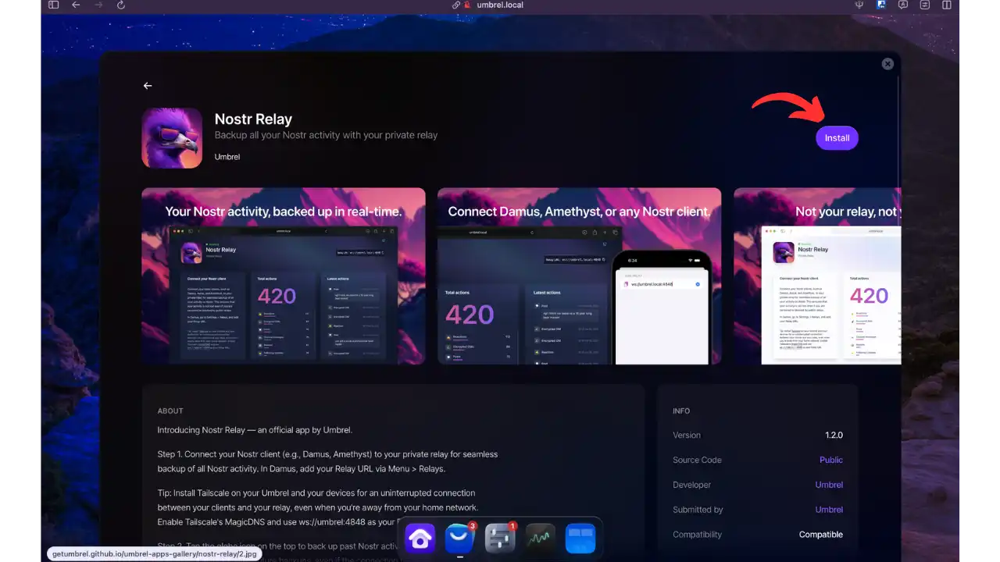
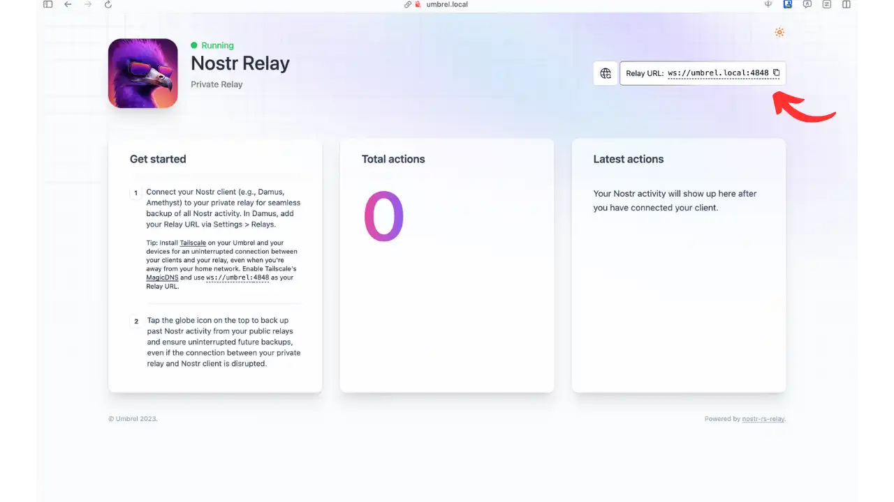
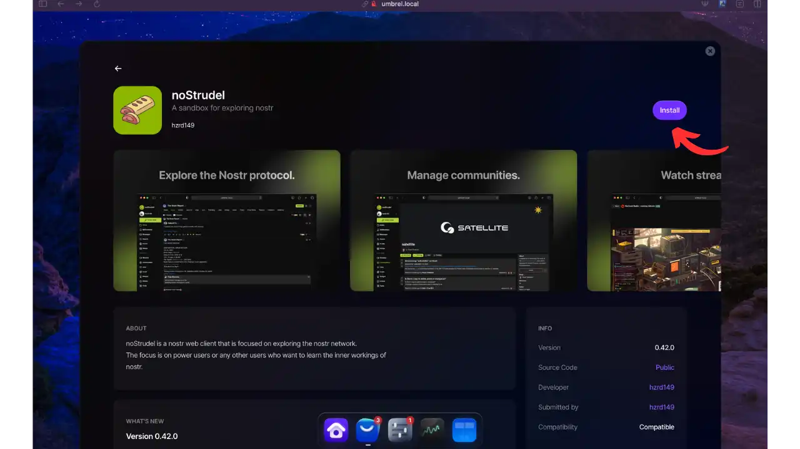
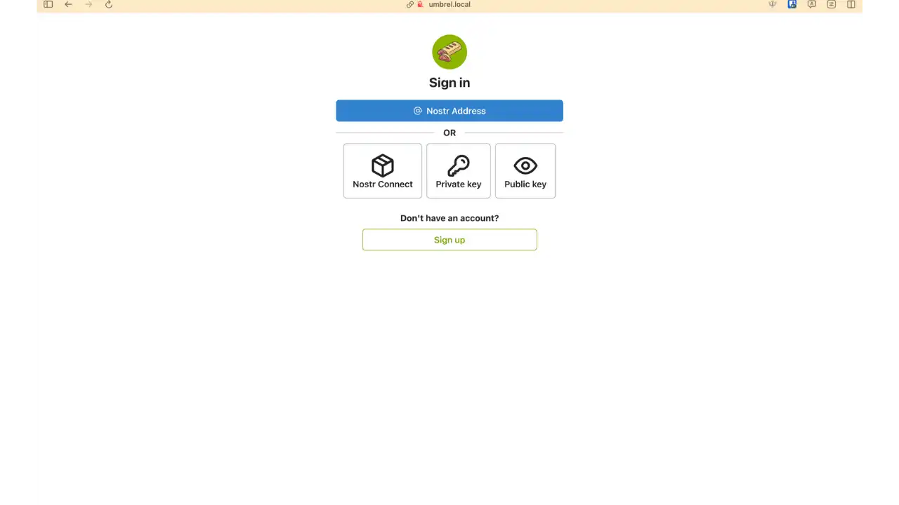
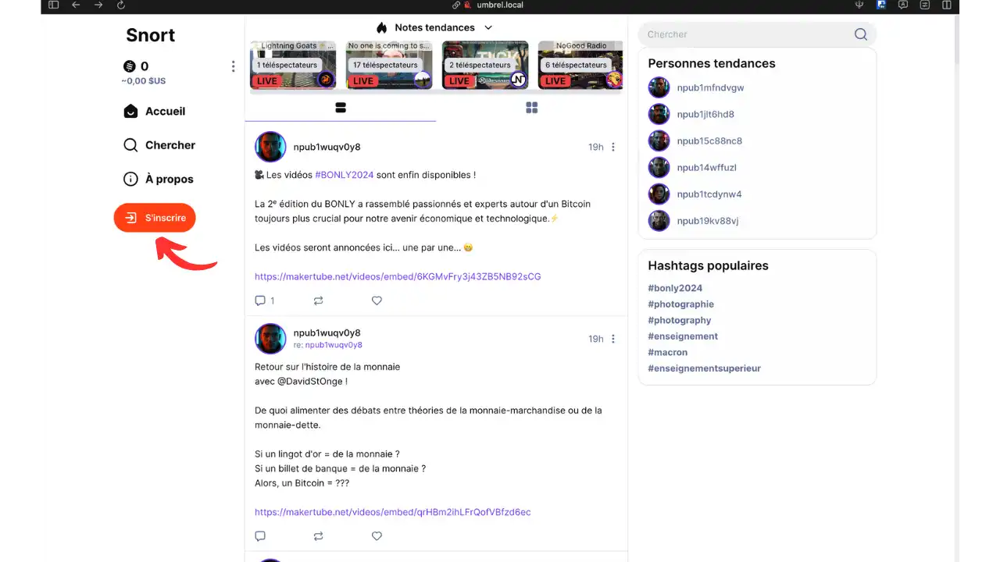
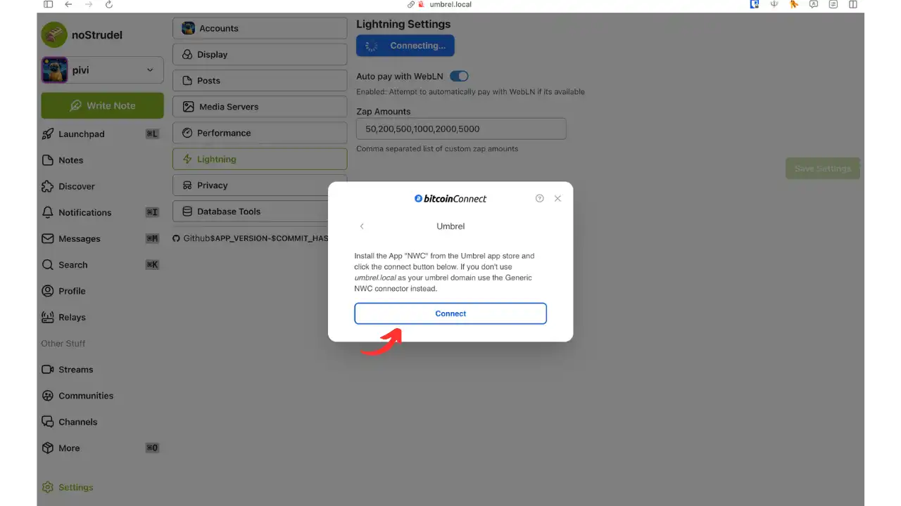
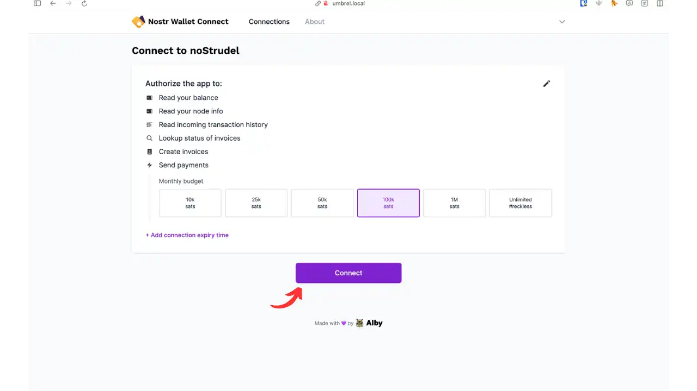

## Prérequis : Installation d'Umbrel

Umbrel est une plateforme open-source qui vous permet d'héberger facilement des applications Bitcoin et autres services sur votre propre serveur personnel. C'est une solution tout-en-un qui simplifie grandement l'auto-hébergement de nœuds Bitcoin et d'applications décentralisées.

Assurez-vous d'avoir installé Umbrel en suivant notre guide d'installation :

https://planb.network/tutorials/node/bitcoin/umbrel-8b0e3b5b-d3cf-4a1e-8bb8-1ad2db4dd848

## Introduction à Nostr

**Nostr** est un protocole de réseau ouvert, décentralisé et pensé pour les réseaux sociaux. Son nom est l'acronyme de _"Notes and Other Stuff Transmitted by Relays"_. Il permet à n'importe qui de publier des messages (notes), gérés sous forme d'événements JSON, et de les propager à travers des serveurs relais plutôt que par une plateforme centralisée. Chaque utilisateur possède une paire de clés cryptographiques (privée/publique) qui sert d'identifiant : la clé publique (npub) identifie l'utilisateur et la clé privée (nsec) permet de signer ses messages. Grâce à cette architecture distribuée, **Nostr offre une résistance à la censure** et une grande flexibilité : on peut utiliser plusieurs clients et se connecter à autant de relais que souhaité, sans dépendre d'un serveur unique.

En résumé, Nostr est un protocole de communication décentralisé où les **clients** (applications utilisateur) envoient et reçoivent des événements via des **relais** (serveurs). Ce protocole est particulièrement prisé par la communauté Bitcoin depuis 2023 en raison de ses valeurs de décentralisation et de souveraineté des données.

**Note :** Pour utiliser Nostr, vous aurez besoin de votre clé privée (générée par un client Nostr ou via une extension dédiée). **Ne partagez jamais votre clé privée**, elle permettrait à quiconque de se faire passer pour vous. Conservez-la en lieu sûr et privilégiez les outils de gestion sécurisée de clés (voir Astuce plus bas).

## Applications Umbrel pour Nostr

Umbrel propose un écosystème d'applications intégrées pour profiter pleinement de Nostr sur votre nœud personnel. Nous allons détailler l'utilisation des principales apps liées à Nostr : **Nostr Relay**, **noStrudel**, **Snort** et **Nostr Wallet Connect**. Chacune répond à un besoin spécifique : _Nostr Relay_ est un **serveur relais privé**, _noStrudel_ et _Snort_ sont des **clients Nostr** (interfaces pour lire/publier des notes), tandis que _Nostr Wallet Connect_ est un outil pour relier votre **portefeuille Lightning** à Nostr.

### Nostr Relay – Votre relais privé sur Umbrel

**Nostr Relay** est l'application officielle d'Umbrel pour faire tourner votre **propre relais Nostr** sur votre nœud. L'objectif principal est de disposer d'un relais **privé** et fiable pour **sauvegarder toute votre activité Nostr** en temps réel. En d'autres termes, en utilisant ce relais personnel en complément des relais publics, vous vous assurez que toutes vos notes, messages et réactions sont copiés chez vous, à l'abri de toute censure ou perte de données.

**Installation :** Depuis l'App Store Umbrel (catégorie _Social_), installez _Nostr Relay_. Une fois lancé, l'application tourne en arrière-plan (service docker). 

Vous verrez son interface web via Umbrel : elle fournit des informations basiques et surtout l'URL de votre relais (en haut à droite) que vous devrez copier pour la suite. Un bouton de synchronisation (icône de globe) est également disponible.

**Configuration du relais avec un client Nostr :** Pour tirer parti de votre relais Umbrel :

**Ajoutez le relais à votre client Nostr :** Dans votre application cliente (par ex. Damus sur iOS, Amethyst sur Android, Snort ou noStrudel sur Umbrel, etc.), ajoutez l'URL de votre relais privé que vous avez copiée précédemment. Par défaut, le relais Umbrel écoute sur le port **4848**. Si vous y accédez sur le réseau local, cela donne une URL de type : `ws://umbrel.local:4848` (ou utilisez l'IP locale de l'Umbrel).
    
Si vous utilisez Tailscale (voir plus bas), vous pouvez même utiliser l'alias DNS MagicDNS (généralement `umbrel` ou un nom auto-généré) pour y accéder de n'importe où, toujours sur le port 4848.

Si vous préférez Tor, récupérez l'adresse .onion de votre Umbrel et utilisez-la avec le port 4848 via un navigateur ou un client compatible Tor. (Voir section dédiée à Tor.)

Une fois l'URL ajoutée dans la configuration Relais de votre client Nostr, connectez-vous à ce relais. Vous devriez voir dans votre client que le relais Umbrel est bien connecté (généralement indiqué par une pastille verte ou similaire).

**Synchronisez l'historique (optionnel)** : Dans l'interface web de _Nostr Relay_ sur Umbrel, cliquez sur l'icône **globe** 🌐 (en haut de la page). Cette action va forcer votre relais Umbrel à se connecter à vos autres relais (ceux configurés dans votre client) pour **importer vos anciennes activités** publiques. Cela signifie que les notes passées que vous aviez publiées ou lues via des relais publics seront téléchargées et stockées aussi sur votre relais privé. Patientez le temps que la synchronisation s'effectue.
    
**Utilisez Nostr normalement :** Désormais, toute nouvelle activité (notes publiées, réactions, messages privés chiffrés, etc.) que vous effectuez sur Nostr sera transmise comme d'habitude aux relais publics **et en parallèle à votre relais Umbrel**. Si votre client Nostr est bien configuré, il enverra chaque événement à tous les relais (y compris le vôtre). Votre relais privé agira comme une sauvegarde en temps réel. Même en cas de déconnexion temporaire, vos clients pourront resynchroniser les données manquantes plus tard grâce à ce relais. _Vous avez ainsi la maîtrise complète de vos données Nostr._

En arrière-plan, _Nostr Relay_ d'Umbrel s'appuie sur le projet open-source **nostr-rs-relay** (implémentation Rust du protocole). Il supporte l'ensemble du protocole Nostr et de nombreux NIPs standards (NIP-01, 02, 03, 09, 11, 12, 15, 16, 20, 22, 26, 28, 33, etc.), garantissant une compatibilité maximale avec les clients.

### noStrudel – Client Nostr pour explorateurs

**noStrudel** est un client web Nostr orienté "power users", idéal pour comprendre et explorer le réseau Nostr en détail. Il s'agit d'une sorte de bac à sable permettant d'inspecter les événements, les relais et d'expérimenter avec les fonctionnalités avancées du protocole. L'interface est en anglais et relativement technique, ce qui la destine plutôt à des utilisateurs expérimentés curieux du fonctionnement interne de Nostr.

**Installation :** Installez _noStrudel_ depuis l'App Store Umbrel (catégorie _Social_). Une fois lancé, il est accessible via votre navigateur à l'adresse de votre Umbrel (ex. `http://umbrel.local` ou via son .onion/Tailscale, cf. section accès externe).

**Configuration des relais :** À l'ouverture de noStrudel, vous verrez un bouton "Setup Relays" en haut à droite. Cliquez dessus pour configurer vos relais.

Sur cette page, collez l'URL de votre relais Umbrel que vous avez copiée précédemment. Vous pouvez également ajouter d'autres relais proposés par défaut par l'application. Une fois les relais configurés, cliquez sur "Sign in" en bas à gauche pour continuer.

**Connexion :** noStrudel vous propose plusieurs options de connexion. Dans notre cas, nous allons choisir "Private Key" et coller votre clé privée Nostr précédemment générée. Si vous n'avez pas encore de clé, vous pouvez installer l'extension [Nostr Connect](https://chromewebstore.google.com/detail/nostr-connect/ampjiinddmggbhpebhaegmjkbbeofoaj) pour créer et/ou sauvegarder vos clés Nostr et ainsi communiquer de manière plus sécurisée avec les différentes applications Nostr.

Une fois connecté, vous pouvez utiliser noStrudel pour partager vos notes via Nostr. L'interface vous donne accès à :

- Un tableau de bord Nostr complet avec timeline des notes, notifications, messagerie, recherche de profils
- La gestion des relais et leur état de connexion
- Des outils avancés pour examiner les événements et leur contenu JSON
- Des options de configuration pour les filtres de timeline et les NIPs

**Astuce :** Sur _noStrudel_, vous pouvez configurer des _filtres de timeline_ ou tester différents _NIPs (Nostr Implementation Possibilities)_. Par exemple, vérifier le support de NIP-05 (identifiants décentralisés) ou de fonctionnalités plus récentes. Cela fait de _noStrudel_ un excellent outil pour expérimenter dans un environnement contrôlé.

### Snort – Client Nostr moderne sur Umbrel

**Snort** est un autre client web Nostr disponible sur Umbrel, offrant une **interface moderne, rapide et épurée** pour interagir avec le réseau social décentralisé. Contrairement à noStrudel qui cible les power users, _Snort_ vise la simplicité d'utilisation sans sacrifier les fonctionnalités. Il est construit en React, et propose une UX soignée rappelant les réseaux sociaux classiques, ce qui le rend adapté à un usage quotidien.

**Installation :** Installez _Snort_ depuis l'App Store Umbrel (catégorie _Social_). 

À l'ouverture de Snort, vous verrez un bouton "S'inscrire" en bas à gauche.

Vous pouvez choisir de vous inscrire ou de vous connecter à un compte existant (ce que nous allons faire pour ce tutoriel).

Snort propose plusieurs méthodes de connexion. Vous pouvez utiliser l'extension Nostr Connect précédemment installée ou d'autres méthodes disponibles. Une fois connecté, vous pourrez utiliser l'application pleinement.

L'interface de _Snort_ propose :

- Un affichage **Posts/Conversations/Global** pour naviguer entre vos notes, les discussions threadées, ou le flux global
- Des onglets **Notifications**, **Messages** (DM), **Recherche**, **Profil**, etc.
- Un bouton **+** ou _Write_ pour publier une nouvelle note
- La gestion des **abonnements (following)** et **listes**
- Un menu de gestion des **Relais** pour ajouter/retirer des relais et suivre leur disponibilité

**Configuration recommandée des relais :** Pour ajouter votre relais Umbrel, allez dans Settings - Relays. Saisissez l'URL de votre relais (`ws://umbrel:4848` ou autre URL selon votre config) dans la liste des relais de Snort. De cette manière, Snort publiera vos notes sur votre relais privé en plus des relais publics.

### Nostr Wallet Connect – Lier votre portefeuille Lightning à Nostr

**Nostr Wallet Connect (NWC)** est une application qui **relie votre node Umbrel (Lightning)** aux applications Nostr compatibles pour réaliser des paiements Lightning (par exemple, envoyer des _zaps_, ces micro-paiements pour "aimer" un contenu). Dans ce tutoriel, nous allons voir comment connecter noStrudel à votre nœud Lightning pour effectuer des paiements directement depuis l'interface.

**Installation et configuration :**

Installez _Nostr Wallet Connect_ depuis le store Alby sur Umbrel.

Dans noStrudel, cliquez sur votre profil en haut à droite puis sur le bouton "manage".

Cliquez sur "Lightning" puis "connect Wallet".

Parmi les options de connexion disponibles, choisissez "Umbrel".

Cliquez sur "Connect" pour être automatiquement redirigé vers votre session Nostr Wallet Connect d'Umbrel.

Sur la page de Nostr Wallet Connect, vous pouvez :
   - Définir votre budget maximal
   - Valider les autorisations
   - Paramétrer un délai d'expiration pour la connexion
Cliquez sur "connecter" pour finaliser.

Vous êtes redirigé vers noStrudel avec un message de confirmation : vous pouvez maintenant zapper le monde entier depuis votre wallet/nœud LND !

Grâce à NWC, vos **paiements Lightning via Nostr** (zaps pour récompenser des posts, paiements _Value for Value_, etc.) partent de **votre propre nœud**. Vous n'avez plus à faire transiter vos transactions par des services externes ni à scanner un QR depuis votre téléphone à chaque fois. L'expérience utilisateur est considérablement améliorée tout en restant _non custodiale_ et respectueuse de la vie privée.

Si vous souhaitez savoir comment configurer votre propre nœud Lightning sur Umbrel, je vous recommande de consulter cet autre tutoriel complet :

https://planb.network/tutorials/node/lightning-network/umbrel-lnd-b12e0b5b-12ff-45f1-978e-62f4b4a8ba16

## Configuration avancée et sécurité

L'utilisation conjointe d'Umbrel et de Nostr à un niveau avancé nécessite de porter une attention particulière à la **sécurité** et à la **connectivité**. Voici quelques conseils pour protéger votre configuration et y accéder de manière optimale, où que vous soyez.

### Accès externe sécurisé : Tor et Tailscale

Votre Umbrel, par souci de sécurité, n'est accessible par défaut que sur votre réseau local (et via Tor). Pour interagir avec Nostr en dehors de chez vous, deux solutions privilégiées s'offrent à vous : **Tor** (accès anonyme via réseau onion) et **Tailscale** (VPN mesh privé).

- **Accès via Tor :** Umbrel configure automatiquement un **service Tor (.onion)** pour son interface web et ses applications. Cela signifie que vous pouvez accéder à l'interface Umbrel (y compris _noStrudel_ ou _Snort_) depuis n'importe où, en utilisant le navigateur Tor, sans exposer votre IP publique. _Tor est utilisé pour accéder à vos services Umbrel depuis l'extérieur de votre réseau local, sans exposer votre appareil à Internet ([Setup Tor on your system - Guides - Umbrel Community](https://community.umbrel.com/t/setup-tor-on-your-system/7509#:~:text=Official%20website%3A%20https%3A%2F%2Fwww))._ Pour utiliser cette option, rendez-vous dans les paramètres Umbrel et récupérez l'URL .onion de votre Umbrel (ou scannez le QR code fourni). Sur un navigateur Tor, accédez à cette adresse .onion : vous aurez la même interface qu'en local. Vous pouvez alors utiliser vos apps Nostr comme à la maison.  
    **Relais Nostr via Tor :** Si vous souhaitez que votre relais Nostr soit joignable via Tor par vos clients (ou par des amis autorisés), c'est possible. Umbrel ne fournit pas directement l'adresse .onion du relais, mais comme il tourne sur le port 4848, vous pouvez soit :
    
    - Utiliser l'adresse .onion de l'UI Umbrel et configurer votre client pour qu'il se connecte via cette interface (peu pratique pour du WebSocket),
        
    - **Ou** exposer le port 4848 en tant que service onion distinct. Cela demande de bidouiller la config Tor sur Umbrel (réservé aux utilisateurs avancés à l'aise en SSH). Alternativement, envisagez un **tunnel Tor** sur un autre serveur qui redirige vers Umbrel: cependant, pour un usage personnel, le plus simple est d'utiliser Tailscale.
        
- **Accès via Tailscale :** [Tailscale](https://tailscale.com/) est une solution VPN en maillage qui crée un réseau privé virtuel entre vos appareils et Umbrel. L'avantage : cela fonctionne comme si vous étiez en LAN, mais à travers Internet, de façon chiffrée et sans configuration complexe. **Tailscale assigne à votre Umbrel une IP fixe ainsi qu'un nom de domaine privé, quelle que soit sa localisation réseau ([Tailscale | Umbrel App Store](https://apps.umbrel.com/app/tailscale#:~:text=Tailscale%20is%20zero%20config%20VPN,reviewed%20and%20trusted%20standard))**. En pratique, après avoir installé Tailscale sur Umbrel (depuis l'App Store Umbrel, catégorie _Networking_) **et** sur vos appareils (mobile, PC…), vous pourrez joindre Umbrel via une adresse du type `100.x.y.z` (IP Tailscale) ou un nom `umbrel.tailnet123.ts.net`.  
    _Pour Nostr_, Tailscale est extrêmement utile: votre mobile, s'il a Tailscale actif, pourra se connecter à `ws://umbrel:4848` (grâce à MagicDNS) ou directement à l'IP Tailscale et port 4848 pour utiliser le relais. Les clients comme Damus ou Amethyst verront votre Umbrel comme s'il était sur le même réseau local. **Astuce :** Activez l'option **MagicDNS** dans Tailscale pour utiliser le nom d'hôte `umbrel` au lieu de mémoriser l'IP. Ceci vous garantit une connexion fluide à votre relais même en déplacement ([Nostr Relay | Umbrel App Store](https://apps.umbrel.com/app/nostr-relay#:~:text=client%20%28e,That%27s%20it%21%20Your%20past)).  
    En outre, Tailscale vous permet d'accéder à l'interface Umbrel (et donc aux clients web _noStrudel/Snort_) via un simple navigateur, en utilisant l'IP privée ou le nom de domaine assigné. Pas besoin de Tor Browser, et les débits seront en général meilleurs que via le réseau Tor.
    

**Note :** Tor et Tailscale ne sont pas mutuellement exclusifs. Vous pouvez garder Tor actif pour l'accès anonymisé ou pour des services spécifiques, et utiliser Tailscale au quotidien pour sa simplicité. Dans les deux cas, aucune ouverture de port sur votre routeur n'est nécessaire, ce qui renforce la sécurité.

### Sécuriser votre relais Nostr (pratiques recommandées)

Si vous hébergez un relais Nostr sur Umbrel, surtout dans un contexte avancé, veillez à appliquer quelques bonnes pratiques :

- **Relay privé ou restreint :** Par défaut, votre relais Umbrel est privé (non annoncé publiquement) et, si vous n'y accédez que via Tailscale ou votre LAN, il restera inaccessible aux inconnus. **Gardez le lien confidentiel.** Ne le diffusez pas sur les réseaux Nostr publics sauf si vous voulez volontairement accueillir d'autres utilisateurs, ce qui est un tout autre enjeu (modération, bande passante, etc.). Pour un usage personnel, il est recommandé de limiter l'accès à soi-même et éventuellement à quelques proches de confiance.
    
- **Whitelist / Auth** : L'implémentation nostr-rs-relay supporte un mécanisme d'**authentification NIP-42** ainsi que des _whitelists_ de clés publiques. En activant ces options, vous pouvez restreindre votre relais pour qu'il **n'accepte que les événements signés par certaines clés (les vôtres)**, ou que les clients doivent s'authentifier pour publier. _Configurer cela requiert d'éditer le fichier de configuration `config.toml` du relais dans Umbrel (via SSH dans le conteneur Docker)._ C'est une manipulation avancée, mais par exemple on peut y lister les pubs autorisées (`pubkey_whitelist`). Ainsi, même si quelqu'un découvre votre relais, il ne pourra rien y publier s'il n'est pas sur la liste.
    
- **Mises à jour et maintenance :** Tenez votre Umbrel et l'app _Nostr Relay_ à jour. Les mises à jour peuvent apporter des améliorations de performance (ex: meilleure gestion du spam) et des correctifs de sécurité. Sur Umbrel, vérifiez régulièrement dans l'App Store s'il y a une mise à jour disponible pour _Nostr Relay_ et appliquez-la le cas échéant.
    
- **Surveillance et limites :** Gardez un œil sur l'utilisation de votre relais. Si vous l'ouvrez à d'autres, surveillez la charge (CPU/RAM stockage) sur votre Umbrel, car un relais peut vite accumuler beaucoup de données. nostr-rs-relay offre des **limites de taux et de stockage** configurables (`limits` dans le config, par ex. nombre d'événements par seconde, taille max d'event, purge des anciens events…). Pour un usage privé, vous n'aurez probablement pas besoin d'y toucher, mais sachez que ces paramètres existent en cas de besoin ([nostr-rs-relay/config.toml at master · scsibug/nostr-rs-relay · GitHub](https://github.com/scsibug/nostr-rs-relay/blob/master/config.toml#:~:text=)).
    
- **Sécurisation des clés Nostr :** Ce point a déjà été évoqué, mais il est crucial : ne renseignez jamais vos clés privées Nostr dans une interface en laquelle vous n'avez pas totalement confiance. Préférez l'usage d'extensions de navigateur ou de dispositifs externes (il existe par exemple des _signers_ Nostr sur téléphone séparé) pour signer les actions sensibles. Sur Umbrel, vos clients web comme _Snort_ et _noStrudel_ peuvent fonctionner sans connaître votre clé secrète, via NIP-07. Profitez-en pour concilier confort et sécurité.
    

En suivant ces conseils, votre intégration d'un nœud Umbrel avec Nostr sera à la fois puissante **et** sûre. Vous disposerez d'un environnement complet : un nœud Bitcoin pour les paiements Lightning, un relais Nostr privé pour la souveraineté de vos données, et des clients Nostr web performants pour naviguer sur ce nouveau réseau social décentralisé. Bonne exploration de Nostr avec Umbrel !
