## مقدمه

### گره Bitcoin چیست؟

یک گره Bitcoin یک کامپیوتر است که با اجرای نرم‌افزار Bitcoin Core یا یک کلاینت جایگزین در شبکه Bitcoin شرکت می‌کند. نقش آن برای عملکرد و امنیت شبکه ضروری است:

- **Blockchain storage**: نگهداری یک نسخه کامل و به‌روز از Blockchain Bitcoin
- **تأیید تراکنش**: هر تراکنش و بلوک را بر اساس قوانین پروتکل اعتبارسنجی می‌کند
- **انتشار اطلاعات**: تراکنش‌ها و بلوک‌های جدید را با سایر نودها به اشتراک می‌گذارد
- **اجماع‌سازی**: به کاربرد قوانین شبکه کمک می‌کند

اجرای نود Bitcoin خودتان یک گام حیاتی به سوی حاکمیت مالی است و چندین مزیت کلیدی ارائه می‌دهد:

- **محرمانگی**: تراکنش‌های خود را بدون افشای اطلاعاتتان به اشخاص ثالث به اشتراک بگذارید
- **مقاومت در برابر سانسور**: هیچ‌کس نمی‌تواند شما را از استفاده از Bitcoin متوقف کند
- **تأیید مستقل**: نیازی به اعتماد به نودهای دیگران برای تأیید تراکنش‌های خود ندارید
- **اجماع‌سازی**: مشارکت در اعمال قوانین شبکه Bitcoin
- **پشتیبانی شبکه**: به یک شرکت‌کننده فعال در توزیع و غیرمتمرکزسازی شبکه تبدیل شوید

### آمبرل: یک راه‌حل ساده برای اجرای یک نود Bitcoin

آمبرل یک سیستم‌عامل متن‌باز است که نصب و مدیریت یک نود Bitcoin را ساده می‌کند. همچنین کامپیوتر شما را به یک سرور خانگی شخصی و خصوصی تبدیل می‌کند و میزبانی را آسان می‌سازد:

- یک گره کامل Bitcoin
- برنامه‌های ضروری Bitcoin (Electrs, Mempool.space)
- سایر خدمات شخصی (ذخیره‌سازی ابری، استریمینگ، VPN و غیره)

با رابط کاربری زیبا و شهودی Interface، آمبرل خدمات میزبانی شخصی را برای همه قابل دسترس می‌کند، در حالی که کنترل کامل بر داده‌های شما را حفظ می‌کند.

## گزینه‌های نصب Umbrel

آمبرل دو روش اصلی برای استفاده از راه‌حل خود ارائه می‌دهد: یک گزینه آماده (Umbrel Home) و یک نسخه منبع باز رایگان (UmbrelOS).

### راهکار آماده Umbrel Home:

هوم سرور Umbrel Home یک سرور خانگی از پیش پیکربندی شده است که به طور ویژه برای تجربه‌ای بهینه طراحی شده است. این راه‌حل سخت‌افزاری همه‌کاره شامل:

**ویژگی‌های سخت‌افزاری**

- پردازنده با عملکرد بالا بهینه‌سازی‌شده برای میزبانی خود
- ذخیره‌سازی SSD پرسرعت از پیش نصب‌شده
- سیستم خنک‌کننده بی‌صدا
- طراحی جمع و جور و شیک
- پورت‌های USB و اترنت یکپارچه

**مزایای انحصاری**

- نصب و راه‌اندازی پلاگ‌ اند پلی: وصل کنید و شروع کنید
- پشتیبانی ویژه با کمک اختصاصی
- به‌روزرسانی‌های خودکار تضمین‌شده
- جادوگر مهاجرت یکپارچه
- گارانتی کامل سخت‌افزار
- پشتیبانی کامل از تمامی قابلیت‌ها

**قیمت**: €399 (قیمت ممکن است بسته به فصل تغییر کند)

### UmbrelOS: نسخه متن‌باز

UmbrelOS نسخه رایگان و متن‌باز سیستم‌عامل Umbrel است. این راه‌حل انعطاف‌پذیر به شما اجازه می‌دهد تا از سخت‌افزار خود استفاده کنید و در عین حال از ویژگی‌های اساسی Umbrel بهره‌مند شوید.

**مزایا**

- کاملاً رایگان
- کد منبع باز و قابل تأیید
- آزادی انتخاب
- گزینه‌های پیشرفته سفارشی‌سازی

**پلتفرم‌های پشتیبانی‌شده**

- Raspberry Pi 5: یک راه‌حل محبوب و مقرون‌به‌صرفه
- سیستم‌های X86: برای رایانه‌های شخصی یا سرورهای استاندارد
- ماشین مجازی: برای آزمایش یا استفاده در زیرساخت‌های موجود

**محدودیت‌ها**

- فقط پشتیبانی جامعه
- برخی از ویژگی‌های پیشرفته برای Umbrel Home محفوظ است
- پیکربندی اولیه فنی بیشتر
- عملکرد به سخت‌افزار انتخاب‌شده بستگی دارد

این نسخه ایده‌آل برای :

- کاربران فنی
- کسانی که از قبل تجهیزات سازگار دارند
- افرادی که می‌خواهند یاد بگیرند و آزمایش کنند
- توسعه‌دهندگانی که مایل به مشارکت در پروژه هستند

پیوندهای رسمی نصب :

- [نصب روی Raspberry Pi 5](https://github.com/getumbrel/umbrel/wiki/Install-umbrelOS-on-a-Raspberry-Pi-5)
- [نصب بر روی سیستم‌های x86](https://github.com/getumbrel/umbrel/wiki/Install-umbrelOS-on-x86-Systems)
- [نصب ماشین مجازی](https://github.com/getumbrel/umbrel/wiki/Install-umbrelOS-on-a-Linux-VM)

در این آموزش، ما بر نصب UmbrelOS بر روی Raspberry Pi 5 تمرکز خواهیم کرد، اما اصول پایه برای سایر پلتفرم‌ها مشابه باقی می‌ماند.

## نصب Umbrel OS بر روی Raspberry Pi 5

### اجزای مورد نیاز

برای این نصب شما نیاز خواهید داشت به:

- Raspberry Pi 5 (4 GB یا 8 GB RAM)
- یک منبع تغذیه رسمی Raspberry Pi مدل Supply (حیاتی برای پایداری!)
- کارت MicroSD (حداقل 32 گیگابایت)
- یک کارت‌خوان microSD
- یک SSD خارجی برای ذخیره‌سازی داده‌ها
- کابل اترنت
- یک کابل USB برای اتصال SSD

### مراحل نصب

**دانلود UmbrelOS**

- از [وب‌سایت رسمی](https://github.com/getumbrel/umbrel/wiki/Install-umbrelOS-on-a-Raspberry-Pi-5) دیدن کنید.
- آخرین نسخه UmbrelOS را برای Raspberry Pi 5 دانلود کنید

نصب **Balena Etcher**

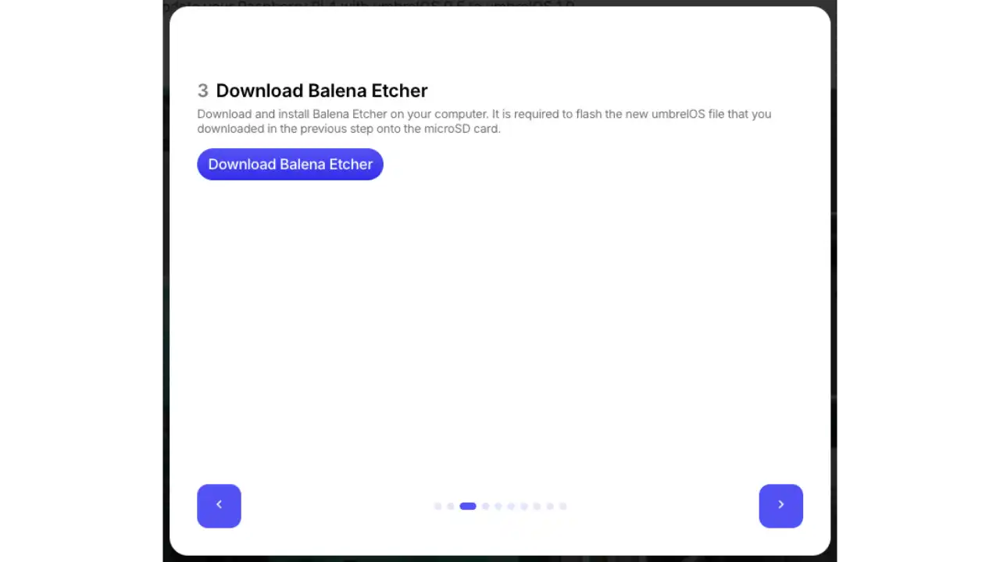

- [Balena Etcher](https://www.balena.io/etcher/) را بر روی کامپیوتر خود دانلود و نصب کنید

**آماده‌سازی کارت microSD**

- کارت microSD خود را در کارت‌خوان کامپیوتر خود قرار دهید

**تصویر چشمک زن**

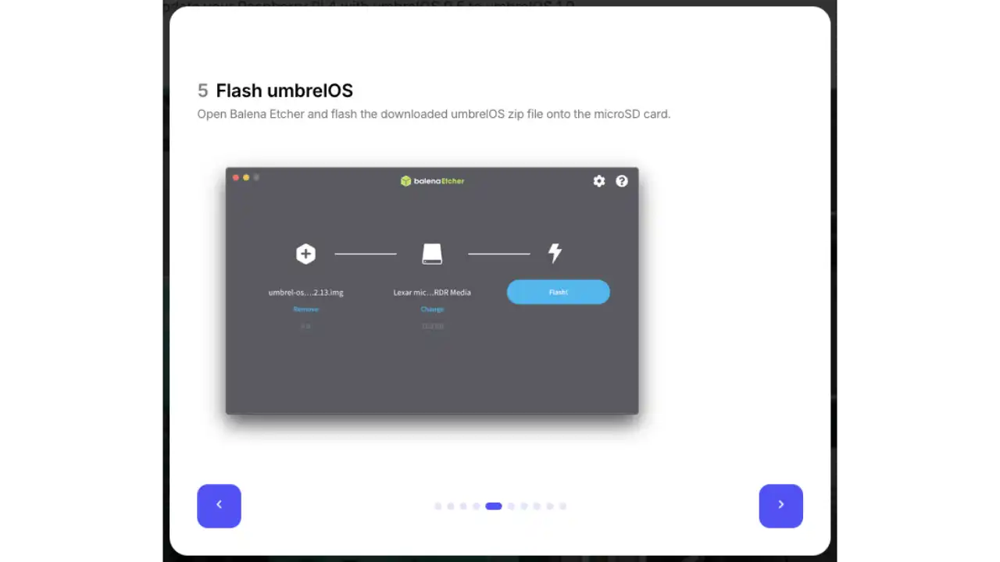

- بالنا اچر را راه‌اندازی کنید
- تصویر UmbrelOS دانلود شده را انتخاب کنید
- کارت microSD خود را به عنوان مقصد انتخاب کنید
- روی "Flash!" کلیک کنید و منتظر بمانید تا فرآیند به پایان برسد
- کارت را با خیال راحت خارج کنید

**نصب کارت microSD**

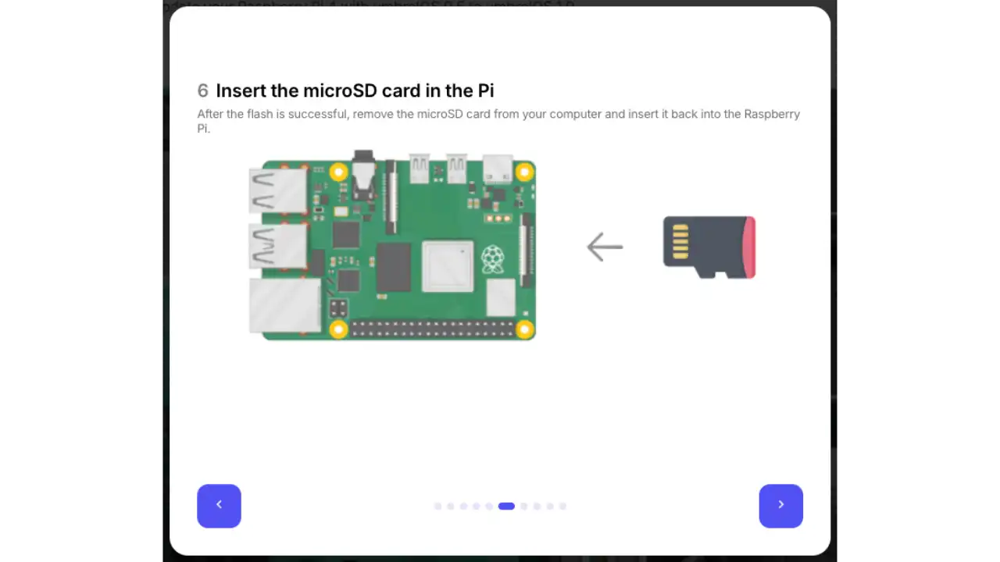

- کارت microSD را در Raspberry Pi 5 خود وارد کنید

**اتصال جانبی**

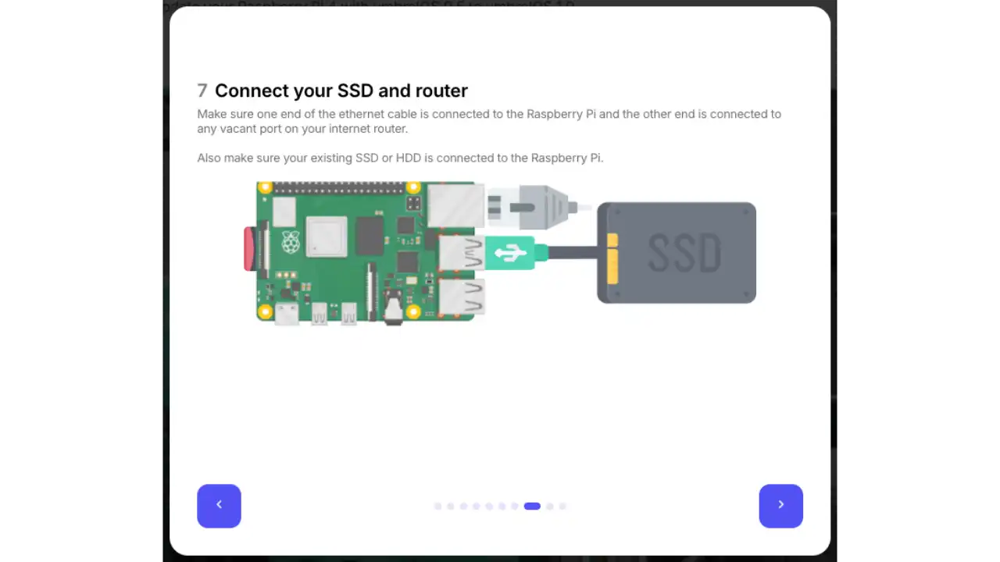

- درایو SSD خارجی را به یک پورت USB موجود متصل کنید.
- کابل اترنت را بین Pi و روتر خود وصل کنید

**روشن کردن**

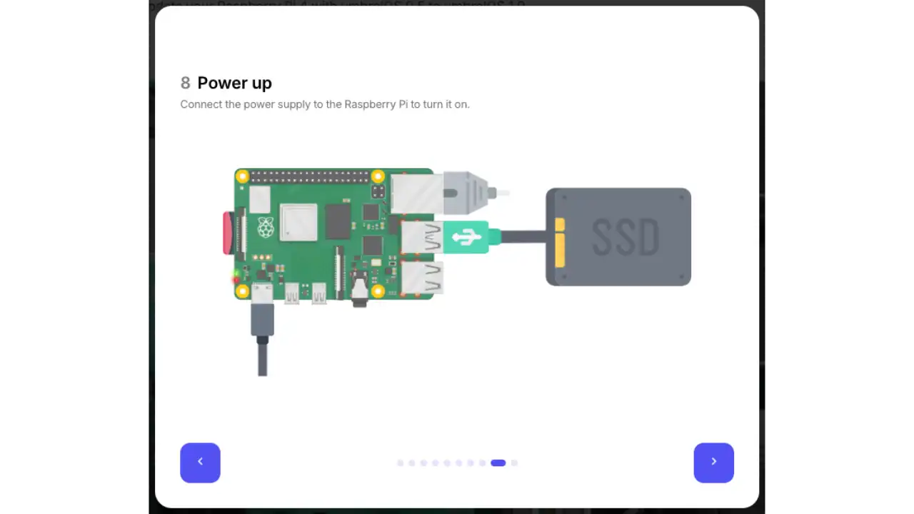

- رابطه برق رسمی Raspberry Pi Supply را متصل کنید.
- چند دقیقه صبر کنید تا سیستم راه‌اندازی شود

**اولین دسترسی**

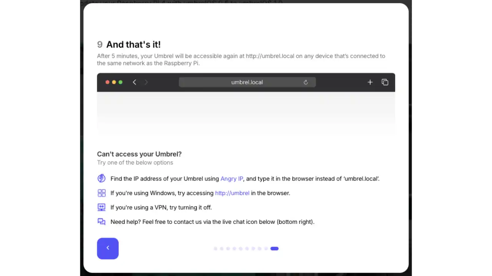

- روی دستگاهی که به همان شبکه متصل است، مرورگر خود را باز کنید
- به وب‌سایت Interface Umbrel دسترسی پیدا کنید در: `http://umbrel.local`

اگر `umbrel.local` کار نمی‌کند، باید IP Address رزبری پای خود را در شبکه محلی پیدا کنید. می‌توانید:

- با روتر خود Interface مشورت کنید
- استفاده از یک اسکنر شبکه مانند nmap
- از دستور `arp -a` در ترمینال کامپیوتر خود استفاده کنید

## اولین قدم در Umbrel

هنگامی که Umbrel شما راه‌اندازی شد و از طریق مرورگر شما قابل دسترسی است، مراحل زیر را برای شروع دنبال کنید:

### پیکربندی اولیه

**حساب خود را ایجاد کنید**

- یک نام کاربری انتخاب کنید
- یک رمز عبور امن تنظیم کنید
- برای دسترسی به Umbrel خود به این مدارک نیاز خواهید داشت.

**تأیید حساب**

- روی "Next" کلیک کنید تا به داشبورد خود دسترسی پیدا کنید

**کشف Interface**

- به فروشگاه برنامه Umbrel دسترسی پیدا کنید
- برنامه‌های کاربردی موجود را کشف کنید
- بیایید با نصب برنامه‌های ضروری برای Bitcoin شروع کنیم.

### نصب برنامه‌های Bitcoin

**گره Bitcoin**

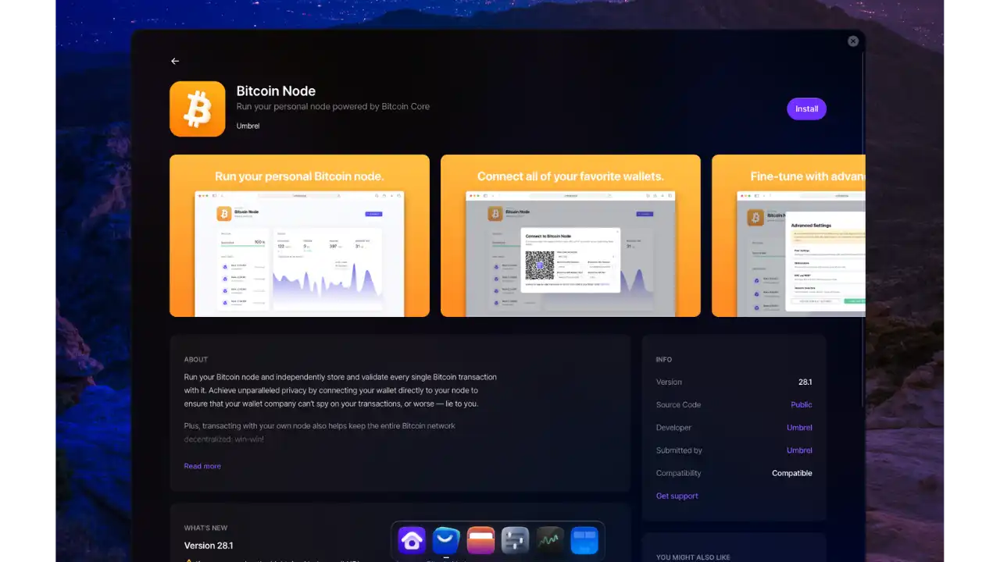

- اولین برنامه برای نصب
- دانلود و بررسی کامل Blockchain Bitcoin

**الکترز**

- سرور Electrum برای اتصال کیف‌پول‌های Bitcoin
- با گره Bitcoin شما همگام‌سازی می‌شود

**Mempool**

- نمایشگر Interface برای Blockchain
- تراکنش‌ها و بلوک‌ها را به صورت لحظه‌ای ردیابی می‌کند

## ردیابی یک تراکنش با Mempool.space

Mempool.space یک کاوشگر متن‌باز Blockchain است که نمایش بلادرنگ شبکه Bitcoin را فراهم می‌کند. این به شما اجازه می‌دهد تا تراکنش‌های خود را پیگیری کرده و بفهمید که تراکنش‌ها چگونه در شبکه منتشر می‌شوند.

### درک Mempool و تأییدات

"Mempool" (استخر حافظه) مانند یک اتاق انتظار مجازی است که در آن تمام تراکنش‌های تایید نشده Bitcoin قبل از اضافه شدن به یک بلوک ذخیره می‌شوند. در اینجا نحوه پردازش یک تراکنش آمده است:

1. **پخش**: هنگامی که یک تراکنش ارسال می‌کنید، ابتدا در شبکه Bitcoin پخش می‌شود

2. **در انتظار در Mempool**: در انتظار انتخاب شدن توسط یک Miner بر اساس هزینه‌ها

3. **اولین تأیید**: یک ماینر آن را در یک بلاک قرار می‌دهد (اولین تأیید)

۴. **تأییدیه‌های اضافی**: هر بلوک جدیدی که پس از بلوکی که تراکنش شما را شامل می‌شود استخراج می‌شود، یک تأییدیه اضافه می‌کند

تعداد تأییدیه‌های توصیه‌شده به مقدار بستگی دارد:

- برای مبالغ کم: ۱-۲ تأیید ممکن است کافی باشد
- برای مقادیر زیاد: ۶ تأییدیه به طور کلی بسیار امن در نظر گرفته می‌شود

### کاوش Interface از Mempool.space

1. **صفحه اصلی** به شما یک نمای کلی از شبکه Bitcoin می‌دهد:

   - بلوک‌های استخراج‌شده اخیر
   - برآورد هزینه برای اولویت‌های مختلف
   - وضعیت فعلی Mempool

2. **جستجوی یک تراکنش**: برای پیگیری یک تراکنش خاص، شناسه آن (txid) را در نوار جستجو در بالای صفحه وارد کنید.

### تجزیه و تحلیل جزئیات تراکنش

به محض اینکه تراکنش شما پیدا شد، Mempool.space یک تحلیل کامل به شما ارائه می‌دهد:

1. **اطلاعات ضروری** :

   - وضعیت (تأیید شده یا نه)
   - هزینه‌ها پرداخت شده (در Sats/vB)
   - زمان تأیید تخمینی

2. **ساختار تراکنش** :

   - نمایش بصری ورودی‌ها و خروجی‌ها
   - فهرست دقیق آدرس‌های درگیر
   - مبالغ منتقل شده

3. **داده‌های فنی** :

   - وزن تراکنش
   - اندازه مجازی
   - قالب و نسخه استفاده شده
   - سایر فراداده‌های خاص

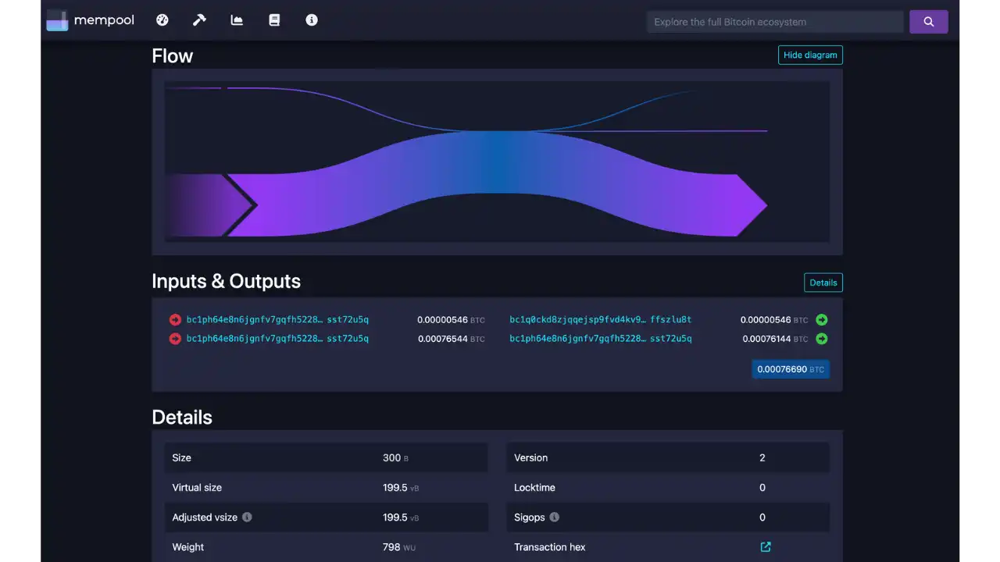

### مزایای استفاده از Mempool.space بر روی Umbrel

1. **محرمانگی**: درخواست‌های شما از طریق نود خودتان عبور می‌کند

2. **استقلال**: نیازی به تکیه بر خدمات شخص ثالث نیست

3. **قابلیت اطمینان**: دسترسی به داده‌ها حتی زمانی که مرورگرهای عمومی از کار افتاده‌اند

با استفاده از این برنامه، می‌توانید به‌طور مؤثر تراکنش‌های خود را نظارت کنید، بفهمید که چگونه کارمزدها بر سرعت تأیید تأثیر می‌گذارند و درک بهتری از نحوه عملکرد شبکه Bitcoin به‌دست آورید.

## اتصال یک Wallet Bitcoin به نود شما

### پیکربندی Electrs

**اتصال محلی**

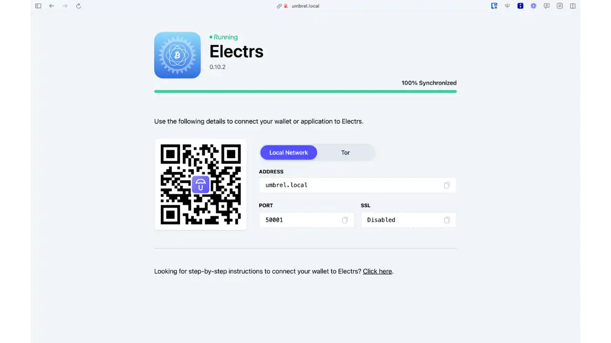

- برای استفاده در شبکه محلی شما
- سریع‌تر و آسان‌تر برای راه‌اندازی

**اتصال از راه دور از طریق تور**

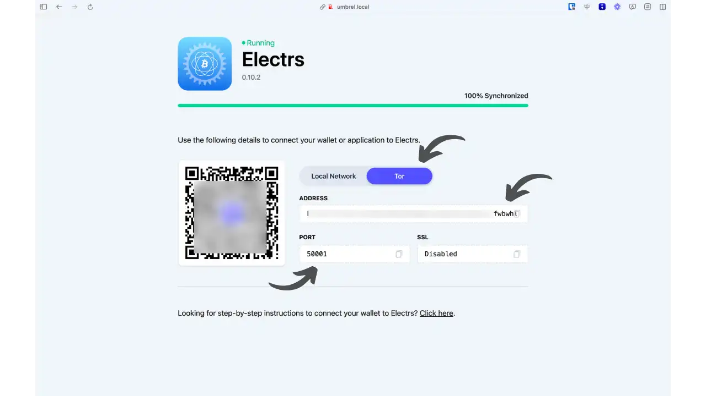

- برای دسترسی به نود خود از هر مکان
- امن‌تر و خصوصی‌تر

### اتصال با Sparrow wallet

**دسترسی به پارامترها**

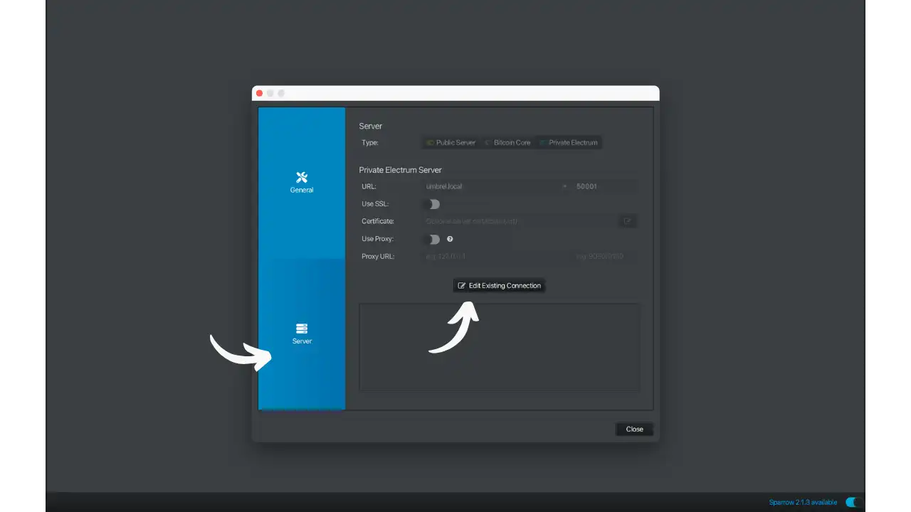

- باز کردن Sparrow wallet
- به تنظیمات > سرور بروید
- روی "تغییر اتصال موجود" کلیک کنید

**انتخاب نوع اتصال**

Sparrow سه حالت اتصال ارائه می‌دهد:

***سرور عمومی***

- اتصال به سرورهای عمومی (مثلاً blockstream.info، Mempool.space)
- ساده اما کمتر خصوصی

***Bitcoin Core***

- اتصال مستقیم به یک گره Bitcoin
- خصوصی اما کندتر

***الکتروم خصوصی***

- به سرور Electrs خود متصل شوید
- ترکیب حریم خصوصی و عملکرد

پیکربندی **Electrs**

با استفاده از اطلاعات نمایش داده شده در برنامه Electrs که قبلاً دیدیم، نوع اتصال خود را انتخاب کنید:

در هر دو مورد، گزینه‌های "Use SSL" و "Use proxy" را بدون علامت بگذارید.

**اتصال محلی**

میزبان: umbrel.local

شماره پورت: 50001

**اتصال از راه دور (Tor)**

میزبان : [your-Address-onion]

شماره پورت: 50001

اتصال Tor ضروری است اگر می‌خواهید به نود خود خارج از شبکه محلی‌تان دسترسی پیدا کنید.

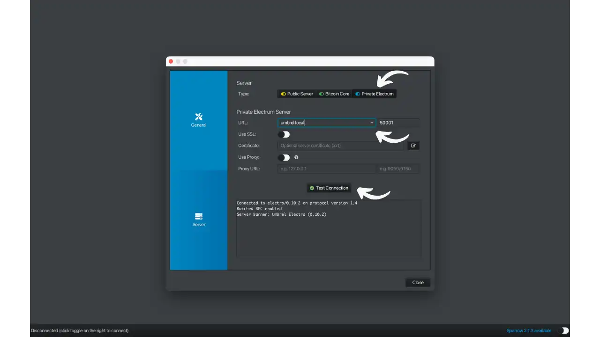

برای اطلاعات بیشتر در مورد نرم‌افزار Sparrow wallet، ما یک آموزش جامع داریم:

https://planb.network/tutorials/wallet/desktop/sparrow-c674e2ac-d46f-4c82-92a7-7d1b0e262f5d
## نتیجه‌گیری

امبرل شما اکنون آماده استفاده است. شما به طور فعال در شبکه Bitcoin شرکت می‌کنید در حالی که کنترل کامل بر داده‌های خود دارید. از کاوش در بسیاری از برنامه‌های دیگر موجود در فروشگاه برنامه امبرل برای گسترش قابلیت‌های سرور خانگی خود لذت ببرید.

## منابع مفید

### مستندات رسمی

- [وب‌سایت رسمی آمبرل](https://umbrel.com)
- [مستندات آمبرل](https://github.com/getumbrel/umbrel/wiki)
- [فروشگاه اپلیکیشن آمبرل](https://apps.umbrel.com)

### برنامه‌های Bitcoin

- [Bitcoin Core](https://Bitcoin.org/fr/)
- [Electrs](https://github.com/romanz/electrs)
- [Mempool](https://Mempool.space)
- [Sparrow wallet](https://sparrowwallet.com)

### انجمن

- [انجمن آمبرل](https://community.getumbrel.com)
- [GitHub Umbrel](https://github.com/getumbrel)
- [توییتر Umbrel](https://twitter.com/umbrel)