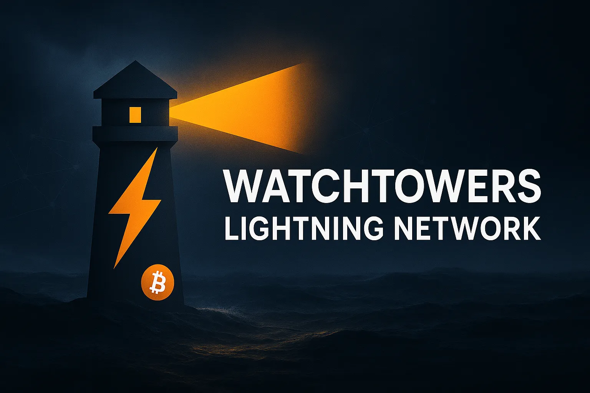
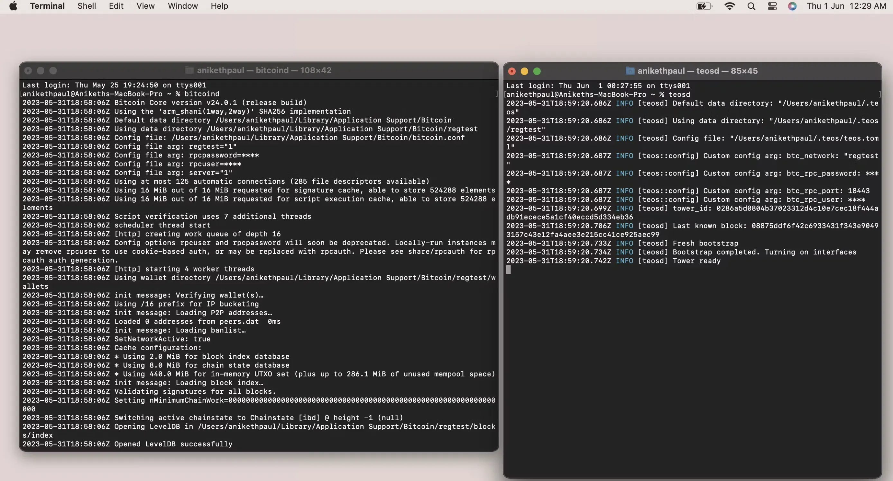
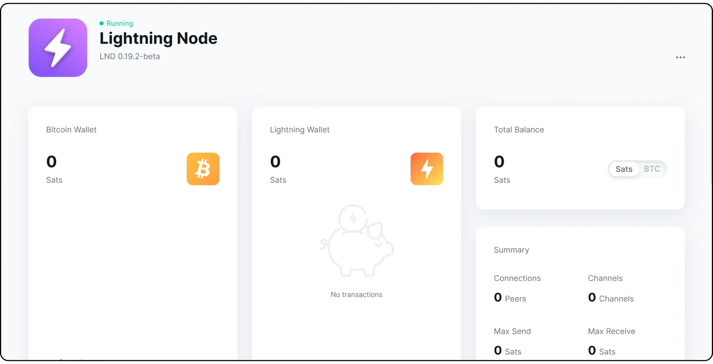
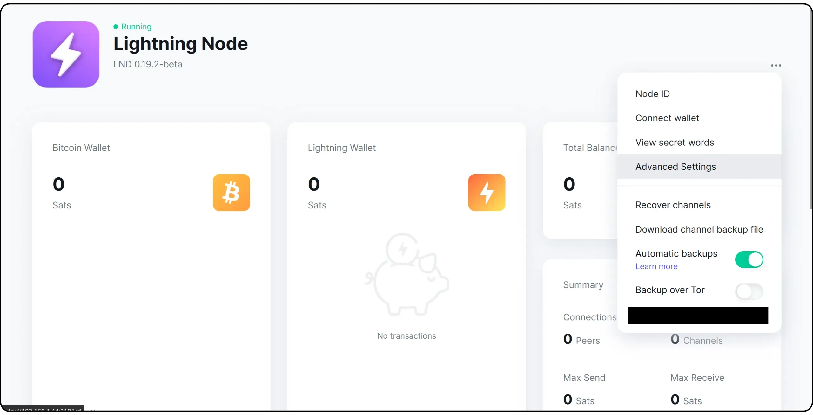
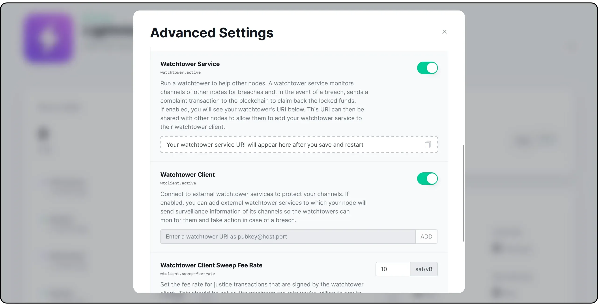
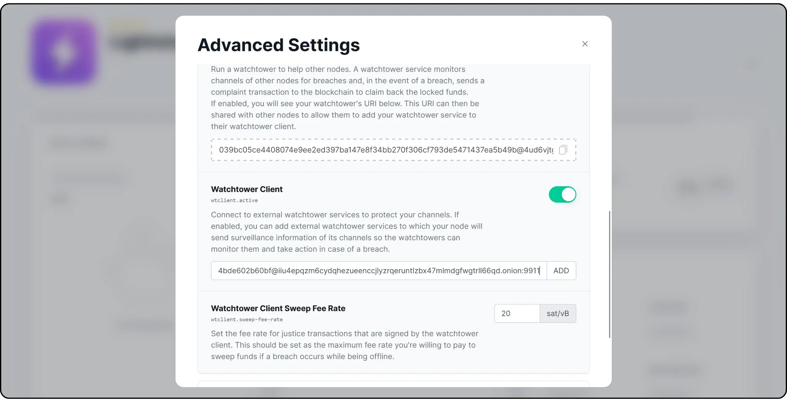
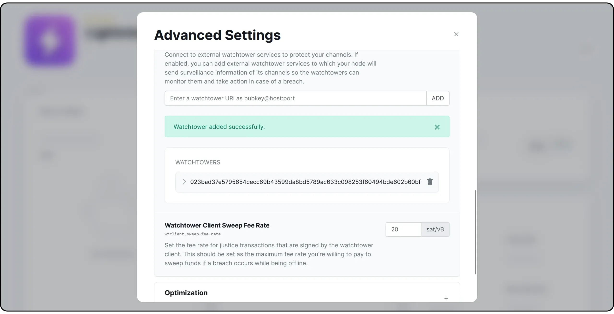

## Gözcü Kuleleri nasıl çalışır?


Lightning Network ekosisteminin önemli bir parçası olan _Watchtowers_, kullanıcıların Lightning kanalları için ekstra bir koruma seviyesi sağlar. Ana rolleri kanal durumunu izlemek ve kanalın bir tarafı diğerini dolandırmaya çalışırsa müdahale etmektir.


Bir Watchtower bir kanalın ihlal edilip edilmediğini nasıl belirleyebilir? Müşteriden (kanalın taraflarından biri) herhangi bir ihlali doğru bir şekilde tanımlamak ve ele almak için gereken bilgileri alır. Bu bilgiler en son işlemin ayrıntılarını, kanalın mevcut durumunu ve ceza işlemleri oluşturmak için gereken Elements'ü içerir. Bu verileri Watchtower'e iletmeden önce, müşteri gizliliği korumak için şifreleyebilir. Böylece, Watchtower verileri alsa bile, bir ihlal gerçekten gerçekleşene kadar şifresini çözemeyecektir. Bu şifreleme mekanizması müşterinin gizliliğini korur ve Watchtower'ün hassas bilgilere yetkisiz erişim sağlamasını engeller.


Bu eğitimde, bir **Watchtower** kullanmanın 3 yolunu inceleyeceğiz:


- i̇lk olarak, LND üzerinden klasik ham yöntem,
- sonra Satoshi'nin Gözü ile başka bir yaklaşım,
- ve son olarak, Umbrel ile barındırılan Lightning düğümünüzde bir Watchtower'in basitleştirilmiş yapılandırması.


## 1 - Watchtower veya LND üzerinden bir istemcinin yapılandırılması


*Bu eğitim [resmi LND belgelerinden] (https://github.com/lightningnetwork/LND/blob/master/docs/Watchtower.md) alınmıştır. Orijinal sürümde bazı değişiklikler yapılmış olabilir


V0.7.0`dan beri `LND`, `LND`ün tam entegre bir alt sistemi olarak özel bir fedakar Watchtower`ün yürütülmesini desteklemektedir. Gözetleme kuleleri, müşteri düğümü çevrimdışı olduğunda veya ihlal anında yanıt veremediğinde kötü niyetli veya kazara ihlal senaryolarına karşı ikinci bir savunma hattı sağlayarak kanal fonları için daha yüksek bir güvenlik derecesi sunar.


Hizmeti karşılığında kanalın fonlarından pay talep eden bir _ödül gözetleme kulesinin_ aksine, bir _özgecil gözetleme kulesi_ kurbanın tüm fonlarını (On-Chain ücretleri hariç) komisyon almadan iade eder. Ödül gözetleme kuleleri daha sonraki bir sürümde etkinleştirilecektir; hala test ve geliştirme aşamasındadırlar.


Buna ek olarak, `LND` artık bir _gözetleme kulesi istemcisi_ olarak işlev görecek şekilde yapılandırılabilir ve diğer fedakar gözetleme kulelerinden şifrelenmiş ihlal düzeltme işlemlerini ("adalet işlemleri" olarak adlandırılır) kaydeder. Watchtower sabit boyutta şifrelenmiş blobları saklar ve adalet işleminin şifresini ancak ihlal eden taraf iptal edilmiş bir Commitment durumu yayınladıktan sonra çözebilir ve yayınlayabilir. Müşteri ↔ Watchtower iletişimleri geçici anahtar çiftleri kullanılarak şifrelenir ve doğrulanır, bu da Watchtower'nin müşterilerini uzun vadeli kimlik bilgileri aracılığıyla izleme yeteneğini sınırlar.


Bu sürümde, `LND` kullanıcıları için zaten önemli güvenlik sağlayan sınırlı sayıda özelliği dağıtmayı seçtiğimizi unutmayın. Watchtower ile ilgili diğer birçok özellik ya tamamlanmak üzere ya da oldukça gelişmiş durumda; bunları test ettikçe ve güvenli oldukları kabul edilir edilmez sunmaya devam edeceğiz.


not: şu an için, gözetleme kuleleri iptal edilen taahhütlerin yalnızca `to_local` ve `to_remote` çıktılarını kaydetmektedir; protokol şifrelenmiş bloblarda ek imza verilerini içerecek şekilde genişletilebileceğinden, HTLC çıktısının kaydedilmesi gelecekteki bir sürümde devreye alınacaktır._


### Bir Watchtower'nin Yapılandırılması


Bir Watchtower kurmak için, komut satırı kullanıcılarının gRPC veya `lncli` aracılığıyla Watchtower ile etkileşime izin veren isteğe bağlı `watchtowerrpc` alt sunucusunu derlemesi gerekir. Yayınlanan ikili dosyalar varsayılan olarak `watchtowerrpc` alt sunucusunu içerir.


Watchtower'ü etkinleştirmek için minimum yapılandırma `Watchtower.active=1` şeklindedir.


Watchtower yapılandırma bilgilerinizi `lncli tower info` ile alabilirsiniz:


```shell
$  lncli tower info
{
"pubkey": "03281d603b2c5e19b8893a484eb938d7377179a9ef1a6bca4c0bcbbfc291657b63",
"listeners": [
"[::]:9911"
],
"uris": [
],
}
```


Watchtower yapılandırma seçeneklerinin tamamı `LND -h` aracılığıyla kullanılabilir:


```shell
$  lnd -h
...
watchtower:
--watchtower.active                                     If the watchtower should be active or not
--watchtower.towerdir=                                  Directory of the watchtower.db (default: $HOME/.lnd/data/watchtower)
--watchtower.listen=                                    Add interfaces/ports to listen for peer connections
--watchtower.externalip=                                Add interfaces/ports where the watchtower can accept peer connections
--watchtower.readtimeout=                               Duration the watchtower server will wait for messages to be received before hanging up on client connections
--watchtower.writetimeout=                              Duration the watchtower server will wait for messages to be written before hanging up on client connections
...
```


#### Dinleme arayüzleri


Varsayılan olarak, Watchtower mevcut tüm arayüzlerde `9911` portuna karşılık gelen `:9911` üzerinde dinleme yapar. Kullanıcılar `--Watchtower.listen=` seçeneğini kullanarak kendi dinleme arayüzlerini tanımlayabilirler. Yapılandırmanızı `lncli tower info` dosyasının `"listeners"` alanından kontrol edebilirsiniz. Watchtower'inize bağlanırken sorun yaşıyorsanız, `<port>`un açık olduğundan veya proxy'nizin etkin bir Interface'a doğru yapılandırıldığından emin olun.


#### Harici IP adresleri


Kullanıcılar ayrıca Watchtower'un harici IP Address(ler)ini `Watchtower.externalip=` ile belirtebilir, bu da Watchtower'un tam URI'sini (pubkey@host:port) RPC veya `lncli tower info` aracılığıyla gösterir:


```shell
$  lncli tower info
...
"uris": [
"03281d603b2c5e19b8893a484eb938d7377179a9ef1a6bca4c0bcbbfc291657b63@1.2.3.4:9911"
]
```


Watchtower URI'leri aşağıdaki komutla bağlanmak ve kullanmak üzere müşterilere iletilebilir:


```shell
$  lncli wtclient add 03281d603b2c5e19b8893a484eb938d7377179a9ef1a6bca4c0bcbbfc291657b63@1.2.3.4:9911
```


Watchtower müşterilerinin uzaktan erişmesi gerekiyorsa, :


- 9911 numaralı bağlantı noktasını (veya `Watchtower.listen` aracılığıyla tanımlanan bir bağlantı noktasını) açın.
- Trafiği açık bir bağlantı noktasından Watchtower'nın dinleme Address'sine yönlendirmek için bir proxy kullanın.


#### Tor gizli hizmetleri


Watchtowers Tor gizli hizmetlerini destekler ve aşağıdaki seçeneklerle başlangıçta otomatik olarak generate yapabilir:


```shell
$  lnd --tor.active --tor.v3 --watchtower.active
```


.onion Address daha sonra bir `lncli tower info` sorgusu sırasında `"uris"` alanında görünür:


```shell
$  lncli tower info
...
"uris": [
"03281d603b2c5e19b8893a484eb938d7377179a9ef1a6bca4c0bcbbfc291657b63@bn2kxggzjysvsd5o3uqe4h7655u7v2ydhxzy7ea2fx26duaixlwuguad.onion:9911"
]
```


not: Watchtower açık anahtarı `LND` düğümünün açık anahtarından farklıdır. Şimdilik, müşterilerin Watchtower'ın açık anahtarını yedek olarak kullanmak için bilmeleri gerektiğinden, daha gelişmiş beyaz liste mekanizmalarını beklerken bir "Soft beyaz listesi" görevi görür. Watchtower'ınızı tüm internete ifşa etmeye hazır değilseniz, bu açık anahtarı açıkça ifşa ETMEMENİZİ öneririz._


#### Watchtower veritabanı dizini


Watchtower veritabanı `Watchtower.towerdir=` seçeneği kullanılarak taşınabilir. Veritabanlarını dizeye göre ayırmak için seçilen yola bir `/Bitcoin/Mainnet/Watchtower.db` son ekinin ekleneceğini unutmayın. Böylece, `Watchtower.towerdir=/path/to/towerdir` ayarı `/path/to/towerdir/Bitcoin/Mainnet/Watchtower.db` adresinde bir veritabanı üretecektir.


Örneğin Linux altında, Watchtower'nin varsayılan veritabanı :


`/home/$USER/.LND/data/Watchtower/Bitcoin/Mainnet/Watchtower.db`


### Bir Watchtower istemcisini yapılandırma


Bir Watchtower istemcisini yapılandırmak için iki öğeye ihtiyacınız vardır:


- Watchtower istemcisini `--wtclient.active` seçeneği ile etkinleştirin.


```shell
$  lnd --wtclient.active
```


- Etkin bir Watchtower'in URI'si.


```shell
$  lncli wtclient add 03281d603b2c5e19b8893a484eb938d7377179a9ef1a6bca4c0bcbbfc291657b63@1.2.3.4:9911
```


Bu şekilde birden fazla gözetleme kulesi yapılandırabilirsiniz.


#### Yasal işlemler için ücret oranları


Kullanıcılar isteğe bağlı olarak adalet işlemleri için ücret oranını sat/byte cinsinden değerleri kabul eden `wtclient.sweep-fee-rate` seçeneği aracılığıyla ayarlayabilirler. Varsayılan değer 10 sat/byte'tır, ancak yoğun ücretler sırasında daha yüksek öncelik elde etmek için daha yüksek oranları hedeflemek mümkündür. Süpürme ücreti oranının değiştirilmesi, daemon yeniden başlatıldıktan sonra tüm yeni güncellemeler için geçerlidir.


#### Gözetim


Lncli wtclient` komutu ile kullanıcılar artık tüm kayıtlı gözetleme kuleleri hakkında bilgi almak veya değiştirmek için doğrudan Watchtower istemcisi ile etkileşime girebilir.


Örneğin, `lncli wtclient tower` ile, yukarıda eklenen Watchtower ile şu anda anlaşılan oturum sayısını öğrenebilir ve `active_session_candidate` alanı sayesinde yedeklemeler için kullanılıp kullanılmadığını belirleyebilirsiniz.


```shell
$  lncli wtclient tower 03281d603b2c5e19b8893a484eb938d7377179a9ef1a6bca4c0bcbbfc291657b63
{
"pubkey": "03281d603b2c5e19b8893a484eb938d7377179a9ef1a6bca4c0bcbbfc291657b63",
"addresses": [
"1.2.3.4:9911"
],
"active_session_candidate": true,
"num_sessions": 1,
"sessions": []
}
```


Watchtower oturumları hakkında bilgi edinmek için `--include_sessions` seçeneğini kullanın.


```shell
$  lncli wtclient tower --include_sessions 03281d603b2c5e19b8893a484eb938d7377179a9ef1a6bca4c0bcbbfc291657b63
{
"pubkey": "03281d603b2c5e19b8893a484eb938d7377179a9ef1a6bca4c0bcbbfc291657b63",
"addresses": [
"1.2.3.4:9911"
],
"active_session_candidate": true,
"num_sessions": 1,
"sessions": [
{
"num_backups": 0,
"num_pending_backups": 0,
"max_backups": 1024,
"sweep_sat_per_vbyte": 10
}
]
}
```


Tüm Watchtower istemci yapılandırma seçenekleri `lncli wtclient -h` aracılığıyla kullanılabilir:


```shell
$  lncli wtclient -h
NAME:
lncli wtclient - Interact with the watchtower client.

USAGE:
lncli wtclient command [command options] [arguments...]

COMMANDS:
add     Register a watchtower to use for future sessions/backups.
remove  Remove a watchtower to prevent its use for future sessions/backups.
towers  Display information about all registered watchtowers.
tower   Display information about a specific registered watchtower.
stats   Display the session stats of the watchtower client.
policy  Display the active watchtower client policy configuration.

OPTIONS:
--help, -h  show help
```


## 2 - Kendi Satoshi Gözünüzün Kurulumu


*Bu eğitim kısmen [Summer of Bitcoin Blog] (https://blog.summerofbitcoin.org/) adresindeki bir makaleden alınmıştır. Orijinal versiyonda değişiklikler yapılmıştır*


Satoshi'ün Gözü ([Rust-TEOS](https://github.com/talaia-labs/Rust-teos)), [Bolt 13](https://github.com/sr-gi/bolt13/blob/master/13-watchtowers.md?ref=blog.summerofbitcoin.org) ile uyumlu, depozitosuz bir Watchtower Yıldırımdır. İki ana bileşenden oluşmaktadır:


- teos**: bir komut satırı Interface (CLI) ve Watchtower'nin temel sunucu özelliklerini içerir. Bu _crate_ derlendiğinde iki ikili dosya - **teosd** ve **teos-CLI** - üretilir.


- teos-common**: paylaşılan sunucu tarafı ve istemci tarafı işlevselliğini içerir (bir istemci oluşturmak için kullanışlıdır).


Watchtower'i doğru şekilde çalıştırmak için, **teosd** komutuyla Watchtower'i başlatmadan önce **bitcoind** komutunu çalıştırmanız gerekir. Bu iki komutu çalıştırmadan önce **Bitcoin.conf** dosyanızı yapılandırmanız gerekir. Bunu nasıl yapacağınız aşağıda açıklanmıştır:


- Bitcoin core'ü kaynaktan yükleyin veya indirin. İndirdikten sonra, **Bitcoin.conf** dosyasını Bitcoin core kullanıcı dizinine yerleştirin. Kullanılan işletim sistemine bağlı olarak dosyanın nereye yerleştirileceği hakkında daha fazla bilgi için bu bağlantıya bakın.


- Konum belirlendikten sonra, aşağıdaki seçenekleri ekleyin:


```shell
# RPC
server=1
rpcuser=<your-user>
rpcpassword=<your-password>

# chaîne
regtest=1
```


- sunucu**: RPC istekleri için


- rpcuser** ve **rpcpassword**: RPC istemcilerinin sunucuya kimlik doğrulamasını yapar


- regtest**: gerekli değildir, ancak geliştirme planlıyorsanız yararlıdır.


Rpcuser** ve **rpcpassword** değerleri sizin tarafınızdan seçilmelidir. Tırnak işareti olmadan yazılmalıdırlar. Örneğin:


```shell
rpcuser=aniketh
rpcpassword=strongpassword
```


Şimdi, **bitcoind**'yi çalıştırırsanız, düğüm başlamalıdır.


- Watchtower bölümü için önce **teos**'u kaynaktan yüklemeniz gerekir. Bu bağlantıda verilen talimatları izleyin.


- Sisteminize başarılı bir şekilde **teos** yükledikten ve testleri çalıştırdıktan sonra, son adıma geçebilirsiniz: teos kullanıcı dizininde **teos.toml** dosyasını ayarlamak. Dosya, ev dizininizin altında **.teos** (noktaya dikkat edin) adlı bir klasöre yerleştirilmelidir. Örneğin, Linux altında **/home//.teos**. Konum bulunduktan sonra, bir **teos.toml** dosyası oluşturun ve bu seçenekleri **bitcoind** üzerinde yapılan değişikliklere uygun olarak ayarlayın:


```shell
# bitcoind
btc_network = "regtest"
btc_rpc_user = <your-user>
btc_rpc_password = <your-password>
```


Burada, kullanıcı adı ve şifrenin **tırnak işaretleri içinde** yazılması gerektiğine dikkat edin. Önceki örneği kullanarak :


```shell
btc_rpc_user = "aniketh"
btc_rpc_password = "strongpassword"
```


Bu yapıldıktan sonra, Watchtower'i başlatmaya hazır olmalısınız. Biz **regtest** üzerinde çalıştığımız için, Watchtower ilk bağlandığında Bitcoin test ağımızda blok çıkarılmamış olması muhtemeldir (eğer çıkarıldıysa, bir sorun var demektir). Watchtower, **bitcoind**'in son 100 bloğunun dahili bir önbelleğini oluşturur; bu nedenle, ilk başlatmada aşağıdaki hatayı alabilirsiniz:


```shell
ERROR [teosd] Not enough blocks to start the tower (required: 100). Mine at least 100 more
```


Regtest** kullandığımız için, diğer ağlarda (Mainnet veya Testnet gibi) görülen ortalama 10 dakikalık gecikmeyi beklemek zorunda kalmadan bir RPC komutu vererek Miner blokları oluşturabiliriz. Miner bloklarının nasıl yapılacağına ilişkin ayrıntılar için **bitcoin-cli** yardımına bakın.





Hepsi bu kadar: Watchtower'i başarıyla çalıştırdınız. Tebrik ederim. 🎉


## 3 - Umbrel üzerinde bir Watchtower yapılandırma


Umbrel'de Lightning düğümünüzü korumak için bir Watchtower'a bağlanmak son derece basittir, çünkü her şey grafiksel Interface üzerinden yapılır. Düğümünüze uzaktan bağlandıktan sonra, "**Lightning Node**" uygulamasını açın.





Interface'nin sağ üst köşesindeki üç küçük noktaya tıklayın ve ardından "**Gelişmiş Ayarlar**" öğesini seçin.





"**Watchtower**" menüsünde iki seçenek mevcuttur:


- Watchtower Hizmeti**: bu seçenek bir Watchtower, yani herhangi bir dolandırıcılık girişimini tespit etmek için diğer düğümlerin kanallarını izleyen bir hizmet çalıştırmanıza olanak tanır. Bir ihlal durumunda, Watchtower'iniz Blockchain'te bir işlem yayınlayarak kullanıcıların kilitli fonlarını kurtarmalarını sağlar. Etkinleştirildikten sonra, Watchtower'inizin URI'si görünür ve Watchtower istemcilerine ekleyebilmeleri için diğer düğümlere iletilebilir;


- Watchtower İstemcisi**: bu seçenek kendi kanallarınızı korumak için harici gözetleme kulelerine bağlanmanızı sağlar. Etkinleştirildikten sonra, düğümünüzün kanalları hakkında gerekli bilgileri ileteceği Watchtower hizmetleri ekleyebilirsiniz. Bu gözetleme kuleleri daha sonra durumlarını izleyecek ve dolandırıcılık girişimi durumunda müdahale edecektir.


Sizin için öncelik elbette düğümünüzü korumak için *Watchtower İstemcisini* etkinleştirmektir, ancak karşılığında diğer kullanıcıların güvenliğine katkıda bulunmak için *Watchtower Hizmetini* etkinleştirmenizi de tavsiye ederim.





Ardından Green "**Düğümü Kaydet ve Yeniden Başlat**" düğmesine tıklayın. LND'unuz yeniden başlayacaktır.


Aynı menüde, etkinleştirdiyseniz Watchtower hizmetinizin URI'sini de bulacaksınız. Kanallarınızı korumak için harici bir Watchtower'ün URI'sini de ekleyebilirsiniz. Onaylamak için "**ADD**" üzerine tıklayın.





İnternette birkaç Gözcü Kulesi mevcuttur. Örneğin, [LN+ ve Voltage, bağlanabileceğiniz fedakar bir Watchtower](https://lightningnetwork.plus/Watchtower) sunmaktadır:


```
023bad37e5795654cecc69b43599da8bd5789ac633c098253f60494bde602b60bf@iiu4epqzm6cydqhezueenccjlyzrqeruntlzbx47mlmdgfwgtrll66qd.onion:9911
```





Diğer bir seçenek de Exchange URI'nizi diğer bitcoin kullanıcılarıyla birlikte Watchtower yapmaktır, böylece her biri diğerinin node'unu korur.


Ayrıca, içlerinden birinin kullanılamaz hale gelmesi durumunda riskleri azaltmak için birkaç Gözetleme Kulesi kurmanızı tavsiye ederim.


Son olarak, "**Watchtower Client Sweep Fee Rate**" parametresini ayarlayabilirsiniz. Bu, bir bloğa dahil edilecek bir Watchtower yayın cezası işlemi için ödemek istediğiniz maksimum ücret oranını tanımlar. Kanallarınızda kilitli miktarlara uyarlanmış, yeterince yüksek bir değer ayarladığınızdan emin olun.