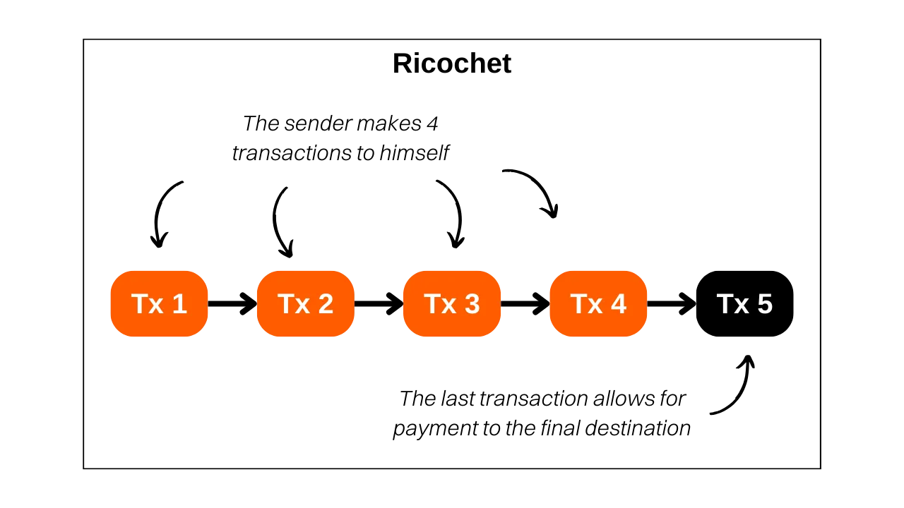
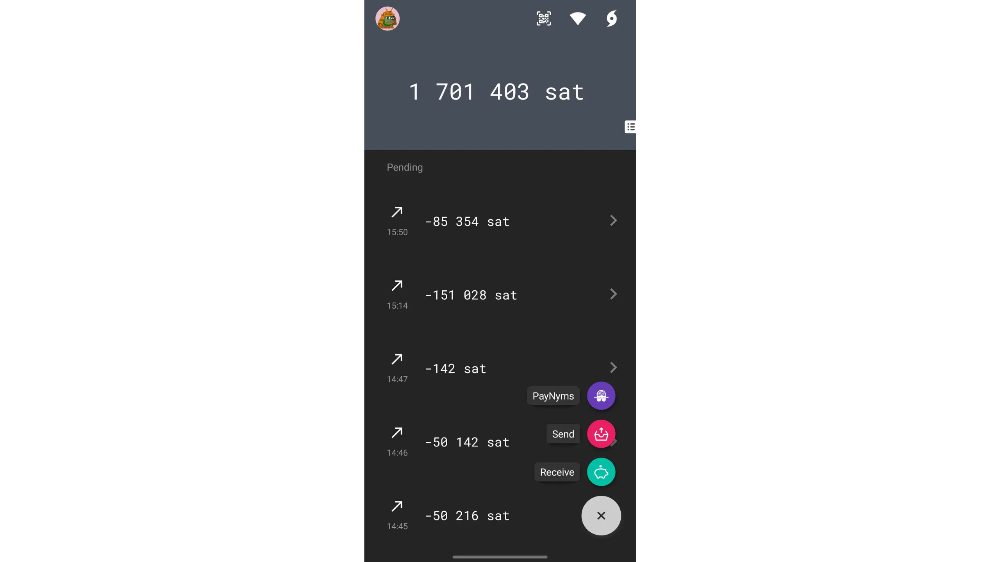
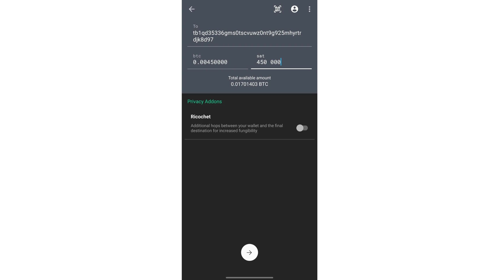
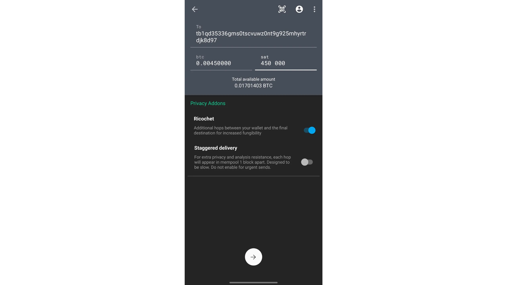
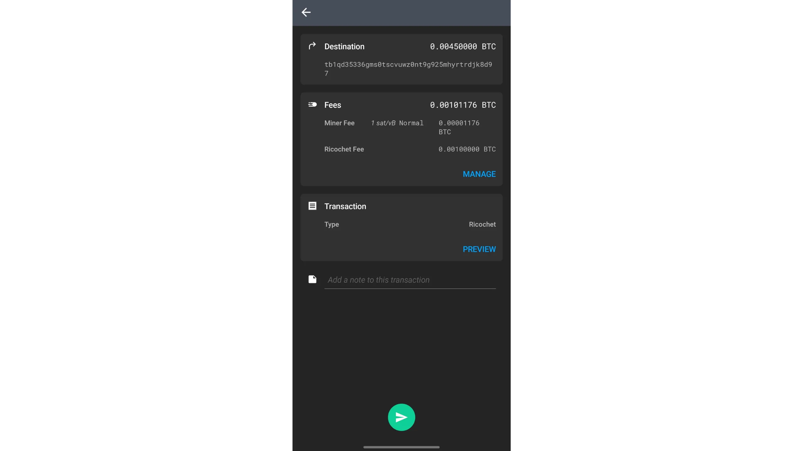
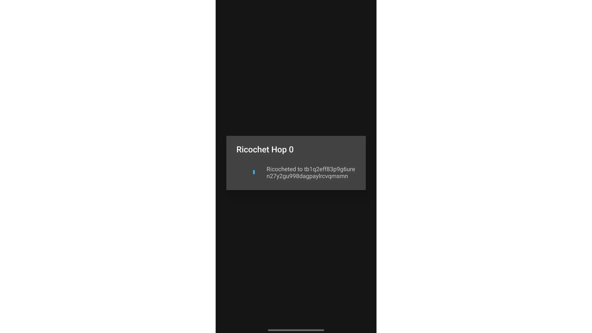
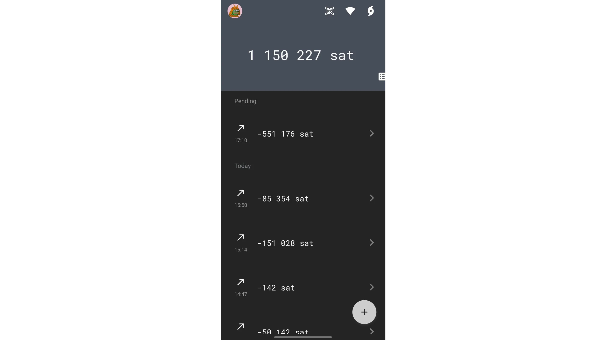

> *Премиум инструмент, който добавя допълнителни стъпки в историята на трансакцията. Засегнете черните списъци и помогнете да се предпазите от несправедливо закриване на сметки на трети страни.*

## Какво е рикошет?

Рикошетът е техника, която се състои в извършването на няколко фиктивни транзакции към себе си, за да се симулира прехвърляне на собствеността върху биткойн. Този инструмент се различава от другите транзакции на Ashigaru (наследени от Samurai Wallet) по това, че не осигурява перспективна анонимност, а по-скоро форма на ретроспективна анонимност. Всъщност Ricochet размива спецификите, които могат да компрометират заменяемостта на част от Bitcoin.

Например, ако направите съвместно свързване, вашата част, която излиза от микса, ще бъде идентифицирана като такава. Инструментите за анализ на веригата са в състояние да откриват патерните на coinjoin транзакциите и да присвояват етикет на частите, излизащи от тях. На практика coinjoin има за цел да прекъсне историческите връзки на дадена монета, но преминаването ѝ през coinjoin остава откриваемо. По аналогия това явление прилича на криптирането на текст: въпреки че оригиналният текст не може да бъде достъпен в чист вид, лесно може да се установи, че е приложено криптиране.

Етикетът "coinjoined" може да повлияе на заменяемостта на UTXO. Регулираните субекти, като например платформите за обмен, могат да откажат да приемат UTXO с coinjoined или дори да поискат обяснения от собственика му, като има риск сметката ви да бъде блокирана или средствата ви да бъдат замразени. В някои случаи платформата може дори да докладва поведението ви на държавните органи.

Тук се прилага методът Ricochet. За да изтрие отпечатъка, оставен от съединяването на монети, Ricochet извършва четири последователни транзакции, при които потребителят прехвърля средствата си към себе си на различни адреси. След тази поредица от транзакции инструментът Ricochet накрая насочва биткойните към крайната им дестинация, като например платформа за обмен. Целта е да се създаде дистанция между първоначалната транзакция за присъединяване към монети и крайния акт на харчене. По този начин инструментите за анализ на блокчейн ще приемат, че вероятно е имало прехвърляне на собствеността след coinjoin и че следователно не е необходимо да се предприемат действия срещу емитента.

При метода Ricochet може да се предположи, че софтуерът за анализ на вериги ще задълбочи изследването си отвъд четири отскока. Тези платформи обаче са изправени пред дилема при оптимизирането на прага на откриване. Те трябва да установят прагов брой скокове, след който да приемат, че вероятно е настъпила промяна на собствеността и че връзката с предишно съвместно свързване трябва да се игнорира. Определянето на този праг обаче е рисковано: всяко разширяване на броя на наблюдаваните скокове експоненциално увеличава обема на фалшивите положителни резултати, т.е. лицата, погрешно отбелязани като участници в coinjoin, когато всъщност операцията е извършена от някой друг. Този сценарий представлява сериозен риск за тези дружества, тъй като фалшивите положителни резултати водят до недоволство, което може да накара засегнатите клиенти да се обърнат към конкуренцията. В дългосрочен план прекалено амбициозният праг на откриване води до това, че платформата губи повече клиенти от своите конкуренти, което може да застраши нейната жизнеспособност. Поради това за тези платформи е сложно да увеличат броя на наблюдаваните откази, а 4 често е достатъчен брой, за да се противопоставят на анализите си.

По този начин **най-често срещаният случай на използване на Ricochet възниква, когато е необходимо да се прикрие предишно участие в coinjoin на UTXO, който притежавате.** В идеалния случай е най-добре да се избягва прехвърлянето на биткойни, които са били подложени на coinjoin, към регулирани субекти. Въпреки това, в случай че не ви остава друга възможност, особено при спешна необходимост от ликвидиране на биткойни в държавна валута, Ricochet предлага ефективно решение.

## Как работи Ricochet в Ashigaru?

Ricochet е просто метод за изпращане на биткойни към себе си, който първоначално е измислен от разработчиците на Samurai Wallet. Следователно е напълно възможно да симулирате Ricochet ръчно, без да е необходим специализиран инструмент. Въпреки това, за тези, които желаят да автоматизират процеса, като същевременно се наслаждават на по-шлифован резултат, инструментът Ricochet, достъпен чрез приложението Ashigaru (което е Самурай fork), представлява добро решение.

Тъй като Ashigaru таксува услугата си, рикошетът струва 100 000 sats като такса за услугата, плюс такса mining. Затова използването му се препоръчва за преводи на значителни суми.

Приложението Ashigaru предлага два варианта на Ricochet:

- Подсилена рикошетка, или "поетапна доставка", която предлага предимството да се разпределят таксите за обслужване на Ashigaru върху петте последователни транзакции. Тази опция също така гарантира, че всяка трансакция се излъчва в отделен момент и се записва в различен блок, имитирайки възможно най-точно поведението на смяна на собствеността. Макар и по-бавен, този метод е за предпочитане за тези, които не бързат, тъй като увеличава максимално ефективността на Рикошет, като засилва устойчивостта му на верижен анализ;

- Класическият Ricochet, който е предназначен за бързо изпълнение на операцията, излъчва всички трансакции в намален интервал от време. Следователно този метод предлага по-малка поверителност и по-малка устойчивост на анализ, отколкото усиленият метод. Той трябва да се използва само за спешни пратки.

## Как се прави рикошет на Ashigaru?

Извършването на рикошет в Ashigaru е много лесно: просто активирайте съответната опция при създаването на транзакция за изпращане. За да започнете, щракнете върху бутона `+`, след това върху `Изпращане` и изберете сметката, от която искате да изпратите средствата.

Попълнете информацията за транзакцията: сумата, която трябва да бъде изпратена, и крайния адрес на получателя след скоковете Ricochet. След това маркирайте опцията `Ricochet`.

След това можете да избирате между двата режима на Ricochet, разгледани в теоретичния раздел: класически Ricochet, при който всички транзакции се включват в един и същи блок, или поетапно доставяне, което подобрява качеството на Ricochet за сметка на по-голямо забавяне.

След като направите избора си, натиснете стрелката в долната част на екрана, за да потвърдите.

На следващия екран ще видите пълно обобщение на транзакцията си. Това е и мястото, където можете да коригирате размера на таксите за вашите транзакции в Ricochet в зависимост от пазарните условия. Ако всичко ви удовлетворява, плъзнете зелената стрелка, за да подпишете и разпространите транзакциите Ricochet.

Изчакайте, докато различните скокове се изпълнят автоматично.

Транзакциите ви бяха успешно излъчени.

Вече сте напълно запознати с опцията Ricochet, налична в приложението Ashigaru. За да продължите напред, ви препоръчвам да преминете моя обучителен курс за BTC 204, който ще ви научи подробно как да укрепите поверителността на вашата верига.

https://planb.academy/courses/65c138b0-4161-4958-bbe3-c12916bc959c