> *Make every spend a coinjoin

## What's a Stonewall x2 transaction?

Stonewall x2 is a specific form of Bitcoin transaction designed to increase user confidentiality when spending, by collaborating with a third party not involved in the expenditure. This method simulates a mini-coinjoin between two participants, while making a payment to a third party. Stonewall x2 transactions are available on the Ashigaru application, a fork from Samourai Wallet (the team behind the creation of this type of transaction).

https://planb.academy/tutorials/wallet/mobile/ashigaru-9f903b55-2e55-4b06-9627-80f8e178158f

How it works is relatively simple: you use a UTXO in your possession to make the payment, and enlist the help of a third party who also contributes with a UTXO of their own. The transaction ends up with four outputs: two of them in equal amounts, one destined for the payee's address, the other for an address belonging to the collaborator. A third UTXO is returned to another address belonging to the collaborator, enabling him to recover the initial amount (a neutral action for him, modulo the mining costs), and a final UTXO returns to an address belonging to us, which constitutes the payment exchange.

Three different roles are thus defined in Stonewall x2 transactions:

- The issuer, who makes the actual payment ;
- The collaborator, who makes bitcoins available in order to improve the anonymity of the transaction, while recovering his funds in full at the end (a neutral action for him, modulo the mining costs);
- The recipient, who may be unaware of the specific nature of the transaction and simply expects payment from the sender.

Let's take an example. Alice is at the baker's to buy her baguette, which costs `4,000 sats`. She wants to pay in bitcoins, while retaining some confidentiality about her payment. So she calls on her friend Bob, who will help her with this.

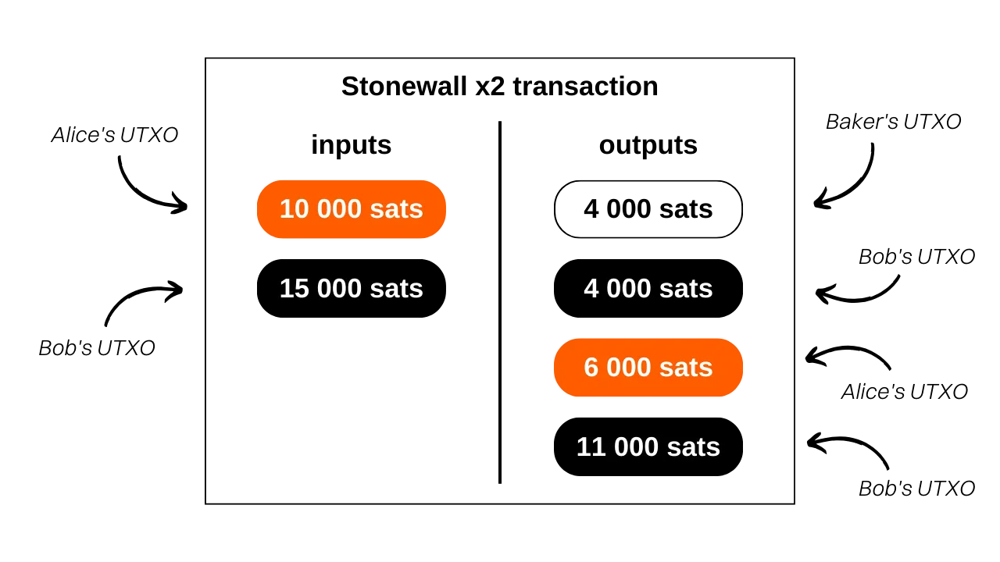

Analyzing this transaction, we can see that the baker actually received `4,000 sats` in payment for the baguette. Alice used `10,000 sats` in input and recovered `6,000 sats` in output, giving a net balance of `-4,000 sats`, which corresponds to the price of the baguette. As for Bob, it supplied `15,000 sats` in input and received two outputs: one of `4,000 sats` and the other of `11,000 sats`, making a balance of `0`.

In this example, I have intentionally neglected the mining fees to make it easier to understand. In reality, transaction fees are shared equally between the payment issuer and the collaborator.

## What's the difference between Stonewall and Stonewall x2?

A StonewallX2 transaction works in exactly the same way as a Stonewall transaction, except that the former is collaborative, whereas the latter is not. As we have seen, a Stonewall x2 transaction involves the participation of a third party, who is external to the payment, and who will make his or her bitcoins available to enhance the confidentiality of the transaction. In a classic Stonewall transaction, the role of the collaborator is taken on by the sender.

Let's go back to our example of Alice at the bakery. If she hadn't been able to find someone like Bob to accompany her on her spending spree, she could have done a Stonewall on her own. That way, the two UTXOs on the way in would have been hers, and she'd have picked up 3 on the way out.

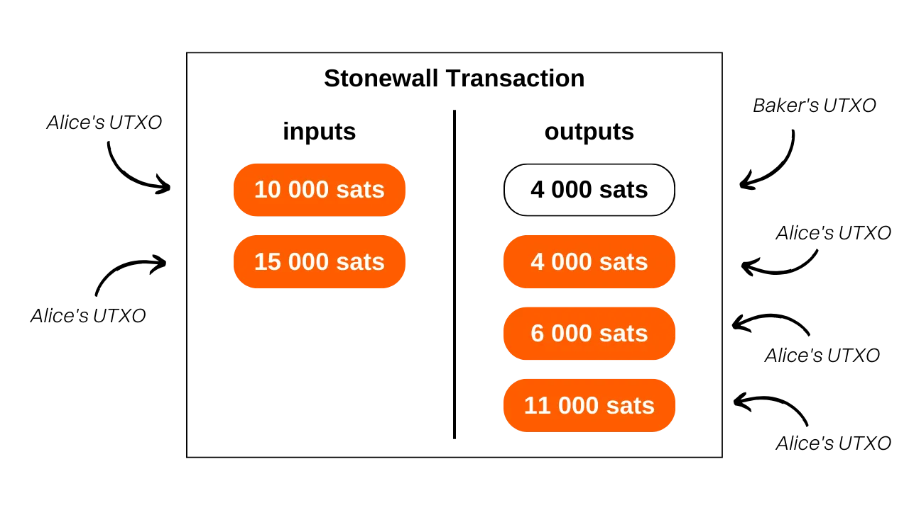

From an outsider's point of view, the transaction would have remained the same.

The logic should therefore be as follows when you want to use an Ashigaru spending tool:

- If the merchant does not support Payjoin Stowaway, you can make a collaborative transaction with another person outside the payment thanks to Stonewall x2 ;
- If you can't find anyone to make a Stonewall x2 transaction, you can make a Stonewall only transaction, which will mimic the behavior of a Stonewall x2 transaction.

https://planb.academy/tutorials/privacy/on-chain/ashigaru-stonewall-033daa45-d42c-40e1-9511-cea89751c3d4

## What's the point of a Stonewall x2 transaction?

The Stonewall x2 structure adds an enormous amount of entropy to the transaction, confounding the chain analysis. Seen from the outside, such a transaction might be interpreted as a small Coinjoin between two people. But in reality, it's a payment. This method therefore creates uncertainties in chain analysis, or even leads to false leads.

Let's take the example of Alice, Bob and the Boulanger. The transaction on the blockchain would look like this:

An outside observer relying on common chain analysis heuristics might wrongly conclude that "*Alice and Bob have made a small coinjoin, with one UTXO each in and two UTXOs each out*".

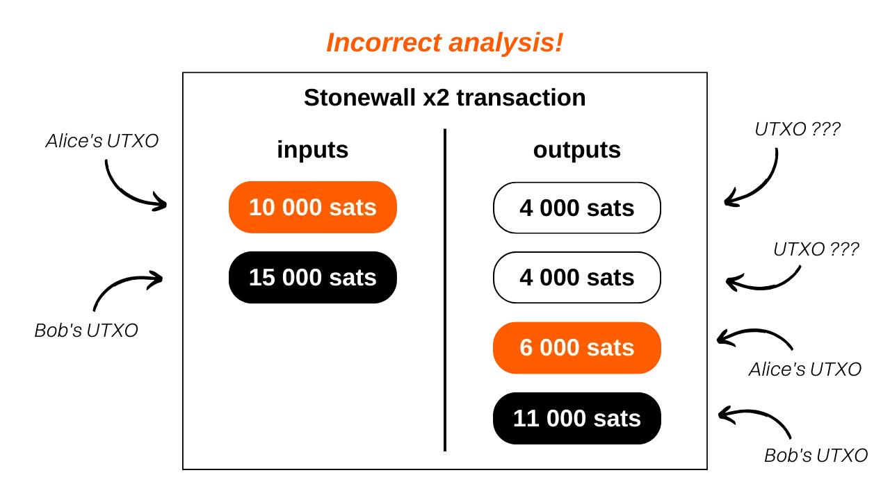

This interpretation is incorrect because, as you know, a UTXO was sent to the Boulanger, Alice has only one exchange output, and Bob has two.

Even if the outside observer manages to identify the paterne of the Stonewall x2 transaction, he won't have all the information. He won't be able to determine which of the two UTXOs of the same amounts corresponds to the payment. Nor will he be able to determine whether Alice or Bob made the payment. Finally, he won't be able to determine whether the two UTXOs entered are from two different people, or whether they belong to a single person who has merged them. This last point is due to the fact that classic Stonewall transactions, discussed above, follow exactly the same paterne as Stonewall x2 transactions. Seen from the outside and without additional contextual information, it's impossible to differentiate a Stonewall transaction from a Stonewall x2 transaction. The former are not collaborative transactions, whereas the latter are. This adds even more doubt to the expense.

## How do I establish a connection between Paynyms?

As with other collaborative transactions on Ashigaru (*Cahoots*), Stonewall x2 involves the exchange of partially signed transactions between the sender and the collaborator. This exchange can be carried out manually, if you are physically present with your collaborator, or automatically using the Soroban communication protocol.

If you choose the second option, you'll need to establish a connection between Paynyms before you can perform a Stonewall x2. To do this, your Paynym must "*follow*" your collaborator's Paynym, and vice versa. To find out how to do this, you can follow the beginning of this other tutorial:

https://planb.academy/tutorials/privacy/on-chain/paynym-bip47-a492a70b-50eb-4f95-a766-bae2c5535093

## How do I make a Stonewall x2 transaction on Ashigaru?

To carry out a Stonewall x2 transaction, click on the image of your Paynym in the top left-hand corner of the screen, then open the `Collaborate` menu. The person taking part in the transaction with you must do the same, unless you are exchanging QR codes in person.

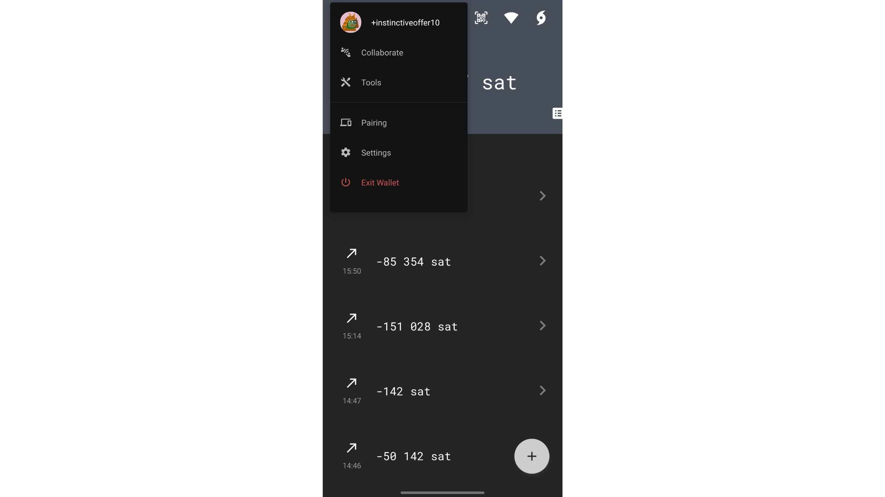

You have two options: select `Initiate` if you are the sender of the payment, or `Participate` if you are the person collaborating in the transaction but are neither the payer nor the actual recipient.

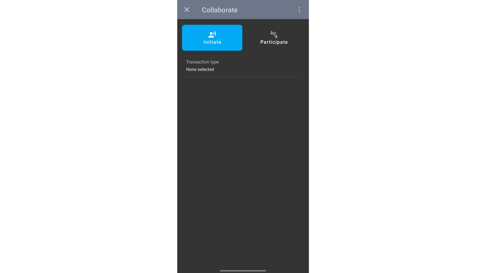

If you have the role of collaborator, the procedure is very simple. For remote collaboration via the Soroban network, click on `Participate`, choose the account you wish to use, then press `LISTEN FOR CAHOOTS REQUESTS` to wait for the request sent by the payer.

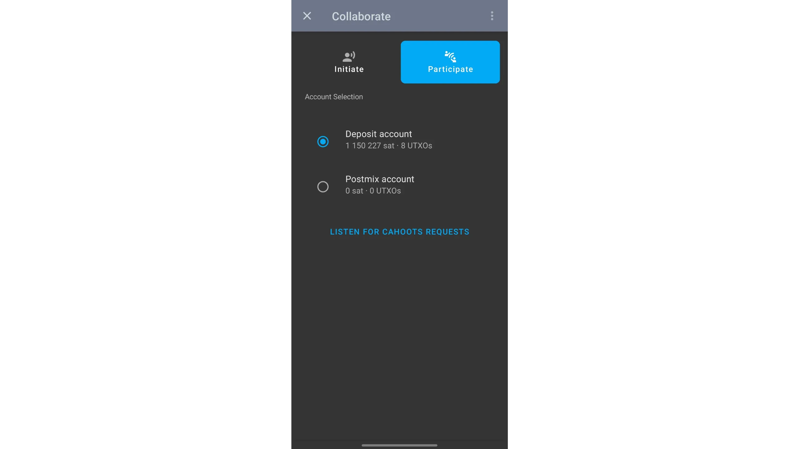

On the other hand, for in-person collaboration via QR code scanning, go to the home page of your wallet, press the QR code icon at the top of the screen, then scan the QR code provided by the payer initiating the transaction.

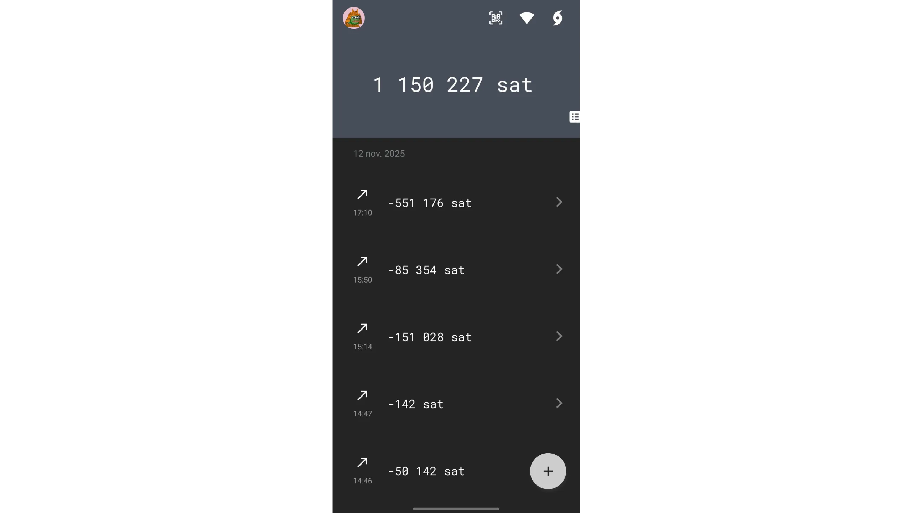

If you are in the payer role, i.e. the one initiating the transaction, go to the `Collaborate` menu, then select `Initiate`.

For the transaction type, since we wish to perform a Stonewall x2, choose this option.

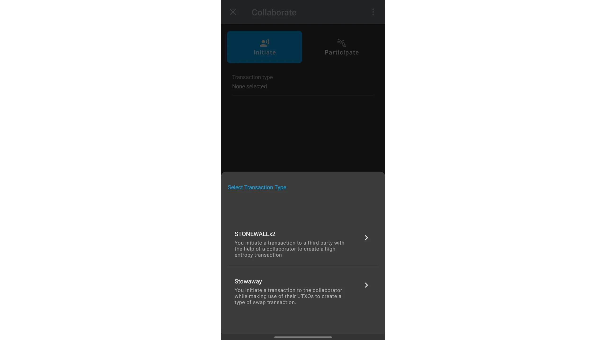

You can then choose between online collaboration (*Cahoots* via *Soroban*) or face-to-face collaboration, with QR code exchanges.

### Cahoots online

If you have chosen the `Online` option, then select your collaborator from the Paynyms you are following.

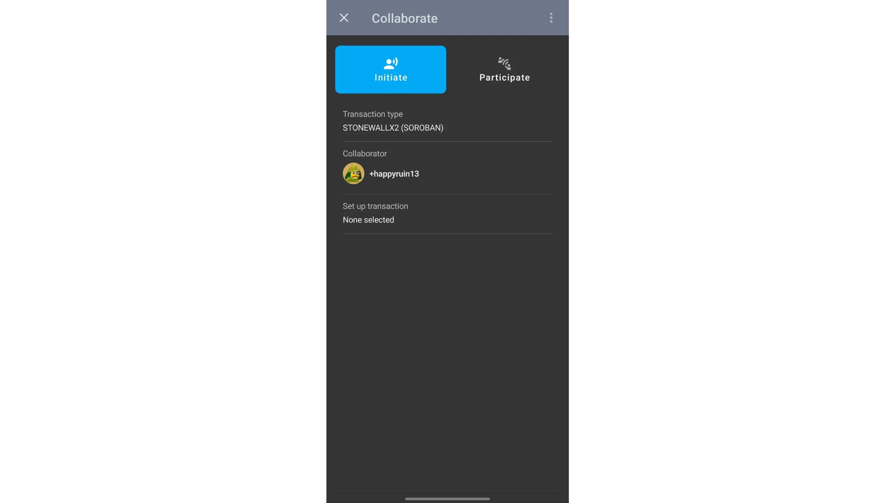

Click on `Set up transaction`, then choose the account from which you wish to make the expenditure.

On the next page, enter the transaction details: the address of the actual recipient of the payment, the amount to be sent and the charge rate. Then click on `Review transaction setup`.

Check the information carefully, make sure your collaborator is listening to the *Cahoots* requests, then click on the green `BEGIN TRANSACTION` button to initiate the exchange of PSBTs via Soroban.

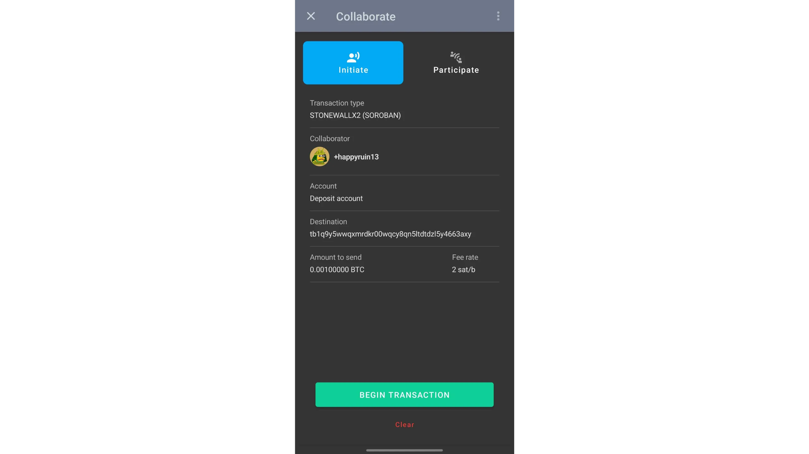

Wait until both participants have signed the transaction, then broadcast it on the Bitcoin network.

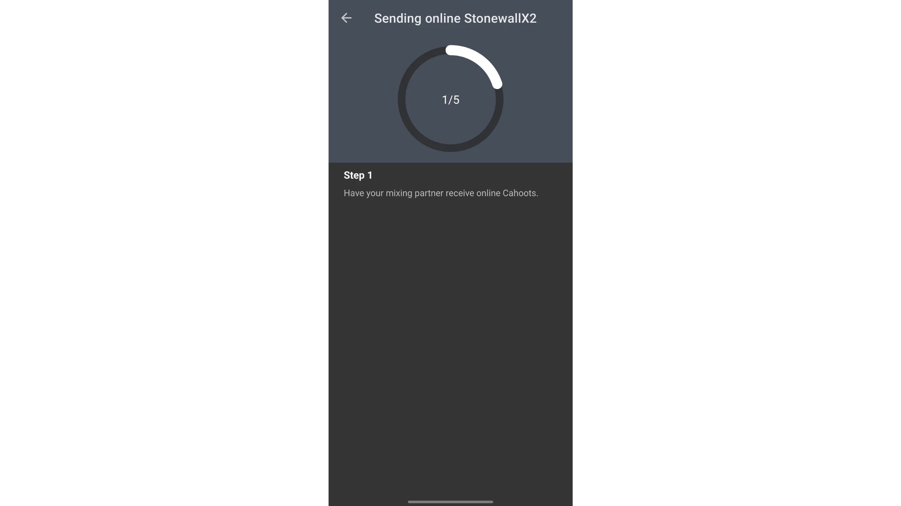

### Face-to-face discussions

If you wish to carry out the exchange in person, select the `STONEWALL X2` transaction type, then choose the `In Person / Manual` option.

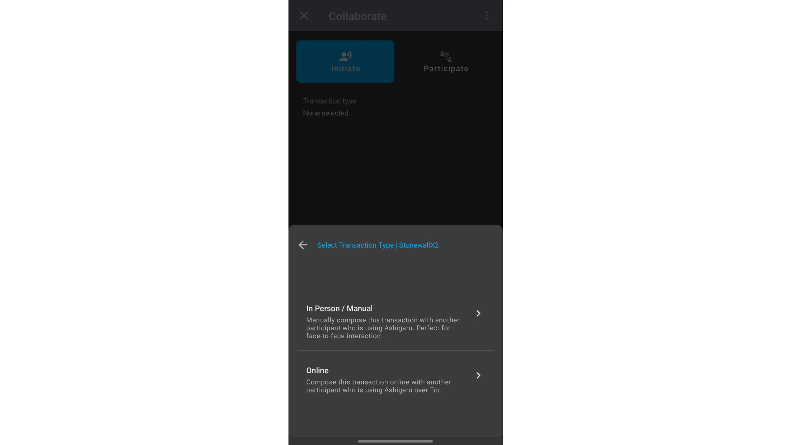

Click on `Set up transaction`, then choose the account from which you wish to make the expenditure.

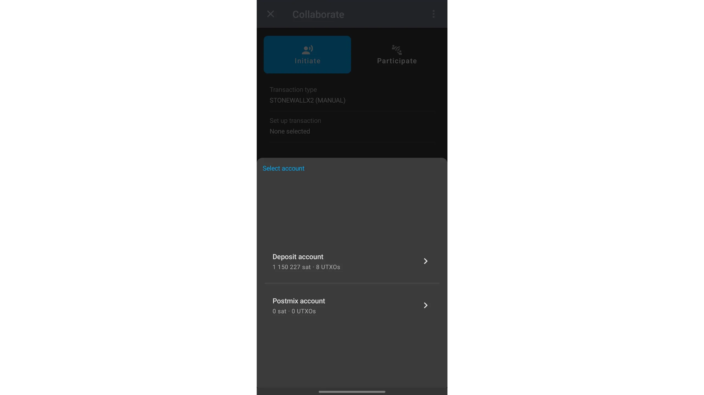

On the next page, enter the transaction details: the address of the actual recipient of the payment, the amount to be sent and the charge rate. Then click on `Review transaction setup`.

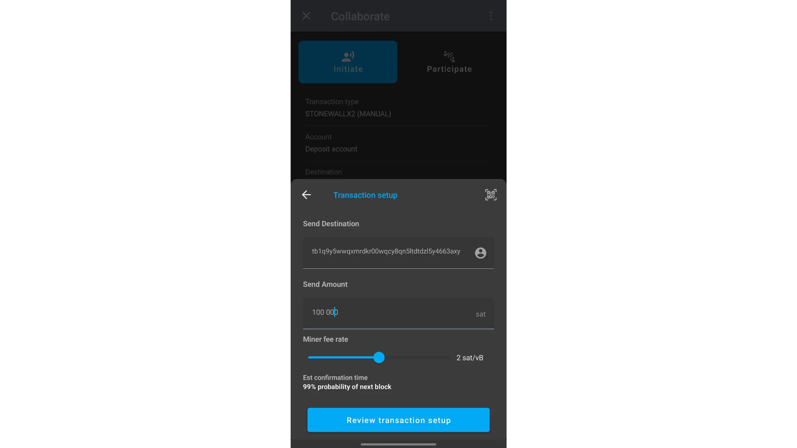

Check the details, then press the green `BEGIN TRANSACTION` button to start exchanging PSBTs via QR code scanning.

The exchange is done by alternating the scan with the collaborator: click on `SHOW QR CODE` to display your QR code to your collaborator, who will scan it. He will then click on `SHOW QR CODE` to display his, and you will scan it with `LAUNCH QR Scanner`. Repeat this process until all five exchange steps have been completed.

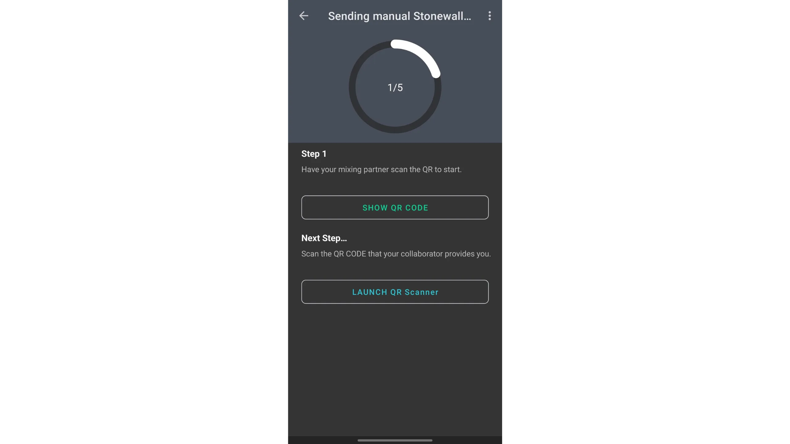

Once all exchanges have been completed, check the transaction details, then release it by dragging the green arrow at the bottom of the screen.

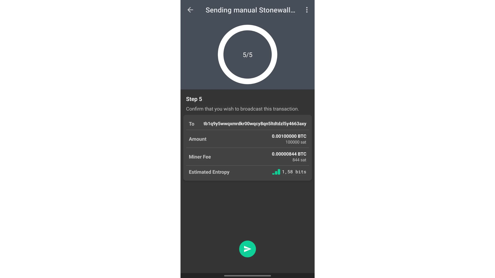

[The transaction has been published](https://mempool.space/testnet4/tx/9082f3d989728aacd290535a1ac374ab8c04a241a1d798b378db626dabea7a24). Its structure is as follows:

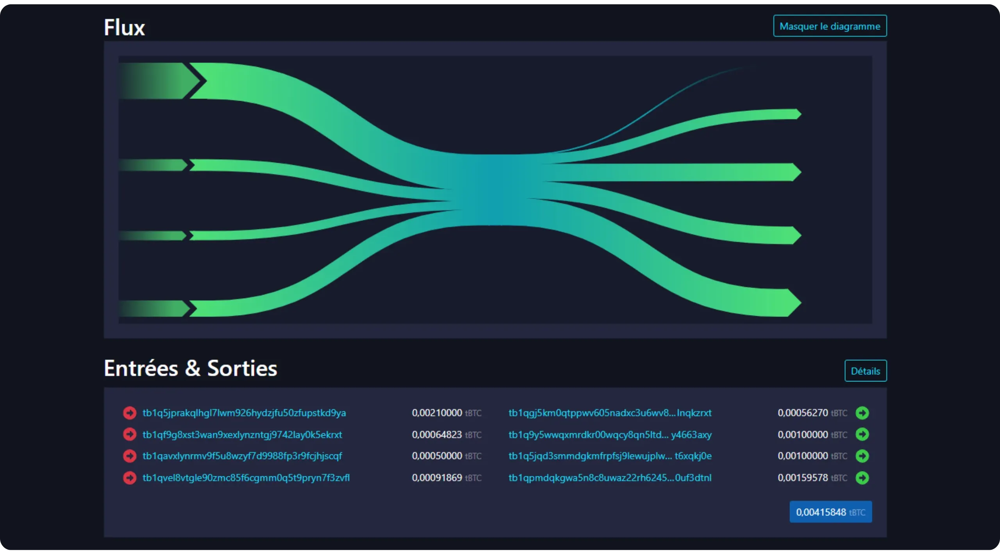

*Credit: [mempool.space](https://mempool.space/)*

We can observe two inputs from my portfolio, respectively `91,869 sats` and `64,823 sats`, while the other two inputs come from my collaborator's wallet. On the output side, one UTXO of `100,000 sats` is sent to the actual payee, and two UTXOs of `100,000 sats` and `159,578 sats` return to my collaborator's portfolio. For him, the operation is neutral, as he recovers the full amount of the funds he had invested in input (excluding the mining costs to which he contributed). Finally, I receive an exchange UTXO of `56,270 sats`, corresponding to the difference between my total inputs and the payment of `100,000 sats` sent to the recipient.

Obviously, I can describe this structure because I built the transaction myself. But for an outside observer, it's generally impossible to determine which UTXOs belong to which participant, either in inputs or outputs.

To deepen your knowledge of onchain privacy management on Bitcoin, I recommend you take my BTC 204 training on Plan ₿ Academy :

https://planb.academy/courses/65c138b0-4161-4958-bbe3-c12916bc959c