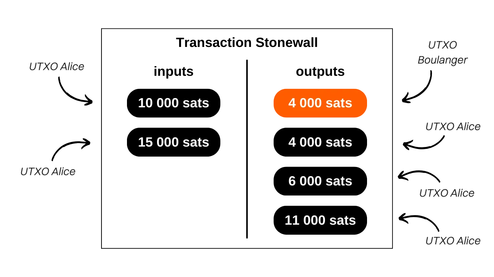
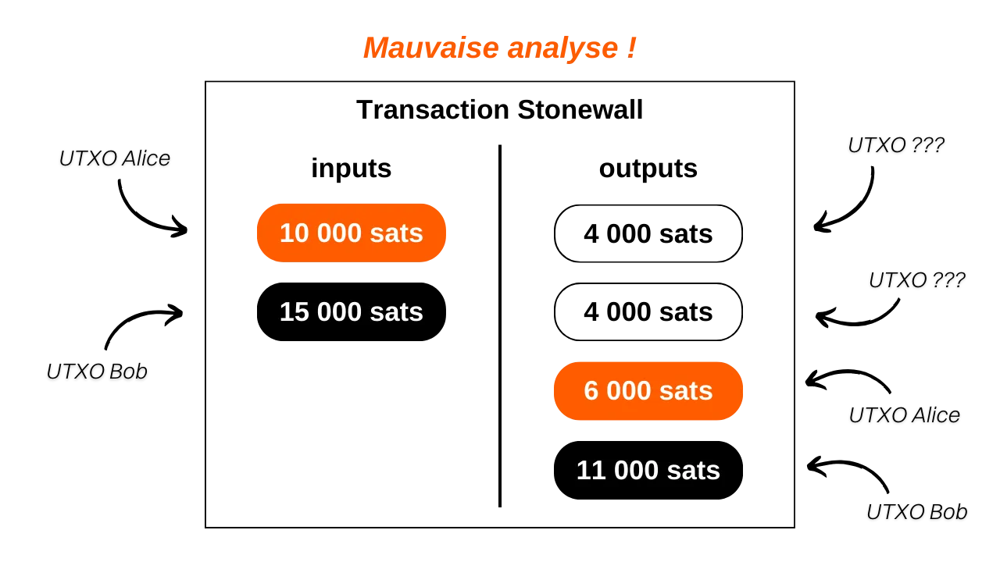
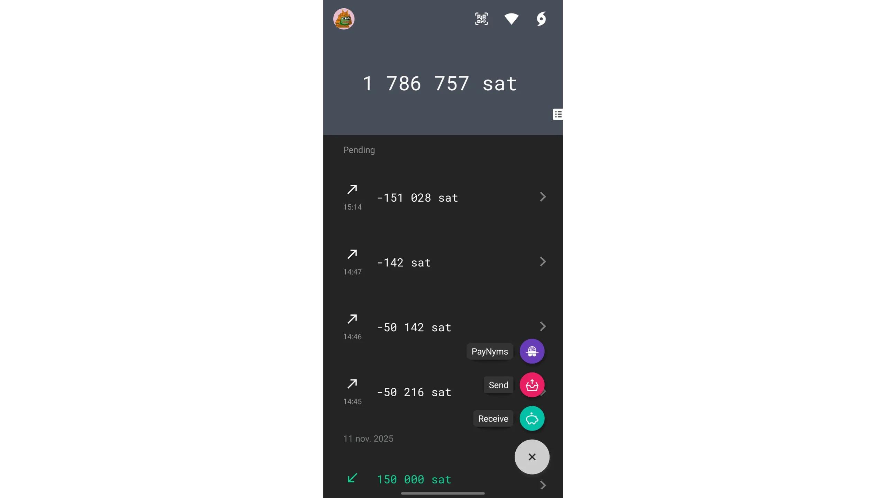
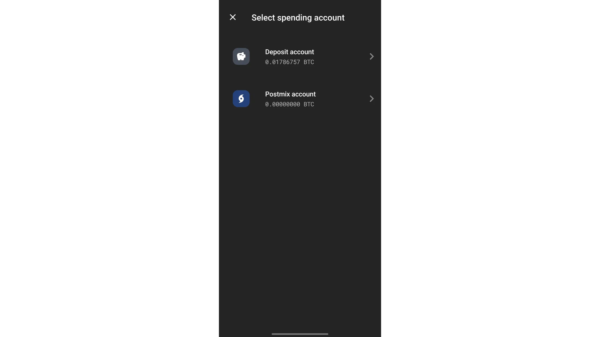
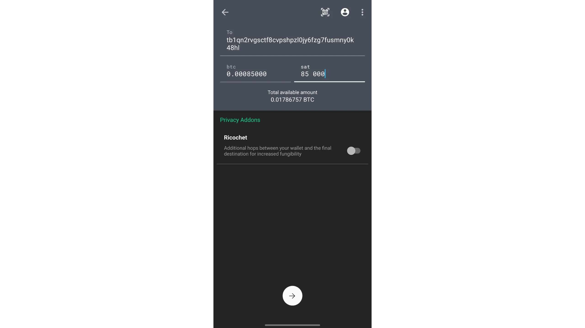
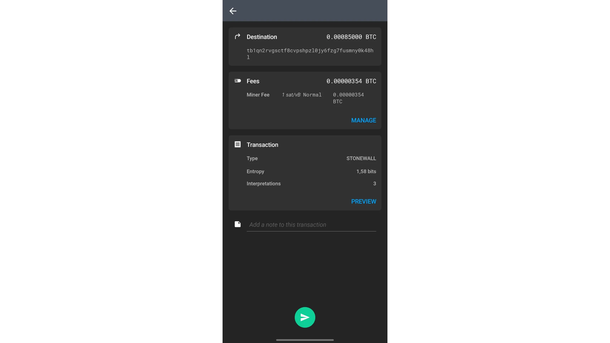
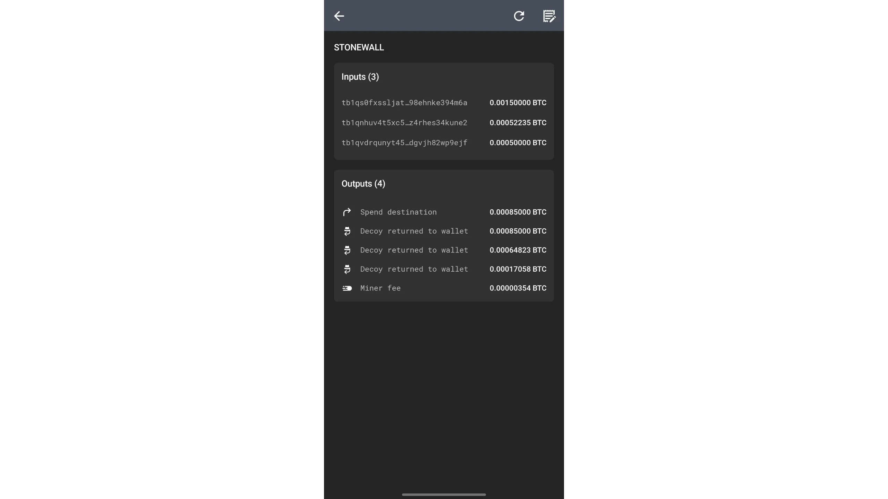
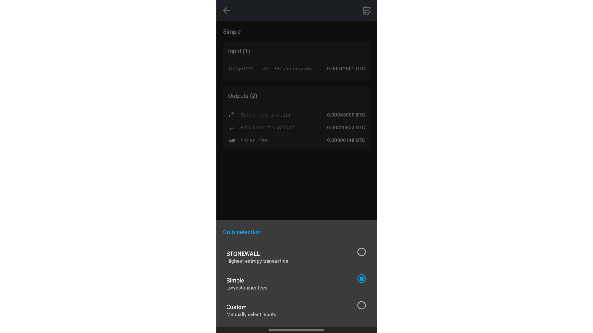
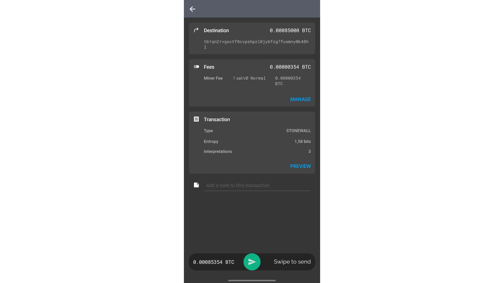

> *Brechen Sie die Annahmen der Blockchain-Analyse mit mathematisch nachweisbaren Zweifeln zwischen Absender und Empfänger Ihrer Transaktionen.*

## Was ist eine Stonewall-Transaktion?

Stonewall ist eine spezielle Form der Bitcoin-Transaktion, die darauf abzielt, die Vertraulichkeit der Nutzer beim Geldausgeben zu erhöhen, indem sie eine Münzverbindung zwischen zwei Personen imitiert, ohne tatsächlich eine zu sein. In der Tat ist diese Transaktion nicht gemeinschaftlich. Ein Benutzer kann sie selbst erstellen, indem er nur die UTXOs, die er besitzt, als Input verwendet. Sie können also eine Stonewall-Transaktion für jede Gelegenheit erstellen, ohne sich mit einem anderen Benutzer absprechen zu müssen.

Die Stonewall-Transaktion funktioniert folgendermaßen: Als Input für die Transaktion verwendet der Emittent 2 UTXO, die ihm gehören. Auf der Ausgabeseite erzeugt die Transaktion 4 Ausgaben, von denen 2 genau den gleichen Betrag haben. Bei den anderen 2 handelt es sich um Devisen. Von den 2 Outputs mit gleichem Betrag geht nur einer tatsächlich an den Zahlungsempfänger.

Es gibt also nur 2 Rollen bei einer Stonewall-Transaktion:

- Der Emittent, der die eigentliche Zahlung vornimmt;
- Der Empfänger, der möglicherweise nicht weiß, worum es sich bei der Transaktion handelt, und einfach eine Zahlung vom Absender erwartet.

Nehmen wir ein Beispiel, um diese Transaktionsstruktur zu verstehen. Alice ist beim Bäcker, um ihr Baguette zu kaufen, das 4.000 sats kostet. Sie möchte in Bitcoins bezahlen und dabei eine gewisse Form der Vertraulichkeit über ihre Zahlung wahren. Also beschließt sie, eine Stonewall-Transaktion für die Zahlung zu erstellen.

Die Analyse dieser Transaktion zeigt, dass der Bäcker tatsächlich 4.000 sats als Bezahlung für das Baguette erhalten hat. Alice hat 2 UTXO als Inputs verwendet: einen von `10.000 sats` und einen von `15.000 sats`. Auf der Outputseite hat es 3 UTXO zurückerhalten: eines von `4.000 sats`, eines von `6.000 sats` und eines von `11.000 sats`. Alice hat also bei dieser Transaktion einen Nettosaldo von -4.000 sats", was dem Preis des Baguettes gut entspricht.

In diesem Beispiel habe ich die mining-Gebühren absichtlich vernachlässigt, um es leichter verständlich zu machen. In Wirklichkeit werden die Transaktionskosten vollständig vom Emittenten getragen.

## Was ist der Unterschied zwischen Stonewall und Stonewall x2?

Die Stonewall-Transaktion funktioniert genauso wie die StonewallX2-Transaktion, nur dass letztere im Gegensatz zur klassischen Stonewall-Transaktion eine Zusammenarbeit erfordert, daher der Name "x2". Der Grund dafür ist, dass die Stonewall-Transaktion ohne externe Zusammenarbeit ausgeführt wird: Der Absender kann sie ohne die Hilfe einer anderen Person durchführen. Bei einer Stonewall-x2-Transaktion hingegen tritt ein weiterer Teilnehmer, der so genannte "Kollaborateur", in den Prozess ein. Er steuert neben den Bitcoins des Absenders seine eigenen Bitcoins zur Transaktion bei und übernimmt am Ende den gesamten Betrag (modulo der mining-Kosten).

Kehren wir zu unserem Beispiel mit Alice in der Bäckerei zurück. Hätte sie eine Stonewall-x2-Transaktion durchführen wollen, hätte Alice mit Bob (einer dritten Partei) zusammenarbeiten müssen, um die Transaktion vorzubereiten. Sie hätten jeweils einen UTXO mitgebracht. Bob hätte dann seinen gesamten Beitrag zurückerhalten. Der Bäcker hätte die Zahlung für sein Baguette auf die gleiche Weise wie bei der Stonewall-Transaktion erhalten, während Alice sein ursprüngliches Guthaben abzüglich der Kosten für das Baguette zurückerhalten hätte.

Aus der Sicht eines Außenstehenden wäre die Transaktion genau die gleiche geblieben.

Zusammenfassend lässt sich sagen, dass die Transaktionen von Stonewall und Stonewall x2 eine identische Struktur aufweisen. Der Unterschied zwischen den beiden liegt darin, ob sie kooperativ oder nicht kollaborativ sind. Die Stonewall-Transaktion wird individuell entwickelt, ohne die Notwendigkeit einer Zusammenarbeit. Die Stonewall-x2-Transaktion hingegen beruht auf der Zusammenarbeit zwischen zwei Personen, um sie aufzusetzen.

[**-> Erfahren Sie mehr über Stonewall-Transaktionen x2**](https://planb.academy/tutorials/privacy/on-chain/ashigaru-stonewall-x2-05120280-f6f9-4e14-9fb8-c9e603f73e5b)

## Was ist der Sinn einer Stonewall-Transaktion?

Die Stonewall-Struktur fügt der Transaktion eine enorme Menge an Entropie hinzu und verwischt die Grenzen der Kettenanalyse. Von außen betrachtet kann eine solche Transaktion als ein kleiner Coinjoin zwischen zwei Personen interpretiert werden. In Wirklichkeit handelt es sich aber, wie bei der Stonewall x2-Transaktion, um eine Zahlung. Diese Methode führt daher zu Unsicherheiten in der Kettenanalyse oder sogar zu falschen Hinweisen.

Nehmen wir das Beispiel von Alice beim Bäcker. Die Transaktion auf der Blockchain würde wie folgt aussehen:

Ein außenstehender Beobachter, der sich auf die üblichen Heuristiken der Kettenanalyse verlässt, könnte fälschlicherweise zu dem Schluss kommen, dass "**zwei Personen eine kleine Münzverbindung hergestellt haben, mit je einem UTXO als Eingang und zwei UTXOs als Ausgang**".

Diese Interpretation ist ungenau, denn, wie Sie wissen, wurde ein UTXO an den Bäcker geschickt, die 2 eingehenden UTXOs kamen von Alices, und sie erhielt 3 Wechselkursausgaben zurück.

Selbst wenn es dem außenstehenden Beobachter gelingt, den Vater der Stonewall-Transaktion zu identifizieren, wird er nicht über alle Informationen verfügen. Er wird nicht in der Lage sein, festzustellen, welcher der beiden UTXOs mit den gleichen Beträgen der Zahlung entspricht. Außerdem kann er nicht feststellen, ob die beiden eingegebenen UTXOs von zwei verschiedenen Personen stammen oder ob sie einer einzigen Person gehören, die sie zusammengelegt hat. Dieser letzte Punkt ergibt sich aus der Tatsache, dass die oben erwähnten Stonewall-x2-Transaktionen genau demselben Muster folgen wie die Stonewall-Transaktionen. Von außen betrachtet und ohne zusätzliche Kontextinformationen ist es unmöglich, einen Unterschied zwischen einer Stonewall-Transaktion und einer Stonewall x2-Transaktion zu erkennen. Bei ersteren handelt es sich nicht um kollaborative Transaktionen, bei letzteren hingegen schon. Dies erhöht die Zweifel an den Kosten noch mehr.

## Wie mache ich eine Stonewall-Transaktion auf Ashigaru?

Die ursprünglich vom Samourai Wallet-Team entwickelten Stonewall-Transaktionen wurden von der Ashigaru-Anwendung übernommen, einer fork des ursprünglichen wallet, die nach der Verhaftung der Samourai-Entwickler erstellt wurde. Sie müssen Ashigaru installieren und einen wallet erstellen:

https://planb.academy/tutorials/wallet/mobile/ashigaru-9f903b55-2e55-4b06-9627-80f8e178158f

Im Gegensatz zu Stowaway oder Stonewall x2 (*cahoots*) erfordern Stonewall-Transaktionen nicht die Verwendung von Paynyms. Sie können direkt ausgeführt werden, ohne vorherige Vorbereitung oder Zusammenarbeit mit einem anderen Nutzer.

Eigentlich braucht man kein Tutorial, um Stonewall-Transaktionen zu machen, denn Ashigaru generiert sie jedes Mal automatisch, sobald man genügend UTXOs im wallet hat.

Klicken Sie auf die Schaltfläche "+" unten rechts auf dem Bildschirm und wählen Sie dann "Senden".

Wählen Sie das Konto, von dem Sie die Ausgabe tätigen möchten.

Geben Sie dann die Transaktionsdaten ein: die Adresse des Empfängers und den zu sendenden Betrag, und drücken Sie zur Bestätigung auf den Pfeil.

Hier können Sie natürlich die Standardtransaktionsgebühren an die Marktbedingungen anpassen. Das interessanteste Element auf dieser Seite ist jedoch die Transaktionsart. Sie werden feststellen, dass Ashigaru automatisch `STONEWALL` ausgewählt hat. Klicken Sie auf die Schaltfläche "VORSCHAU", um mehr darüber zu erfahren.

Wie Sie sehen, handelt es sich tatsächlich um eine Transaktion vom Typ Stonewall: Sie umfasst 2 Eingänge mit demselben Betrag, 2 Ausgänge mit demselben Betrag sowie die Austauschausgänge und in meinem Fall einen zusätzlichen Eingang, um den Zahlungsbetrag zu begleichen.

Wenn Sie keine Stonewall-Transaktion durchführen möchten, sondern eine herkömmliche Zahlung bevorzugen, klicken Sie auf das Bleistift-Symbol oben rechts auf dem Bildschirm und wählen Sie dann "Einfach" anstelle von "STONEWALL".

Wenn Sie alle Details überprüft haben, ziehen Sie den grünen Pfeil am unteren Rand des Bildschirms, um die Transaktion zu unterzeichnen und freizugeben.

Sie wissen nun, wie man eine Stonewall-Transaktion durchführt, und vor allem, wie sie funktioniert. Wenn Sie mehr darüber erfahren möchten, schauen Sie sich mein Tutorial zu Ashigaru Terminal an, in dem erklärt wird, wie man Coinjoins über Whirlpool durchführt.

https://planb.academy/tutorials/privacy/on-chain/ashigaru-terminal-9a0d46d3-33b9-4c64-84c5-bfa25b3a0add