> *Принудете блокчейн шпионите да преосмислят всичко, което мислят, че знаят.*

Payjoin е структура на транзакциите Bitcoin, предназначена да повиши поверителността на потребителите, като включва пряко сътрудничество с получателя на плащането. Съществуват няколко реализации, които улесняват прилагането ѝ и автоматизират процеса. Най-известната от тях несъмнено е Stowaway, първоначално разработена от екипа на Samurai Wallet, а сега интегрирана в неговата fork Ashigaru.

## Как работи Stowaway?

Както беше споменато по-рано, Ashigaru интегрира инструмент на PayJoin, наречен `Stowaway`. Той е достъпен в приложението Ashigaru за Android. За да бъде извършено Payjoin, получателят (който поема и ролята на сътрудник) трябва да използва софтуер, съвместим със Stowaway, т.е. засега само Ashigaru.

Stowaway се основава на категория транзакции, които Samurai нарича "Cahoots". Cahoot е съвместна транзакция между няколко потребители, включваща обмен на информация извън блокчейна на Bitcoin. В момента Ashigaru предлага два инструмента за Cahoots: Stowaway (Payjoins) и StonewallX2.

https://planb.academy/tutorials/privacy/on-chain/ashigaru-stonewall-x2-05120280-f6f9-4e14-9fb8-c9e603f73e5b

Транзакциите "Cahoots" изискват обмен на частично подписани транзакции между потребители. Този процес може да бъде дълъг и досаден, особено когато се извършва от разстояние. Въпреки това все още е възможно да се извърши ръчно, ако сътрудниците се намират на едно и също място. Конкретно това включва последователно сканиране на пет QR кода, разменени между двамата участници.

Отдалеч този метод става твърде сложен. За да поправи това, Самурай е разработил криптиран протокол за комуникация, базиран на Tor, наречен "*Soroban*". Благодарение на Soroban обменът, необходим за Payjoin, е автоматизиран и се извършва във фонов режим.

Тези криптирани комуникации изискват връзка и удостоверяване на автентичността между участниците в Cahoot. Ето защо Soroban разчита на Paynyms на потребителите. Ако все още не сте запознати с начина на работа на Paynyms, разгледайте този специален урок, за да научите повече:

https://planb.academy/tutorials/privacy/on-chain/paynym-bip47-a492a70b-50eb-4f95-a766-bae2c5535093

Накратко, Paynym е уникален идентификатор, свързан с вашия wallet, който ви позволява да активирате различни функции, включително криптиран обмен. Той е под формата на идентификатор, придружен от илюстрация. Ето например този, който използвам за Testnet:

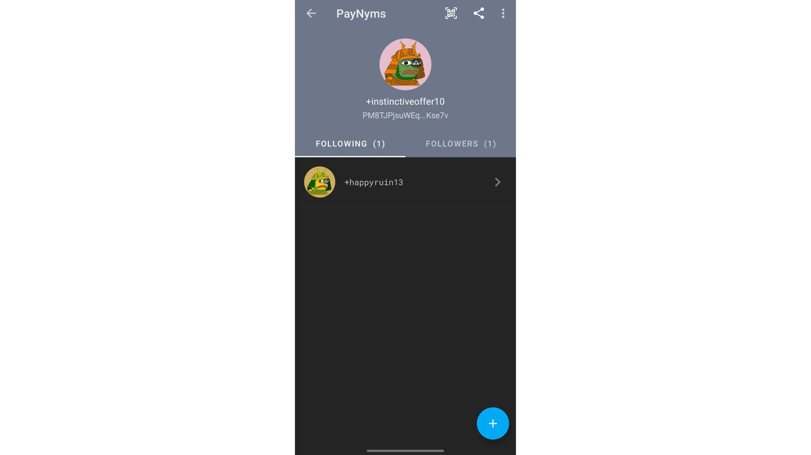

**В обобщение:**

- payjoin" = Специфична структура на съвместната транзакция;

- `Stowaway` = Реализация на Payjoin, налична в Ashigaru ;

- `Cahoots` = Име, дадено от Samourai на всички техни видове съвместни транзакции, по-специално Payjoin `Stowaway`, възприето днес в Ashigaru;

- soroban = Криптиран протокол за комуникация, създаден в Tor, който позволява сътрудничество с други потребители в рамките на транзакция `Cahoots`;

- paynym" = Уникален идентификатор wallet, използван за установяване на връзка с друг потребител в "Soroban", за да се извърши транзакция в "Chahoots".

За по-задълбочен поглед върху работата на Payjoins и тяхната полезност за защита на личните данни във веригата препоръчвам този друг урок:

https://planb.academy/tutorials/privacy/on-chain/payjoin-848b6a23-deb2-4c5f-a27e-93e2f842140f

## Как да установя връзка между Paynyms?

За да започнете, разбира се, ще трябва да инсталирате Ashigaru и да създадете :

https://planb.academy/tutorials/wallet/mobile/ashigaru-9f903b55-2e55-4b06-9627-80f8e178158f

За да извършите дистанционна транзакция в рамките на Cahoots, включително PayJoin (*Stowaway*) чрез Ashigaru, първо трябва да "последвате" потребителя, с когото искате да си сътрудничите, като използвате неговия Paynym. В случая на Stowaway това означава да следвате лицето, на което искате да изпратите биткойни. Ако все още не знаете как да следвате друг Paynym, ще намерите подробната процедура в този урок :

https://planb.academy/tutorials/privacy/on-chain/paynym-bip47-a492a70b-50eb-4f95-a766-bae2c5535093

## Как да направя Payjoin в Ashigaru?

За да извършите транзакция в Stowaway, кликнете върху изображението на вашия Paynym в горния ляв ъгъл на екрана, след което отворете менюто `Сътрудничество`. Лицето, което участва в транзакцията заедно с вас, трябва да направи същото, освен ако не разменяте QR кодове лично.

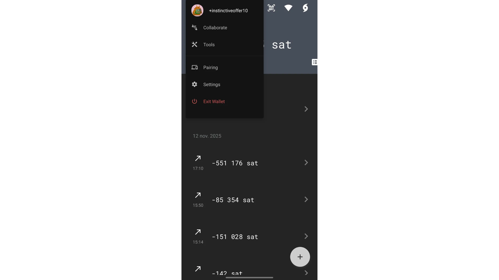

Имате две възможности: изберете `Иницииране`, ако сте изпращач на плащането, или `Участие`, ако сте получател на плащането.

Ако вие сте получателят, процедурата е много проста. За отдалечено сътрудничество чрез мрежата на Soroban кликнете върху `Участвай`, изберете акаунта, който искате да използвате, след което натиснете `ИЗЧАКВАЙТЕ ЗА ИСКАНЕ НА КАУЧУЦИ`, за да изчакате искането, изпратено от платеца.

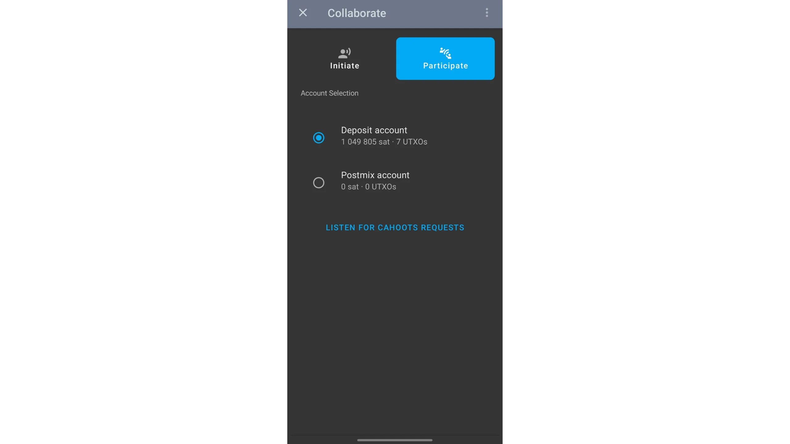

От друга страна, за лично сътрудничество чрез сканиране на QR код, отидете на началната страница на вашия wallet, натиснете иконата за QR код в горната част на екрана, след което сканирайте QR кода, предоставен от платеца, който инициира транзакцията.

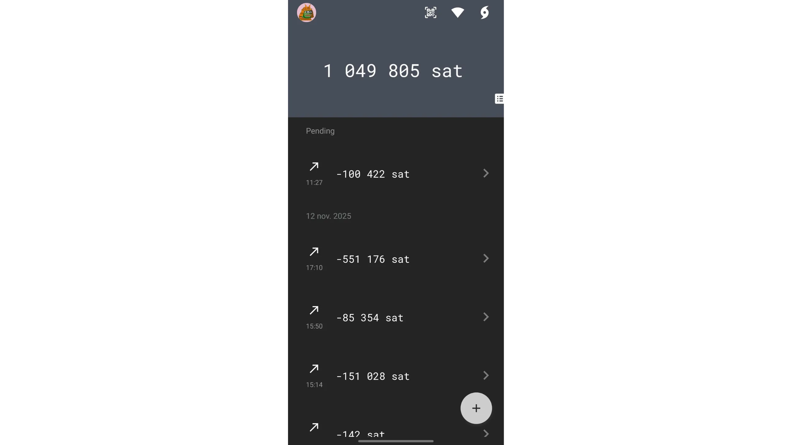

Ако сте в ролята на платец, т.е. този, който инициира транзакцията, отидете в менюто `Сътрудничество`, след което изберете `Иницииране`.

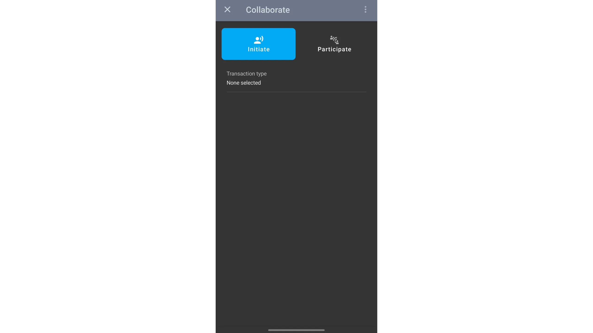

Тъй като желаем да направим Payjoin Stowaway, изберете тази опция за вида на транзакцията.

След това можете да избирате между онлайн сътрудничество (*Cahoots* чрез *Soroban*) или сътрудничество лице в лице с обмен на QR кодове.

### Сговор онлайн

Ако сте избрали опцията `Онлайн`, изберете получателя от Paynyms, които следвате.

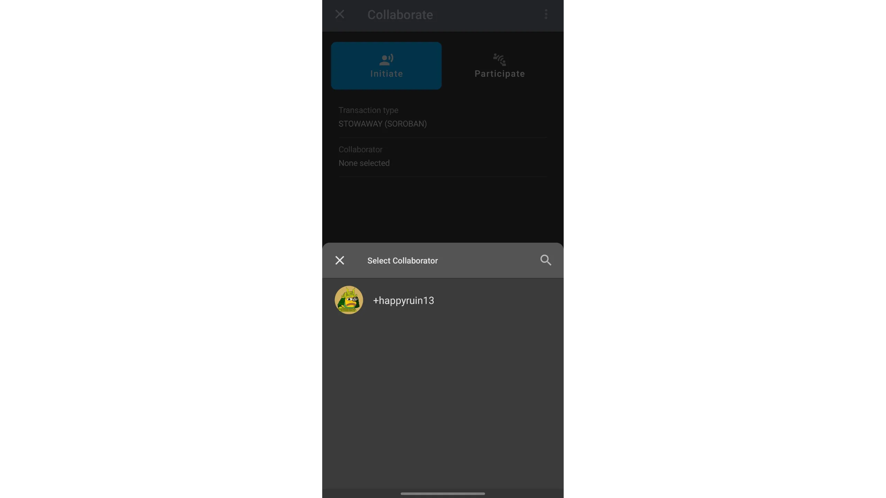

Кликнете върху `Създаване на транзакция`, след което изберете сметката, от която искате да направите разхода.

На следващата страница въведете данните за транзакцията: сумата, която трябва да се изпрати на получателя, и процента на таксуване. Не е необходимо да въвеждате адрес на получателя, тъй като получателят сам ще го предаде по време на обмена на PSBT.

След това кликнете върху `Преглед на настройките на транзакциите`.

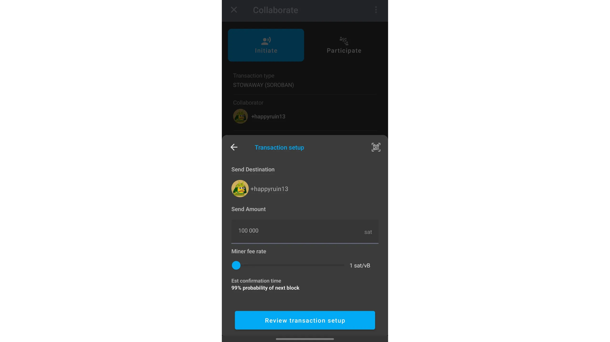

Проверете внимателно информацията, уверете се, че вашият сътрудник се вслушва в заявките *Cahoots*, след което кликнете върху зеления бутон `BEGIN TRANSACTION` (Започнете транзакция), за да започнете обмена на PSBT чрез Soroban.

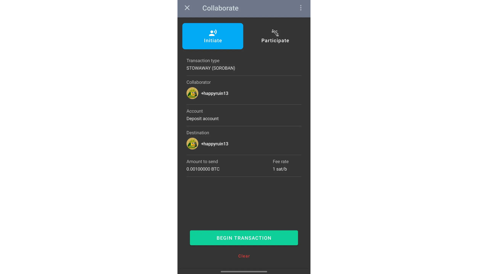

Изчакайте, докато и двамата участници подпишат транзакцията, след което я излъчете в мрежата Bitcoin.

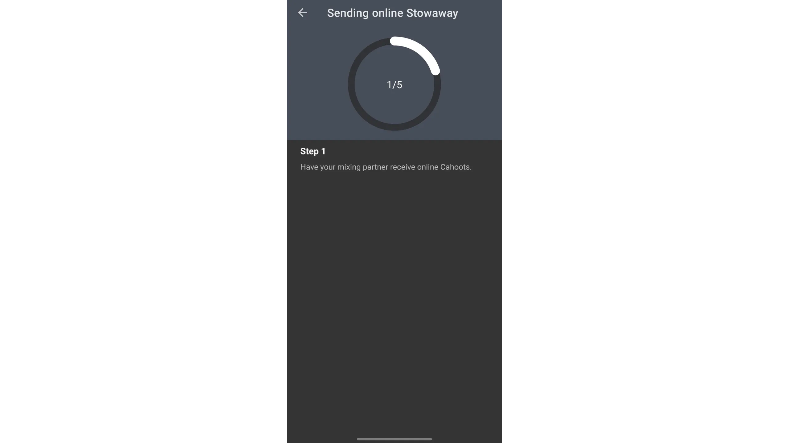

### Дискусии лице в лице

Ако желаете да извършите обмяната лично, изберете типа транзакция `STONEWALL X2`, след което изберете опцията `На място/ръчно`.

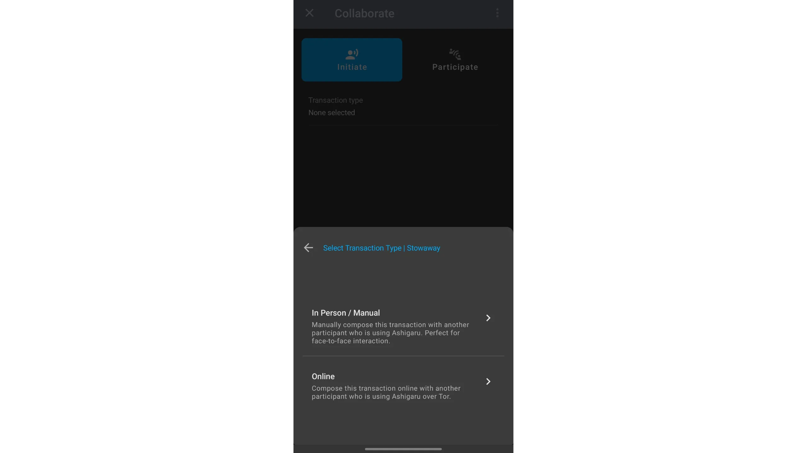

Кликнете върху `Създаване на транзакция`, след което изберете сметката, от която искате да направите разхода.

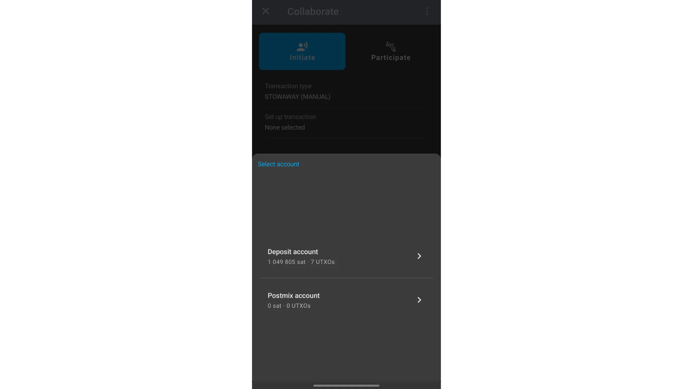

На следващата страница въведете данните за транзакцията: сумата, която трябва да се изпрати на получателя, и процента на таксуване. Не е необходимо да въвеждате адрес на получателя, тъй като получателят сам ще го предаде по време на обмена на PSBT.

След това кликнете върху `Преглед на настройките на транзакциите`.

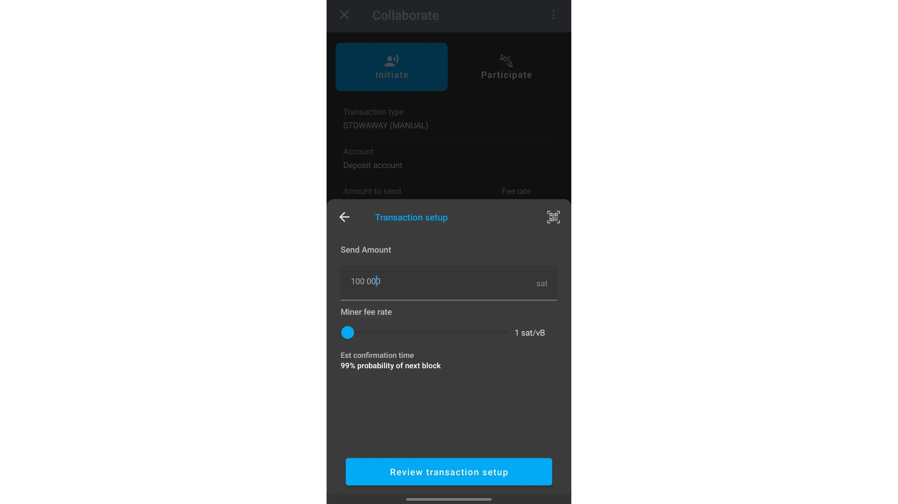

Проверете подробностите, след което натиснете зеления бутон "НАЧАЛО НА ТРАНЗАКЦИЯТА", за да започнете обмена на PSBT чрез сканиране на QR код.

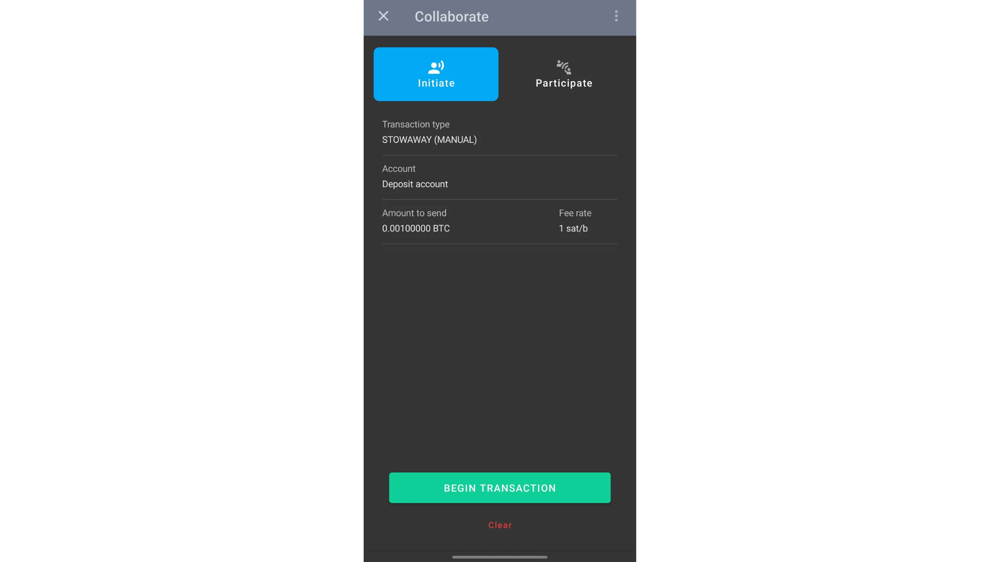

Обменът се извършва чрез редуване на сканирането със сътрудника: щракнете върху `ПОКАЖИ QR КОД`, за да покажете своя QR код на сътрудника, който ще го сканира. След това той ще щракне върху `ПОКАЖИ QR КОД`, за да покаже своя, а вие ще го сканирате с `ИЗПЪЛНИ QR скенер`. Повтаряйте този процес, докато завършите всичките пет стъпки на обмена.

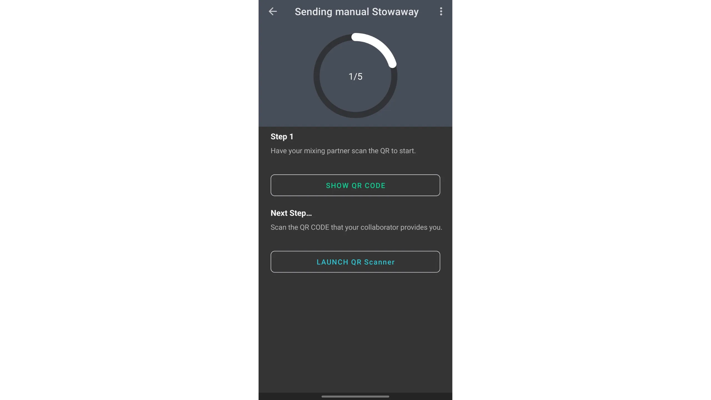

След като всички обмени са завършени, проверете подробностите за транзакцията, след което я освободете, като плъзнете зелената стрелка в долната част на екрана.

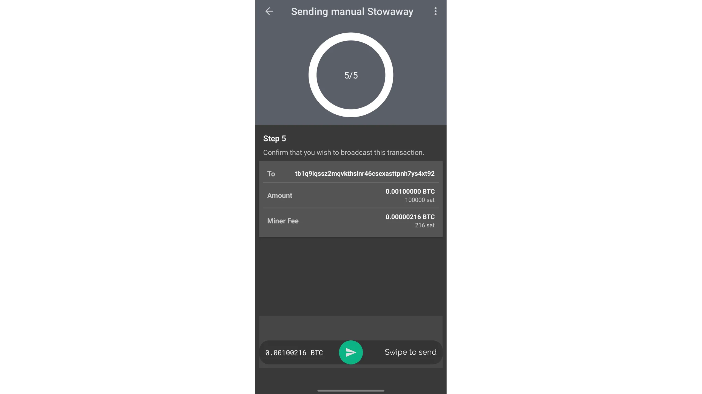

[The transaction has been published](https://mempool.space/testnet4/tx/82efd3700bba87b0f172e9cc045e441b38622c95a60df9f39a21f63eb4590a96). Нейната структура е следната:

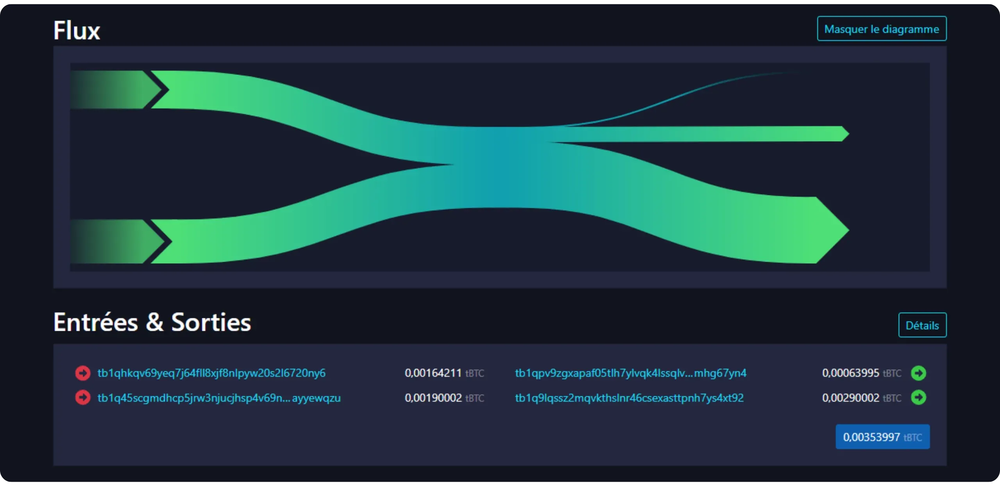

*Кредит: [mempool.space](https://mempool.space/)*

Ако анализираме тази транзакция, ще видим моя UTXO в размер на `164,211 sats` на входа, както и UTXO в размер на `190,002 sats`, принадлежащ на действителния получател на плащането. На изхода аз получавам разменна сума UTXO в размер на `63 995 sats`, а получателят получава UTXO в размер на `290 002 sats`. Сравнявайки входящите и изходящите ресурси, виждаме, че получателят наистина е спечелил `100 000 sats`, което съответства на сумата на моето действително плащане, и че аз съм загубил `100 000 sats`, към които съм добавил разходите mining.

Очевидно е, че мога да опиша тази структура, тъй като сам изградих транзакцията. Но за външния наблюдател обикновено е невъзможно да определи кои UTXO принадлежат на кой участник - на входа или на изхода.

За да задълбочите знанията си за управлението на поверителността на веригата Bitcoin, ви препоръчвам да преминете обучението ми по BTC 204 на Plan ₿ Academy :

https://planb.academy/courses/65c138b0-4161-4958-bbe3-c12916bc959c