Ashigaru Terminal je adaptace Sparrow Serveru od týmu Ashigaru, která implementuje protokol Whirlpool coinjoin. Tento software navazuje na práci započatou v projektu Samourai Wallet, zejména na grafickém uživatelském rozhraní Whirlpool, jehož základní principy přejímá: samospoušť a zachování důvěrnosti.


Tento software je fork serveru Sparrow, upravený a optimalizovaný pro plnou integraci s ekosystémem Whirlpool, protokolem ZeroLink coinjoin, který původně vyvinuly týmy Samourai.


Ashigaru Terminal pracuje s minimalistickým rozhraním TUI a může být nasazen na osobním počítači nebo na vyhrazeném serveru. Umožňuje vám přímou interakci s Whirlpool pro zahájení "*Tx0*", správu účtů "*Deposit*", "*Premix*", "*Postmix*" a "*Badbank*" a provádění automatických remixů pro posílení důvěrnosti vašich dílů.


Stručně řečeno, Ashigaru Terminal bude užitečný zejména tehdy, pokud chcete vytvářet coinjoiny pomocí Whirlpool.


V tomto prvním tutoriálu vás seznámím s instalací a ovládáním terminálu Ashigaru. Druhý, pokročilejší tutoriál pak bude věnován samotnému vytváření coinjoinů.


https://planb.academy/tutorials/privacy/on-chain/ashigaru-whirlpool-e566803d-ab3f-4d98-9136-5462009262ef

## 1. Instalace terminálu Ashigaru


K instalaci terminálu Ashigaru budete potřebovat prohlížeč Tor Browser, protože binární soubory jsou distribuovány pouze prostřednictvím sítě Tor. Pokud jste tak ještě neučinili, [nainstalujte jej do svého počítače](https://www.torproject.org/download/).


### 1.1. stáhnout Ashigaru Terminal


V prohlížeči Tor Browser přejděte na [stránku s verzemi jejich úložiště Git](http://ashicodepbnpvslzsl2bz7l2pwrjvajgumgac423pp3y2deprbnzz7id.onion/Ashigaru/Ashigaru-Terminal/releases/) a stáhněte si nejnovější verzi terminálu Ashigaru pro svůj operační systém.


```txt
ashicodepbnpvslzsl2bz7l2pwrjvajgumgac423pp3y2deprbnzz7id.onion/Ashigaru/Ashigaru-Terminal/releases/
```


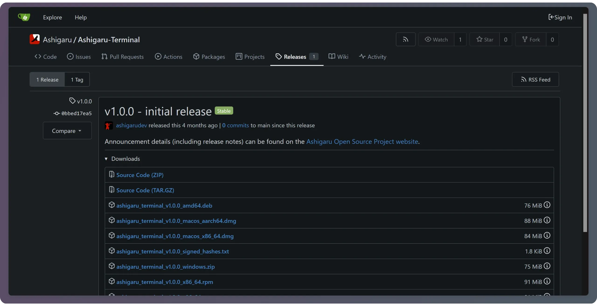


Stáhněte si následující 2 soubory pro svůj operační systém:


- Binární soubor (`ashigaru_terminal_v1.0.0_amd64.deb` pro Debian/Ubuntu, `.dmg` pro macOS nebo `.zip` pro Windows) ;
- Podepsaný soubor hashe: `ashigaru_terminal_v1.0.0_signed_hashes.txt`.


### 1.2. Zkontrolujte terminál Ashigaru


Před spuštěním softwaru v zařízení je třeba zkontrolovat jeho pravost a integritu. Jedná se o důležitý krok, protože zabrání instalaci podvodné verze, která by mohla ohrozit vaše bitcoiny nebo infikovat váš počítač.


Otevřete novou kartu prohlížeče a přejděte na stránku [Keybase verification tool](https://keybase.io/verify). Vložte obsah souboru `.txt`, který jste právě stáhli, do příslušného pole a klikněte na tlačítko `Ověřit`.


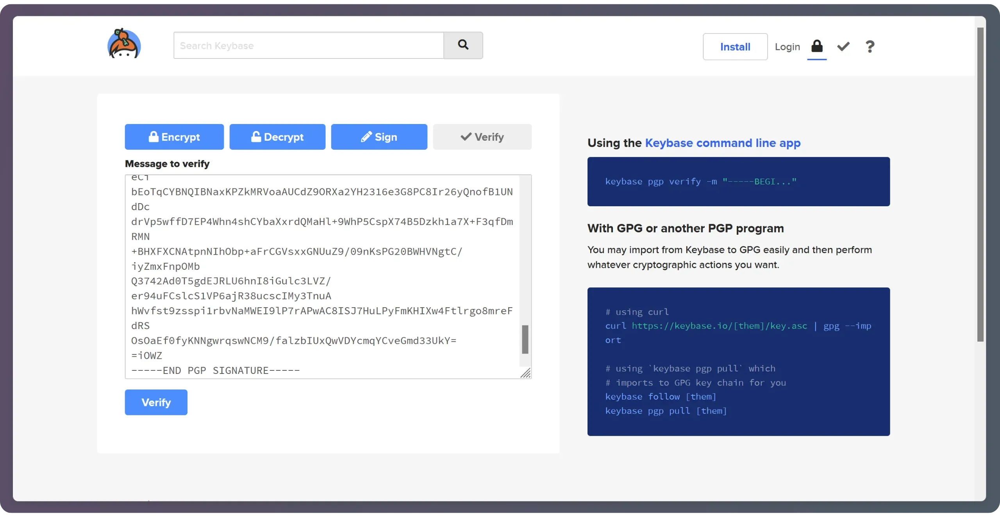


Pro zpestření zdrojů ověření můžete také porovnat zprávu s tou, která je k dispozici na stránkách clearnetu [ashigaru.rs](https://ashigaru.rs/download/) v sekci `/download`.


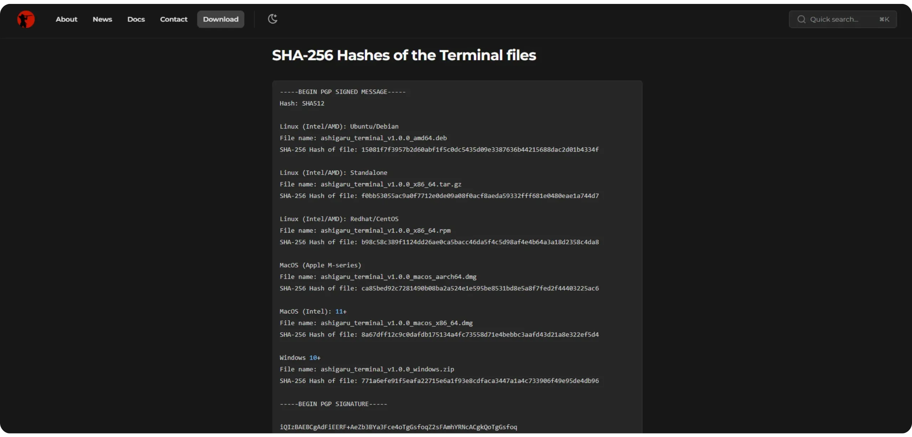


Pokud je podpis platný, zobrazí se zpráva potvrzující, že soubor byl podepsán vývojáři společnosti Ashigaru.


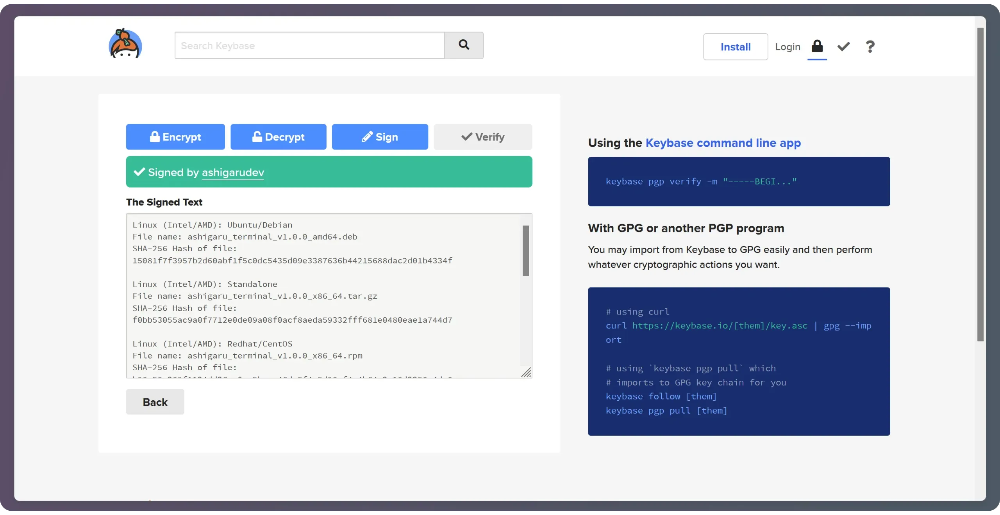


Můžete také kliknout na profil `ashigarudev` zobrazený v databázi Keybase a zkontrolovat, zda se otisk klíče přesně shoduje s profilem : `A138 06B1 FA2A 676B`.


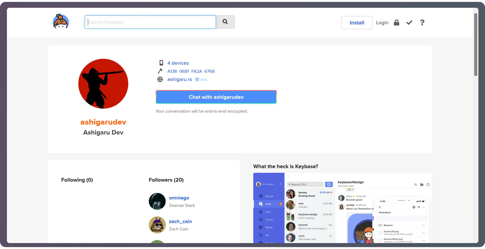


Pokud se v této fázi objeví chyba, je podpis neplatný. V takovém případě stažený software **neinstalujte**. Začněte znovu od začátku nebo před pokračováním požádejte komunitu o pomoc.


Keybase vám poskytla ověřený hash aplikace. Nyní zkontrolujeme, zda se hash souboru `.deb`, `.zip` nebo `.dmg`, který jste stáhli, shoduje s hashem ověřeným na Keybase. Za tímto účelem přejděte na stránku [HASH FILE ONLINE](https://hash-file.online/).


Klikněte na tlačítko `PROHLÉDNOUT...` a vyberte soubor `.deb`, `.zip` nebo `.dmg` stažený v kroku 1.1. Poté vyberte hashovací funkci `SHA-256` a kliknutím na `CALCULATE HASH` (vypočítat hash) vytvořte hash pro váš soubor.


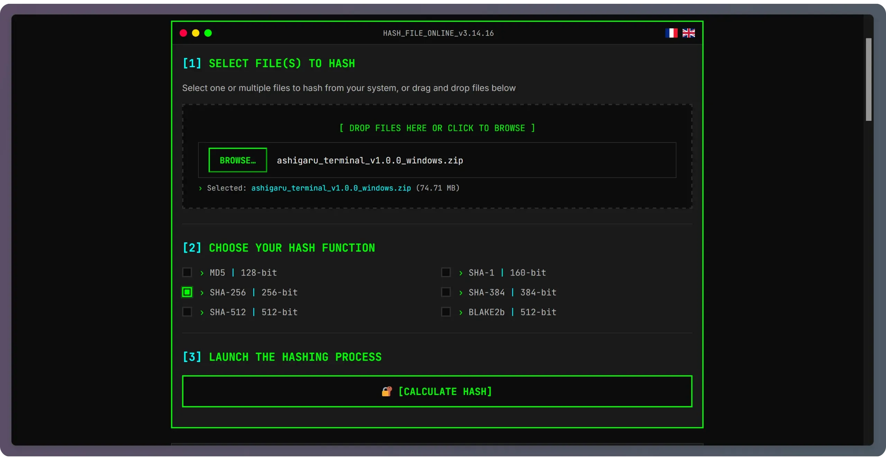


Na webu se poté zobrazí hash softwaru. Porovnejte jej s hashem, který jste ověřili na serveru Keybase.io. Pokud se oba dokonale shodují, kontrola pravosti a integrity proběhla úspěšně. Software pak můžete používat.


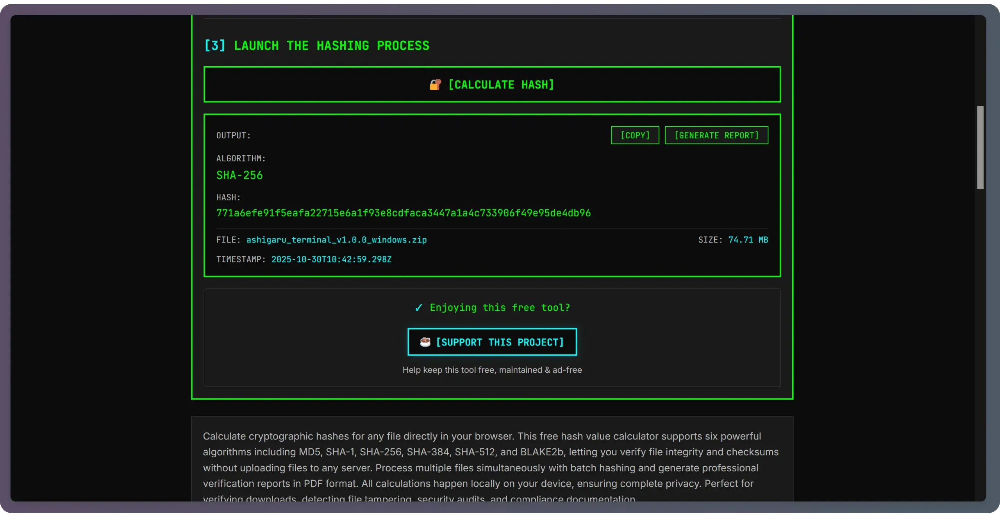


### 1.3 Spuštění terminálu Ashigaru


- Debian / Ubuntu


Chcete-li software nainstalovat, spusťte příkaz :


```bash
cd ~/Downloads
sudo apt install ./ashigaru_terminal_v1.0.0_amd64.deb
```


Upravte pořadí podle stažené verze.


Poté zkontrolujte instalaci:


```bash
/opt/ashigaru-terminal/bin/Ashigaru-terminal --version
```


Poté spusťte software:


```bash
/opt/ashigaru-terminal/bin/Ashigaru-terminal
```


- Windows**


Klikněte pravým tlačítkem myši na stažený a zkontrolovaný soubor `.zip` a výběrem možnosti `Extrahovat vše...` rozbalte jeho obsah.


Po dokončení extrakce dvakrát klikněte na soubor `Ashigaru-terminal.exe` a software se spustí.


## 2. Začínáme s terminálem Ashigaru


Ashigaru Terminal je program TUI (*Text-based User Interface*), tj. minimalistické rozhraní běžící přímo v terminálu. Interakce s ním probíhá pomocí nabídek a klávesových zkratek, ale bez skutečného klasického grafického prostředí.


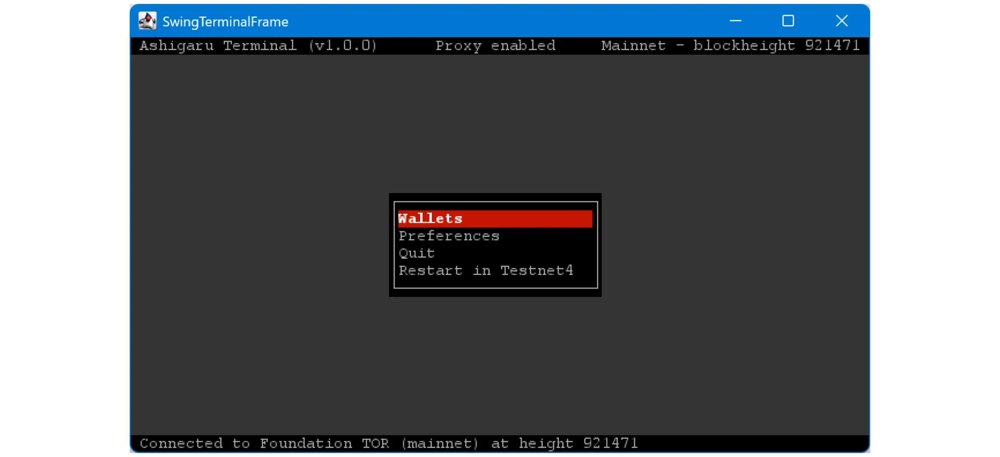


Používání je snadné: pomocí kláves se šipkami procházejte nabídkami a stisknutím klávesy `Enter` ověřte akci nebo potvrďte volbu.


## 3. Připojení uzlu k terminálu Ashigaru


Ve výchozím nastavení se Ashigaru Terminal připojuje k veřejnému serveru Electrum. To samozřejmě představuje riziko z hlediska důvěrnosti a suverenity. Proto jej nakonfigurujeme tak, aby se připojoval přímo k vašemu vlastnímu serveru Electrum Server.


Za tímto účelem otevřete nabídku `Předvolby > Server`.


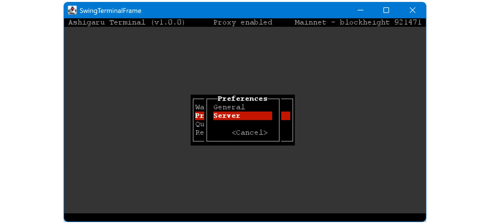


Klikněte na tlačítko `< Upravit >`.


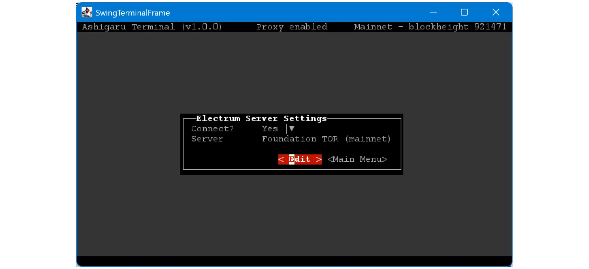


Vyberte možnost `Soukromý Electrum Server` a klikněte na tlačítko `<Pokračovat>`.


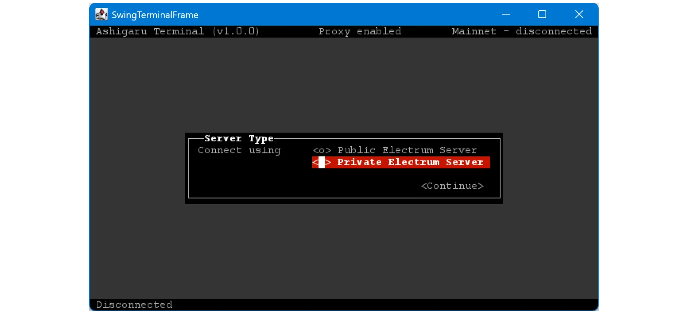


Zadejte adresu URL a port serveru. Adresu Tor můžete zadat ve tvaru `.onion`. Poté klikněte na `<Test >` pro ověření připojení.


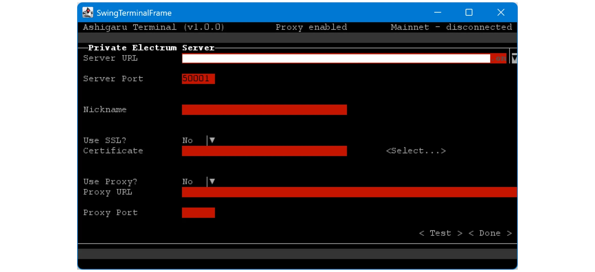


Pokud je připojení úspěšné, zobrazí se zpráva `Úspěch` spolu s údaji o serveru.


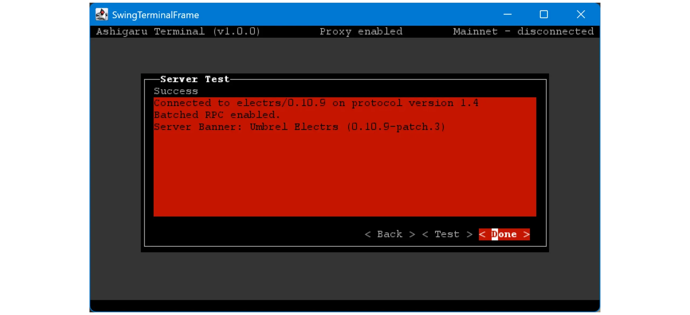


Pokud ještě nemáte uzel Bitcoin, doporučuji vám absolvovat tento kurz:


https://planb.academy/courses/3cd9cb94-82e8-417a-9c5a-02afc2589426

*V mém případě se pro tento návod odpojím od svého serveru Electrs, protože pracuji na testnetu. Na serveru mainnet však zůstává provoz zcela totožný.*


## 4. Vytvoření portfolia na terminálu Ashigaru


Nyní, když je software správně nakonfigurován, můžeme přidat portfolio Bitcoin.


Máte dvě možnosti:


- Můžete si vytvořit novou wallet od začátku a používat ji výhradně v terminálu Ashigaru. V takovém případě budete muset tento software otevřít pokaždé, když budete chtít s wallet komunikovat;
- Případně můžete importovat stávající aplikaci Ashigaru wallet přímo z telefonu do aplikace Ashigaru Terminal. Nevýhodou této metody je, že mírně snižuje bezpečnost vašeho nastavení, protože váš wallet je pak vystaven dvěma rizikovým prostředím namísto jednoho. Na druhou stranu nabízí tu výhodu, že můžete nechat Ashigaru Terminal nepřetržitě spuštěný a míchat své mince, přičemž je můžete utrácet na dálku prostřednictvím mobilní aplikace Ashigaru.


V tomto návodu se rozhodneme pro druhou metodu. Pokud však dáváte přednost vytvoření zcela nového portfolia, postup zůstává stejný: jediný rozdíl bude při vytváření, kdy budete muset uložit novou mnemotechnickou frázi a nový passphrase.


Všimněte si také, že Ashigaru Terminal neumožňuje přímo utrácet vaše bitcoiny. Můžete buď synchronizovat stejnou peněženku na Ashigaru Terminal a v aplikaci Ashigaru (což udělám v tomto tutoriálu), nebo ve Sparrow Wallet.


Pokud ještě nemáte wallet v aplikaci Ashigaru, můžete se podívat na speciální výukový program :


https://planb.academy/tutorials/wallet/mobile/ashigaru-9f903b55-2e55-4b06-9627-80f8e178158f

Přejděte do nabídky `Peněženky`.


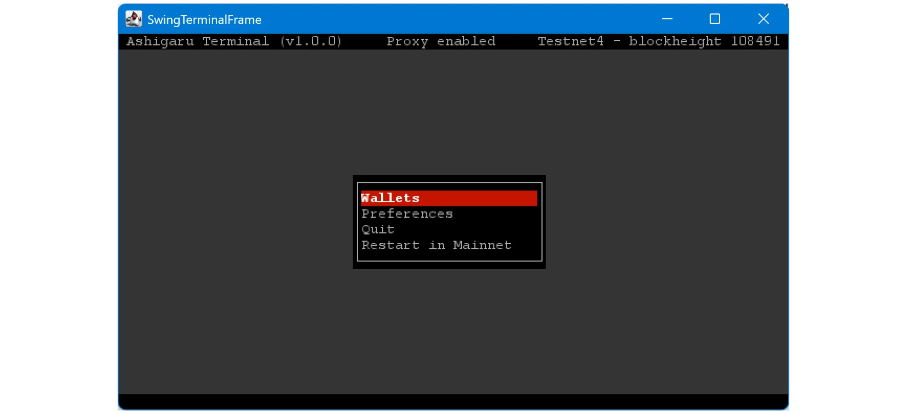


Poté vyberte možnost `Vytvořit / obnovit wallet...`. Volba `Otevřít Wallet...` umožňuje pozdější přístup k portfoliu již uloženému v terminálu Ashigaru.


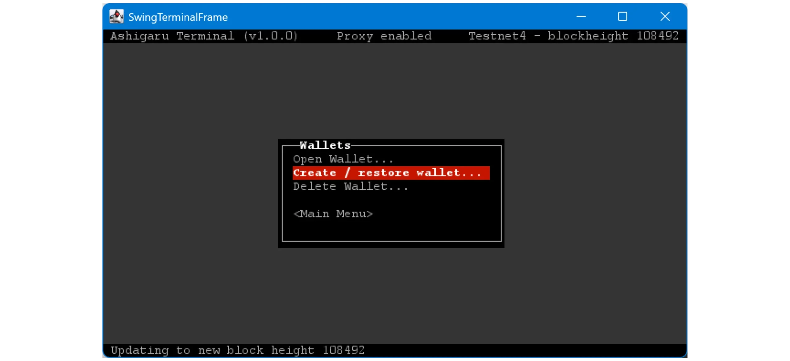


Pojmenujte své portfolio.


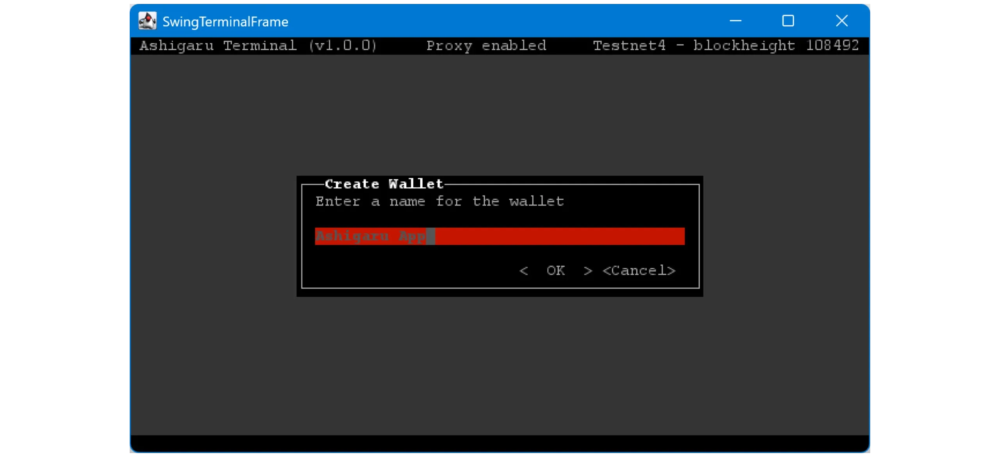


Poté vyberte typ portfolia `Hot Wallet`.


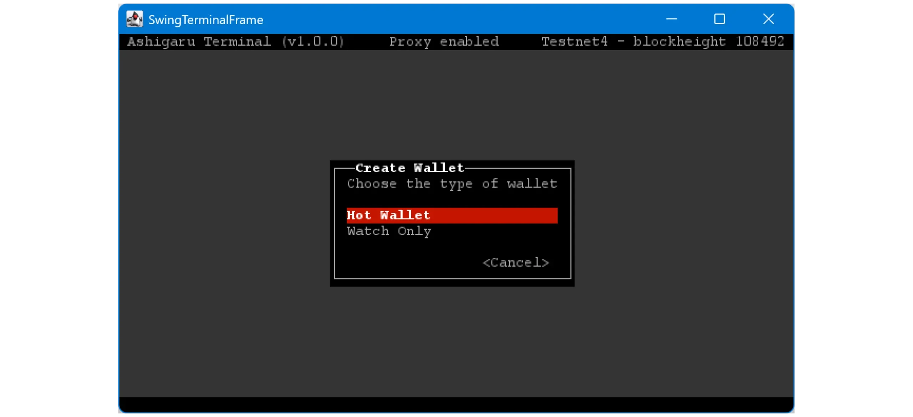


V této fázi se postup liší v závislosti na vaší původní volbě:


- Chcete-li vytvořit nové portfolio od začátku, klikněte na `<Generate New Wallet>`, definujte passphrase BIP39 a poté pečlivě uložte svou mnemotechnickou frázi a svůj passphrase na fyzické médium ;


https://planb.academy/tutorials/wallet/backup/backup-mnemonic-22c0ddfa-fb9f-4e3a-96f9-46e2a7954270


- Chcete-li použít stejný kód wallet jako aplikace Ashigaru, zadejte 12 slov mnemotechnické fráze a kód passphrase BIP39 přímo do příslušných polí. Slova pište malými písmeny, celá, v pořadí, oddělená mezerou, bez čísel a dalších znaků.


Po dokončení tohoto kroku klikněte na tlačítko `< Další >`.


*Poznámka*: Pokud na toto tlačítko nemůžete kliknout, je vaše mnemotechnická fráze neplatná. Pečlivě zkontrolujte, zda žádné ze slov není nesprávné nebo špatně napsané.


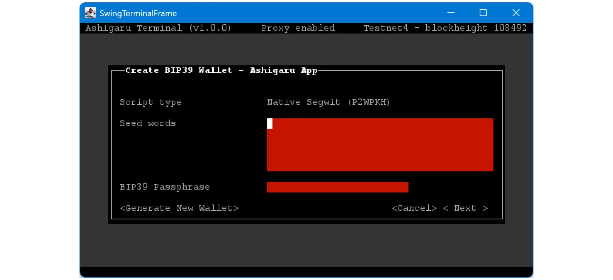


Poté je třeba nastavit heslo. To bude sloužit k odemknutí vašeho terminálu Ashigaru wallet a k jeho ochraně před neoprávněným fyzickým přístupem. Neúčastní se kryptografického odvozování vašich klíčů: jinými slovy, i bez tohoto hesla bude moci kdokoli s vaší mnemotechnickou frází a passphrase obnovit váš wallet a získat přístup k vašim bitcoinům.


Zvolte dlouhé, složité a náhodné heslo. Kopii hesla si uložte na bezpečném místě: nejlépe na fyzickém médiu nebo v bezpečném správci hesel.


Po dokončení klikněte na tlačítko `< OK >`.


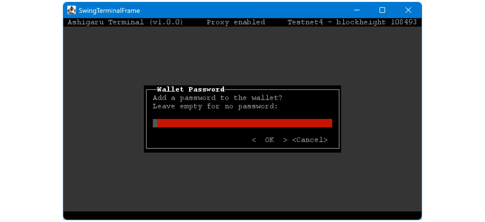


## 5. Používání portfolia


Poté si můžete vybrat, ke kterému účtu chcete přistupovat. V tuto chvíli jsme nezahájili žádné směsi, takže budeme přistupovat k účtu `Vklad`.


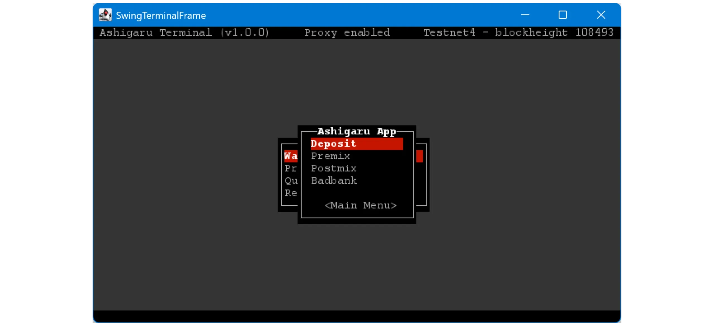


Provoz je pak totožný s provozem Sparrow, protože terminál Ashigaru je fork serveru Sparrow. Najdete zde stejné nabídky:


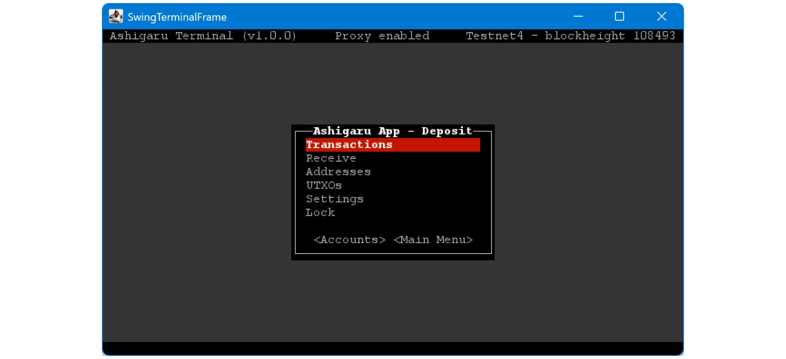


- transakce": umožňuje nahlížet do historie transakcí spojených s tímto účtem. V mém případě se některé z nich již objevily, protože jsem některé provedl pomocí aplikace Ashigaru na tomtéž wallet.


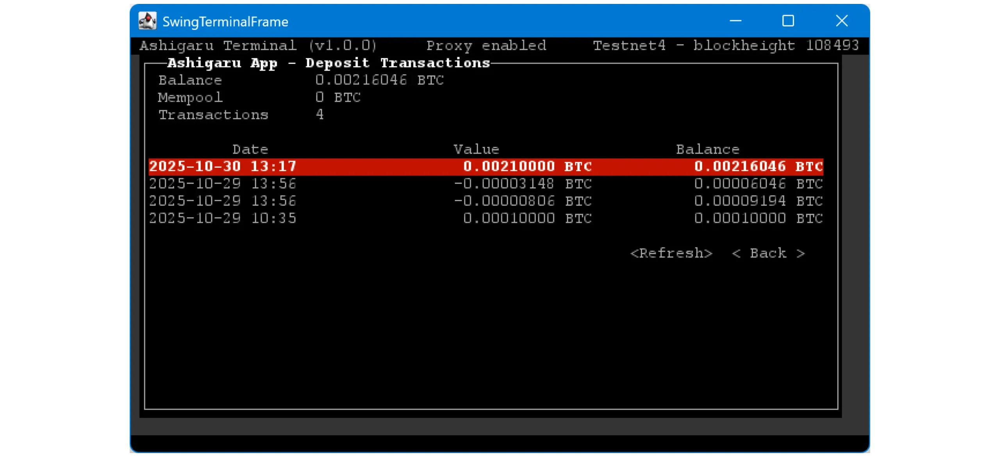


- receive`: vygeneruje novou, prázdnou adresu účtenky pro vložení satss na vkladový účet.


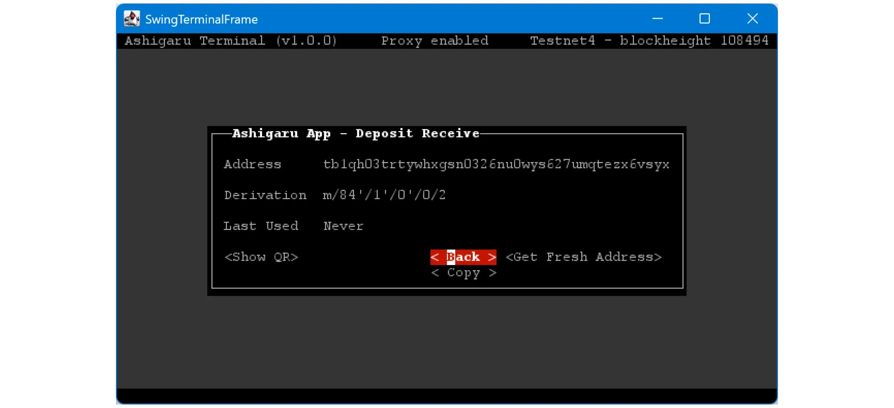


- addresses`: zobrazí seznam všech vašich adres, ať už patří do interního nebo externího řetězce vašeho účtu.


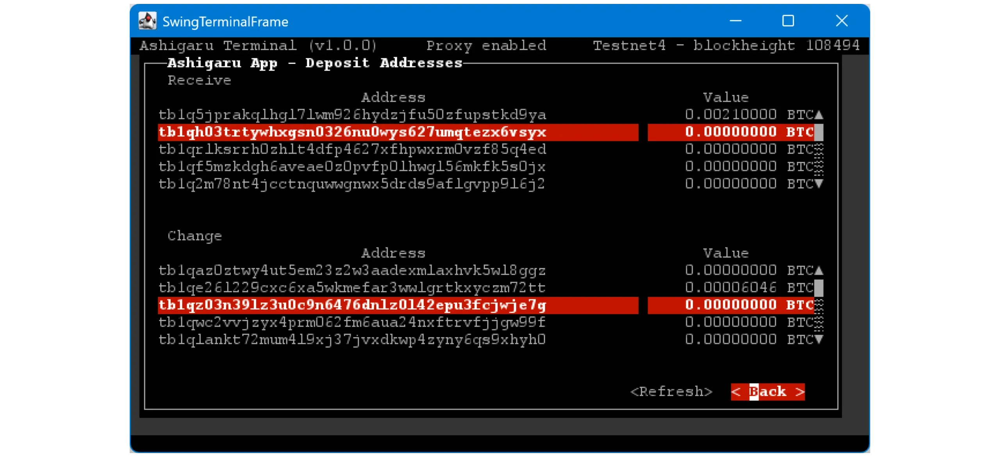


- `UTXOs`: zobrazí seznam všech dostupných UTXOs.


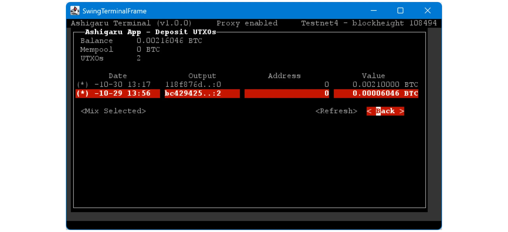


- `Nastavení`: umožňuje přístup k *deskriptoru* vašeho portfolia. Můžete také nahlédnout do svého seed, upravit *Gap Limit* nebo změnit datum vytvoření portfolia.


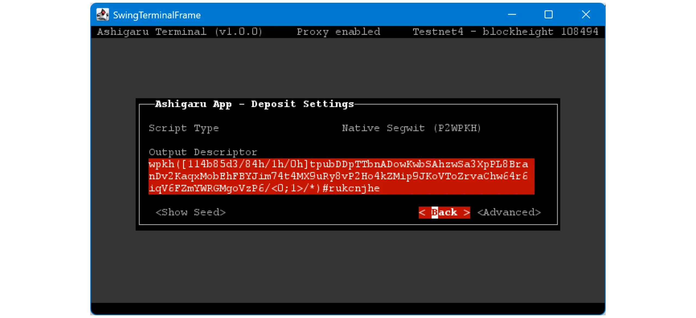


Nyní už víte, jak nainstalovat a používat Ashigaru Terminal. V dalším tutoriálu si ukážeme, jak provádět coinjoiny pomocí tohoto softwaru a jak spravovat prostředky v "*Postmix*".
https://planb.academy/tutorials/privacy/on-chain/ashigaru-whirlpool-e566803d-ab3f-4d98-9136-5462009262ef
