"*ein Bitcoin-wallet für die Straße*"

In diesem Tutorial erfahren Sie, was ein Coinjoin ist und wie Sie einen solchen mit der Ashigaru-Terminal-Anwendung und der Whirlpool-Implementierung, einem von Samourai Wallet geerbten Coinjoin-Protokoll, erstellen können.

## Die Funktionsweise der Whirlpool-Koinjoints

In diesem Tutorium werde ich nicht noch einmal auf den Begriff des Coinjoin, seine Nützlichkeit oder die theoretische Funktionsweise von Whirlpool eingehen, da diese Themen bereits in Teil 5 des BTC 204-Schulungskurses auf der Plan ₿ Academy ausführlich erläutert werden. Wenn Sie die Funktionsweise von Whirlpool oder das Prinzip des Coinjoin noch nicht beherrschen, empfehle ich Ihnen dringend, diesen Teil 5 zu konsultieren, bevor Sie fortfahren:

https://planb.academy/courses/65c138b0-4161-4958-bbe3-c12916bc959c

Im Folgenden finden Sie jedoch einige Zahlen und Fakten, die für Sie nützlich sein könnten.

Whirlpool-kompatible Portfolios verwenden 4 separate Konten, um den Anforderungen des Coinjoin-Prozesses gerecht zu werden:

- Das **Einlagenkonto**, gekennzeichnet durch den Index "0";
- Das Konto **Bad Bank** (oder *doxxic exchange*), gekennzeichnet durch den Index `2.147.483.644'` ;
- Das Konto **Premix**, gekennzeichnet durch den Index "2 147 483 645";
- Das **Postmix**-Konto, gekennzeichnet durch den Index "2 147 483 646".

Auf Ashigaru stehen im November 2025 zwei Pools zur Verfügung (diese Liste wird sich in den kommenden Monaten wahrscheinlich noch ändern: Denken Sie also daran, die Werte beim Lesen zu überprüfen):

- 0.25 BTC", mit einer Teilnahmegebühr von "0,0125 BTC";
- 0.025 BTC, mit einer Teilnahmegebühr von 0,00125 BTC.

Jeder Mischzyklus kann zwischen 5 und 10 UTXOs am Eingang und am Ausgang umfassen.

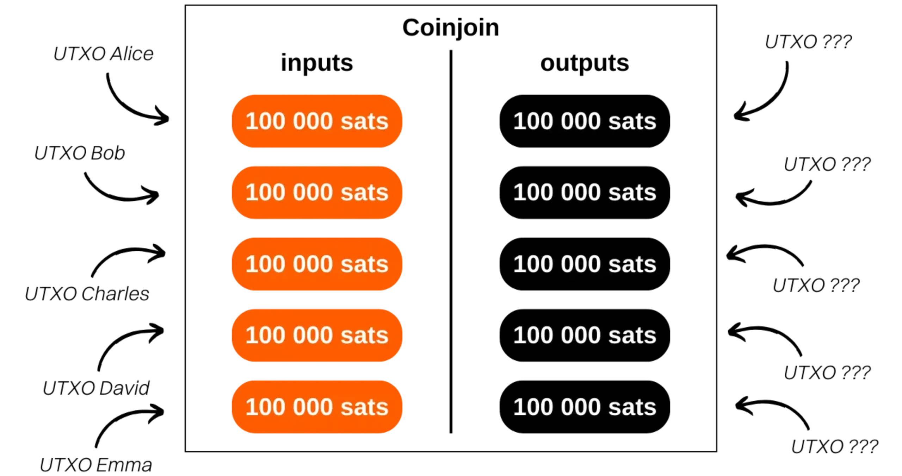

## Anforderungen an die Software

Um Coinjoins mit Whirlpool zu erstellen, benötigen Sie drei separate Programme:

- Ashigaru Terminal**, mit dem Sie Ihre Coinjoins direkt von Ihrem Computer aus verwalten können;

https://planb.academy/tutorials/privacy/on-chain/ashigaru-terminal-9a0d46d3-33b9-4c64-84c5-bfa25b3a0add

- Ashigaru Wallet**, die Anwendung auf Ihrem Smartphone, mit der Sie Ihre Bitcoins in *postmix* von überall aus ausgeben können;

https://planb.academy/tutorials/wallet/mobile/ashigaru-9f903b55-2e55-4b06-9627-80f8e178158f

- Dojo**, eine Bitcoin-Knotenimplementierung, die Ihnen eine souveräne Verbindung zum Netz garantiert, ohne dass Sie von einem Server eines Drittanbieters abhängig sind.

https://planb.academy/tutorials/node/bitcoin/dojo-aa818a21-e701-48a2-8421-63c6186ed23f

Installieren Sie jedes dieser Tools, indem Sie die entsprechenden Anleitungen befolgen, und beginnen Sie dann mit der Erstellung Ihrer ersten Coinjoins.

## Bitcoins erhalten

Nachdem Sie Ihr Portfolio erstellt haben, beginnen Sie mit einem einzigen Konto, das mit dem Index "0" gekennzeichnet ist. Dies ist das Konto "Einzahlung". Auf dieses Konto werden Sie die Bitcoins für Coinjoins senden. Sie können sie entweder über die Ashigaru-Anwendung (siehe Teil 5 des entsprechenden Tutorials) oder über das Ashigaru-Terminal (ebenfalls in Teil 5 des entsprechenden Tutorials) empfangen.

Sobald sich auf Ihrem Konto mindestens der Betrag befindet, der für die Teilnahme am kleinsten Pool erforderlich ist (zuzüglich der Servicegebühren und des Mindestbetrags, der zur Deckung der mining-Kosten erforderlich ist), können Sie Ihre ersten Coinjoins starten.

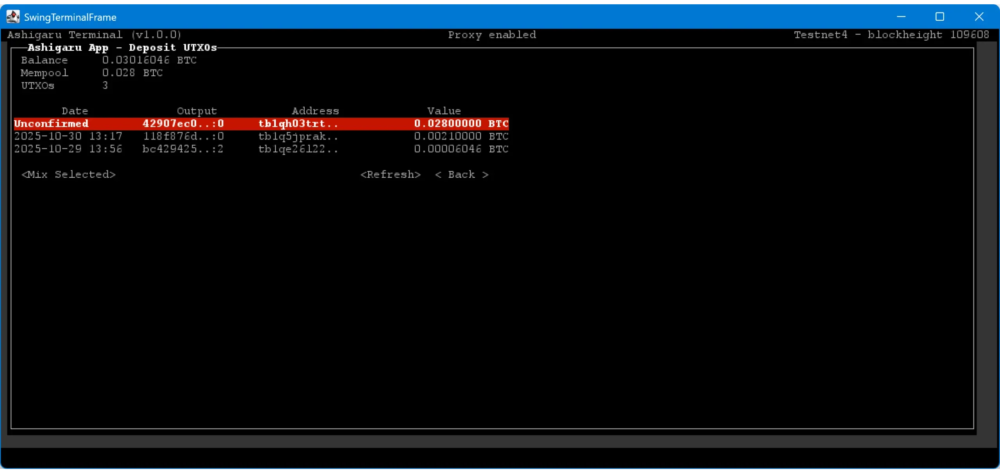

## Machen Sie die Tx0

Sobald das Geld auf Ihrem Einzahlungskonto eingegangen ist und die Transaktion bestätigt wurde, können Sie den Coinjoin-Prozess starten. Öffnen Sie dazu im Ashigaru-Terminal das Menü "Geldbörsen" und wählen Sie Ihren wallet. Wenn Ihr wallet gesperrt ist, fragt die Software Sie nach Ihrem Passwort und passphrase.

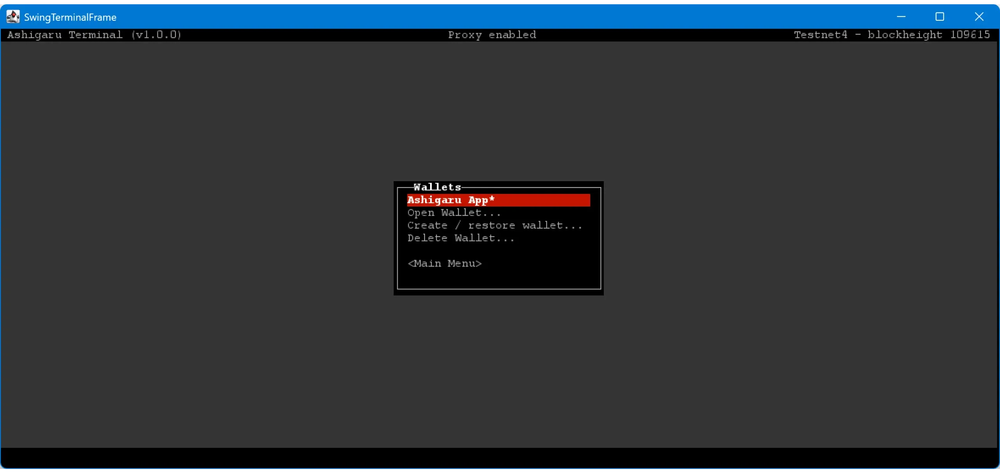

Wählen Sie dann das Konto "Einzahlung".

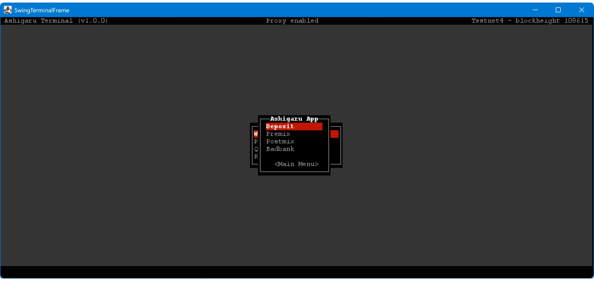

Rufen Sie das Menü "UTXOs" auf.

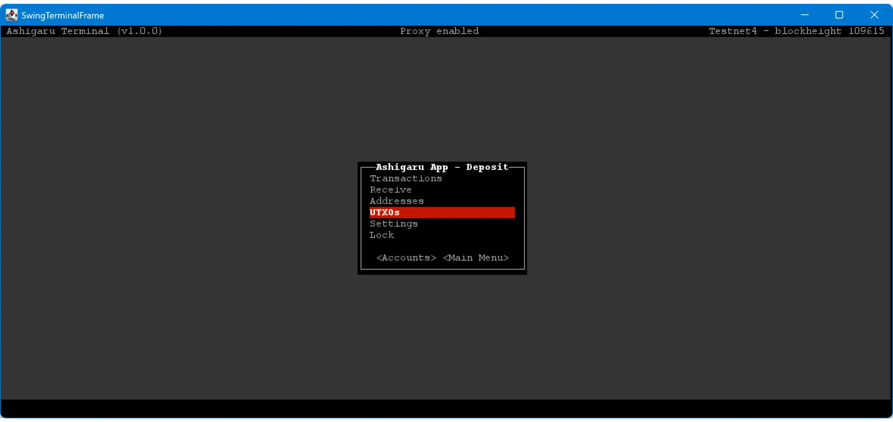

Hier sehen Sie eine Liste aller UTXOs, die sich auf Ihrem Depotkonto befinden. Wählen Sie diejenigen aus, die Sie in den Coinjoin-Zyklen versenden möchten.

Um die Vertraulichkeit zu erhöhen und die *Common Input Ownership Heuristik (CIOH)* zu vermeiden, wird empfohlen, nur einen UTXO pro Eingang in Whirlpool zu verwenden (eine ausführliche Erläuterung dieses Prinzips findet sich in BTC 204).

Drücken Sie die Taste `ENTER` auf Ihrer Tastatur, um einen UTXO auszuwählen: ein Sternchen `(*)` erscheint daneben, um anzuzeigen, dass er ausgewählt ist.

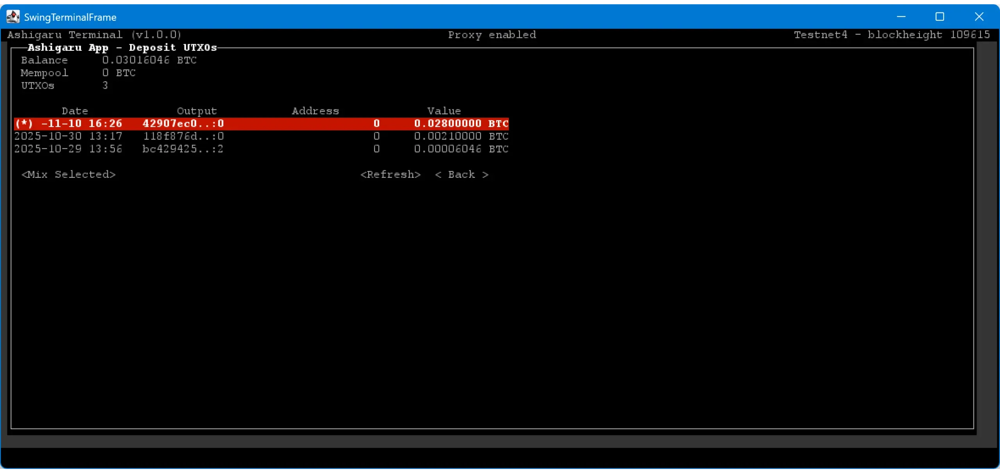

Klicken Sie dann auf die Schaltfläche "Ausgewählte mischen".

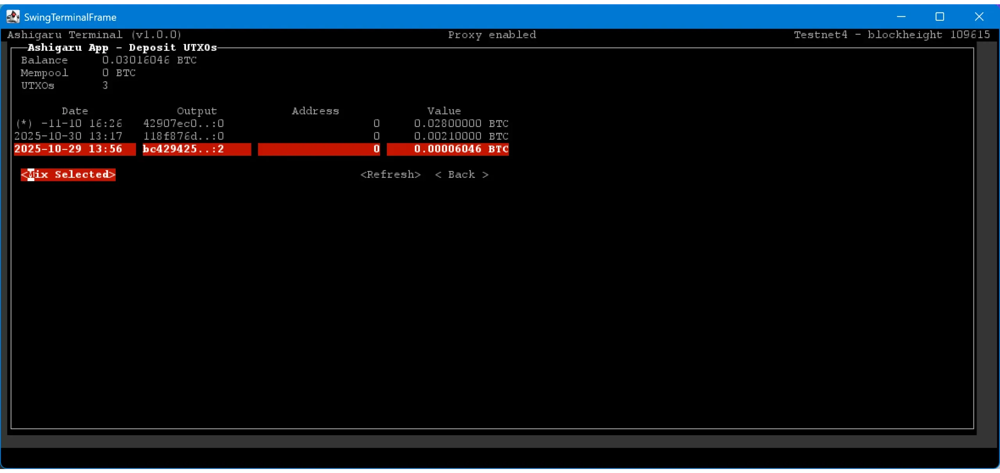

Wenn Sie ein UTXO haben, das groß genug ist, um an einem der beiden verfügbaren Pools teilzunehmen, können Sie den Zielpool mit den Pfeilen auswählen. Auf dieser Seite sehen Sie die Details zu Ihrem Tx0:

- die Anzahl der UTXOs, die dem Pool zugeführt werden;
- die verschiedenen erhobenen Gebühren (Dienstleistungsgebühren und mining-Gebühren) ;
- die Höhe der *doxxischen Veränderung*.

Prüfen Sie die Informationen sorgfältig und klicken Sie dann auf "Broadcast", um die Tx0 zu senden.

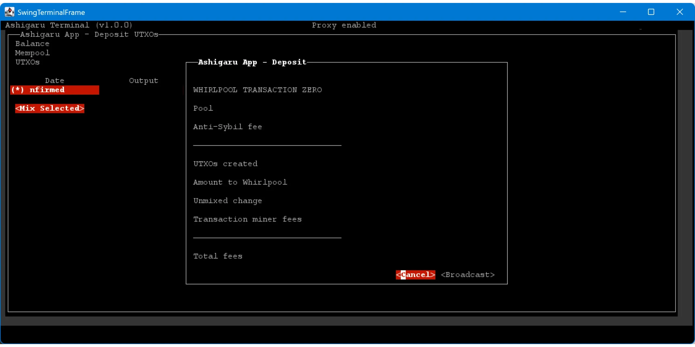

Ashigaru zeigt dann die TXID Ihres Tx0 an und bestätigt damit, dass die Transaktion im Netz übertragen wurde.

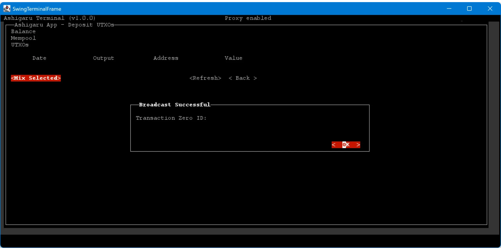

## Coinjoins herstellen

Sobald die Tx0 gesendet wurde, kehren Sie zur Startseite Ihres Einlagenkontos zurück, klicken Sie auf "Konten" und wählen Sie das "Premix"-Konto aus.

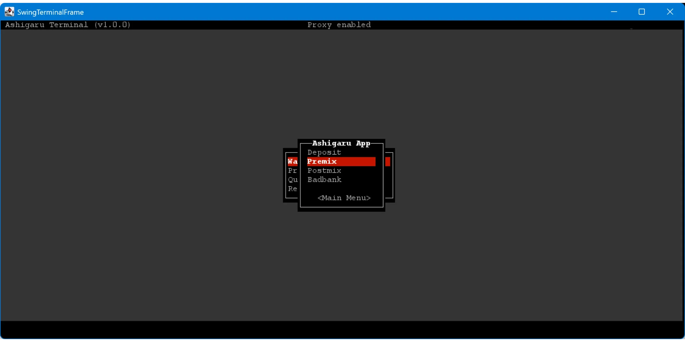

Im Menü "UTXOs" sehen Sie die verschiedenen ausgeglichenen Teile, die bereit sind, in die Coinjoin-Zyklen einzutreten. Sobald Tx0 bestätigt ist, wird Ashigaru Terminal automatisch den ersten Mischzyklus starten.

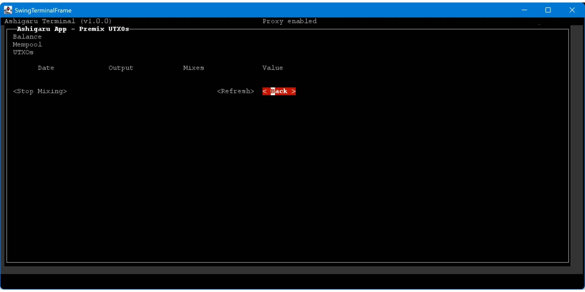

Sobald der Tx0 bestätigt wurde, wird die erste Coinjoin-Transaktion erstellt und automatisch von Ashigaru Terminal übertragen. Wenn Sie zu "Konten > Postmix > UTXOs" gehen, können Sie Ihre ausgeglichenen UTXOs sehen, die auf die Bestätigung ihres ersten Zyklus warten.

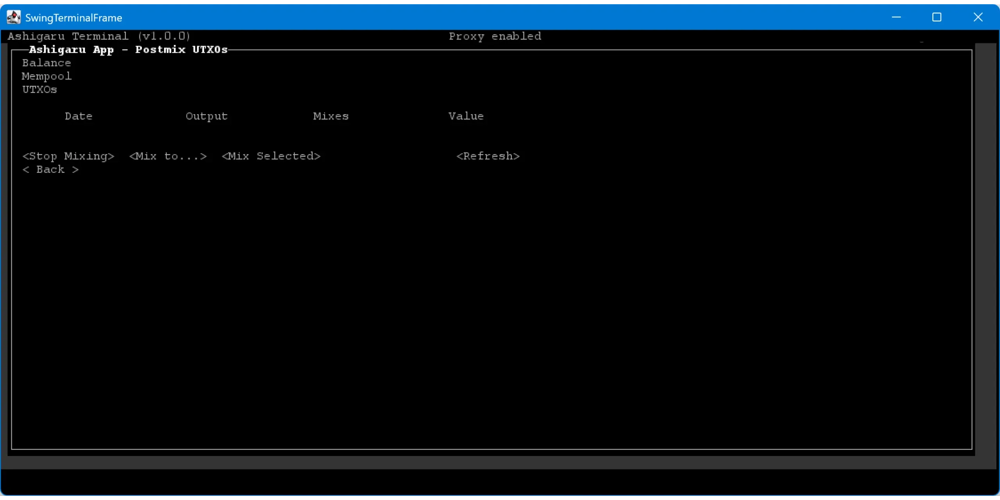

Sie können Ashigaru Terminal jetzt im Hintergrund laufen lassen: Es mischt und remixt Ihre Tracks automatisch weiter.

## Endbearbeitung von Coinjoints

Jetzt können Sie Ihre Münzen automatisch neu mischen lassen. Das Whirlpool-Modell bedeutet, dass für das Remixing keine zusätzlichen Gebühren anfallen: keine Servicegebühren, keine mining-Gebühren. Wenn Sie also Ihre Münzen an mehr Mischzyklen teilnehmen lassen, kann dies Ihrer Vertraulichkeit nur zugute kommen.

Zum besseren Verständnis dieses Mechanismus und der Frage, wie viele Zyklen es sich lohnt, darauf zu warten, empfehle ich diesen Artikel:

https://planb.academy/tutorials/privacy/analysis/remix-whirlpool-2b887bd9-8a6a-4dca-8aa9-a1c33682b0aa

Um die Anzahl der Remixe für jedes deiner Stücke zu sehen, öffne das Menü "UTXOs" im "Postmix"-Konto.

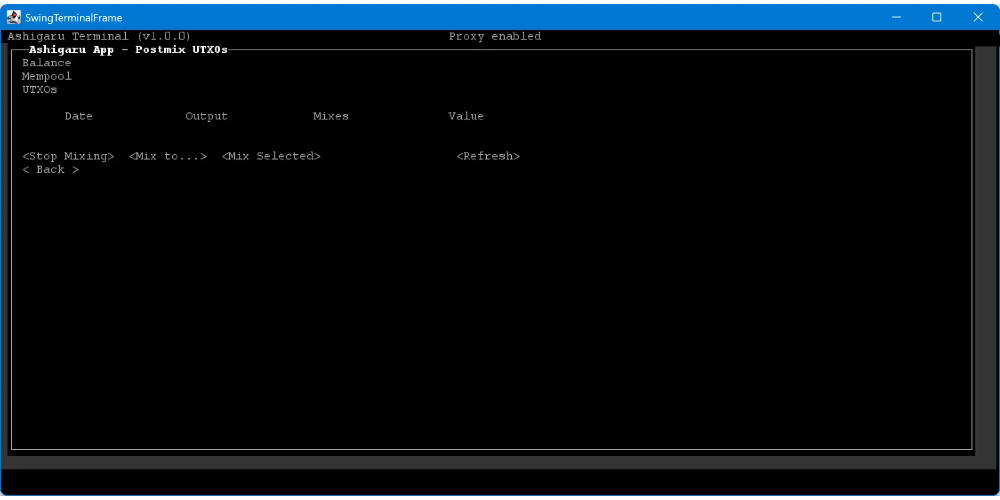

Um Ihre gemischten Münzen auszugeben, rufen Sie die Ashigaru-Anwendung auf, die dasselbe wallet verwendet wie Ihre Ashigaru-Terminal-Software. Das wallet, das beim Öffnen angezeigt wird, entspricht Ihrem "Deposit"-Konto. Um auf das "Postmix"-Konto zuzugreifen, das Ihre gemischten UTXOs enthält, klicken Sie auf das Whirlpool-Symbol in der oberen rechten Ecke.

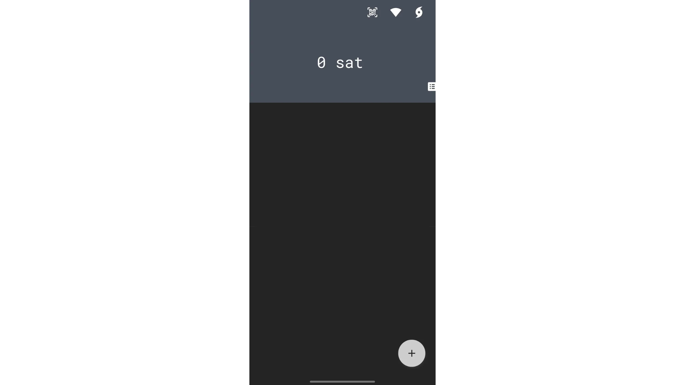

In diesem Konto sehen Sie alle Ihre Münzen, die derzeit gemischt werden. Um sie auszugeben, drückst du das "+"-Symbol unten rechts auf dem Bildschirm und wählst dann "Senden".

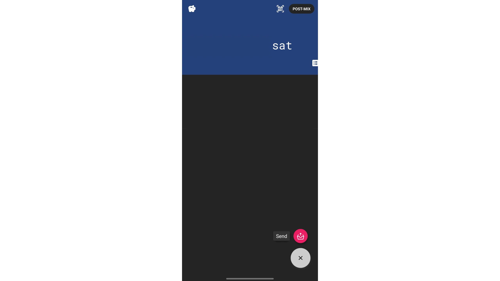

Geben Sie die Details Ihrer Transaktion ein: die Adresse des Empfängers, den zu überweisenden Betrag und, wenn Sie möchten, eine spezielle Transaktionsstruktur, um Ihre Vertraulichkeit zu erhöhen (siehe die entsprechenden Anleitungen).

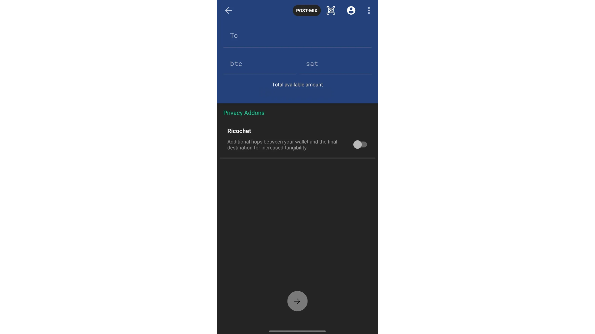

Überprüfen Sie sorgfältig die Transaktionsdetails und ziehen Sie dann den Pfeil am unteren Rand des Bildschirms, um die Sendung zu bestätigen.

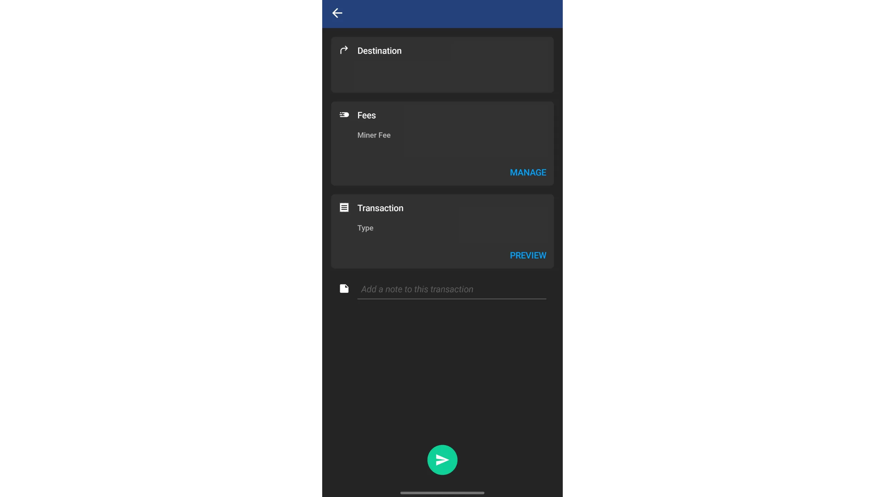

Ihre Transaktion wurde unterzeichnet und im Bitcoin-Netz übertragen.

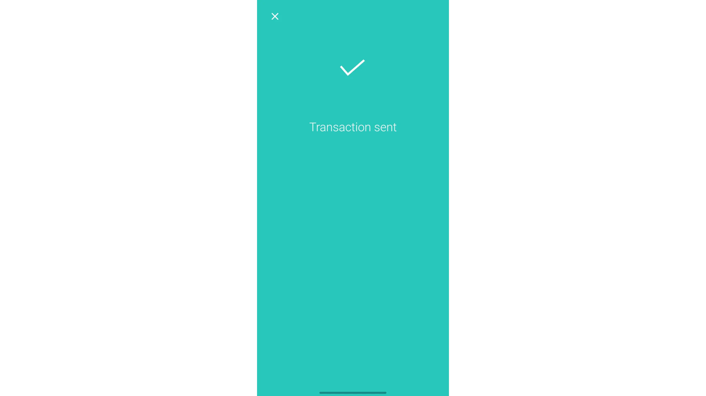

## Doxxic Change ausgeben

Denken Sie daran: Das Modell von Whirlpool basiert auf dem Ausgleich Ihrer Figuren bei Tx0, bevor sie in die Pools eintreten. Es ist dieser Mechanismus, der die Verfolgung von UTXOs unterbricht. Meiner Meinung nach ist dies das effizienteste Coinjoin-Modell, aber es hat einen Nachteil: Es erzeugt eine *Änderung*, die nicht den Coinjoin-Prozess durchläuft.

Diese Änderung entspricht einem UTXO, der für jeden Tx0 erstellt wird. Sie wird in einem speziellen Konto isoliert, das je nach Software `Doxxic Change` oder `Bad Bank` genannt wird, um zu vermeiden, dass sie mit Ihren anderen UTXOs verwendet wird. Dies ist sehr wichtig, da diese UTXOs nicht vermischt wurden: Ihre Rückverfolgbarkeitslinks bleiben intakt und sie können Ihre Vertraulichkeit gefährden, indem sie eine Verbindung zwischen Ihnen und Ihrer Coinjoin-Aktivität herstellen. Gehen Sie also vorsichtig mit ihnen um und verwenden Sie sie **niemals zusammen mit anderen UTXOs**, egal ob gemischt oder nicht. Wenn Sie einen toxischen UTXO mit einem gemischten UTXO kombinieren, werden alle Vorteile der Privatsphäre, die Sie durch das Coinjoin gewonnen haben, zunichte gemacht.

Im Moment bietet Ashigaru keinen direkten Zugang zu diesem "Doxxic Change"-Konto (zumindest habe ich es nicht gefunden). Diese Funktion wird wahrscheinlich in einem zukünftigen Update hinzugefügt werden. In der Zwischenzeit besteht die einzige Möglichkeit, diese Mittel abzurufen, darin, Ihren seed in Sparrow Wallet zu importieren. Letzterer erkennt normalerweise automatisch, dass es sich um einen wallet handelt, der zusammen mit dem Whirlpool verwendet wird, und gibt Ihnen Zugriff auf alle vier Konten, einschließlich des Kontos `Doxxic Change`. Sie können diese UTXOs dann wie normale Bitcoins von Sparrow aus ausgeben.

Hier sind mehrere mögliche Strategien für die Verwaltung Ihrer Devisen UTXOs von coinjoins, ohne Ihre Privatsphäre zu gefährden:

- Mischen in kleinere Pools:** Wenn Ihr toxischer UTXO groß genug ist, um sich einem kleineren Pool anzuschließen, ist dies im Allgemeinen die beste Option. Achten Sie jedoch darauf, niemals mehrere toxische UTXOs zusammenzulegen, um dies zu erreichen, da dadurch eine Verbindung zwischen Ihren verschiedenen Einträgen in Whirlpool hergestellt wird.

- Markieren Sie sie als nicht ausgabefähig:** Eine andere umsichtige Vorgehensweise besteht darin, sie einfach auf ihrem separaten Konto zu belassen und sie nicht zu berühren. Dadurch wird verhindert, dass Sie sie versehentlich ausgeben. Wenn der Wert von Bitcoin steigt, könnten neue, an ihre Größe angepasste Pools eröffnet werden.

- Spenden:** Sie können diese giftigen UTXOs in Spenden an Bitcoin-Entwickler, Open-Source-Projekte oder Vereine, die BTC akzeptieren, umwandeln. So können Sie sie sinnvoll entsorgen und gleichzeitig das Ökosystem unterstützen.

- Kaufen Sie Prepaid-Geschenkkarten oder Visa-Karten:** Plattformen wie [Bitrefill](https://www.bitrefill.com/) ermöglichen es Ihnen, Ihre Bitcoins in Geschenkkarten oder wiederaufladbare Visa-Karten einzutauschen, die in Geschäften verwendet werden können. Dies kann ein einfacher und diskreter Weg sein, um Ihre toxischen UTXOs auszugeben.

- Tauschen Sie sie gegen Monero:** Samourai Wallet bot früher einen inzwischen eingestellten BTC/XMR-Atomtauschdienst an. Wenn ein ähnlicher Service existiert (ich persönlich kenne keinen), ist das eine ausgezeichnete Lösung, um diese UTXOs zu isolieren, sie in Monero umzuwandeln und sie dann eventuell an Bitcoin zurückzuschicken. Diese Methode war jedoch teuer und abhängig von der verfügbaren Liquidität.

- Übertragen Sie sie auf den Lightning Network:** Die Übertragung dieser UTXOs auf den Lightning Network, um von reduzierten Transaktionsgebühren zu profitieren, ist eine potenziell interessante Option. Diese Methode kann jedoch je nach Verwendung von Lightning bestimmte Informationen preisgeben und sollte daher mit Vorsicht verwendet werden.

## Wie kann ich mich über die Qualität unserer Coinjoin-Zyklen informieren?

Damit ein Coinjoin wirklich effektiv ist, muss er ein hohes Maß an Einheitlichkeit zwischen Input- und Output-Beträgen aufweisen. Diese Gleichförmigkeit erhöht die Anzahl der möglichen Interpretationen für einen außenstehenden Beobachter, was wiederum die Unsicherheit über die Transaktion erhöht. Um diese Unsicherheit zu messen, verwenden wir das Konzept der Entropie, das auf die Transaktion angewendet wird. Das Whirlpool-Modell ist in dieser Hinsicht als eines der effektivsten anerkannt, da es eine ausgezeichnete Homogenität zwischen den Teilnehmern garantiert. Für eine eingehendere Betrachtung dieses Prinzips empfehle ich Ihnen das letzte Kapitel von Teil 5 des BTC 204-Schulungskurses.

https://planb.academy/courses/65c138b0-4161-4958-bbe3-c12916bc959c

Die Leistung mehrerer Coinjoin-Zyklen wird anhand der Größe der Mengen gemessen, in denen eine Münze versteckt ist. Diese Mengen werden als *Anonsets* bezeichnet. Es gibt zwei Arten: Die erste misst die Vertraulichkeit gegenüber der retrospektiven Analyse (von der Gegenwart in die Vergangenheit), die zweite die Resistenz gegenüber der prospektiven Analyse (von der Vergangenheit in die Gegenwart). Eine ausführliche Erläuterung dieser beiden Indikatoren finden Sie im folgenden Tutorium (oder, wie gesagt, im Schulungskurs BTC 204):

https://planb.academy/tutorials/privacy/analysis/remix-whirlpool-2b887bd9-8a6a-4dca-8aa9-a1c33682b0aa

## Wie kann man den Postmix verwalten?

Nach mehreren Coinjoin-Zyklen ist es am besten, die UTXOs auf dem Postmix-Konto zu belassen und sie auf unbestimmte Zeit zu remixen, bis man sie wirklich ausgeben muss.

Einige Nutzer ziehen es vor, ihre gemischten Bitcoins auf einen wallet zu übertragen, der durch wallet-Hardware gesichert ist. Diese Option ist möglich, erfordert aber ein gewisses Maß an Strenge, um sicherzustellen, dass die mit Coinjoins erworbene Vertraulichkeit nicht gefährdet wird.

Die Vermischung von UTXOs ist der häufigste Fehler. Es ist wichtig, niemals gemischte UTXOs mit nicht gemischten UTXOs in derselben Transaktion zu kombinieren, da sonst die Gefahr besteht, dass die *Common Input Ownership Heuristic (CIOH)* ausgelöst wird. Dies setzt eine strenge Verwaltung Ihrer UTXOs voraus, insbesondere durch klare und präzise Kennzeichnung. Generell ist das Zusammenführen von UTXOs eine schlechte Praxis, die bei schlechter Handhabung oft zu einem Verlust der Vertraulichkeit führt.

https://planb.academy/tutorials/privacy/on-chain/utxo-labelling-d997f80f-8a96-45b5-8a4e-a3e1b7788c52

Auch bei der Konsolidierung gemischter UTXOs sollten Sie vorsichtig sein. Begrenzte Konsolidierungen können in Betracht gezogen werden, wenn die UTXOs signifikante Anonsets aufweisen, aber sie verringern unweigerlich Ihre Vertraulichkeitsstufe. Vermeiden Sie massive oder überstürzte Konsolidierungen, die vor einer ausreichenden Anzahl von Remixen durchgeführt werden, da sie Rückschlüsse auf die Verbindungen zwischen Ihren Pre- und Post-Mix-Teilen zulassen könnten. Im Zweifelsfall ist es am besten, Ihre Postmix-UTXOs nicht zu konsolidieren und sie einzeln auf Ihre wallet-Hardware zu übertragen, wobei jedes Mal eine neue leere Empfangsadresse erzeugt wird. Vergessen Sie nicht, jeden übertragenen UTXO zu beschriften.

Wir raten dringend davon ab, Ihre Postmix-UTXOs in Portfolios zu verschieben, die Minderheitenskripte verwenden. Wenn Sie beispielsweise an Whirlpool aus einem multi-sig-Portfolio in "P2WSH" teilgenommen haben, gibt es nur wenige von Ihnen, die diese Art von Skript verwenden. Wenn Sie Ihre Postmix-UTXOs an denselben Skripttyp senden, verringern Sie Ihre Anonymität erheblich. Abgesehen von der Art des Skripts können auch andere spezifische wallet-Fingerabdrücke Ihre Vertraulichkeit gefährden, so dass es am besten ist, sie von der Ashigaru-Anwendung aus auszugeben.

Und schließlich, wie bei allen Bitcoin-Transaktionen, verwenden Sie niemals eine Empfängeradresse erneut. Jede Zahlung muss an eine neue, eindeutige, leere Adresse gesendet werden.

Die einfachste und sicherste Methode ist, die gemischten UTXOs in ihrem Postmix-Konto ruhen zu lassen, sie auf natürliche Weise neu mischen zu lassen und sie nur bei Bedarf von Ashigaru auszugeben.

Die Ashigaru- und Sparrow-Wallets enthalten zusätzliche Sicherheitsvorkehrungen gegen die häufigsten Fehler, die bei der Blockchain-Analyse auftreten, und helfen Ihnen, die Vertraulichkeit Ihrer Transaktionen zu wahren.