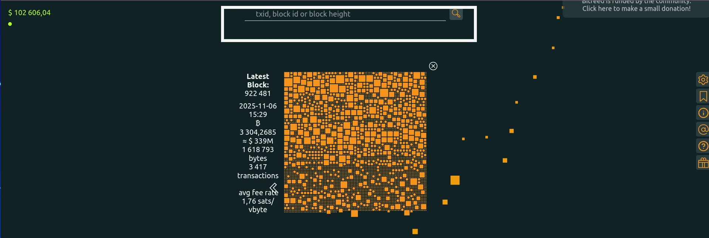
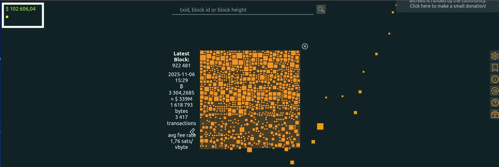
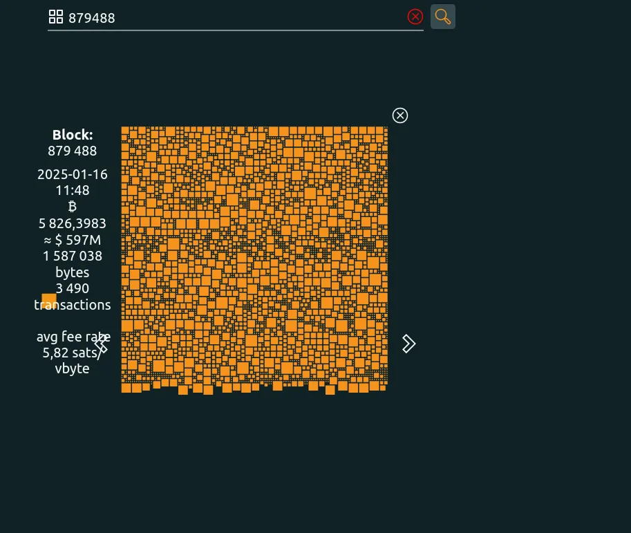
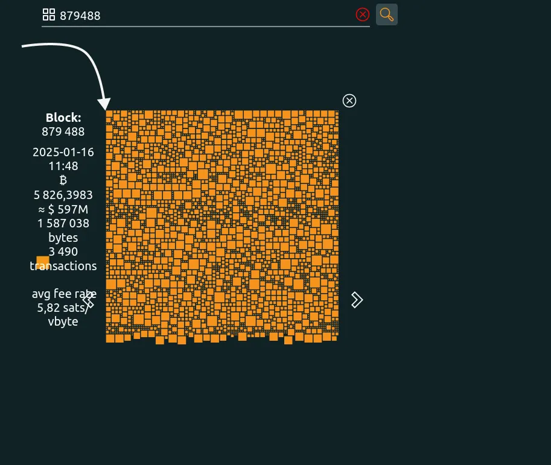
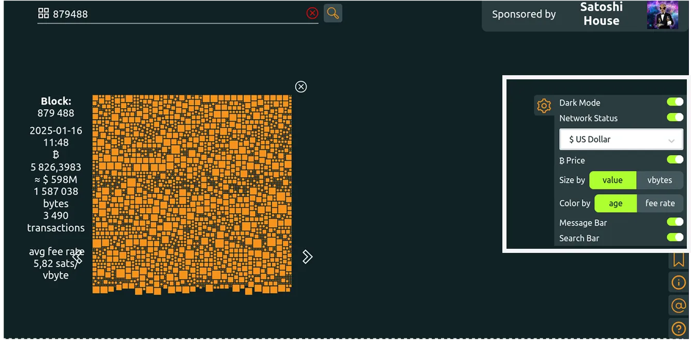
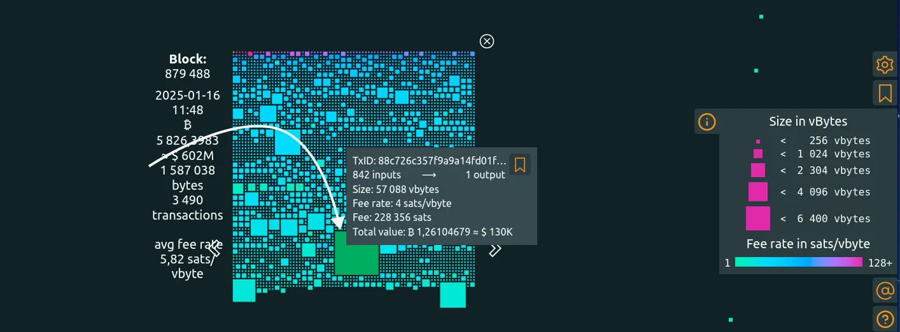
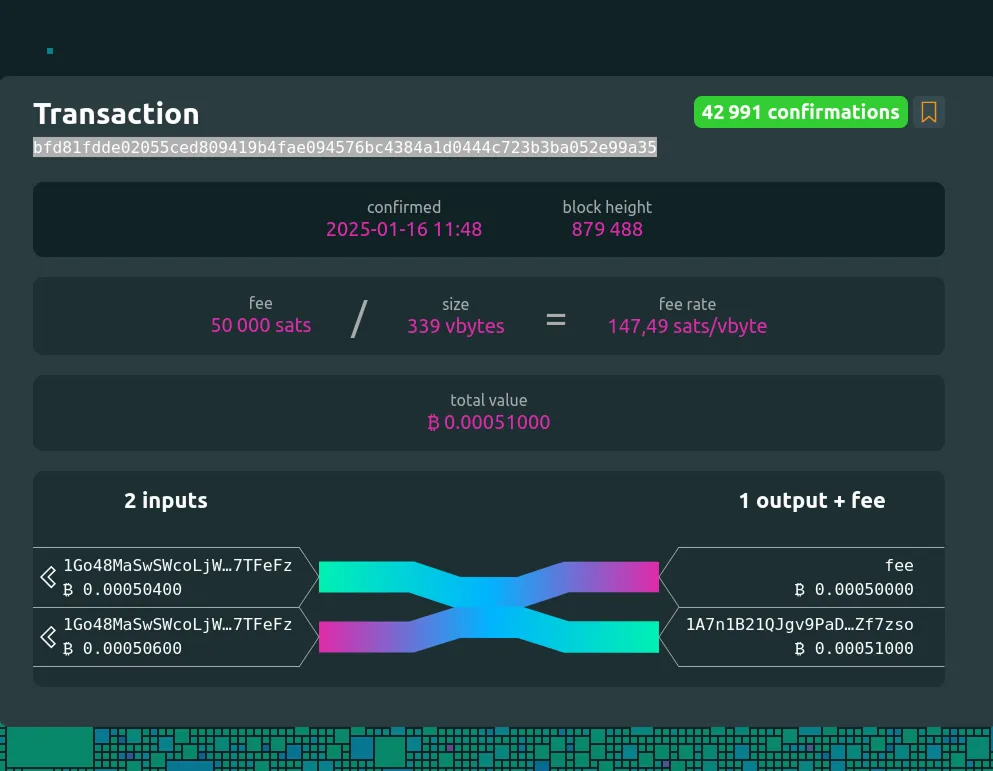

Bitfeed on platvorm Bitcoin protokolli onchain-kihi visualiseerimiseks. Selle algatas üks Mempool.space'i projekti toetajatest ja see paistab silma peamiselt oma minimalistliku välimuse ja kasutusmugavuse poolest.

https://planb.academy/tutorials/privacy/analysis/mempool-space-f3e468a1-92f1-43ce-b2e4-c3298fa0e02f

Selles õpetuses vaatame seda tööriista, mis võimaldab teil uurida kõiki tehinguid ja plokke võrgus.

## Bitfeediga alustamine

Bitfeed on platvorm, mis keskendub kolmele peamisele punktile:

- Blockchain konsultatsioon**,
- Tehinguotsing**,
- Mempool** visualiseerimine.

### Konsulteerimine plokiahelaga

Bitfeedi kodulehelt leiate peamiselt :

- Otsinguriba: See osa on sisenemispunkt plokiahela päringute jaoks. Siin saate otsida konkreetset plokki selle numbri või hashi järgi. Samuti saate otsida konkreetseid tehinguid ja Bitcoin-aadresse, et kontrollida teatud tehinguandmeid võrgus.

Vasakus ülanurgas näete bitcoini praegust hinda, mis on arvestatud USA dollarites (USD).

Parempoolses külgribas on platvormi menüü. Sellest menüüst saate kohandada platvormi kasutajaliidest oma maitse järgi, lisada või eemaldada objekte ja kohandada vaatamisfiltreid. Näiteks saate vaadata iga ploki suurust väärtuse või kaalu järgi virtuaalsetes baitides (vBytes).

Lehe keskel on viimane kaevandatud plokk, kus on näha kõik selles plokis sisalduvad tehingud. Selles jaotises on teave ajatempli, plokis osalenud bitcoinide koguarvu, ploki suuruse baidides, tehingute arvu ja keskmise tehingukulu suhtarvu ühe virtuaalse baidi kohta plokis.

Saate minna tagasi kanali ajalukku, otsides otsinguribalt konkreetset plokki, ja vaadata seda vastavalt oma kriteeriumidele.

Näiteks soovime vaadata tehinguid plokis `879488`.

Selle ploki esimene tehing kujutab endast **coinbase** tehingut, mis võimaldab selle ploki kaevandajal teenida mining tasu, mida saab kulutada alles pärast 100 ploki kaevandamist, mis koosneb lisatud tehingutasudest ja plokkide toetusest. See tehing on see, mis võimaldab süsteemis uute bitcoinide väljaandmist.

https://planb.academy/courses/obtenir-ses-premiers-bitcoins-f3e3843d-1a1d-450c-96d6-d7232158b81f

Vaikimisi esitatakse tehingud plokis kahe kriteeriumi alusel:

- Suurus, mis võib varieeruda väärtuse ja kaalu (vBytes) vahel;
- Värv võib varieeruda vanuse ja tehingutasude suhtega virtuaalse baidi kohta.

Seega võime järeldada, et kõik ühes ja samas plokis sisalduvad tehingud on plokiahelas sama arvu kinnitustega. Suurimad kuubikud esindavad tehinguid, mis sisaldavad kõige rohkem bitcoine.

Seda tõlgendust kinnitab ka **"Info "** menüüvalik, mis teavitab meid ploki tehingute värvi ja suuruse tõlkimisest.

Saate vaadata ka ploki tehinguid virtuaalsete baitide ja tasude suhte järgi. See vaade võib erineda eelmisest, kuna tehingu sisalduv bitcoini väärtus ei määra selle suurust.

### Tehingute vaatamine

Otsinguriba kaudu saate otsida tehingut selle identifikaatori abil. Samuti saate klõpsata kuubil, et näha selle tehinguga seotud teavet.

Meie puhul võtame tehingu, mis hõivab kõige rohkem ruumi plokis `879488`.

Näete, et see tehing on `42,989`, mis kujutab endast viimase kaevandatava ploki ja meie valitud ploki vahet. Need kinnitused aitavad tugevdada Bitcoin võrgu turvalisust, sest selle tehingu pahatahtlikuks muutmiseks peaksid ründajad omama samaväärset arvutusvõimsust, et kirjutada ümber kogu peamine plokkide ahel.

Selle tehingu suurus on "57,088 vBytes", peamiselt selle ehitamisel kasutatud UTXOde suure arvu tõttu (842 kirjet). Üllataval kombel on kohaldatud tasu suhe suhteliselt madal (ainult 4 sats/vByte) võrreldes üldise ploki keskmise suurusega 5,82 sats/vByte.

Seega ei pruugi kõige rohkem ruumi võttev tehing olla tingimata kõige suurema tehingukulu suhtega tehing.

Kui järgite **Info** menüüs olevat skaalat, siis on lilla tehing, mille tehingukulude suhe on kõige suurem. See on tehing [bfd81fddde02055ced809419b4fae094576bc4384a1d0444c723b3ba052e99a35](https://bitfeed.live/tx/bfd81fdde02055ced809419b4fae094576bc4384a1d0444c723b3ba052e99a35), mille tehingukulude suhe on `147.49 sats/vBytes`.

https://planb.academy/courses/65c138b0-4161-4958-bbe3-c12916bc959c

### Mempool visualiseerimine

Mempool on virtuaalne asukoht, kuhu on koondatud plokki lisamist ootavad Bitcoin tehingud. Bitfeed võimaldab konsulteerida mitme Bitcoin kaevandaja [mempool](https://planb.academy/resources/glossary/mempool), pakkudes laiaulatuslikku tehingu jälgimist.

Selles jaotises saate jälgida kõiki kehtivaid ja veel kinnitamata tehinguid Bitcoin võrgu põhikettis.

Nüüd on teil juhend Bitfeedi platvormi kasutamiseks, et analüüsida plokke ja tehinguid, et visualiseerida Bitcoin võrgustiku põhiketti kättesaadavat teavet, kasutades samal ajal minimalistlikku ja hõlpsasti kasutatavat kasutajaliidest. Kui teile meeldis see õpetus, soovitame teha järgmise sammu: avastada Lightning Network projekti Amboss kaudu.

https://planb.academy/tutorials/node/lightning-network/amboss-37044cad-0f85-41eb-af18-491384af1017