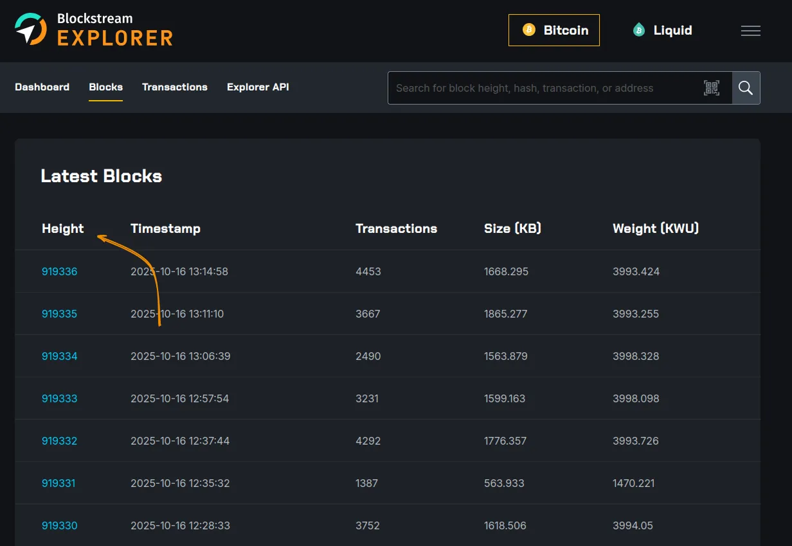
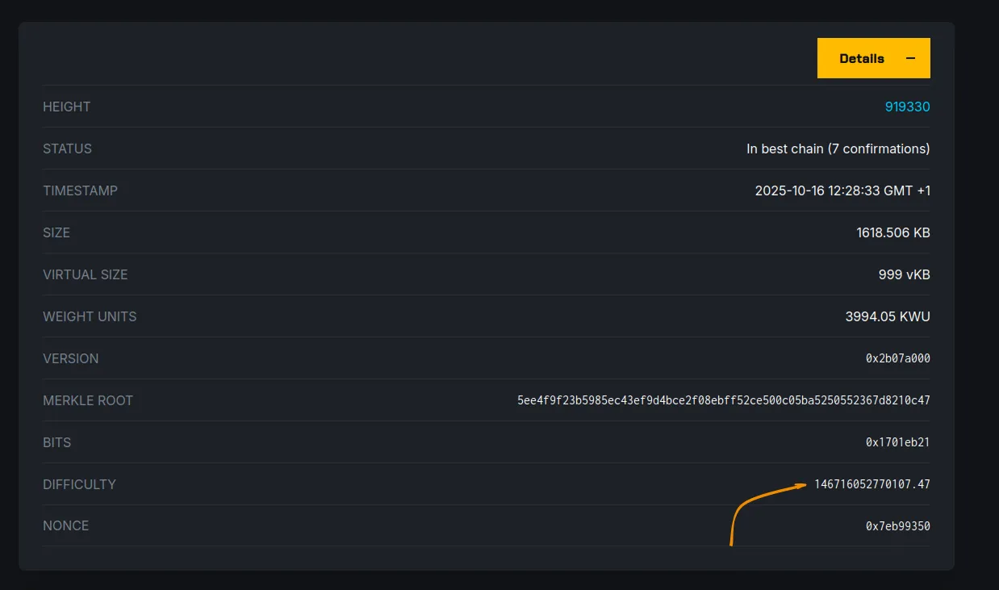
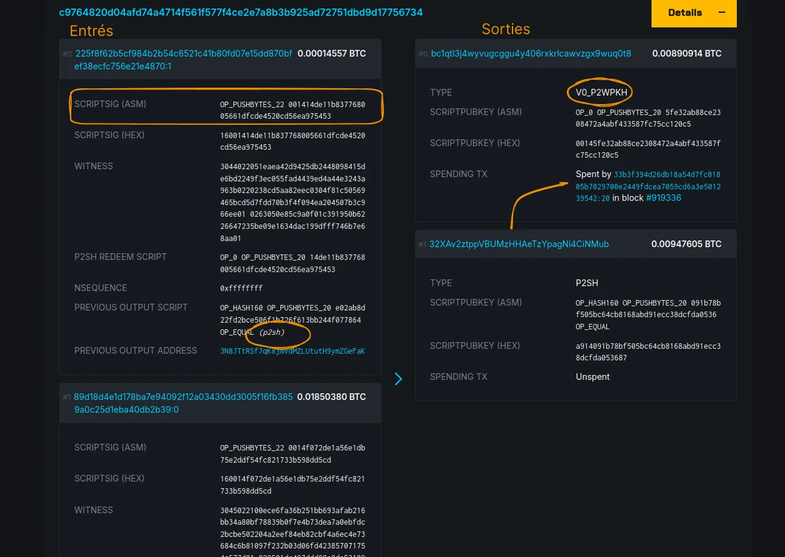
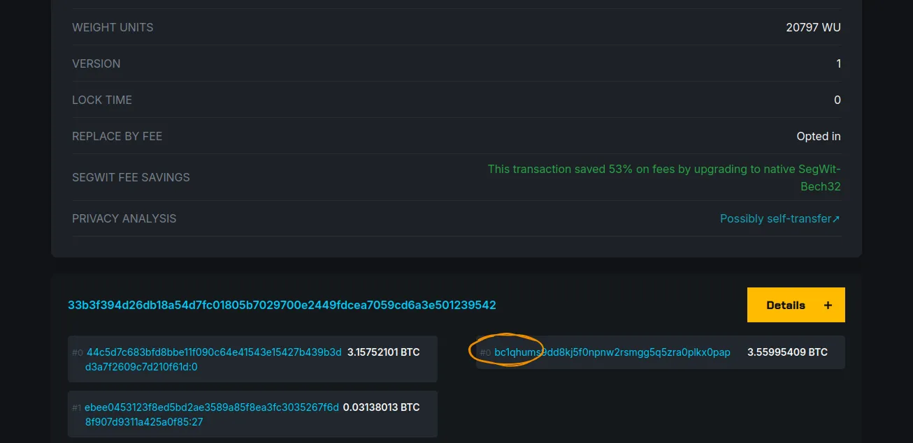
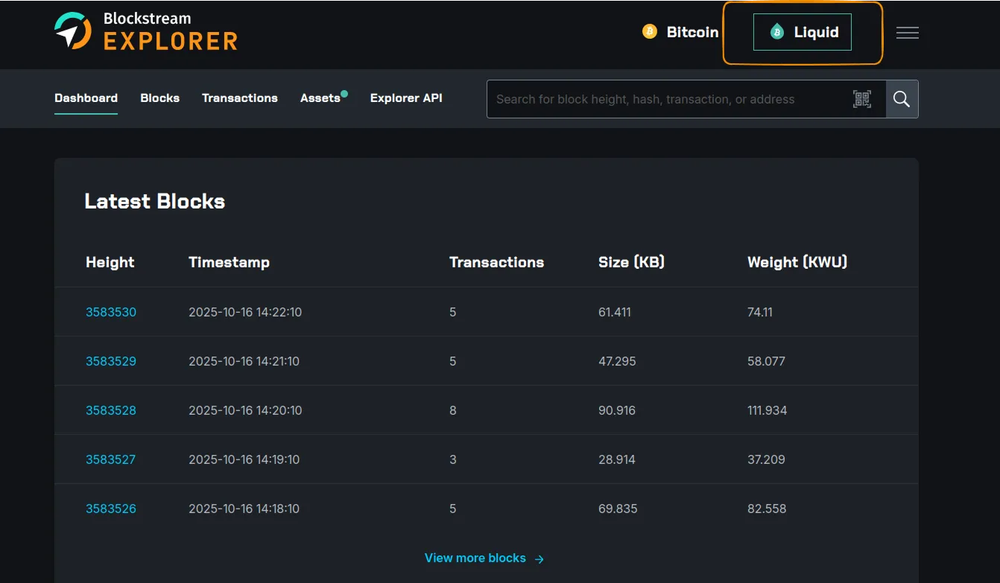
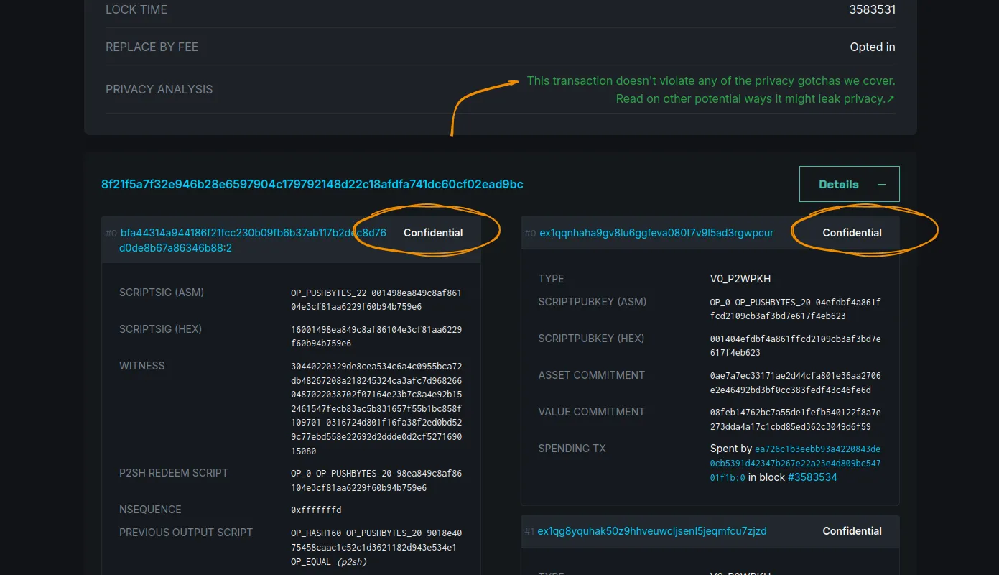
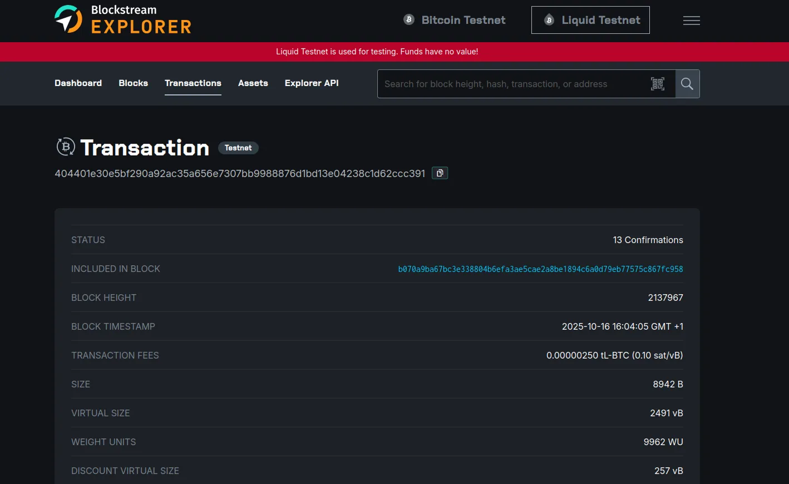

Il Blockstream Explorer è un progetto che facilita l'esplorazione delle transazioni e dello stato globale del protocollo Bitcoin, nonché della [*sidechain*](https://planb.academy/en/resources/glossary/sidechain) Liquid sviluppata dalla società Blockstream.

Avviato nel 2014 da Blockstream, una società fondata da Adam Back, l'esploratore [blockstream.info](https://blockstream.info) mira a fornire una solida infrastruttura per il Bitcoin, garantendo l'interoperabilità e il tracciamento delle transazioni tra i livelli (on-chain e Liquid), migliorando al contempo la sicurezza e la privacy degli utenti.

In questa esercitazione vedremo cosa lo contraddistingue, i suoi servizi e come offre un monitoraggio continuo delle operazioni e dello stato dei livelli on-chain e Liquid del Bitcoin.

## Come iniziare con Blockstream explorer

### Navigare nel canale principale

Quando si accede all'explorer di Blockstream.info, su "**Dashboard**", la catena principale del protocollo Bitcoin è selezionata per impostazione predefinita. Da questa interfaccia, si ha una panoramica di :

- Dimensione della catena principale: Blocchi estratti di recente.

Questa sezione fornisce informazioni sui blocchi recenti estratti, il timestamp, il numero di transazioni incluse in ogni blocco, la dimensione in kilobyte (kB) e la misura di ogni blocco in unità di peso (**WU** = *Weight Units*). Quest'ultima misura è interessante perché ci permette di valutare l'ottimizzazione del blocco, dato che ogni blocco della catena principale è limitato a `4.000.000 WU`, o `4.000 kWU`.

- Transazioni recenti.

La sezione della transazione fornisce informazioni sull'identificativo unico della transazione, sul valore in bitcoin coinvolto, sulla dimensione in byte virtuali (vB) - che rappresenta la somma di tutti i dati (in entrata e in uscita) - e sulla tariffa associata. Ad esempio, una transazione con una dimensione di `153 vB` a un tasso di `2 sat/vB` comporterà una commissione di `306 satoshis`.

### Esplorazione dei fluidi

Dal menu "**Blocchi**" è possibile tracciare la storia dell'intera catena principale fino all'ultimo blocco estratto.

Facendo clic su un blocco specifico, è possibile ottenere maggiori dettagli sulle informazioni e sulle transazioni in esso contenute. Ad esempio, per il blocco 919330: si vedrà l'hash del blocco. È anche possibile navigare verso il blocco precedente, poiché ogni blocco estratto (ad eccezione del Genesis) è collegato a quello precedente, mantenendo l'hash del suo predecessore.

Facendo clic sul pulsante **"Dettagli "**, è possibile ottenere ulteriori informazioni su questo blocco, come il suo stato, che conferma che è stato aggiunto alla catena principale conservata e propagata. È inoltre possibile conoscere la difficoltà con cui questo blocco viene estratto: questa difficoltà rappresenta la potenza di calcolo necessaria per risolvere il problema crittografico di mining e viene modificata ogni 2016 blocchi (circa 2 settimane).

Sotto questa sezione di dettagli, troviamo tutte le transazioni incluse in questo blocco.

La primissima transazione del blocco è chiamata **transazione coinbase**. Viene utilizzata per assegnare la ricompensa mining del minatore (tutte le commissioni associate alle transazioni incluse nel blocco e alla concessione del blocco). I bitcoin creati da questa transazione possono essere spesi solo dopo che sono stati minati altri 100 blocchi consecutivi. In altre parole, per poterli utilizzare, il minatore dovrà attendere la produzione del blocco **919430**. Questo è noto come [*"periodo di maturità "*](https://planb.academy/fr/resources/glossary/maturity-period).

La coinbase è una transazione speciale: è l'unica che non ha alcun input reale, poiché non spende alcun bitcoin da una transazione precedente.

Tutte le altre transazioni sono suddivise in due sezioni: ingressi e uscite.

Affinché i bitcoin possano essere utilizzati come input in una nuova transazione, l'iniziatore della transazione deve dimostrarne il possesso fornendo una firma che corrisponde a uno script specifico. Ogni pezzo di bitcoin (UTXO) contiene uno script che generalmente richiede una firma specifica che solo la chiave privata del titolare può fornire. Questi script sono ***scriptSig*** (in ASM), scritti in Bitcoin Script, e possono essere di vario tipo. In questo esempio, si può notare che gli UTXO utilizzati erano di tipo P2SH per un output di tipo P2WPKH (*Pay-to-Witness-Public-Key-Hash*).

È possibile tracciare la storia di uno specifico UTXO utilizzando l'euristica. Vi invitiamo a scoprire le diverse euristiche del Bitcoin e i modi per rafforzare la riservatezza delle vostre transazioni sul Bitcoin :

https://planb.academy/courses/65c138b0-4161-4958-bbe3-c12916bc959c

Prendiamo l'esempio delle spese in uscita di questa transazione. Facendo clic sull'identificativo della transazione, si viene reindirizzati alla sezione **Transazioni** della pagina dei dettagli della transazione.

Da questa pagina è possibile scoprire in quale blocco è stata inserita la transazione. A seconda del tipo di indirizzo utilizzato, la transazione può ottimizzare i suoi dati (*byte virtuali*) e quindi pagare meno tasse di transazione. Questa transazione, ad esempio, ha risparmiato il 53% delle commissioni utilizzando un formato di indirizzo nativo SegWit Bech32 che inizia con `bc1q`.

## Strato Liquid

Liquid Network è una [*sidechain*](https://planb.academy/en/resources/glossary/sidechain) e una soluzione di livello 2 open source per il protocollo Bitcoin. In particolare, consente transazioni bitcoin più veloci e riservate.

Nell'explorer di Blockstream.info, fare clic sul pulsante **"Liquid"** per passare alla rete Liquid.

Facendo clic su una delle transazioni che vogliamo monitorare, vediamo che gli importi dei bitcoin sono sostituiti dalla dicitura "**Confidenziale**". Su questa rete, le transazioni possono essere riservate, quindi non possiamo vedere gli importi di ogni UTXO, né in entrata né in uscita dalla transazione.

Tuttavia, notiamo che i principi e i meccanismi presenti sul livello principale del protocollo Bitcoin sono gli stessi: script di blocco bitcoin e tracciabilità UTXO.

Il Liquid Network fornisce anche asset digitali non depositati che possono essere utilizzati dalle organizzazioni. Nel menu **"Assets "** si trova un elenco degli asset registrati, il loro totale e il dominio a cui si riferiscono.

Per ogni asset, è possibile tracciare la storia delle transazioni di emissione e combustione (eliminando il totale in circolazione).

## Altre opzioni

L'explorer di Blockstream.info include anche visualizzazioni e tracciamenti delle transazioni su Testnet, Bitcoin, on-chain e Liquid Network.

Quando si passa alla rete Testnet, non si utilizzano bitcoin reali, ma si hanno a disposizione tutte le funzionalità descritte sopra.

Questa rete presenta una catena di diversa lunghezza, alla quale è possibile collegare e testare il funzionamento dei meccanismi Bitcoin e Liquid.

- La sezione API è dedicata a chiunque desideri integrare alcune funzioni di Explorer nella propria applicazione. Attraverso questo API è possibile interrogare la catena principale dei diversi livelli (on-chain e Liquid), tracciare le transazioni e conoscere le tariffe medie delle transazioni in un blocco, ad esempio.

Ora siete pronti a sfruttare tutto il potenziale di Blockstream Explorer per interrogare le blockchain sui livelli on-chain e Liquid. Ci auguriamo che questa esercitazione sia stata utile e vi consigliamo la nostra esercitazione su un altro explorer Bitcoin:

https://planb.academy/tutorials/privacy/explorer/mempool-space-f3e468a1-92f1-43ce-b2e4-c3298fa0e02f