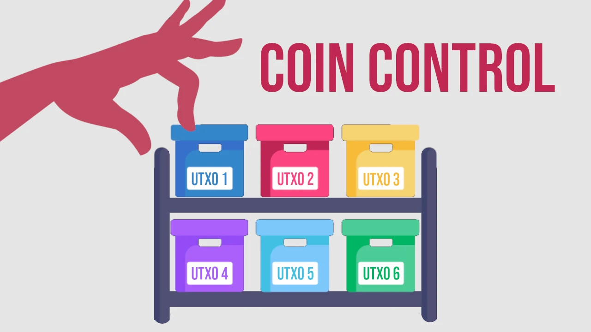

*이 튜토리얼은 [Officine Bitcoin의 강의](https://officinebitcoin.it/lezioni/coinco/)*에서 가져온 것입니다

## 소개

Bitcoin 프로토콜의 견고성은 간단한 핵심 개념에 의해 보장됩니다. 그중에서도 투명성이 두드러지는데, 모든 Bitcoin 거래는 공개되어 누구나 쉽게 확인할 수 있습니다. 이 기능은 사기를 방지하고 자금의 신뢰성을 보장하는 프로토콜의 초석이지만, 기밀성에 대한 도전이 될 수도 있습니다. **이러한 투명성이 프라이버시를 훼손할 수 있는 것은 아닌지 고민해본 적이 있으신가요?

그래야 합니다. Satoshi 비키를 모으는 것은 다소 쉽지만, 지출 단계에서 개인정보가 가장 위험에 노출될 수 있습니다.

### UTXO을 사용하면 어떻게 되나요?

Bitcoin을 지출하는 것은 단순히 다른 사람에게 가치를 이전하는 것이 아닙니다.

UTXO 중 하나를 사용함으로써 귀하는 해당 자금을 소유하고 있음을 증명할 의무가 있으므로 프로토콜 투명성을 위해 부과된 조건을 실제로 충족해야 합니다. 따라서 귀하는 에 대한 책임을 져야 합니다:

- 공개키를 노출합니다;
- 디지털 서명을 생성합니다.

따라서 지출 시점이 가장 중요합니다: **Bitcoin을 소비하는 것은 의식적으로 최대한 통제하면서 해야 하는 행위입니다**.

## Coin 제어

Bitcoin 프로토콜에서는 _계정_ 또는 _화폐 단위_와 같은 항목이 존재하지 않습니다. UTXO의 개념은 다음 강좌에서 훌륭하게 설명되어 있으니 적극 추천합니다:

https://planb.network/courses/65c138b0-4161-4958-bbe3-c12916bc959c

Bitcoin를 사용하면 '미사용 거래 산출물', 즉 '코인'이라고도 하는 **UTXO**로 표시되는 Satoshi에서 측정되는 작거나 큰 계정 단위가 축적되고 나중에 지출됩니다. UTXO를 사용하여 트랜잭션을 생성하면 완전히 소멸되고 그 자리에 다른 UTXO가 생성됩니다.

소프트웨어 지갑은 프로토콜에서 제공하는 특정 알고리즘을 채택하여 "무작위로" 선택된 코인을 사용해 자동으로 이러한 선택을 하도록 개발되었습니다. 이러한 알고리즘이 충족하는 유일한 기준은 지출에 필요한 금액을 충당하는 것입니다.

개발자가 선택한 알고리즘에 따라 다양한 연령대의 UTXO를 혼합하거나 최신 또는 '가장 오래된 것'을 선호할 수 있습니다. 최고의 소프트웨어 지갑 역시 사용자에게 중요한 선택권을 남겨둘 계획입니다.

'Coin 선택'이라고도 하는 'Coin 제어' 매뉴얼은 일부 소프트웨어 지갑의 기능으로, 트랜잭션을 생성할 때 **사용할 UTXO를 수동으로 선택할 수 있습니다**.

각각 21,000개, 42,000개, 63,000개의 Satoshi UTXO가 3개인 Wallet이 있다고 가정해 보겠습니다.

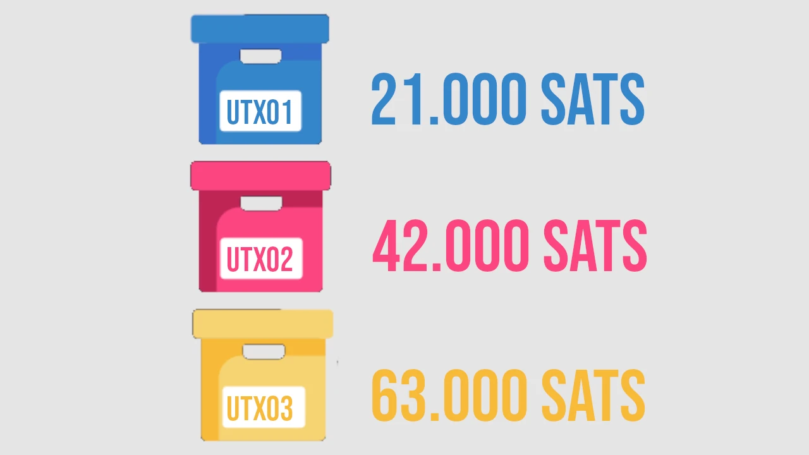

24,000 Sats를 지출하고 알고리즘이 자동으로 선택하도록 해야 하는 경우, 좋은 Software Wallet은 UTXO 1 + UTXO 2를 결합하여 24,000 Sats 및 Miner 수수료를 지불하고 나머지는 시작 Wallet의 내부 Address로 돌아가는 것을 선택할 수 있습니다.

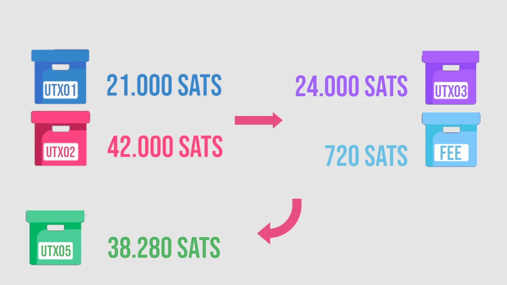

거래 후 UTXO만 계산한 Wallet의 새로운 상황은 다음과 같이 요약할 수 있습니다.

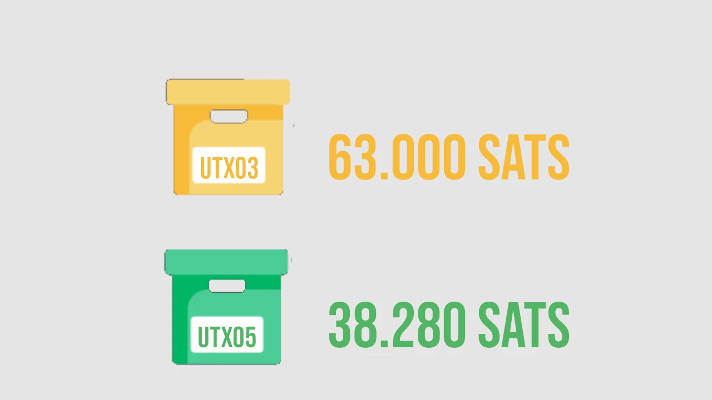

그러나 올바른 소프트웨어와 인식이 있었다면 어떤 면에서는 다른, 더 올바른 선택을 할 수도 있었을 것입니다. 예를 들어, UTXO2(42,000 Sats부터)만 선택했다면 말이죠.

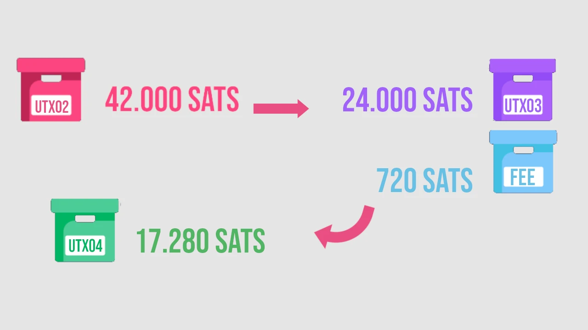

Wallet의 최종 상황은 UTXO 수준에서 이전과 달라 보입니다.

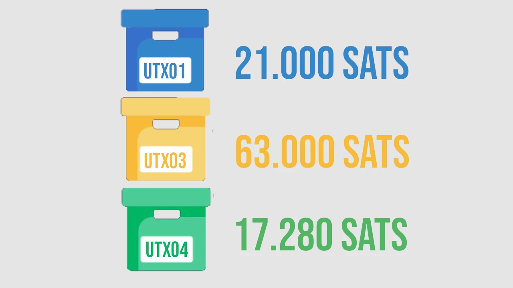

## 왜 Coin을 수동으로 제어해야 하나요?

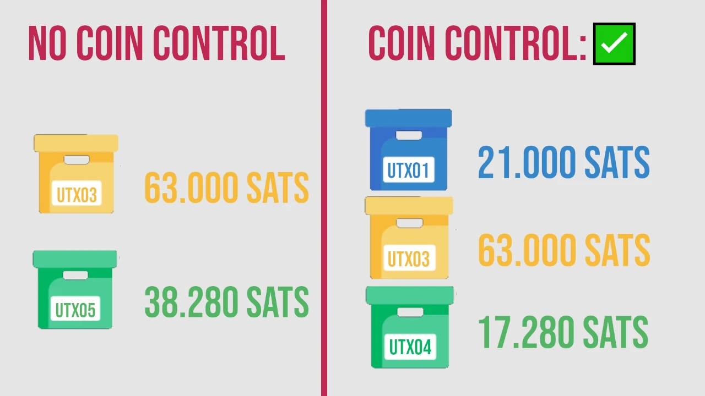

위의 두 예에서 잔액은 실제로 동일한 `108,280 Sats`입니다. 24,000 Sats을 사용한 후 수동 선택이 없으면 Wallet에 2 UTXO가 있고, 수동 제어를 사용하면 총 3 GW가 있습니다.

우리가 스스로에게 던질 수 있는 질문은 다음과 같습니다: **'왜 이 모든 것을 해야 하는가'** 우리가 'UTXO1'을 사용하지 않은 이유는 몇 가지가 있거나 그럴 수 있으며, 그 핵심은 모두 지출 시 수동 Coin 제어를 활성화하는 것이 모범 사례 중 하나이기 때문입니다**.

UTXO를 선택하면 일부 측면을 다른 측면보다 선호할 수 있습니다. 선택은 달성하고자 하는 목표에 따라 달라집니다.

### 개인 정보 보호

수동 Coin 제어의 주요 장점 중 하나는 지출자의 **개인정보 보호 강화**입니다. 수동 Coin 선택 없이 24,000 Satoshi을 지출한 경우를 예로 들어 보겠습니다. Bitcoin의 Blockchain는 공개 기록이므로 외부 관찰자는 의심의 여지 없이 '21,000 Sats의 UTXO1'과 '42,000 Sats의 UTXO2', 그리고 나머지 '38,280 Sats의 UXO5' 입력이 모두 동일한 사용자에 속한다고 선언할 수 있습니다 **세 개가 모두 동일 사용자**.

반면에 `UTXO2`를 수동으로 선택하면 `UTXO1`은 완전히 예약된 상태로 UTXO 세트에 앉아 더 적절한 시점에 사용되기를 기다립니다.

'UTXO1'은 상품 및 서비스에 대해 Exchange으로 받은 대금과 같은 KYC 출처에서 나올 수 있지만, 다른 UTXO는 그렇지 않습니다. UTXO-kyc와 기밀성이 더 높은 다른 KYC를 혼합하면 비 KYC 자금의 익명성이 손상될 수 있습니다.

**KYC 자금은 필연적으로 지불자의 신원으로 연결될 수밖에 없습니다. Wallet의 경우 외부 관찰자가 이렇게 확실하게 신원을 추적할 수 있기를 원하시나요?

예를 들어, UTXO의 수동 선택을 구현하는 지갑은 이러한 상황이 발생할 때 사용할 수 있는 기능인 **하나 이상의 UTXO 분리**를 허용하는 것을 고려해 보세요.

KYC 없이 구매한 Bitcoin과 별도의 Wallet에 KYC 자금을 보관해야 한다고 확신하지만, 이 경우 일부 주소를 분리하는 것이 큰 도움이 되며, 지출 입력을 수동으로 선택하는 방법을 배우면 이점을 활용할 수 있습니다.

### 수수료 절약

지출을 위해 올바른 UTXO을 선택하면 **수수료 최적화가 가능합니다**. 초기 예시에서 다시 시작하여, Software Wallet는 지출할 비용을 충당하기 위해 두 개의 UTXO를 선택했습니다. 두 개의 UTXO는 네트워크에 보여줄 두 개의 서명을 의미합니다. 따라서 트랜잭션의 "가중치"가 더 커집니다.

반면에 Coin 수동 컨트롤을 사용하면 금액을 충당하기에 충분한 금액만 선택할 수 있으므로 거래의 '무게'를 줄여 수수료를 절약할 수 있습니다.

수수료는 높지만 Bitcoin On-Chain를 사용해야 하는 경우(예: Lightning Network 채널을 개설하는 경우)에는 Coin 제어가 적절한 경제적 인센티브로 판명될 수 있습니다.

### 유해 집계

결제를 하고 Bitcoin On-Chain를 사용하면 거스름돈을 받을 가능성이 거의 항상 확실해집니다. 나머지 각각은 네트워크(특히 결제 수신자에게)에 소스 입력과 연결될 수 있는 Address을 공개하기 때문에 그 자체로 작은 개인정보 손실입니다.

잔액을 쉽게 인식하고 다양한 거래의 모든 잔액을 "분리"할 수 있으며, 일정 금액에 도달하면 수동으로 선택하여 통합하거나 Lightning Network (내가 선호하는 방법)로 전환하여 처리하여 지출로 인해 손실 된 개인 정보를 되 찾을 수 있습니다.

### Cold Wallet에서 지출한 비용

Cold Wallet은 장기간 따로 보관할 자금을 합리적으로 확보하여 좋은 수준의 보안을 얻을 수있는 도구입니다. 그러나 예기치 않은 사건이 발생할 수 있으므로 저축을 하고 예기치 않은 비용을 충당해야 할 필요성이 생깁니다.

얼마나 많은 분들이 제 방식을 공유할 수 있을지 모르겠지만, 제 조언은 **같은 주소로 변경되는 것을 피하기 위해 Cold Wallet에서 직접 지출을 하지 말라는 것입니다**. 비용을 충당하는 데 필요한 UTXO를 수동으로 선택하고 Wallet Hot로 이체한 다음 후자에서 거래를 준비하는 방법을 배우세요. 변경된 금액이 있으면 Cold Wallet Address로 다시 보내거나(금액이 적절한 경우) 다른 비용에 사용하거나 방금 본 것처럼 분리할 수 있습니다.

## 실용적인 프레젠테이션

'왜'에 대한 기술적 소개가 끝나면 다른 소프트웨어, 데스크톱 및 모바일에서 Coin 수동 제어를 실제로 적용하는 방법을 살펴 보겠습니다. 선택한 각 도구로 가져온 동일한 Wallet BIP39를 항상 사용하여 도구 간의 작은 차이점을 보여 드리겠습니다.

## Wallet 데스크톱

### Sparrow

Sparrow을 사용하는 경우 Wallet을 열고 왼쪽 메뉴에서 _UTXOs_를 선택합니다. Wallet과 연결된 모든 UTXO의 목록이 표시됩니다.

그 중 하나를 마우스로 클릭한 다음 _선택한 항목 보내기_를 선택하기만 하면 됩니다. Sparrow는 명령 바로 옆에 선택 후 사용할 수 있는 총 금액을 표시합니다. Sparrow는 선택한 UTXO을 파란색으로 강조 표시하여 그래픽으로 보여줍니다.

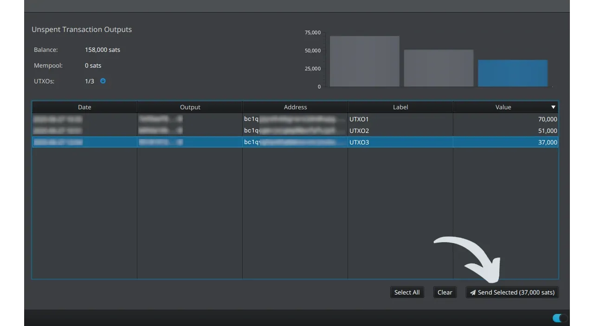

두 개 이상을 선택할 수도 있습니다. 목록에서 인접하지 않은 UTXO를 선택하려면 _TRL_ 키를 누르세요.

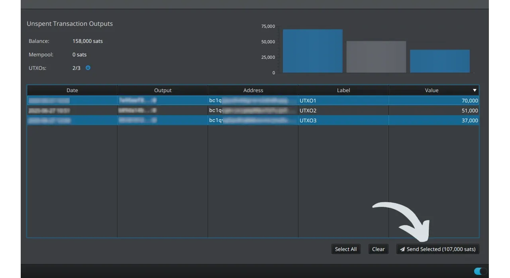

UTXO를 수동으로 선택하면 트랜잭션 구축을 시작할 수 있으며, Sparrow는 트랜잭션이 어떻게 구성되는지 그래픽으로 잘 보여줄 것입니다.

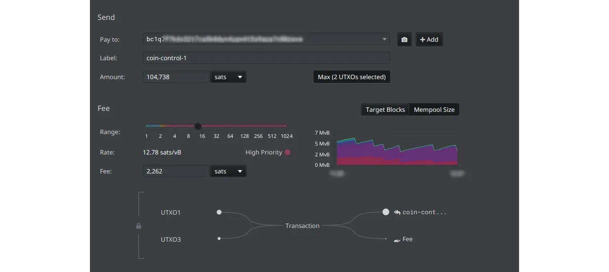

#### UTXO 분리

자금을 분리한다는 것은 거래의 입력으로 사용할 수 없도록 Wallet 내에서 자금을 "잠그는" 것을 의미합니다. Sparrow에서는 이 기능을 사용할 수 있으며, _UTXO_ 메뉴에서 항상 액세스할 수 있습니다. "잠글" UTXO 위에 마우스를 올려놓고 마우스 오른쪽 버튼을 클릭하면 됩니다. 이 절차의 기능 중 _UTXO 고정_이 나타납니다. 이렇게 하면 Sparrow 지갑으로 코인을 분리할 수 있습니다.

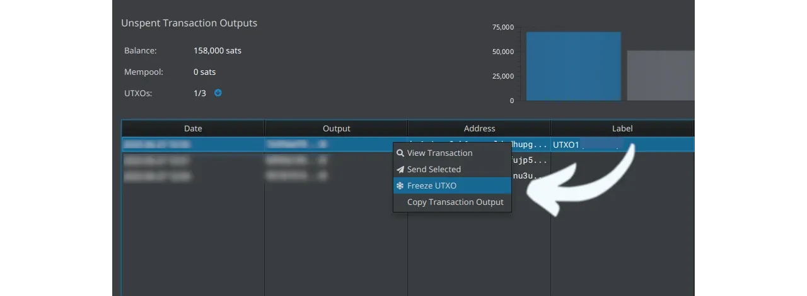

### Electrum

Wallet 데스크톱이 일렉트럼인 경우, _주소_ 메뉴 또는 _코인_ 메뉴에서 UTXO를 수동으로 선택할 수 있다는 것을 알고 있어야 합니다. 두 메뉴 모두 원하는 UTXO를 마우스로 가리키고 마우스 오른쪽 버튼을 클릭한 후 _Coin 컨트롤에 추가_를 선택하면 선택이 완료됩니다.

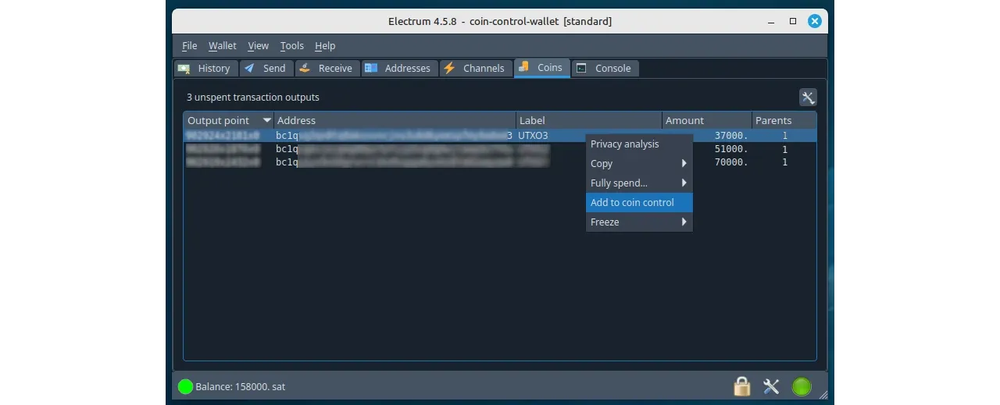

이 소프트웨어를 사용하더라도 두 개 이상의 UTXO을 선택할 수 있으며, 서로 인접하지 않은 경우 키보드의 _CTRL_ 키를 사용하면 도움이 됩니다.

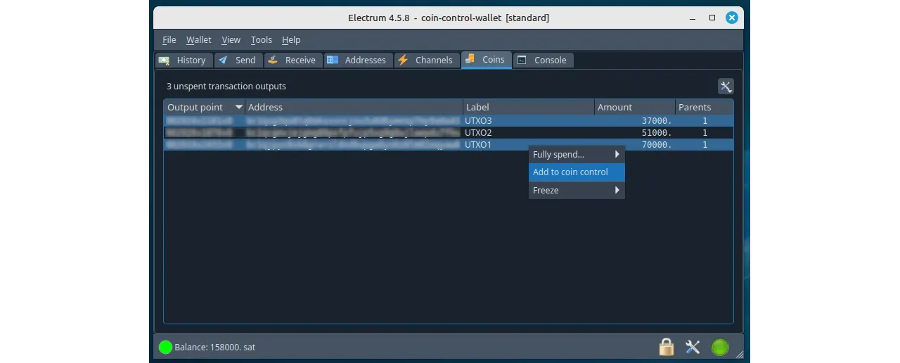

그래픽적으로 일렉트럼은 Green에서 선택한 UTXO를 강조 표시하여 선택 항목을 표시하고, 하단에 동일한 색상으로 강조 표시된 막대가 나타나 Coin 제어 후 사용 가능한 잔액을 표시합니다.

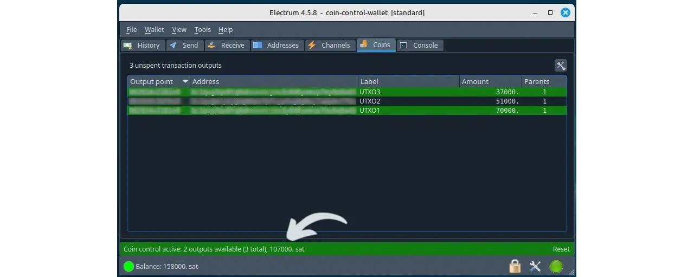

출력을 선택했으면 _송신_ 메뉴에서 평소처럼 트랜잭션을 작성할 수 있습니다.

#### UTXO 분리

일렉트럼은 _코인_ 메뉴로 이동하여 특정 UTXO를 선택한 다음 마우스 오른쪽 버튼으로 _동결_을 선택하면 이 기능을 제공합니다. 주소_ 메뉴에서 자금이 없어도 Address을 "동결"하거나 "Coin"을 사용하여 사용하지 않을 수 있습니다.

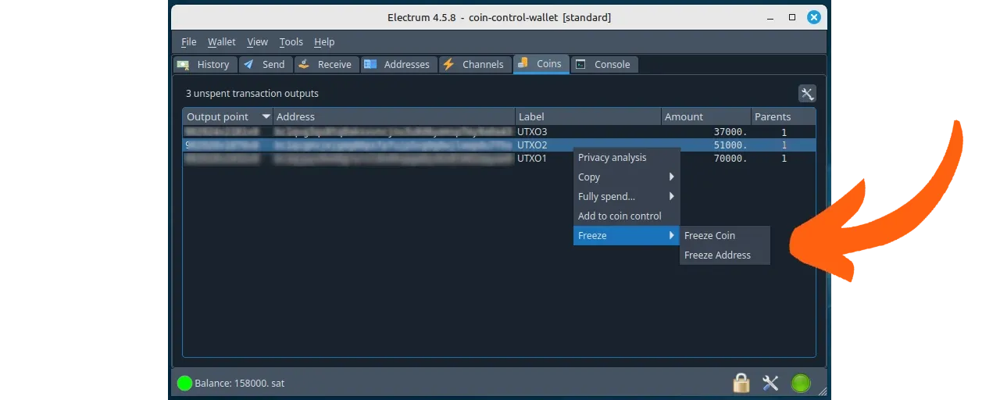

### 쌍절곤

쌍절곤이 열리면 메인 메뉴에서 UTXO를 수동으로 선택할 수 있습니다. 쌍절곤을 실행하고 _코인 보기_를 클릭합니다.

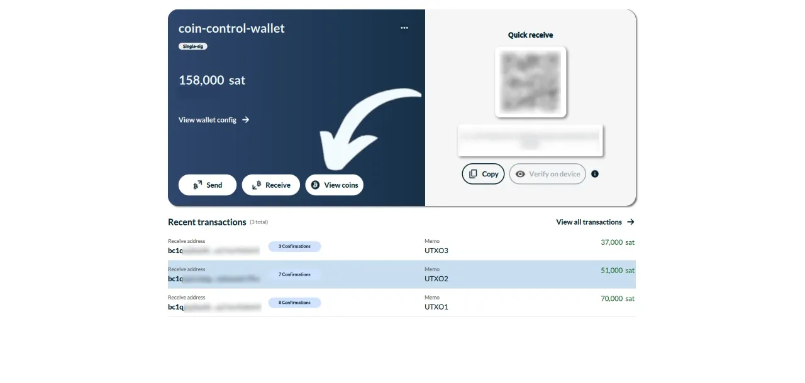

그러면 Wallet에 있는 모든 UTXO가 포함된 창이 열리며, 각 금액 옆에 있는 확인 표시를 활성화하여 하나 이상을 선택할 수 있습니다. 선택한 후 _거래 생성_을 계속 진행합니다.

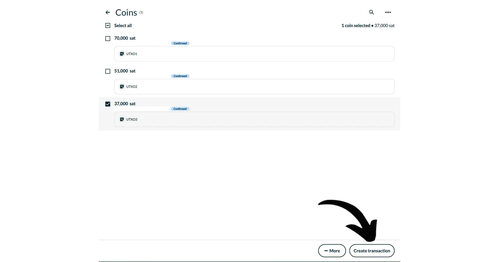

그런 다음 목적지 Address을 입력하고 금액과 수수료를 설정할 수 있습니다.

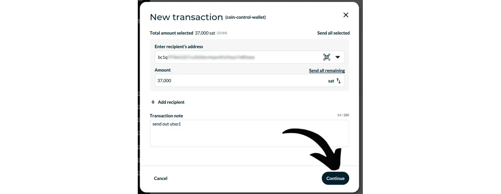

#### UTXO 분리

완성도를 높이기 위해 쌍절곤은 기능 중 하나(또는 그 이상)의 UTXO를 분리할 수 있으며, 두 가지 방법으로 분리할 수 있습니다. 코인 보기_ 메뉴에 액세스하여 코인 목록에서 수동으로 선택합니다. 그런 다음 오른쪽 하단의 _더 보기_ 메뉴를 클릭하면 옵션 목록이 나타나고 이 목록에서 _코인 잠그기_를 선택할 수 있습니다.

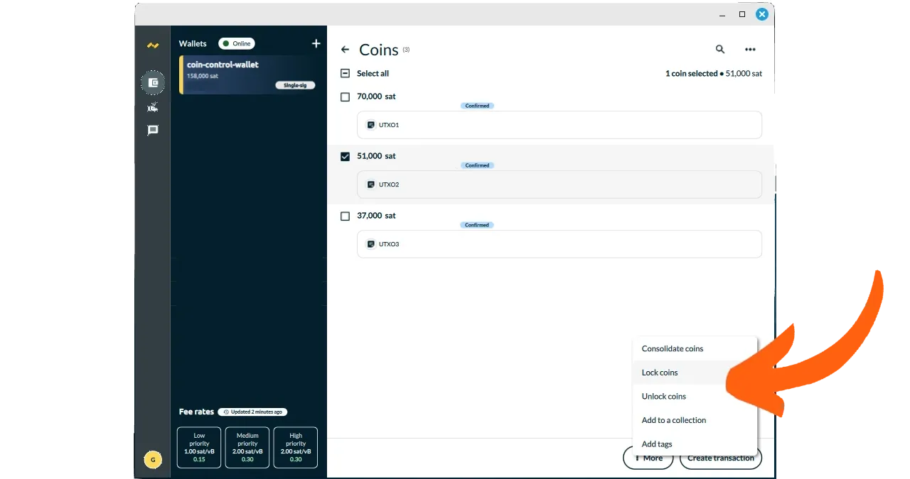

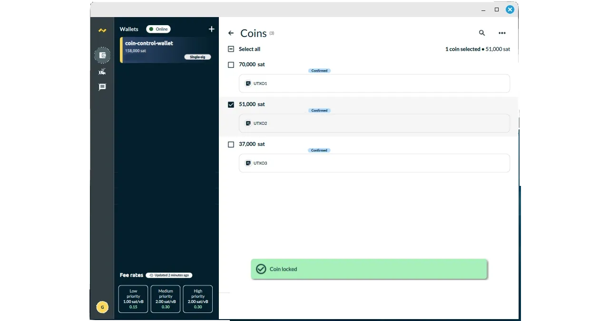

UTXO을 위해 예약된 공간을 클릭하여 _코인 세부정보_ 창에 액세스할 수도 있습니다. 여기서 오른쪽 상단에 해당 UTXO을 잠금/잠금 해제하는 명령이 나타납니다.

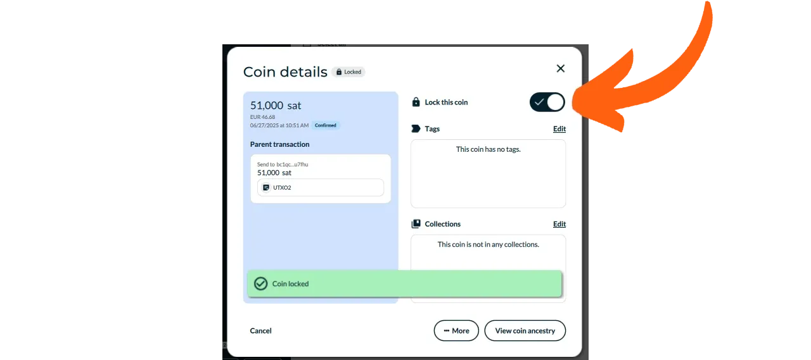

### 블록스트림 앱

이전에 Green로 알려진 블록스트림 앱 데스크톱에서는 이미 트랜잭션 빌드를 시작한 경우 Coin을 선택할 수 있습니다. 따라서 Wallet를 열고 _송신_을 클릭하세요.

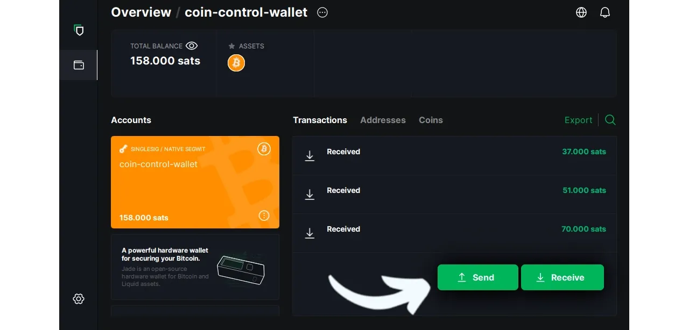

대상 Address을 해당 필드에 붙여넣은 다음 _수동 Coin 선택_을 선택합니다.

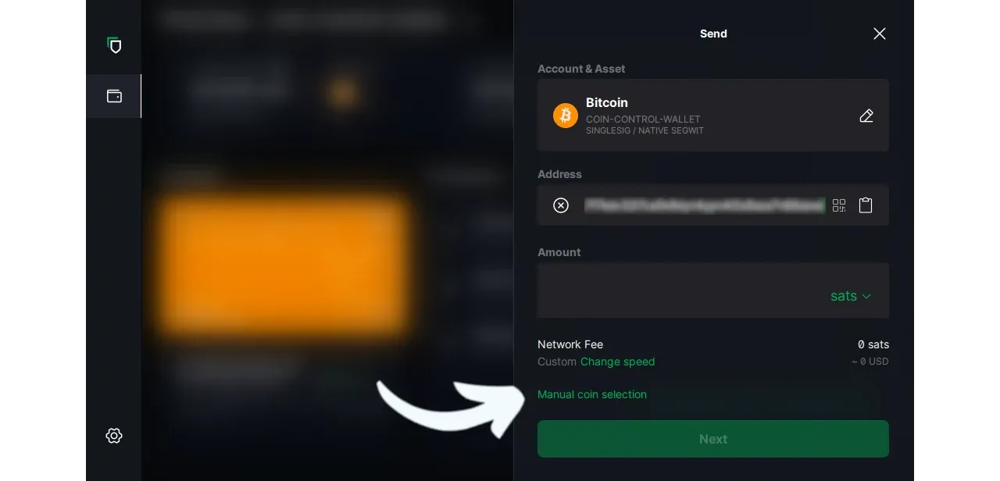

그러면 하나 이상의 UTXO 코인을 선택할 수 있는 창이 열립니다. 아래 예시에서는 두 개의 코인을 선택했습니다. 그런 다음 _Coin 선택 확인_을 클릭하여 선택을 확인합니다.

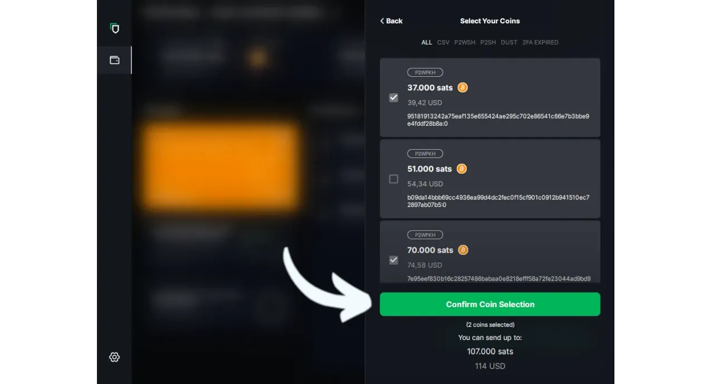

금액과 수수료를 설정한 다음 정상적으로 거래를 진행합니다.

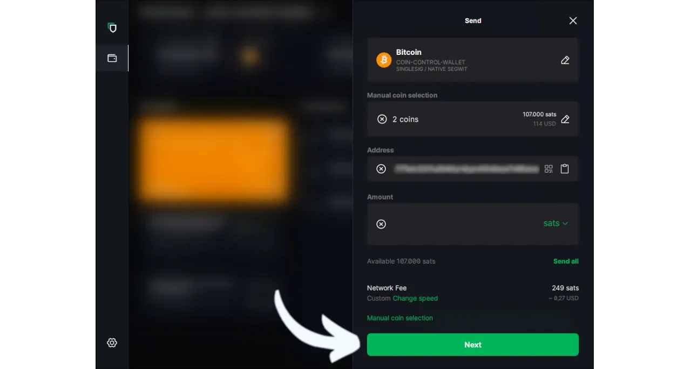

⚠️ 참고 Green의 _코인_ 메뉴에는 UTXO의 분리 가능성을 예고하는 _잠금_/_잠금해제_ 항목이 있습니다. 이 기능은 소위 Multisig 계정에서만 활성화되며, 'Dust'의 임계값에 가까운 매우 적은 양의 UTXO를 선택해야만 활성화됩니다.

## Wallet 모바일

모바일에서도 지갑을 선택할 수 있으며, 이를 통해 UTXO를 수동으로 선택할 수 있습니다. 첫 번째 예로 블루 Wallet을 살펴보겠습니다.

### 파란색 Wallet

이 Wallet을 사용 중인 경우, 지갑을 열고 클릭하여 지갑 중 하나와 관련된 제어 화면으로 들어갑니다. Coin 제어 매뉴얼에 액세스하려면 지출 단계로 들어간 다음 _보내기_를 클릭해야 합니다.

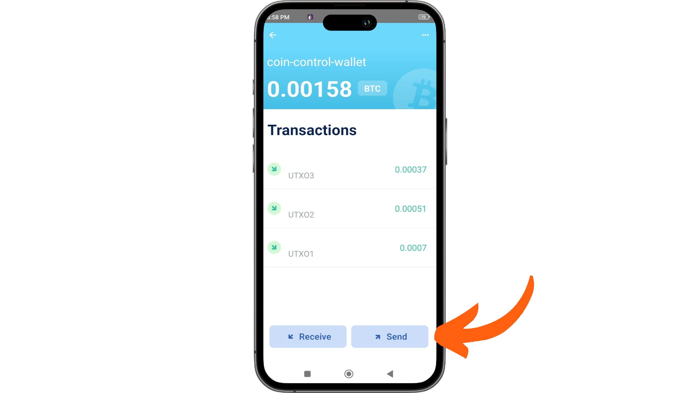

다음 화면에서 오른쪽 상단 모서리에 있는 점 3개로 표시된 메뉴를 선택합니다. 일련의 명령이 포함된 드롭다운 창이 열립니다. 마지막 메뉴를 선택합니다: 코인 컨트롤_을 선택합니다.

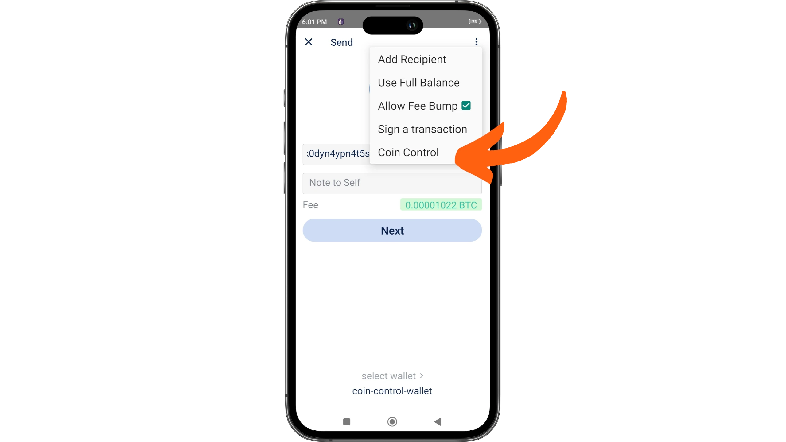

이 시점에서 파란색 Wallet은 모든 UTXO를 표시합니다. 금액뿐만 아니라 다양한 색상으로 그래픽으로 구분됩니다.

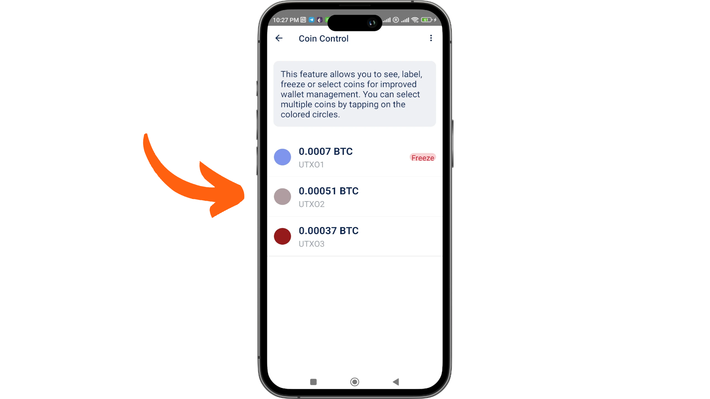

UTXO을 선택한 후 _코인 사용_을 선택합니다.

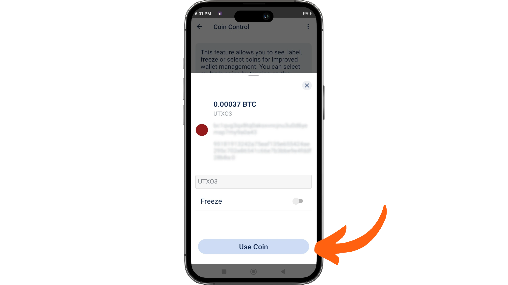

파란색 Wallet를 클릭하면 _송금_ 창으로 돌아가 트랜잭션 작성을 계속할 수 있습니다. 금액과 수수료를 조정한 후 _다음_을 선택합니다.

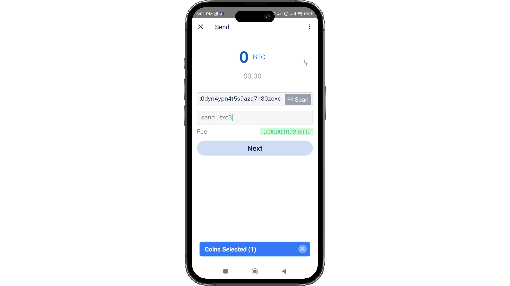

이 시점에서 평소처럼 거래를 종료할 수 있습니다.

#### UTXO 분리

블루 Wallet를 사용하면 UTXO를 분리하여 모바일 기기에서 사용할 수 없게 만들 수도 있습니다. 방금 설명한 절차에 따라 Coin 컨트롤에 액세스하고 UTXO을 선택한 후 _코인 사용_ 대신 _동결_을 선택합니다.

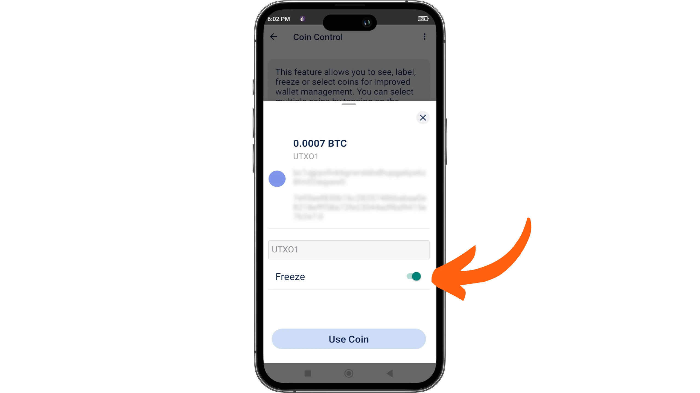

### 쌍절곤

쌍절곤의 모바일 버전은 사용자가 Coin을 제어할 수 있는 기능도 제공합니다. 모바일에서 이 앱을 사용하는 경우 앱을 열고 _지갑_ 메뉴로 이동합니다. 거기에서 _코인 보기_를 선택합니다.

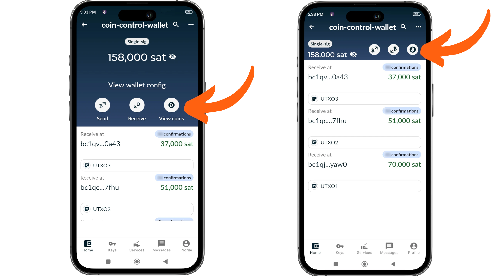

UTXO 목록이 표시되는 창에서 _선택_을 클릭합니다.

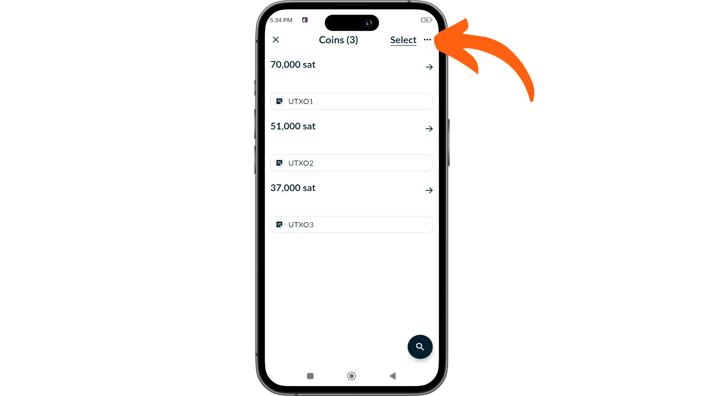

각 UTXO 옆에 선택 기능이 나타납니다. 데스크톱 버전에서와 마찬가지로 Nunchuk 모바일에서도 금액 옆에 있는 작은 사각형을 체크하여 수동으로 선택할 수 있습니다. 화면에 선택된 UTXO의 수와 사용 가능한 총 금액이 표시됩니다. 선택이 완료되면 왼쪽 하단에 있는 ₿ 기호를 클릭하면 트랜잭션 구축을 시작할 수 있습니다.

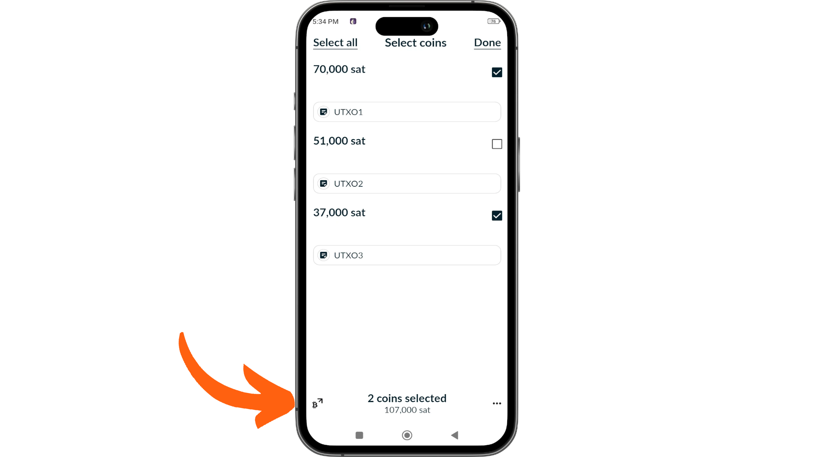

이제 금액을 선택하고 _계속_을 클릭하여 거래를 완료할 수 있습니다.

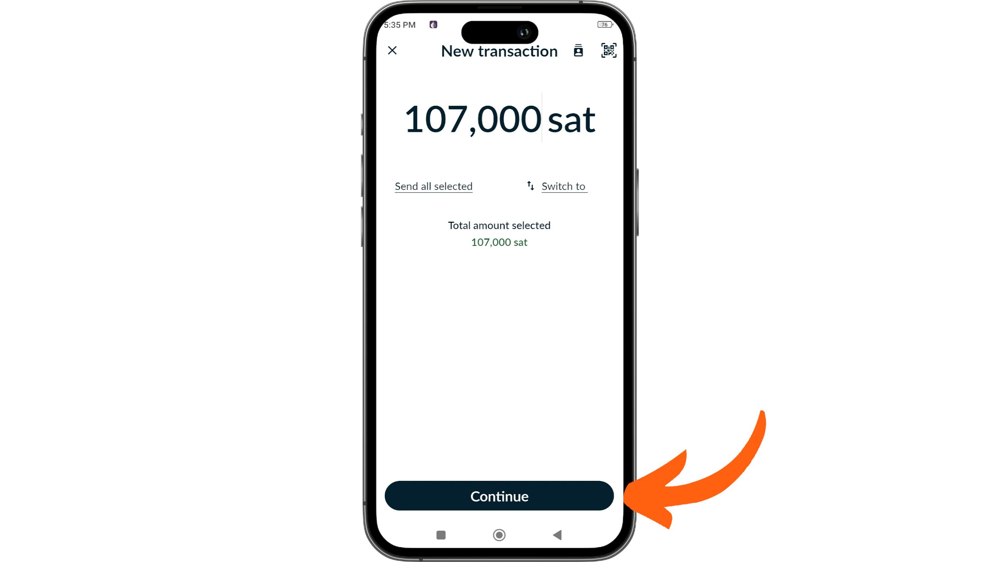

항상 하던 대로 계속하여 목적지 Address, 설명을 붙여넣고 요금 설정을 사용자 지정합니다.

#### UTXO 분리

모바일 쌍절곤으로 UTXO를 분리할 수도 있습니다. 전용 코인 목록 창에 액세스하여 분리하려는 UTXO 옆의 화살표를 선택합니다.

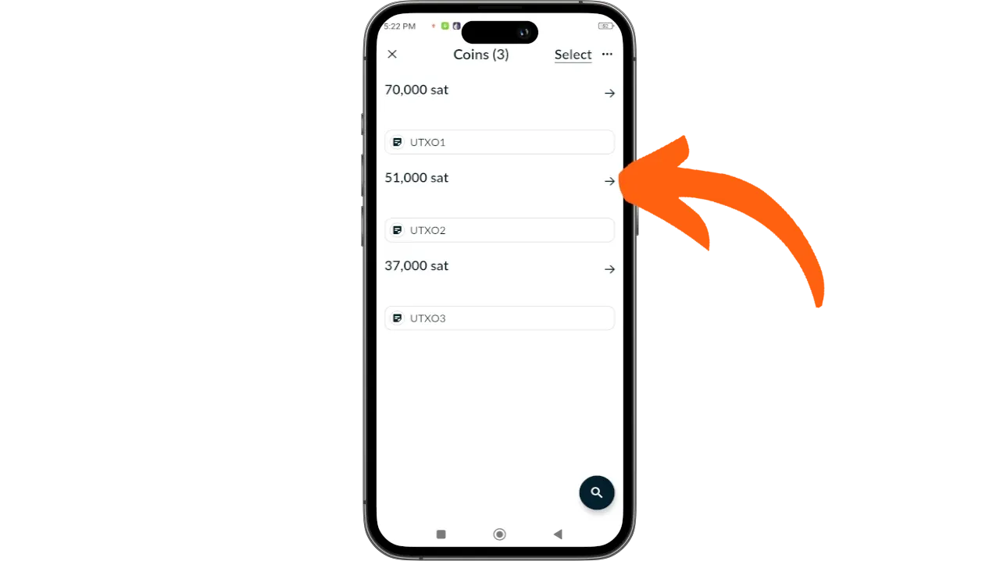

코인 세부정보_를 위한 공간이 표시되며, 여기서 _이 코인 잠그기_를 선택할 수 있습니다.

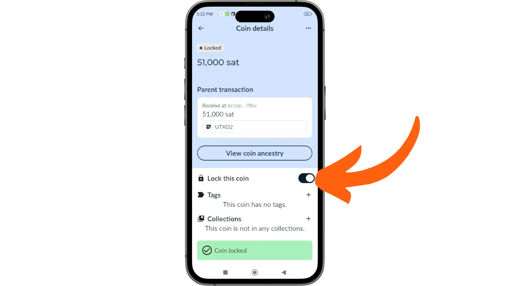

### Bitcoin 키퍼

Bitcoin Keeper는 이 가이드에서 마지막으로 소개할 Wallet입니다. 이 앱의 목적은 이러한 용도가 아니지만 Wallet 싱글사인으로 Coin를 제어하는 데 이 기능이 적용되는 것을 볼 수 있습니다. 휴대폰에서 Keeper를 설정한 후 실행하고 일부 자금이 들어 있는 Wallet를 엽니다. 메인 화면 중앙에서 _모든 코인 보기_를 클릭합니다.

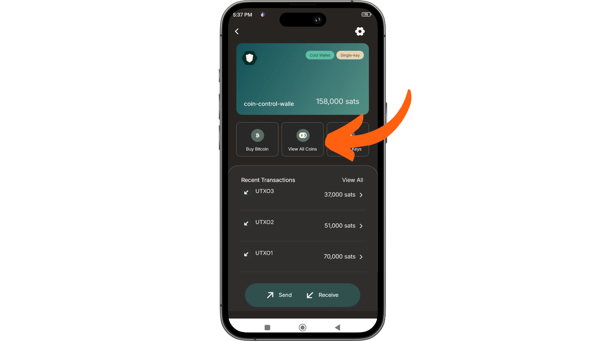

Keeper는 UTXO의 개요를 보여줍니다. 선택 화면에 액세스하려면 _선택하여 보내기_를 클릭합니다.

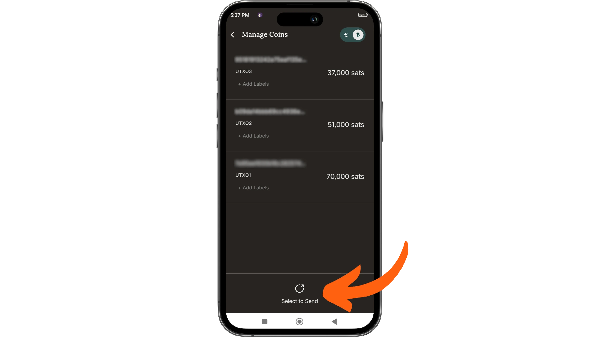

해당 명령을 클릭하여 코인을 선택 해제하여 코인을 선택할 수 있습니다. 완료되면 _보내기_를 클릭합니다.

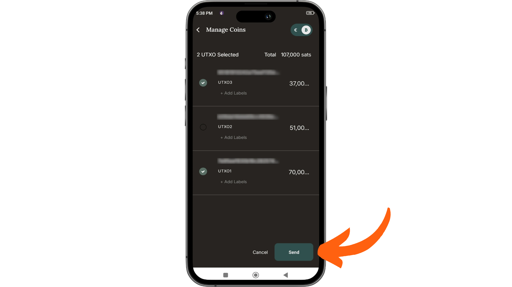

Bitcoin 키퍼는 _Send_ 메뉴로 바로 이동하여 선택한 UTXO로 트랜잭션을 빌드할 수 있습니다.

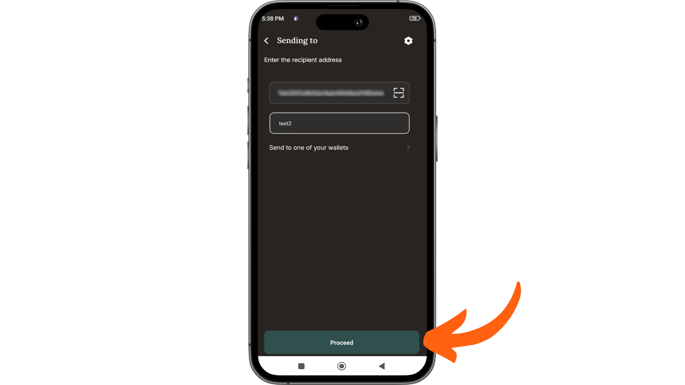

## Hardware Wallet

이 가이드에 소개된 각 소프트웨어 지갑은 시계 전용 Interface부터 하드웨어 지갑 중 하나에 연결할 수 있습니다. 즉, 오프라인 서명 장치에 대한 Coin 제어는 지금까지 살펴본 단계로 수행됩니다.

### 일반 권장 사항

Coin 컨트롤은 거래 입력을 선택하는 데 매우 효과적입니다. 자금을 구매/수령할 때 사토시의 출처를 잘 표시했다면 수동 선택이 훨씬 더 효율적입니다. 이 기술을 잘 배우고 싶으시다면 다음 튜토리얼을 참고하시기 바랍니다:

https://planb.network/tutorials/privacy/on-chain/utxo-labelling-d997f80f-8a96-45b5-8a4e-a3e1b7788c52

앞서 '유해 분리'에 대해 이야기한 적이 있습니다. 나중에 처리하기 위해 잔여물을 잠그고 프라이버시를 되찾으려면(Layer 2에서 스왑), 받을 때마다 '라벨'을 붙이는 데 신경을 써야 합니다. 지금까지 살펴본 소프트웨어 지갑 중 일렉트럼만이 UTXO 잔여물에 그래픽 색상을 입혀 한 눈에 알아볼 수 있도록 합니다. Sparrow과 같은 다른 지갑은 개별 UTXO의 파생 경로(`m/84'/0'/0'/1/11`)에 체인을 표시합니다.

이 기술을 효과적으로 적용하려면 송금한 잔돈에 항상 설명을 추가하세요: 송금한 사람(결제, 튜토리얼 또는 기타)은 잔돈과 관련된 Address를 알고 있으며, 함께 진행한 거래에서 나온 것이므로 본인 소유라는 것을 알고 있습니다!