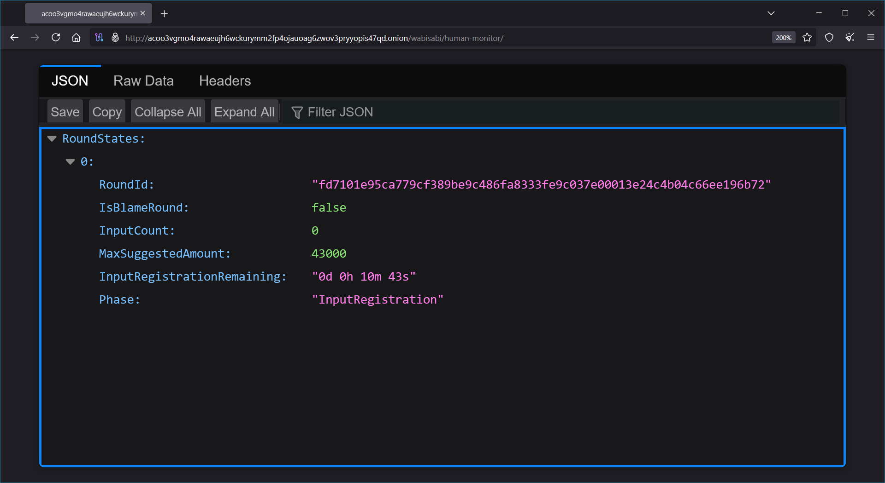
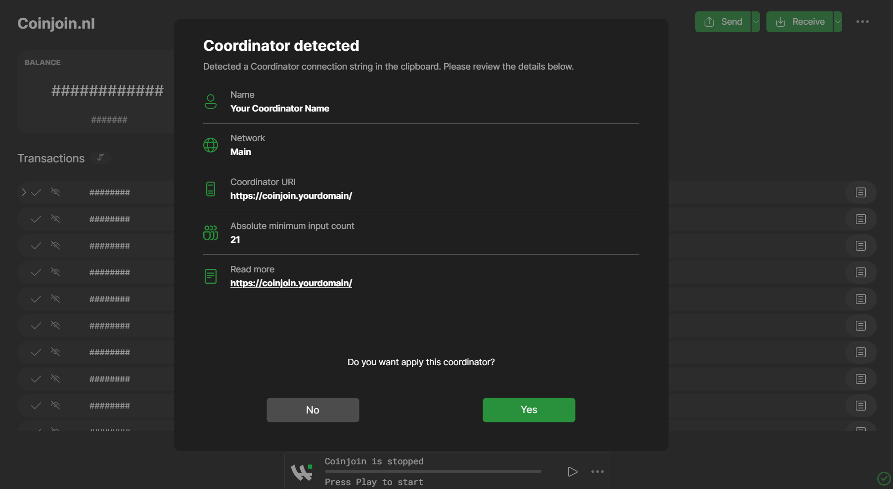

---

## 소개 👋


이 전문가 가이드에서는 코인조인 코디네이터, 즉 거래 수수료를 절약하거나 공동 거래에서 온체인 프라이버시를 강화하고자 하는 사람들을 한데 모으는 서버를 설정하는 데 도움을 드리고자 합니다. 더 이상 회사가 운영하는 코디네이터가 Wasabi Wallet에 번들로 제공되지 않으므로 사용자가 직접 선호하는 코디네이터 서버를 찾아서 선택해야 합니다. 코디네이터 수수료 0%를 제시하는 코디네이터는 소수에 불과하기 때문에, Wasabi Wallet 개발자들은 라즈베리 파이5와 같은 작은 하드웨어로 최대한 쉽게 커뮤니티 코디네이터를 운영할 수 있도록 노력해왔습니다. 현재 활동 중인 코디네이터 중 코디네이션 수수료 0%를 요구하는 코디네이터는 [리퀴사비](https://liquisabi.com), 더 나아가 [노스트르](https://github.com/Kukks/WasabiNostr)에서 확인할 수 있습니다.


## 요구 사항 🫴


- VPS(호스팅 노드) 또는 컴퓨터/서버(자체 호스팅 노드)
- 가지치기/전체 Bitcoin 코어 노드(v29.0으로 테스트)


선택 사항입니다:


- 노드로 트래픽을 전달하는 (하위)도메인(예: coinjoin.[yourdomain].io)


모든 단계를 자동화할 수 있는 것은 아니므로 명령줄 프롬프트와 bash에 대한 경험이 어느 정도 있는 것이 좋습니다.


하드웨어 측면에서는 다음과 같은 시스템을 갖추는 것이 좋습니다:


- 4개의 코어
- 16GB RAM
- 2TB SSD 또는 NVMe(전체 노드의 경우)/128GB SSD(pruned 노드의 경우)


이러한 요구 사항은 2TB NVMe 스틱의 경우 약 100달러의 스토리지 비용을 제외하고 Raspberry Pi 5로 120달러에 제공할 수 있습니다.


저렴한 VPS는 일반적으로 코어 1개와 4GB RAM만 제공하는데, 이는 블록 높이 911817에서 전체 비트코인 blockchain를 동기화하고 검증하기에는 너무 적은 양이라는 것을 알게 되었습니다.


스토리지 측면에서 풀 노드에는 최소 2TB의 디스크 스토리지가 필요하며, 가급적이면 SSD 또는 NVMe 유형이 좋습니다. blockchain를 가지치기할 때는 이보다 훨씬 작은 스토리지 드라이브(예: 128GB SSD)도 사용할 수 있습니다.


대규모(300개 이상의 입력) 코인 조인을 위한 코디네이터를 실행하려는 경우, 모든 서명 검증을 위해 더 빠른/새로운 코어와 더 높은 성능을 갖춘 시스템을 선택하는 것이 좋습니다.


## 설치 🛠️


노드에서 wallet 옆에 독립 실행형 실행 파일로 백엔드 및 코디네이터가 포함된 최신 릴리스 버전의 Wasabi Wallet을 다운로드하여 설치하려고 합니다.


최신 버전을 찾습니다: [Wasabi Wallet](https://github.com/WalletWasabi/WalletWasabi/releases)를 찾아 해당 키로 릴리스의 PGP 서명을 확인합니다: [PGP.txt](https://raw.githubusercontent.com/WalletWasabi/WalletWasabi/refs/heads/master/PGP.txt)


배포 세부 사항은 하드웨어(CPU 아키텍처) 및 선택한 OS에 따라 다르며, 아래는 Debian 기반 RaspiBlitz을 시작점으로 하는 Raspberry Pi(ARM-64)에 대한 세부 사항입니다. Nix를 사용하는 (X86-64) Ubuntu OS 배포에 대해서는 건너뛰세요.


설치 지침은 여기에서 확인하세요: [와사비 문서](https://docs.wasabiwallet.io/using-wasabi/InstallPackage.html)


### RaspiBlitz/Debian 배포


RaspiBlitz(v1.11로 테스트) 노드의 경우 소스 코드에서 구축한 배포 script을 사용할 수 있습니다: [home.admin/config.scripts/bonus.wasabi.sh](https://github.com/kravens/raspiblitz/blob/dev/home.admin/config.scripts/bonus.wasabi.sh)


### 간편한 배포


최소한의 배포를 위해 플랫폼의 실행 파일을 폴더에 추출하기만 하면 됩니다.

Debian/Ubuntu의 명령줄 코드 예시:


```
wget https://github.com/WalletWasabi/WalletWasabi/releases/download/v2.7.2/Wasabi-2.7.2.deb
wget https://github.com/WalletWasabi/WalletWasabi/releases/download/v2.7.2/Wasabi-2.7.2.deb.asc
wget https://raw.githubusercontent.com/WalletWasabi/WalletWasabi/refs/heads/master/PGP.txt
gpg --import PGP.txt
gpg --verify Wasabi-2.7.2.deb.asc Wasabi-2.7.2.deb
```


이렇게 하면 다음과 같은 유효한 서명 메시지가 표시됩니다:


```
gpg: Signature made Mon Nov 17 01:33:09 2025 CET
gpg:                using RSA key 6FB3872B5D42292F59920797856348328949861E
gpg: Good signature from "zkSNACKs <zksnacks@gmail.com>" [unknown]
gpg: WARNING: This key is not certified with a trusted signature!
gpg:          There is no indication that the signature belongs to the owner.
Primary key fingerprint: 6FB3 872B 5D42 292F 5992  0797 8563 4832 8949 861E
```


그리고 다운로드한 패키지를 설치하면 됩니다:


```
sudo apt install ./Wasabi-2.7.2.deb
```


## 구성 🧾


코디네이터를 실행하기 전에 Config.json 파일을 편집해야 합니다:


- Bitcoin RPC 자격 증명
- 기본 라운드 매개 변수
- 코디네이터 확장 공개 키(수집된 먼지를 받기 위해 새로운 SegWit wallet 생성)

**경고**: Taproot wallet를 사용하면 사용할 수 없는 UTXO이 생성됩니다! 여기서는 네이티브 세그윗 wallet를 사용하세요.


- 허용되는 입력 및 출력 주소 유형
- Nostr을 통한 퍼블리싱을 위한 아나운서 구성(이름, 설명, Uri, 최소 입력, nostr 릴레이, nostr 개인 키)


.onion 주소를 통해서만 액세스할 수 있는 코디네이터를 실행하거나 사용자 지정 클리어넷 도메인을 사용할 수 있습니다.


이 경로에서 구성 파일을 찾거나 만듭니다:


`~/.wallet와사비/코디네이터/Config.json`


명령을 사용하여 편집합니다:


```
sudo nano ~/.walletwasabi/coordinator/Config.json
```


이 예제 Config.json을 참조하세요:


```
{
"Network": "Main",
"MainNetBitcoinRpcUri": "http://localhost:8332",
"TestNetBitcoinRpcUri": "http://localhost:48332",
"RegTestBitcoinRpcUri": "http://localhost:18443",
"BitcoinRpcConnectionString": "your_bitcoin_rpcuser:your_bitcoin_rpcpassword",
"ConfirmationTarget": 21,
"DoSSeverity": "0.02",
"DoSMinTimeForFailedToVerify": "1d 21h 0m 0s",
"DoSMinTimeForCheating": "1d 0h 0m 0s",
"DoSPenaltyFactorForDisruptingConfirmation": 0.2,
"DoSPenaltyFactorForDisruptingSignalReadyToSign": 1.0,
"DoSPenaltyFactorForDisruptingSigning": 1.0,
"DoSPenaltyFactorForDisruptingByDoubleSpending": 3.0,
"DoSMinTimeInPrison": "0d 0h 20m 0s",
"MinRegistrableAmount": "0.000021",
"MaxRegistrableAmount": "1000.00",
"AllowNotedInputRegistration": true,
"StandardInputRegistrationTimeout": "0d 0h 21m 0s",
"BlameInputRegistrationTimeout": "0d 0h 3m 0s",
"ConnectionConfirmationTimeout": "0d 0h 1m 0s",
"OutputRegistrationTimeout": "0d 0h 1m 0s",
"TransactionSigningTimeout": "0d 0h 1m 0s",
"FailFastOutputRegistrationTimeout": "0d 0h 3m 0s",
"FailFastTransactionSigningTimeout": "0d 0h 1m 0s",
"RoundExpiryTimeout": "0d 0h 5m 0s",
"MaxInputCountByRound": 100,
"MinInputCountByRoundMultiplier": 0.21,
"MinInputCountByBlameRoundMultiplier": 0.21,
"RoundDestroyerThreshold": 375,
"CoordinatorExtPubKey": "xpub_fill_in_your_new_wallet_here",
"CoordinatorExtPubKeyCurrentDepth": 0,
"MaxSuggestedAmountBase": "100.00",
"RoundParallelization": 1,
"CoordinatorIdentifier": "CoinJoinCoordinatorIdentifier",
"AllowP2wpkhInputs": true,
"AllowP2trInputs": true,
"AllowP2wpkhOutputs": true,
"AllowP2trOutputs": true,
"AllowP2pkhOutputs": true,
"AllowP2shOutputs": true,
"AllowP2wshOutputs": true,
"DelayTransactionSigning": false,
"AnnouncerConfig": {
"CoordinatorName": "Your Coordinator Name",
"IsEnabled": true,
"CoordinatorDescription": "Privacy is a human right!",
"CoordinatorUri": "https://coinjoin.yourdomain/",
"AbsoluteMinInputCount": 21,
"ReadMoreUri": "https://coinjoin.yourdomain/",
"RelayUris": [
"wss://relay.primal.net"
],
"Key": "nsec_your_coordinator_nostr_privatekey"
},
"PublishAsOnionService": true,
"OnionServicePrivateKey": your_onion_service_private_key
}
```

### 토르 구성 🧅


OnionServicePrivateKey를 채우려면 먼저 생성해야 할 것입니다.


Wasabi Wallet을 처음 실행할 때 Config.json 파일에 ```"PublishAsOnionService": true,```를 설정하면 개인키를 생성합니다.


명령어로 코디네이터를 한 번 실행합니다:


```
ASPNETCORE_URLS="http://localhost:5001" wcoordinator
```


Onion의 숨겨진 서비스 주소를 확인하려면 코디네이터 로그에서 확인합니다:


```
cat ~/.walletwasabi/coordinator/Logs.txt | grep .onion
```


를 검색하면 다음과 같은 내용을 찾을 수 있습니다:


```
2026-01-09 21:21:21.210 [14] INFO       TorProcessManagerService.StartAsync (50)        Coordinator server listening on http://acoo3vgmo4rawaeujh6wckurymm2fp4ojauoag6zwov3pryyopis47qd.onion
```


.onion으로 끝나는 긴 URL은 숨겨진 서비스 주소 또는 CoordinatorUri입니다.


또는 코디네이터 구성 파일을 다시 확인하세요:


```
cat ~/.walletwasabi/coordinator/Config.json | grep CoordinatorUri
```


이제 자동으로 채워질 것입니다.


## 달리기 ⚡


모든 구성 매개변수가 설정되면 코디네이터 서비스를 실행하고 첫 번째 라운드 발표를 시작할 수 있습니다(🕶️)


명령어로 코디네이터를 시작하기만 하면 됩니다:


```
ASPNETCORE_URLS="http://localhost:5001" wcoordinator
```


토르 브라우저에서 .onion을 확인하여 현재 라운드와 등록된 UTXO/코인 수를 모니터링할 수 있습니다:


```
http://coinjoin.yourdomain/wabisabi/human-monitor/
```





### 선택 사항: 디버깅 코디네이터 서버


로그 파일에서 ```~/.walletwasabi/backend/Logs.txt```의 문제나 오류를 모니터링할 수 있습니다


일반적인 문제로는 RPC 연결 문제가 있으며, 이는 ```~/.bitcoin/bitcoin.conf``에서 활성화해야 합니다:


```
[main] # or [test] for testnet
rpcbind=127.0.0.1
rpcuser=your_bitcoin_rpcuser
rpcpassword=your_bitcoin_rpcpassword
```


### 선택 사항입니다: 백엔드 서버 실행


코디네이터와 함께 수수료 견적 및 차단 필터를 위해 연결할 자체 비트코인 노드가 없는 사용자를 위한 백엔드 서버를 제공할 수도 있습니다.


명령어로 이 서비스를 시작합니다:


```
wbackend
```


## 와사비 사용자를 코디네이터에게 초대하기 🫂


다른 사용자가 내 서비스를 찾을 수 있도록 nostr 아나운서를 사용하거나 도메인(클리어넷) 또는 숨겨진 서비스(.onion 링크)와 매직 링크를 공유하고 이와 같은 매개 변수를 둥글게 만들 수 있습니다:


```
name=Your%20Coordinator%20Name&network=main&coordinatorUri=https://coinjoin.yourdomain&coordinationFeeRate=0&readMore=https://coinjoin.yourdomain/&absoluteMinInputCount=21
```


사용자가 매직 링크를 복사하여 Wasabi Wallet을 열면 소프트웨어가 도메인 및 매개변수가 포함된 코디네이터 대화 상자를 자동으로 표시합니다.





💚🍣 비트코인 프라이버시 탈중앙화를 축하합니다 🕶️


와사비카](https://docs.wasabiwallet.io/FAQ/FAQ-Contribution.html#you-can-become-a-wasabika), Wasabi Wallet는 방어 전용입니다 🛡️