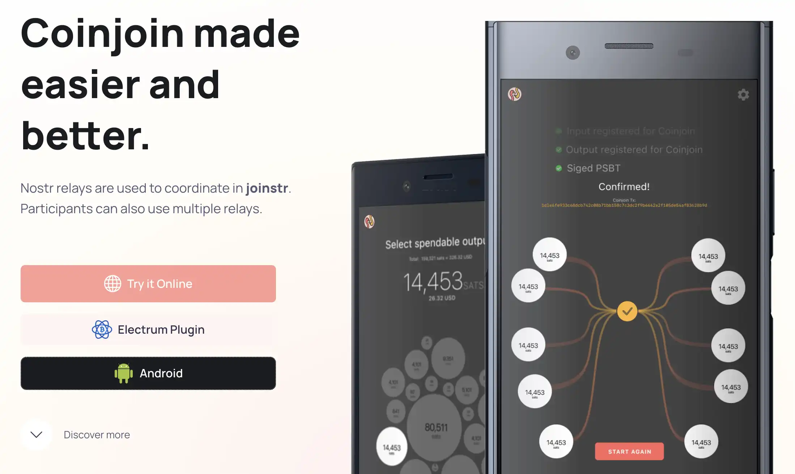


شفافیت بلاکچین Bitcoin امکان ردیابی تاریخچه تراکنش‌ها را فراهم می‌کند. CoinJoins با ترکیب چندین تراکنش همزمان، این پیوندها را می‌شکند و سطحی از محرمانگی قابل مقایسه با پول نقد را بازمی‌گرداند.


با این حال، راه‌حل‌های سنتی به یک هماهنگ‌کننده مرکزی به عنوان نقطه‌ای واحد از شکست متکی هستند. واسابی و سامورایی تحت فشارهای نظارتی در سال ۲۰۲۴ عملیات خود را متوقف کردند.


**Joinstr** با استفاده از شبکه غیرمتمرکز Nostr برای هماهنگی، این ضعف را از بین می‌برد. این برنامه منبع باز امکان CoinJoinهای واقعاً مستقل را فراهم می‌کند، جایی که هیچ مرجع مرکزی نمی‌تواند خدمات را سانسور، نظارت یا قطع کند.


## Joinstr چیست؟


Joinstr یک ابزار متن‌باز است که با استفاده از پروتکل Nostr به عنوان زیرساخت هماهنگی، رویکرد CoinJoins را متحول می‌کند. برخلاف راه‌حل‌های متمرکز که نیاز به یک سرور اختصاصی دارند، Joinstr به یک شبکه توزیع‌شده از رله‌های Nostr متکی است تا به شرکت‌کنندگان امکان هماهنگی مستقیم بین همتایان را بدهد.


**معماری غیرمتمرکز** : شبکه Nostr هماهنگ‌کننده مرکزی را جایگزین می‌کند. شرکت‌کنندگان با ارسال اعلان‌های رمزگذاری‌شده از طریق رله‌های Nostr، "استخرها" را ایجاد یا به آن‌ها می‌پیوندند. این اطلاعات (مقادیر، شرکت‌کنندگان، آدرس‌ها) برای رله‌ها غیرقابل فهم باقی می‌ماند و اطمینان حاصل می‌کند که هیچ نهاد مرکزی نمی‌تواند CoinJoins را نظارت، سانسور یا فیلتر کند.


**SIGHASH_ALL|ANYONECANPAY مکانیزم**: Joinstr از این پرچم امضای Bitcoin بهره می‌برد و به هر شرکت‌کننده اجازه می‌دهد تنها ورودی خود را امضا کند در حالی که تمام خروجی‌ها را اعتبارسنجی می‌کند. هر کاربر PSBT خود را به صورت محلی تولید می‌کند و سپس آن را از طریق Nostr توزیع می‌کند. هر کاربر PSBT خود را به صورت محلی تولید می‌کند، آن را امضا می‌کند و سپس از طریق Nostr توزیع می‌کند. بیت‌کوین‌های شما تا زمان امضای نهایی تحت کنترل انحصاری شما باقی می‌مانند.


**فلسفه**: Joinstr از اصول سایفرپانک Bitcoin پیروی می‌کند و سه هدف را دنبال می‌کند: **مقاومت در برابر سانسور** (هیچ مرجعی نمی‌تواند این سرویس را متوقف کند)، **غیر حضانتی کامل** (شما کلیدهای خصوصی خود را نگه می‌دارید)، و **برابری در رفتار** (هیچ UTXO نمی‌تواند مورد تبعیض قرار گیرد).


### ویژگی‌های اصلی


**استخرهای انعطاف‌پذیر**: برخلاف مقادیر ثابت، هر کاربر می‌تواند استخری با مقدار دقیق مورد نظر و تعداد شرکت‌کنندگان هدف ایجاد کند و استفاده از UTXO را بدون تقسیم مصنوعی بهینه‌سازی کند.


**هزینه‌های شفاف**: هیچ هزینه هماهنگی وجود ندارد. تنها هزینه‌های تراکنش Bitcoin به‌طور مساوی بین شرکت‌کنندگان تقسیم می‌شود (چند هزار ساتوشی برای هر نفر).


**زودگذری**: هیچ داده کاربری حفظ نمی‌شود. اطلاعات از طریق پیام‌های گذرای رمزگذاری‌شده Nostr منتقل می‌شوند و بلافاصله پس از تراکنش فراموش می‌شوند.


### پلتفرم‌های موجود


این آموزش بر روی **برنامه اندروید** تمرکز دارد، که تنها راه‌حل پایدار و توصیه‌شده در حال حاضر است. یک افزونه Electrum وجود دارد اما مشکلات سازگاری دارد که آن را ناپایدار می‌کند. یک رابط وب در حال توسعه است.


## پیکربندی هسته Bitcoin


Joinstr Android نیاز به اتصال به یک نود Bitcoin از طریق RPC دارد. ابتدا باید Bitcoin Core را روی کامپیوتر خود پیکربندی کنید تا اتصالات از تلفن شما را بپذیرد.


**توجه**: برای جزئیات بیشتر در مورد پیکربندی کامل Bitcoin Core، به آموزش‌های اختصاصی ما مراجعه کنید:


https://planb.academy/tutorials/node/bitcoin/bitcoin-core-linux-568c13a6-8746-4d63-8e95-f4a61c5ae0ed

https://planb.academy/tutorials/node/bitcoin/bitcoin-core-mac-windows-9684ab02-e0af-41c9-8102-86ac7c7727f3


### نیازمندی‌های شبکه


#### آدرس IP محلی خود را پیدا کنید


گوشی اندروید شما باید بتواند به گره Bitcoin شما در شبکه محلی دسترسی پیدا کند. آدرس IP کامپیوتر خود را پیدا کنید:


**در macOS** :


```bash
ifconfig | grep "inet " | grep -v "127.0.0.1" | awk '{print $2}' | head -n 1
```


جایگزین ساده:


```bash
ipconfig getifaddr en0
# or for WiFi: ipconfig getifaddr en1
```


**روی لینوکس** :


```bash
hostname -I | awk '{print $1}'
```


**در ویندوز** :


```cmd
ipconfig
```


آدرس IPv4 را پیدا کنید (فرمت `192.168.x.x` یا `10.0.x.x`)


### پیکربندی RPC


#### ویرایش bitcoin.conf


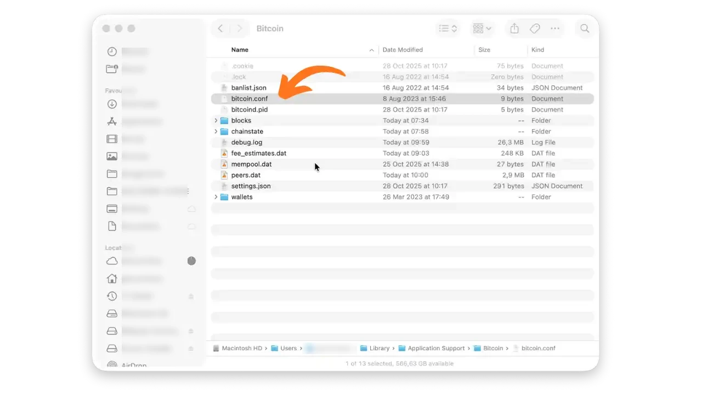


فایل `bitcoin.conf` خود را پیدا کنید:


- Linux**: `~/.bitcoin/bitcoin.conf
- macOS**: `~/Library/Application Support/Bitcoin/bitcoin.conf
- ویندوز**: `%APPDATA%\Bitcoin\bitcoin.conf`


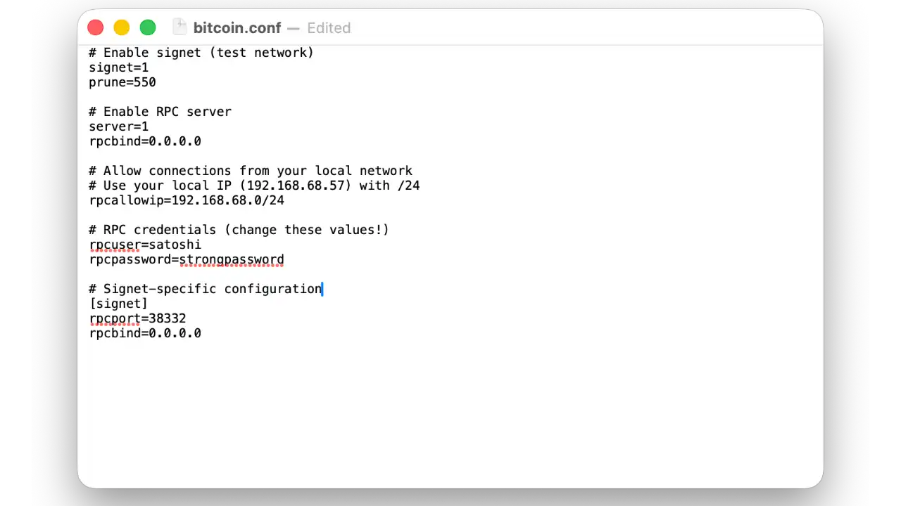


فایل را با ویرایشگر متن مورد علاقه خود باز کنید و این پیکربندی را برای فعال‌سازی سرور RPC اضافه کنید.


**پیکربندی پیشنهادی برای شروع (نشانک)** :


```conf
# Enable signet (test network)
signet=1
prune=550

# Enable the RPC server
server=1
rpcbind=0.0.0.0

# Allow connections from your local network
# Adjust according to your network (192.168.x.0/24 or 10.0.x.0/24)
rpcallowip=192.168.1.0/24

# RPC Credentials (CHANGE THESE VALUES!)
rpcuser=your_username
rpcpassword=your_strong_password

# Specific signet configuration
[signet]
rpcport=38332
```


پیکربندی **mainnet** (برای استفاده تولیدی) :


```conf
# RPC Server
server=1
rpcbind=0.0.0.0
rpcallowip=192.168.1.0/24

# RPC Credentials
rpcuser=your_username
rpcpassword=your_strong_password

# Mainnet Port
rpcport=8332
```


**مهم** :


- سیگنت به شدت توصیه می‌شود** برای اولین آزمایش‌های شما: این برنامه هنوز در حال توسعه (بتا) است و ممکن است هنوز اشکالاتی وجود داشته باشد. سیگنت به شما اجازه می‌دهد به صورت رایگان آزمایش کنید، بدون اینکه سرمایه واقعی را به خطر بیندازید.
- `192.168.1.0/24` را با زیرشبکه شبکه خود جایگزین کنید (به عنوان مثال، اگر IP شما `192.168.68.57` است، از `192.168.68.0/24` استفاده کنید)


**امنیت**: یک رمز عبور قوی ایجاد کنید :


```bash
openssl rand -base64 32
```


### راه‌اندازی


#### راه‌اندازی مجدد و بررسی کنید


۱. هسته Bitcoin را به‌طور کامل خاموش کنید


۲. برای اعمال تنظیمات، آن را مجدداً راه‌اندازی کنید.


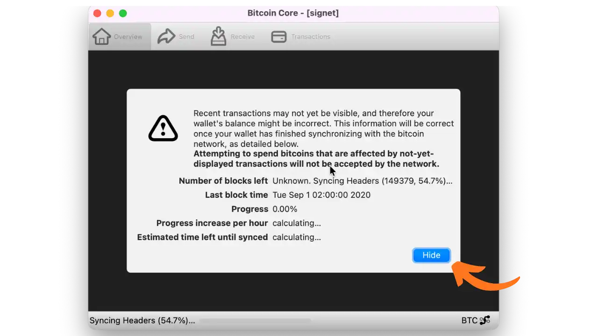


هنگامی که Bitcoin Core برای اولین بار راه‌اندازی می‌شود، بلاک‌چین نشانک را دانلود و همگام‌سازی خواهد کرد. این عملیات بسیار سریع‌تر از mainnet است (فقط چند دقیقه). لطفاً تا تکمیل همگام‌سازی صبر کنید و سپس ادامه دهید.


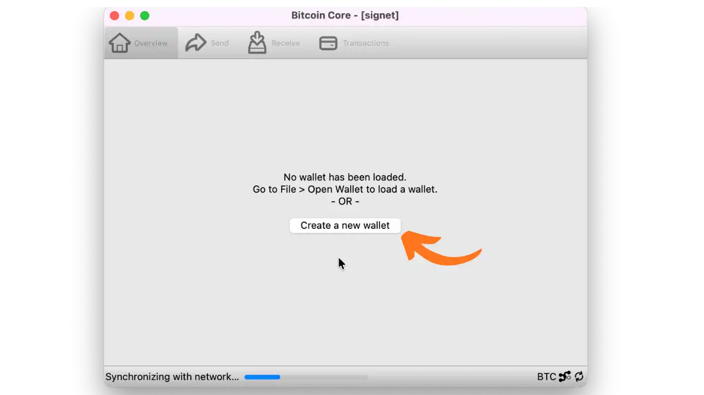


پس از همگام‌سازی، با کلیک بر روی "Create a new wallet" یک پورتفولیو جدید ایجاد کنید. نامی واضح مانند `tuto_joinstr_signet` به آن بدهید.


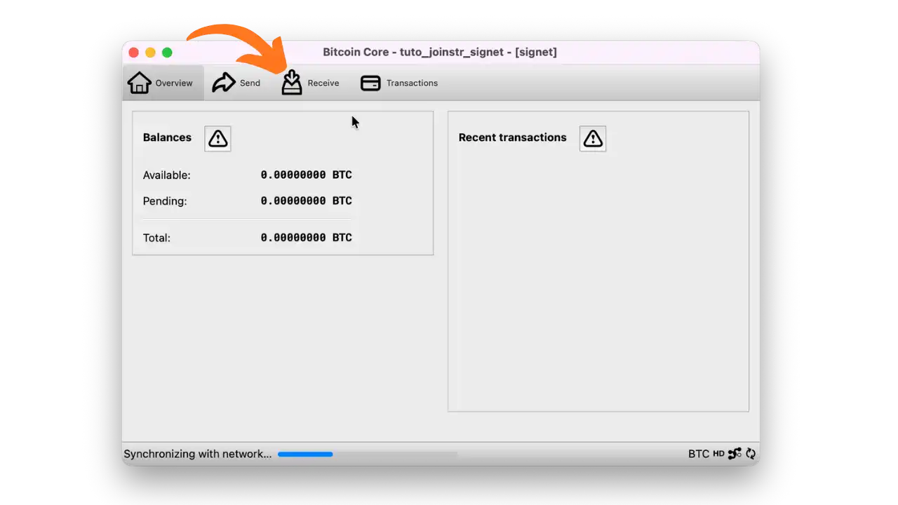


wallet شما اکنون ایجاد شده و آماده دریافت بیت‌کوین‌های نشان‌گذاری شده برای آزمایش است.


#### بیت‌کوین‌های نشان‌گذاری‌شده را دریافت کنید (آزمایش)


برای آزمایش Joinstr بر روی نشانک، به بیت‌کوین‌های آزمایشی رایگان نیاز دارید:


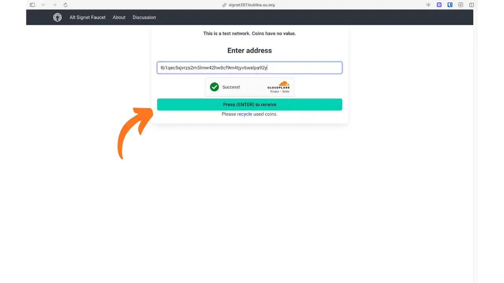


از یک نشانک عمومی مانند:


- [signetfaucet.com](https://signetfaucet.com)
- [alt.signetfaucet.com](https://alt.signetfaucet.com)
- [bookmark257.bublina.eu.org](https://signet257.bublina.eu.org)


در Bitcoin Core، generate یک آدرس دریافت جدید ("تب دریافت") ایجاد کنید، آن را کپی کرده و در فرم فاست جای‌گذاری کنید. در صورت لزوم کپچا را حل کنید. شما بیت‌کوین‌های نشان‌گذاری‌شده رایگان را در عرض چند ثانیه دریافت خواهید کرد.


## برنامه اندروید


### نصب


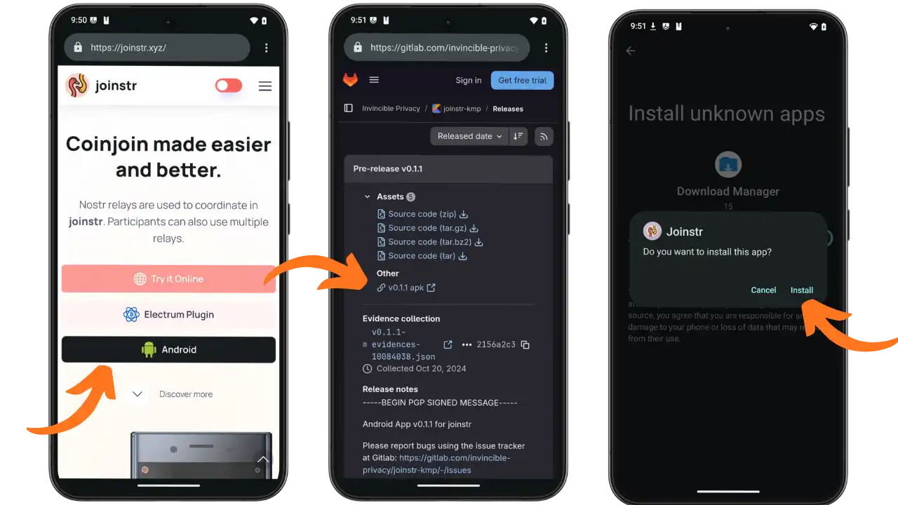


به [gitlab.com/invincible-privacy/joinstr-kmp/-/releases](https://gitlab.com/invincible-privacy/joinstr-kmp/-/releases) بروید تا آخرین نسخه APK را دانلود کنید. در مرورگر اندروید خود، فایل را دانلود کرده و سپس آن را باز کنید تا نصب آغاز شود. در صورت لزوم، باید نصب از منابع ناشناس را در تنظیمات امنیتی گوشی خود مجاز کنید.


### پیکربندی برنامه


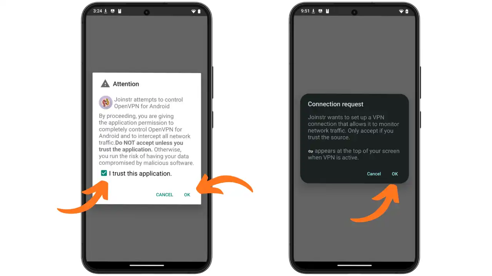


در اولین اجرای برنامه Joinstr، از شما درخواست مجوز برای کنترل VPN داخلی خواهد شد. هر دو درخواست مجوز را بپذیرید: کنترل OpenVPN و اتصال VPN. این مجوزها برای یکپارچه‌سازی VPN که از حریم خصوصی شبکه شما محافظت می‌کند، ضروری هستند.


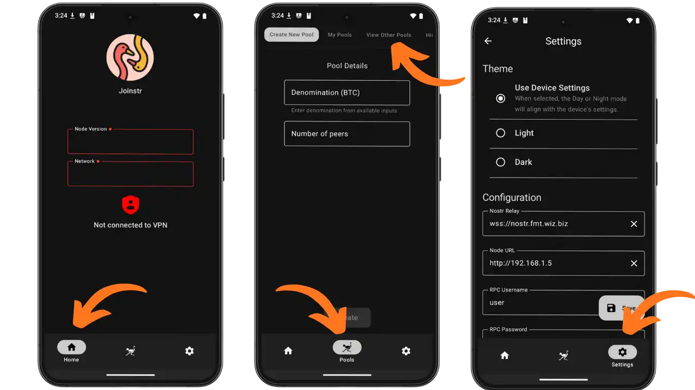


برنامه Joinstr به سه برگه اصلی تقسیم شده است:


- خانه**: صفحه اصلی
- استخرها**: ایجاد و مدیریت استخرهای CoinJoin
- تنظیمات**: پیکربندی برنامه


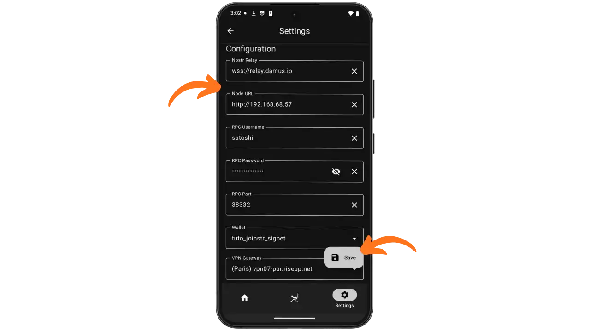


پیکربندی تنظیمات در زبانه "تنظیمات":


**1. Nostr Relay**: آدرس رله Nostr برای هماهنگی استخر


- مثال: `wss://relay.damus.io`
- رله‌های پیشنهادی دیگر: `wss://nos.lol`, `wss://relay.nostr.band`, `wss://nostr.fmt.wiz.biz`
- ⚠️ **مهم**: همه شرکت‌کنندگان باید از **همان رله Nostr** استفاده کنند تا بتوانند استخرهای یکسان را ببینند و به آن‌ها بپیوندند. اگر از رله‌ای متفاوت استفاده کنید، استخرهایی که در رله‌های دیگر ایجاد شده‌اند را نخواهید دید.


**2. URL نود**: آدرس IP نود Bitcoin شما (بدون پورت)


- قالب: `http://VOTRE_IP_LOCALE`
- مثال: `http://192.168.68.57`


**3. RPC Username** : نام کاربری تنظیم شده در `rpcuser=` بر روی bitcoin.conf شما


- مثال: `satoshi


**4. RPC Password** : گذرواژه تنظیم شده در `rpcpassword=` بر روی bitcoin.conf شما


**5. پورت RPC** : پورت RPC بسته به شبکه


- Mainnet** : `8332`
- نشانک**: `38332`


**6. Wallet**: Bitcoin هسته پرتفوی را انتخاب کنید که شامل UTXOهایی است که باید مخلوط شوند.


- مثال: `tuto_joinstr_signet`


**7. دروازه VPN**: یک سرور VPN Riseup را انتخاب کنید


- مثال: `(پاریس) vpn07-par.riseup.net`
- سایر موارد موجود: آمستردام، سیاتل، و غیره.
- ⚠️ **مهم**: همه شرکت‌کنندگان در یک مجموعه باید از **همان دروازه VPN** برای شرکت در CoinJoin استفاده کنند. در طول دور مخلوط کردن، همه شرکت‌کنندگان باید با همان آدرس IP خروجی ظاهر شوند تا از تحلیل شبکه که شرکت‌کنندگان را مرتبط می‌کند، جلوگیری شود.


برنامه Joinstr **به صورت بومی** با Riseup VPN یکپارچه می‌شود و هماهنگی بین شرکت‌کنندگان را ساده‌تر می‌کند.


**مهم** :


- مطمئن شوید که تلفن و رایانه شما به یک شبکه WiFi محلی متصل هستند.
- اتصال VPN به‌طور خودکار هنگام شرکت در یک استخر فعال خواهد شد.
- روی **"ذخیره"** کلیک کنید پس از اینکه همه پارامترها را تنظیم کردید.


## استفاده عملی


### ایجاد یا پیوستن به یک استخر


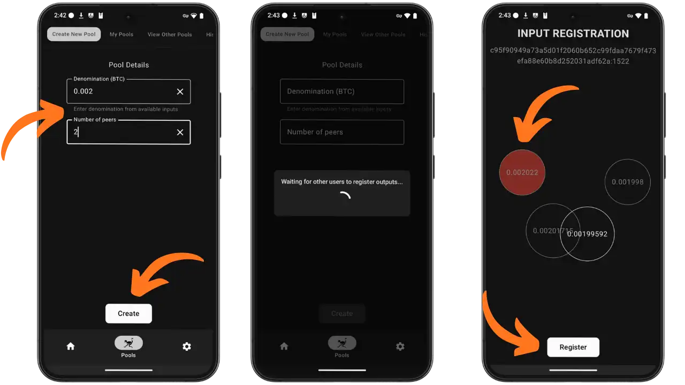


شما دو گزینه برای شرکت در CoinJoin دارید:


**گزینه 1: ایجاد یک استخر جدید**


روی "Create New Pool" در زبانه "Pools" کلیک کنید. مقدار را به BTC مشخص کنید (مثلاً 0.002 BTC) و تعداد شرکت‌کنندگان مورد نظر را تعیین کنید (حداقل 2، توصیه می‌شود 3-5 برای ناشناس بودن بیشتر). برنامه سپس منتظر می‌ماند تا کاربران دیگر به استخر شما بپیوندند. هنگامی که تعداد مورد نیاز به دست آمد، فرآیند ثبت خروجی به طور خودکار آغاز می‌شود و شما باید UTXO خود را برای مخلوط کردن انتخاب کرده و روی "Register" کلیک کنید.


**⏱️ مهم**: استخرها پس از **۱۰ دقیقه** عدم فعالیت منقضی می‌شوند. اگر تعداد شرکت‌کنندگان مورد نیاز به حد نصاب نرسد، استخر به‌طور خودکار بسته خواهد شد.


**گزینه 2: به یک استخر موجود بپیوندید**


در زبانه "مشاهده استخرهای دیگر"، استخرهای موجود که توسط کاربران دیگر ایجاد شده‌اند را مرور کنید. استخری را که با مقدار شما مطابقت دارد انتخاب کرده و به آن بپیوندید. اطمینان حاصل کنید که همان رله Nostr و دروازه VPN را مانند سایر شرکت‌کنندگان پیکربندی کرده‌اید (به بخش پیکربندی مراجعه کنید).


**قانون انتخاب UTXO**: UTXO شما باید کمی بالاتر از نام‌گذاری استخر باشد (بین +500 و +5000 مازاد sats).


**مثال**: برای یک استخر 0.002 BTC (200,000 sats)، از یک UTXO بین 200,500 و 205,000 sats استفاده کنید.


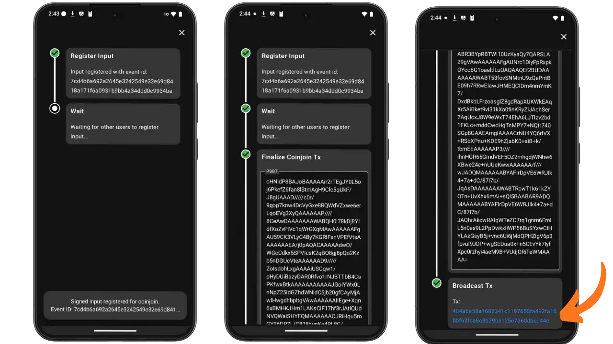


سپس فرآیند **کاملاً خودکار** است: پس از ثبت ورودی شما، برنامه منتظر می‌ماند تا همه شرکت‌کنندگان ورودی‌های خود را ثبت کنند. پس از ثبت همه ورودی‌ها، PSBT ایجاد می‌شود، به‌طور خودکار با کلیدهای شما امضا می‌شود و سپس با امضاهای سایر شرکت‌کنندگان ترکیب می‌شود. در نهایت، تراکنش کامل در شبکه Bitcoin پخش می‌شود. پس از تکمیل پخش، TXID (شناسه تراکنش) را دریافت می‌کنید. هیچ دستکاری دستی PSBT در اندروید لازم نیست.


### تأیید on-chain


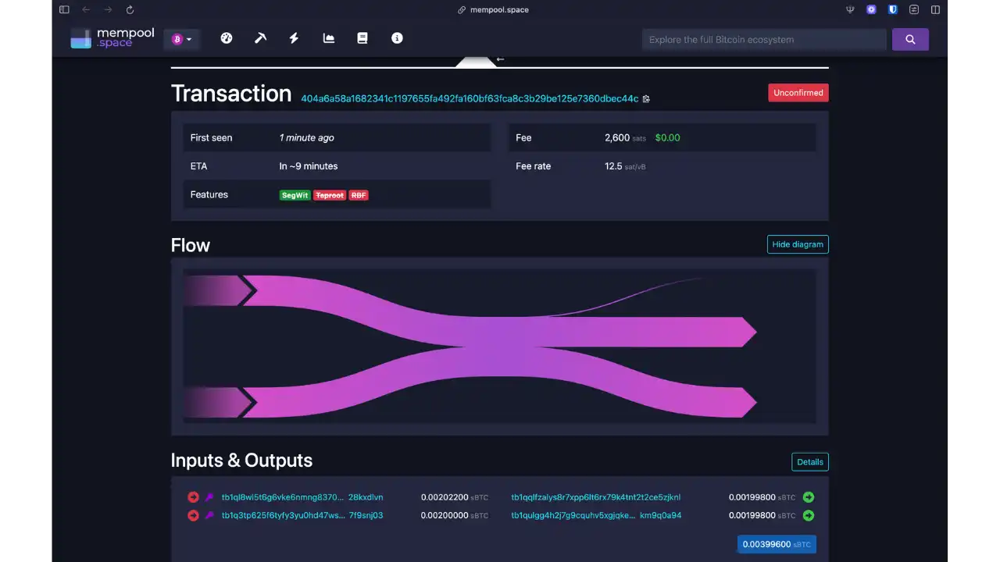


به محض اینکه تراکنش پخش شد، شما TXID (شناسه تراکنش) را دریافت خواهید کرد. آن را در [mempool.space](https://mempool.space) یا مرورگر مورد علاقه خود مشاهده کنید. برای آزمایش روی یک نشانک، از [mempool.space/signet](https://mempool.space/signet) استفاده کنید.


می‌توانید مشاهده کنید:


- N ورودی**: یک ورودی برای هر شرکت‌کننده (در مثال ما، 2 ورودی)
- N خروجی یکسان**: مقدار دقیق ارزش اسمی (در اینجا، 2 خروجی هر کدام به مقدار 0.00199800 BTC)
- فلوچارت**: mempool.space به‌صورت بصری ترکیب ورودی‌ها و خروجی‌ها را نمایش می‌دهد
- ویژگی‌ها** : تراکنش می‌تواند به‌عنوان SegWit، Taproot، RBF، و غیره شناسایی شود.


از آنجا که همه خروجی‌های اصلی دارای مقدار یکسانی هستند، **تعیین اینکه کدام به چه کسی تعلق دارد غیرممکن است**. این اصل اساسی CoinJoin است: غیرقابل تشخیص بودن خروجی‌ها.


**نمونه تراکنش سیگنت** : [404a6a58a1682341c1197655fa492fa160bf63fca8c3b29be125e7360dbec44c](https://mempool.space/signet/tx/404a6a58a1682341c1197655fa492fa160bf63fca8c3b29be125e7360dbec44c)


**لطفاً توجه داشته باشید**: اگر UTXOهای شما بزرگتر از نام‌گذاری استخر بودند، شما خروجی‌های مبادله‌ای (مازاد) خواهید داشت. این UTXOهای مبادله‌ای قابل ردیابی باقی می‌مانند و باید به صورت جداگانه از خروجی‌های ناشناس شما مدیریت شوند. هرگز آن‌ها را با خروجی‌های ترکیب‌شده خود ترکیب نکنید.


## بسته‌های کیفیت و ناشناس بودن CoinJoin


بهره‌وری CoinJoin با **anonset** آن اندازه‌گیری می‌شود: تعداد خروجی‌های با ارزش یکسان که توسط تراکنش تولید می‌شود. هرچه این عدد بالاتر باشد، تعیین اینکه کدام ورودی با کدام خروجی مطابقت دارد دشوارتر است.


در حال حاضر، Joinstr به طور متوسط استخرهایی با **2 تا 5 شرکت‌کننده** ایجاد می‌کند. این ارقام کمتر از هماهنگ‌کننده‌های متمرکز سنتی مانند Wasabi (50-100 شرکت‌کننده) یا Whirlpool (5-10 شرکت‌کننده) است، اما این بهایی است که برای غیرمتمرکز بودن پرداخت می‌شود.


💡 **برای درک مجموعه‌های ناشناس و محاسبه آن‌ها به‌طور کامل**، به دوره کامل ما مراجعه کنید: [مجموعه‌های ناشناس](https://planb.academy/fr/courses/65c138b0-4161-4958-bbe3-c12916bc959c/les-ensembles-danonymat-be1093dc-1a74-40e5-9545-2b97a7d7d431).


### Joinstr در مقابل سایر CoinJoin‌ها


| جنبه | Wasabi | Whirlpool/Ashigaru | JoinMarket | **Joinstr** |
|--------|--------|--------------------|------------|-------------|
| **شرکت‌کنندگان در هر استخر** | 50-100 | 5-10 | متغیر (P2P) | **2-5** |
| **هماهنگ کننده** | متمرکز (بسته 2024) | متمرکز (فعال) | P2P maker/taker | **هیچ کدام (Nostr)** |
| **مقاومت در برابر سانسور** | ضعیف | متوسط | بسیار زیاد | **بسیار زیاد** |
| **هزینه‌های هماهنگی** | درصد | هزینه ورودی | پرداخت شده به سازندگان | **هیچ کدام** |
| **تبعیض UTXO** | بله (لیست سیاه) | خیر | خیر | **خیر** |

💡 **راه‌حل‌های فعال دیگر CoinJoin** :


- Ashigaru**: پیاده‌سازی متن‌باز پروتکل Whirlpool با هماهنگ‌کننده مرکزی اما قابل استقرار به صورت غیرمتمرکز. پس از توقیف Samourai Wallet در سال 2024 به کار خود ادامه می‌دهد.
- JoinMarket**: راه‌حل غیرمتمرکز P2P بدون هماهنگ‌کننده مرکزی، بر اساس مدل کسب‌وکار سازنده/گیرنده که در آن "سازندگان" نقدینگی فراهم می‌کنند و توسط "گیرندگان" جبران می‌شوند.


https://planb.academy/tutorials/privacy/on-chain/ashigaru-terminal-9a0d46d3-33b9-4c64-84c5-bfa25b3a0add

**معامله‌ی اساسی**: Joinstr و JoinMarket تنها دو راه‌حل بدون هماهنگ‌کننده مرکزی هستند. JoinMarket از مدل کسب‌وکار P2P با انگیزه‌های مالی استفاده می‌کند، در حالی که Joinstr از Nostr برای هماهنگی بدون هزینه استفاده می‌کند. Joinstr ناشناس بودن بزرگ‌مقیاس فوری را به نفع سادگی (بدون مدیریت سازنده/گیرنده) و عدم وجود کامل هزینه‌های هماهنگی قربانی می‌کند.


**توصیه عملی**: برای جبران استخرهای کوچکتر، چندین دور متوالی CoinJoin را با شرکت‌کنندگان مختلف اجرا کنید. دورهای خود را فاصله‌گذاری کنید و بین هر دور رله‌های Nostr را تغییر دهید تا حداکثر محرمانگی خود را به دست آورید.


لطفاً برای کسب اطلاعات بیشتر در این زمینه به دوره کامل ما در مورد حریم خصوصی بیت‌کوین مراجعه کنید:


https://planb.academy/courses/65c138b0-4161-4958-bbe3-c12916bc959c

## مزایا و محدودیت‌ها


### نکات برجسته


**حریم خصوصی پیشرفته**: ترکیب رمزنگاری ارتباطات Nostr، VPN مشترک بین شرکت‌کنندگان، و استفاده توصیه‌شده از Tor، محافظتی چندلایه ایجاد می‌کند که عبور از آن دشوار است.


**هزینه‌های شفاف و حداقلی**: هیچ هزینه هماهنگی وجود ندارد، تنها هزینه‌های mining به‌طور عادلانه بین شرکت‌کنندگان تقسیم می‌شود. هیچ درصدی توسط هیچ اپراتوری دریافت نمی‌شود.


### محدودیت‌هایی که باید در نظر گرفت


- نقدینگی متغیر**: استخرهای کوچکتر، می‌توانند منتظر بمانند تا شرکت‌کنندگان گرد هم آیند
- پروژه در حال پیشرفت**: برنامه در نسخه بتا، احتمال وجود اشکال. ابتدا با مقادیر کم روی نشانک آزمایش کنید.
- حملات Sybil**: امکان کنترل چندین شرکت‌کننده در استخر توسط یک حریف


## بهترین روش‌ها


**جداسازی UTXO**: هرگز یک UTXO مخلوط را با یک نمونه غیرمخلوط ترکیب نکنید. از یک پورتفولیو جداگانه برای خروجی‌های ناشناس خود استفاده کنید.


**چندین دور ضروری**: حداقل 3 دور متوالی با شرکت‌کنندگان مختلف انجام دهید. مقادیر و زمان‌بندی‌ها را تغییر دهید تا از ایجاد الگوها جلوگیری شود. دورها را با فاصله چند ساعت از هم انجام دهید.


**محافظت از شبکه**: به صورت سیستماتیک از تور علاوه بر VPN داخلی استفاده کنید. برای هر جلسه مهم، کلیدهای موقت Nostr تولید کنید.


**پیشرفت محتاطانه**: با مقادیر کم نشانک‌گذاری را شروع کنید.


## نتیجه‌گیری


Joinstr یک راه‌حل حریم خصوصی Bitcoin به‌طور واقعی غیرمتمرکز را ارائه می‌دهد. با استفاده از Nostr برای هماهنگی، وابستگی به هماهنگ‌کنندگان مرکزی را از بین می‌برد و در عین حال حاکمیت کاربر را حفظ می‌کند.


**برای کاربرانی که به مقاومت در برابر سانسور اهمیت می‌دهند و آماده‌اند چندین دور CoinJoin را برای جبران استخرهای کوچکتر انجام دهند.


در پس‌زمینه‌ای از افزایش نظارت مالی، ابزارهای غیرمتمرکز برای حفاظت از حریم خصوصی ضروری می‌شوند.


## منابع


### مستندات رسمی


- [وب‌سایت رسمی Joinstr](https://joinstr.xyz)
- [مستندات کاربر](https://docs.joinstr.xyz/users/using-joinstr)
- [مستندات فنی](https://docs.joinstr.xyz/overview/how-does-it-work)
- [کد منبع GitLab](https://gitlab.com/invincible-privacy/joinstr)
- [برنامه اندروید](https://gitlab.com/invincible-privacy/joinstr-kmp/-/releases)


### آموزش‌ها


- [آموزش افزونه Electrum](https://uncensoredtech.substack.com/p/tutorial-electrum-plugin-for-joinstr) - راهنمای کامل توسط Uncensored Tech


### انجمن و پشتیبانی


- [گروه Joinstr تلگرام](https://t.me/joinstr) - پشتیبانی جامعه و گوشه‌های نشانک‌گذاری
- [بحث فنی درباره DelvingBitcoin](https://delvingbitcoin.org/t/who-will-run-the-coinjoin-coordinators/934)


### ابزارهای اضافی


- [نشانک Faucet](https://signetfaucet.com) - بیت‌کوین‌های آزمایشی رایگان
- [Alt Signet Faucet](https://alt.signetfaucet.com) - جایگزین Faucet
- [Mempool.space](https://mempool.space) - Block explorer با تحلیل حریم خصوصی