Der schlimmste Datenschutzfehler, den Sie bei Bitcoin machen können, ist die Wiederverwendung von Adressen. Jedes Mal, wenn dieselbe Adresse mehrere Zahlungen erhält, werden diese Transaktionen miteinander verknüpft, so dass die Welt einen Überblick über Ihre Transaktionen erhält. Es wird daher dringend empfohlen, dass Sie immer eine eindeutige generate-Adresse für jede Quittung verwenden. Für einige Bitcoin-Anwendungen ist dies jedoch keine einfache Angelegenheit.

BIP47, vorgeschlagen von Justus Ranvier im Jahr 2015, bietet eine elegante Antwort auf dieses Problem. Es führt das Konzept eines **wiederverwendbaren Zahlungscodes** ein: eine eindeutige Kennung, die es ermöglicht, eine praktisch unbegrenzte Anzahl von Onchain-Bitcoin-Zahlungen zu empfangen, ohne jemals eine Adresse wiederzuverwenden. Dank eines kryptografischen Mechanismus, der auf einem ECDH-Austausch (*Diffie-Hellman auf elliptischen Kurven*) basiert, führt jede Zahlung an denselben Code zu einer leeren Adresse, die spezifisch für die Beziehung zwischen Absender und Empfänger ist.

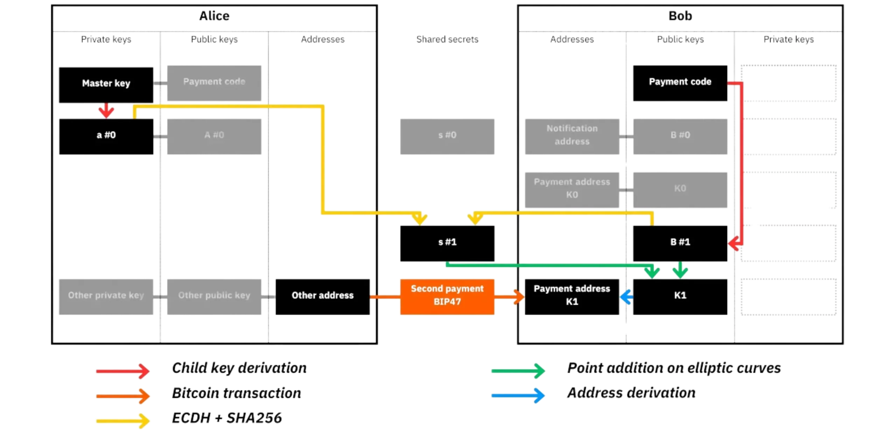

Dieses BIP47-Prinzip wird insbesondere von **PayNym** umgesetzt, dem ursprünglich von Samourai Wallet entwickelten und jetzt von Ashigaru übernommenen System. In diesem Tutorial wird gezeigt, wie Sie Ihr PayNym aktivieren, Zahlungscodes mit einem Korrespondenten austauschen und Transaktionen durchführen können, ohne eine Adresse erneut zu verwenden.

Ich werde hier nicht auf die detaillierte Funktionsweise des BIP47 eingehen. Wenn Sie sich eingehender mit dem Thema befassen möchten, lesen Sie bitte Kapitel 6.6 meines BTC 204-Schulungskurses.

https://planb.academy/courses/65c138b0-4161-4958-bbe3-c12916bc959c

## Voraussetzungen

Um dieser Anleitung folgen zu können, benötigen Sie lediglich ein wallet auf der Ashigaru-App. Wenn Sie nicht wissen, wie Sie die Anwendung herunterladen, überprüfen, installieren oder ein wallet erstellen, empfehle ich Ihnen, zuerst dieses Tutorial zu lesen:

https://planb.academy/tutorials/wallet/mobile/ashigaru-9f903b55-2e55-4b06-9627-80f8e178158f

## PayNym anfordern

Der erste Schritt besteht darin, Ihren PayNym zu beantragen. Dieser Vorgang muss nur einmal pro wallet durchgeführt werden. Dabei wird Ihr BIP47-Zahlungscode, der aus Ihrer seed abgeleitet wurde (`PM...`), mit einer eindeutigen Kennung verknüpft, die für die PayNym-Implementierung spezifisch ist. Diese kürzere, besser lesbare Kennung kann dann an Ihre Korrespondenten übermittelt werden, um den Austausch zu erleichtern, ohne den langen, vollständigen BIP47-Code weitergeben zu müssen.

Klicken Sie dazu auf Ihr PayNym-Bild oben links auf der Benutzeroberfläche und dann auf Ihren Zahlungscode `PM...`.

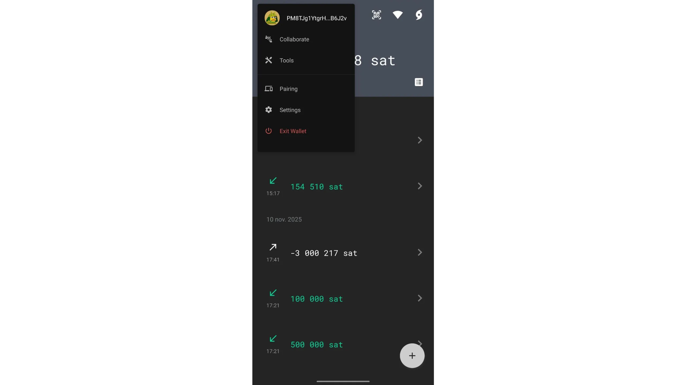

Klicken Sie dann auf die drei kleinen Punkte in der oberen rechten Ecke und wählen Sie "PayNym anfordern".

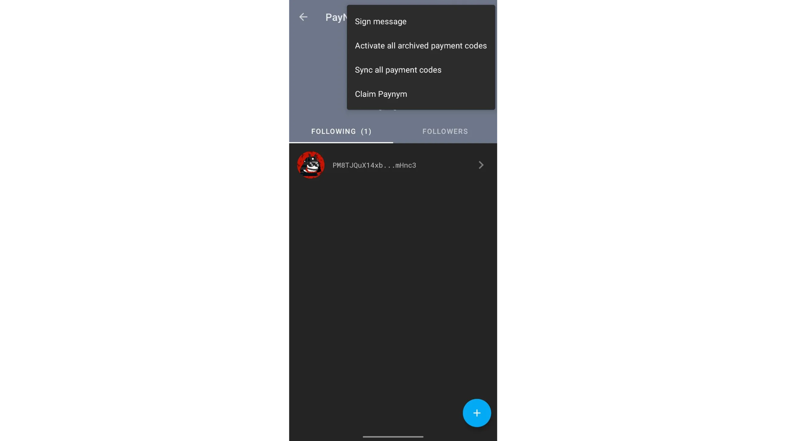

Bestätigen Sie, indem Sie auf die Schaltfläche `CLAIM YOUR PAYNYM` klicken.

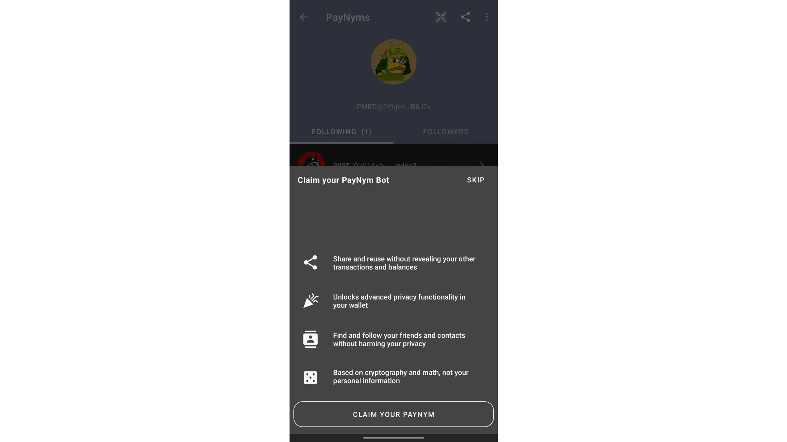

Aktualisieren Sie die Seite: Ihre PayNym-ID wird nun unter Ihrem Bild angezeigt, direkt über Ihrem BIP47-Zahlungscode.

Ihr PayNym ist nun aktiv und kann für Ihre ersten BIP47-Transaktionen verwendet werden.

## Mit einem Kontakt verbinden

Es gibt zwei Arten von Verbindungen zwischen PayNym: **Folgen** und **Verbinden**. Der Vorgang "Folgen" ist völlig kostenlos. Sie stellt eine Verbindung zwischen zwei PayNym über Soroban her, ein Tor-basiertes verschlüsseltes Kommunikationsprotokoll, das vom Samourai-Team entwickelt und von Ashigaru übernommen wurde. Diese Verbindung ermöglicht es zwei Nutzern, die einander folgen, Informationen privat auszutauschen, insbesondere um kollaborative Transaktionen wie Stowaway oder StonewallX2 zu koordinieren, auf die wir in einem anderen Tutorial eingehen werden. Dieser Schritt ist spezifisch für PayNym und ist nicht Teil des BIP47-Protokolls.

Der Verbindungsvorgang (`connect`) hingegen erfordert eine on-chain-Transaktion. Sie besteht in der Durchführung einer Benachrichtigungstransaktion, wie sie in BIP47 definiert ist. Diese Bitcoin-Transaktion enthält Metadaten in einer "OP_RETURN"-Ausgabe, die einen verschlüsselten Kommunikationskanal zwischen dem Zahler und dem Empfänger herstellt. Über diesen Kanal kann der Zahler generate eindeutige Empfängeradressen für jede Zahlung angeben, und der Empfänger wird über diese Zahlungen benachrichtigt und kann generate die mit den Adressen verbundenen privaten Schlüssel verwenden, um diese Mittel später auszugeben.

Dieser Benachrichtigungsvorgang ist kostenpflichtig: die Gebühr mining und 546 sats, die an die Benachrichtigungsadresse des Empfängers gesendet wird, um die Verbindung zu signalisieren. Sobald die Verbindung hergestellt ist, kann eine fast unendliche Anzahl von Zahlungen über BIP47 getätigt werden.

Kurz und bündig:

- follow": kostenlos, stellt verschlüsselte Kommunikation über Soroban her, nützlich für Ashigarus kollaborative Tools;
- verbinden": kostenpflichtig, führt die BIP47-Meldungstransaktion durch, um den Kanal zwischen Zahler und Empfänger zu aktivieren.

Um mit einem PayNym zu interagieren, müssen Sie ihn zunächst *verfolgen*. Dies ist der erste Schritt vor dem Aufbau einer BIP47-Verbindung. Angenommen, Sie möchten wiederkehrende Zahlungen an PayNym `+instinctiveoffer10` senden.

Rufen Sie Ihre PayNym-Seite auf Ashigaru auf und klicken Sie dann auf die Schaltfläche "+" unten rechts auf der Benutzeroberfläche.

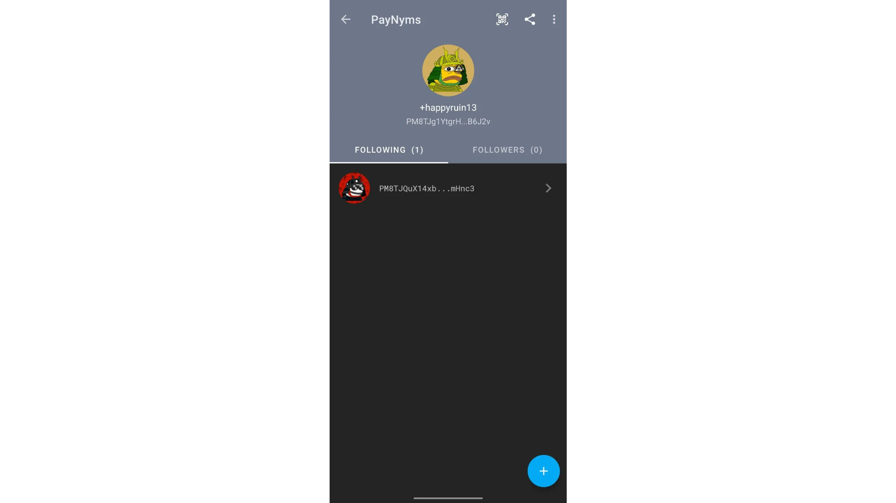

Sie können dann entweder den vollständigen Zahlungscode des Empfängers einfügen oder seinen QR-Code scannen.

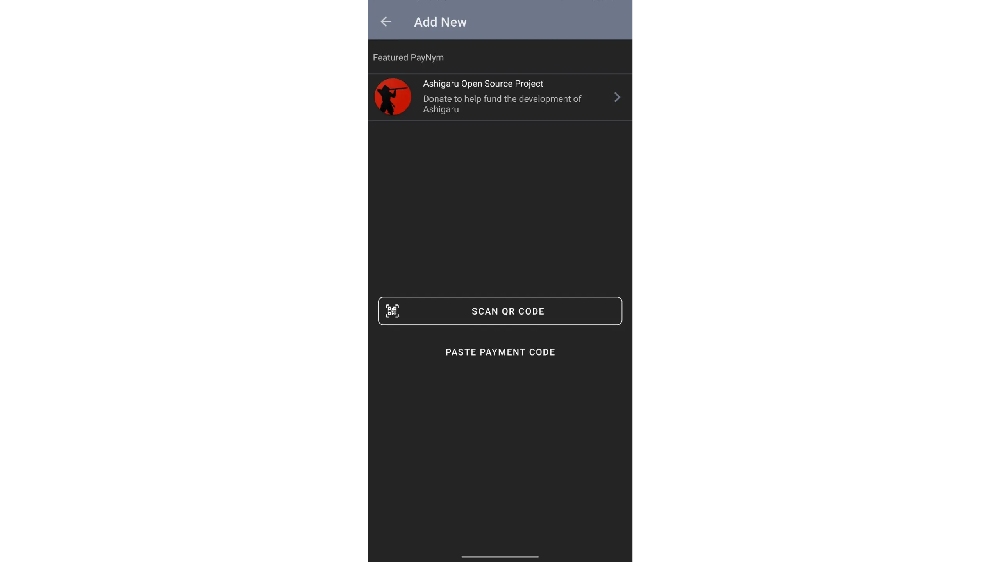

Wenn Sie nur seine PayNym-ID haben, gehen Sie zu [Paynym.rs](https://paynym.rs/), um den QR-Code zu finden, der mit seinem Zahlungscode verbunden ist.

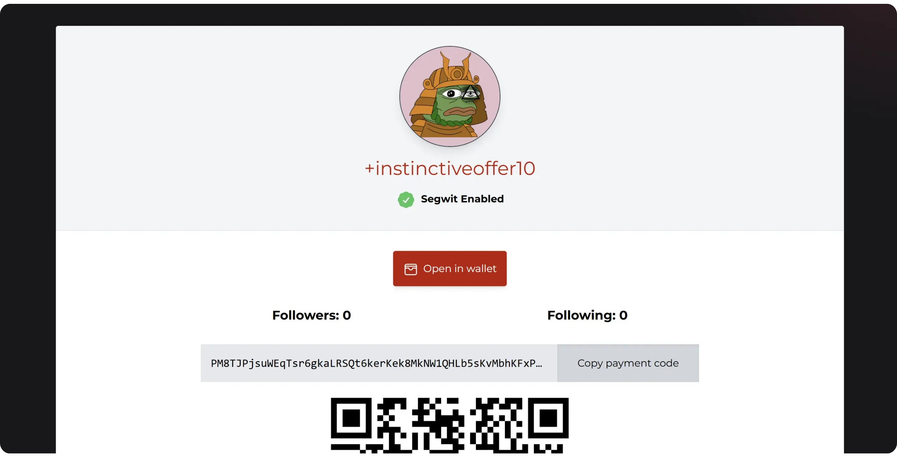

Sobald Sie den QR-Code gescannt haben, klicken Sie auf die Schaltfläche "FOLLOW", um dem PayNym zu folgen.

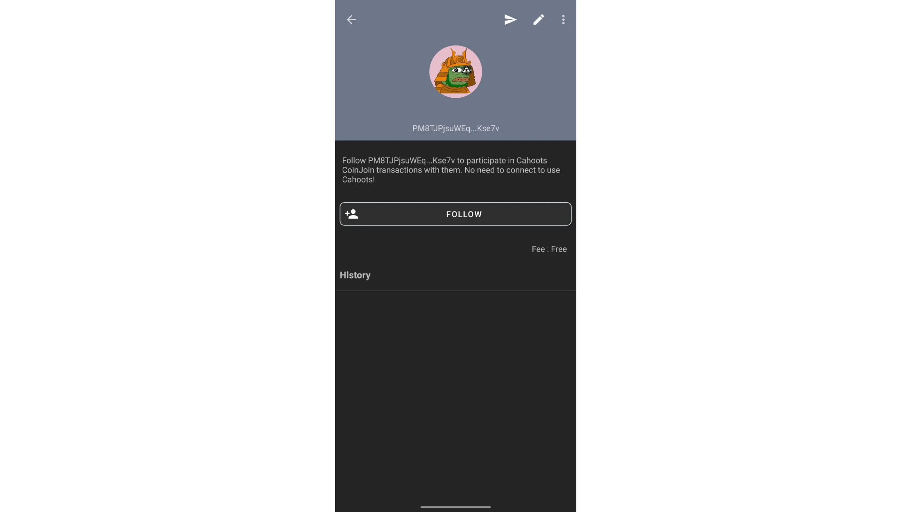

Die Aktion "FOLLOW" reicht für kollaborative Transaktionen (*cahoots*) aus. Um BIP47-Zahlungen zu senden, müssen Sie jedoch eine Verbindung herstellen: Klicken Sie auf `CONNECT`, um die Benachrichtigungstransaktion durchzuführen.

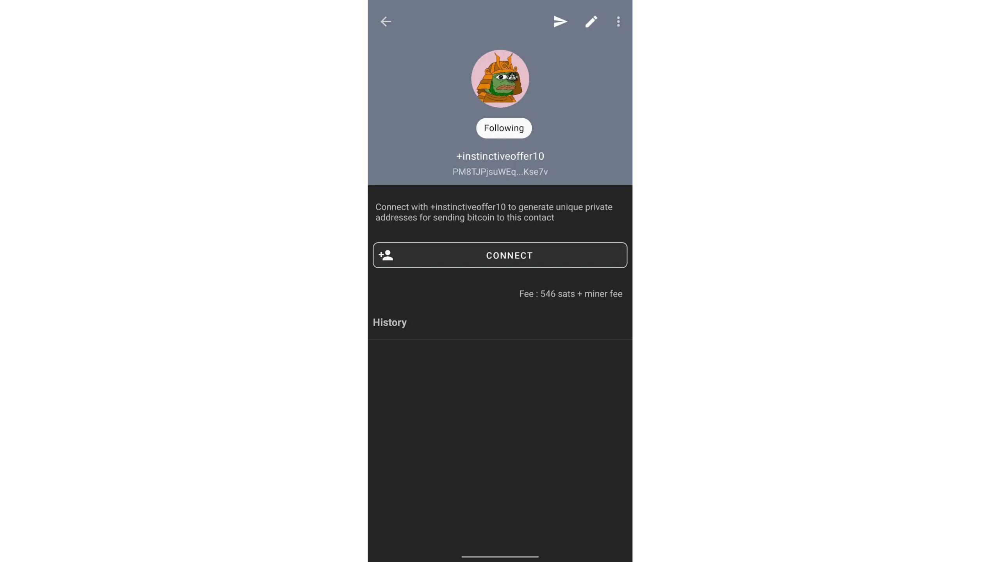

Die Benachrichtigung wird dann im Netz verbreitet. Warten Sie, bis mindestens eine Bestätigung vorliegt, bevor Sie Ihre erste Zahlung vornehmen.

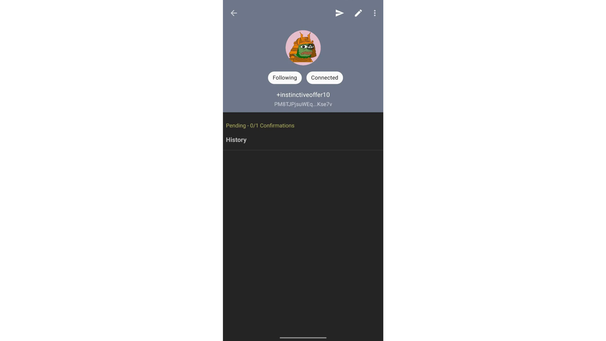

## Eine BIP47-Zahlung vornehmen

Sie sind nun mit dem Empfänger verbunden und können eine Zahlung an eine eindeutige Adresse senden, die automatisch mit dem BIP47-Protokoll generiert wird, ohne dass ein vorheriger Austausch mit dem Empfänger erforderlich ist.

Klicken Sie auf Ihrer PayNym-Hauptseite auf den Kontakt, an den Sie eine Zahlung senden möchten.

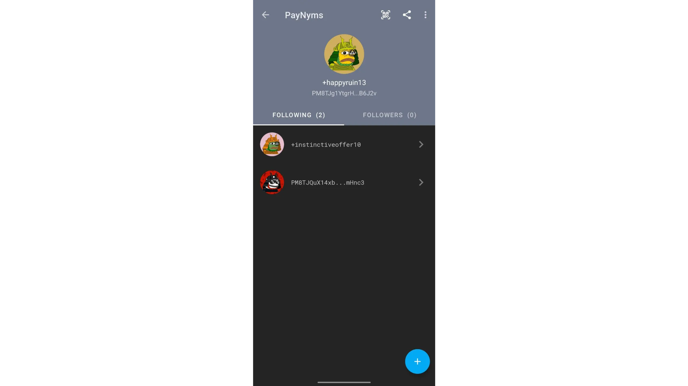

Klicken Sie oben rechts auf der Benutzeroberfläche auf das Pfeilsymbol.

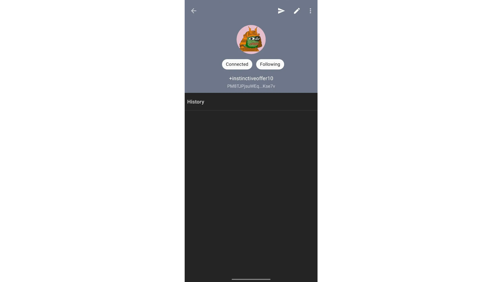

Geben Sie den zu überweisenden Betrag ein. Sie brauchen keine Empfängeradresse einzugeben: Sie wird automatisch über das BIP47-Protokoll ermittelt.

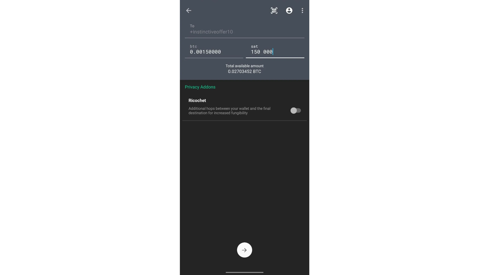

Überprüfen Sie sorgfältig die Transaktionsdetails, einschließlich der Gebühren, und ziehen Sie dann den grünen Pfeil am unteren Rand des Bildschirms, um die Transaktion zu unterzeichnen und zu senden.

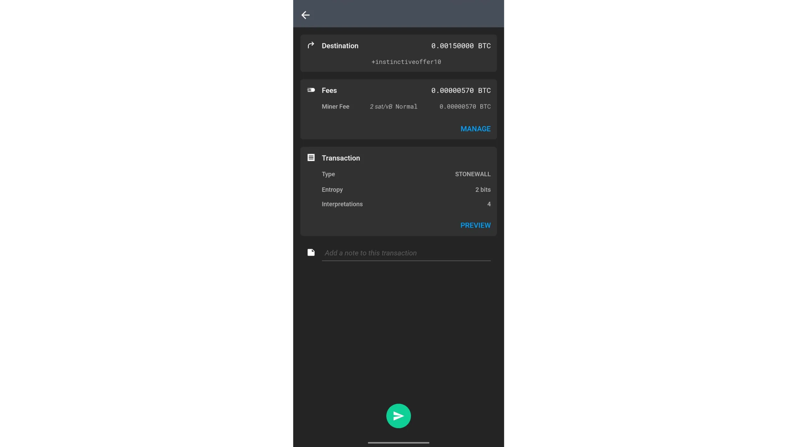

Die Transaktion wurde abgeschickt.

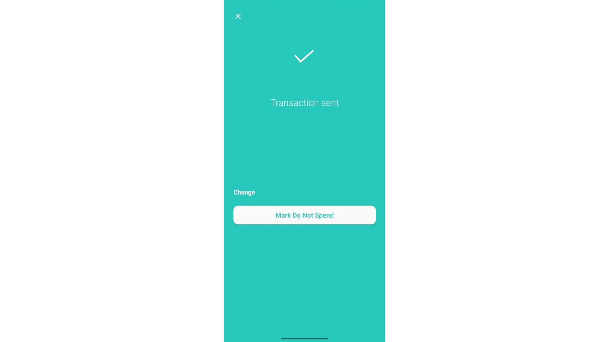

In diesem Beispiel wurde die Zahlung an eine andere meiner PayNym-Geldbörsen vorgenommen. Ich kann also sehen, dass sie auf meinem anderen Ashigaru wallet angekommen ist, ohne dass eine Adresse manuell ausgetauscht wurde: Es wurde nur die PayNym-Kennung verwendet.

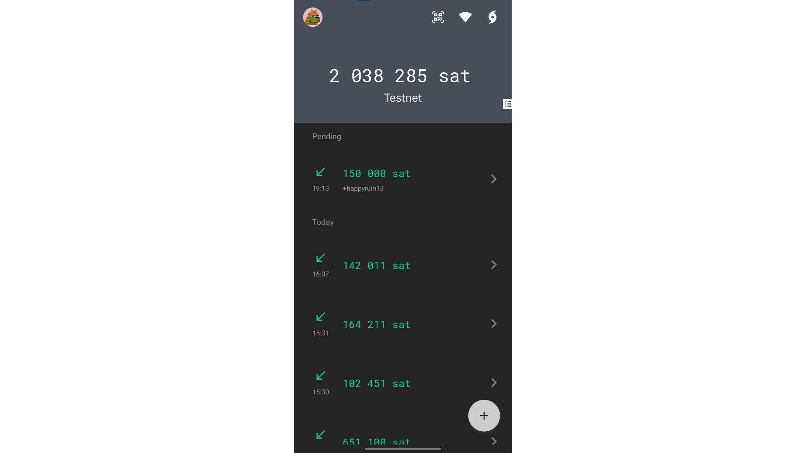

Dank der PayNym-Implementierung in der Ashigaru-Anwendung wissen Sie nun, wie Sie wiederverwendbare BIP47-Zahlungscodes verwenden können. Sie können nun diesen Zahlungscode mit jedem teilen, der Ihnen Zahlungen (insbesondere wiederkehrende Zahlungen) senden möchte. Sie können Ihre PayNym-ID auch auf Ihrer Website oder in sozialen Netzwerken veröffentlichen, um Spenden zu erhalten.

Um Ihr Wissen über dieses Protokoll zu vertiefen, seine Funktionsweise und seine Auswirkungen auf die Vertraulichkeit im Detail zu verstehen, empfehle ich Ihnen dringend, meinen Kurs BTC 204 zu besuchen:

https://planb.academy/courses/65c138b0-4161-4958-bbe3-c12916bc959c