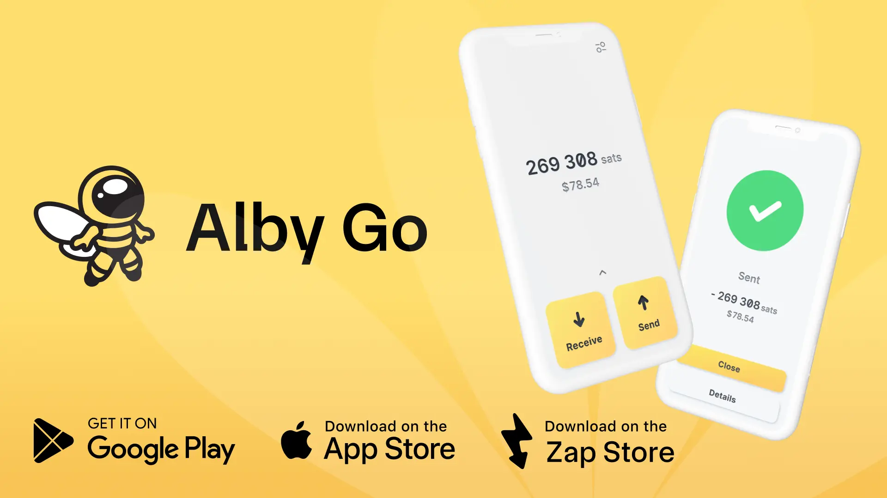

## welkom bij Alby Go - de makkelijkst te gebruiken mobiele Wallet

**Alby Go** is een open-source, eenvoudig te gebruiken mobiele app, die werkt als een Wallet Interface naar Bitcoin bliksemknooppunten en wallets. Hier lees je hoe je aan de slag gaat en het meeste uit je ervaring haalt.

**✅ Ondersteunde en bekende compatibele portemonnees/knooppunten:**

- [Alby Hub](https://albyhub.com/) **(aanbevolen)**
- **Umbrel**, **Start9**, **RaspiBlitz** (via **Alby Hub**)
- **Coinos** *(niet getest)*
- **Oer** *(niet getest)*
- **Minibits** *(niet getest)*

De meeste services met NWC zouden moeten werken. Als u een nieuwe test, laat de community dan uw resultaten weten!

## installeer Alby Go

Beschikbaar op de belangrijkste platforms:

- **iOS:** [Downloaden in de App Store](https://apps.apple.com/us/app/alby-go/id6471335774)
- **Android:** [Downloaden van Google Play](https://play.google.com/store/apps/details?id=com.getalby.mobile)
- **ZapStore**

## sluit een Wallet aan

Alby Go maakt verbinding met je lightning-enabled node of Wallet met behulp van een NWC (Nostr Wallet Connect) geheim. Je kunt een of meer wallets koppelen om gemakkelijk tussen de wallets te wisselen.

Stappen:

1. Open Instellingen → Portemonnees → Verbind een Wallet

2. Scan een QR-code of plak een NWC-verbindingsgeheim (bijv. nostr+walletconnect://...)

3. Geef je verbinding een aangepaste naam

Eenmaal aangesloten is je Wallet of node klaar voor het verzenden en ontvangen van Bitcoin lightning betalingen via Alby Go.

tip: Je kunt meerdere portemonnees aansluiten en op elk moment tussen de portemonnees wisselen.

## gW-9 verzenden

Om Sats over de Lightning Network te sturen:

1. Tik op de grote gele **Verstuur knop**.

2. Kies een van de volgende opties:

 - Scan een bliksem Invoice QR code
 - Een bliksem Invoice plakken vanaf het klembord
 - Handmatig een bliksem Address invoeren

Je kunt ook een ontvanger selecteren uit je Address Boek, waar je bliksemadressen kunt opslaan voor gemakkelijk hergebruik.

## gW-16 ontvangen

Sats ontvangen met Alby Go:

1. Tik op de grote gele **RECEIVE knop**.

2. Kies een van de volgende opties:

 - Deel je bliksem Address zoals weergegeven
 - Selecteer "Bedrag" om generate een bliksem Invoice met aangepaste bedragen te maken
 - Klik op "Redeem" om QR-codes te scannen die LNURL intrekken

Zowel QR-codes als Invoice strings zijn beschikbaar voor het gemak van de verzender.

## ga!

Neem je Bitcoin overal mee naartoe.

**Alby Go** is lichtgewicht, snel en makkelijk te gebruiken - perfect voor node operators en Bitcoiners onderweg.

Geen opgeblazen gevoel. Geen gedoe. Bliksemsnel.

## 🛠️ Extra functies

- 🗺️ BTC Map (een uitgebreide lijst van handelaren die Bitcoin betalingen accepteren)
- donker & lichtmodus
- aangepaste valuta-invoer en rekenmachine
- transactiegeschiedenis
- gW-25 boek
- portefeuilles toevoegen, verwijderen en exporteren

**💡 Hulp nodig? **

Bezoek getalby.com voor ondersteuning en updates.