آسان‌تر کردن پرداخت‌ها با بیت‌کوین چالشی است که بسیاری از شرکت‌های این بخش با آن مواجه هستند. Alby با افزونه Alby wallet برای مرورگرها از دیگران متمایز می‌شود. این افزونه هدف دارد تا یک چارچوب روان ایجاد کند که به‌طور خودکار آدرس‌ها را شناسایی کرده و به شما امکان پرداخت‌های بدون اصطکاک با بیت‌کوین را بدهد. در این آموزش، افزونه Alby را کشف کرده و نحوه تسهیل پرداخت‌ها از مرورگر را آزمایش می‌کنیم.

## Alby توسعه

افزونه Alby ابزاری است که به مرورگر وب شما امکان می‌دهد به‌راحتی و با امنیت با شبکه Bitcoin و لایه Lightning Network آن تعامل داشته باشد. این افزونه با سه ویژگی مشخص می‌شود:

- Lightning Network wallet: گره یا حساب Alby خود را برای ارسال و دریافت سریع و ارزان بیت‌کوین از طریق لایه Lightning Network متصل کنید.
- پرداخت‌های روان از طریق وب: این روش نیاز به اسکن کدهای QR یا جابجایی بین برنامه‌ها برای پرداخت‌های بیت‌کوین در وب‌سایت‌هایی که از لایتنینگ پشتیبانی می‌کنند را از بین می‌برد. این امکان را فراهم می‌کند تا تراکنش‌ها با یک کلیک انجام شوند، یا بدون تأیید اگر بودجه‌ای تعیین کرده‌اید.
- یک مدیر Nostr: این افزونه کلیدهای Nostr شما را مدیریت می‌کند و اتصال و تعامل با برنامه‌های Nostr را به عنوان یک امضاکننده امن آسان می‌سازد، بدون اینکه کلید خصوصی شما را به هر پلتفرمی افشا کند.

https://planb.academy/tutorials/node/others/nostr-f6d21a64-9b04-4f21-ba1c-02c98cc91f98

https://planb.academy/tutorials/node/others/umbrel-nostr-7ae147e8-f5cd-46e1-861b-17c2ea1e08fd

## به افزونه متصل شوید

در این آموزش، ما از افزونه Alby در مرورگر Firefox تحت سیستم‌عامل Ubuntu استفاده خواهیم کرد. با این حال، این افزونه همچنین بر روی ویندوز و با مرورگرهایی مانند کروم نیز در دسترس است.

می‌توانید افزونه Alby را با مراجعه به فروشگاه افزونه [Firefox](https://addons.mozilla.org/fr/firefox/addon/alby/) یا فروشگاه افزونه [Chrome](https://chromewebstore.google.com/detail/alby-bitcoin-wallet-for-l/iokeahhehimjnekafflcihljlcjccdbe) به مرورگر خود اضافه کنید.

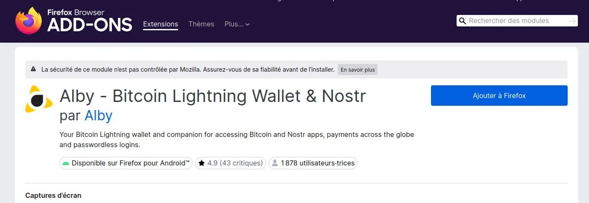

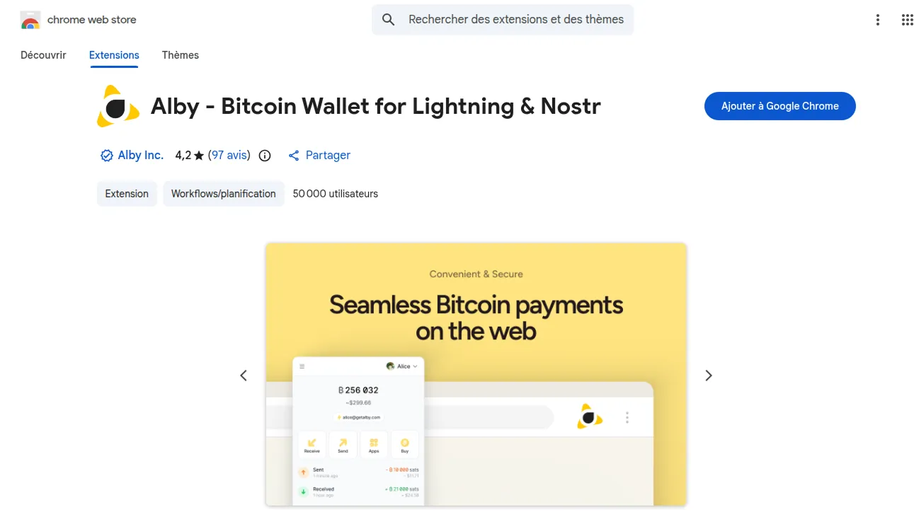

ℹ️ مهم است که بررسی کنید که نویسنده افزونه واقعاً حساب رسمی Alby باشد تا از هرگونه دزدی دریایی یا سرقت بیت‌کوین‌های شما جلوگیری شود.

افزونه را با کلیک بر روی دکمه سمت راست به مرورگر خود اضافه کنید.

مجوزهای لازم را برای نصب و استفاده از افزونه اعطا کنید، سپس افزونه را برای دسترسی آسان به نوار ابزار پین کنید.

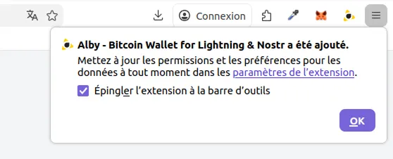

شما همچنین باید یک کد بازگشایی (بسیار مهم) تعریف کنید که دسترسی امن به Lightning wallet شما از مرورگرتان را تضمین کند. ما پیشنهاد می‌کنیم یک رمز عبور قوی و شامل حروف و اعداد تنظیم کنید.

ℹ️ این رمز عبور را در مکانی امن ذخیره کنید تا در صورت فراموشی بتوانید به آن دسترسی داشته باشید، زیرا می‌توان آن را تغییر داد اما نمی‌توان بازیابی کرد.

https://planb.academy/tutorials/computer-security/authentication/seedkeeper-password-64ffaf68-53aa-43c3-bc7a-c1dc2a17fee3

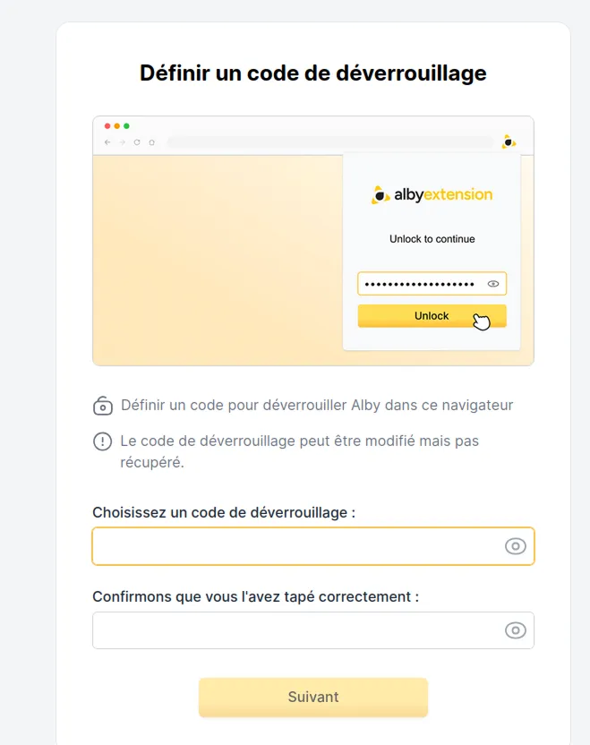

Alby با ارائه دو گزینه به شما، سازگاری خود را نشان می‌دهد:

- اگر می‌خواهید از برنامه‌ها لذت ببرید و در عین حال کنترل بیت‌کوین‌های خود را حفظ کنید، با یک حساب Alby ادامه دهید.
- اگر از قبل یک گره wallet یا Lightning دارید که توسط این افزونه پشتیبانی می‌شود، آن را متصل کنید.

https://planb.academy/tutorials/wallet/mobile/blink-7ea5f5a4-e728-4ff9-b3f9-cf20aa6fc2bd

https://planb.academy/tutorials/node/lightning-network/lightning-network-daemon-linux-59d777e9-72c8-4b32-8c50-e86cdae8f2f9

https://planb.academy/tutorials/business/point-of-sale/btcpay-server-928eb01e-824b-4b57-a3e8-8727633beddc

در این آموزش، ما تصمیم گرفتیم با حساب Alby ادامه دهیم تا از ویژگی‌های اکوسیستم Alby بهره‌مند شویم.

https://planb.academy/tutorials/wallet/mobile/alby-go-40202802-b346-4a3c-9863-465c3bde9903

https://planb.academy/tutorials/node/lightning-network/alby-hub-62e6356c-6a6d-4134-8f22-c3b6afb9882a

وارد حساب Alby خود شوید، یا اگر هنوز حسابی ندارید، یکی ایجاد کنید.

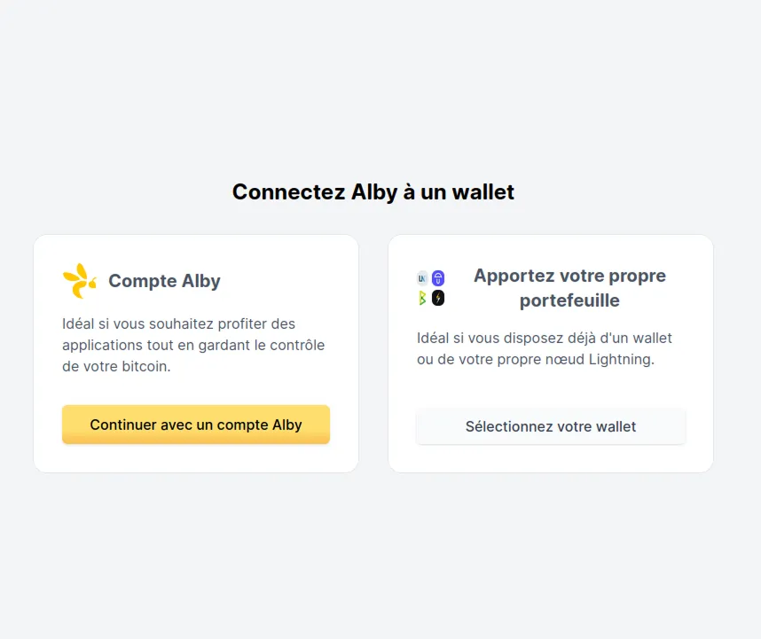

## انجام اولین پرداخت‌هایتان

پس از ورود به سیستم، می‌توانید روی افزونه Alby در نوار ابزار کلیک کنید تا به پورتفولیوی خود دسترسی پیدا کنید.

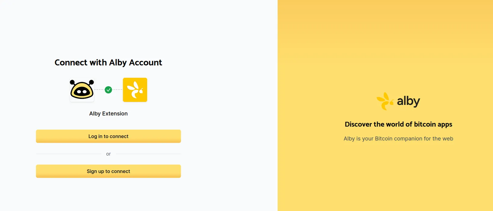

پس از ایجاد حساب Alby، باید آن را به wallet متصل کنید تا بتوانید ساتوشی‌ها را خرج کنید. برای اتصال بیت‌کوین wallet به حساب Alby خود، پیشنهاد می‌کنیم از یک نود Alby Hub استفاده کنید که می‌توانید آن را روی کامپیوتر خود راه‌اندازی کنید یا به یک طرح ارائه شده توسط Alby مشترک شوید.

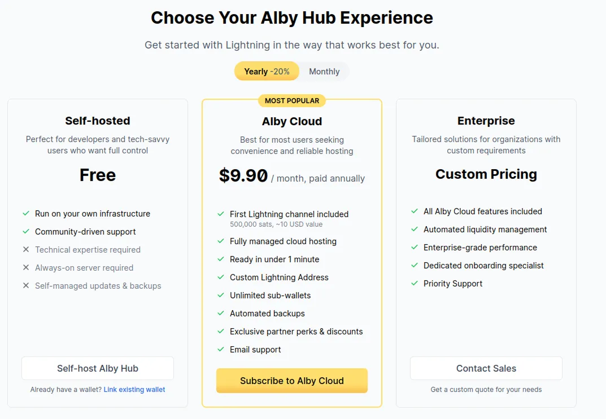

در این آموزش، حساب Alby ما توسط یک نصب محلی بر روی دستگاه ما پشتیبانی می‌شود.

برای ساخت نود Alby خود، ما آموزش Alby Hub خود را توصیه می‌کنیم.

https://planb.academy/tutorials/node/lightning-network/alby-hub-62e6356c-6a6d-4134-8f22-c3b6afb9882a

این نود به شما اجازه می‌دهد تا پورتفولیوهای لایتنینگ خود-حضانتی ایجاد کرده و کانال‌های لایتنینگ خود را به‌طور کارآمد مدیریت کنید تا ساتوشی‌ها را ارسال و دریافت نمایید.

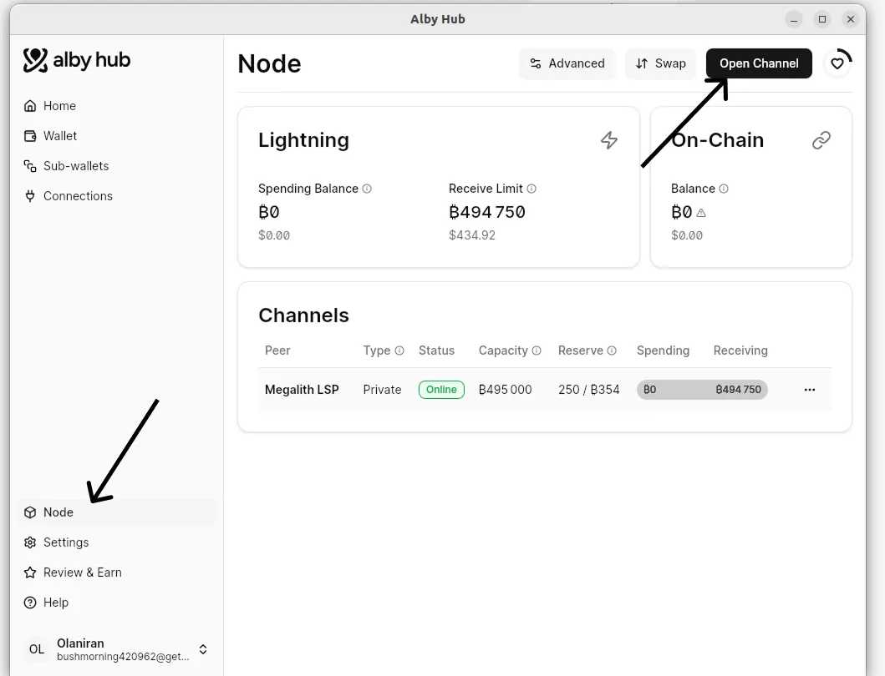

کانال‌های پذیرش باز را که تعداد کل ساتوشی‌هایی که می‌توانید دریافت کنید تعریف می‌کنند.

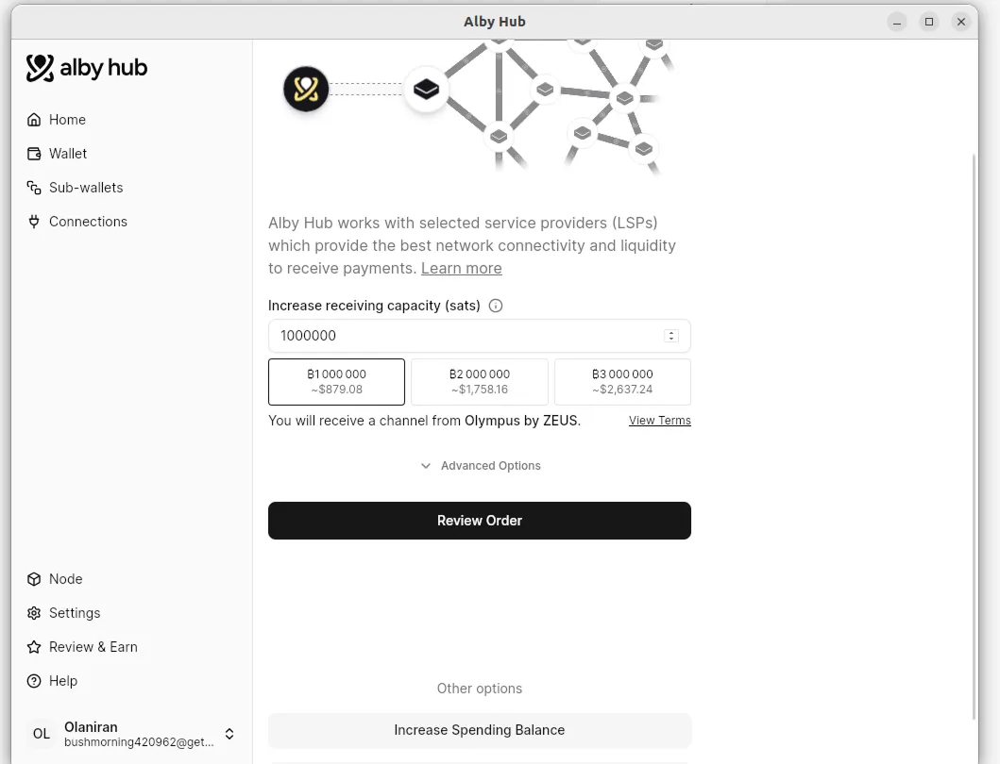

کانال‌های ارسال را با مسدود کردن ساتوشی‌ها در یک آدرس بیت‌کوین آنچین باز کنید. ساتوشی‌هایی که مسدود کرده‌اید، مجموع ساتوشی‌هایی را که می‌توانید خرج کنید، تعریف می‌کنند.

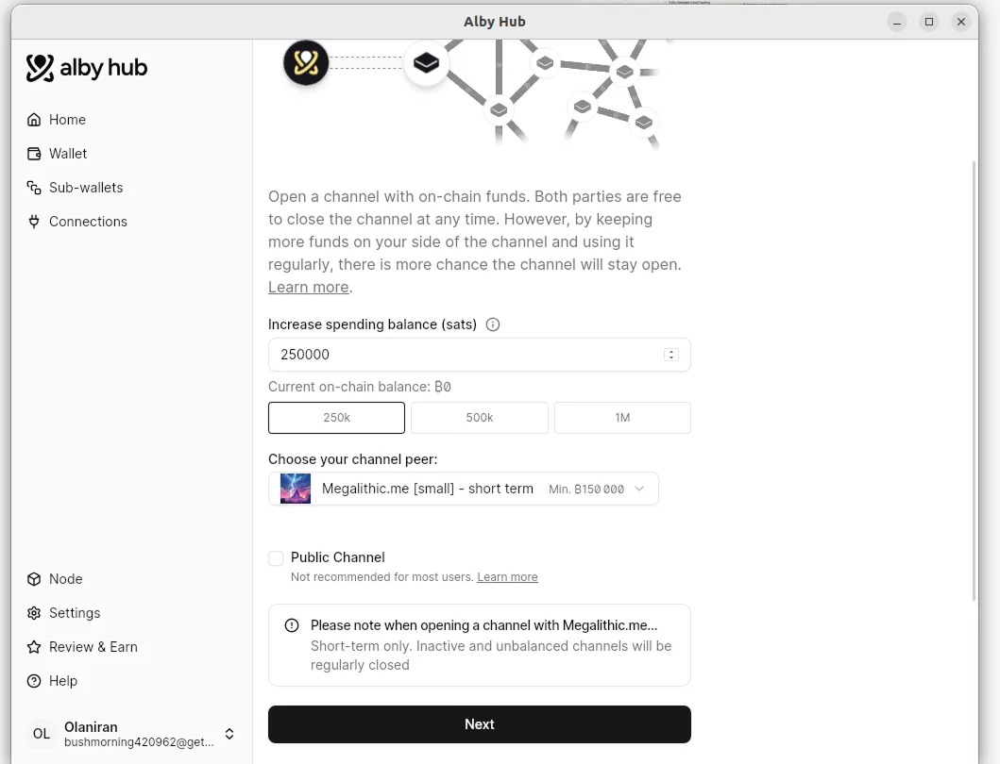

اکنون می‌توانید ساتوشی‌ها را از طریق افزونه Alby ارسال و دریافت کنید.

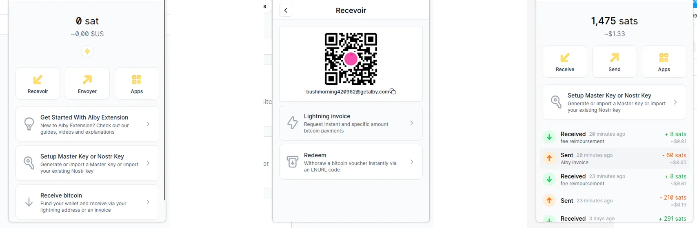

از این نقطه به بعد، افزونه Alby قادر است آدرس‌ها و فاکتورهای Lightning موجود در صفحات وبی که بازدید می‌کنید را شناسایی کند و پیشنهاد دهد که آن‌ها را مستقیماً از طریق افزونه خود با بیت‌کوین یا Lightning پرداخت کنید.

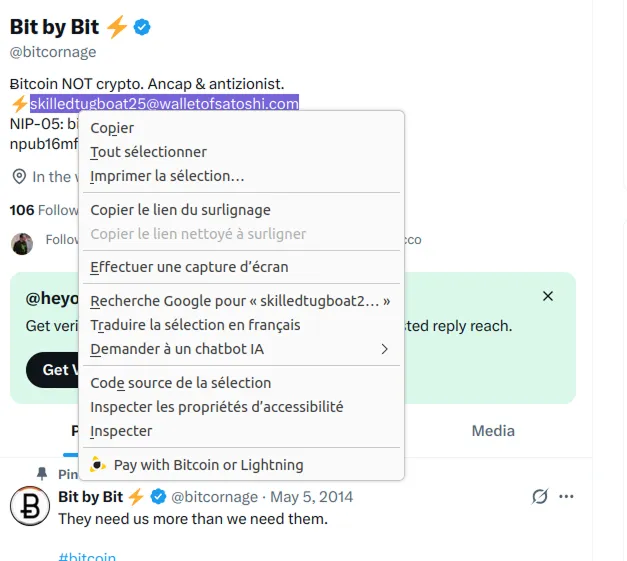

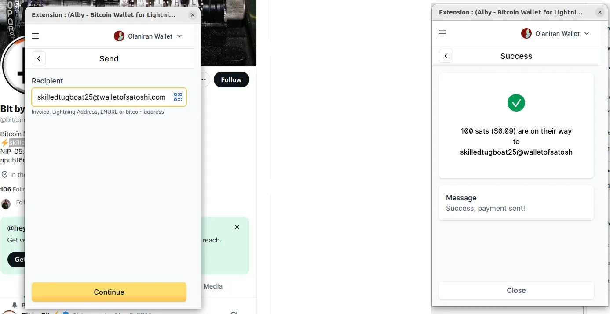

## ایمن‌سازی کلیدهای بازیابی با کلید اصلی

کلید اصلی ارائه‌شده توسط افزونه Alby به‌عنوان یک لایه محافظ عمل می‌کند که به شما امکان می‌دهد به‌صورت امن با لایه شبکه اصلی Bitcoin (Onchain)، سیستم Nostr ارتباط برقرار کنید و اتصال Lightning با برنامه‌های Nostr را فعال کنید.

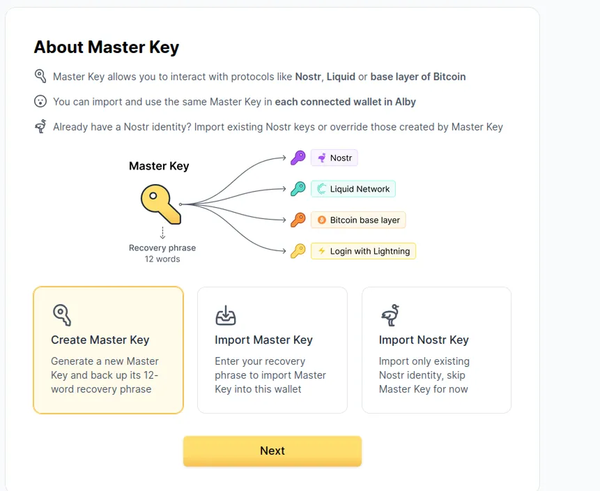

این کلید اصلی به شکل ۱۲ کلمه مشابه عبارت بازیابی شما است. بنابراین توصیه می‌کنیم که آن را با استفاده از روش‌های امن ذخیره کنید تا اطمینان حاصل شود که در هر زمان قابل دسترسی است.

https://planb.academy/tutorials/wallet/backup/backup-mnemonic-22c0ddfa-fb9f-4e3a-96f9-46e2a7954270

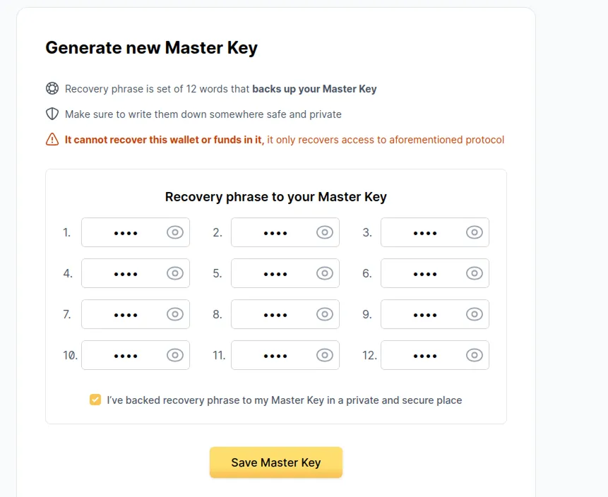

اکنون می‌توانید پرداخت‌های بیت‌کوین و لایتنینگ را بدون اصطکاک با افزونه Alby تجربه کنید. اگر از این آموزش لذت بردید، ما آموزش Alby Hub را توصیه می‌کنیم تا گره Alby خود را راه‌اندازی کرده و تمام جنبه‌های کیف‌پول‌های Alby خود را از یک رابط کاربری روان و قدرتمند کنترل کنید.

https://planb.academy/tutorials/node/lightning-network/alby-hub-62e6356c-6a6d-4134-8f22-c3b6afb9882a