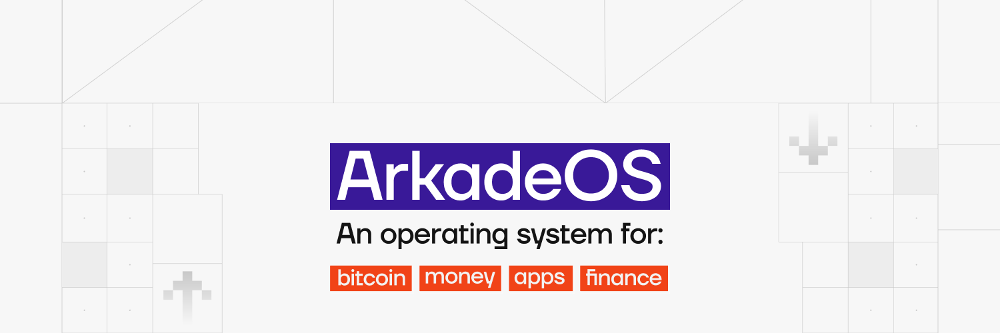

Перед сетью Bitcoin стоит серьезная задача: масштабируемость. Хотя основной уровень (уровень 1) обеспечивает непревзойденную безопасность и децентрализацию, он может обрабатывать лишь ограниченное количество транзакций в секунду. Lightning Network появилась как многообещающее решение второго уровня (уровень 2), обеспечивающее быстрые и недорогие платежи. Однако Lightning накладывает свои ограничения: управление каналами, потребность в входящей ликвидности и техническая сложность, которая может оттолкнуть новых пользователей.

Такова предыстория **Ark**, нового протокола второго уровня, разработанного для упрощения работы пользователей без ущерба для суверенитета. **ArkadeOS** (или Arkade) - первая крупная реализация этого протокола, предлагающая портфель Bitcoin нового поколения.

Это руководство проведет вас через мир Arkade. Мы рассмотрим, как работает протокол Ark, как установить и настроить Arkade wallet и как использовать его для отправки и получения биткоинов мгновенно, конфиденциально и без обычных трений Lightning Network.

## Понимание протокола Ковчега

Прежде чем перейти к использованию Arkade, необходимо понять ключевые концепции протокола Ark, на котором он основан. Ark - это не отдельный блокчейн, а интеллектуальный механизм координации поверх Bitcoin.

### Концепция VTXO

В основе Ark лежит **VTXO** (Virtual UTXO). VTXO - это UTXO, еще не опубликованный на блокчейне Bitcoin: он существует вне основной цепи (off-chain), но подкреплен транзакциями, предварительно подписанными на блокчейне.

В отличие от баланса на централизованной бирже, VTXO действительно принадлежит вам. Вы обладаете криптографическим доказательством, которое позволяет вам в любой момент потребовать соответствующие реальные биткоины на блокчейне, даже если сервер Ark исчезнет. VTXO позволяют мгновенно передавать стоимость между пользователями, не дожидаясь подтверждения блока.

### Роль ASP (поставщика услуг ковчега)

Протокол Ark работает по модели клиент-сервер. Сервер называется **ASP** (Ark Service Provider). ASP играет роль проводника:

- Он обеспечивает необходимую ликвидность сети.
- Он координирует транзакции между пользователями.
- Она организует "раунды" расчетов на блокчейне.

Важно отметить, что ASP - это **неохраняемая система**. Он никогда не хранит ваши закрытые ключи и не может украсть ваши средства. Его роль чисто техническая и логистическая. Если ASP подвергнет цензуре ваши транзакции или выйдет из строя, вы всегда сможете вернуть свои средства с помощью односторонней процедуры выхода.

### Раунды и конфиденциальность

Транзакции на Ark завершаются партиями, называемыми **Rounds**. Периодически (например, каждые несколько секунд) ASP собирает все ожидающие транзакции и закрепляет их на блокчейне Bitcoin в виде единой оптимизированной транзакции.

Этот механизм обладает двумя основными преимуществами:

- Масштабируемость**: Одна транзакция on-chain может подтвердить тысячи платежей off-chain, что значительно снижает затраты пользователей.
- Конфиденциальность**: Каждый раунд действует как **CoinJoin**. Средства всех участников смешиваются в общий пул, а затем перераспределяются в виде новых VTXO. Это разрывает связь между отправителем и получателем, делая отслеживание платежей для стороннего наблюдателя крайне затруднительным, если вообще возможным.

## Презентация ArkadeOS

ArkadeOS - это конкретное приложение, которое делает протокол Ark доступным для широкой публики. Разработанная Ark Labs, она представляет собой полную экосистему, состоящую из портфеля (Wallet), сервера (Operator) и инструментов разработчика.

Для конечного пользователя Arkade принимает форму элегантного, интуитивно понятного веб-приложения wallet (PWA - Progressive Web App). Он скрывает криптографическую сложность VTXO и раундов за привычным интерфейсом. С Arkade у вас есть адрес для получения, кнопка для отправки и история транзакций, как и в классическом wallet, но с мощью мгновенности и конфиденциальности Ark.

## Установка и настройка

Поскольку Arkade - это Progressive Web App, его особенно легко установить, и для этого не обязательно использовать традиционные магазины приложений.

### Доступ и установка

Вы можете получить доступ к Arkade непосредственно через любой современный веб-браузер (Chrome, Safari, Brave) на компьютере или мобильном телефоне.

- Посетите официальный сайт приложения: **[arkade.money](https://arkade.money)**.

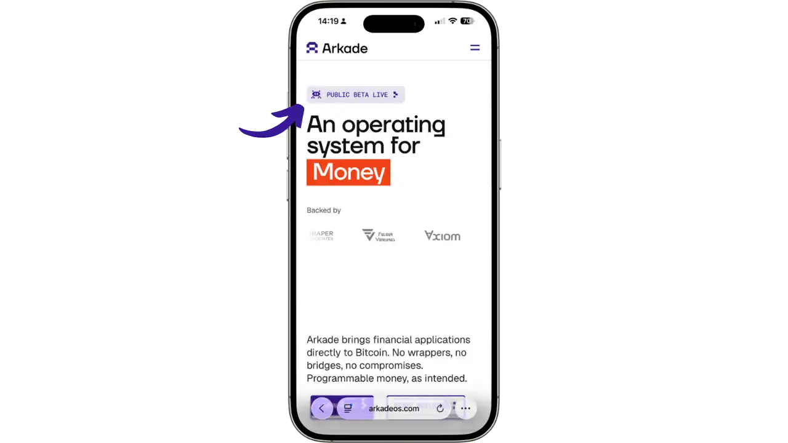

Вас встретит ряд вводных экранов, знакомящих с ключевыми концепциями Arkade: новой экосистемой для Bitcoin, важностью самоохраны и преимуществами пакетных транзакций.

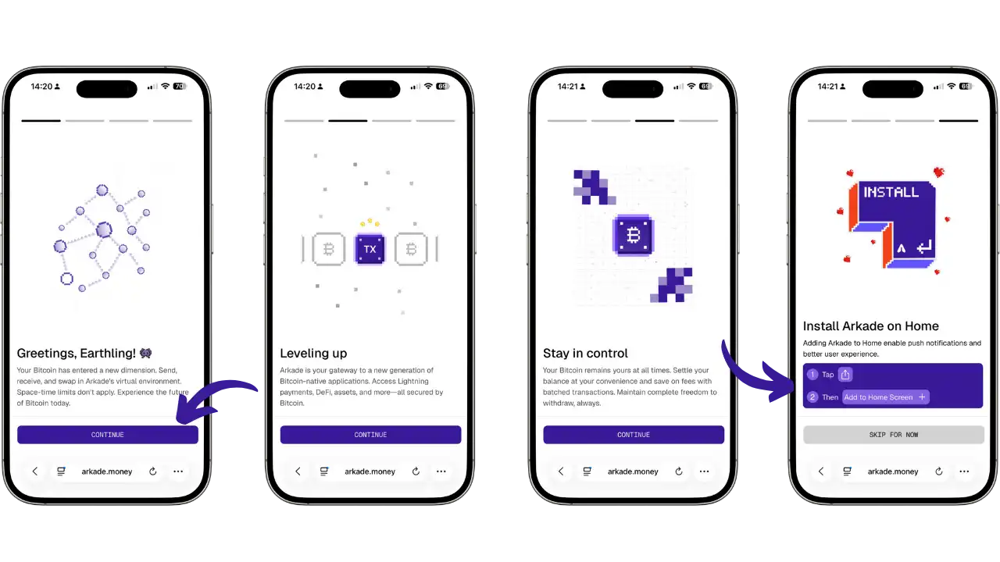

- На Android (Chrome/Brave)** : Нажмите на меню браузера (три точки) и выберите "Установить приложение" или "Добавить на главный экран".
- На iOS (Safari)**: Нажмите кнопку поделиться (квадрат со стрелкой вверх) и выберите "На главном экране".

После установки Arkade запускается как родное приложение, в полноэкранном режиме и без адресной строки.

### Создание портфолио

При первом запуске вам будет предложено настроить портфолио.

- Нажмите на **"Создать новый Wallet"**.

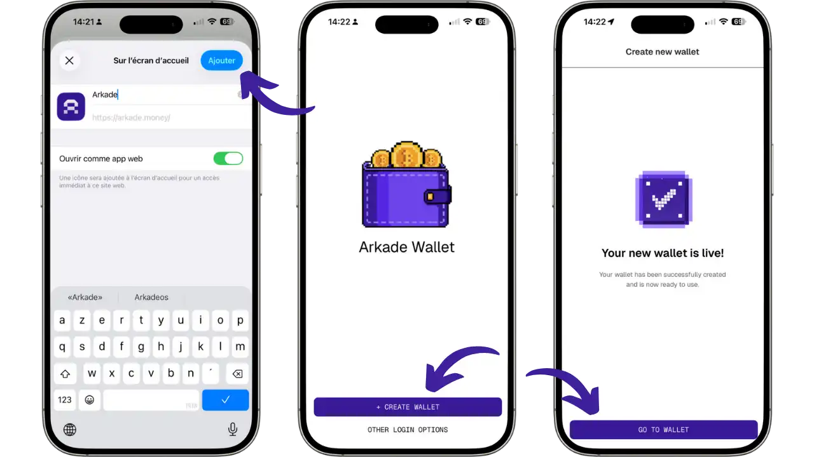

- wallet создается мгновенно. В отличие от традиционных кошельков Bitcoin, **Arkade не использует фразу восстановления из 12 или 24 слов**. Вместо этого Arkade автоматически генерирует **приватный ключ** в формате Nostr (nsec), который будет использоваться для резервного копирования и восстановления вашего wallet. Не забудьте сразу же сохранить этот ключ (см. следующий раздел).

- Вы увидите экран "Your new wallet is live!", подтверждающий, что ваш wallet готов к использованию. Нажмите на **"GO TO WALLET "**, чтобы перейти в основной интерфейс.

Войдя в wallet, вы попадаете в основной интерфейс Arkade. Здесь вы найдете свой баланс, кнопки для отправки и получения средств, а также вкладку "Apps", которая открывает доступ к интегрированным приложениям, таким как Boltz (Lightning exchange), LendaSat и LendaSwap (кредитные сервисы) и Fuji Money (синтетические активы).

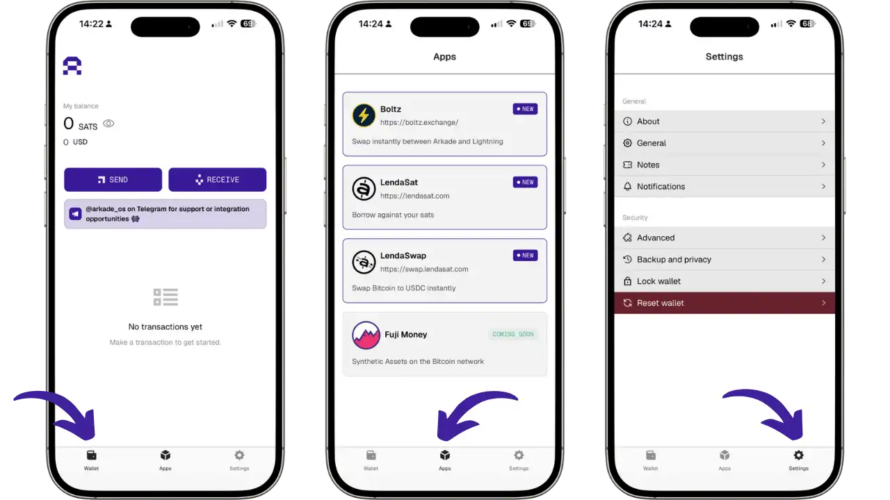

### Подключение к ASP

По умолчанию портфолио автоматически настроено на подключение к официальному ASP Arkade Labs. Вы можете проверить, к какому серверу вы подключены, перейдя в **Настройки** > **Общая информация**, где вы увидите адрес сервера (в настоящее время `https://arkade.computer`).

В текущей версии Arkade (Beta) невозможно вручную изменить ASP-сервер. Приложение автоматически подключается к официальному ASP Arkade Labs. В будущем пользователи смогут выбирать между различными ASP в зависимости от своих предпочтений, но пока эта функция недоступна.

### Резервное копирование закрытого ключа

**Arkade использует закрытый ключ в формате Nostr (nsec) в качестве метода резервного копирования и восстановления. Для резервного копирования закрытого ключа :

- На главном экране перейдите в раздел **Настройки**.
- Выберите **"Резервное копирование и конфиденциальность "**.
- Вы увидите свой **приватный ключ**, отображаемый в формате `nsec...`. Эта длинная строка символов - единственное средство восстановления wallet.
- Нажмите **"COPY NSEC TO CLIPBOARD "**, чтобы скопировать личный ключ.
- Храните этот ключ в надежном месте**: запишите его на бумаге, храните в безопасном менеджере паролей или используйте любой другой подходящий вам способ резервного копирования.
- Arkade также предлагает опцию **"Включить резервное копирование Nostr "**. Эта функция использует протокол Nostr (децентрализованная сеть) для автоматического резервного копирования определенных данных с вашего wallet в зашифрованном виде на ретрансляторы Nostr. Это облегчает синхронизацию между несколькими устройствами и упрощает восстановление состояния wallet.

**Важно**: Резервное копирование Nostr - это только **удобная** функция. Они не заменяют резервное копирование ключа nsec. Реле Nostr не гарантирует постоянного хранения данных. Ваш закрытый ключ nsec остается единственным гарантированным средством восстановления ваших средств.

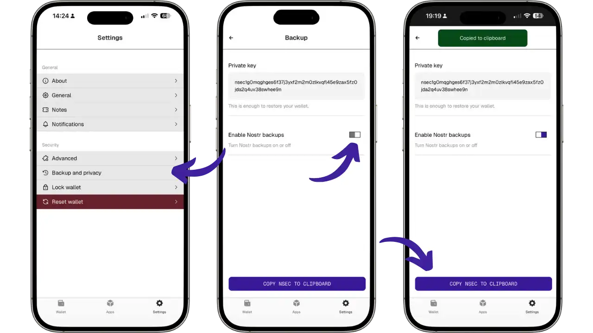

## Использование Аркады

После настройки wallet вы будете готовы к изучению возможностей Arkade. Интерфейс разработан таким образом, чтобы объединить различные типы платежей Bitcoin (On-chain, Lightning, Ark).

### Получение средств

Чтобы пополнить свой портфель, нажмите **"Получить "**. Arkade предлагает три способа получения:

- Оплата через Арк**: Если отправитель также использует Arkade, поделитесь своим адресом Ark для мгновенного, конфиденциального и практически бесплатного перевода.
- Депозит на цепочке (Boarding)**: Используйте адрес Bitcoin (`bc1p...`) для получения от классического wallet или биржи. Дайте время на подтверждение (~10 минут), прежде чем средства будут конвертированы в VTXO.
- Обмен молниями**: Создайте счет-фактуру Lightning и оплатите его с внешнего wallet Lightning. Средства поступают мгновенно благодаря автоматическому свопу.

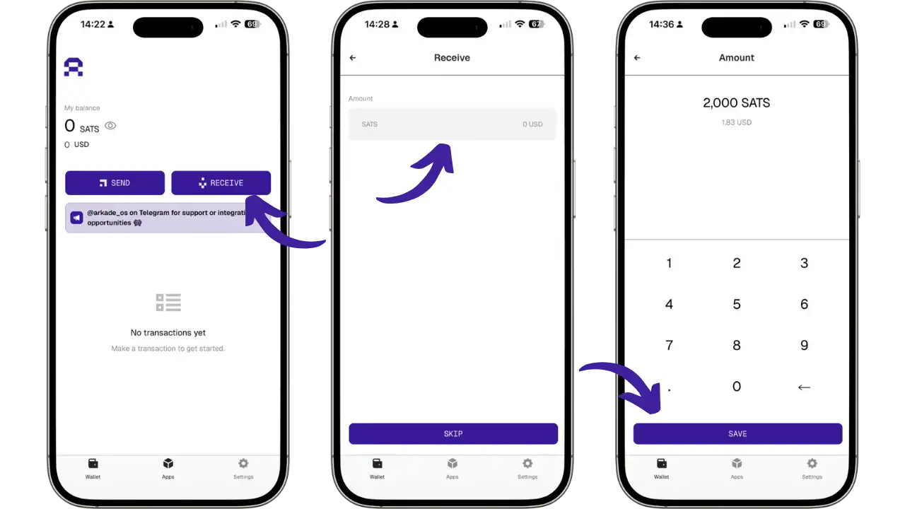

На экране получения отображаются все доступные варианты: QR-код, адрес Ark, адрес Bitcoin (BIP21) и счет-фактура Lightning. Для оплаты через Lightning держите приложение открытым во время транзакции.

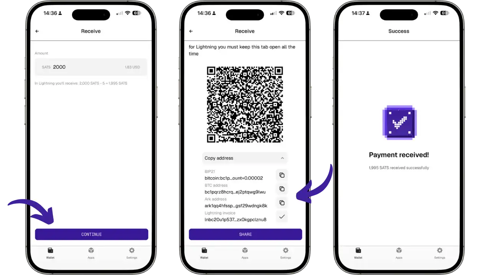

### Отправка средств

Чтобы отправить средства, нажмите **"Отправить "** и вставьте адрес получателя или отсканируйте QR-код. Arkade автоматически определит тип необходимого платежа:

- Оплата через Ковчег**: Перевод на адрес Ark осуществляется мгновенно, конфиденциально и практически бесплатно (комиссия 0 SATS). Получателю не нужно быть онлайн.
- Молниеносный** платеж: Отсканируйте счет-фактуру Lightning (`lnbc...`), и Arkade автоматически произведет обмен. ASP оплачивает счет за вас и списывает средства с вашего баланса Arkade.
- Цепной платеж**: На классический адрес Bitcoin (`bc1q...` или `bc1p...`) Аркад инициирует "Совместный выход", который будет включен в следующий раунд on-chain.

Проверьте детали на экране "Подписать транзакцию", затем подтвердите с помощью **"TAP TO SIGN "**.

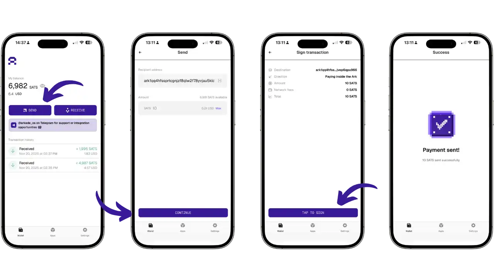

**Текущее ограничение (бета-версия)**: VTXO, созданные менее 24 часов назад, не могут быть использованы для выходов on-chain. Если вы столкнулись с ошибкой, пожалуйста, подождите, пока VTXO не станут "зрелыми".

**on-chain конфиденциальность вывода**: В примере ниже показана транзакция [Ark output transaction on mempool.space](https://mempool.space/fr/tx/153a70384d1c8a183c0e408e29b0a11820fd71a8bd5b4b00b12bc9b7f9decacb). Мы наблюдаем распределенный вход на 4 разных выхода, как в CoinJoin. Для внешнего наблюдателя невозможно определить, какой объем принадлежит тому или иному пользователю.

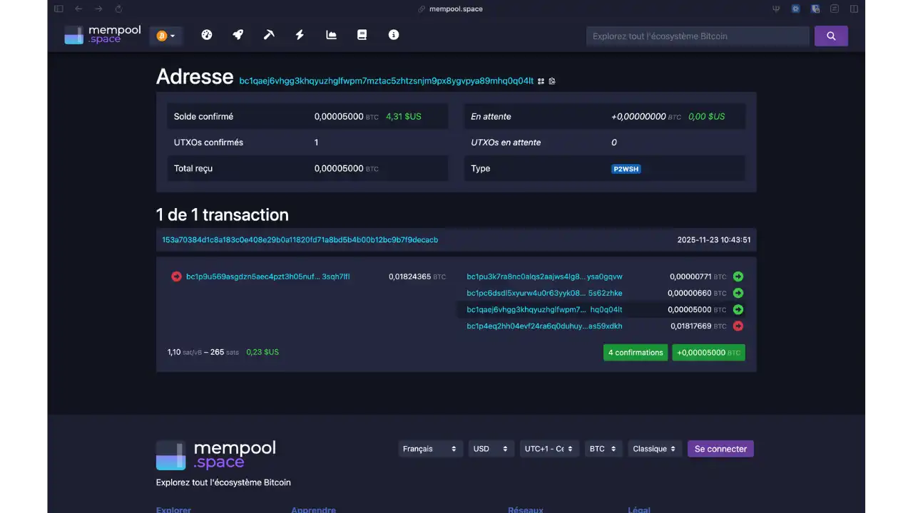

## Дополнительные возможности

### Управление истечением срока действия VTXO

Технической особенностью протокола Ark является то, что VTXO имеют **ограниченное время жизни**. Это ограничение по времени заложено в самой конструкции протокола. Время истечения срока действия настраивается каждым ASP-сервером; на официальном ASP Arkade Labs этот период составляет около **4 недель (≈30 дней)**.

**Это ограничение позволяет серверу Ark эффективно управлять ликвидностью и очищать VTXO от неактивных пользователей. После истечения срока действия сервер Ark может технически претендовать на оставшиеся средства в дереве VTXO.

**Чтобы ваши VTXO оставались активными, их необходимо "обновлять" до истечения срока действия. Обновление заключается в участии в новом "раунде", где ваши VTXO, срок действия которых близок к истечению, обмениваются на новые VTXO с новым полным сроком действия (≈30 дней на Arkade Labs ASP).

Портфель Arkade управляет этим процессом автоматически: приложение постоянно следит за состоянием ваших VTXO и автоматически обновляет их за несколько дней до истечения срока действия. Если вы регулярно (не реже одного раза в неделю) открываете приложение, ваши VTXO будут автоматически поддерживаться в активном состоянии.

**Если вы не открываете портфель более 4 недель, срок действия VTXO истекает. Однако вы не теряете свои средства: у вас остается возможность вернуть их с помощью **одностороннего выхода** (см. следующий раздел). Эта процедура более дорогостоящая и медленная, но она гарантирует, что ваши средства можно будет вернуть.

Необходимость регулярно открывать приложение делает Arkade **"Hot Wallet"** предназначенным для ежедневных трат, а не сейфом для долгосрочных сбережений. Для хранения биткоинов без их длительного использования предпочтите холодное оборудование wallet.

**Проверьте состояние VTXO**: Вы можете следить за состоянием своих VTXO в разделе **Настройки** > **Дополнительно**. В разделе "Следующее обновление" вы можете узнать, когда произойдет следующее автоматическое обновление, а в разделе "Виртуальные монеты" - увидеть подробный список всех ваших VTXO с указанием срока их действия.

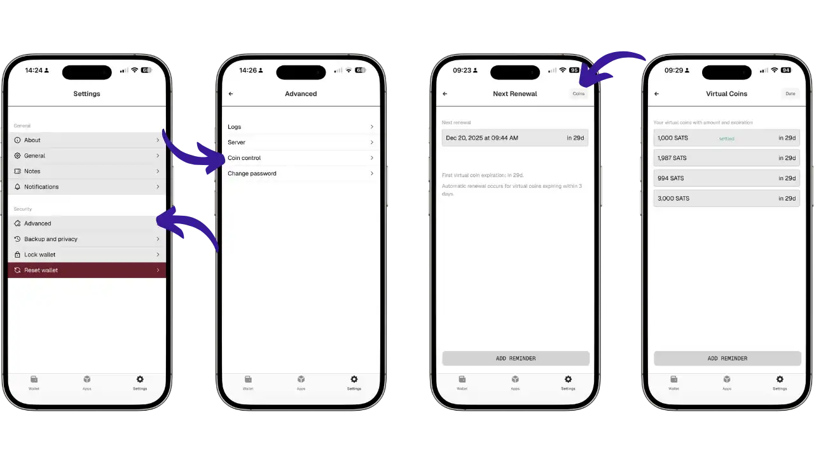

### Односторонний выход (Sortie Unilatérale)

Односторонний выход - это **фундаментальная криптографическая гарантия** протокола Ark, которая гарантирует, что вы получите свои средства обратно, даже если ASP исчезнет, подвергнет цензуре ваши транзакции или откажется сотрудничать. Технически, ваши VTXO - это **предварительно подписанные транзакции Bitcoin**, которые принадлежат вам. В случае крайней необходимости вы можете транслировать эти транзакции в блокчейн Bitcoin, чтобы вернуть свои средства без чьего-либо разрешения.

**Как это работает? Процесс происходит в два этапа. Сначала **Развертывание**: вы последовательно транслируете предварительно подписанные транзакции, которые составляют ваши VTXO, в дерево транзакций. Затем **Финализация**: по истечении таймлока (обычно 24 часа) вы забираете свои биткоины со стандартного адреса.

**Текущий статус в Arkade**: В бета-версии пока нет кнопки или простого пользовательского интерфейса для одностороннего вывода. Эта функциональность в настоящее время требует использования Arkade SDK и технических знаний программирования на TypeScript.

**Даже если процедура не доступна одним нажатием кнопки, криптографическая гарантия существует. Ваши VTXO содержат предварительно подписанные транзакции, которые законно принадлежат вам. Именно эта техническая гарантия делает Ark **беззалоговым** протоколом: даже при самом неблагоприятном сценарии ваши средства можно технически вернуть. Возможно, в будущих версиях Arkade будет добавлен упрощенный интерфейс.

## Преимущества и ограничения

Чтобы представить Arkade в правильном контексте, давайте подытожим ее текущие сильные и слабые стороны.

### Основные моменты

- Пользовательский опыт (UX)**: Никакого управления каналами, входящих мощностей или сложного резервного копирования каналов, как в Lightning. Просто установите и пользуйтесь.
- Конфиденциальность** : Стандартная архитектура CoinJoin обеспечивает гораздо более высокий уровень анонимности, чем стандартные транзакции on-chain или Lightning.
- Взаимозаменяемость**: Оплачивайте любые QR-коды Bitcoin (On-chain или Lightning) из единого интерфейса.

### Ограничения

- Молодой протокол**: Ковчег - это очень новая технология. Возможны ошибки. Рекомендуется не использовать Ark для хранения сумм, потеря которых может оказаться критичной.
- Зависимость от ASP**: Несмотря на то, что система не является обязательной, она зависит от доступности ASP. Если ASP не работает, вы больше не сможете совершать мгновенные транзакции (только выводить средства on-chain).
- Только Hot Wallet** : Необходимость регулярно открывать приложение для обновления VTXO не подходит для холодного хранения (Cold Storage).

## Сравнение: Аркада vs Молния vs Кашу

Чтобы лучше понять позиционирование Arkade, давайте сравним ее с двумя другими крупными решениями для масштабирования.

| Критерий | Arkade (Ark) | Lightning Network | Cashu (E-cash) |
| :--- | :--- | :--- | :--- |
| **Модель** | Общий UTXO, координируемый сервером (ASP) | P2P-сеть платежных каналов | Слепые токены, выпущенные банком (Mint) |
| **Хранение** | **Некастодиальное** (ключи у вас) | **Некастодиальное** (ключи у вас) | **Кастодиальное** (фонды у Mint) |
| **Конфиденциальность** | **Высокая** (нативный CoinJoin, скрыто от публики) | **Средняя** (луковая маршрутизация, но каналы видны) | **Очень высокая** (скрыто даже от Mint) |
| **Масштабируемость** | Отличная (массивный батчинг on-chain) | Отличная (бесконечные транзакции off-chain) | Отличная (простые серверные подписи) |
| **Опыт** | Простой (близко к on-chain кошельку) | Сложный (управление каналами, ликвидность) | Очень простой (как цифровые наличные) |
| **Основной риск** | Доступность ASP и истечение срока | Управление каналами и бэкапы | Доверие к Mint (риск кражи) |

**Arkade** - это идеальный компромисс: простота и конфиденциальность Cashu, но суверенитет (не связанный с лишением свободы) Lightning.

## Поддержка и помощь

Если у вас возникнут проблемы или вопросы при использовании Arkade, приложение предлагает несколько вариантов поддержки:

- Перейдите в раздел **Настройки** > **Поддержка**.
- Вы найдете несколько вариантов:
  - Поддержка клиентов**: Получите помощь в работе с портфолио, сообщите об ошибках или задайте вопросы.
  - Безопасный чат**: Ваши разговоры безопасны и приватны, а история сохраняется между сеансами.
  - Сообщения об ошибках**: Сообщайте о любых проблемах, с которыми вы столкнулись, включая шаги по их воспроизведению.
  - Отслеживайте прогресс**: Постоянно отслеживайте ход выполнения заявок и разговоров с сотрудниками службы поддержки.

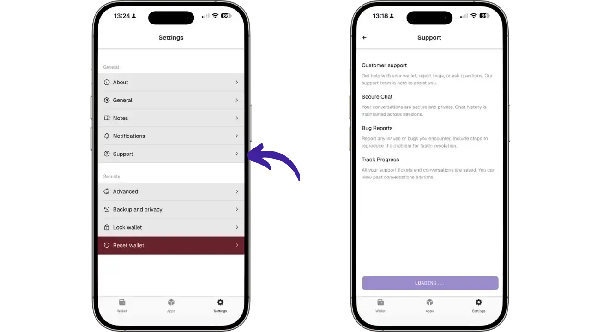

Команда Arkade также активна в Telegram через канал @arkade_os для получения поддержки и возможностей интеграции.

## Важное примечание: приложение находится в стадии бета-версии

**⚠️ Arkade в настоящее время находится в публичной бета-версии на mainnet Bitcoin**. Хотя приложение функционирует с реальными биткоинами, важно соблюдать определенные меры предосторожности.

### Рекомендации по использованию

- Используйте небольшие суммы**: Не храните на Аркаде крупные суммы. Используйте этот wallet для повседневных расходов, а свои сбережения храните на холодном аппарате wallet.
- Возможные ошибки и ограничения**: Как и любое приложение, находящееся в стадии активной разработки, Arkade может иметь ошибки или неожиданное поведение. Сообщайте о любых проблемах через встроенную поддержку.
- Быстрое развитие**: Приложение и протокол постоянно совершенствуются. Некоторые функции могут быть изменены или добавлены в будущих версиях.

### Известные в настоящее время ограничения

- 24-часовая задержка на VTXOs** : Вновь созданные VTXO не могут быть сразу использованы для выходов on-chain.
- ASP уникален**: Пока нет возможности изменить ASP-сервер в приложении.
- Технический односторонний выход**: Упрощенный интерфейс для одностороннего вывода пока отсутствует (требуется SDK).

Команда Arkade Labs активно работает над тем, чтобы снять эти ограничения в будущих версиях.

## Заключение

ArkadeOS представляет собой большой прорыв в экосистеме Bitcoin. Реализуя протокол Ark, она доказывает, что можно совместить простоту использования с фундаментальными принципами Bitcoin: не доверяй, проверяй.

Несмотря на то, что Arkade еще находится в стадии становления, она дает возможность увидеть будущее платежей Bitcoin: мгновенных, частных и доступных для всех без каких-либо технических условий. Это идеальный инструмент для ежедневных расходов, дополняющий ваше надежное решение для сбережений (Cold Wallet).

Мы рекомендуем вам протестировать Arkade на небольших суммах, чтобы открыть для себя этот новый протокол. Экосистема быстро развивается, и Arkade находится в авангарде этих инноваций.

## Ресурсы

Чтобы узнать больше, обратитесь к официальным ресурсам:

- Сайт Arkade**: [arkadeos.com](https://arkadeos.com)
- Документация**: [docs.arkadeos.com](https://docs.arkadeos.com)
- Протокол Ark**: [ark-protocol.org](https://ark-protocol.org)
- Исходный код** : [GitHub Arkade](https://github.com/arkade-os)