آشیگارو یک برنامه موبایل Bitcoin و اپلیکیشن wallet است که ادامه‌ای بر پروژه سامورایی Wallet می‌باشد، اما در قالبی جدید. این نرم‌افزار در یک بستر خاص متولد شد: در آوریل 2024، بنیان‌گذاران سامورایی Wallet توسط مقامات آمریکایی دستگیر شدند و سرورهای آن‌ها توقیف شد. اگرچه خود اپلیکیشن سامورایی همچنان قابل استفاده باقی ماند، اما در حال حاضر دیگر نگهداری نمی‌شود. آشیگارو نسخه رایگان fork از سامورایی Wallet است که توسط تیمی ناشناس نگهداری می‌شود تا تداوم عملکرد سامورایی و حفظ فلسفه اصلی آن را تضمین کند: دفاع از حریم خصوصی و حاکمیت کاربران Bitcoin.

آشیگارو بخش زیادی از DNA سامورایی را به خود اختصاص می‌دهد: یک رابط کاربری مشابه، رویکردی به وضوح خود-نگهدار، متن‌باز و تمرکز بر حریم خصوصی. کد تحت مجوز GNU GPLv3 توزیع می‌شود که اطمینان می‌دهد هر کسی می‌تواند نرم‌افزار را ممیزی، تغییر یا بازتوزیع کند.

برنامه Ashigaru مجموعه‌ای از ابزارهای پیشرفته برای حفظ محرمانگی و مدیریت UTXOهای شما را یکپارچه می‌کند:

- Whirlpool**، یک پروتکل کوین‌جوین مبتنی بر Zerolink است که به شما امکان می‌دهد بدون از دست دادن حاکمیت بر وجوه خود، پیوندهای تعیین‌کننده بین ورودی‌ها و خروجی‌های تراکنش را بشکنید.
- PayNym**، که کدهای پرداخت قابل استفاده مجدد (BIP47) را پیاده‌سازی می‌کند، اکنون از طریق یک سیستم آواتار "*Pepehash*" نمایندگی می‌شود.
- ریکوشی**, ویژگی‌ای که پرش‌های واسطه‌ای به تراکنش‌ها اضافه می‌کند تا ردیابی آن‌ها را دشوارتر کند.
- و البته ***Coin Control*** برای انتخاب، فریز و برچسب‌گذاری دقیق UTXOهای شما.
- صرف دسته‌ای***، برای کاهش هزینه‌ها با گروه‌بندی چندین پرداخت در یک تراکنش واحد.
- حالت **مخفی‌کاری**، که برنامه را در موبایل شما پشت یک لانچر جعلی پنهان می‌کند تا در طول بازرسی فیزیکی گوشی شما نادیده گرفته شود.
- ابزارهای پیشرفته هزینه‌کرد برای بهینه‌سازی محرمانگی شما (payjoin، stonewall...).
- یک سیستم بازیابی بهینه‌سازی‌شده با استفاده از عبارت عبور BIP39.
- سیستمی برای بهینه‌سازی خودکار انتخاب کارمزدهای تراکنش.

بنابراین، Ashigaru برای کاربرانی طراحی شده است که از مسائل مربوط به قابلیت ردیابی تراکنش‌ها در Bitcoin آگاه هستند. چه شما یک کاربر حریم‌خصوصی‌محور باشید، چه یک بیت‌کوینر با تجربه که به خودنگهداری متعهد است، یا فردی که در معرض خطرات نظارت فزاینده قرار دارد، این برنامه wallet ابزارهایی را که برای بازپس‌گیری کنترل فعالیت خود در Bitcoin نیاز دارید، در اختیار شما قرار می‌دهد.

نسخه موبایل Ashigaru از طریق اپلیکیشن آن در دسترس است که در این آموزش به بررسی آن خواهیم پرداخت. اما می‌توان از آن بر روی رایانه شخصی با ***Ashigaru Terminal*** نیز استفاده کرد که در یک آموزش آینده معرفی خواهیم کرد.

در این آموزش، می‌خواهم شما را با استفاده‌ی پایه‌ای از Ashigaru آشنا کنم: نصب، اتصال به Dojo، پشتیبان‌گیری، دریافت و ارسال بیت‌کوین. ابزارهای پیشرفته در آموزش‌های اختصاصی دیگر ارائه خواهند شد.

## 1. پیش‌نیازهای آشیکارو

این برنامه برای کارکرد صحیح به چند پیش‌نیاز نیاز دارد. اول از همه، این برنامه در فروشگاه‌های کلاسیک مانند Google Play Store یا App Store در دسترس نیست. این برنامه به صورت دستی از طریق فایل `.apk` خود که از طریق شبکه Tor قابل دانلود است، بر روی گوشی شما نصب می‌شود. بنابراین اگر از آیفون استفاده می‌کنید، این روش کار نخواهد کرد: شما به یک دستگاه اندروید نیاز دارید.

برای دانلود فایل `.apk` از طریق تور، به مرورگری نیاز دارید که قادر به دسترسی به سایت‌های `.onion` باشد. ساده‌ترین راه این است که برنامه مرورگر تور را روی گوشی خود نصب کنید، که از [فروشگاه گوگل پلی](https://play.google.com/store/apps/details?id=org.torproject.torbrowser) یا مستقیماً [از طریق `.apk` آن](https://www.torproject.org/download/#android) در دسترس است.

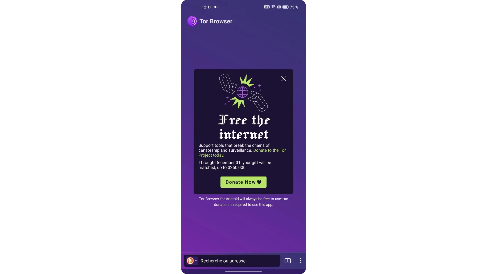

اکثر گوشی‌های هوشمند جدید به‌طور پیش‌فرض نصب برنامه‌ها از منابع ناشناخته را مسدود می‌کنند. برای نصب مرورگر Tor باید به‌طور موقت این گزینه را در تنظیمات دستگاه خود فعال کنید. پس از نصب برنامه، به یاد داشته باشید که این قابلیت را غیرفعال کنید تا امنیت گوشی خود را تقویت کنید.

یکی دیگر از پیش‌نیازهای اساسی برای استفاده از Ashigaru، یک نود Dojo Bitcoin است. به دلایل امنیت و حاکمیت، تیم Ashigaru یک سرور مرکزی برای اتصال برنامه شما نگهداری نمی‌کند. بنابراین شما باید یک نمونه Dojo خود را اجرا کنید یا به یک نمونه مورد اعتماد متصل شوید.

دوجو به برنامه Ashigaru شما امکان می‌دهد تا اطلاعات بلاکچین را مشاوره کند، موجودی آدرس‌های شما را مشاهده کند و تراکنش‌های شما را در شبکه Bitcoin پخش کند.

برای کسب اطلاعات بیشتر درباره Dojo و یادگیری نحوه نصب آن، از شما دعوت می‌کنم تا این آموزش اختصاصی را دنبال کنید:

https://planb.academy/tutorials/node/bitcoin/dojo-aa818a21-e701-48a2-8421-63c6186ed23f

اگر واقعاً نمی‌توانید هزینه راه‌اندازی دوجوی خود را بپردازید، می‌توانید افرادی را پیدا کنید که مایل به اشتراک‌گذاری نسخه خود به‌صورت رایگان در [dojobay.pw](https://www.dojobay.pw/mainnet/) هستند. این ممکن است یک راه‌حل موقت باشد، اما در بلندمدت، توصیه می‌کنم از دوجوی خود استفاده کنید تا حاکمیت و محرمانگی خود را تضمین کنید.

## ۲. برنامه Ashigaru را بررسی و نصب کنید

### ۲.۱. برنامه Ashigaru را دانلود کنید

در تلفن همراه خود، مرورگر Tor را باز کرده و به [وب‌سایت رسمی Ashigaru](https://ashigaru.rs/download/) بروید، در بخش `Download`. سپس روی دکمه `Download for Android` کلیک کنید تا فایل نصب را دانلود کنید.

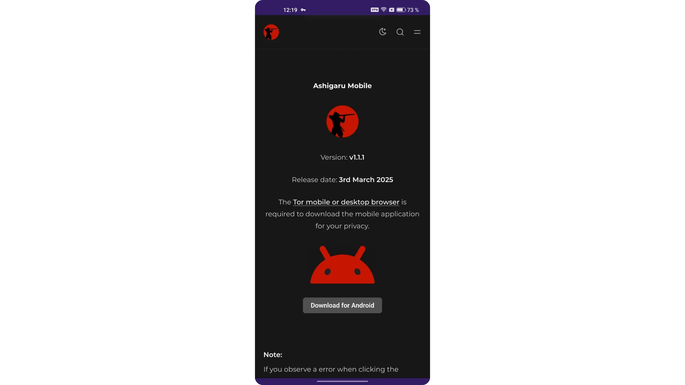

قبل از نصب برنامه بر روی دستگاه خود، ما اصالت و یکپارچگی آن را بررسی خواهیم کرد. این یک مرحله بسیار مهم است، به ویژه زمانی که برنامه‌ای را مستقیماً از یک فایل `.apk` نصب می‌کنید.

### ۲.۲. برنامه Ashigaru را بررسی کنید

به [وب‌سایت رسمی Ashigaru](https://ashigaru.rs/download/) در بخش `Download` بازگردید، سپس پیامی که زیر عنوان `SHA-256 Hash of the APK file` نمایش داده می‌شود را کپی کنید. کل بلوک را از `BEGIN PGP SIGNED MESSAGE` تا `END PGP SIGNATURE` کپی کنید.

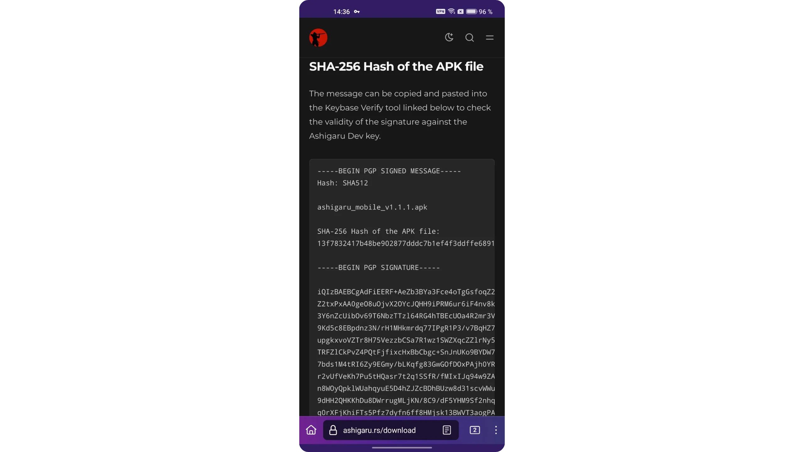

هنوز روی گوشی خود هستید، یک تب جدید در مرورگر Tor باز کنید و به [ابزار تأیید Keybase](https://keybase.io/verify) بروید. پیامی که به تازگی کپی کرده‌اید را در فیلد ارائه شده جای‌گذاری کنید، سپس روی دکمه `Verify` کلیک کنید.

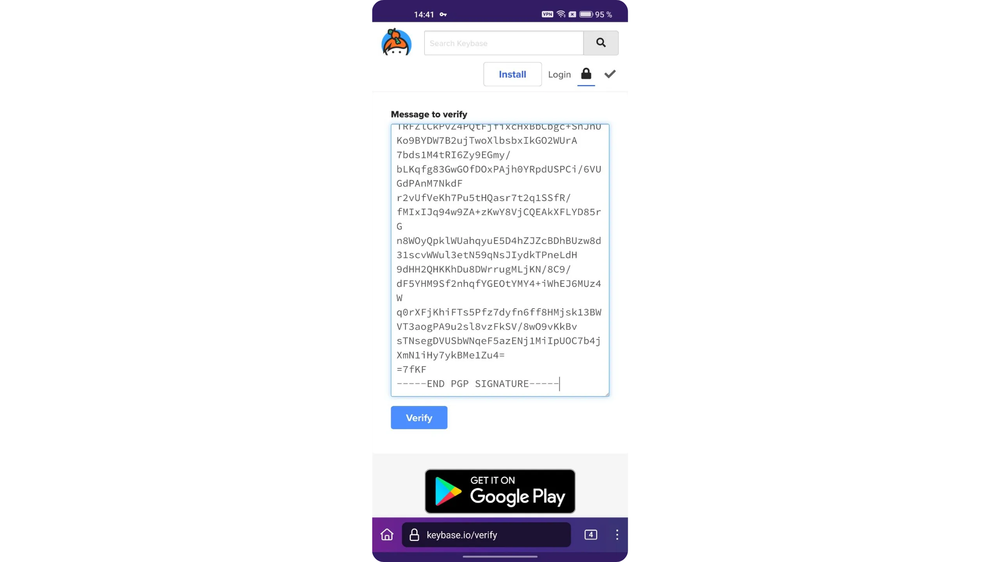

اگر امضا معتبر باشد، Keybase پیامی نمایش خواهد داد که تأیید می‌کند فایل توسط توسعه‌دهندگان Ashigaru امضا شده است. همچنین می‌توانید بر روی پروفایل `ashigarudev` که توسط Keybase نشان داده شده کلیک کنید و بررسی کنید که اثر انگشت کلید آن‌ها دقیقاً با این مقدار مطابقت دارد: `A138 06B1 FA2A 676B`.

با این حال، اگر در این مرحله خطایی ظاهر شود، به این معنی است که امضا نامعتبر است. در این صورت، **APK را نصب نکنید**. از ابتدا شروع کنید یا قبل از ادامه از جامعه کمک بخواهید.

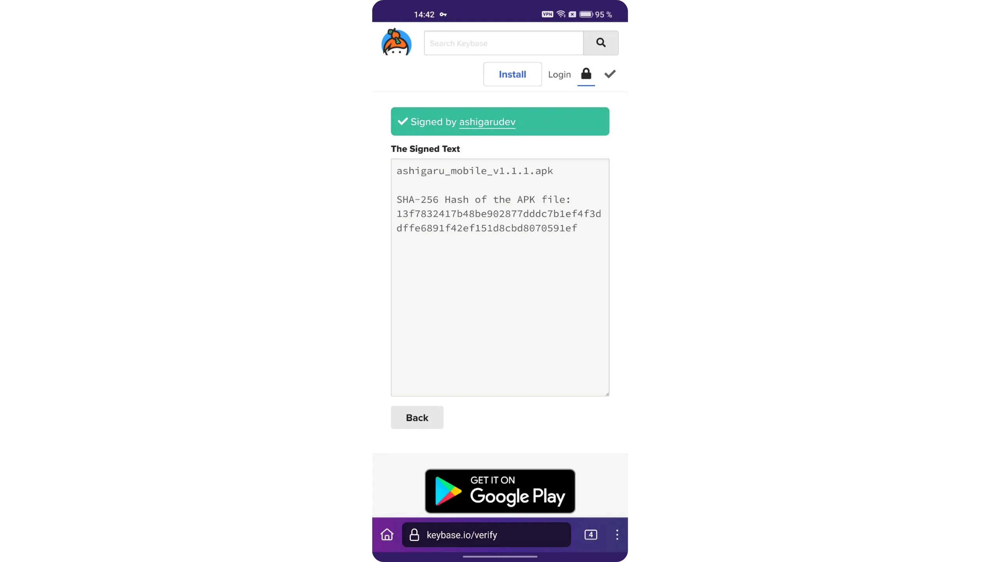

Keybase هش برنامه را در اختیار شما قرار داده است. اکنون بررسی خواهیم کرد که هش فایل `.apk` که دانلود کرده‌اید با هشی که در Keybase تأیید شده است مطابقت دارد. برای انجام این کار، به [HASH FILE ONLINE](https://hash-file.online/) بروید.

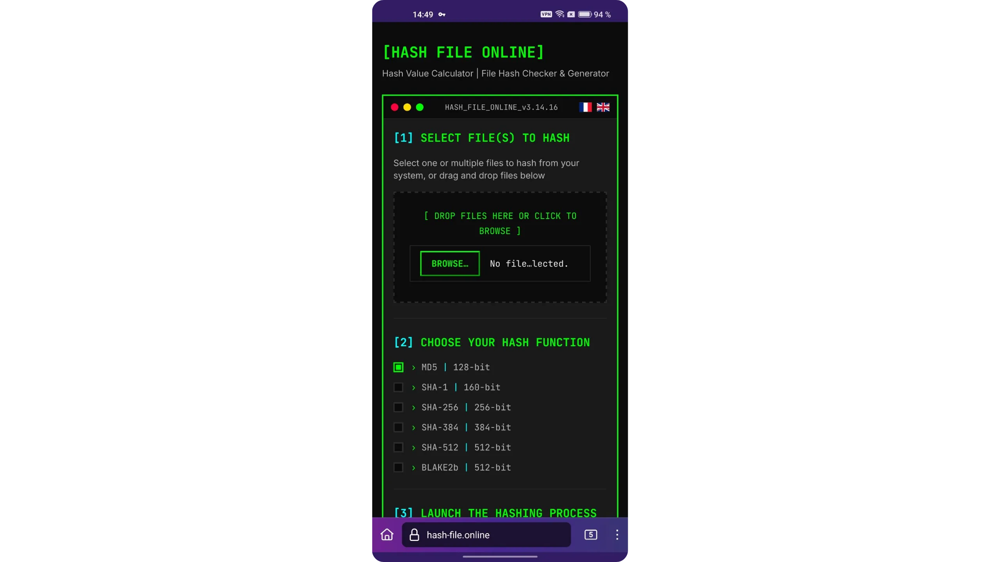

روی دکمه `BROWSE...` کلیک کنید و فایل `.apk` که در مرحله 2.1 دانلود شده است را انتخاب کنید.

سپس تابع هش `SHA-256` را انتخاب کنید و روی `CALCULATE HASH` کلیک کنید تا هش فایل خود را محاسبه کنید.

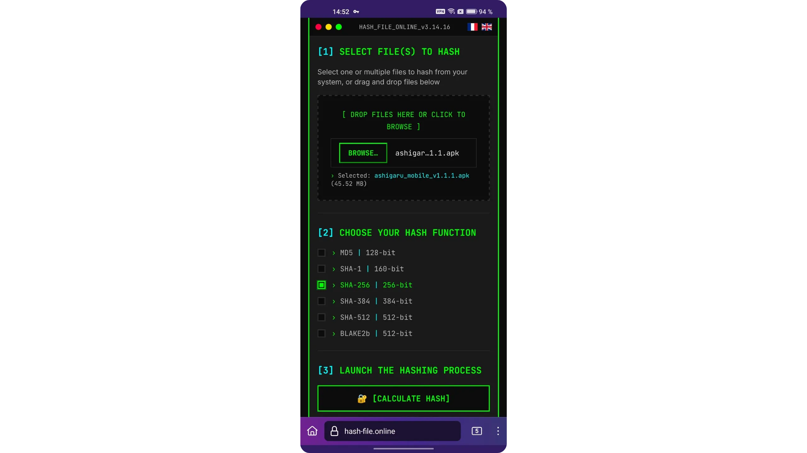

سایت هش فایل `.apk` شما را نمایش خواهد داد. آن را با هشی که در Keybase.io تأیید کرده‌اید مقایسه کنید. اگر دو هش یکسان باشند، بررسی اصالت و یکپارچگی با موفقیت انجام شده است. اکنون می‌توانید به نصب برنامه ادامه دهید.

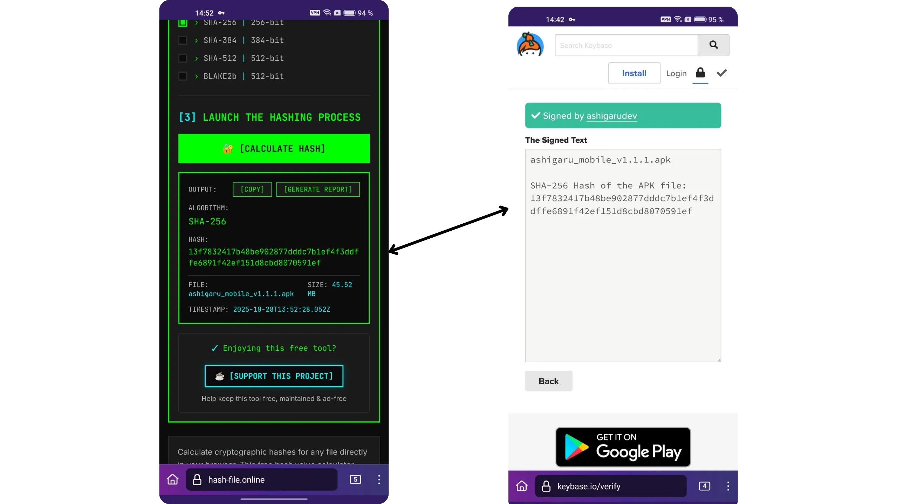

### ۲.۳. برنامه Ashigaru را نصب کنید

برای نصب برنامه، مدیر فایل گوشی خود را باز کرده و به پوشه دانلودها بروید. سپس روی فایل `.apk` که به تازگی بررسی کرده‌اید کلیک کنید و هنگام درخواست، نصب را تأیید کنید.

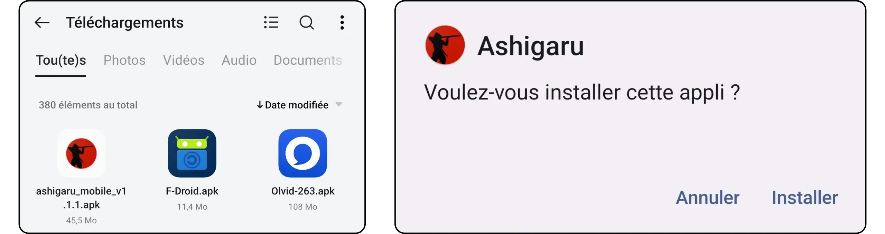

آشیگارو اکنون بر روی تلفن شما نصب شده است.

## ۳. برنامه را راه‌اندازی کنید و یک پورتفولیو Bitcoin ایجاد کنید.

هنگام راه‌اندازی برنامه برای اولین بار، `MAINNET` را انتخاب کنید.

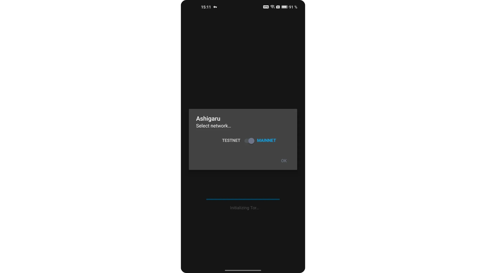

سپس روی `Get Started` کلیک کنید.

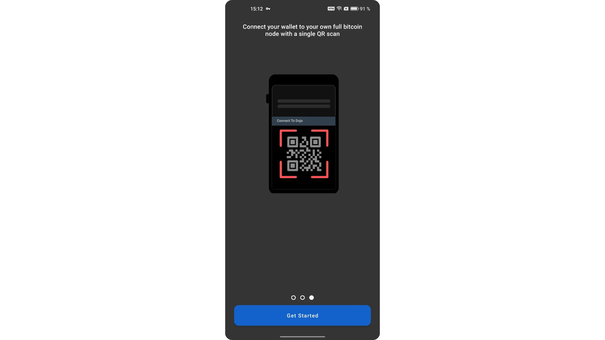

اکنون یک پرتفوی جدید Bitcoin ایجاد خواهیم کرد. دکمه `Create a new wallet` را فشار دهید.

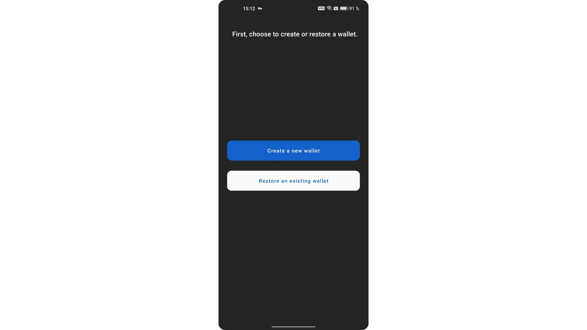

### 3.1. یک پرتفوی Bitcoin ایجاد کنید

Ashigaru به یک passphrase BIP39 نیاز دارد. passphrase خود را انتخاب کرده و آن را در فیلدهای مربوطه وارد کنید. باید تا حد امکان طولانی و تصادفی باشد تا در برابر حمله brute-force مقاومت کند.

بلافاصله یک نسخه پشتیبان فیزیکی از این passphrase تهیه کنید. این یک مرحله بسیار مهم است: اگر گوشی خود را گم کنید، **اگر دیگر این passphrase را نداشته باشید، دیگر قادر به دسترسی به بیت‌کوین‌های خود که با Ashigaru wallet ذخیره شده‌اند نخواهید بود.** همین passphrase برای رمزگذاری فایل بازیابی wallet نیز استفاده می‌شود.

اگر نمی‌دانید passphrase چیست یا به‌طور کامل نمی‌فهمید که چگونه کار می‌کند، به شدت توصیه می‌کنم که این آموزش اضافی را بخوانید. این مهم است، زیرا passphrase یک عنصر حیاتی از امنیت شماست: سوءتفاهم در استفاده از آن می‌تواند منجر به از دست دادن دائمی وجوه شما شود.

https://planb.academy/tutorials/wallet/backup/passphrase-a26a0220-806c-44b4-af14-bafdeb1adce7

پس از وارد کردن passphrase خود، روی `NEXT` کلیک کنید.

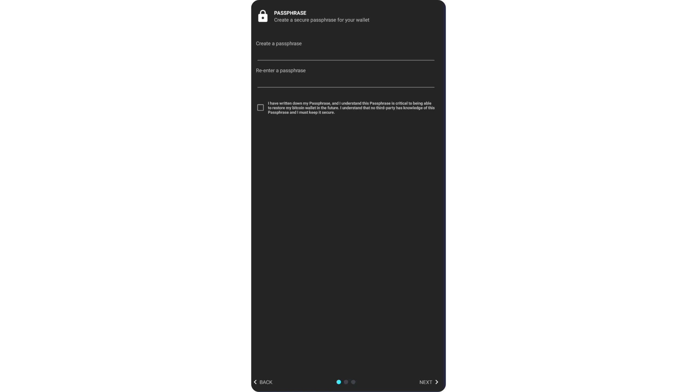

سپس یک کد PIN انتخاب کنید. این کد برای باز کردن قفل Ashigaru wallet شما استفاده خواهد شد و از دسترسی فیزیکی غیرمجاز محافظت می‌کند. این کد در مشتق‌گیری رمزنگاری کلیدهای wallet شما دخیل نیست. این بدان معناست که حتی بدون دانستن کد PIN، هر کسی با عبارت یادآور و passphrase شما قادر خواهد بود به بیت‌کوین‌های شما دسترسی مجدد پیدا کند.

یک کد پین طولانی و تصادفی انتخاب کنید. به یاد داشته باشید که یک نسخه پشتیبان را در مکانی جدا از تلفن خود نگه دارید تا از به خطر افتادن همزمان آنها جلوگیری کنید.

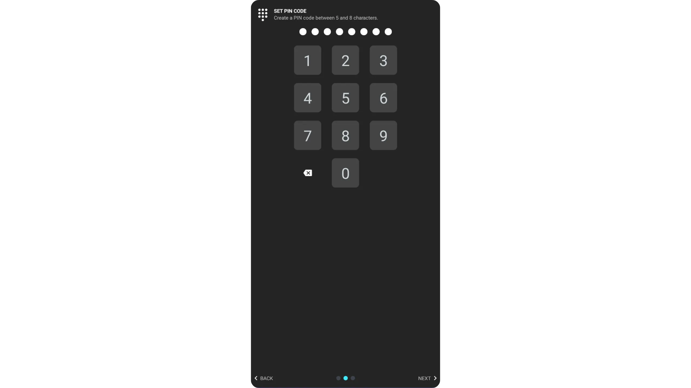

پس از ایجاد کد PIN، Ashigaru عبارت یادآور wallet شما را نمایش می‌دهد. هشدار: این عبارت، همراه با passphrase شما، دسترسی کامل به بیت‌کوین‌های شما را فراهم می‌کند. هر کسی که آن را در اختیار داشته باشد می‌تواند به دارایی‌های شما دسترسی پیدا کند، حتی اگر به تلفن شما دسترسی نداشته باشد. این توالی ۱۲ کلمه‌ای می‌تواند برای بازیابی wallet شما در صورت گم شدن، سرقت یا خرابی تلفن شما استفاده شود. بنابراین مهم است که آن را با نهایت دقت بر روی یک رسانه فیزیکی (کاغذ یا فلز) ذخیره کنید.

هرگز این عبارت را به صورت دیجیتالی ذخیره نکنید، زیرا خطر سرقت وجوه شما را به همراه دارد. بسته به استراتژی امنیتی شما، ممکن است چندین نسخه فیزیکی ایجاد کنید، اما هرگز آن را تقسیم نکنید. کلمات را به ترتیب دقیق خود نگه دارید و مطمئن شوید که شماره‌گذاری شده‌اند.

در نهایت، هرگز عبارت یادآور و passphrase را در یک مکان نگهداری نکنید. اگر هر دو به طور همزمان به خطر بیفتند، یک مهاجم می‌تواند به wallet شما دسترسی پیدا کند.

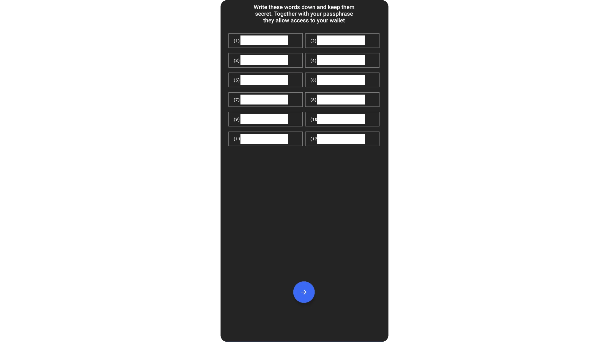

برای کسب اطلاعات بیشتر در مورد نحوه ایمن‌سازی عبارت یادآور خود، لطفاً به این آموزش مکمل مراجعه کنید:

https://planb.academy/tutorials/wallet/backup/backup-mnemonic-22c0ddfa-fb9f-4e3a-96f9-46e2a7954270

سپس Ashigaru از شما می‌خواهد که passphrase خود را دوباره تأیید کنید. از این فرصت استفاده کنید تا بررسی کنید که نسخه پشتیبان فیزیکی شما صحیح است.

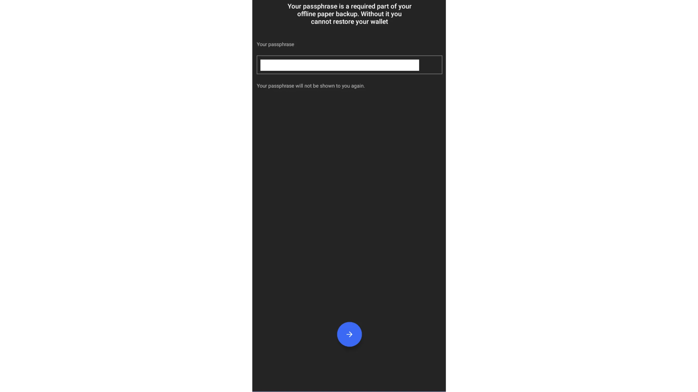

### ۳.۲. اتصال یک دوجو

سپس نوبت به مرحله اتصال به دوجو می‌رسد. همان‌طور که در مقدمه توضیح داده شد، آشیگارو باید به یک دوجو متصل شود تا بتواند با شبکه Bitcoin تعامل داشته باشد.

به "ابزار نگهداری" دوجوی خود وارد شوید و منوی `PAIRING` را باز کنید.

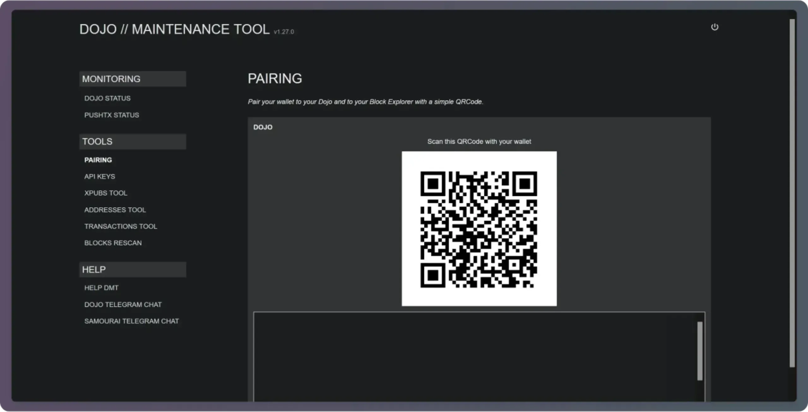

روی Ashigaru، دکمه `Scan QR` را فشار دهید، سپس کد QR اتصال که توسط DMT شما نمایش داده شده است را اسکن کنید. سپس برای تأیید روی `Continue` کلیک کنید.

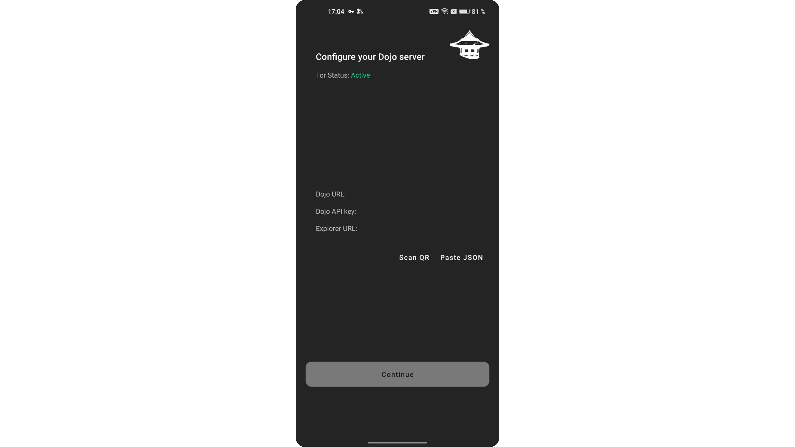

کد PIN خود را وارد کنید تا wallet را باز کنید. این کار شما را به صفحه همگام‌سازی می‌برد. مشاهده خطاهای *PayNym* در این مرحله طبیعی است، زیرا wallet جدید است. به سادگی روی `ادامه` کلیک کنید.

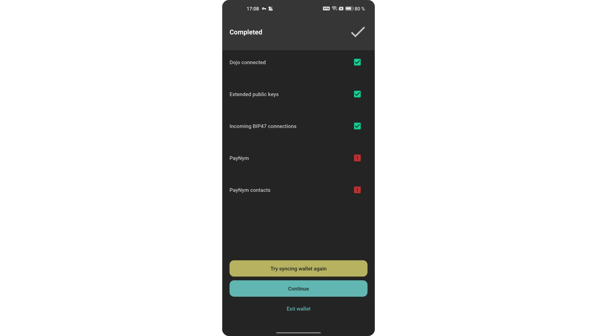

سپس به صفحه اصلی پرتفوی خود هدایت خواهید شد.

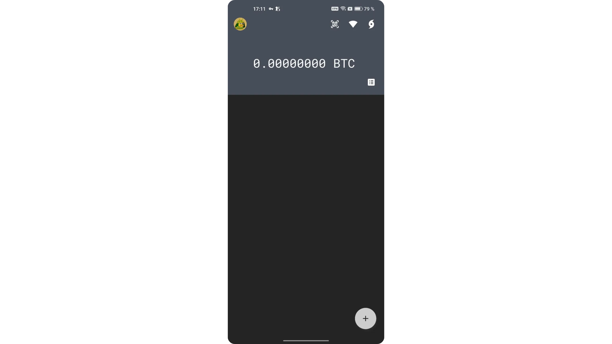

قبل از اینکه بیشتر پیش بروید، توصیه می‌کنم که یک بازیابی آزمایشی انجام دهید در حالی که wallet هنوز هیچ بیت‌کوینی ندارد. این به شما امکان می‌دهد تا بررسی کنید که آیا پشتیبان‌های کاغذی شما به درستی کار می‌کنند یا خیر. برای اطلاع از چگونگی انجام این کار، این آموزش را دنبال کنید:

https://planb.academy/tutorials/wallet/backup/recovery-test-5a75db51-a6a1-4338-a02a-164a8d91b895

## 4. راه‌اندازی برنامه Ashigaru

برای دسترسی به تنظیمات برنامه، روی تصویر *PayNym* خود در گوشه بالا سمت چپ کلیک کنید، سپس `Settings` را انتخاب کنید.

در اینجا چندین گزینه برای تطبیق عملکرد Ashigaru با نیازهای شما پیدا خواهید کرد. با این حال، به شدت توصیه می‌کنم که از همان ابتدا ۲ پارامتر مهم را فعال کنید.

با باز کردن منوی `امنیت > حالت مخفی` شروع کنید، سپس در صورت نیاز این ویژگی را فعال کنید. این ویژگی برنامه Ashigaru را پشت نام، لوگو و رابط کاربری یک برنامه معمولی نصب‌شده روی گوشی شما پنهان می‌کند. هدف این است که در صورت بازرسی فیزیکی گوشی شما، کسی نتواند Ashigaru را شناسایی کند.

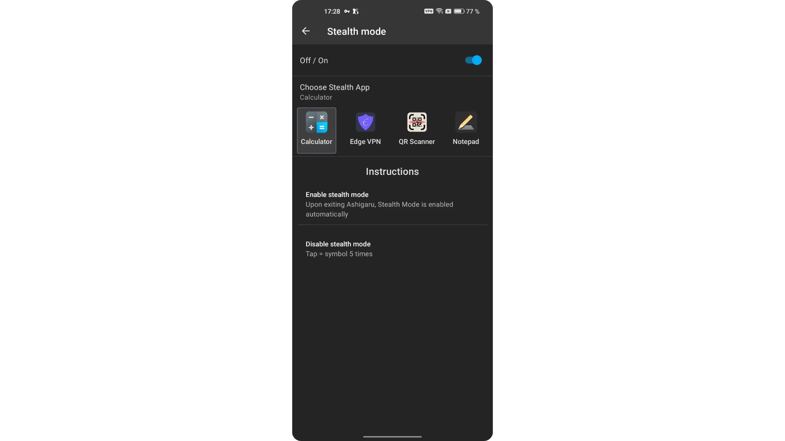

هر برنامه جعلی ارائه‌شده دارای روشی خاص برای باز کردن رابط واقعی Ashigaru است. به عنوان مثال، اگر ماشین‌حساب را انتخاب کنید، برنامه Ashigaru از صفحه اصلی شما ناپدید می‌شود و با یک ماشین‌حساب جعلی جایگزین می‌شود. وقتی آن را باز می‌کنید، یک رابط ماشین‌حساب کلاسیک و کارآمد را می‌بینید، اما برای دسترسی به Ashigaru، تنها کاری که باید انجام دهید این است که پنج بار به سرعت روی نماد `=` ضربه بزنید.

پارامتر مهم دوم برای فعال‌سازی [**RBF** (*Replace-by-Fee*)](https://planb.academy/resources/glossary/rbf-replacebyfee) است. این گزینه به شما اجازه می‌دهد هزینه یک تراکنش را افزایش دهید اگر در ممپول‌ها گیر کند زیرا هزینه آن خیلی پایین است. می‌توانید آن را از طریق منوی `Transactions > Spend using RBF` فعال کنید.

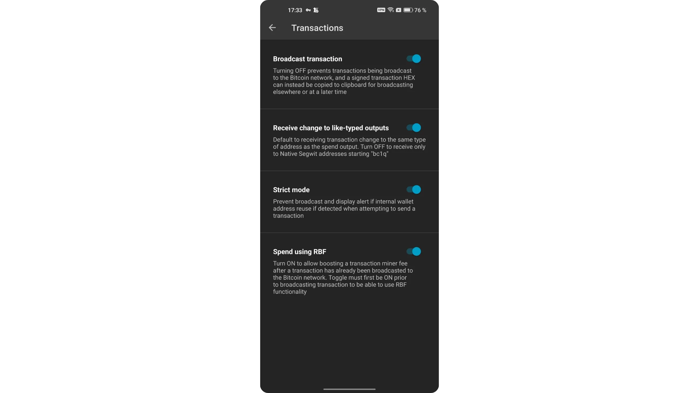

نکته: شما می‌توانید واحد نمایش پرتفوی خود را از `BTC` به `sat` تغییر دهید، تنها با کلیک کردن بر روی موجودی کل که در صفحه اصلی نمایش داده می‌شود.

## ۵. دریافت بیت‌کوین در Ashigaru

اکنون که پرتفوی شما فعال است، می‌توانید ساتس دریافت کنید. برای این کار، دکمه `+` را در پایین سمت راست رابط کاربری فشار دهید، سپس دکمه سبز `Receive` را فشار دهید.

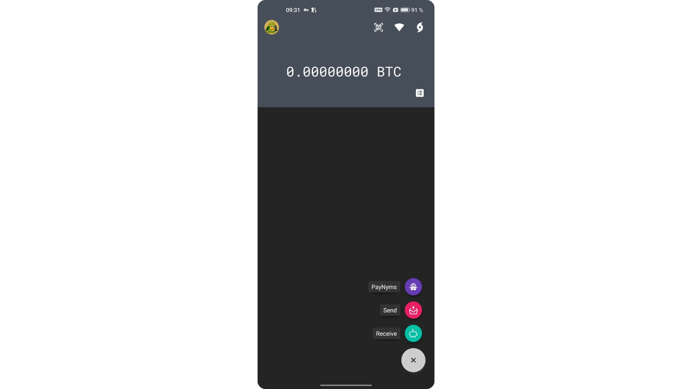

سپس Ashigaru اولین آدرس دریافت‌نشده در wallet شما را نشان می‌دهد تا از استفاده مجدد از آدرس جلوگیری کند (استفاده مجدد از آدرس برای حریم خصوصی شما بسیار بد است). سپس می‌توانید این آدرس را به شخص یا سرویسی که نیاز به ارسال بیت‌کوین به شما دارد، ارسال کنید.

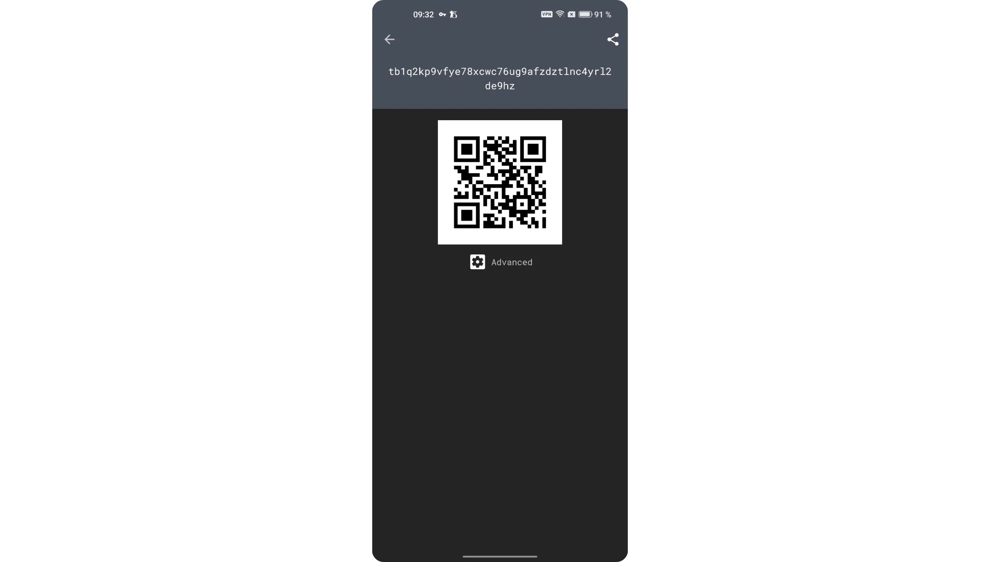

به محض اینکه تراکنش در شبکه پخش شود، به‌طور خودکار در صفحه اصلی برنامه ظاهر خواهد شد.

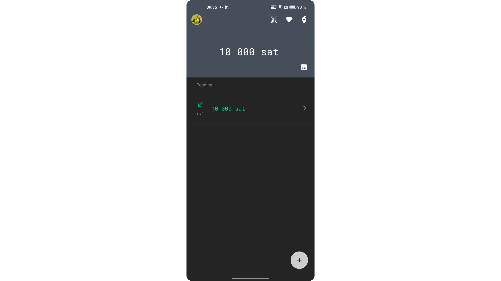

## ۶. ارسال بیت‌کوین با آشیگارو

اکنون که بیت‌کوین‌ها را در Ashigaru wallet خود دارید، می‌توانید آن‌ها را ارسال کنید. برای این کار، دکمه `+` در پایین سمت راست را فشار دهید، سپس دکمه قرمز `Send` را انتخاب کنید.

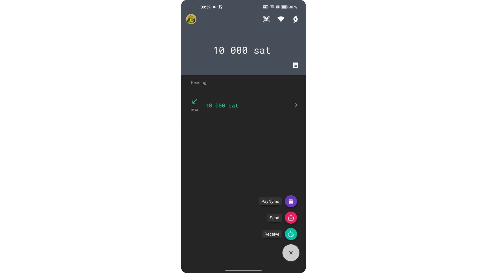

سپس حسابی را انتخاب کنید که می‌خواهید از آن هزینه کنید. در حال حاضر، ما هنوز به حساب `Postmix` که برای کوین‌جوین‌ها رزرو شده است، نپرداخته‌ایم و در یک آموزش بعدی به آن خواهیم پرداخت. بنابراین ما قصد داریم وجوه را از حساب اصلی سپرده ارسال کنیم.

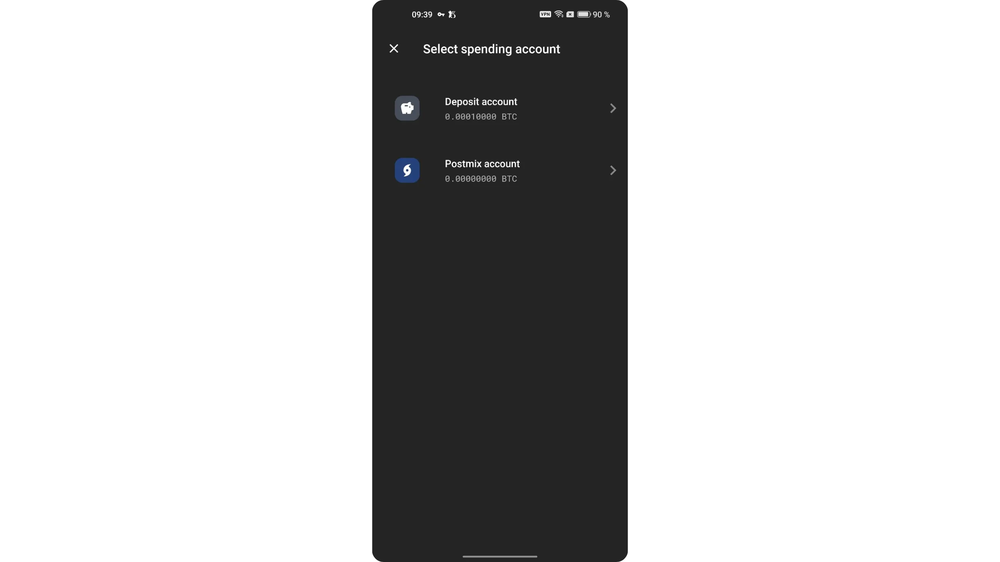

جزئیات تراکنش خود را وارد کنید: مبلغی که باید ارسال شود و آدرس Bitcoin گیرنده.

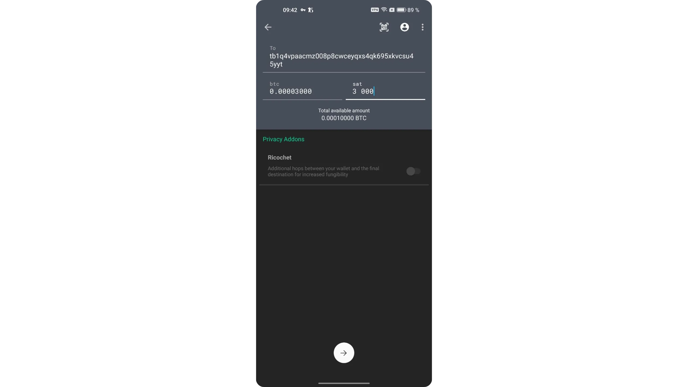

با کلیک بر روی سه نقطه کوچک در گوشه بالا سمت راست، سپس بر روی `نمایش خروجی‌های خرج‌نشده`، می‌توانید دقیقاً انتخاب کنید که کدام UTXOها را می‌خواهید خرج کنید تا حریم خصوصی خود را افزایش دهید.

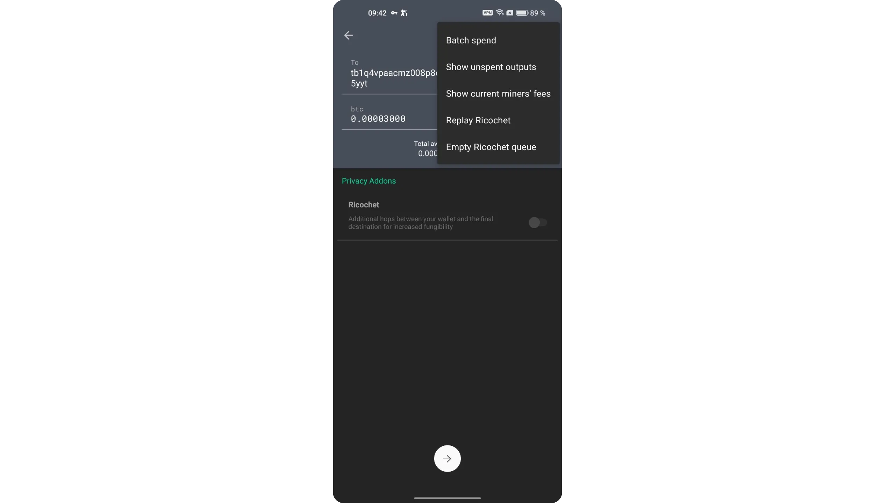

پس از پر کردن تمام جزئیات، روی فلش سفید در پایین رابط کاربری کلیک کنید تا ادامه دهید.

سپس به صفحه‌ای خلاصه هدایت خواهید شد که تمام جزئیات تراکنش شما را نشان می‌دهد. چندین عنصر مهم نمایش داده می‌شوند:

- در بخش `Destination`، یک بار دیگر بررسی کنید که آدرس گیرنده و مقدار ارسال شده صحیح هستند؛
- در بلوک `Fees`، می‌توانید نرخ کارمزدی که به‌طور خودکار توسط Ashigaru انتخاب شده است را مشاهده کنید و در صورت لزوم، با کلیک بر روی `MANAGE` آن را تغییر دهید؛
- بلوک `Transaction` نوع تراکنشی را که قصد انجام آن را دارید نشان می‌دهد. در اینجا، ما در مورد یک تراکنش ساده صحبت می‌کنیم، اما Ashigaru از انواع دیگر تراکنش‌های بهینه‌سازی‌شده برای حفظ حریم خصوصی نیز پشتیبانی می‌کند که در یک آموزش آینده به‌طور مفصل به آن‌ها خواهیم پرداخت؛
- بلوک قرمز `Transaction Alert` به شما هشدار می‌دهد اگر تراکنش شما الگوهایی را نشان دهد که توسط ابزارهای تحلیل زنجیره قابل شناسایی هستند و می‌توانند حریم خصوصی شما را به خطر بیندازند. با کلیک بر روی آن، می‌توانید جزئیات را مشاهده کنید. به عنوان مثال، در مورد من، Ashigaru به من می‌گوید که مبلغ ارسال شده گرد است (`3000 sats`)، که به من اجازه می‌دهد تشخیص دهم کدام خروجی مربوط به هزینه و کدام مربوط به تبادل است. برای کسب اطلاعات بیشتر در مورد این روش‌های تحلیل زنجیره، از شما دعوت می‌کنم تا دوره آموزشی BTC 204 من را در Plan ₿ Academy دنبال کنید؛
- در نهایت، می‌توانید به تراکنش خود برچسبی اضافه کنید تا هدف آن را ثبت کنید.

https://planb.academy/courses/65c138b0-4161-4958-bbe3-c12916bc959c

پس از بررسی تمام اطلاعات، از فلش سبز برای ارسال بیت‌کوین‌ها استفاده کنید. فلش را نگه دارید و سپس آن را به سمت راست بکشید تا بارگذاری تأیید شود.

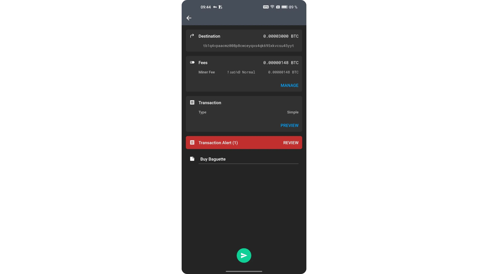

تراکنش شما در شبکه Bitcoin پخش شده است.

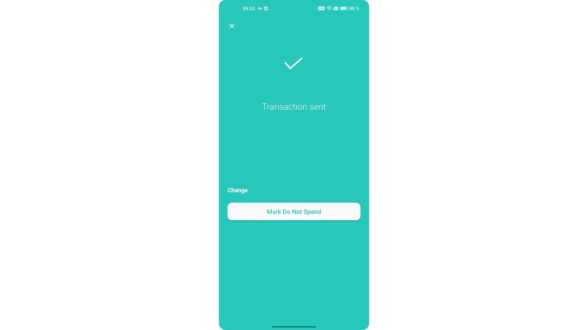

## ۷. بازیابی Ashigaru wallet شما

بازیابی یک Ashigaru wallet کمی با بازیابی یک Bitcoin کلاسیک متفاوت است، زیرا این برنامه از همان روش‌های Samurai Wallet استفاده می‌کند. اگر دسترسی به wallet خود را از دست بدهید (چه به دلیل فراموش کردن PIN، حذف نصب یا گم کردن تلفن)، چندین راه برای بازیابی بیت‌کوین‌های شما وجود دارد.

اگر هنوز به تلفن خود دسترسی دارید، یا اگر از این فایل نسخه پشتیبان تهیه کرده‌اید، ساده‌ترین روش استفاده از فایل پشتیبان `ashigaru.txt` است. این فایل حاوی تمام اطلاعاتی است که برای بازیابی پرتفوی خود در یک نمونه جدید از Ashigaru (یا در Sparrow Wallet) نیاز دارید، اما با passphrase که در مرحله 3.1 این آموزش تعریف کرده‌اید رمزگذاری شده است. بنابراین باید هم فایل `ashigaru.txt` و هم passphrase خود را برای استفاده از این روش داشته باشید.

با این دو عنصر، می‌توانید به عنوان مثال، پورتفولیوی خود را در Sparrow Wallet بازیابی کنید.

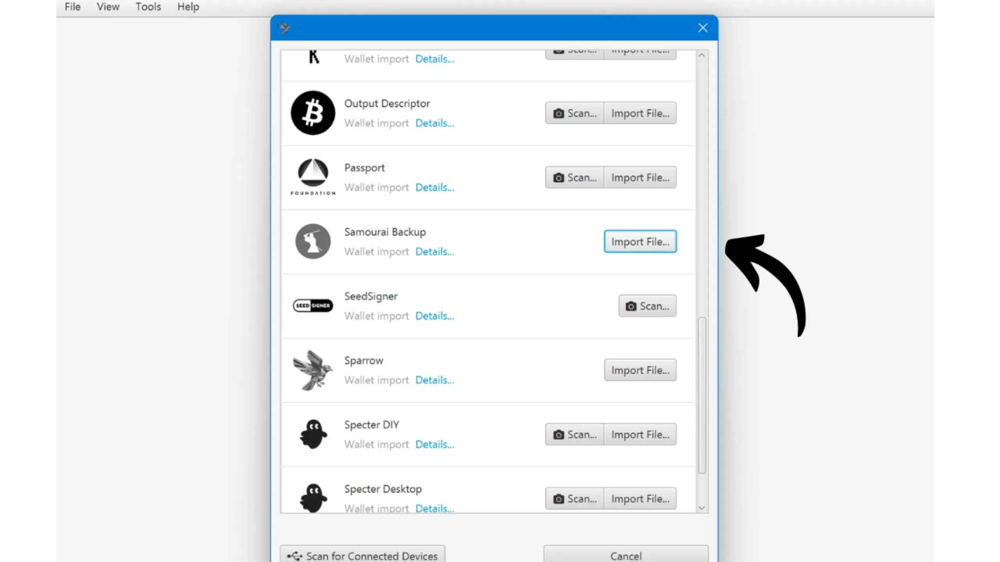

اگر به فایل `ashigaru.txt` دسترسی ندارید، همچنان می‌توانید با استفاده از عبارت یادآور passphrase خود، به وجوه خود دسترسی پیدا کنید، همان‌طور که برای هر پورتفولیوی Bitcoin دیگر انجام می‌دهید. توصیه می‌کنم این بازیابی را یا بر روی یک نمونه جدید Ashigaru انجام دهید، یا مستقیماً بر روی Sparrow Wallet، تا به راحتی مسیرهای بای‌پس را از Whirlpool بازیابی کنید اگر از آن استفاده می‌کردید. به‌طور جایگزین، می‌توانید این اطلاعات را با وارد کردن دستی مسیرهای مشتق‌سازی، به هر نرم‌افزار سازگار با BIP39 وارد کنید.

برای کسب اطلاعات بیشتر در مورد این فرآیند، لطفاً به آموزش کامل من در مورد بازیابی Wallet Samurai wallet مراجعه کنید. از آنجا که Ashigaru یک fork است، روش کار یکسان است:

https://planb.academy/tutorials/wallet/backup/samourai-recover-23bb6221-ea3e-42e6-a5b7-e6dbef5073c3

همان‌طور که می‌بینید، هر روشی برای بازسازی استفاده کنید، passphrase ضروری است. بنابراین مطمئن شوید که آن را با دقت پشتیبان‌گیری کنید. همچنین می‌توانید بسته به استراتژی امنیتی خود، چندین نسخه تهیه کنید.

## ۸. به‌روزرسانی برنامه

برای به‌روزرسانی اپلیکیشن Ashigaru، از آنجا که آن را از طریق فایل `.apk` نصب کرده‌اید و نه از طریق فروشگاه Play مانند یک اپلیکیشن معمولی، باید فایل جدید `.apk` مربوط به نسخه به‌روز شده را دانلود کرده و سپس به صورت دستی نصب کنید.

مراحل شرح داده شده در بخش 2 این آموزش را تکرار کنید، به جز اینکه وقتی روی فایل `.apk` کلیک می‌کنید تا نصب را آغاز کنید، **باید گوشی اندروید شما گزینه `Update` را به شما ارائه دهد، نه `Install`**.

این یک نکته بسیار مهم است: اگر اندروید به جای `Update`، `Install` را نمایش دهد، احتمالاً در حال نصب یک نسخه جعلی هستید. در این صورت، بلافاصله روند نصب را متوقف کنید.

همانند نصب اولیه، لطفاً قبل از ادامه به‌روزرسانی، اصالت و یکپارچگی فایل `.apk` را بررسی کنید.

برای اطلاع از زمان انتشار نسخه جدید، هر از گاهی به وب‌سایت رسمی Ashigaru مراجعه کنید. مطمئن باشید، Ashigaru یک برنامه پایدار و بالغ است که از Samourai Wallet به ارث رسیده و به‌روزرسانی‌ها نسبت به نرم‌افزارهای جوان‌تر نسبتاً کم‌تعدادتر هستند.

## ۹. به پروژه آشیکارو کمک مالی کنید

آشیگارو یک پروژه متن‌باز است. اگر مایل به حمایت از توسعه آن هستید، می‌توانید از طریق PayNym مستقیماً از داخل برنامه کمک مالی کنید.

برای انجام این کار، روی PayNym خود در بالای سمت راست رابط کاربری کلیک کنید، سپس کد پرداخت خود را که با `PM...` شروع می‌شود، انتخاب کنید.

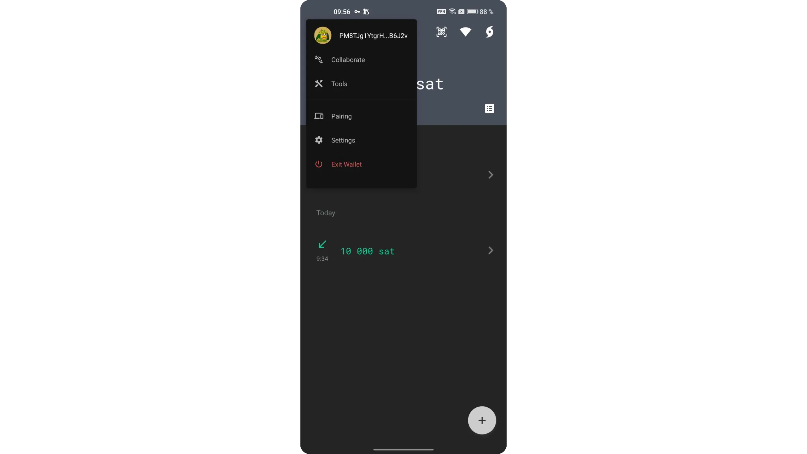

سپس دکمه `+` را در پایین سمت راست صفحه فشار دهید.

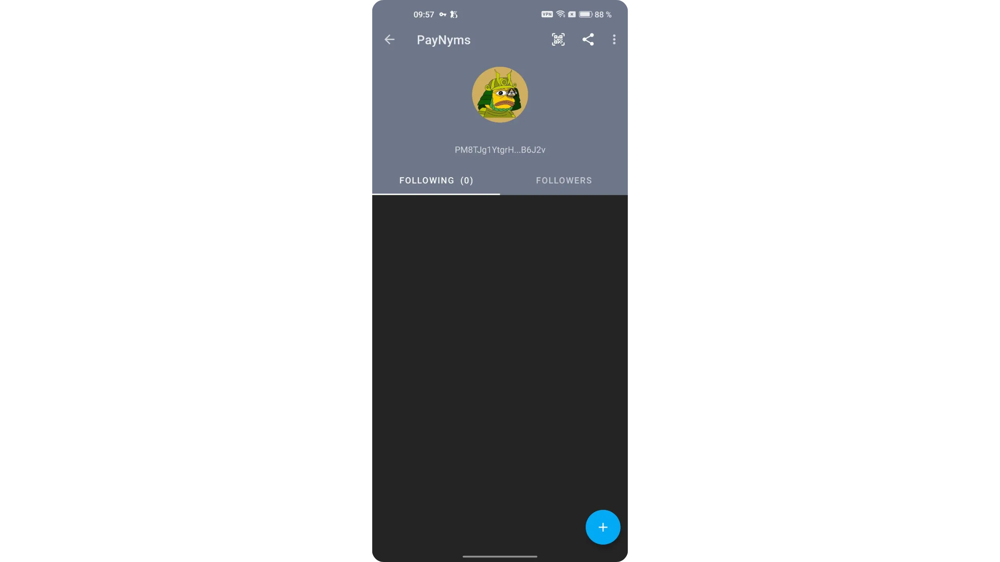

`پروژه منبع باز Ashigaru` را به عنوان گیرنده انتخاب کنید.

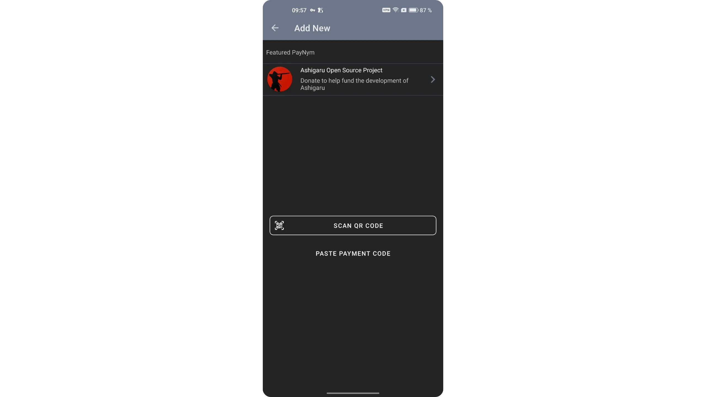

روی دکمه `CONNECT` کلیک کنید تا کانال ارتباطی BIP47 برقرار شود (اطلاعات بیشتر درباره این پروتکل در آموزش زیر).

https://planb.academy/tutorials/privacy/on-chain/paynym-bip47-a492a70b-50eb-4f95-a766-bae2c5535093

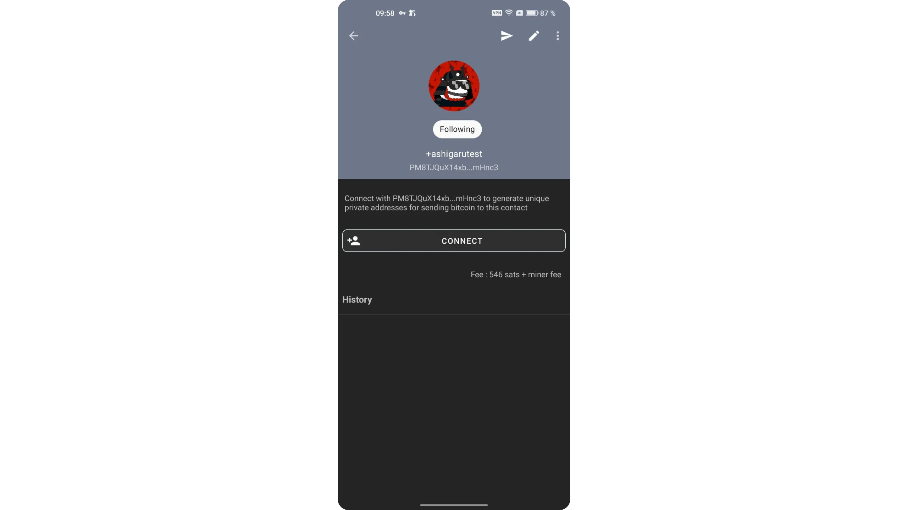

به محض تأیید تراکنش اعلان، می‌توانید با کلیک بر روی فلش سفید کوچک در گوشه بالا سمت راست رابط کاربری، کمک‌های خود را به پروژه ارسال کنید.

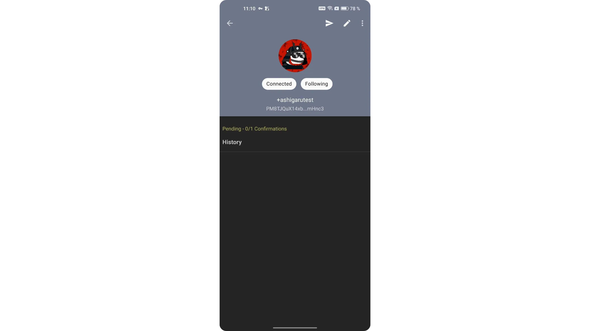

اکنون می‌دانید چگونه از ویژگی‌های پایه‌ای برنامه Ashigaru استفاده کنید. در آموزش‌های آینده، به بررسی نحوه استفاده از تراکنش‌های پیشرفته هزینه‌کرد، و همچنین Whirlpool، پیاده‌سازی coinjoin که از Samurai Wallet به ارث رسیده است، خواهیم پرداخت.
https://planb.academy/tutorials/privacy/on-chain/ashigaru-terminal-9a0d46d3-33b9-4c64-84c5-bfa25b3a0add
