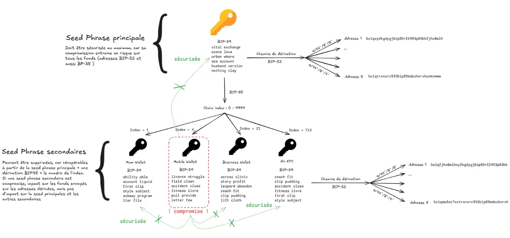
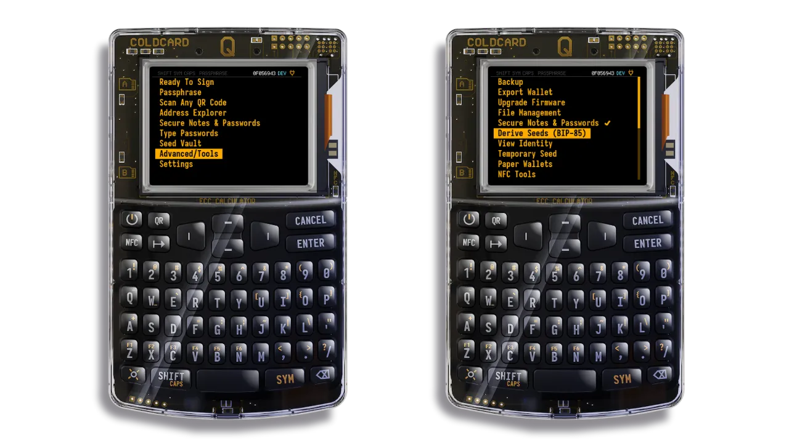
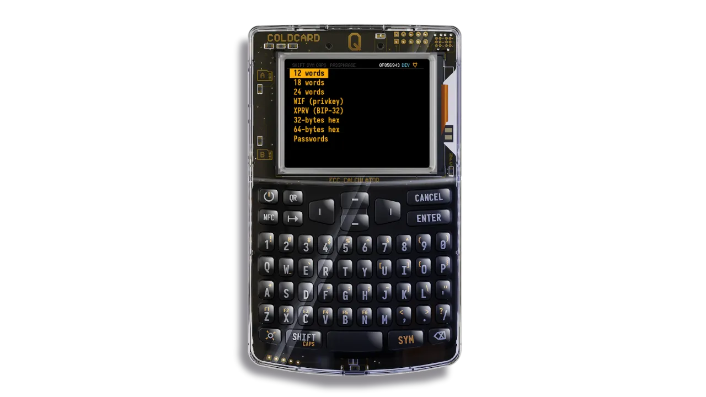
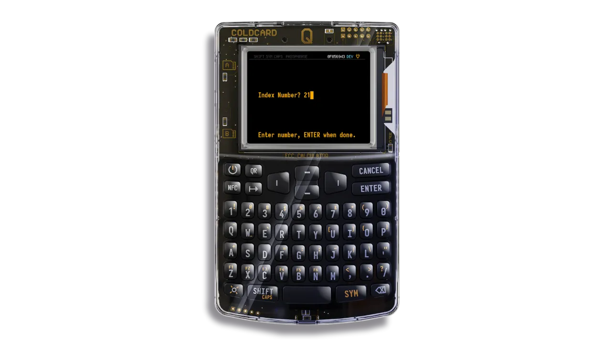
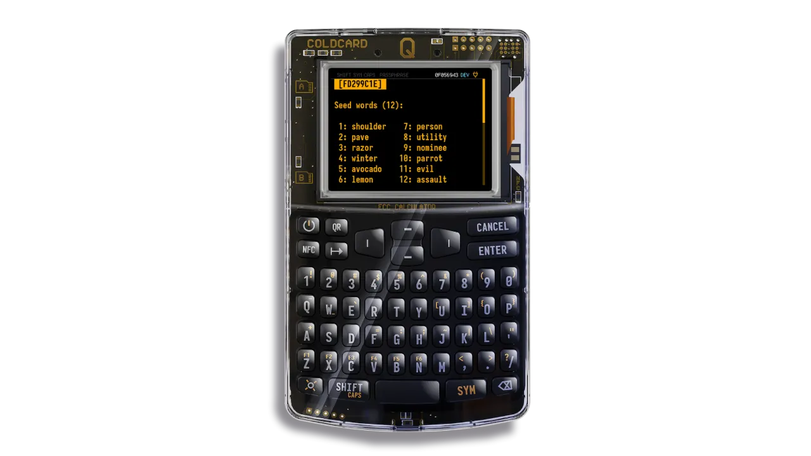
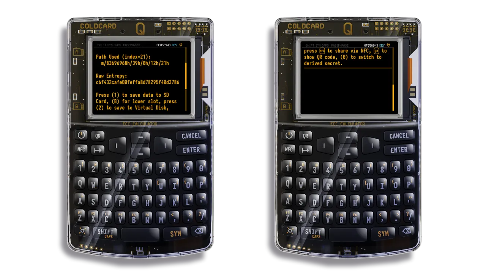

## 1.瞭解 BIP-85

### 1.1 什麼是 BIP-85？

BIP-85 是一項進階功能，可讓您從一個 **seed 主語句**建立多個 **seed 次要語句**。

每個 seed 次要句子可用來建立完全獨立的 Bitcoin 組合。這些組合可以用於各種用途：移動上的 Hot Wallet、給親戚的組合、獨立的儲蓄組合等。

所有 seed 副詞組都是**從語法衍生出來的**，但是**不可能從副詞組追溯到 seed 主詞組。這可確保每個組合之間完全分離。

只要您可以存取 seed 主詞組（以及相關的 passphrase，如果您使用的是 passphrase），您就可以**相同地**再生任何 seed 次要詞組，而無需另外儲存。

### 1.2 為何使用 BIP-85？

如果您想要 ：

- 建立數個獨立的 Bitcoin 組合，無須多重備份
- 根據不同用途（儲蓄、開銷、家庭、計畫）管理您的資金
- 為親屬提供保障（「吉姆叔叔」功能）
- 刪除投資組合而不會失去存取資金的權限
- 簡化您的安全性：只需一個 seed 關鍵詞組即可保護

### 1.3 優於 BIP-32

使用 BIP-32，一個 seed 句子可以使用衍生路徑 (例如：`m/44'/0'/0'/0/0`) 來 generate Bitcoin 帳號和位址的完整層級。每個路徑都可以代表一個獨立的帳號，但**所有的帳號都會連結到同一個 seed 句子**。因此，如果這個 seed 語句被攻破，**所有衍生帳戶都會變得可存取**。

使用 BIP-85，一個 seed 主句可以用來 generate 數個完全獨立的 seed 次要句： **如果其中一個次要種子遭到攻擊，攻擊者將永遠無法回到 seed 主句或存取其他組合**。

這使得將風險分門別類成為可能：

- 您可以使用副 seed 作 Hot Wallet 或臨時使用，接受較高的曝光。
- 即使這個 Hot Wallet 遭到攻擊，您的其他資金受到其他次級種子的保護或保持離線狀態，**仍是安全的。

另一方面，對於 BIP-32 和 BIP-85，如果主 seed 遭到攻擊，**所有資金都會受到攻擊。因此，以最高安全層級保護它至關重要。

## 2.BIP-85 的實用案例

BIP-85 可讓您從單一 seed 核心詞組建立多個 Bitcoin 投資組合，每個組合都有自己的 seed 次要詞組。以下是五個組織和保護 Bitcoin 資金的實用案例。每個案例都說明了為什麼使用 BIP-85 比透過 BIP-32 以單一 seed 詞組管理多個帳戶更實用。

### 2.1 限制安全性較低的投資組合風險

- 情況**：您使用「Hot Wallet」Wallet（安裝在網路連線裝置上），進行日常交易。
- 解決方案 BIP-85**：您建立一個 seed 的次要詞組，專門用於此組合。
- 相較於 BIP-32 的優勢**：您不需要將 seed 主要短語匯入您的手機，可降低駭客入侵的風險。只有 seed 次要短語會被洩露，保護您的其他錢包。使用 BIP-32 時，您需要使用 seed 主短語和旁路路徑，這會暴露您的所有資金。

### 2.2 為家庭成員建立作品集

- 情景**：您為親近的人（例如您的母親）設定了一個 Bitcoin Wallet，同時如果他們遺失了，您可以將其復原。
- 解決方案 BIP-85**：您建立專屬的 seed 副句子，並只分享此副句子。
- 優於 BIP-32**：使用 BIP-32，為親人建立帳戶需要分享您的主 seed 詞組，這會冒險您所有的資金，並使您親人的管理變得複雜（管理分支路徑），或者在您的主 seed 詞組之外建立一個新的 seed 詞組來儲存。

### 2.3 便利獨立投資組合的管理

- 情況**：您分開比特幣作不同用途 (例如長期儲蓄、非 KYC 資金)。
- 解決方案 BIP-85**：您為每個目標建立 seed 次要詞組。
- 優於 BIP-32**：使用 BIP-32，所有帳戶共用相同的 seed 詞組，這使得第三方投資組合中的管理變得複雜，因為需要管理衍生路徑，例如 `m/44'/0'/0'`。此外，也無法為每個裝置指派獨立的帳戶 (例如「Coldcard 上的儲蓄」、「手機上的每日」、「Trezor 上的假期」)。BIP-85 會為每個目標指派唯一的 seed 次要詞組，方便識別並分別匯入每個裝置。

### 2.4 使用臨時 Wallet 進行交易

- 情況**：您需要臨時投資組合來進行一次性交易或保密（例如：混合資金、與 Exchange KYC 互動等）。
- 解決方案 BIP-85**：您建立一個 seed 次要句子，用於交易，然後在必要時銷毀它，因為您知道它可以再生。
- 優於 BIP-32**：使用 BIP-32 時，臨時帳戶取決於 seed 主句，一旦洩密，您的所有資金都會暴露。

## 3.開始之前

- 硬體** (選購)
 - Coldcard Mk4 或 Q1
 - MicroSD 卡

- 基本知識
 - 瞭解 Mnemonic 詞組 (BIP-39)：12 到 24 個詞彙的清單，以儲存組合。
 - 知道什麼是 Bitcoin Wallet：管理您的 bitcoins 的軟體或裝置，以及如何用 Mnemonic 短語還原。
 - 附件中有更多資源。

- 相容**軟體
 - Sparrow wallet (電腦，僅供觀看或進階管理使用)
 - 雙節棍（移動式，用於多重簽名）
 - BlueWallet (行動版)
 - ...

- 3.4 冷卡**配置
 - 在 Coldcard 上初始化一個包含 24 個單字的 seed 句子。
 - 選購：新增 passphrase 以確保 BIP-85 分支的存取安全。
 - 啟動有用的選項：NFC (用於輸出)、停用電池上的 USB (安全性)。

## 4.逐步教學

請遵循以下步驟，在 Coldcard 上建立、使用和擷取具有 BIP-85 的副 Mnemonic。

### 4.1 generate a seed 次要句子

您將從 seed 主詞組中建立一個 seed 次要詞組。

開啟您的 Coldcard，輸入您的 PIN 碼。

- 1.如果您已將 passphrase 應用於主 seed：**
 - 從主畫面，移至 `passphrase`。
    - 選擇「新增字詞」並輸入密碼。
    - 按「應用」。
    - 檢查 Wallet 的身分：移至 `進階 > 檢視身分 ` 記下 Wallet 的指紋。

- 2.前往 BIP-85** 功能表
 - 從主畫面，移至「進階 > 衍生 seed B85」。
 - 閱讀警告並確認。

ColdCard 會通知您，所產生的種子在數學上來自您的主 seed，但在密碼上卻是完全獨立的。

- 3.選擇格式

選擇 seed 詞組格式：12、18 或 24 個字。檢查您要匯入 seed 詞組的 Wallet 可接受的字數。

- 4.選擇索引
 - 輸入介於 0 到 9999 之間的索引。
 - 此索引對於日後再生次級 seed 至關重要。請小心保存，並貼上標籤，例如"Index 1 = Wallet mobile"、"Index 2 = family project"、"Index 4 = test mix"...。
 - 如果遺失，您不會失去存取資金的權利，但您必須測試從 0 到 9999 的組合，才能找到資金。

- 5.註記或匯出 seed 次要句子**

ColdCard 現在會顯示新的 seed 次要句子。您可以 ：

 - 手動**的**注意事項。
 - 新聞 ：
     - 1` 保存在 SD 卡上
     - `2` 在 ColdCard 上**進入「使用此 seed」**模式（對於匯出或簽署交易非常有用）。
     - 3` 顯示 **QR 代碼** (使用 BlueWallet 或 Nunchuck 等行動應用程式掃描)
     - 4` 透過**NFC**傳送

💡至此，您已擁有獨立的 seed 詞組，可在任何 Wallet BIP39 (Trezor、Ledger、BlueWallet、Nunchuck...) 中使用。

### 4.2 使用副 seed

現在您可以使用這個衍生的 seed 在 .NET Framework 中建立新的投資組合：

- 手機應用程式
- 另一個 Hardware Wallet
- a Multisig 組合

### 4.3 復原遺失的 seed 次要詞組

若要隨時取回副 seed，請重複此程序：

1.重新啟動 ColdCard

2.輸入您的 PIN 碼

3.輸入您的 passphrase（如果已定義

4.移至 `進階 > 衍生 seed B85`

5.選擇格式 (12/18/24 字)

6.輸入相同的索引 (例如 `1`)

7.您將獲得完全相同的二次 seed

## 5.限制、風險和最佳實踐

### 5.1 依賴 seed 主句 + passphrase

BIP85 的使用完全依賴於 24 個字的 seed 主句，以及 passphrase (如果您已套用)。

- 從這兩個 Elements，可以再生出所有 seed 的次要詞組。
- 如果沒有這 2 個 Elements 中的一個，您就會失去所有衍生工具組合的存取權。

### 5.2 多重簽章配置的風險

我們強烈建議不要在 multi-sig 組態中使用由相同的主要 seed 詞組所產生的次要 seed 詞組：如果裝置或主要 seed 詞組遭到攻擊，所有 multi-sig 金鑰都可能被攻擊者重新產生。

### 5.3 軟體相容性

並非所有應用程式都直接支援 BIP85 衍生。不過，透過 BIP85 產生的種子是標準的 BIP39 種子 (12、18 或 24 個字)，因此可以用於任何與 BIP39 相容的組合。

### 5.4 BIP85 帳戶登記

建議保持 seed 次要詞組的最新個人登錄。

- 它可讓您快速找出哪個 BIP85 指數對應哪個投資組合，而無需保留 seed 次要詞組。
- 這個暫存器應該保持簡約風格，不要明確提及 Bitcoin，並應該與主 seed 分開儲存。記得在繼承計畫中提到它。

暫存器可包含 ：

- 使用的 bIP85 索引（數值從 0 到 9999 不等）。
- 用途或參考名稱 (例如：Hot Wallet、個人儲蓄、媽媽的 Wallet)
- 如有必要，可在 ColdCard 中驗證 Wallet 指紋

### 5.5 備份

備份必須包括 ：

- 主 seed
- gW-76（如使用）

切勿存放在一起：

- 主 seed 和 passphrase
- 主 seed 和 BIP85 帳戶寄存器

附件中有更多資源。

## 附錄

## A.1 詞彙

- [BEEP](https://planb.network/resources/glossary/bip)
- [BIP-32](https://planb.network/resources/glossary/bip0032)
- [BIP-39](https://planb.network/resources/glossary/bip0039)
- [BIP-85](https://planb.network/resources/glossary/bip0085)
- [seed 短語](https://planb.network/resources/glossary/recovery-phrase)
- [passphrase](https://planb.network/resources/glossary/passphrase-bip39)
- [Multisig](https://planb.network/resources/glossary/multisig)

### A.2 儲存您的復原短語

https://planb.network/tutorials/wallet/backup/backup-mnemonic-22c0ddfa-fb9f-4e3a-96f9-46e2a7954270

### A.3 瞭解 passphrase BIP39

https://planb.network/tutorials/wallet/backup/passphrase-a26a0220-806c-44b4-af14-bafdeb1adce7

### A.4 Bitcoin 組合如何運作

https://planb.network/courses/46b0ced2-9028-4a61-8fbc-3b005ee8d70f