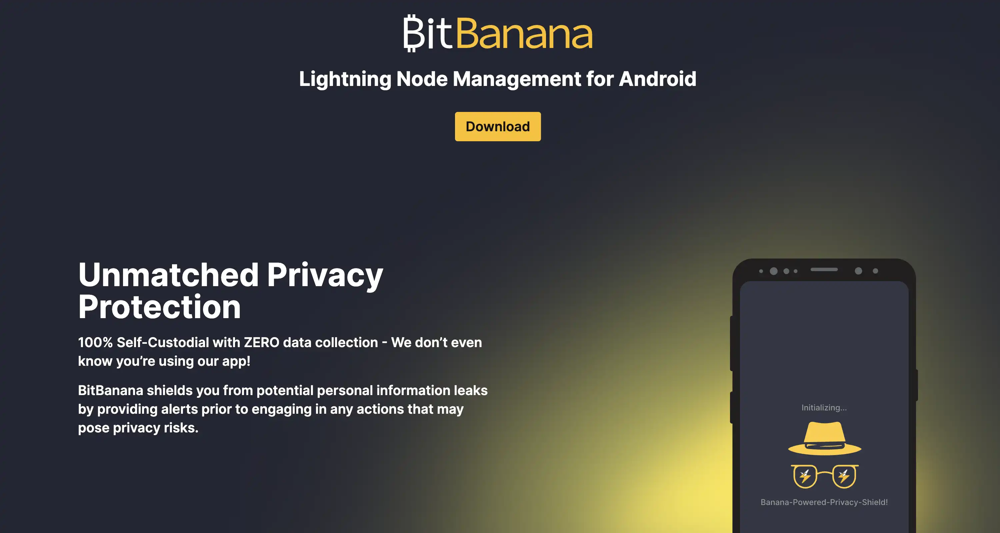

V tomto návodu se dozvíte, jak nainstalovat a nakonfigurovat aplikaci BitBanana v systému Android pro ovládání uzlu Lightning ze smartphonu. Ukážeme si, jak aplikaci připojit k vaší stávající infrastruktuře (Umbrel, RaspiBlitz, myNode nebo jakýkoli uzel LND/Core Lightning), provádět platby Lightning, vzdáleně spravovat kanály, zobrazovat příjmy z routingu a zálohovat konfigurace. Dozvíte se také o nejlepších bezpečnostních postupech pro ochranu přístupu k vašemu uzlu a o srovnání s populární alternativou Zeus.

## Představujeme BitBanana

BitBanana je open source mobilní aplikace pro Android, která promění váš smartphone v kompletní ovládací panel pro vzdálené ovládání vašeho uzlu Lightning. Na rozdíl od peněženek Lightning, které do telefonu vkládají místní uzel, BitBanana uplatňuje filozofii 100% vzdáleného ovládání: aplikace nedrží žádný satoshi a připojuje se pouze k vaší stávající infrastruktuře.

Aplikace vyvinutá Michaelem Wünschem pod licencí MIT zaručuje naprostou transparentnost s nulovým shromažďováním osobních údajů a ověřenými reprodukovatelnými sestaveními. BitBanana nativně podporuje LND a Core Lightning prostřednictvím standardních URI (`lndconnect://` a `clngrpc://`), což výrazně zjednodušuje počáteční konfiguraci. Aplikace také rozpoznává LndHub a Nostr Wallet Connect pro uživatele bez osobního uzlu, ačkoli tyto režimy fungují kustodicky s omezenou funkčností.

Rozhraní nabízí plný přístup ke všem důležitým funkcím vašeho uzlu: odesílání a přijímání plateb (BOLT11, Lightning Address, LNURL, BOLT12, Keysend), správa kanálů Lightning (otevření, uzavření, úprava poplatků, rebalancování), pokročilé ovládání mincí a správa strážní věže. BitBanana také implementuje několik robustních bezpečnostních vrstev: biometrické zamykání, režim stealth, nouzový PIN a nativní podporu Tor pro anonymizaci připojení.

## Podporované platformy a instalace

### Instalace

BitBanana je k dispozici výhradně pro Android 8.0 nebo vyšší. Pro iOS aplikace neexistuje a žádná verze se neplánuje. Toto omezení je vysvětleno historií projektu: BitBanana je přímým nástupcem aplikace Zap Android, kterou původně vyvinul Michael Wünsch, který se rozhodl pokračovat ve své práci pod vlastní značkou. Zap byla rodina samostatných aplikací (Zap Android, Zap iOS, Zap Desktop), které vyvíjeli různí přispěvatelé s oddělenými základnami kódu. BitBanana pokračuje pouze ve větvi pro Android.

Ekosystém iOS navíc představuje významná regulační a technická omezení pro aplikace Lightning, které nejsou určeny k výkonu trestu odnětí svobody. V roce 2023 společnost Apple odmítla aktualizaci aplikace Zeus kvůli "porušení licence" a v roce 2024 společnost Phoenix Wallet opustila americký obchod App Store kvůli regulačním nejasnostem týkajícím se poskytovatelů služeb Lightning. Tyto překážky vysvětlují, proč mnozí vývojáři aplikací Lightning dávají přednost systému Android, který nabízí otevřenější politiku pro aplikace, které nejsou opatřeny svolením.

Pro systém Android jsou k dispozici tři způsoby instalace: (více než 5000 instalací, automatické aktualizace), F-Droid (reprodukovatelné sestavení, ověření zdrojového kódu) nebo ruční APK z GitHubu.

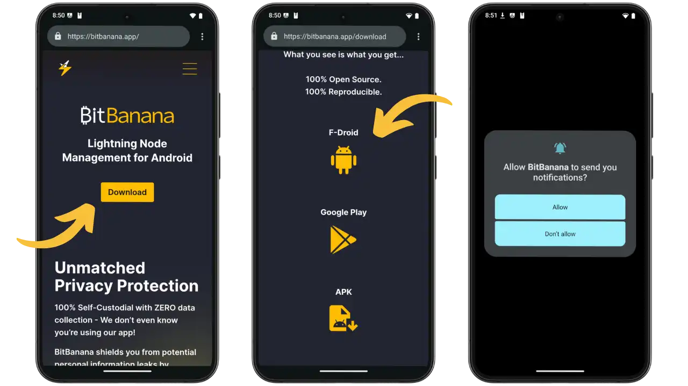

Oficiální webové stránky bitbanana.app (vlevo) se chlubí "100% samospasitelností s nulovým sběrem dat". Na centrální obrazovce jsou zobrazeny tři možnosti stahování: F-Droid (doporučeno), Google Play a APK. Obrazovka vpravo ukazuje povolení oznámení pro upozornění na platby.

Aplikace požaduje oprávnění: síť (připojení k uzlu), fotoaparát (QR kódy), NFC (LNURL), služby na pozadí (oznámení), biometrie (zabezpečení) a WireGuard VPN. Žádné sledovací zařízení, nulový sběr dat. Povolte uzamčení heslem nebo biometrickými údaji pro zabezpečení přístupu.

## Počáteční konfigurace

### Připojení k uzlu LND

Chcete-li připojit BitBananu k uzlu LND (Umbrel, RaspiBlitz, myNode), získejte URI `lndconnect` nebo QR kód obsahující adresu, certifikát TLS a ověřovací makra.

V tomto výukovém programu používáme uzel LND prostřednictvím deštníku. Další podrobnosti naleznete v našem specializovaném výukovém kurzu :

https://planb.academy/tutorials/node/lightning-network/umbrel-lnd-b12e0b5b-12ff-45f1-978e-62f4b4a8ba16

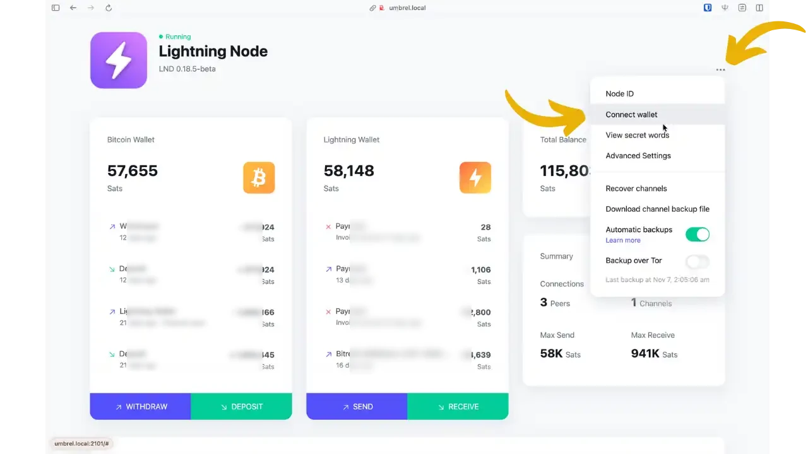

V aplikaci Lightning Node otevřete nabídku vpravo nahoře a vyberte možnost "Connect wallet".

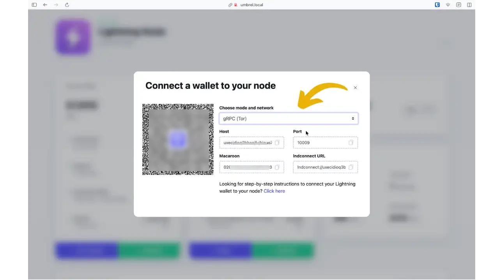

Chcete-li se připojit přes Tor, vyberte možnost **gRPC (Tor)** (doporučeno). Zobrazí se QR kód a podrobnosti (Hostitel .onion, Port 10009, Macaroon).

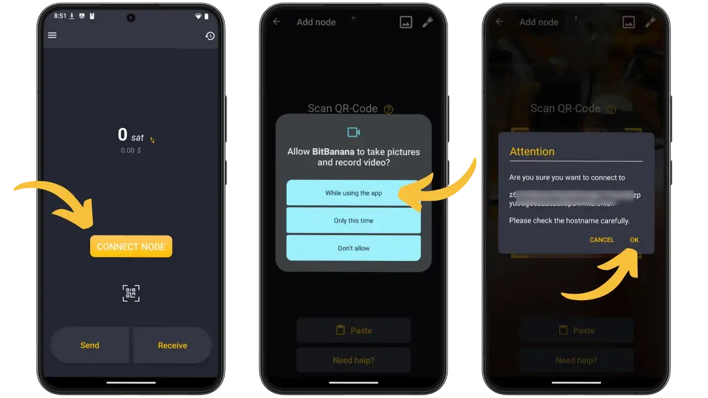

V aplikaci BitBanana stiskněte tlačítko "CONNECT NODE", naskenujte QR kód nebo vložte URI. Autorizujte přístup ke kameře a před potvrzením zkontrolujte zobrazenou adresu .onion.

*připojení *Core Lightning**

Pokud místo LND použijete Core Lightning (CLN), proces zůstane stejný, přičemž URI `clngrpc://` bude obsahovat vzájemné certifikáty TLS. Core Lightning nativně podporuje BOLT12 (nabídky), což umožňuje opakovaně použitelné faktury a opakované platby, které nejsou v LND k dispozici.

**Připojení bez osobního uzlu (LNbits/hosted)**

Pokud nemáte uzel Lightning, může se BitBanana připojit k hostovaným službám prostřednictvím LndHub (protokol používaný BlueWallet a LNbits) nebo Nostr Wallet Connect (NWC). Upozornění: tyto režimy fungují v režimu úschovy (služba hostuje vaše prostředky) s omezenou funkčností. Nebudete moci spravovat kanály ani konfigurovat poplatky za směrování a budete moci pouze odesílat a přijímat platby Lightning.

Další podrobnosti o LNbits nebo Nostr Wallet Connect naleznete v našich různých výukových materiálech:

https://planb.academy/tutorials/business/others/lnbits-cdfe1e38-069a-4df9-a86b-ce01ef28f4c2

https://planb.academy/tutorials/node/others/umbrel-nostr-7ae147e8-f5cd-46e1-861b-17c2ea1e08fd

## Denní použití

### Interface hlavní

Na domovské obrazovce se zobrazuje zůstatek na účtu Blesk a v nabídce vlevo nahoře je přístup k následujícím sekcím: Kanály, Směrování, Podepsat/Ověřit, Uzly, Kontakty, Nastavení, Zálohování. Ikona hodin (vpravo nahoře) otevírá historii transakcí. Tlačítka "Odeslat" a "Přijmout" v dolní části umožňují odesílat a přijímat satoše.

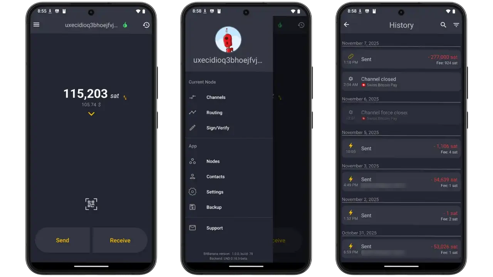

### Platby za blesk a on-chain

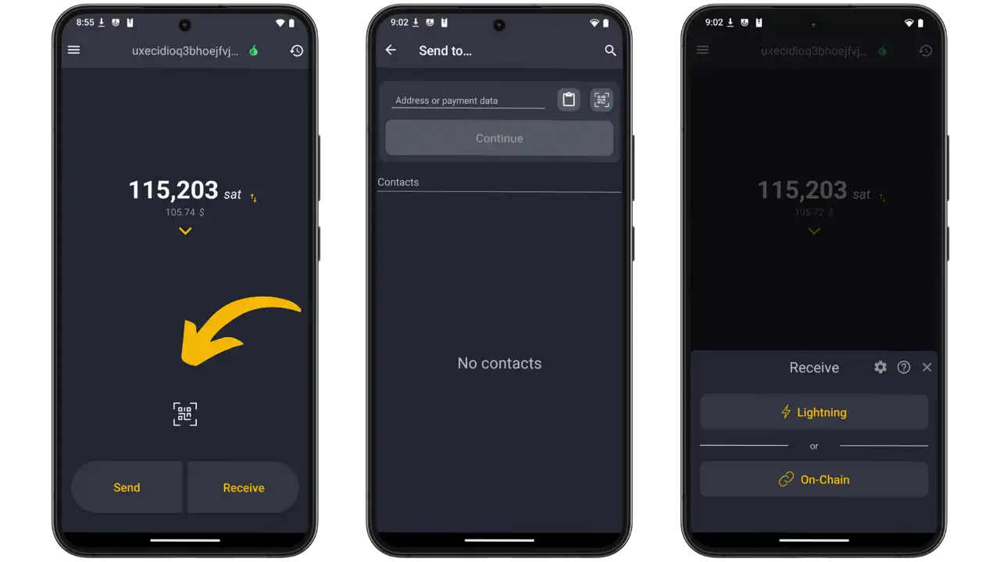

**Odeslání platby:** Na domovské obrazovce stiskněte tlačítko "Odeslat". Obrazovka platby (vlevo) nabízí vložení adresy nebo platebních údajů do pole "Address nebo platební údaje", přičemž vpravo nahoře je skener QR pro snímání kódů. Můžete také vybrat kontakt uložený v sekci Kontakty, abyste nemuseli pokaždé skenovat.

BitBanana inteligentně rozpoznává všechny platební formáty: (řetězce znaků začínající na `lnbc`), Lightning Address (e-mailový formát, např. `utilisateur@domaine.com`), LNURL-pay kódy pro dynamické platby, LNURL-withdraw pro výběr peněz a dokonce i platby Keysend přímo na veřejný klíč Lightning bez předchozí faktury. Aplikace automaticky provádí potřebná rozlišení LNURL na pozadí.

Po načtení faktury zobrazí BitBanana všechny podrobnosti: přesnou částku, odhadované poplatky za směrování, popis platby (pokud jej příjemce poskytl) a datum vypršení platnosti faktury. Po potvrzení je platba směrována prostřednictvím vašich kanálů Lightning. V podrobnostech transakce si pak můžete prohlédnout trasu, kterou prošla, hop po hopu a skutečně zaplacené poplatky.

**Přijmout platbu:** Stiskněte tlačítko "Přijmout". Volič (na pravé obrazovce) vám umožní vybrat si mezi bleskovou platbou (okamžitá platba prostřednictvím vašich kanálů) a On-Chain. U bleskového příjmu zadejte požadovanou částku v sátech (nebo ponechte hodnotu 0 pro vytvoření faktury bez pevné částky, kterou má plátce vyplnit) a přidejte volitelný popis, který se na faktuře zobrazí. BitBanana okamžitě vygeneruje fakturu Lightning s QR kódem pro skenování. Fakturu můžete také zkopírovat jako text a odeslat e-mailem. Jakmile je platba přijata, upozorní vás push notifikace a transakce se okamžitě objeví v historii se všemi jejími podrobnostmi.

### Kanály a směrování

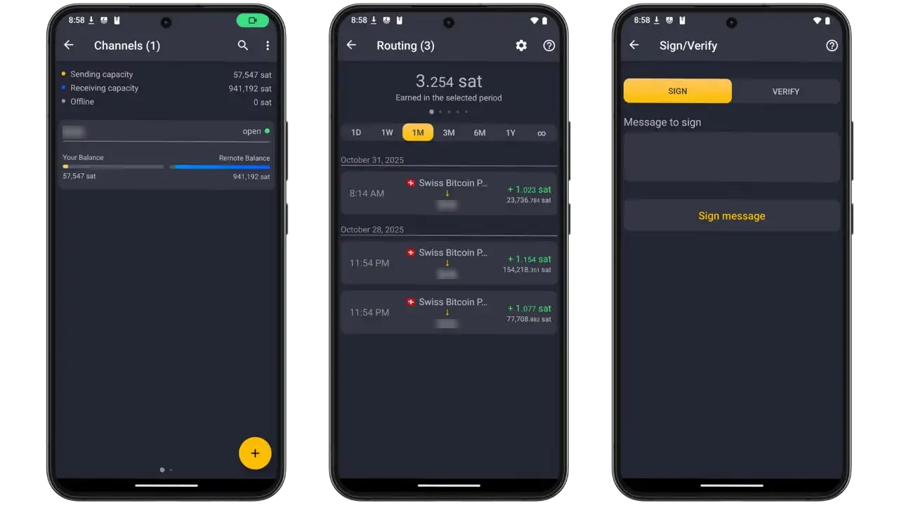

V části "Kanály" se zobrazují možnosti odesílání/přijímání a seznam kanálů s jedinečnými avatary. U každého kanálu se zobrazuje jeho likvidita rozdělená mezi místní a vzdálenou rovnováhu. Dotykem na kanál zobrazíte všechny podrobnosti a akce (uzavření, změna poplatků za směrování). Tři tečky v pravém horním rohu umožňují přístup k možnosti "Rebalance" pro obnovení rovnováhy likvidity vašich kanálů. Tlačítko "+" otevře nový kanál.

Sekce Směrování (centrální obrazovka) zobrazuje příjmy ze směrování podle období (1D, 1W, 1M, 3M, 6M, 1Y) s podrobnou historií směrování pro optimalizaci vaší strategie.

Podepsat/ověřit (pravá obrazovka) umožňuje kryptograficky podepsat/ověřit zprávy a prokázat tak kontrolu uzlu.

### Více uzlů a parametry

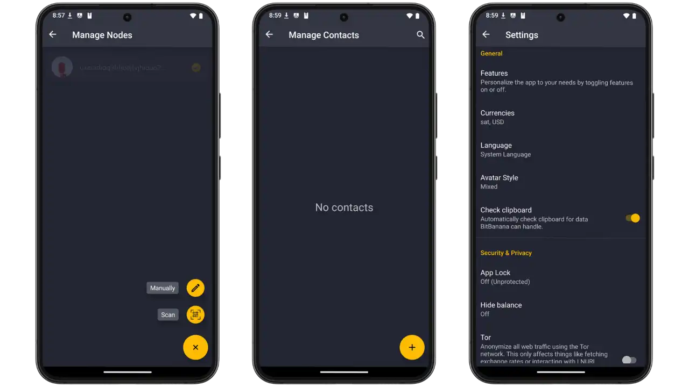

**Správa uzlů**: seznam uzlů s tlačítky pro ruční přidání, skenování QR nebo přepínání mezi uzly. Zejména můžete nastavit různé typy připojení ke stejnému uzlu: LAN, VPN nebo Tor.

**Správa kontaktů**: ukládá kontakty Blesku pro rychlé platby.

**Nastavení**: přizpůsobení měny, jazyka, avatarů. Sekce Zabezpečení a ochrana osobních údajů: Zámek aplikace (PIN/biometrické údaje), Skrýt zůstatek (skrytý režim), Tor (anonymizace IP). Konfigurace cenových věštců, průzkumníků bloků, vlastních odhadů poplatků.

## Výhody a omezení

**Zajímavé informace:**

- Naprostá mobilita: ovládejte svůj uzel Lightning odkudkoli
- Plná funkčnost: platby (LNURL, Lightning Address, BOLT 12), správa kanálů, ovládání mincí, strážní věže, více uzlů
- Zabezpečení: PIN/biometrické údaje, skrytý režim, nouzový PIN, nativní Tor, blokování snímků obrazovky
- Zdarma, open source (MIT), nulové provize, nulový sběr dat

**Omezení:**

- Vyžaduje aktivní uzel Lightning (nebo LNbits ve správcovském režimu)
- Verze pro iOS se neplánuje
- Zabezpečení přístupu k telefonu je kritické (makerový správce = úplný přístup k uzlu)

## Osvědčené postupy

**Bezpečnost:**

- Aktivace zámku PIN/biometrických údajů (zabraňuje neoprávněnému přístupu k uzlu)
- Nastavení nouzového kódu PIN (v případě nátlaku odstraní citlivé údaje)
- Nikdy nesdílejte svůj přihlašovací URI nebo makarón
- Režim utajení v nepřátelském prostředí

**Přihlášení:**

- VPN mesh (Tailscale, ZeroTier): nejlepší kompromis mezi rychlostí a bezpečností
- Tor: maximální důvěrnost, vyšší latence
- Clearnet: vyhněte se mu, pokud to není nutné (vystavení IP, otevřené porty)

### Zálohování a obnovení

Nakonec je zde nabídka "Zálohování", která umožňuje uložit konfigurace pro migraci telefonu nebo přeinstalaci.

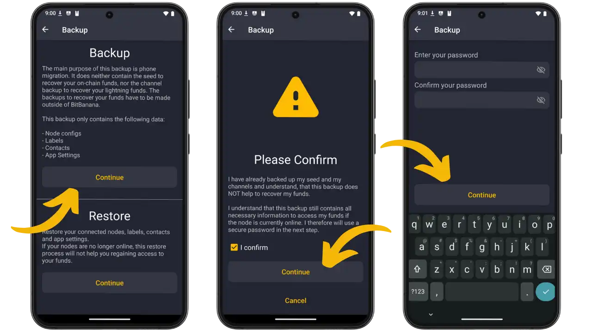

**Důležité:** Záloha NEOBSAHUJE zálohy seed nebo kanálů (které je třeba provést v uzlu). Obsahuje: konfiguraci uzlu (adresy, certifikáty, makra), štítky, kontakty, parametry. Tlačítko Obnovit umožňuje importovat existující zálohu. Před uložením je vyžadováno potvrzení.

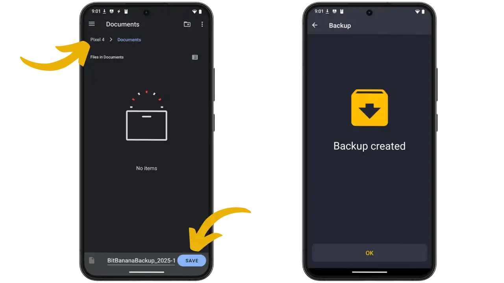

Zadejte šifrovací heslo (pravá obrazovka). Systém otevře výběr souboru (levá obrazovka) a uloží soubor `BitBananaBackup_2025-XX-XX.dat`. Potvrzení "Záloha vytvořena".

**Zabezpečení:** Zálohu ukládejte šifrovaně (osobní cloud, USB, NAS). Nikdy nesdílejte soubory ani hesla. Pravidelně testujte obnovení. Záloha obnovuje připojení, nikoliv finanční prostředky.

## BitBanana vs Zeus: Jaký je mezi nimi rozdíl?

Pokud zkoumáte mobilní aplikace pro správu uzlu Lightning, pravděpodobně narazíte na Zeus, populární alternativu k BitBananě. Na rozdíl od aplikace BitBanana, která se zaměřuje výhradně na vzdálené ovládání existujícího uzlu, Zeus zaujímá komplexnější přístup a nabízí dva režimy provozu: uzel Lightning vložený přímo do aplikace (režim embedded s integrovaným LND) a vzdálené připojení k externímu uzlu, stejně jako BitBanana.

Díky této dvojí funkci je Zeus atraktivní zejména pro začátečníky, kteří chtějí experimentovat s Lightningem bez předchozí infrastruktury. Vestavěný režim umožňuje okamžité spuštění s kompletním mobilním uzlem, zatímco pokročilí uživatelé mohou po konfiguraci svého osobního uzlu přepnout na vzdálené připojení. Zeus podporuje také LND a Core Lightning pro vzdálené připojení, například BitBanana.

Další velkou výhodou Zeusu je jeho dostupnost napříč platformami (iOS a Android), zatímco BitBanana zůstává výhradně na platformě Android. Zeus také obsahuje infrastrukturu Olympus LSP, která usnadňuje příjem plateb Lightning prostřednictvím kanálů just-in-time, systém prodejních míst pro obchodníky a integrovanou funkci swapu pro řízení likvidity.

BitBanana si však zachovává své specifické přednosti: jednodušší a přehlednější rozhraní, lepší uživatelský zážitek (UX) díky výhradnímu zaměření na dálkové ovládání a vzdělávací přístup s kontextovými vysvětlivkami. Zeus nabízí více funkcí, ale za cenu složitějšího rozhraní. Aplikace je i nadále vhodná zejména pro uživatele, kteří chtějí uzel ovládat výhradně na dálku, bez opatrovnických funkcí.

Chcete-li se o systému Zeus dozvědět více, podívejte se na následující výukové materiály:

https://planb.academy/tutorials/wallet/mobile/zeus-embedded-c67fa8bb-9ff5-430d-beee-80919cac96b9

https://planb.academy/tutorials/wallet/mobile/zeus-embedded-advanced-3e89603c-501d-439c-8691-d4a0d0de459b

## Závěr

BitBanana promění váš chytrý telefon se systémem Android v kompletní ovládací panel Lightning a nabídne tak provozovatelům uzlů nebývalou mobilitu. Aplikace pokrývá všechny funkce: platby (všechny formáty), správu kanálů, ovládání mincí, hlídací věže, multi-node, s rozšířeným zabezpečením (PIN/biometrie, Tor, Emergency PIN).

BitBanana je zcela suverénní, neshromažďuje žádné údaje a neohrožuje důvěrnost ani kontrolu vašich prostředků. Otevřený zdrojový kód (MIT) zaručuje transparentnost.

## Zdroje

### Oficiální dokumentace

- [webové stránky BitBanana](https://bitbanana.app)
- [Kompletní dokumentace](https://docs.bitbanana.app)
- [zdrojový kód GitHub](https://github.com/michaelWuensch/BitBanana)

### Instalace

- [Obchod Google Play](https://play.google.com/store/apps/details?id=app.michaelwuensch.bitbanana)
- [F-Cold](https://f-droid.org/packages/app.michaelwuensch.bitbanana)