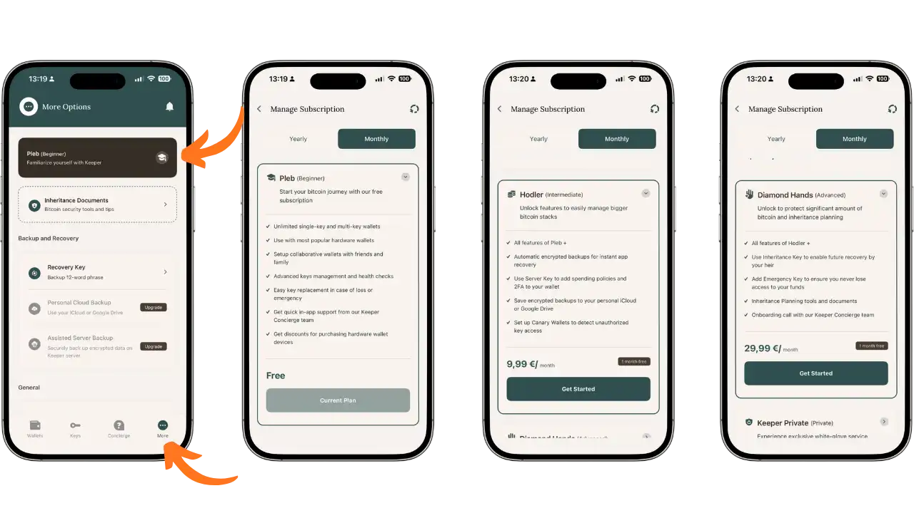
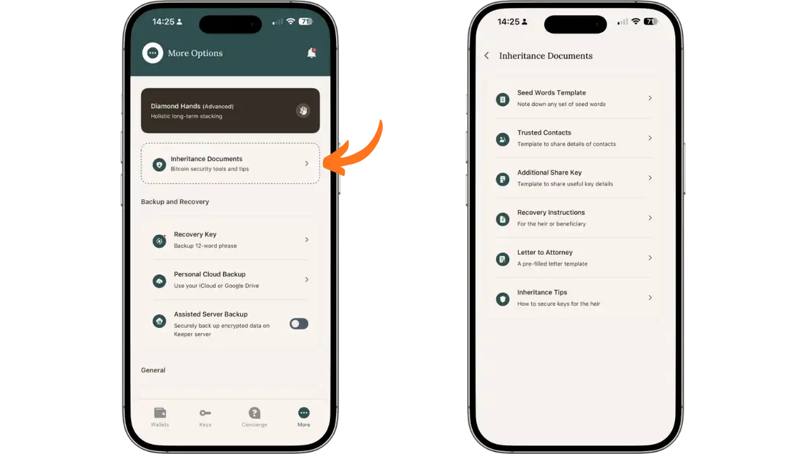
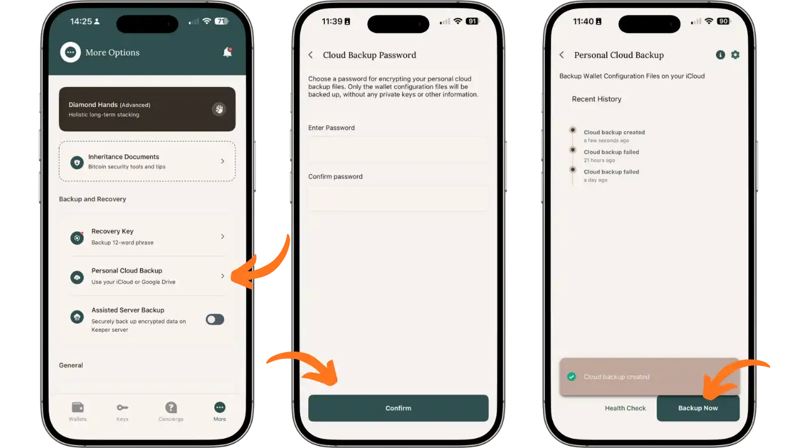
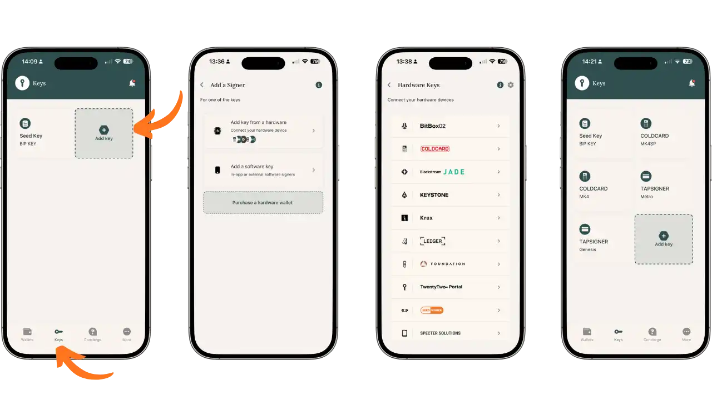
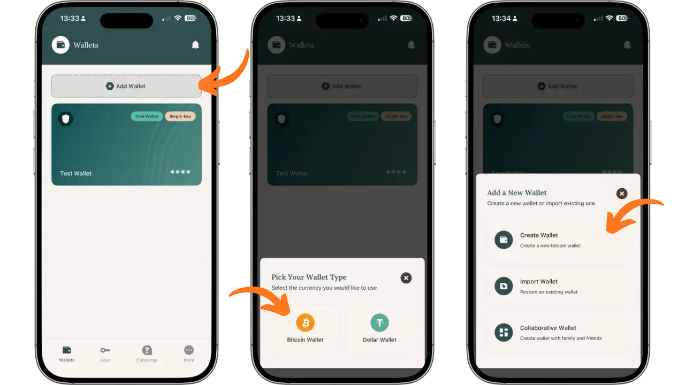
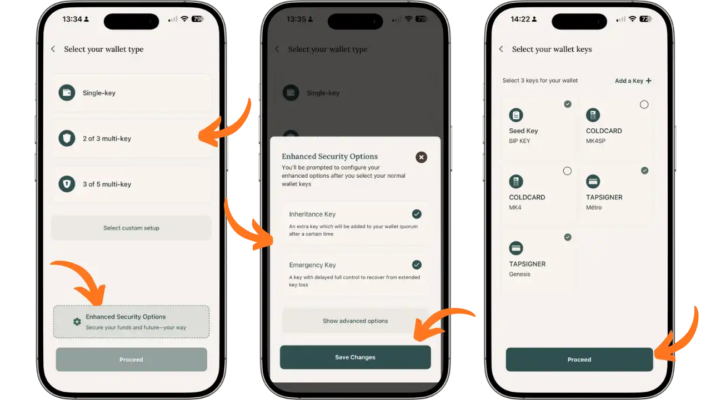
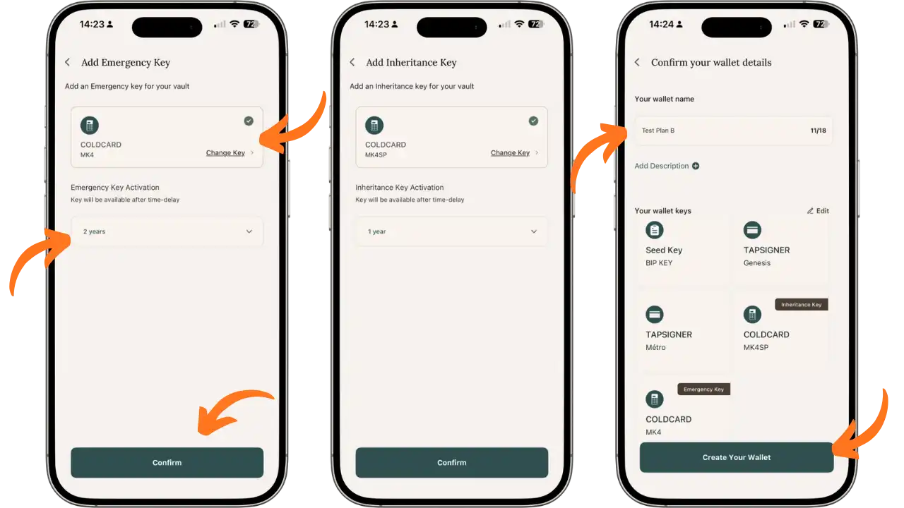
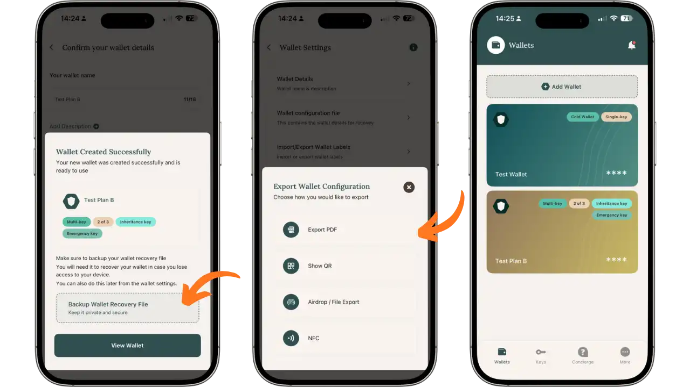
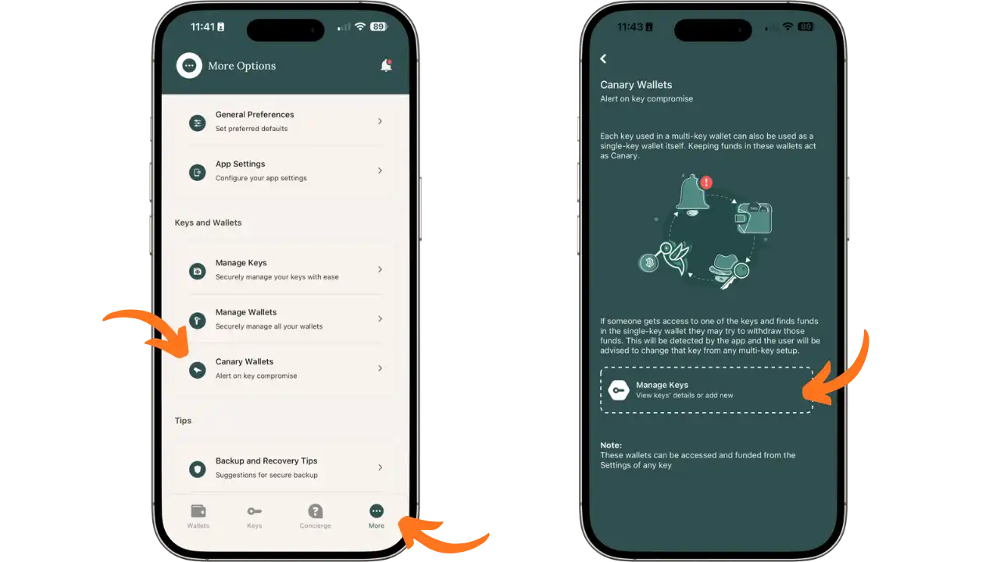
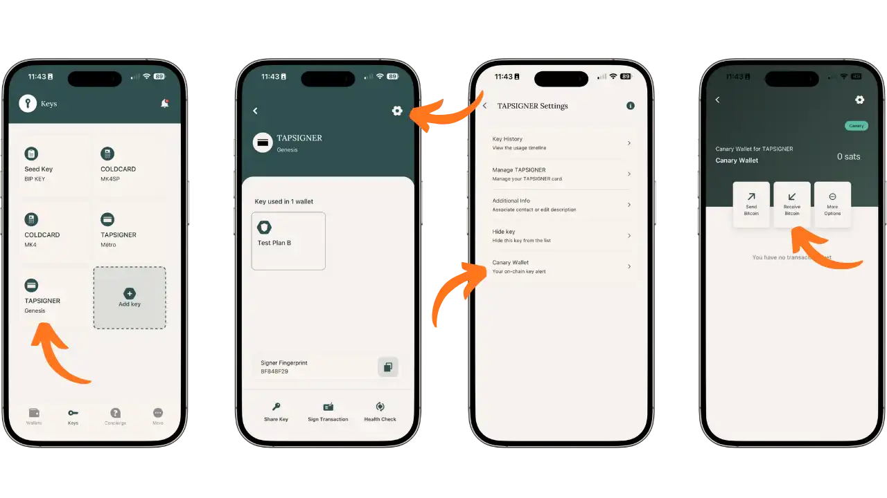

De overdracht van Bitcoin bezittingen is één van de uitdagingen die het meest onderschat wordt door houders. In tegenstelling tot een bankrekening, waar de financiële instelling het geld kan doorgeven aan de rechtmatige erfgenamen, is Bitcoin volledig afhankelijk van het bezit van privésleutels. Een legitieme erfgenaam zal nooit toegang hebben tot de fondsen zonder deze sleutels, terwijl een kwaadwillende persoon die in het bezit is van de geheimen, deze zonder enige formaliteit kan uitgeven.

In deze tweede Bitcoin Keeper tutorial verkennen we de premium functies gewijd aan estate planning. De applicatie biedt geavanceerde tools voor het creëren van verrijkte kluizen, met getimede beschermingsmechanismen dankzij Miniscript, en begeleidende documenten om je nabestaanden te begeleiden.

Deze handleiding gaat ervan uit dat je de basis van Bitcoin Keeper al onder de knie hebt (portfolio aanmaken, klassieke multisig, hardwaretoetsen toevoegen), zoals uitgelegd in onze eerste tutorial:

https://planb.academy/tutorials/wallet/mobile/bitcoin-keeper-7f2a160b-10b6-4cc5-8820-514ee2eb1599

## Bitcoin Keeper abonnementen

Bitcoin Keeper werkt op basis van een freemium model met drie abonnementsniveaus die progressieve functionaliteit bieden. Om toegang te krijgen tot de plannen, ga naar het **Meer** tabblad, tik dan op je huidige plan (standaard is "Pleb") om het **Beheer abonnement** scherm te openen.

Het **Pleb plan** (gratis) biedt toegang tot de essentie: onbeperkt aanmaken van één-sleutel en meer-sleutel wallets, compatibiliteit met alle belangrijke hardware wallets (Coldcard, Trezor, Ledger, Jade, Tapsigner...), muntcontrole, labelen en verbinding met een persoonlijke Electrum server. Dit plan is voldoende voor standaard gebruik en zelfs voor klassieke multi-sig configuraties.

Het **Hodler-plan** (€9,99/maand, met 1 maand gratis bij jaarlijkse betaling) bevat alle Pleb-functies en voegt versleutelde back-ups naar de cloud (iCloud of Google Drive) toe om je kluizen op elk apparaat te herstellen, Server Key om automatisch uitgavenbeleid en 2FA boven een bepaalde drempel toe te voegen en Canary Wallets om ongeautoriseerde toegang tot je sleutels te detecteren.

Het **Diamond Hands plan** (€29,99/maand, met 1 maand gratis bij jaarlijkse betaling) is het complete pakket voor nalatenschapsplanning. Het omvat het volledige Hodler-plan en ontgrendelt de Inheritance Key (uitgestelde activering), de Emergency Key (noodsleutel voor herstel in geval van verlies), de Inheritance Planning tools en documenten, en een ondersteuningsgesprek met het Concierge-team om uw configuratie te valideren. Dit is het aanbod voor bitcoiners die hun erfenis over meerdere generaties willen doorgeven.

Belangrijk: de kluizen die je hebt aangemaakt blijven toegankelijk, zelfs als je terugschakelt naar het gratis abonnement. Je configuraties zijn gebaseerd op open standaarden (BSMS, Miniscript) en werken onafhankelijk van je abonnement.

## Nalatenschapsdocumenten

Zodra je je Diamond Hands abonnement hebt geactiveerd, ga je naar de sectie **Erfenisdocumenten** op de tab Meer. Bitcoin Keeper biedt vijf voorbeelddocumenten om je nalatenschapsplan te structureren, evenals een sectie met tips:

- Sjabloon voor zaadwoorden**: een sjabloon om je herstelzinnen netjes en overzichtelijk op te schrijven
- Vertrouwde contactpersonen**: een sjabloon voor het vermelden van de contactgegevens van vertrouwde personen die betrokken zijn bij je plan (notaris, advocaat, erfgenamen, sleutelbeheerders)
- Additional Share Key**: een document met de technische informatie voor elke sleutel: PIN-code, afleidingspad, fysieke locatie, apparaattype en alle andere informatie die nuttig is voor het identificeren en gebruiken van de sleutel
- Invorderingsinstructies**: stapsgewijze instructies voor de erfgenaam of begunstigde om geld terug te vorderen
- Brief aan advocaat**: een vooraf ingevulde brief die kan worden aangepast voor je advocaat of notaris

Het gedeelte **Erftips** biedt praktisch advies over het veiligstellen van sleutels voor erfgenamen en het optimaliseren van uw erfenisplan.

Pas deze documenten aan jouw situatie aan en bewaar ze op een veilige plek, los van de sleutels zelf.

## Cloudback-up configureren

Activeer cloudback-up om uw configuratiebestanden te beschermen voordat u uw legacy vault aanmaakt. Ga naar het tabblad Meer en druk op **Personal Cloud Backup**.

Kies een sterk wachtwoord om je back-ups te versleutelen. Dit wachtwoord beschermt alleen de wallet configuratiebestanden (niet uw privésleutels). Bevestig het wachtwoord en druk op **Confirm**. Uw back-ups worden opgeslagen op uw iCloud of Google Drive, afhankelijk van uw apparaat. Druk op **Backup Now** om je eerste back-up te starten.

## Je hardwaresleutels importeren

Voor ons voorbeeld maken we een 2-van-3 kluis met twee extra sleutels (Erfenis en Noodgeval). Laten we beginnen met het importeren van alle benodigde sleutels in het tabblad **Sleutels**.

Druk op **Toevoeg toets** en selecteer vervolgens **Toevoeg toets van een hardware** om een hardware wallet aan te sluiten. Bitcoin Keeper ondersteunt veel apparaten: BitBox02, Coldcard, Blockstream Jade, Keystone, Krux, Ledger, Foundation Passport, TwentyTwo Portal, Seedsigner en Specter Solutions.

In onze configuratie importeren we :

- 2 **Kaarttoetsen** (MK4SP en MK4)
- 2 toetsen **Tapsigner** (Metro en Genesis)

Om een Coldcard toe te voegen, selecteer je deze uit de lijst en volg je de instructies op het scherm om de publieke sleutel te exporteren via QR-code, bestand, USB of NFC. Voor meer informatie over het gebruik van een Coldcard of Tapsigner, raadpleeg onze speciale tutorials:

https://planb.academy/tutorials/wallet/hardware/tapsigner-ab2bcdf9-9509-4908-9a4a-2f2be1e7d5d2

https://planb.academy/tutorials/wallet/hardware/coldcard-q-73e86d1a-6fe6-4d8b-bb15-8690298020e3

https://planb.academy/tutorials/wallet/hardware/coldcard-mk4-5d44dd94-423d-4e37-9a8c-3fc38b45ce59

Zodra al je sleutels geïmporteerd zijn, vind je ze terug op het tabblad Sleutels met hun aangepaste namen.

## Legacy wallet creëren

Laten we verder gaan met het aanmaken van de stam. Ga naar het tabblad **Wallets**, druk op **Add Wallet**, selecteer **Bitcoin Wallet** en vervolgens **Create Wallet**.

Kies het wallet type. Voor ons oude plan kiest u **2 van 3 multi-key**. Activeer onderaan het scherm **Geavanceerde beveiligingsopties** en druk vervolgens op **Volgende stap**.

Vink in het pop-upvenster Verbeterde beveiligingsopties :

- Erftoets**: een extra sleutel die na een bepaalde tijd aan het quorum wordt toegevoegd
- Noodsleutel**: een sleutel met uitgestelde totale controle om fondsen terug te krijgen in geval van sleutelverlies

Druk op **Wijzigingen opslaan**. Selecteer dan de 3 toetsen waaruit je wallet zal bestaan uit de geïmporteerde toetsen (bijv. Seed Key, Coldcard MK4SP en Tapsigner Metro).

## Speciale belangrijke deadlines vaststellen

In het volgende scherm kun je de Noodoproeptoets en Erftoets configureren. Hier definieer je de vertragingen voor het activeren van deze speciale sleutels.

Voor de **Emergency Key** selecteert u de hardwaresleutel die zal dienen als ultieme back-up (hier Coldcard MK4) en kiest u de activeringsvertraging (in ons voorbeeld: 2 jaar). In tegenstelling tot de Erfenissleutel voegt de Noodsleutel niets toe aan het quorum: hiermee kunt u **de multisig** volledig omzeilen en hebt u volledige controle over de fondsen nadat de tijdslimiet is verstreken. Het is je laatste redmiddel: als meerdere sleutels verloren gaan of vernietigd worden, kun je met deze ene sleutel alles terughalen. Deze sleutel moet dus met de grootste zorg worden beschermd.

Selecteer voor de **Erfingssleutel** de sleutel die bestemd is voor de erfgenaam (hier Coldcard MK4SP) en kies de vertraging (in ons voorbeeld: 1 jaar). Na één jaar zonder beweging wordt deze sleutel **toegevoegd aan het handtekeningquorum**. Praktisch gezien zal je wallet 2-van-3 een wallet 2-van-4 worden eens deze periode verstreken is, waardoor de erfgenaam kan deelnemen aan de handtekening naast de bestaande sleutels.

### Hoe werken timelocks?

Bitcoin Keeper gebruikt **absolute timelocks** (CLTV - CheckLockTimeVerify), mogelijk gemaakt door Miniscript. In tegenstelling tot relatieve tijdsloten (CSV), die starten wanneer elke UTXO wordt ontvangen, werken absolute tijdsloten met een **vaste vervaldatum** die wordt gedefinieerd wanneer de wallet wordt aangemaakt.

Concreet: als je vandaag een wallet aanmaakt met een 1-jarige Erfenissleutel, is de activeringsdatum "vandaag + 1 jaar". Alle fondsen die in deze wallet zijn gestort, ongeacht hun stortingsdatum, zullen toegankelijk zijn via de Erfenissleutel op deze zelfde datum.

Het voordeel van absolute timelocks is dat ze doorlooptijden van meer dan 15 maanden toestaan (de limiet van relatieve CSV-timelocks), wat verklaart waarom Bitcoin Keeper opties zoals 2 jaar kan bieden.

### Het verversingsmechanisme

Om het activeren van speciale sleutels tijdens je leven te voorkomen, moet je periodiek je wallet "verversen". Bij absolute tijdsloten houdt dit in dat je de wallet opnieuw moet aanmaken met een nieuwe vervaldatum** in de toekomst, en vervolgens je tegoeden moet overboeken naar deze nieuwe wallet.

Bitcoin Keeper vereenvoudigt dit proces met een geïntegreerde verversingsfunctie. De applicatie handelt de complexiteit automatisch op de achtergrond af: je hoeft alleen maar de stappen met begeleiding te volgen, zonder handmatig een nieuwe wallet aan te maken of zelf geld over te maken. Plan deze operatie op regelmatige basis, ruim voor het verstrijken van de kortste periode die is geconfigureerd. Bijvoorbeeld, met een Inheritance Key van 1 jaar, vernieuwt u elke 9-10 maanden om een veiligheidsmarge te behouden.

## Configuratie opslaan en exporteren

Zodra de wallet is aangemaakt, herinnert de applicatie je eraan om het configuratiebestand op te slaan. **Deze stap is cruciaal**: zonder dit bestand kunnen je erfgenamen de wallet multisig niet opnieuw samenstellen.

Druk op **Backup Wallet herstelbestand**. Er zijn verschillende exportopties beschikbaar:

- PDF export**: genereert een compleet document met alle wallet informatie
- Toon QR**: toont een QR-code om de configuratie op een ander apparaat te importeren
- Airdrop / Bestandsexport**: exporteert het bestand via de opties voor delen
- NFC**: delen via NFC met een compatibel apparaat

Vermenigvuldig de kopieën: één bij je notaris, één in een bankkluis en één versleutelde digitale versie. Je nieuwe wallet verschijnt nu in de tab Portemonnees met de tags "Multi-sleutel", "2 van 3", "Erfsleutel" en "Noodsleutel".

## Maak een Wallet kanarie

De Canary Wallet is een waarschuwingssysteem. Het idee: elke sleutel die gebruikt wordt in een wallet multi-key kan ook gebruikt worden in een aparte wallet single-key. Door een klein bedrag te storten op deze wallet "kanarie", geeft elke onbevoegde beweging aan dat de sleutel gecompromitteerd is.

Er zijn twee manieren om een Wallet Canary te configureren. Op het tabblad **Meer**, druk op **Kanarie Portemonnees** in de sectie "Sleutels en Portemonnees". Het scherm legt het principe uit: als iemand toegang krijgt tot een van uw sleutels en geld vindt in de bijbehorende wallet single-key, zal hij proberen dit te verwijderen, waardoor u gewaarschuwd wordt.

Je kunt de Canary ook rechtstreeks vanaf een toets configureren. Selecteer in het tabblad **Sleutels** een sleutel (bijvoorbeeld Tapsigner Genesis), druk op het pictogram **Instellingen** (tandwiel) en vervolgens op **Kanarie Wallet**. De bijbehorende wallet kanarie wordt geopend, klaar om bewakingssatos te ontvangen.

Stort een klein bedrag (een paar duizend satos) op elke Canary Wallet. Als dit geld wordt verplaatst zonder jouw toestemming, verwijder dan onmiddellijk de gecompromitteerde sleutel uit je multisig kluizen.

## Beste praktijken

**Test je configuratie** met een klein bedrag voordat je er een groot bedrag in stopt. Stuur een paar duizend satoshi's naar de kluis en probeer dan een uitgaande uitgave om te controleren of je het ondertekenproces met elk apparaat onder de knie hebt. Test ook het importeren van het configuratiebestand op een andere telefoon om er zeker van te zijn dat de back-up werkt.

**Distribueer sleutels op een intelligente manier**. Voor Tapsigners, overhandig ze in een verzegelde envelop met de PIN apart gecommuniceerd (bijvoorbeeld in de Recovery Instructions brief die elders is opgeslagen). Voor klassieke hardware wallets, bewaar het apparaat bij een vertrouwde derde partij en de seed op papier of metaal bij jou of een andere derde partij. Noteer de vingerafdruk van elke sleutel en de naam ervan in het configuratiebestand om verwarring te voorkomen.

**Plan periodieke tests** (brandoefeningen). Controleer jaarlijks of u de kluis opnieuw kunt opbouwen vanaf back-ups op een lege telefoon. Test Canary-waarschuwingen door saldi te controleren. Simuleer verliesscenario's ("wat als ik de Coldcard verlies?") om te bevestigen dat de resterende sleutelcombinaties voldoende zijn.

**Ververs** niet. Als je je Erfenissleutel hebt ingesteld op 1 jaar, ververs jezelf dan elke 9-10 maanden. Dit is de prijs die je betaalt voor automatische overdracht zonder tussenkomst van derden.

**Houd het plan up-to-date**. Elke wijziging (vervanging van een sleutel, wijziging van erfgenamen, wijziging van deadline) moet worden weerspiegeld in alle back-ups en documenten. Maak PDF's opnieuw aan na elke wijziging en verspreid nieuwe versies.

## Grenzen en overwegingen

Ondanks de kracht van deze tools is het belangrijk om hun beperkingen te herkennen om ze zo effectief mogelijk te beheren.

De **complexiteit** van een multisig kluis met tijdsloten kan een risico op zich zijn: verkeerde configuratie, verkeerd begrip door erfgenamen, verlies van een kritisch element tussen de vele componenten. Bitcoin Keeper vereenvoudigt de ervaring zoveel mogelijk, maar het blijft een technische operatie. Gebruik dit plan alleen als het te beschermen bedrag het rechtvaardigt. Voor kleine bedragen kan een eenvoudiger plan volstaan.

De **toepassingsafhankelijkheid** is het overwegen waard. Hoewel de code open source is en gebaseerd op open standaarden (Miniscript, BSMS), zijn bepaalde functionaliteiten afhankelijk van het Keeper ecosysteem. Bewaar een kopie van de applicatie (Android APK of iOS IPA) en documenteer in je brieven aan erfgenamen de mogelijkheid om andere Miniscript-compatibele wallets (zoals Liana) te gebruiken om geld terug te krijgen.

Trusted brokers** introduceren een menselijk risico. Wat gebeurt er als een kwaadwillend familielid de sleutel die aan hem/haar is toevertrouwd voor de deadline gebruikt? Of als de advocaat je documenten kwijtraakt? Kies deze mensen zorgvuldig, leg hun verantwoordelijkheden duidelijk uit en heb een plan B. Canary Wallets, redundante back-ups en de structuur van multisig blijven je beste bescherming tegen deze gevaren.

## Conclusie

Bitcoin Keeper biedt met het Diamond Hands plan een complete gereedschapskist voor estate planning: Verbeterde kluizen met getimede sleutels, begeleidende documenten, Canarische portefeuilles en persoonlijke ondersteuning.

Het is meer dan een technische kwestie: het is een kwestie van de architectuur van je nalatenschap ontwerpen, sleutels en kennis intelligent verdelen en het systeem regelmatig testen. Een goed ontworpen Bitcoin erfenisplan transformeert je satoshis in een echte, overdraagbare erfenis.