Het veilige beheer van bitcoins vormt een grote uitdaging voor elke houder die zich bewust is van de inzet van financiële soevereiniteit. Tussen de eenvoud van een mobiele wallet en de robuustheid van een multi-sig oplossing, kan de technische kloof voor veel gebruikers ontmoedigend lijken. Bitcoin Keeper bevindt zich precies op dit kruispunt en biedt een progressieve benadering van beveiliging die gebruikers begeleidt terwijl ze zich ontwikkelen.

Bitcoin Keeper is een open source mobiele applicatie, exclusief voor Bitcoin, ontwikkeld door het BitHyve-team. De ambitie is om geavanceerd portfoliobeheer toegankelijk te maken, met name configuraties met meerdere handtekeningen, met behoud van een intuïtieve interface voor beginners. De applicatie heeft de slogan "Secure today, Plan for tomorrow", een weerspiegeling van de filosofie van ondersteuning op lange termijn.

In tegenstelling tot generalistische wallets die meerdere cryptocurrencies beheren, houdt Bitcoin Keeper een strikte focus op Bitcoin. Deze bitcoin-only aanpak vermindert het potentiële aanvalsoppervlak en vereenvoudigt de gebruikerservaring aanzienlijk. De applicatie onderscheidt zich ook door de native integratie van de meest gebruikte hardware wallets en de geavanceerde UTXO beheerfuncties.

## Wat is Bitcoin Keeper?

### Filosofie en doelstellingen

Bitcoin Keeper is ontworpen om te voldoen aan de specifieke behoeften van bitcoiners die de volledige controle over hun privésleutels willen behouden. Het project omarmt volledig de fundamentele principes van Bitcoin: open en controleerbare broncode, respect voor privacy en gebruikerssoevereiniteit. Er is geen registratie of persoonlijke informatie nodig om de applicatie te gebruiken en het kan zelfs offline draaien voor ondertekeningsoperaties.

De centrale doelstelling is om een flexibele, toekomstbestendige tool te bieden voor het opslaan van BTC over meerdere jaren, en zelfs meerdere generaties, dankzij overervende functionaliteiten. De applicatie stelt gebruikers in staat om eenvoudig te beginnen met een mobiele wallet en vervolgens geleidelijk te evolueren naar veiligere oplossingen met meerdere handtekeningen.

### Applicatie-architectuur

Bitcoin Keeper organiseert fondsenbeheer rond twee verschillende concepten. De **Hot Wallet** is een eenvoudige wallet met één sleutel, opgeslagen op de telefoon, ontworpen voor dagelijkse uitgaven en bescheiden bedragen. Kluizen** zijn kluizen met meerdere handtekeningen (Multi-Key) die meerdere sleutels vereisen om een uitgave te autoriseren, ontworpen voor langdurige veilige opslag.

### Belangrijkste kenmerken

Bitcoin Keeper ondersteunt bijna alle hardware wallets op de markt: Coldcard, Trezor, Ledger, Keystone, BitBox02, Jade, Seedsigner, Passport en Coinkite's Tapsigner. Integratie vindt plaats via verschillende methoden, afhankelijk van het apparaat: QR-code scannen, NFC-verbinding of bestandsimport.

De applicatie biedt ook geavanceerd UTXO beheer met transactielabels, muntcontrole om handmatig ingangen te selecteren tijdens het verzenden en ondersteuning van PSBT formaat voor gedeeltelijk ondertekende transacties.

## Installatie en eerste configuratie

Bitcoin Keeper is gratis verkrijgbaar op Android via de Google Play Store en op iOS via de App Store. De vermelde uitgever is BitHyve. Controleer voordat je het installeert of je apparaat vrij is van malware, up-to-date is en niet geroot of jailbroken is.

Bij de eerste keer opstarten vraagt de applicatie je om een beveiligings-PIN-code aan te maken. Deze code beschermt de toegang tot je wallet en versleutelt gevoelige gegevens lokaal. Kies een sterke code en onthoud deze. Vervolgens kun je biometrische verificatie (vingerafdruk of Face ID) activeren om sneller te ontgrendelen.

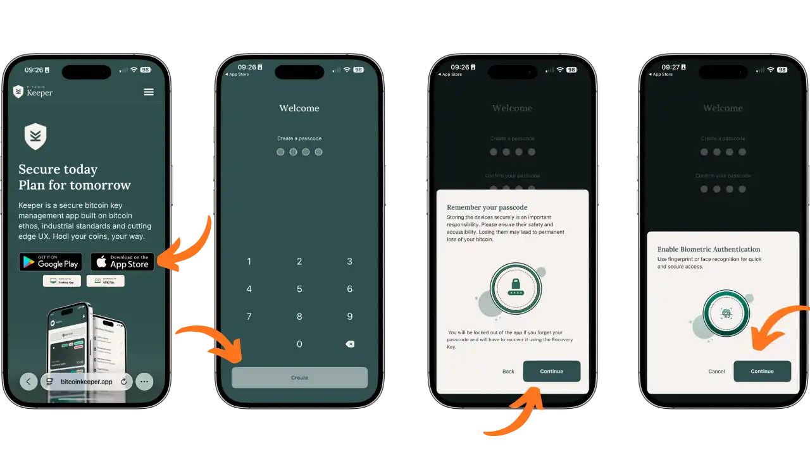

De applicatie presenteert vervolgens verschillende introductieschermen waarin de drie pijlers worden uitgelegd: wallet aanmaken om bitcoins te verzenden en ontvangen, sleutelbeheer met hardware wallet compatibiliteit, en legacy planning om bitcoins door te geven. Druk op "Aan de slag" en kies vervolgens "Start nieuw" om een nieuwe configuratie aan te maken.

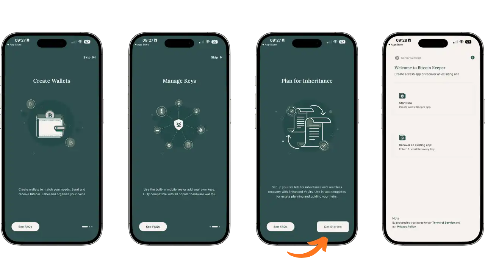

## De interface ontdekken

De interface van Bitcoin Keeper is georganiseerd rond vier hoofdtabbladen die toegankelijk zijn via de navigatiebalk onderaan:

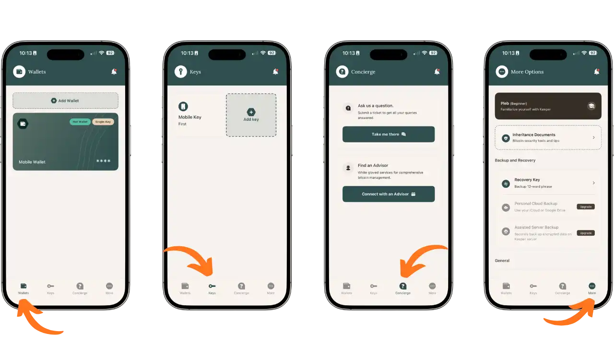

De **Wallets** tab toont je portemonnees en hun saldo. Hier heb je toegang tot je portemonnees om bitcoins te verzenden en te ontvangen. Met de tags "Hot Wallet" en "Single-Key" of "Multi-Key" kun je snel het type van elke wallet identificeren.

Het tabblad **Sleutels** centraliseert het beheer van uw handtekeningsleutels. Hier vindt u de Mobiele sleutel gegenereerd door de applicatie, evenals alle sleutels geïmporteerd van hardware wallets. Dit is ook de plek waar u nieuwe handtekeningapparaten kunt toevoegen.

Het tabblad **Concierge** biedt ondersteunende diensten: stel vragen aan het ondersteuningsteam en maak contact met Bitcoin adviseurs voor persoonlijke hulp.

Het tabblad **Meer** (Meer opties) geeft toegang tot instellingen zoals persoonlijke serververbinding, sleutelback-up, erfenisdocumenten, weergavevoorkeuren en wallet beheer.

## Verbinding met je eigen server

Om je vertrouwelijkheid te versterken, kun je met Bitcoin Keeper de applicatie verbinden met je eigen Electrum server, in plaats van de standaard publieke servers te gebruiken.

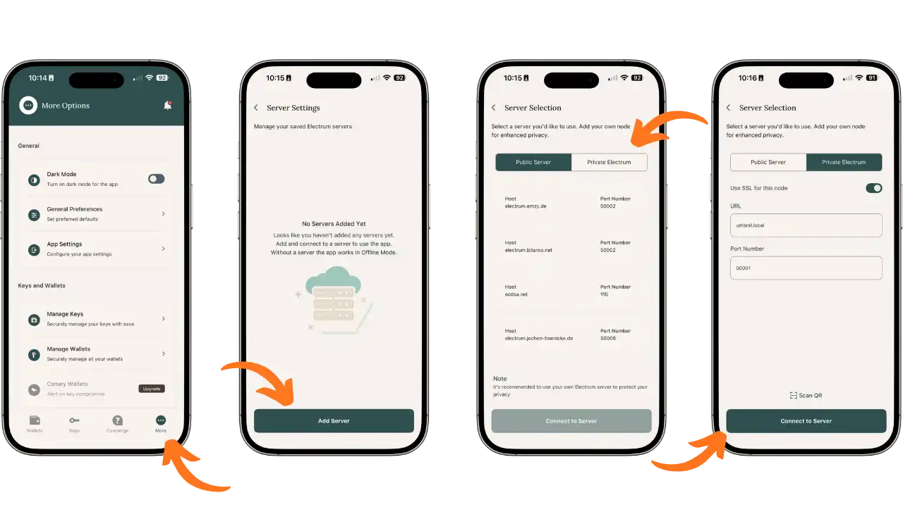

Blader in het tabblad Meer naar beneden om de serverinstellingen te vinden. Druk op "Server toevoegen" om een nieuwe verbinding te configureren. Je kunt kiezen tussen "Publieke server" (vooraf geconfigureerde publieke servers) en "Privé Electrum" (je eigen server).

Voor een private server voer je de URL in (bijvoorbeeld umbrel.local voor een Umbrel knooppunt) en het poortnummer (meestal 50001). Activeer SSL als je server dit ondersteunt. Je kunt ook een QR-code voor configuratie scannen. Zodra je de parameters hebt ingevoerd, druk je op "Connect to Server".

Als je nog geen eigen Bitcoin knoop hebt, bekijk dan onze tutorial over Umbrel, een eenvoudige en betaalbare manier om je eigen knoop te maken:

https://planb.academy/tutorials/node/bitcoin/umbrel-8b0e3b5b-d3cf-4a1e-8bb8-1ad2db4dd848

## Bitcoins ontvangen

Selecteer in het tabblad Portemonnees de wallet waarvan u geld wilt ontvangen door erop te drukken. Het wallet scherm toont het saldo en drie actieknoppen: Bitcoin verzenden, Bitcoin ontvangen en Alle munten weergeven.

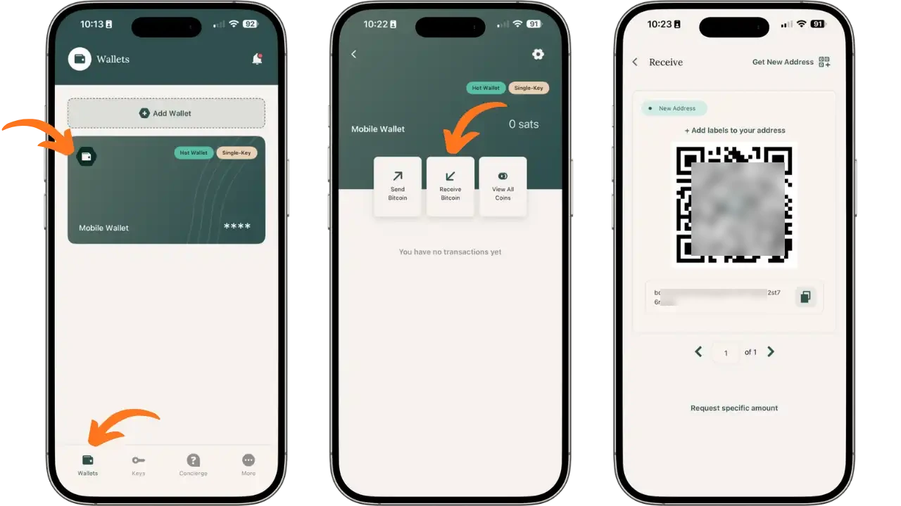

Druk op "Ontvang Bitcoin". Bitcoin Keeper genereert een nieuw ontvangstadres in Bech32 formaat (beginnend met bc1...), samen met de QR-code. Je kunt een label aan dit adres toevoegen om de bron van het geld te identificeren. Deel het adres met de afzender door de QR-code weer te geven of het tekstadres te kopiëren.

De applicatie genereert automatisch een nieuw adres voor elke ontvangst, zodat je privacy behouden blijft. Gebruik "Verkrijg Nieuw Address" om indien nodig een blanco adres te verkrijgen.

## UTXO beheer

Bitcoin Keeper biedt volledig zicht op de UTXO (ongebruikte transactie-uitgangen) waaruit je saldo bestaat. Vanuit een wallet scherm druk je op "Bekijk alle munten" om de hoekmanager te openen.

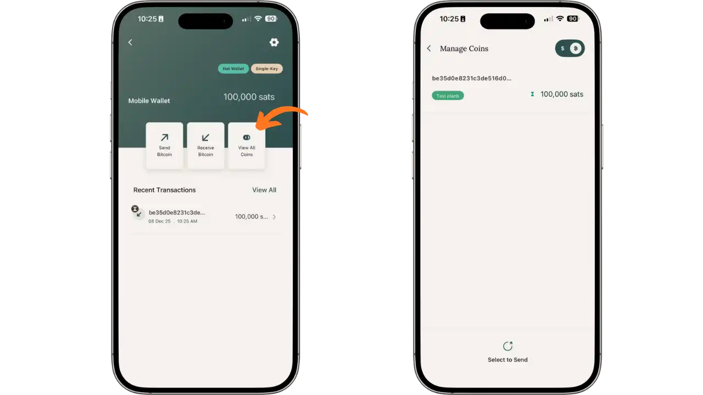

Het scherm "Munten beheren" toont elke UTXO afzonderlijk met het aantal en label. Met deze weergave kun je de herkomst van je munten achterhalen en ze ordenen. Je kunt specifieke UTXO's selecteren via "Select to Send" om te verzenden met muntcontrole, zodat je munten van verschillende herkomst niet mengt.

## Bitcoins versturen

Om te verzenden, selecteer je de bronportefeuille en druk je op "Verzenden Bitcoin". Voer het bestemmingsadres in (geplakt of gescand via QR-code) en voeg optioneel een label toe om de ontvanger te identificeren.

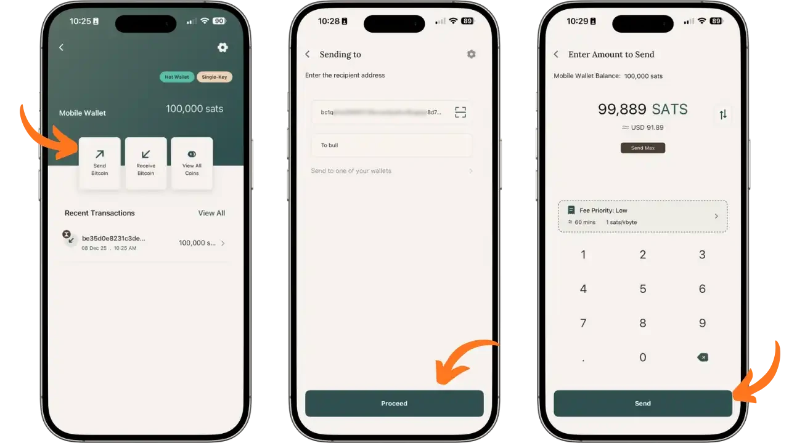

In het volgende scherm kun je het te versturen bedrag invoeren. De interface toont je beschikbare saldo en de omrekening in fiatvaluta. Selecteer oplaadprioriteit: Laag (zuinig, ~60 minuten), Gemiddeld of Hoog (prioriteit). De geschatte kosten in sats/vbyte worden in realtime weergegeven. Druk op "Verzenden" om verder te gaan.

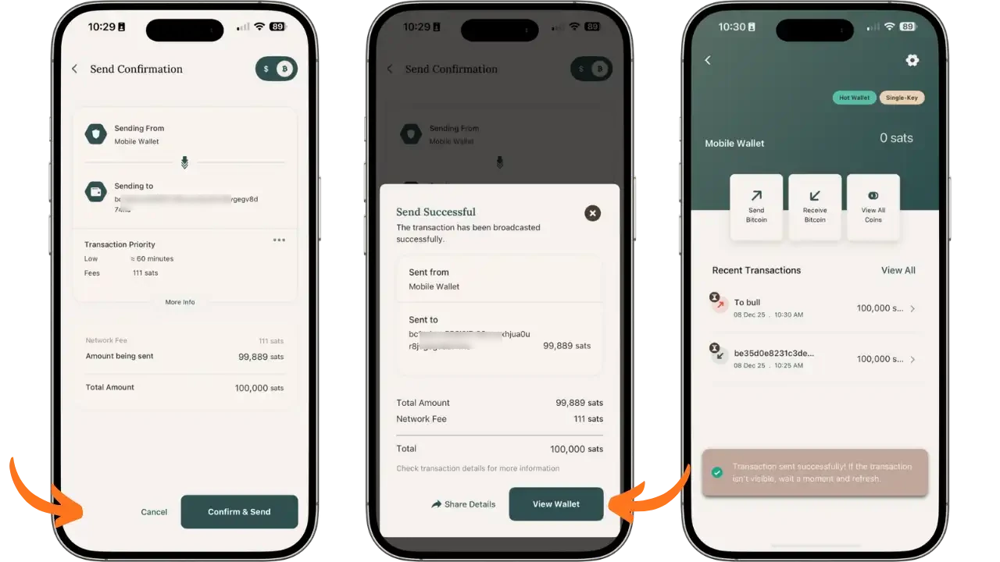

Een overzichtsscherm toont alle details: wallet bron, bestemmingsadres, prioriteit van de transactie, netwerkkosten, verzonden bedrag en totaal. Controleer deze informatie zorgvuldig, want Bitcoin transacties zijn onomkeerbaar. Druk op "Bevestigen & Verzenden" om de transactie te verzenden.

Er verschijnt een bevestiging "Verzenden gelukt" met de volledige samenvatting. De transactie is zichtbaar in de geschiedenis "Recente transacties" met het bijbehorende label.

## Je sleutels opslaan

Een back-up maken van je herstelsleutel is een cruciale stap. Ga naar het tabblad Meer naar de sectie "Back-up en herstel" en klik op "Herstelsleutel".

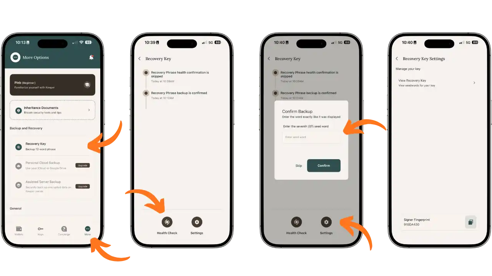

Het scherm toont de status van je back-ups. Om uw back-up te verifiëren, vraagt de toepassing u om een specifiek woord in uw zin te bevestigen (bijvoorbeeld het 7e woord). Deze verificatie zorgt ervoor dat u uw herstelzin correct hebt opgeschreven.

In "Herstelsleutelinstellingen" kunt u uw volledige zin bekijken via "Herstelsleutel bekijken" en de ondertekenaarvingerafdruk van uw sleutel zien. Bewaar uw 12-woorden zin op papier, op een veilige plaats, uit de buurt van vocht en vuur. Bewaar het nooit op een aangesloten apparaat.

## Een externe sleutel toevoegen (wallet hardware)

Een van de grootste voordelen van Bitcoin Keeper is de integratie van hardware wallets. Ga naar het tabblad Keys en druk op "Add key" om een nieuw handtekeningapparaat toe te voegen.

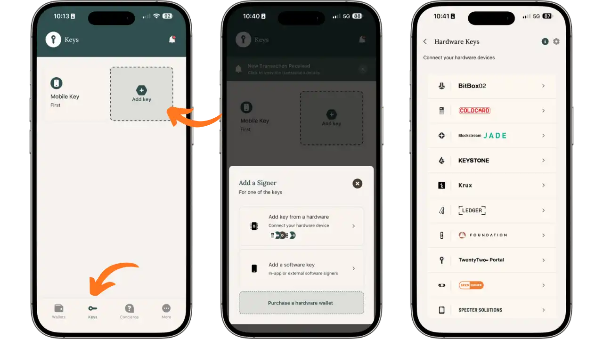

Selecteer "Sleutel van hardware toevoegen" om een hardware wallet aan te sluiten. De applicatie ondersteunt een groot aantal apparaten: BitBox02, Coldcard, Blockstream Jade, Keystone, Krux, Ledger, Foundation Passport, TwentyTwo Portal, Seedsigner en Specter Solutions.

### Tapsigner configuratie

De Tapsigner is een NFC-kaart van Coinkite die speciaal geschikt is voor mobiel gebruik. Als je meer wilt weten, hebben we een speciale tutorial:

https://planb.academy/tutorials/wallet/hardware/tapsigner-ab2bcdf9-9509-4908-9a4a-2f2be1e7d5d2

Om de Tapsigner toe te voegen, selecteer je deze uit de lijst met hardware wallets.

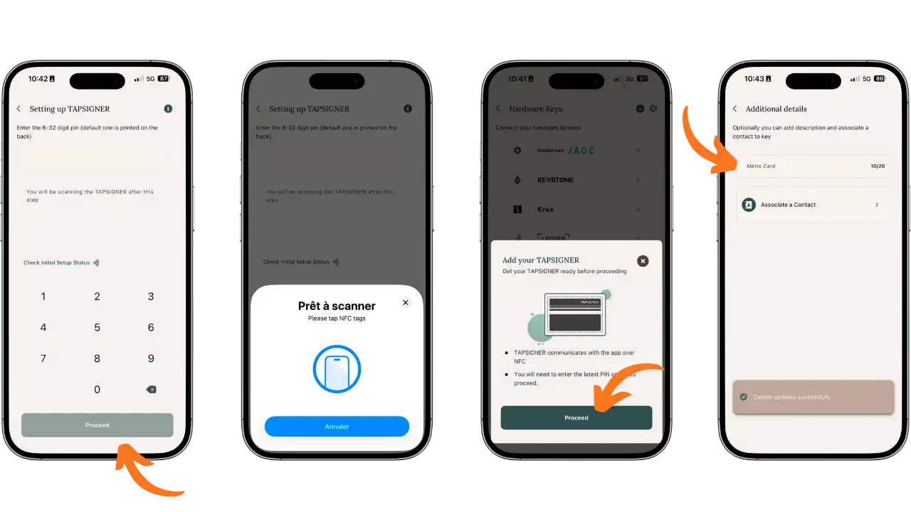

Voer eerst de 6-32-cijferige PIN-code in die op de achterkant van uw kaart staat afgedrukt (standaard op nieuwe kaarten), of uw PIN-code als deze al is geconfigureerd. Druk op "Doorgaan" en breng je Tapsigner dicht bij de achterkant van je telefoon wanneer "Klaar om te scannen" wordt weergegeven. NFC-communicatie importeert automatisch de publieke sleutel. Je kunt dan een beschrijving toevoegen (bijv. "Métro Card") om deze sleutel te identificeren.

## Een multisig portfolio maken

Zodra je je sleutels hebt ingesteld, kun je een wallet met meerdere handtekeningen maken, die meerdere apparaten combineert. Klik op het tabblad Portemonnees op "Wallet toevoegen".

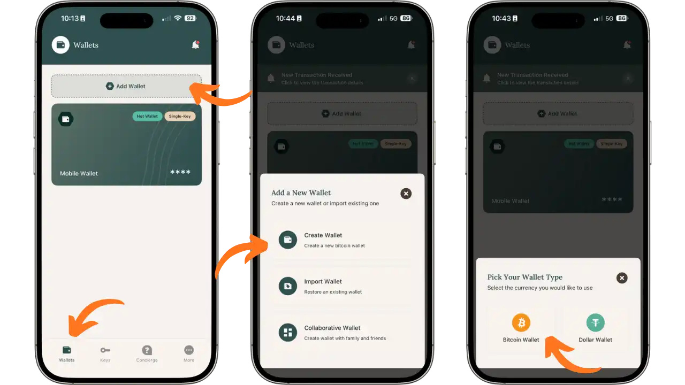

Je hebt drie opties: "Wallet aanmaken" voor een nieuwe portefeuille, "Wallet importeren" om een bestaande wallet te herstellen, of "Wallet samenwerken" voor een gedeelde kluis. Selecteer "Wallet aanmaken" en vervolgens "Bitcoin Wallet".

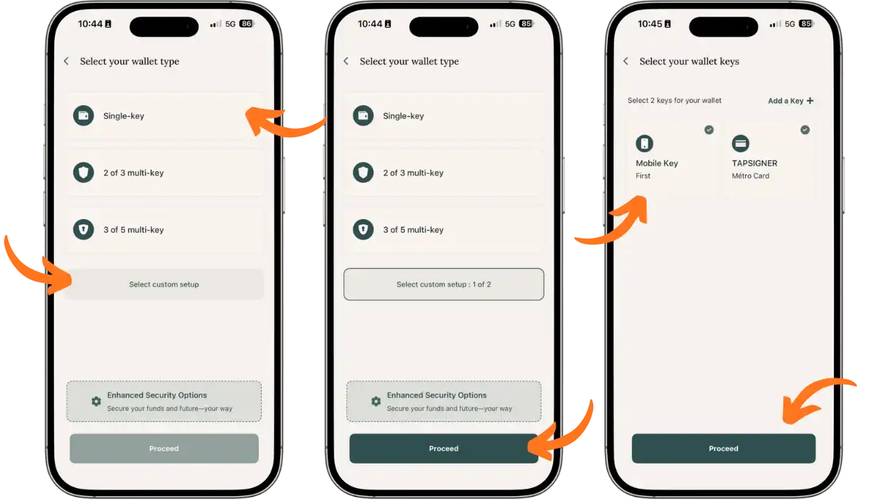

Het volgende scherm biedt verschillende configuraties: "Enkele toets", "2 van 3 multi-toets", of "3 van 5 multi-toets". Voor een aangepaste multi-sig, druk op "Selecteer aangepaste instelling". Kies bijvoorbeeld "1 van 2": een enkele handtekening is vereist uit twee mogelijke toetsen.

Selecteer vervolgens de sleutels waaruit je Vault zal bestaan. In ons voorbeeld combineren we de "Mobile Key" (telefoonsoftwaresleutel) met de "TAPSIGNER" (metrokaart). Deze configuratie biedt redundantie: als een van de sleutels onbereikbaar wordt, kun je altijd je geld uitgeven met de andere.

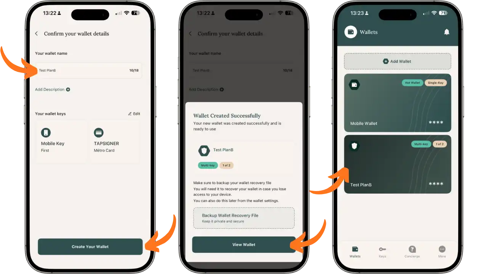

Geef je wallet een naam (bijv. "Test PlanB"), voeg een optionele beschrijving toe en controleer de geselecteerde toetsen. Druk op "Maak uw Wallet". Er verschijnt een bevestigingsbericht "Wallet met succes aangemaakt", dat u eraan herinnert het wallet herstelbestand op te slaan.

Je nieuwe multisig wallet verschijnt nu in het tabblad Portemonnees met de tag "Multi-key" en de aanduiding "1 van 2".

### Configuratiebestand opslaan

**In tegenstelling tot een eenvoudige wallet, waar de herstelzin voldoende is om toegang te herstellen, heeft een wallet multisig ook het configuratiebestand nodig dat de structuur van de kluis beschrijft (welke sleutels doen mee, hoeveel handtekeningen zijn vereist). Zonder dit bestand, zelfs met alle herstelzinnen, kunt u uw wallet niet herbouwen.

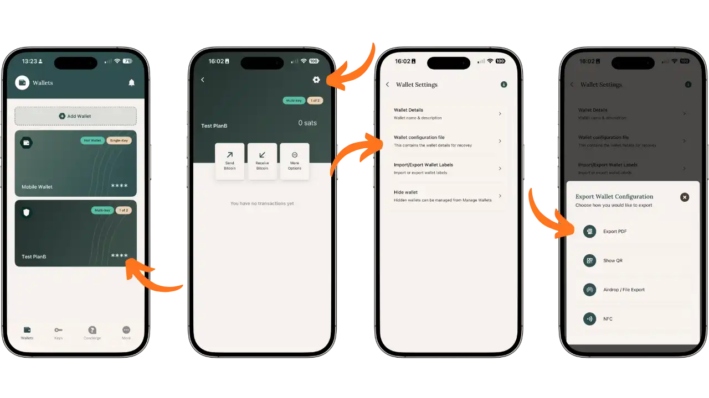

Om dit bestand te exporteren, selecteert u uw wallet multisig in de tab Portemonnees en drukt u vervolgens op het pictogram Instellingen (tandwiel) in de rechterbovenhoek. Klik in "Wallet Instellingen" op "Wallet configuratiebestand". Er zijn verschillende exportopties beschikbaar:

- Export PDF**: genereert een PDF-document met alle wallet informatie
- Toon QR**: toont een scanbare QR-code voor het importeren van de configuratie naar een ander apparaat
- Airdrop / Bestandsexport**: exporteert het bestand via de opties voor delen van je telefoon
- NFC**: delen via NFC met een compatibel apparaat

Bewaar dit configuratiebestand apart van uw herstelzinnen, bij voorkeur op een gecodeerd of afgedrukt medium. Als u uw telefoon verliest, kunt u met dit bestand en de herstelzinnen voor elke deelnemende sleutel uw wallet multisig opnieuw opbouwen met Bitcoin Keeper of andere compatibele software.

## Beste praktijken

### Fondsorganisatie

Structureer je bitcoins volgens hun gebruik: een hete wallet Single-Key voor lopende uitgaven met beperkte bedragen, en een of meer Vaults Multi-Key voor langetermijnsparen. Systematisch UTXO labelen helpt je om bij te houden waar je geld vandaan komt, wat vooral handig is voor het beheren van vertrouwelijkheid en het vermijden van het mengen van munten van verschillende herkomst.

Houd uw telefoon veilig: activeer de biometrische vergrendeling, voer regelmatig systeemupdates uit en blijf alert op geïnstalleerde toepassingen. En houd Bitcoin Keeper up-to-date met beveiligingspatches.

### Back-up beveiliging

Bewaar ten minste twee kopieën van elke herstelzin op papier, opgeslagen op geografisch gescheiden locaties. Overweeg voor grote bedragen gegraveerd, rampbestendig metaal. Bewaar deze zinnen nooit op een apparaat dat is verbonden met het internet en fotografeer ze nooit.

Bewaar voor multi-sig kluizen ook het configuratiebestand (Wallet Recovery File), dat de deelnemende publieke sleutels en de kluisstructuur bevat. Dit bestand, gecombineerd met de sleutelherstelzinnen, maakt het mogelijk wallet te herbouwen op elke compatibele software, zoals Sparrow of Specter.

## Voordelen en beperkingen

### Hoogtepunten

- Bitcoin-applicatie vermindert complexiteit en risico's
- Integratie van multisig kluizen met stapsgewijze begeleiding
- Uitgebreide ondersteuning voor hardware wallet (Tapsigner, Coldcard, Ledger, Jade, enz.)
- Geavanceerd beheer van UTXO en muntcontrole
- Kan worden aangesloten op een persoonlijke Electrum server
- Open, controleerbare broncode

### Te overwegen beperkingen

- Interface voornamelijk in het Engels
- Sommige premium functies (Cloud Backup, Assisted Server) vereisen een upgrade
- Multisig configuratie vereist initiële training

## Conclusie

Bitcoin Keeper onderscheidt zich als een schaalbare oplossing voor het beheren van uw bitcoins. De progressieve aanpak, van de eenvoudige hot wallet tot Vaults met meerdere handtekeningen, betekent dat de beveiliging kan worden geüpgraded als de behoeften veranderen. De mogelijkheid om gemakkelijk hardware wallets zoals Tapsigner te integreren maakt de weg vrij voor robuuste configuraties zonder overmatige complexiteit.

De bitcoin-only oriëntatie, open source code en het respect voor privacy maken het een keuze die aansluit bij de kernwaarden van het Bitcoin ecosysteem.

Deze tutorial behandelt de essentiële functies van Bitcoin Keeper in de gratis versie. De applicatie biedt ook premium functies (Cloud Backup, Assisted Server Backup, Canary Wallets) die het onderwerp zullen zijn van een speciale tutorial. In een volgende handleiding gaan we ook dieper in op de nalatenschapsplanning, waarmee u de overdracht van uw bitcoins aan uw dierbaren kunt voorbereiden, dankzij de verbeterde kluizen en bijbehorende documenten die in de applicatie zijn geïntegreerd.

## Bronnen

- Officiële website: [bitcoinkeeper.app](https://bitcoinkeeper.app)
- Helpcentrum: [help.bitcoinkeeper.app](https://help.bitcoinkeeper.app)
- Broncode: [github.com/bithyve/bitcoin-keeper](https://github.com/bithyve/bitcoin-keeper)
- Telegram : [t.me/BitcoinKeeper](https://t.me/BitcoinKeeper)
- Twitter/X: [@bitcoinkeeper_](https://x.com/bitcoinkeeper_)