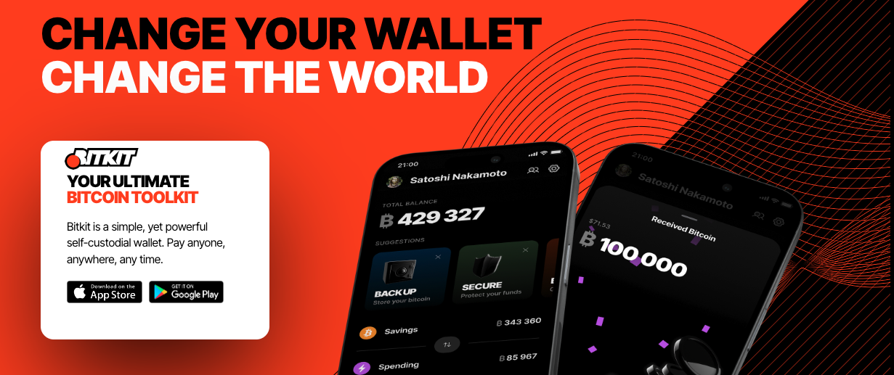
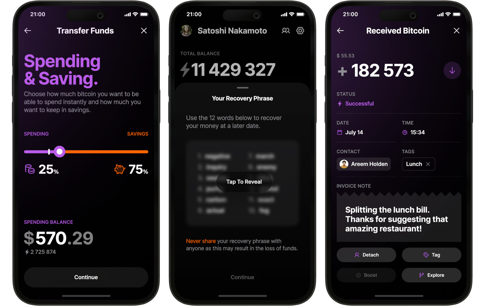
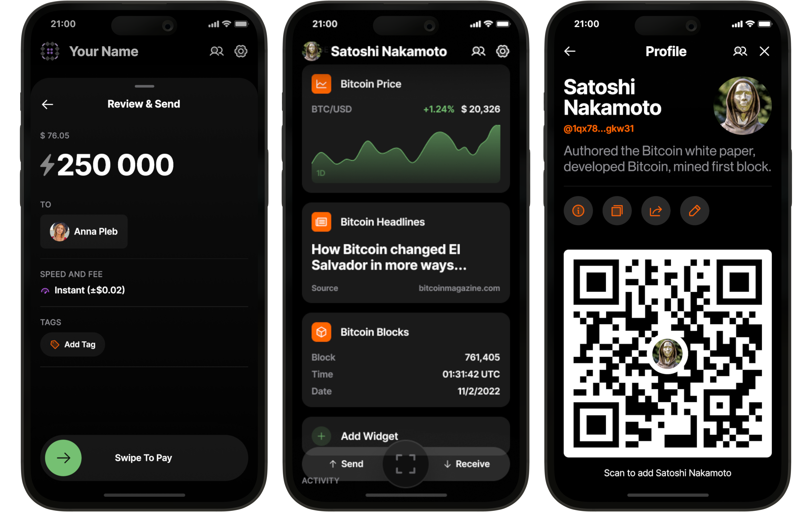
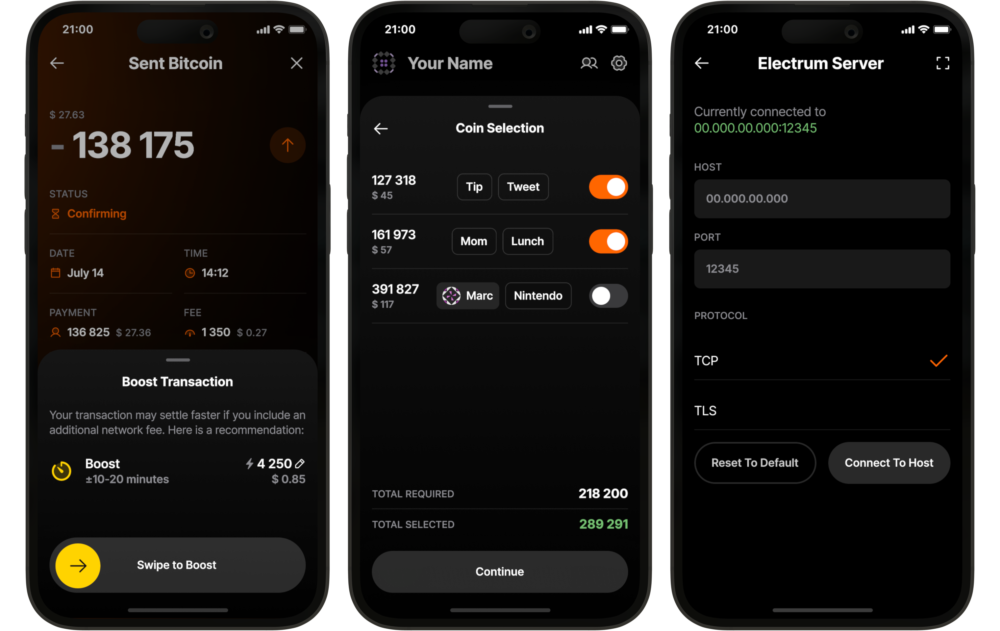

Bitkit (https://www.bitkit.to) basit, ancak güçlü bir kendi kendine emanet Wallet'tür. Herhangi birine, herhangi bir yerde, herhangi bir zamanda ödeme yapın.

Bitkit, Bitcoin'inizin gerçek Ownership'ünü almanızı ve böylece kendi şartlarınıza göre harcama yapmanızı sağlayan, kendi kendini yöneten bir mobil Wallet'dır. Göze çarpan özellikler ve şık bir tasarımla geliştirilmiş olan Bitkit, herkese, her zaman, her yerde anında ödeme yapılmasını sağlar. Üstelik herkesin denetleyebilmesi için tamamen açık kaynaklıdır.

yukarıdaki eğitim videosu Bitkit Wallet için 20' kapsamlı bir rehberdir_

## Kılavuz

Bitkit'in kullanımı gerçekten çok kolay.

Tam teşekküllü bir Bitcoin Wallet olan Bitkit, beklediğiniz tüm işlevleri içerir:

Anında Ödemeler: On-Chain ve Lightning işlemleri için cüzdanlar arasında hokkabazlık yapmaya gerek yok. Bitkit her ikisini de sorunsuz bir şekilde harmanlıyor.

Bakiye Yönetimi: Anlık ödemeler için her zaman yeterli kapasiteye sahip olduğunuzdan emin olmak için tasarruf ve harcama hesabınız arasında zahmetsizce para aktarın.

Kurtarma İfadesi: BIP 39'u destekleyen herhangi bir Wallet'da birikim bakiyenizi geri yükleyin.

Otomatik Yedeklemeler: Wallet'inizdeki hassas olmayan veriler otomatik olarak yedeklenir, böylece harcama bakiyenizi her zaman geri yükleyebilirsiniz.

Detaylı İşlem Geçmişi: Düzenli tutmak için kişiler atayın ve işlemlerinizi etiketleyin.

Bitkit ayrıca kendisini diğerlerinden ayıran benzersiz özelliklere sahiptir:

Ödenecek Kişiler: Adres veya fatura sormaya elveda deyin. Arkadaşlarınızı kişi listenize ekleyin ve onlara ödeme yapın.

Canlı Widget'lar: İlgi çekici widget'lar ile Wallet ana ekranınıza eğlenceli ve faydalı bir dokunuş ekleyin.

Sosyal Profil: Herkese açık profilinizin ve bağlantılarınızın kontrolünü elinize alın, böylece kişileriniz size istedikleri zaman ulaşabilir ve ödeme yapabilir.

Parolasız Hesaplar: Slashtag'leri veya Lightning kimlik doğrulamasını destekleyen web sitelerinde oturum açın.

QuickPay: Lightning ödemeleri için 50 $'ın altında özel bir limit belirleyin ve bunun altındaki tüm Invoice'ler anında ödenir - kaydırma yok, gecikme yok. Kahve içmek veya faturaları bölüşmek için mükemmeldir.

Alışveriş yapın: Bitcoin ile Netflix, Airbnb, bakkaliye, mobil veri ve daha fazlası için doğrudan Bitkit'in içinden ödeme yapın.

Banka yok. Sürtüşme yok.

## Yeni Başlayanlar İçin BitKit Kılavuzu: Adım Adım Öğretici

### 1. BitKit'i yükleyin

App Store'u (iOS) veya Google Play'i (Android) açın.

"BitKit" için arama yapın ve resmi turuncu marka simgesini gördüğünüzü onaylayın.

Al veya Yükle'ye dokunun, ardından indirme tamamlandığında Aç'a dokunun.

İpucu: Sahte uygulamalar görürseniz, yayıncıyı iki kez kontrol edin. BitKit, Synonym Software Ltd. tarafından yayınlanmıştır.

### 2. İlk Lansman ve Şartlar

BitKit'i başlatın, Kullanım Koşullarını kabul edin ve Devam'a dokunun.

İlk katılım akışını başlatmak için Başlayın'a dokunun.

Şimdilik Wallet'i Geri Yükle'yi yok sayın; yeni bir Wallet oluşturacağız.

### 3. Wallet seed'nizi Yedekleyin

BitKit kendi kendini gözaltına alır, bu nedenle on iki kelimelik seed cümlesi tek kurtarma yönteminizdir.

İstendiğinde Şimdi Yedekle öğesine dokunun.

On iki kelimeyi kağıda yazın ve çevrimdışı olarak güvenli bir yerde saklayın.

Sorulduğunda kelimeleri onaylayın, ardından Kaydet'e dokunun.

Uyarı: seed'u kaybederseniz, paralarınızı da kaybedersiniz. Sıfırlama düğmesi yoktur.

### 4. Tasarruf ve Harcama Hesapları

BitKit otomatik olarak iki hesap oluşturur:

Tasarruflar: Bitcoin tabanı Layer

Daha büyük, daha yavaş, daha güvenli transferler

Harcama: Lightning Network

Küçük, anında günlük ödemeler

Ana ekranın üst kısmındaki sekme ile bunlar arasında geçiş yapın.

### 5. Bitcoin on chain (Tasarruf) alın

Tasarrufları Seçin.

generate'e yeni bir Bitcoin Address için Al'a dokunun.

QR kodunu paylaşın veya Address'i gönderene kopyalayın.

Fonlar bir onaydan sonra görünecektir. Konfetiler gelişi kutlayacaktır.

### 6. Yıldırım Üzerinden Alma (Harcama)

Harcama öğesini seçin ve Al öğesine dokunun.

Bir miktar girin (örneğin, 10 000 Sats) ve Devam öğesine dokunun.

BitKit, bir kanal açma ücretini (likidite gereksinimi) tahmin edecektir.

generate a Yıldırım Invoice için Devam öğesine dokunun.

Göndericinin Invoice'yi taramasına veya yapıştırmasına izin verin. Para saniyeler içinde yatar.

### 7. Yıldırım Ödemesi Gönderin

Tara simgesine dokunun, bir Lightning Invoice'ü tarayın veya yapıştırın.

Gerekirse tutarı girin, ardından Devam öğesine dokunun.

Ücreti gözden geçirin ve defter tutma için isteğe bağlı bir etiket ekleyin.

Ödemek için kaydırın, PIN kodunuzu girin ve işlem tamam.

Ücret ve Timestamp dahil olmak üzere işlemin ayrıntıları Faaliyet akışında görünür.

### 8. Profilinizi ve Kişilerinizi Oluşturun

Sol üstteki avatara dokunun.

Bir görünen ad girin ve bir profil resmi seçin.

BitKit kişisel QR kodunuzu gösterir. Arkadaşlarınız sizi eklemek için bunu tarayabilir.

Kişilerin size ödeme yapmasına izin verme talebini kabul edin veya reddedin.

Bir kişi eklendikten sonra, Sats göndermek veya talep etmek için Kişiler'deki adına dokunmanız yeterlidir.

### 9. Widget'ları Keşfet

Ana ekrandan Widget'lar bölümüne kaydırın. Eklemek veya düzenlemek için dişli simgesine dokunun:

Bitcoin Fiyat Ticker - dört adede kadar fiat para birimi seçin ve zaman dilimini (gün, hafta, ay, yıl) ayarlayın.

Haber Akışı - önde gelen Bitcoin kaynaklarından manşetler.

Bitcoin Facts - yeni başlayanlar için küçük bilgiler.

Hesaplayıcı - Sats ve fiat arasında anında dönüştürme yapın.

Hava Durumu Widget'ı - ağ ücreti "hava durumunu" göstererek On-Chain işlemleri için uygun zamanları belirtir (güneşli olması düşük tıkanıklık anlamına gelir).

### 10. Bitcoin ile alışveriş yapın

BitKit, hediye kartları, telefon dolumları ve daha fazlası için Bitrefill ile entegre olur.

Alt navigasyondaki Mağaza öğesine dokunun.

Hediye Kartları'nı seçin ve bir satıcı seçin (örneğin, Bitrefill).

Bir miktar seçin (1 USD kadar düşük), teslimat için bir e-posta ekleyin ve ardından Ödeme Yapın.

Ödemek için kaydırın. Hediye kartı kodu saniyeler içinde e-posta ile gelir.

### 11. Hızlı Ödeme

Hızlı Ödeme, özel bir limitin (varsayılan 50 USD) altındaki Yıldırım faturalarını otomatik olarak onaylar.

Ayarlar → Genel → Hızlı Ödeme bölümüne gidin.

Eşiğinizi ayarlayın ve anahtarı etkinleştirin.

Kahve gibi küçük alışverişler artık kaydırma gerektirmiyor.

### 12. Güvenlik ve Gizlilik

PIN Kodu - Ayarlar → Güvenlik ve Gizlilik altında etkinleştirin ve altı basamaklı bir kod ayarlayın.

Biyometri - Face ID veya parmak iziyle kilit açmayı açın.

Otomatik Kilit - zaman aşımını seçin (örneğin 90 saniye hareketsizlik).

Ödemeler için PIN gerektir - ekstra gönül rahatlığı.

### 13. Yıldırım Kanallarını Yönetme

Kanal nedir?

Kanal, likiditeyi tutan ve ikiye ayrılan iki taraflı bir tüneldir:

Outbound - Bitcoin'niz, göndermek için kullanılır.

Gelen - karşı taraf Bitcoin, almak için gerekli.

Tasarruflardan Harcamalara Transfer

Birikimleri açın, Harcamaya Aktar öğesine dokunun.

Tutarı girin (örneğin, 25 000 ₿) ve Devam öğesine dokunun.

Ücreti onaylayın ve On-Chain işleminin onaylanmasını bekleyin.

Açıldığında, harcama bakiyesi ve alım kapasitesi güncellenir.

Bir Kanalı Görüntüleme veya Kapatma

Ayarlar → Gelişmiş → Lightning Bağlantıları

Durumu, bakiyeleri ve ücretleri görmek için bir bağlantıya dokunun.

Kapatmak ve fonları Tasarruflara geri döndürmek istiyorsanız Bağlantıyı Kapat seçeneğine ilerleyin.

Not: Düzenleyici nedenlerden ötürü, BitKit'teki toplam likidite yaklaşık dokuz yüz doksan euro değerinde Bitcoin ile sınırlıdır.

### 14. Gelişmiş Özellikler

Coin Seçimi - gizlilik veya ücret kontrolü için belirli UTXO girişlerini seçin (Ayarlar → Gelişmiş → Coin Seçimi).

İşlem Hızı - Yavaş, Normal veya Hızlı On-Chain ücret hedeflerini seçin.

Yerel Para Birimi - Ayarlar → Genel altında USD'den herhangi bir büyük fiat'a geçin.

## Tebrikler

BitKit'i kurdunuz, seed'inizi güvence altına aldınız, Lightning ödemelerinde ustalaştınız ve hatta ilk hediye kartınızı satın aldınız. BitKit'in tasarımı, güçlü Bitcoin araçlarını sezgisel hissettiriyor, ancak anahtarlar her zaman elinizde. BitKit'i bugün indirin ve gerçek Bitcoin Ownership'a adım atın. Sorularınız veya geri bildiriminiz mi var? BitKit ekibine sosyal medya üzerinden veya uygulama içi destek bağlantısından ulaşın.

**Bitcoin alım satımına ilişkin not**: Bitkit, Bitcoin alım satımını desteklemez. Satın almak veya satmak için Bitfinex gibi borsaları kullanın, ardından Bitkit'e veya Bitkit'ten gönderin.