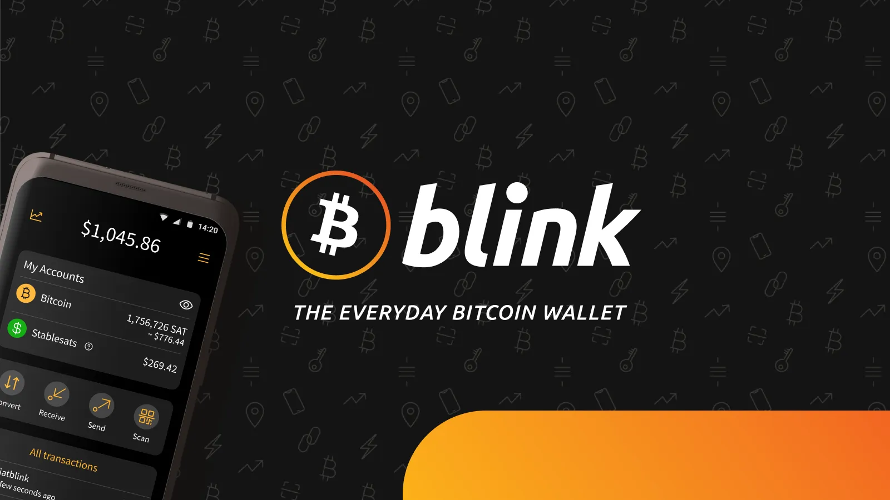
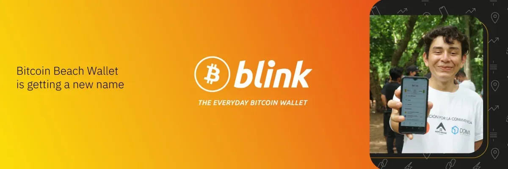
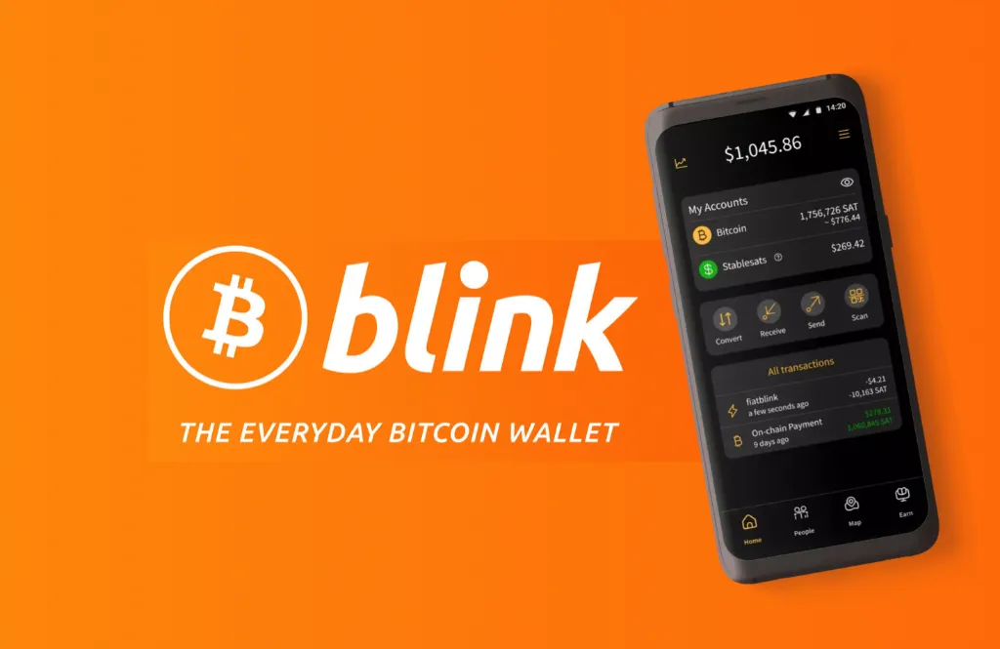
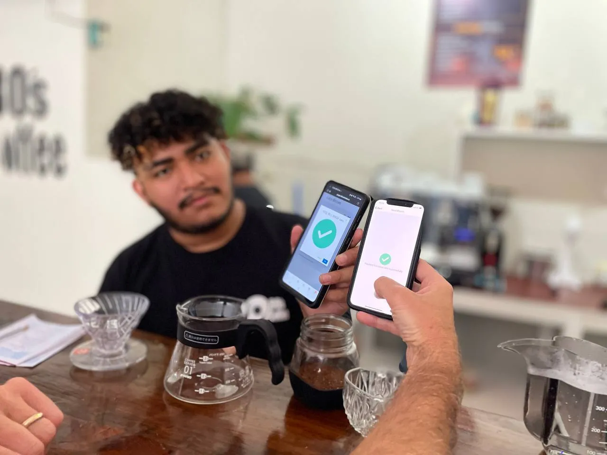

## None Wallet ni iki?

Nimwibagire ivyo mwibaza ko muzi vyose ku bijanye n’ama wallets ya Bitcoin ko agoranye. Blink ni iPhone y’amasakoshi ya Bitcoin.

Blink yahora yitwa Bitcoin Beach Wallet, ni porogarama yo kuri telefone ngendanwa ikoreshwa neza, izana Bitcoin ku muntu wese—aho hose kw’isi. Yari yubakiwe umuryango wa Bitcoin Beach muri El Salvador, ubu iriko irafasha abantu bo kw’isi yose kohereza, kwakira no gukoresha Bitcoin ata ngorane.

Waba uri mushasha muri Bitcoin canke umukoresha w’umuhinga, iyi nkuru iragufasha kumenya vyose ukeneye kumenya kugira ngo utangure.

### Ibirango vy'ingenzi:

- Infashanyo y’amafaranga abiri: Ufata mu buryo bworoshe Bitcoin (BTC) na Stablesats (ingana n’amadolari y’Amerika)
- Lightning Network: Ivyihuta, bihendutse Bitcoin
- Stablesats: Gumana agaciro kawe mu madolari y'Amerika mu gihe ukoresha urubuga rwo kwishura rwa Bitcoin
- Gutegura vyoroshe: Nimero yawe ya telefone gusa isabwa
- Ikarata y'abacuruzi kw'isi yose: Rondera ubucuruzi bwemeza Bitcoin

Igice ciza kuruta ibindi vyose? Ushobora guhindura hagati ya "Ndashaka gufata Bitcoin kuko mbona ko izoduga" na "Ndashaka gusa amadolari ahamye ku mafaranga yanje y'ikawa" ukoresheje uruzitiro rumwe.

## Ibisabwa

Imbere yo gutangura, uzokenera:

- Telefone ngendanwa (iOS canke Android)
- Inomero ya telefone (yo kugenzura)
- Kuronka Internet

## Gutegura mbere

Ehe icateye ubwoba abakoresha benshi: Gushinga Blink biranyaruka kuruta gukora konti y’ubuhinga bwa none kuko ata mpapuro zihari, nta ID zishirwako, nta kurindira. Gusa vyihuta kandi vyoroshe.

**Ivyo vyose:**

- Gukuraho Blink Wallet
 - Rondera “Blink Wallet” ku [Iduka ry’Iporogarama] (iOS), [Iduka rya Google] (Iduka ry’Iporogarama) (Iduka ry’Iporogarama) [Igikoresho ca porogarama] (Huawei), bivanye n’igikoresho cawe.
 - Ushobora kandi kuyikura ku rubuga rwa [Blink Wallet](https://blink.sv).
- Rema Wallet
 - Kanda kuri “Rema Wallet nshasha”
 - Kwemera amabwirizwa n'ingingo
 - Injira inomero yawe ya telefone
 - Genzura ukoresheje SMS canke WhatsApp kugira uronke kode yawe
 - Injira kode kugira ngo ugenzure
- Birarangiye, ni vyo.
 - Inomero yawe ya telefone ica iba login yawe. Ni vyo.

## Gutahura igitabu cawe ca Wallet Interface

Iyo ufunguye [Blink Wallet](https://blink.sv/) ku ncuro ya mbere, uzobona ikintu gisukuye kigusubiza umutima mu nda. Nta charts zikuvugiriza induru, nta nomero zica ibibatsi, ni balance yawe gusa n’amabuto yoroshe.

### Incamake y'igicapo nyamukuru

- Igitigiri cose: Kigaragaza agaciro k'ama Bitcoin n'amafaranga y'Amerika
- Amafaranga asigaye kuri konti:
 - Bitcoin: Yerekanwa muri Sats (igice gitoyi kuruta ibindi vyose ca Bitcoin)
 - Idolari: Agaciro kawe karahagaze mu madolari y'Amerika

- Amabuto y’Ibikorwa: Amabuto ane ukwiye kumenya.
 - Guhindura
 - Kwakira
 - Kurungika
 - Gupima QR
- Amateka y'Ibikorwa: Ibikorwa vyawe vyose vya kera
- Igiciro: Gukurikirana igiciro ca Bitcoin (kanda ku kimenyetso c'igiciro)

### Ivy'ingenzi n'ingene woshiraho umuravyo wawe Address

#### Gutegura Umuravyo Wawe Address

- Genda kuri Amategeko → Umuravyo wawe Address
- Hitamwo Address yawe (nk'akarorero, "izina ryawe@wishura.blink.sv")
- Ivyo bica bihinduka Bitcoin Address yawe ihoraho umuntu wese ashobora gukoresha kugira ngo akurungikire amahera .

#### Ibindi vyagezweho vyo gutunganya:

- Amafaranga mburabuzi: Hitamwo uko amafaranga asigaye yerekanwa
- Konti mburabuzi: Hitamwo aho amafaranga yinjira aja
- Gutegura imeyili yawe: Wongereko imeyili kugira ngo winjire
- Umutekano wo ku gikoresho: Gushoboza PIN canke biometrics
- Imipaka y'Ibikorwa:
 - Kwakira: Nta n'aho bigarukira
 - Gukura: $2,000/umusi
 - Wallet-ku-Wallet kwimurirwa: $4.000/umusi

## Uko wokwakira Bitcoin ukoresheje Blink Wallet

### Uburyo bwa 1: Kode ya QR (Isanzwe)

- Kanda kuri “Kwakira” ku rubuga rw’intango rwa Blink Wallet.
- Hitamwo amafaranga ushaka kwakira:
 - Bitcoin (BTC), canke
 - USD (Ibiharuro bihoraho)
- Gusaba umubare wihariye:
 - Kanda kuri “Igitigiri”
 - Injira umubare ushaka kwakira
 - Sangira kode ya QR canke uruja n'uruza rwo kwishura n'uwarungitse
- Kwemera umubare uhinduka (nta gaciro kashizweho):
 - Simbuka intambwe ya "Igiciro"
 - Gusa gusangira kode ya QR
 - Uwurungika ni we afata ingingo y'ingene yorungika .
 - Uwurungika ni we afata ingingo y'ingene yorungika .

### Uburyo bwa 2: Umuravyo Address

- Sangira umuravyo wawe Address (izina ryawe@pay.blink.sv) n'umuntu wese
- Bashobora kohereza Bitcoin ataco baciyeko bakoresheje iyi Address gusa.
- Nta kode za QR canke invoice zikenewe
- Ikorana na Wallet yose ihuye n'umuravyo

### Uburyo bwa 3: On-Chain Bitcoin (Ivya kera)

- Mu gicapo c'ukwakira, kanda kuri "Onchain".
- Koresha ibi ku bikorwa vya kera vya Bitcoin
- Iciyumviro: Amafaranga menshi n'ibihe vyo kwemeza bigenda buhoro
- Ivyiza ku mahera menshi canke igihe umuravyo utaboneka

## Uko worungika Bitcoin ukoresheje Blink Wallet

### Ukohereza n'amakode ya QR

- Kanda kuri "Ohereza" ku gicapo nyamukuru
- Kanda ku kimenyetso ca kamera kugira ngo ushireko kode ya QR
- Hitamwo konti worungikako (Bitcoin canke USD)
- Suzuma umubare n'amahera
- Wemeze ko wishuye

### Kurungika n'ibisabwa vyo kwishura/amafagitire

- Kanda kuri "Kohereza"
- Gushiramwo ubusabe bwo kwishura (bwakopiwe mu nyandiko/imeyili)
- Kurikiza intambwe zimwe n'izo kohereza kode ya QR

### Kurungika kuri aderesi z'umuravyo

- Kanda kuri "Kohereza"
- Andika canke ushireko umuravyo Address (isa n'imeli)
- Injira umubare ushaka kohereza
- Hitamwo konti yawe yo kohereza maze wemeze

### Kwohereza ku bandi bakoresha Blink

- Amafaranga ntaco atanga iyo woherereje abandi bakoresha Blink Wallet
- Abaronka amafaranga baca baba abo guhamagara kugira ngo bashobore gukoresha amafaranga yoroshe muri kazoza

## Guhindura hagati ya Bitcoin na USD na Blink Wallet

Kimwe mu bintu bikomeye cane vya Blink Wallet ni ubushobozi bwayo bwo guhindura hagati ya Bitcoin na Stablesats (USD). Kurikiza iyi nzira yoroshe y'intambwe ku yindi:

- Kanda kuri buto ya "Guhindura" iri ku mugaragaro nyamukuru
- Hitamwo inzira yo guhindura:
 - Bitcoin → amadolari y'Amerika
 - Amadolari y'Amerika → Bitcoin
- Gushinga umubare na:
 - Injiramwo amahera yihariye ya Bitcoin canke USD, canke
 - Hitamwo ijana kw'ijana ry'amahera usigaje (25%, 50%, 75%, 100%)
- Suzuma igipimo c'uguhinduka
- Wemeze uguhinduka kugira ngo urangize igikorwa.

Gukoresha Ibibazo:

- Guhindura mu madolari y’Amerika igihe igiciro ca Bitcoin kiriko kiragabanuka.
- Guhindura Bitcoin igihe ushaka gufata canke gushiramwo amahera igihe kirekire.
- Gukoresha amadolari y’Amerika kugira wirinde uguhinduka kw’ibiciro mu bikorwa vyawe vya misi yose.
- Guhindura hagati ya BTC na USD kugira ngo wungukire ku nzira y’isoko.

## Ibirango vy'umucuruzi kuri Blink Wallet

### Kurondera ubucuruzi bwemeza Bitcoin

- Kanda ku kimenyetso ca "Ikarita" kiri musi
- Gushakisha ahantu hemera kwishura Bitcoin
- Kanda ku bucuruzi bwose kugira ngo:
 - Barungikire amahera ataco baciyeko
 - Kuronka amabwirizwa biciye ku ikarita ya Google

### Ku bafise ubucuruzi: Ibiranga aho bagurisha

Ushobora gushika ku bikoresho vy’ubudandaji biteye imbere mu Mitunganyirize → Uburyo bwo kwishurwa:

- Igitabo c'amahera y'umuravyo:
 - Urubuga rushingiye ku kibanza co kugurisha
 - Koresha ku gikoresho cose gifise umucukumbuzi
 - Rema inyemezabuguzi y'amafaranga yihariye
- Amakode ya QR ashobora gucapwa:
 - generate kode za QR z'ubucuruzi bwawe
 - Sohora kandi ugaragaze kugira abakiriya bashobore gucapura
 - Nta mafaranga yerekanwa - abakiriya bahitamwo ingene botanga/bazotanga

Uronke ubumenyi bwinshi ku [Blink POS](https://www.blink.sv/blog/hindura-ubumenyi-bwawe bwo kwishura-n’ivyo-blink-pos), kandi utore uburyo bw’agaciro bw’abacuruzi mu [Blink Branding no Gushiramwo](https://www.brand.sv/ru).

## Kwiga no kuronka Bitcoin vyakozwe vyoroshe na Blink

Igice ca "Earn", kiri musi y'urupapuro nyamukuru, gifasha abashasha kumenya ivyerekeye Bitcoin mu gihe baronka amahera makeyi:

- Kanda kuri "Uronke" kuva kuri menyu iri musi
- Uzuza amasomo magufi yerekeye Bitcoin
- Niwishure neza ibibazo vyoroshe
- Uronke Sats ku cigwa cose kirangiye
- Uwubake ubumenyi bwawe bwa Bitcoin buhoro buhoro .

Ingingo zivugwamwo ni:

- Bitcoin ni iki?
- None Lightning Network ikora gute?
- Bitcoin n'amahera ya kera
- Ibikorwa vyiza vyo gucungera umutekano

## Ivyiyumviro bihambaye vyo kwiyumvira

### Kamere y'ububiko

Blink ni Wallet y’ububiko, bisobanura ko bafata kandi bagacungera amahera yawe mu izina ryawe.

- Ivyiza: Gutegura vyoroshe, gukoresha neza Interface, ubufasha bw'abaguzi buraboneka
- Ivyiza: Ntushobora kugenzura [imfunguruzo zawe z’ibanga](https://www.blink.sv/blog/si-imfunguruzo-zawe-si-ibiceri-vyawe), ivyo bisigura ko wizigira Blink kugira ngo icunge amahera yawe

### Imipaka y'ugucuruza

- Imipaka y'umusi iriho
- Imipaka ishobora kwongerwa iyo usavye
- Rimbura uburyo bwo kwirinda amahera menshi

### Ivyiyumviro vy'ubuzima bwite

- Inomero ya telefone isabwa kugira ngo umuntu akore konti
- Amateka y'ibikorwa abikwa kuri serveri za Blink, bishobora kutajanye n'ivyo ukunda vyose

## Kuronka Ivyiza vyinshi muri Blink Wallet

### Ibikorwa vyiza:

- Tangana n'ibintu bike - Ubanze wimenyereze n'ibintu bito
- Koresha aderesi za Lightning - Sangira Address yawe ku mugaragaro kugira ngo ushobore kwishura vyoroshe
- Gutahura itandukaniro - Menya igihe co gukoresha Lightning vs On-Chain
- Komeza kwiga - Koresha igice c'amahera kugira ngo wubake ubumenyi bwa Bitcoin
- Zirikana ivyo ukeneye - Suzuma nimba inyishu zo kubungabunga zihuye n'ivyo ukoresha

### Igihe co gukoresha ikintu cose:

- Bitcoin uburinganire: Ku gihe kirekire co gufata/guteranya
- Uburinganire bw'amadolari y'Amerika: Kugira ngo ukoreshe amahera ahagaze, wirinde guhinduka
- Ukwishura kw'umuravyo: Ku bikorwa vyihuta, bihendutse
- On-Chain kwishura: Ku mafaranga menshi canke igihe Lightning itaboneka

## Kuronka imfashanyo n'intambwe zikurikira

### Niba ukeneye gufashwa:

- Suzuma inyandiko za Blink na [ibibazo bikunda kwibazwa]
- Baza abafasha abakiriya biciye kuri porogaramu
- Suzuma [Urupapuro rwo gufasha Blink](https://www.gufasha.sv/ru/gufasha)
- Injira mu [muryango w'itelegaramu y'amaso](https://t.me/blinkbtc) ku bibazo rusangi

### Guteza imbere Urugendo Rwawe rwa Bitcoin:

Uko ugenda umenyerera Blink, ushobora gushaka gutohoza:

- Amasakoshi yo kwibika ku mahera menshi
- Gukoresha urudodo rwawe rw'umuravyo
- Amasakoshi y'ibikoresho yo kubika igihe kirekire
- Ibindi biranga Bitcoin biteye imbere

## Ivyiyumviro vya nyuma: Biroroshe, Bikomeye kandi Biteguwe Gukoreshwa Ku Musi Ku musi

[Wallet](https://blink.sv/) itanga inzira nziza cane yo kwinjira mw'isi ya Bitcoin. Ihuriro ryayo ry’uko ryoroshe gukoresha, ry’ugushigikira amafaranga abiri, n’ugushiramwo [Lightning Network](https://www.blink.sv/blog/ni-iki-urusobe-rw’umuravyo) rituma riba ryiza cane ku:

- Bitcoin abatanguje
- Gukoresha no kwakira ku musi ku musi
- Ibicuruzwa bitobito n'ibiciriye hagati
- Kwiga ivyerekeye Bitcoin
- Ubucuruzi bwemera kwishura Bitcoin

Naho Blink Wallet yakozwe kugira ngo yorohe kandi ibe nziza, ni vyiza kwama wiyumvira ico kigufasha, haba ari ubuzima bwite, ubugenzuzi, canke imipaka y’ibikorwa. Uko urushiriza kumenya neza Bitcoin, urashobora gutohoza ubundi buryo bwo gukoresha Wallet bujanye n’ivyo ukeneye .

Blink Wallet yoroshe gukoresha kandi yubatswe kugira ngo umuntu yishure mu vy’ukuri. Gerageza, usuzume ibiranga, maze ukure ukwizigira kwawe n’ugutahura kwawe kuri Bitcoin biciye mu kuyikoresha mu buryo ngirakamaro.