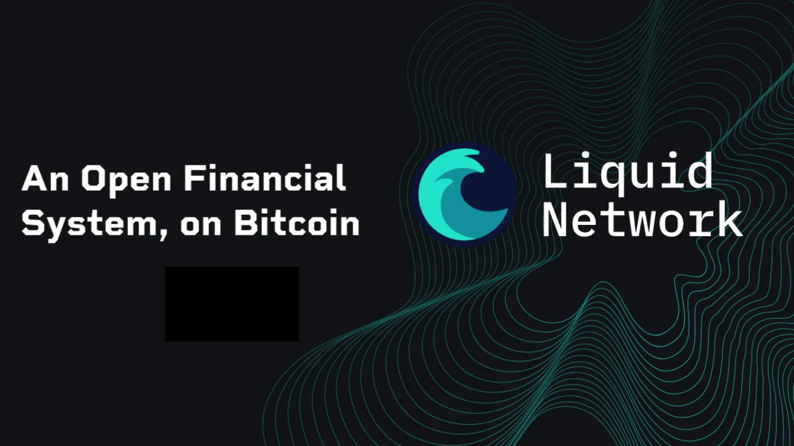

## 1.はじめに

### 1.1 チュートリアルの目的

- このチュートリアルでは、**Blockstream App** モバイル・アプリケーションを使用して、**Bitcoin Liquid** ポートフォリオ、つまりBitcoin "Liquid" サイド・チェーンに直接記録された取引を管理する方法について説明します。
- インストール、初期設定、Software Wallet の作成、Liquid でのビットコインの送受信操作について解説しています。
- 注：付録の他のチュートリアルでは、Onchain、Watch-Only、デスクトップ版について説明しています。

### 1.2 対象読者

- 初心者**の方：Liquid Networkを統合した直感的なモバイルアプリケーションでビットコインを管理したいユーザー。
- 中級者**：オンチェーンの機能や、TorやSPVなどのプライバシーオプションを理解しようとしている人。

### 1.3 Liquidの紹介

**Liquid**は、**[Blockstream](https://blockstream.com/Liquid/)**によって開発されたBitcoinの**Sidechain**であり、メインのBlockchain Bitcoinに接続されたまま、より高速で、よりConfidential Transactionsと高度な機能を提供するように設計されている。

Sidechainは、Bitcoinと並行して動作する独立したBlockchainであり、**ツーウェイ・ペグ**として知られるメカニズムを使用します。このシステムは、ビットコインをメインのBlockchainにロックして、**Liquid-ビットコイン（L-BTC）**、つまり、元のビットコインとの価値の平価を保ちながらLiquid Network上で流通するトークンを作ります。資金はいつでもBlockchain Bitcoinに戻すことができます。

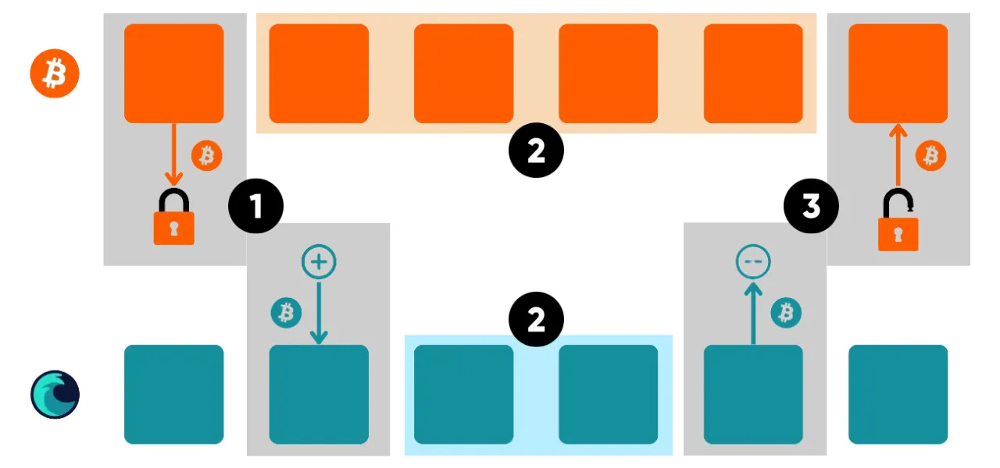

- (1) ペグイン**：ビットコイン（BTC）はLiquid連盟によってメインのBlockchainにロックされる。その見返りとして、2つのチェーン間のパリティを保証する同量のLiquidビットコイン（L-BTC）がBlockchain Liquidで発行され、ユーザーに送られる。

- (2) 独立トランザクション** ：Blockchain(BTC)とSidechain Liquid(L-BTC)で、ユーザーの要求に応じて、同時に独立したトランザクションを実行することができます。

- (3) ペグアウト**．ユーザーはLiquidビットコイン（L-BTC）をLiquidフェデレーションに送り返す。連盟はBlockchainのビットコイン(BTC)をアンロックし、ユーザーに送金する。

Liquidは、ブロック検証とバイラテラル・アンカーリングを管理する信頼できる参加者（取引所、Bitcoinに認定された企業）の**連合**に依存しています。分散型でマイナーに依存するBlockchain Bitcoinとは異なり、Liquidは**連合**ネットワークであり、そのセキュリティとガバナンスはこれらの参加者に依存することを意味する。これは、分散化の妥協を意味するが、最適化されたパフォーマンスと高度な機能を可能にする。

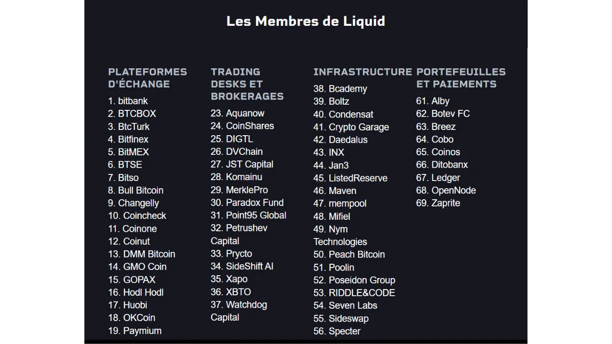

##### なぜLiquidを使うのか？

- スピード**：Liquid上の取引は、バリデータの連合によって毎分ごとに生成されるブロックのおかげで、オンチェーン取引では10分以上かかるのに対し、**1分**程度で確認される。
- 機密性の向上**：Liquidは**Confidential Transactions**を使用し、譲渡された資産の量と種類を隠すことで、取引をよりプライベートなものにします（ただし、アドレスは表示されたままです）。
- 低手数料** ：Liquidでの取引は一般的に手数料が安いので、頻繁な送金や少額の送金に最適です。
- 複数の資産**：L-BTCに加え、Liquidは、特定のアプリケーションで使用するためのステーブルコインやトークンなど、他のデジタル資産の発行をサポートしています。
- 使用例**：Liquidは、Bitcoinのセキュリティとリンクしたまま、クロスプラットフォームの取引所、高速決済、スマートコントラクトを必要とするアプリケーションに特に適している。

**注：このチュートリアルでは、Blockstream アプリ経由で Liquid を使用することに重点を置いています。Liquid Networkの詳細については、付録のリソースを参照してください。

### 1.4.Hot Wallet リマインダー

- Hot Wallet**、***Software Wallet**、***Wallet mobile**、***Software Wallet**：スマートフォン、コンピュータ、またはインターネットに接続されたあらゆるデバイスにインストールされるアプリケーションの名称。
- Coldウォレット**としても知られる**ハードウェアウォレット**とは異なり、ソフトウェアウォレットはオフラインでキーを隔離するため、サイバー攻撃に対してより脆弱である。

- 推奨用途** ：
    - 中程度の量のBitcoinの管理、特に日常的な取引に最適。
    - Hardware Walletが不要と思われる初心者や資産の少ないユーザーに適している。

- 制限**：大口資金や長期貯蓄の保管には安全性が低い。この場合はHardware Walletを選択する。

## 2.ブロックストリームアプリのご紹介

- Blockstream App**は、BitcoinウォレットとLiquid Network上の資産を管理するためのモバイル（iOS、Android）およびデスクトップアプリケーションです。2016年に[Blockstream](https://blockstream.com/)に買収され、以前は*Green Address*、その後*Blockstream Green*という名称でした。
- 主な特徴** ：
    - Blockchain Bitcoinでのオンチェーン**取引。
    - Liquid**ネットワークでの取引（Sidechainは高速で機密性の高い取引）。
    - ウォッチ・オンリー**のポートフォリオは、キーにアクセスすることなくファンドを監視するためのものです。
    - プライバシーオプション：**Tor**経由の接続、Electrum経由の**パーソナルノード**への接続、サードパーティノードへの依存を減らすための**SPV**検証。
    - Replace-by-fee(RBF)**の機能により、未確認トランザクションを高速化。
- 互換性**：Blockstream Jade**などのハードウェア・ウォレットを統合。
- Interface**：初心者のための直感的な操作と、上級者のための高度なオプション。
- 注**：このガイドはオンチェインの使用に焦点を当てています。付録の他のチュートリアルでは、Onchain、Watch-Only、デスクトップ版について説明しています。

## 3.Blockstream アプリのインストールと設定

### 3.1.ダウンロード

- アンドロイド用** ：
    - Google Playストアから[Blockstream App](https://play.google.com/store/apps/details?id=com.greenaddress.greenbits_android_wallet)をダウンロードしてください。
    - 別の方法Blockstreamの公式GitHub](https://github.com/Blockstream/green_android)にあるAPKファイルからインストールする。
- iOSの場合** ：
    - App Storeから[Blockstream App](https://apps.apple.com/us/app/Green-Bitcoin-Wallet/id1402243590)をダウンロードしてください。
- 注意**：不正なアプリケーションを避けるため、必ず公式ソースからダウンロードしてください。

### 3.2. 初期設定

- ホーム画面最初に開くと、Wallet が設定されていない画面が表示されます。作成またはインポートされたポートフォリオは後でここに表示されます。

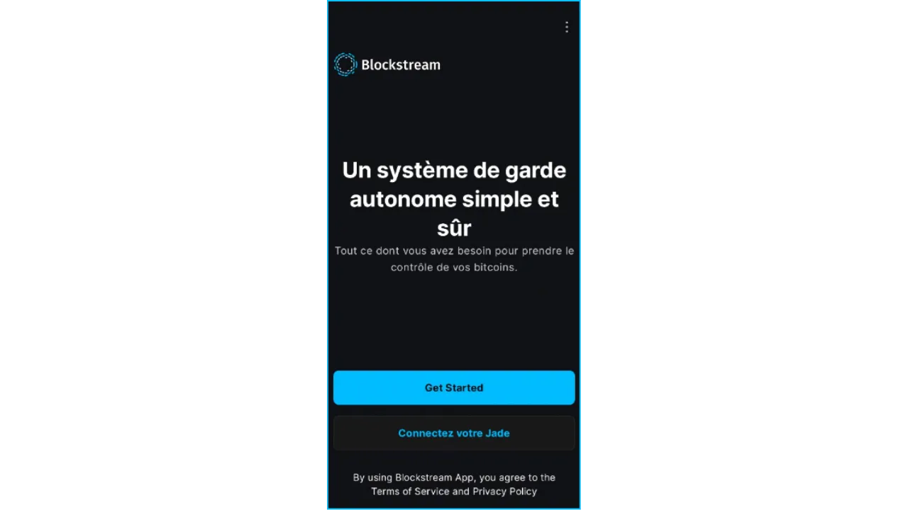

- 設定のカスタマイズアプリケーション設定 "をクリックし、以下のオプションを調整し、"保存 "をクリックしてアプリケーションを再起動し、ポートフォリオを作成します。

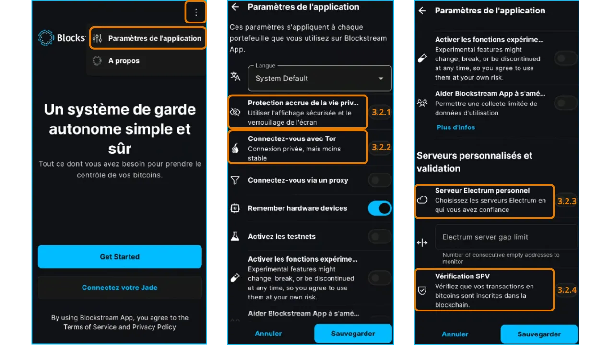

#### 3.2.1.プライバシーの強化（Androidのみ）

- 機能**：スクリーンショットを無効にし、タスクマネージャーでアプリケーションのプレビューを非表示にし、電話がロックされているときにアクセスをロックします。
- なぜですか？不正な物理的アクセスや画面キャプチャ型マルウェアからデータを保護します。

#### 3.2.2.Tor経由の接続

- 機能**：接続を暗号化する匿名ネットワーク、**Tor**を介してネットワークトラフィックをルーティングします。
- なぜですか？あなたのIP Addressを隠し、プライバシーを保護します。ネットワークが信頼できない場合（公共のWi-Fiなど）に最適です。
- デメリット**：暗号化によりアプリケーションの動作が遅くなる可能性があります。
- 推奨**：機密保持を優先する場合はTorを有効にし、接続速度をテストすること。

#### 3.2.3.パーソナル・ノードへの接続

- 機能**：アプリケーションを**Electrumサーバー**経由で**完全なBitcoinノード**に接続します。
- その理由Blockchainのデータを完全にコントロールし、Blockstreamサーバーへの依存を排除します。
- 前提条件**：設定済みのBitcoinノード。
- 推奨**：最大限の主権を求める上級ユーザー。

#### 3.2.4.SPVの検証

- 機能**：簡易支払い検証（SPV）**を使用し、チェーン全体をダウンロードすることなく、特定のBlockchainデータを直接検証する。
- なぜか？Blockstreamのデフォルト・ノードへの依存を減らしつつ、モバイル・デバイス向けに軽量化を実現。
- 欠点**：情報の一部をサードパーティ・ノードに依存するため、Full nodeよりも安全性が低い。
- 推奨**：パーソナル・ノードは使えないが、最適なセキュリティのためにFull nodeを使いたい場合はSPVをアクティブにする。

## 4.Bitcoinオンチェーン・ポートフォリオの作成

### 4.1.作成開始

- 注意**：カメラや監視者のいないプライベートな環境でポートフォリオをセットアップしてください。
- ホーム画面から「Get Started」をクリック：

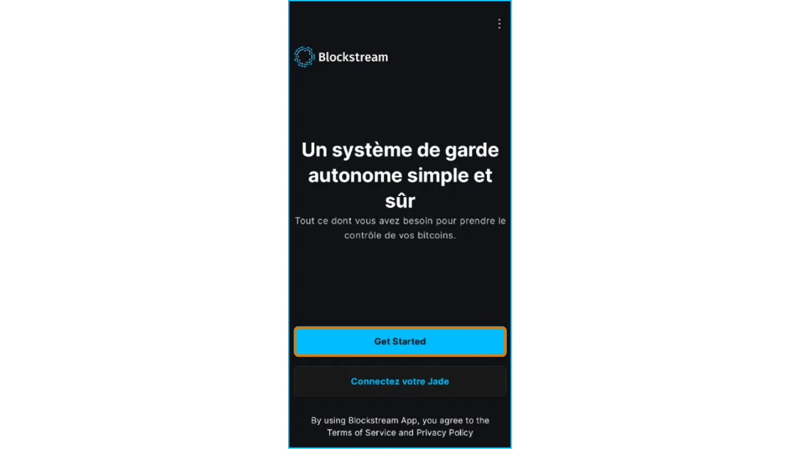

- Cold Wallet**（オフラインWallet）を管理したい場合：Hardware Wallet Blockstream Jadeまたは他の互換性のあるColdウォレットを使用するには、**"Connect Jade "**をクリックしてください。

- 次の画面が表示される：

- (1) **「モバイル Wallet のセットアップ」** ：Hot Wallet）を新規作成します。
- (2) **「バックアップからのリストア」**：Mnemonicフレーズ（12語または24語）を使用して既存のポートフォリオをインポートします。警告Cold Wallet からフレーズをインポートしないでください。接続されたデバイスでフレーズが公開され、セキュリティが無効になります。
- (3) **"Watch-Only "**：既存の読み取り専用ポートフォリオをインポートし、Mnemonic のフレーズを表示せずに残高（例：Cold Wallet）を表示します。付録の "Watch Only "チュートリアルを参照。

**このチュートリアルでは**：Setup Mobile Wallet"**をクリックし、Hot Walletを作成します。

あなたのWalletが自動的に作成され、Walletのホームページ（ここでは「My Wallet 5」と呼びます）が表示されます：

**重要**：ブロックストリーム・アプリは、seedの12語句を自動的に表示しないことで、Walletの作成を簡素化しました。 *ワンクリックでポートフォリオが作成されるようになったとはいえ、seedフレーズ*を保存しないと、資金へのアクセスを失うリスクがあります。

### 4.2.seedフレーズを保存

- Walletのホーム画面で "Security "タブをクリックし、"Back Up "プロンプトまたは "Recovery Phrase "メニューをクリックします：

seed 12語のフレーズが表示されますので、保存してください。

- リカバリーのフレーズを細心の注意を払って書き留める。紙や金属に書き留め、安全な場所（オフラインの安全な場所）に保管してください。このフレーズは、デバイスの紛失やアプリケーションの削除の際に、ビットコインにアクセスする唯一の手段となります。
- また、このフレーズを使っている人なら誰でも、あなたのビットコインをすべて盗むことができるという点にも注意が必要です。決してデジタルに保存しないでください：
 - スクリーンショットなし
 - クラウド、電子メール、メッセージングバックアップなし
 - コピー／ペーストができない（クリップボードに保存される危険性がある）

**!このポイントは重要です**。バックアップの詳細については：

https://planb.network/tutorials/wallet/backup/backup-mnemonic-22c0ddfa-fb9f-4e3a-96f9-46e2a7954270

https://planb.network/courses/46b0ced2-9028-4a61-8fbc-3b005ee8d70f

### 4.3.seedの文章をチェック

このseedフレーズに関連するAddressに資金を送る前に、12ワードのバックアップをテストしなければならない。

そのために、リファレンスを書き留め、Walletを削除し、バックアップでリストアし、リファレンスが変更されていないことをチェックする。

- Walletのホーム画面で、「設定」タブをクリックし、「Walletの詳細」をクリックし、zPub（[拡張公開鍵](https://planb.network/courses/46b0ced2-9028-4a61-8fbc-3b005ee8d70f)）をコピーする：

注：zpub Addressは、"Watch Only "機能のためにBlockstreamアプリケーションにインポートすることができます（付録を参照）。

- アプリケーションを削除し、Mnemonicのフレーズを入力して**"Restore from Backup "**からWalletを復元し、zpubが変更されていないことを確認してください。もしそうなら、バックアップは正しいので、Walletに資金を送ることができます。

- リカバリーテストの実施方法については、専用のチュートリアルをご覧ください：

https://planb.network/tutorials/wallet/backup/recovery-test-5a75db51-a6a1-4338-a02a-164a8d91b895

### 4.4.アプリケーションへのアクセスの確保

アプリケーションへのアクセスを強力なPINコードでロックします：

- Walletのホーム画面から**"Security "**に進み、**"PIN "**をクリックする。
- ランダムな6桁のPINコード**を入力し、確認してください。

**生体認証オプション**：利便性を高めるために利用できるが、堅牢なPINコードより安全性は低い（不正アクセスのリスク、例えば睡眠中の指紋や顔のスキャン）。

**注**：PINはデバイスを保護しますが、seedフレーズのみが資金回収に使用できます。

## 5.Liquidを使う Wallet

### 5.1.L-BTC」ビットコインを受け取る

Liquid-ビットコイン（L-BTC）を受け取るには、いくつかの方法があります。Addressを受け取るLiquidを共有することで、誰かに直接送ってもらうことができます。

あるいは、Exchangeであなたのビットコインをオンチェーン、または[Boltzのようなブリッジ](https://boltz.Exchange/)を使用してL-BTCのLightning Networkを経由します。Addressを受け取るLiquidを入力し、お好みの方法で支払いを行い、L-BTCを受け取ります。

- ポートフォリオのホーム画面から「**Transact**」をクリックし、次に「**"Receive "**」をクリックする。

- デフォルトでは、空白の**レシートAddress, onchain** (SegWit v0フォーマット、`bc1q...`で始まる)が表示されます。Bitcoin" をクリックして、**Liquid Bitcoin** を選択してください：

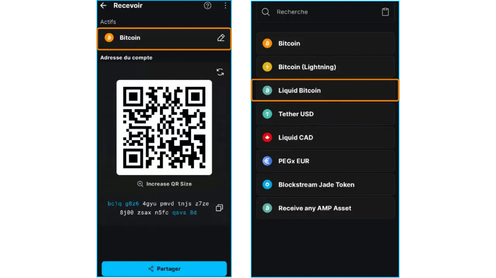

- オプション** ：
 - (1) 矢印をクリックして、このseedの文章にリンクしている別の新しいAddressを選択します。
    - (2) 右上の3つの点をクリックし、"List of Addresses "をクリックすることで、すでに使用／表示されているAddressの中から選択することもできます。
    - (3) 金額を指定して請求する場合は、右上の3つの点をクリックして「Request amount」を選択し、希望する金額を入力する。QRが更新され、AddressがBitcoinの支払URIに変わります。

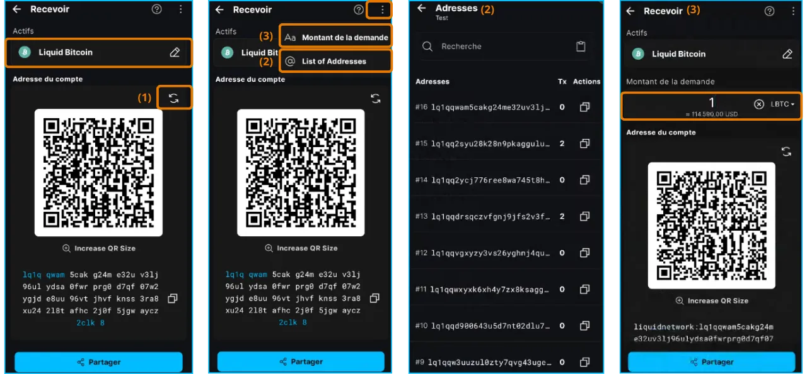

- Address/URIを共有するには、"**共有**"をクリックするか、テキストをコピーするか、QRコードをスキャンしてください。
- 検証**：受信者と共有されたAddressを可能な限り確認し、エラーや攻撃（マルウェアによるクリップボードの変更など）を回避する。

### 5.2. ビットコインを送る

- ポートフォリオのホーム画面から、"**Transact**"をクリックし、次に**"Send "**をクリックします：

- 詳細を入力** ：
    - (1) 受取人**の**Addressを貼り付けるか、QRコードをスキャンして入力する。
    - (2) 送金元の資産と口座を確認する。
    - (3) 送信する**金額を指定します。単位を選択できます：L-BTC、L-satoshis、USD、...

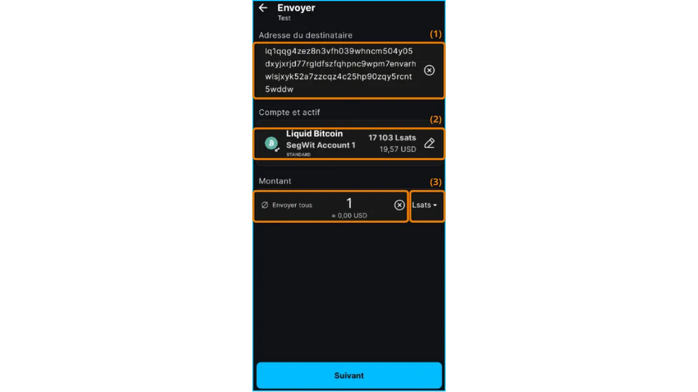

- チェック** ：
    - サマリー画面でAddress、金額、料金を確認する。
    - Addressのエラーは、取り返しのつかない損失をもたらす可能性がある。クリップボードを改ざんするマルウェアにご注意ください。

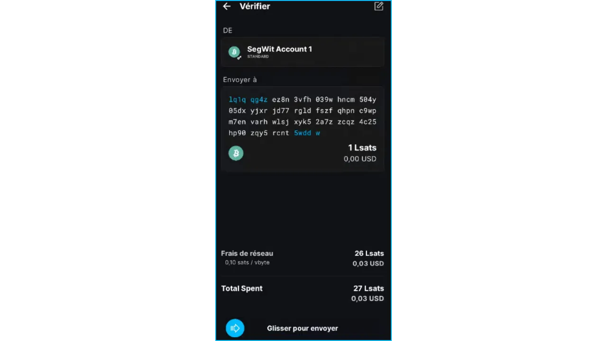

- 確認**：送信 "ボタンをスライドさせ、取引に署名し配布する。
- フォローアップ**：Walletの "Transact "タブでは、取引は "Unconfirmed"、"Confirmed"、"Completed "の順に表示される：

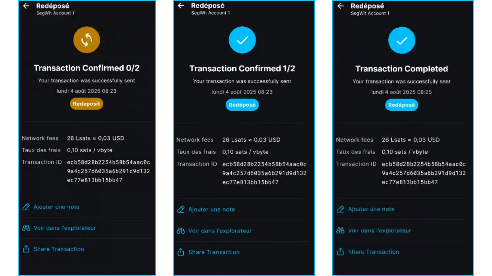

- Liquidでは2ブロック間の時間は1分なので、取引はすぐに確認され完了する。

## 付録

### A1.その他のBlockstreamアプリのチュートリアル

Onchainネットワークの利用

https://planb.network/tutorials/wallet/mobile/blockstream-app-onchain-e84edaa9-fb65-48c1-a357-8a5f27996143

ウォッチ・オンリー」モードでのWalletのインポートとトラッキング

https://planb.network/tutorials/wallet/mobile/blockstream-app-watch-only-66c3bc5a-5fa1-40ef-9998-6d6f7f2810fb

デスクトップ版

https://planb.network/tutorials/wallet/desktop/blockstream-app-desktop-c1503adf-1404-4328-b814-aa97fcf0d5da

### A2.ベストプラクティス

ブロックストリームアプリ**を安全かつ効率的に使用するには、以下の推奨事項に従ってください。これらの推奨事項は、**Bitcoin (onchain)**、**Liquid**、**Lightning** ネットワーク上で資金を保護し、取引を最適化し、機密性を保持するのに役立ちます。

- リカバリーフレーズの確保** ：
 - チュートリアルMnemonicフレーズの保存

https://planb.network/tutorials/wallet/backup/backup-mnemonic-22c0ddfa-fb9f-4e3a-96f9-46e2a7954270

https://planb.network/courses/46b0ced2-9028-4a61-8fbc-3b005ee8d70f

- 安全な認証を使用する** ：
 - アプリケーションへのアクセスを保護するために、**強力な暗証番号**または**生体認証**（指紋または顔認証）を有効にします。
 - 暗証番号や生体認証データは絶対に共有しないでください。

- プライバシーの保護** ：
 - generateはオンチェーン受信のたびに新しいAddressを、LiquidはBlockchainのトレースを制限する。
 - プライバシー強化"、"Tor"、"SPV "機能を有効にする。
 - 最大限の機密性を確保するため、Walletはパブリックノードを使用せず、Electrumサーバーを経由して自分のBitcoinノードに接続してください。

- お客様のニーズに最適なネットワークをお選びください：
 - オンチェーン**：長期保管や大口取引に有利（手数料は金額に対してごくわずか）。
 - Liquid**：機密性を高めた高速、低コストの転送に使用。
 - ライトニング**：少額を即座に低コストで送金できます。

- 発送先住所は必ずご確認ください：
 - 送金する前に、Addressをよく確認してください。間違ったAddressに送金された資金は永遠に失われます。コピー・ペーストかQRコード・スキャンを使用し、決して手でAddressをコピー・修正しないでください。

- コストの最適化** ：
 - オンチェーン取引では、緊急度とネットワークの混雑度に応じて適切な手数料（低速、中速、高速）を選択する。
 - 少量の場合はLiquid、またはライトニングを使用する。

- アプリケーションを最新の状態に保つ

### A3.追加リソース

- 公式リンク
 - [公式サイト](https://blockstream.com/)**
 - [モバイルアプリケーションのサポート](https://help.blockstream.com/hc/en-us/categories/900000056183-Blockstream-Green/)** : ドキュメントとチャット
 - [GitHub](https://github.com/Blockstream/green_android)**

- ブロック・エクスプローラー
 - on chain ： **[Mempool.space](https://Mempool.space/)**
 - Liquid : **[ブロックストリーム情報](https://blockstream.info/Liquid)**
 - ライトニング **[1ML (Lightning Network)](https://1ml.com/)**

- 学習とチュートリアル:** **[Plan ₿ Network](https://planb.network/)** ：
 - 回復フレーズの確保

https://planb.network/tutorials/wallet/backup/backup-mnemonic-22c0ddfa-fb9f-4e3a-96f9-46e2a7954270

https://planb.network/courses/46b0ced2-9028-4a61-8fbc-3b005ee8d70f

- Liquid Network** ：
 - [用語集](https://planb.network/fr/resources/glossary/liquid-network)**

https://planb.network/courses/6d26bcff-51a3-405f-bcdd-9af8297ce727

- Lightning Network** ：
 - [用語集](https://planb.network/fr/resources/glossary/lightning-network)**

https://planb.network/courses/34bd43ef-6683-4a5c-b239-7cb1e40a4aeb
