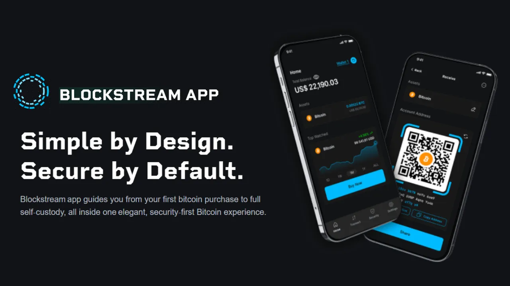

## 1. Johdanto

### 1.1 Tutoriaalin tavoite

- Tässä ohjeessa kerrotaan, miten **Blockstream App** -mobiilisovellusta käytetään Bitcoin:n **onchain** Wallet:n hallintaan, toisin sanoen suoraan pää-Blockchain Bitcoin:een tallennettujen tapahtumien hallintaan.
- Se kattaa asennuksen, alkukonfiguraation, Software Wallet:n luomisen sekä bitcoinien vastaanottamiseen ja lähettämiseen liittyvät toiminnot.
- Huomautus: Liitteissä olevat muut opetusohjelmat käsittelevät Liquid:ää, Watch-Only-ohjelmaa ja työpöytäversiota.

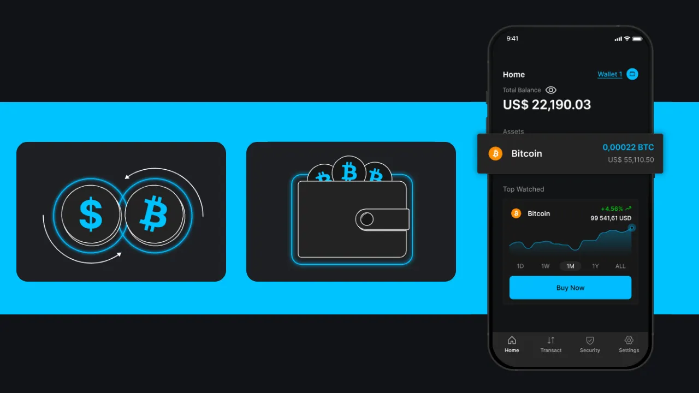

### 1.2 Kohderyhmä

- Aloittelijoille**: Käyttäjät, jotka haluavat hallita bitcoinejaan intuitiivisen mobiilisovelluksen avulla.
- Keskitason käyttäjät**: Ihmiset, jotka haluavat ymmärtää onchain-toimintoja ja yksityisyysvaihtoehtoja, kuten Tor tai SPV.

### 1.3. Muistutukset Hot-lompakoista

- Hot Wallet**, **Software Wallet**, **Wallet mobile**, **Software Wallet**: kaikki nimitykset älypuhelimeen, tietokoneeseen tai mihin tahansa Internet-yhteydellä varustettuun laitteeseen asennetulle sovellukselle, jonka avulla Bitcoin Wallet:n yksityisiä avaimia voidaan hallita ja suojata.
- Toisin kuin **hardwarelompakot**, jotka tunnetaan myös nimellä **Cold-lompakot** ja jotka eristävät avaimet offline-tilassa, ohjelmistolompakot toimivat verkottuneessa ympäristössä, mikä tekee niistä haavoittuvampia tietoverkkohyökkäyksille.

- Suositeltu käyttö** :
    - Ihanteellinen kohtalaisten Bitcoin-määrien hallintaan, erityisesti päivittäisissä liiketoimissa.
    - Sopii aloittelijoille tai käyttäjille, joilla on vain vähän varoja ja joille Hardware Wallet voi tuntua tarpeettomalta.

- Rajoitukset**: Vähemmän turvallinen suurten varojen tai pitkäaikaisten säästöjen säilyttämiseen. Valitse tässä tapauksessa Hardware Wallet.

## 2. Esittelyssä Blockstream App

- Blockstream App** on mobiili- (iOS, Android) ja työpöytäsovellus Bitcoin-salkkujen ja Liquid Network-varojen hallintaan. [Blockstream] (https://blockstream.com/) osti sen vuonna 2016, ja se oli aiemmin nimeltään *Green Address* ja sitten *Blockstream Green*.
- Tärkeimmät ominaisuudet** :
    - Onchain**-tapahtumat Blockchain:ssä Bitcoin:ssä.
    - Verkkotapahtumat **Liquid** (Sidechain nopeaan, luottamukselliseen viestinvaihtoon).
    - Watch-only** -salkut rahastojen seurantaan ilman pääsyä avaimiin.
    - Tietosuojavaihtoehdot: yhteys **Torin** kautta, yhteys **persoonalliseen solmuun** Electrumin kautta tai **SPV**-varmistus, jolla vähennetään riippuvuutta kolmannen osapuolen solmuista.
    - Toiminnot **Replace-by-fee (RBF)** vahvistamattomien tapahtumien nopeuttamiseksi.
- Yhteensopivuus**: **Blockstream Jade**.
- Interface**: Intuitiivinen aloittelijoille, edistyneet vaihtoehdot asiantuntijoille.
- Huomautus**: Tämä opas keskittyy ketjukäyttöön. Muut liitteissä olevat oppaat käsittelevät Liquid:ta, Watch-Only-ohjelmaa ja työpöytäversiota.

## 3. Blockstream-sovelluksen asentaminen ja määrittäminen

### 3.1. lataa

- Androidille** :
    - Lataa [Blockstream App](https://play.google.com/store/apps/details?id=com.greenaddress.greenbits_android_wallet) Google Play Storesta.
    - Vaihtoehto: Asenna APK-tiedoston kautta, joka on saatavilla [Blockstreamin virallisella GitHub-sivustolla](https://github.com/Blockstream/green_android).
- IOS** :
    - Lataa [Blockstream App](https://apps.apple.com/us/app/Green-Bitcoin-Wallet/id1402243590) App Storesta.
- Huomautus**: Varmista, että lataat virallisista lähteistä, jotta vältät vilpilliset sovellukset.

### 3.2. alkukonfigurointi

- Aloitusnäyttö**: Kun sovellus avataan ensimmäisen kerran, se näyttää näytön ilman määritettyä Wallet:tä. Luodut tai tuodut portfoliot näkyvät tässä myöhemmin.

- Mukauta asetuksia**: Napsauta "Sovelluksen asetukset", säädä alla olevia vaihtoehtoja, napsauta "Tallenna", käynnistä sovellus uudelleen ja luo portfoliosi.

#### 3.2.1. Parannettu yksityisyys (vain Android)

- Toiminto**: Toiminto: Poistaa kuvakaappaukset käytöstä, piilottaa sovellusten esikatselukuvat Tehtävienhallinnassa ja lukitsee pääsyn, kun puhelin on lukittu.
- Miksi?** : Suojaa tietosi luvattomalta fyysiseltä käytöltä tai näytön sieppaavilta haittaohjelmilta.

#### 3.2.2. Yhteys Torin kautta

- Toiminto**: Reititä verkkoliikenne **Tor**:n, anonyymin verkon kautta, joka salaa yhteydet.
- Miksi?**: Tämä on ihanteellista, jos et luota verkkoosi (esimerkiksi julkiseen Wi-Fi-verkkoon).
- Haitta**: Voi hidastaa sovellusta salauksen takia.
- Suositus**: Aktivoi Tor, jos luottamuksellisuus on etusijalla, mutta testaa yhteyden nopeus.

#### 3.2.3. Yhteyden muodostaminen henkilökohtaiseen solmuun

- Toiminto**: Yhdistää sovelluksen omaan **täydelliseen Bitcoin-solmuun** **Electrum**-palvelimen kautta.
- Miksi?**: Tarjoaa täydellisen hallinnan Blockchain-tietoihin ja poistaa riippuvuuden Blockstream-palvelimista.
- Edellytys**: Konfiguroitu Bitcoin-solmu.
- Suositus**: Edistyneet käyttäjät, jotka etsivät maksimaalista riippumattomuutta.

#### 3.2.4. SPV:n todentaminen

- Toiminto**: Käyttää **Simplified Payment Verification (SPV)** -toimintoa tiettyjen Blockchain:n tietojen suoraan tarkistamiseen lataamatta koko ketjua.
- Miksi?**: Vähentää riippuvuutta Blockstreamin oletussolmusta ja on samalla kevyt mobiililaitteille.
- Haitta**: Full node:ta turvattomampi, koska se on riippuvainen kolmansien osapuolten solmuista joidenkin tietojen saamiseksi.
- Suositus**: Aktivoi SPV, jos et voi käyttää henkilökohtaista solmua, mutta haluat Full node:n optimaalisen turvallisuuden vuoksi.

## 4. Bitcoin onchain-salkun luominen

### 4.1. Aloita luominen

- Varoitus**: Aseta salkku yksityiseen ympäristöön, jossa ei ole kameroita tai tarkkailijoita.
- Napsauta aloitusnäytöltä "Get Started" :

- Jos haluat hallita **Cold Wallet** (offline Wallet): napsauta **"Connect Jade "** käyttääksesi Hardware Wallet Blockstream Jadea tai muita yhteensopivia Cold-lompakoita.

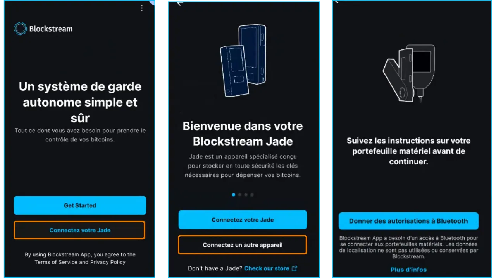

- Seuraava näyttö tulee näkyviin:

- (1) **"Setup Mobile Wallet"** : Luo uusi Hot Wallet (Hot Wallet).
- (2) **"Palauta varmuuskopiosta "**: Tuo olemassa oleva salkku käyttämällä Mnemonic-lauseen (12 tai 24 sanaa). Varoitus: Älä tuo Cold Wallet-lausetta, koska se paljastuu liitetyssä laitteessa, jolloin sen suojaus mitätöityy.
- (3) **"Vain tarkkailuun "**: Tuo olemassa oleva vain lukuoikeudellinen salkku, jotta voit tarkastella saldoa (esim. Cold Wallet) paljastamatta Mnemonic-lauseen tietoja. Katso Watch Only -opas liitteessä.

**Tässä opetusohjelmassa**: Klikkaa **"Setup Mobile Wallet"** luodaksesi Hot Wallet:n.

Wallet luodaan automaattisesti, ja Wallet:n etusivu, jonka nimi on tässä "Oma Wallet 5", tulee näkyviin:

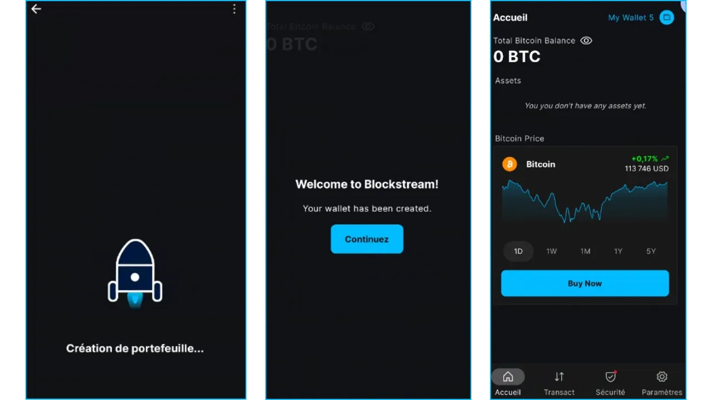

**Tärkeää**: Wallet:n luomista on yksinkertaistettu siten, että 12-sanaista seed-lausetta ei näytetä automaattisesti. *Vaikka salkku luodaan nyt yhdellä napsautuksella, vaarana on, että menetät pääsyn varoihisi, jos et tallenna seed-lausetta*.

### 4.2. Tallenna seed-lause

- Napsauta Wallet:n aloitusnäytössä välilehteä "Turvallisuus" ja sitten "Varmuuskopiointi"-kehotetta tai "Palautuslauseke"-valikkoa:

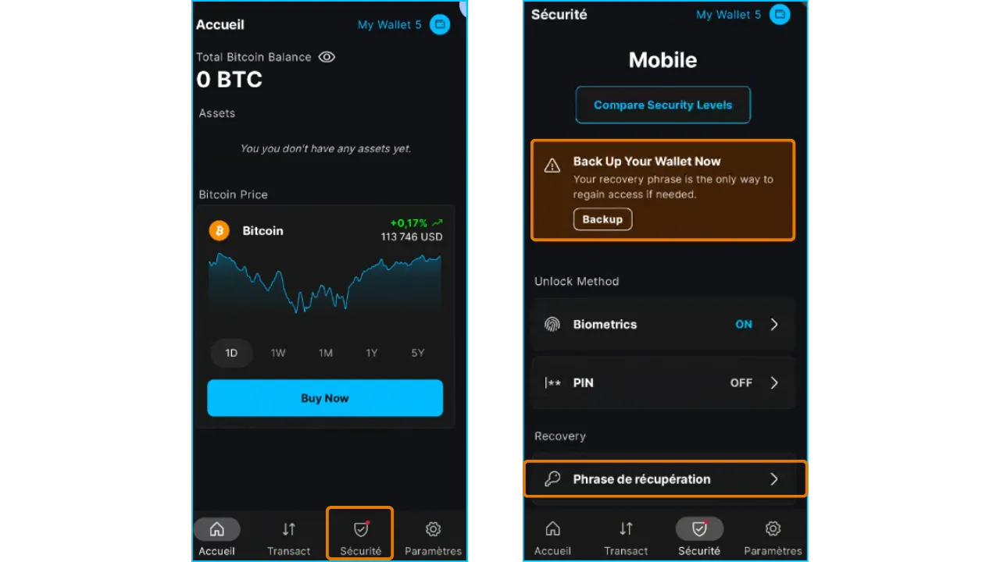

seed:n 12-sanainen lause tulee näyttöön tallennettavaksi.

- Kirjoita toipumislauseesi ylös äärimmäisen huolellisesti. Kirjoita se paperille tai metallille ja säilytä se turvallisessa paikassa (turvallinen, offline-sijainti). Tämä lauseke on ainoa keinosi päästä käsiksi bitcoineihisi, jos laitteesi katoaa tai sovellus poistetaan.
- On myös tärkeää huomata, että kuka tahansa, jolla on tämä lause, voi varastaa kaikki bitcoinisi. Älä koskaan säilytä niitä digitaalisesti:
 - Ei kuvakaappausta
 - Ei pilvi-, sähköposti- tai viestinvälityskopioita
 - Ei kopiointia/liittämistä (riski tallentaa leikepöydälle)

**! Tämä kohta on kriittinen**. Lisätietoja varmuuskopioinnista :

https://planb.network/tutorials/wallet/backup/backup-mnemonic-22c0ddfa-fb9f-4e3a-96f9-46e2a7954270

https://planb.network/courses/46b0ced2-9028-4a61-8fbc-3b005ee8d70f

### 4.3. Vahvista seed-lause

Ennen kuin lähetät varoja tähän seed-lauseeseen liittyvälle Address:lle, sinun on testattava 12 sanan varmuuskopiointi.

Tätä varten kirjoitamme viitteen, poistamme Wallet:n, palautamme sen varmuuskopion avulla ja tarkistamme, että viite ei ole muuttunut.

- Napsauta Wallet:n aloitusnäytössä "Asetukset"-välilehteä, sitten "Wallet Details" ja kopioi zPub ([extended public key](https://planb.network/courses/46b0ced2-9028-4a61-8fbc-3b005ee8d70f/8dcffce1-31bd-5e0b-965b-735f5f9e4602):

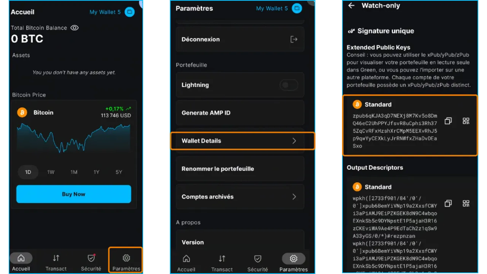

Huomautus: zpub Address voidaan tuoda Blockstream-sovellukseen "Watch Only" -toimintoa varten (katso liite).

- Poista sovellus, palauta Wallet sitten **"Restore from Backup "** -ohjelmalla syöttämällä Mnemonic-lause ja tarkista, että zpub ei ole muuttunut. Jos vastaus on kyllä, varmuuskopio on oikea, ja voit lähettää varoja Wallet:een.

- Jos haluat lisätietoja palautustestin suorittamisesta, tässä on oma opetusohjelma :

https://planb.network/tutorials/wallet/backup/recovery-test-5a75db51-a6a1-4338-a02a-164a8d91b895

### 4.5. Sovelluksen käytön varmistaminen

Lukitse sovelluksen käyttöoikeus vahvalla PIN-koodilla:

- Siirry Wallet:n aloitusnäytöltä kohtaan **"Turvallisuus "** ja napsauta sitten **"PIN "**
- Syötä ja vahvista **sattumanvarainen 6-numeroinen PIN-koodi**.

**Biometrinen vaihtoehto**: Käytettävissä lisämukavuuden lisäämiseksi, mutta vähemmän turvallinen kuin vankka PIN-koodi (luvattoman pääsyn riski, esim. sormenjälki- tai kasvoskannaus unen aikana).

**Huomautus**: PIN-koodi suojaa laitteen, mutta vain seed-lausetta voidaan käyttää varojen noutamiseen.

## 5. Onchain Wallet:n käyttö

### 5.1. Vastaanota bitcoineja

- Napsauta salkun aloitusnäytöltä "**Transaktio**" ja sitten **"Vastaanota "**.

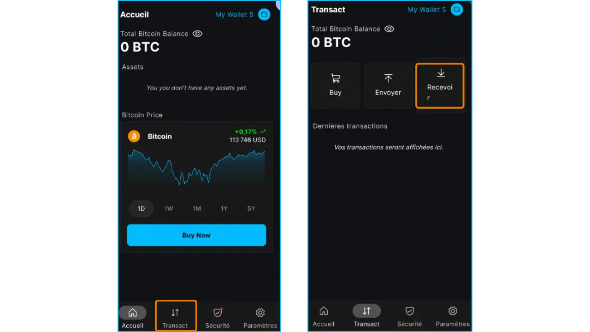

- Sovellus näyttää **tyhjän vastaanoton Address** (SegWit v0 -muoto, joka alkaa kirjaimella `bc1q...`). Uuden Address:n käyttäminen joka kerta, kun vastaanotat Bitcoin:n, parantaa luottamuksellisuutta.

- Vaihtoehdot** :
    - (1) "Bitcoin": valitse ketjussa oleva tai Liquid-lähetys napsauttamalla sitä ja valitse omaisuuserä.
    - (2) Napsauta nuolia valitaksesi toisen uuden Address:n, joka liittyy tähän seed-lauseeseen.
    - (3) Voit myös valita Address:n jo käytetyistä/näytetyistä osoitteista napsauttamalla kolmea pistettä oikeassa yläkulmassa ja sitten "Osoiteluettelo"
    - (4) Jos haluat pyytää tietyn summan, napsauta kolmea pistettä oikeassa yläkulmassa, valitse "Pyydä summa" ja syötä haluamasi summa. QR päivittyy, ja Address korvataan Bitcoin-maksun URI:llä.

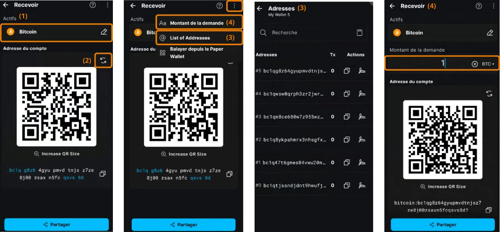

- Jaa Address/URI klikkaamalla "**Jaa**", kopioimalla teksti tai skannaamalla QR-koodi.
- Tarkastus**: Tarkista vastaanottajan kanssa jaettu Address niin pitkälle kuin mahdollista virheiden tai hyökkäysten välttämiseksi (esim. leikepöydän muokkaaminen haittaohjelmilla).

### 5.2. lähetä bitcoineja

- Napsauta salkun aloitusnäytöltä "**Transaktio**" ja sitten **"Lähetä "** :

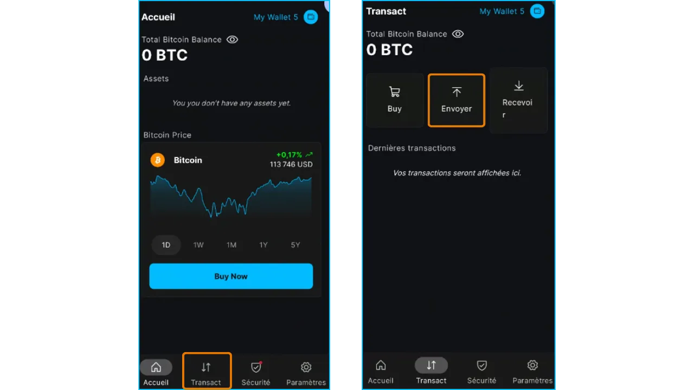

- Anna tiedot** :
    - (1) Syötä **vastaanottajan **Address-tunnus** kiinnittämällä se tai skannaamalla QR-koodi.
    - (2) Tarkista varat ja tili, jolta varat lähetetään.
    - (3) Ilmoita lähetettävä **määrä**. Voit valita yksikön: BTC, satoshis, USD, ...

Vähimmäismäärä (dush-raja) 03/08/2025 on 546 Sats.

    - (4) Valitse **transaktiomaksut** :
        - Valitse ehdotetuista vaihtoehdoista (esim. nopea, keskipitkänopea, hidas) kiireellisyyden mukaan, ja likimääräinen siirtoaika näytetään.
        - Jos haluat mukautettuja maksuja, säädä manuaalisesti Satoshi:n määrää vbytejä kohti (katso markkinahinnat kohdasta [Mempool.space](https://Mempool.space/)).

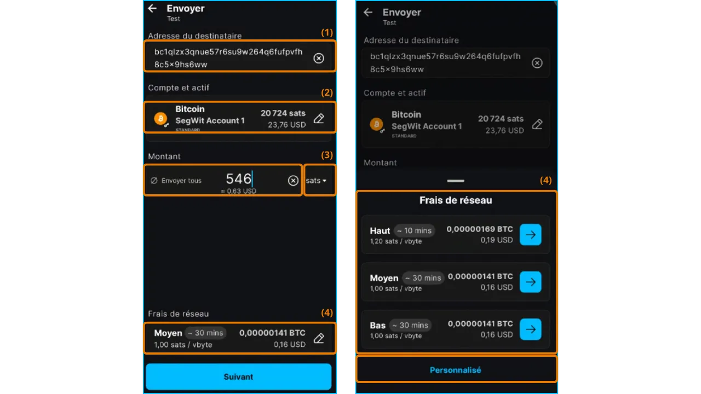

- Tarkista** :
    - Tarkista Address, määrä ja maksut yhteenvetonäytöltä.
    - Address-virhe voi johtaa peruuttamattomaan varojen menetykseen. Varo leikepöytää muokkaavia haittaohjelmia.

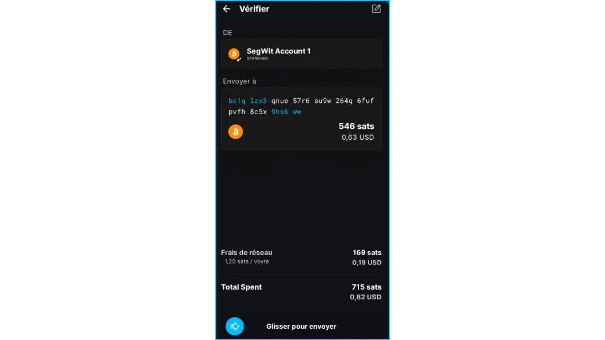

- Vahvistus**: Lähetä-painiketta painamalla voit allekirjoittaa ja jakaa tapahtuman.
- Seuranta**: Wallet:n "Transact"-välilehdellä tapahtuma näkyy "vireillä", kunnes se vahvistetaan (1-6 vahvistusta):

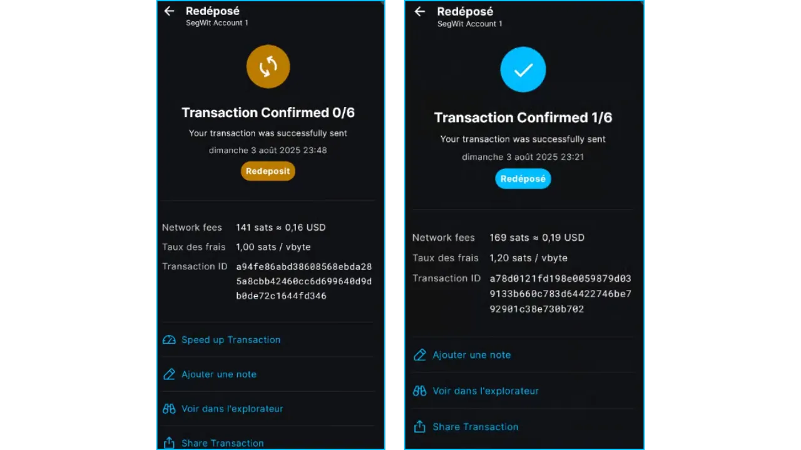

- Niin kauan kuin maksutapahtumaa ei ole vahvistettu, "Replace by fee"-toiminnolla (ks. liite) voit nopeuttaa sen käsittelyä korottamalla maksutapahtumamaksuja:

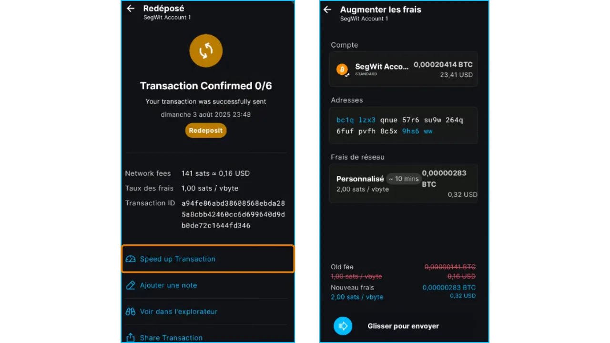

## Liitteet

### A1. Muut Blockstreamin opetusohjelmat

Liquid Network:n käyttö

https://planb.network/tutorials/wallet/mobile/blockstream-app-liquid-b3e4fb82-902e-4782-ad2b-a61ab05a543a

Wallet:n tuominen ja seuranta "Watch Only" -tilassa

https://planb.network/tutorials/wallet/mobile/blockstream-app-watch-only-66c3bc5a-5fa1-40ef-9998-6d6f7f2810fb

Desktop-versio

https://planb.network/tutorials/wallet/desktop/blockstream-app-desktop-c1503adf-1404-4328-b814-aa97fcf0d5da

### A2. Replace-by-fee:n selitys (RBF)

**Määritelmä**: Replace-by-fee (RBF) on Bitcoin-verkon ominaisuus, jonka avulla lähettäjä voi nopeuttaa **ketjussa tapahtuvan** tapahtuman vahvistamista suostumalla maksamaan korkeamman maksun.

**Rajat** :

- RBF ei ole käytettävissä Liquid- tai Lightning-tapahtumissa.
- Alkuperäinen transaktio on merkittävä RBF-yhteensopivaksi, kun se luodaan, minkä Blockstream App tekee automaattisesti.

**Lisätietoa:**

- [Sanasto](https://planb.network/fr/resources/glossary/rbf-replacebyfee)

### A3. Parhaat käytännöt

Jos haluat käyttää **Blockstream-sovellusta** turvallisesti ja tehokkaasti, noudata seuraavia suosituksia. Ne auttavat sinua suojaamaan varojasi, optimoimaan tapahtumasi ja säilyttämään luottamuksellisuutesi **Bitcoin (onchain)**-, **Liquid**- ja **Lightning**-verkoissa.

- Turvaa palautuslausekkeesi** :
 - Tutorial: Mnemonic-lauseen tallentaminen

https://planb.network/tutorials/wallet/backup/backup-mnemonic-22c0ddfa-fb9f-4e3a-96f9-46e2a7954270

https://planb.network/courses/46b0ced2-9028-4a61-8fbc-3b005ee8d70f

- Käytä suojattua todennusta** :
 - Ota käyttöön **vahva PIN-koodi** tai **biometrinen tunnistus** (sormenjälki tai kasvojentunnistus) sovelluksen käytön suojaamiseksi.
 - Älä koskaan jaa PIN-koodia tai biometrisiä tietoja.

- Suojaa yksityisyytesi** :
 - generate uusi Address jokaista onchain- tai Liquid-vastaanottoa varten Blockchain:n jäljittämisen rajoittamiseksi.
 - Aktivoi "Enhanced Privacy", "Tor" ja "SPV" -toiminnot.
 - Jos haluat maksimaalisen luottamuksellisuuden, yhdistä Wallet omaan Bitcoin-solmuun Electrum-palvelimen kautta sen sijaan, että käyttäisit julkista solmua

- Valitse tarpeisiisi parhaiten sopiva verkko** :
 - Onchain**: (palkkiot ovat vähäisiä suhteessa määrään).
 - Liquid**: Käytä nopeisiin, edullisiin siirtoihin, joissa on parempi luottamuksellisuus.
 - Salama**: Valitse välittömät, edulliset siirrot pienille summille.

- Tarkista aina toimitusosoitteet** :
 - Tarkista Address huolellisesti ennen varojen lähettämistä. Väärään Address:een lähetetyt varat menetetään lopullisesti. Käytä kopiointia/liittämistä tai QR-koodin skannausta, älä koskaan kopioi/muuta Address:tä käsin.

- Optimoi kustannukset** :
 - Valitse ketjutapahtumille sopivat maksut (hidas, keskitasoinen, nopea) kiireellisyyden ja verkon ruuhkautumisen mukaan.
 - Käytä Liquid:tä tai Lightningia pieniin määriin.

- Pidä hakemus ajan tasalla

### A4. Lisäresurssit

- Viralliset linkit:**
 - [Virallinen verkkosivusto](https://blockstream.com/)**
 - [Tuki mobiilisovellukselle](https://help.blockstream.com/hc/en-us/categories/900000056183-Blockstream-Green/)** : dokumentaatio ja chat
 - [GitHub](https://github.com/Blockstream/green_android)**

- Kortteleiden tutkijat :**
 - on chain : **[Mempool.space](https://Mempool.space/)**
 - Liquid : **[Blockstream Info](https://blockstream.info/Liquid)**
 - Salama: **[1ML (Lightning Network)](https://1ml.com/)**

- Oppiminen ja opetusohjelmat:** **[Plan ₿ Network](https://planb.network/)** :
 - Elvytyslausekkeen turvaaminen

https://planb.network/tutorials/wallet/backup/backup-mnemonic-22c0ddfa-fb9f-4e3a-96f9-46e2a7954270

https://planb.network/courses/46b0ced2-9028-4a61-8fbc-3b005ee8d70f

- Liquid Network** :
 - [Sanasto](https://planb.network/fr/resources/glossary/liquid-network)**

https://planb.network/courses/6d26bcff-51a3-405f-bcdd-9af8297ce727

- Lightning Network** :
 - [Sanasto](https://planb.network/fr/resources/glossary/lightning-network)**

https://planb.network/courses/34bd43ef-6683-4a5c-b239-7cb1e40a4aeb