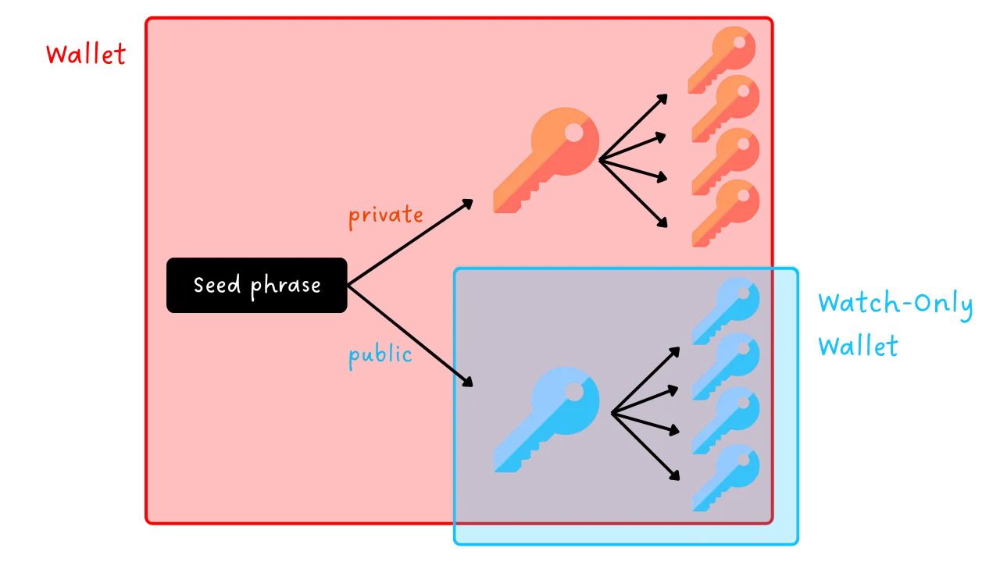
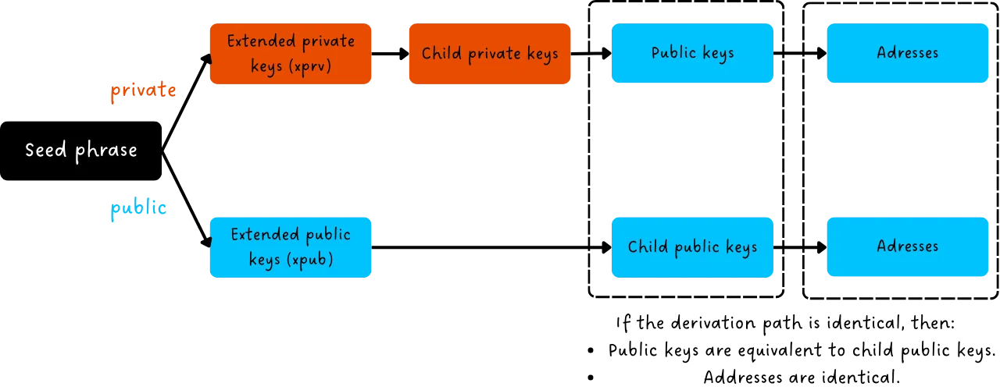
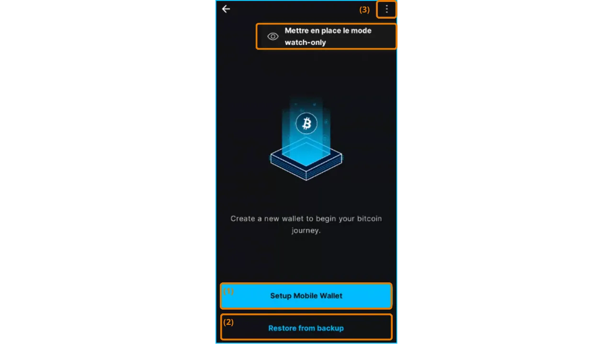
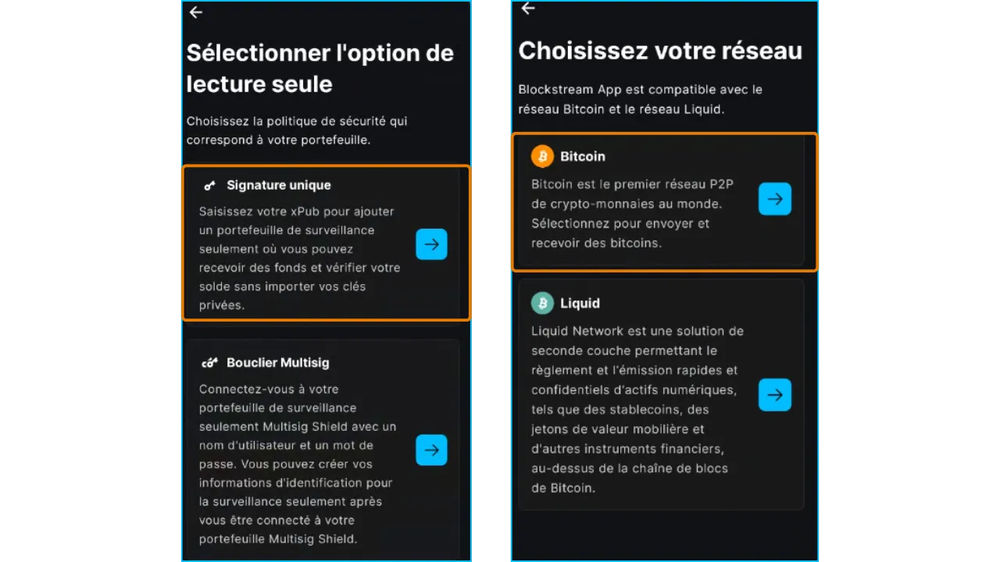
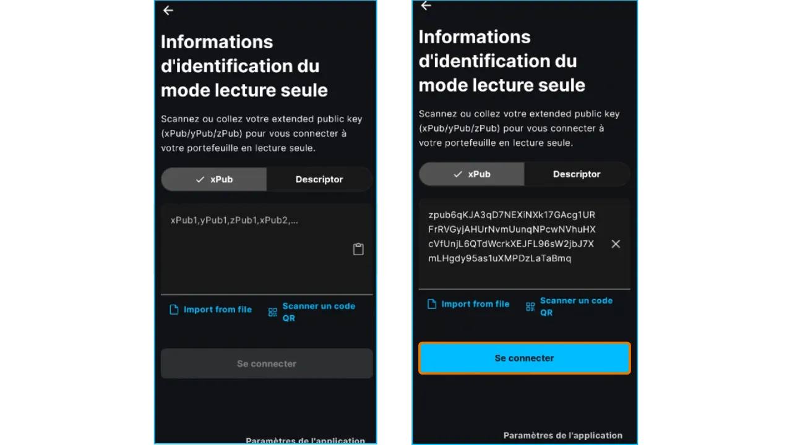
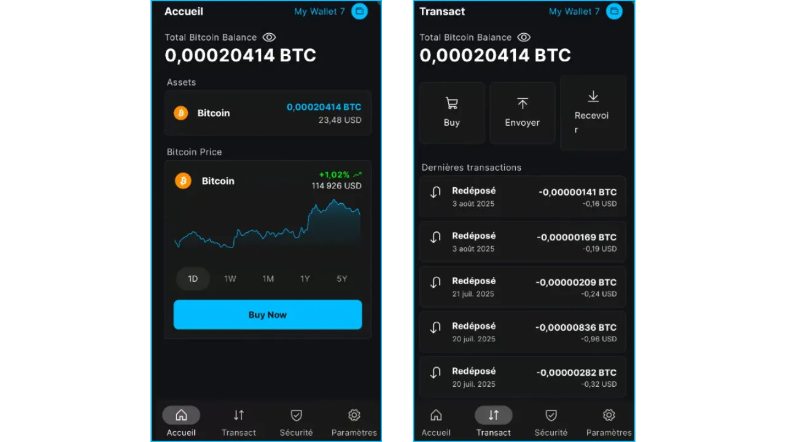
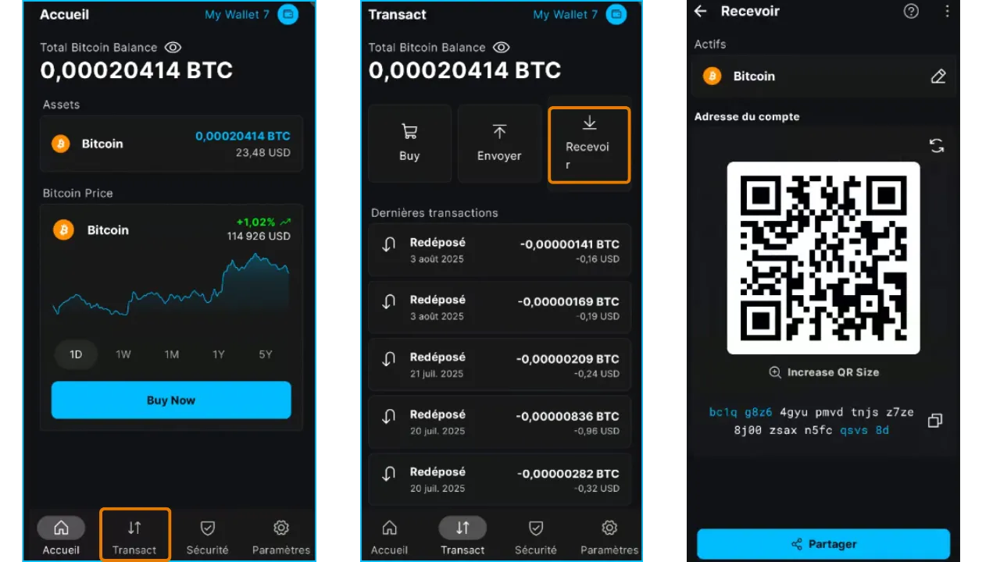
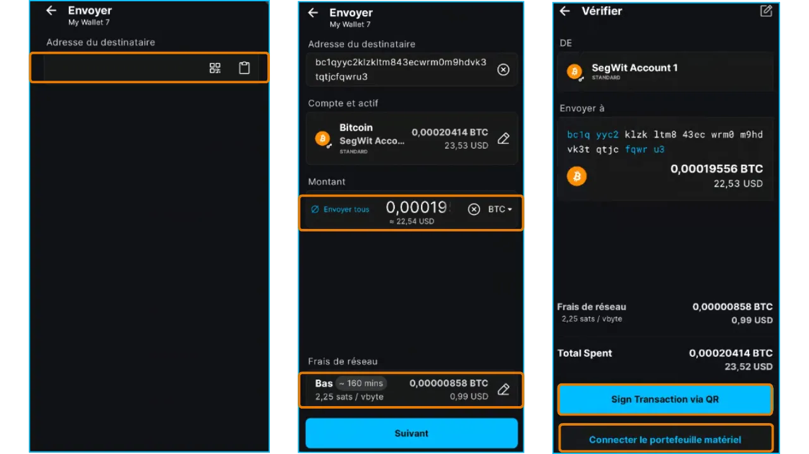

## 1. Introduction
### 1.1. Objectif du tutoriel

- Ce tutoriel explique comment configurer et utiliser la fonctionnalité **Watch-Only** de l'application mobile **Blockstream App** pour surveiller un portefeuille Bitcoin sans accéder à ses clés privées.
- Il couvre les étapes d'installation, de configuration initiale, d'importation d'une clé publique étendue, et l'utilisation pour suivre les soldes et générer des adresses de réception.
- Note : D'autres tutoriels, fournis en annexe, couvrent les fonctionnalités Onchain, Liquid, et la version desktop.

### 1.2. Public cible

- **Débutants** : Utilisateurs souhaitant surveiller un portefeuille Bitcoin (souvent associé à un hardware wallet) via une application mobile intuitive.
- **Utilisateurs intermédiaires** : Personnes cherchant à gérer des portefeuilles en lecture seule tout en utilisant des options de confidentialité comme Tor ou SPV.
- **Propriétaires de hardware wallets** : Pour vérifier leurs soldes et générer des adresses sans connecter leur appareil.
- **Entreprises et commerces** : 
	- Suivre ses transactions pour des besoins comptables sans exposer ses clés privées.
	- Vérifier les transactions reçues sans saisir leurs clés privées dans des systèmes de paiement en ligne.
	- Permettre aux employés de générer de nouvelles adresses de réception sans qu'ils disposent des clés privées.
- **Organisations et crowdfunding** : Afficher le solde de manière transparente aux donateurs sans permettre l’accès aux fonds.

### 1.3. Présentation de la fonctionnalité Watch-Only

Un portefeuille **Watch-Only** (en lecture seule) permet de surveiller les transactions et le solde d’un portefeuille Bitcoin sans avoir accès aux clés privées. Contrairement à un portefeuille classique, il ne stocke que les données publiques, comme la **clé publique étendue** (en anglais "Extended **public key**", ce qui a donné "**xpub**", puis "zpub", "ypub", etc.), qui lui permet d'obtenir les adresses de réception et de suivre l’historique des transactions sur la blockchain Bitcoin. L'absence des clés privées rend impossible toute dépense des fonds depuis l’application, garantissant une sécurité accrue.

**Pourquoi utiliser un portefeuille Watch-Only ?**

- **Sécurité** : Idéal pour surveiller un portefeuille sécurisé par un **hardware wallet** sans exposer les clés privées sur un appareil connecté.
- **Praticité** : Permet de vérifier le solde et de générer de nouvelles adresses de réception sans connecter le hardware wallet.
- **Confidentialité** : Compatible avec des options comme **Tor** ou **SPV** pour limiter la dépendance aux serveurs tiers.
- **Cas d’usage** : Suivi des fonds en déplacement, génération d’adresses pour recevoir des paiements, ou vérification de transactions sans risque pour les clés privées.

### 1.4. Clés publiques étendues

Une **clé publique étendue** (xpub, ypub, zpub, etc.) est une donnée dérivée d’un portefeuille Bitcoin qui permet de générer toutes les clés publiques enfants et leurs adresses de réception associées, sans donner accès aux clés privées.

- **Fonctionnement** : La clé publique étendue est générée à partir de la seed phrase via un processus déterministe (BIP-32). Elle permet de créer un arbre hiérarchique de clés publiques enfants, chacune pouvant être convertie en une adresse de réception. En utilisant le même chemin de dérivation (par exemple, `m/44'/0'/0'`) que le portefeuille surveillé, le portefeuille Watch-Only génère les mêmes adresses, permettant ainsi de suivre les fonds et de créer de nouvelles adresses de réception.

- **Types de clés publiques étendues**
	- **xpub** : Utilisée pour les portefeuilles Legacy (adresses commençant par "1", BIP-44) et pour les portefeuilles Taproot (adresses commençant par "bc1p", BIP-86).
	- **ypub** : Conçue pour les portefeuilles SegWit compatibles (adresses commençant par "3", BIP-49).
	- **zpub** : Associée aux portefeuilles SegWit natifs (adresses commençant par "bc1q", BIP-84).
	- **Autres (tpub, upub, vpub, etc.)** : Utilisées pour des réseaux alternatifs (comme Testnet) ou des standards spécifiques. Par exemple, tpub est pour le réseau Testnet.

- **Distinction** : Le choix entre xpub, ypub, ou zpub dépend du type d’adresses (legacy, SegWit, Taproot ou nested SegWit) et du standard BIP utilisé par le portefeuille. Vérifiez le format requis par votre portefeuille source pour garantir la compatibilité avec Blockstream App.

- **Sécurité et confidentialité** : La clé publique étendue n’est pas sensible en termes de sécurité, car elle ne permet pas de dépenser les fonds (aucun accès aux clés privées). Cependant, elle est sensible pour la confidentialité, car elle révèle toutes les adresses publiques et l’historique des transactions associées.

**Recommandation** : Protégez votre clé publique étendue comme une information sensible.

https://planb.network/courses/46b0ced2-9028-4a61-8fbc-3b005ee8d70f

### 1.5. Rappels sur les hot wallets

- **Hot wallet**, **software wallet**, **wallet mobile**, **portefeuille logiciel** : autant d'appellations pour une application installée sur un smartphone, un ordinateur ou tout appareil connecté à Internet, permettant de gérer et sécuriser les clés privées d’un portefeuille Bitcoin.
- Contrairement aux **hardware wallets** appelés aussi **cold wallets**, qui isolent les clés hors ligne, les portefeuilles logiciels opèrent dans un environnement connecté, ce qui les expose davantage aux cyberattaques.

- **Utilisation recommandée** :
    - Idéal pour gérer des montants modérés de bitcoins, notamment pour les transactions quotidiennes.
    - Convient aux débutants ou aux utilisateurs avec un patrimoine limité, pour qui un hardware wallet peut sembler superflu.

- **Limites** : Moins sécurisés pour stocker des fonds importants ou une épargne à long terme. Dans ce cas, privilégiez un hardware wallet.

## 2. Présentation de Blockstream App

- **Blockstream App** est une application mobile (iOS, Android) et desktop pour gérer des portefeuilles Bitcoin et des actifs sur le réseau Liquid. Acquise par [Blockstream](https://blockstream.com/) en 2016, elle était auparavant nommée *Green Address* puis *Blockstream Green*.
- **Fonctionnalités principales** :
    - Transactions **onchain** sur la blockchain Bitcoin.
    - Transactions sur le réseau **Liquid** (sidechain pour des échanges rapides et confidentiels).
    - Portefeuilles **watch-only** pour surveiller des fonds sans accès aux clés.
    - Options de confidentialité : connexion via **Tor**, connexion à un **nœud personnel** via Electrum, ou vérification **SPV** pour réduire la dépendance aux nœuds tiers.
    - Fonctions **Replace-by-Fee (RBF)** pour accélérer les transactions non confirmées.
- **Compatibilité** : Intègre des hardware wallets comme **Blockstream Jade**.
- **Interface** : Intuitive pour les débutants, avec des options avancées pour les experts.
- **Note** : Ce guide se concentre sur l'utilisation onchain. D'autres tutoriels fournis en Annexes couvrent les fonctionnalités Onchain, Watch-Only, et la version desktop.

## 3. Installer et paramétrer l'application Blockstream App

### 3.1. Téléchargement

- **Pour Android** :
    - Téléchargez [Blockstream App](https://play.google.com/store/apps/details?id=com.greenaddress.greenbits_android_wallet) depuis le Google Play Store.
    - Alternative : Installez via le fichier APK disponible sur le [GitHub officiel de Blockstream](https://github.com/Blockstream/green_android).
- **Pour iOS** :
    - Téléchargez [Blockstream App](https://apps.apple.com/us/app/green-bitcoin-wallet/id1402243590) depuis l'App Store.
- **Note** : Assurez-vous de télécharger depuis des sources officielles pour éviter les applications frauduleuses.

### 3.2. Configuration initiale

- **Écran d'accueil** : À la première ouverture, l'application affiche un écran sans portefeuille configuré. Les portefeuilles créés ou importés apparaîtront ici par la suite.

- **Personnalisation des paramètres** : Cliquez sur "Paramètres de l'application", ajustez les options ci-dessous, cliquez sur "Sauvegarder", redémarrez l’application puis créez votre portefeuille.

#### 3.2.1. Confidentialité renforcée (Android uniquement)

- **Fonction** : Désactive les captures d'écran, masque les aperçus d'application dans le gestionnaire de tâches, et verrouille l’accès dès que le téléphone est verrouillé.
- **Pourquoi ?** : Protège vos données contre les accès physiques non autorisés ou les malwares capturant l’écran.

#### 3.2.2. Connexion via Tor

- **Fonction** : Route le trafic réseau via **Tor**, un réseau anonyme qui chiffre vos connexions.
- **Pourquoi ?** : Masque votre adresse IP et protège votre vie privée, idéal si vous ne faites pas confiance à votre réseau (Wi-Fi public, par exemple).
- **Inconvénient** : Peut ralentir l’application en raison du chiffrement.
- **Recommandation** : Activez Tor si la confidentialité est une priorité, mais testez la vitesse de connexion.

#### 3.2.3. Connexion à un nœud personnel

- **Fonction** : Connecte l’application à votre propre **nœud Bitcoin complet** via un serveur **Electrum**.
- **Pourquoi ?** : Offre un contrôle total sur les données blockchain, éliminant la dépendance aux serveurs de Blockstream.
- **Prérequis** : Un nœud Bitcoin configuré.
- **Recommandation** : Utilisateurs avancés souhaitant une souveraineté maximale.

#### 3.2.4. Vérification SPV

- **Fonction** : Utilise la **Simplified Payment Verification (SPV)** pour vérifier directement certaines données blockchain sans télécharger l’intégralité de la chaîne.
- **Pourquoi ?** : Réduit la dépendance au nœud par défaut de Blockstream, tout en restant léger pour les appareils mobiles.
- **Inconvénient** : Moins sécurisé qu’un nœud complet, car il repose sur des nœuds tiers pour certaines informations.
- **Recommandation** : Activez SPV si vous ne pouvez pas utiliser un nœud personnel, mais préférez un nœud complet pour une sécurité optimale.

## 4. Créer un portefeuille Bitcoin "Watch-only"

### 4.1. Récupérer la clé publique étendue

Pour configurer un portefeuille Watch-Only, vous devez d’abord obtenir la clé publique étendue (xpub, ypub, zpub, etc.) du portefeuille à surveiller. Cette information est généralement disponible dans les paramètres ou la section "informations du portefeuille" de votre logiciel ou hardware wallet. 

- Exemple avec Blockstream App : Depuis l’écran d’accueil du portefeuille, allez dans "Paramètres", puis "Wallet Details", et copiez la zpub :

- Alternative 1 : Générez un QR code contenant la clé publique étendue pour la scanner à l’étape suivante.
- Alternative 2 : Utilisez un Output Descriptor si votre portefeuille le fournit.

### 4.2. Importer le wallet Watch-only

- **Précaution** : Configurez votre portefeuille dans un environnement privé, sans caméras ni observateurs.
- Depuis l’écran d’accueil, cliquez sur "Configurer un nouveau portefeuille" puis sur "Get Started" :

- Vous arrivez à l'écran suivant :

- (1) **"Setup Mobile Wallet"** : Créer un nouveau hot wallet. Voir en annexe le tutoriel "Blockstream App - Onchain".
- (2) **"Restore from Backup"** : Importer un portefeuille existant via une phrase mnémonique (12 ou 24 mots). Attention : N’importez pas la phrase d’un cold wallet, car elle serait exposée sur un appareil connecté, annulant sa sécurité.
- (3) **"Watch-Only"** : l'option qui nous intéresse pour ce tutoriel.

- Sélectionnez ensuite "**Signature unique**" puis le réseau "**Bitcoin**" :

- Collez la clé publique étendue (xpub, ypub, zpub, etc.), scannez le QR code correspondant, ou entrez un Output Descriptor. Même si l'application spécifie "xpub", les clés ypub, zpub, ... sont également autorisées. Puis cliquez sur "Se connecter" : 

### 4.3. Utiliser le wallet Watch-only

Une fois importé, le portefeuille Watch-Only affiche le solde total et l’historique des transactions des adresses dérivées de la clé publique étendue. Seules les transactions onchain sont visibles (les transactions Liquid sont ignorées). Pour surveiller un portefeuille Liquid, répétez l’importation en sélectionnant "Liquid" à l’étape précédente.

- **Consulter le solde et l’historique** : Depuis l’écran d’accueil, visualisez le solde total et l’historique des transactions onchain :

- **Générer une adresse de réception** : Cliquez sur "Transact", puis "Recevoir", pour créer une nouvelle adresse onchain. Partagez-la via QR code ou copie pour recevoir des fonds :

- **Envoyer des fonds** : Cliquez sur **"Transact"**, puis **"Envoyer"**. Vous pouvez renseigner :
	- L’adresse du destinataire. 
	- Le montant de la transaction.
	- Les frais de transaction.

Cependant, comme le portefeuille Watch-Only ne détient pas les clés privées, vous ne pouvez pas envoyer de fonds directement. Pour signer la transaction, connectez votre hardware wallet ou réalisez l'échange de PSBT en scannant les QR codes (option par exemple disponible sur la Coldcard Q).

- **Note** : Vérifiez toujours l’adresse de réception et les détails de la transaction pour éviter les erreurs. Les fonds envoyés à une mauvaise adresse sont irrécupérables.

## Annexes

### A1. Autres tutoriels Blockstream App

- Utilisation du réseau Onchain :

https://planb.network/tutorials/wallet/mobile/blockstream-app-onchain-e84edaa9-fb65-48c1-a357-8a5f27996143

- Utilisation du réseau Liquid :

https://planb.network/tutorials/wallet/mobile/blockstream-app-liquid-b3e4fb82-902e-4782-ad2b-a61ab05a543a

- Version Desktop (ordinateur) :

https://planb.network/tutorials/wallet/desktop/blockstream-app-desktop-c1503adf-1404-4328-b814-aa97fcf0d5da

### A2. Clés publiques étendues

- Glossaire :
	- [Clés publiques étendues](https://planb.network/fr/resources/glossary/extended-key)
	-  [xpub](https://planb.network/fr/resources/glossary/xpub)
	- [ypub](https://planb.network/fr/resources/glossary/ypub) 
	- [zpub](https://planb.network/fr/resources/glossary/zpub)
- Cours :
	- [Les clés publiques étendues](https://planb.network/courses/46b0ced2-9028-4a61-8fbc-3b005ee8d70f)

### A3. Bonnes pratiques

Pour utiliser **Blockstream App** de manière sécurisée et efficace, suivez ces recommandations. Elles vous aideront à protéger vos fonds, optimiser vos transactions, et préserver votre confidentialité sur les réseaux **Bitcoin (onchain)**, **Liquid**, et **Lightning**.

- **Sécurisez votre phrase de récupération** :
	- Tutoriel : Sauvegarder sa phrase mnémonique

https://planb.network/tutorials/wallet/backup/backup-mnemonic-22c0ddfa-fb9f-4e3a-96f9-46e2a7954270

https://planb.network/courses/46b0ced2-9028-4a61-8fbc-3b005ee8d70f

- **Utilisez l’authentification sécurisée** : 
	- Activez un **code PIN robuste** ou l’**authentification biométrique** (empreinte digitale ou reconnaissance faciale) pour protéger l’accès à l’application.
	- Ne partagez jamais votre PIN ou vos données biométriques.

- **Protégez votre confidentialité** : 
	- Générez une nouvelle adresse pour chaque réception onchain ou Liquid afin de limiter le traçage sur la blockchain.
	- Activez les fonctions "Confidentialité renforcée", "Tor", et "SPV".
	- Pour une confidentialité maximale, connectez votre wallet à votre propre nœud Bitcoin via un serveur Electrum au lieu d’utiliser le nœud public 

- **Choisissez le réseau adapté à vos besoins** : 
	- **Onchain** : Privilégiez pour la conservation à long terme ou les transactions de montants élevés (frais négligeables par rapport au montant).
	- **Liquid** : Utilisez pour des transferts rapides, à faible coût et avec une confidentialité renforcée.
	- **Lightning** : Optez pour des transferts instantanés et très économiques pour de faibles montants. 
  
- **Vérifiez toujours les adresses d'envoi** :
	- Avant d’envoyer des fonds, vérifiez soigneusement l’adresse. Les fonds envoyés à une mauvaise adresse sont perdus à jamais. Utilisez un copier/coller ou le scan de QR code, ne recopiez / modifiez jamais une adresse à la main. 

- **Optimisez les frais** :
	- Pour les transactions onchain, choisissez des frais adaptés (lente, moyenne, rapide) en fonction de l’urgence et de la congestion du réseau.
	- Utilisez Liquid, ou Lightning pour les petits montants.

- **Tenez l'application à jour**

### A4. Ressources supplémentaires

- **Liens officiels Blockstream :** 
	- **[Site officiel](https://blockstream.com/)**
	- **[Support pour l'application mobile](https://help.blockstream.com/hc/en-us/categories/900000056183-Blockstream-Green/)** : documentation et tchat
	- **[GitHub](https://github.com/Blockstream/green_android)**

- **Explorateurs de blocs :**
	- Onchain : **[Mempool.space](https://mempool.space/)**
	- Liquid : **[Blockstream Info](https://blockstream.info/liquid)**
	- Lightning : **[1ML (Lightning Network)](https://1ml.com/)** 

 - **Apprentissage et tutoriels :** **[Plan ₿ Network](https://planb.network/)** : 
	 - **Sécuriser sa phrase de récupération**

https://planb.network/tutorials/wallet/backup/backup-mnemonic-22c0ddfa-fb9f-4e3a-96f9-46e2a7954270

https://planb.network/courses/46b0ced2-9028-4a61-8fbc-3b005ee8d70f

- **Liquid Network** :
	- **[Glossaire](https://planb.network/fr/resources/glossary/liquid-network)**

https://planb.network/courses/6d26bcff-51a3-405f-bcdd-9af8297ce727

- **Lightning Network** :
	- **[Glossaire](https://planb.network/fr/resources/glossary/lightning-network)**

https://planb.network/courses/34bd43ef-6683-4a5c-b239-7cb1e40a4aeb

