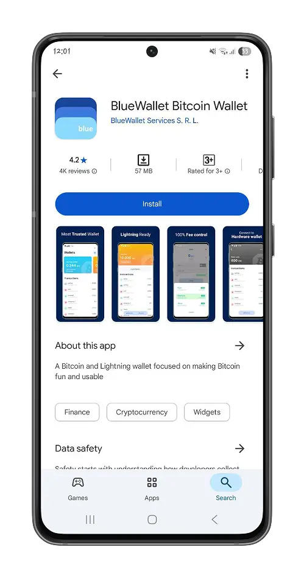
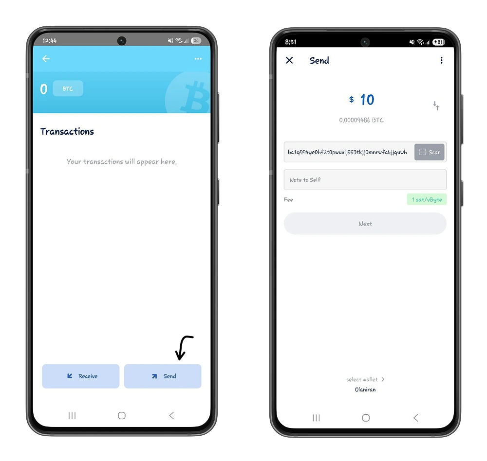
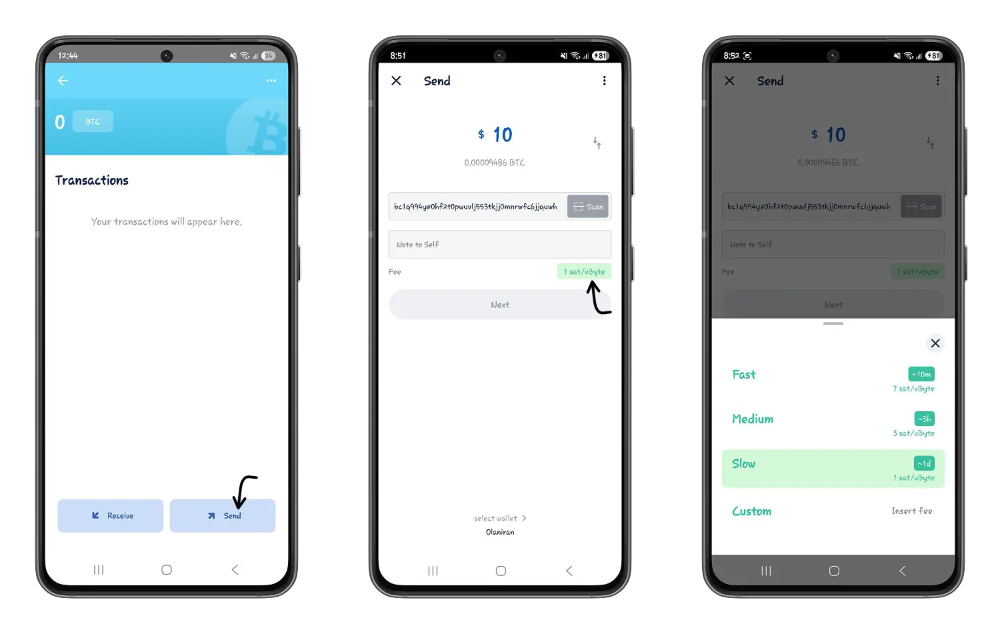
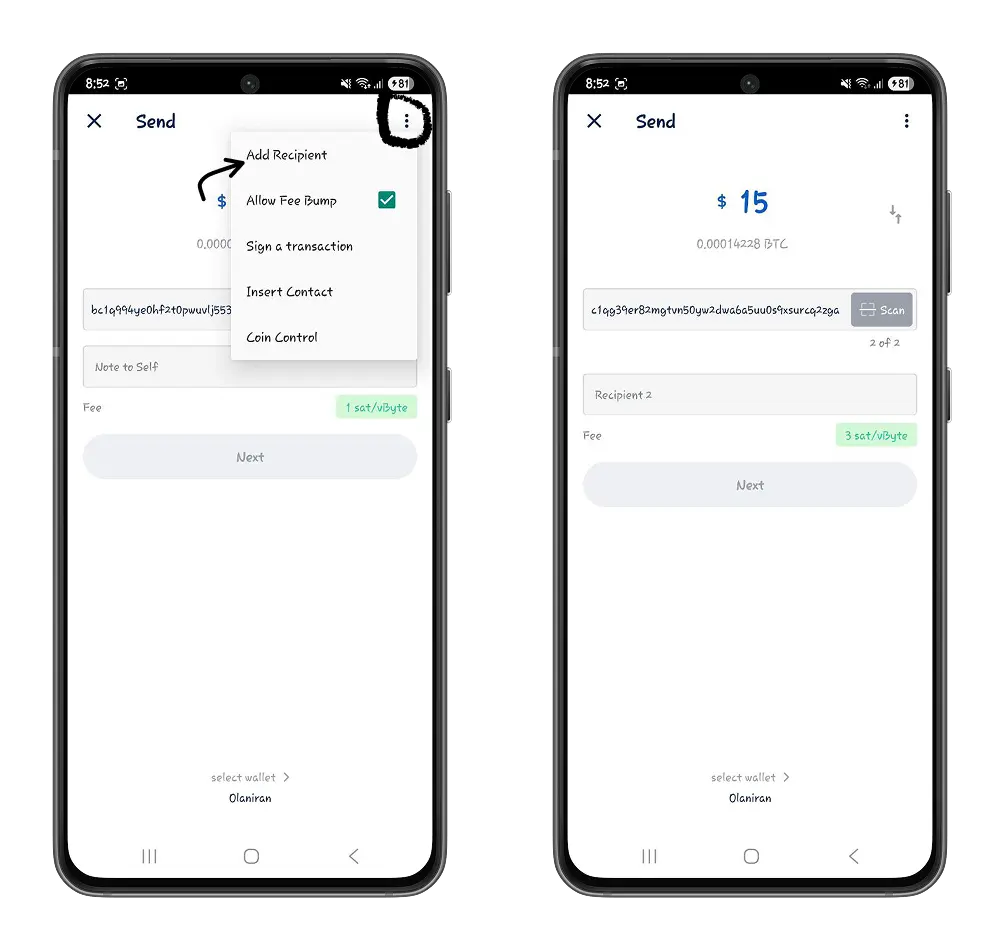
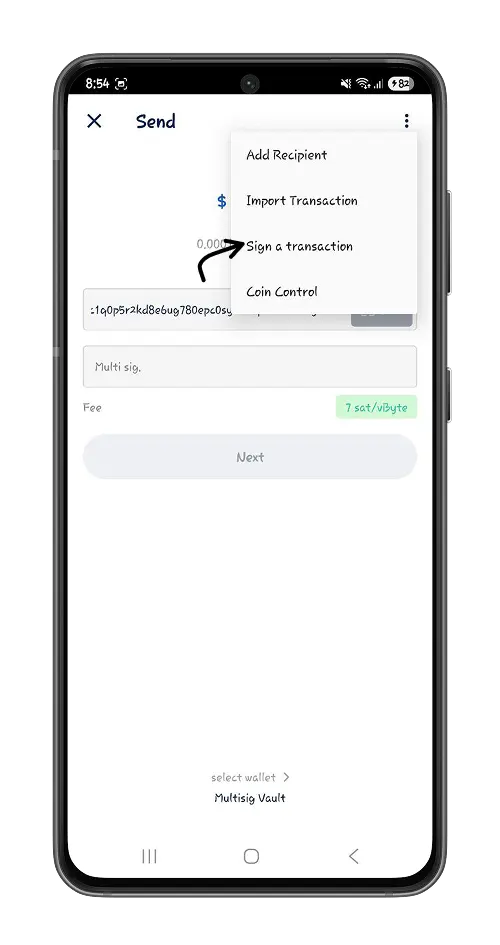
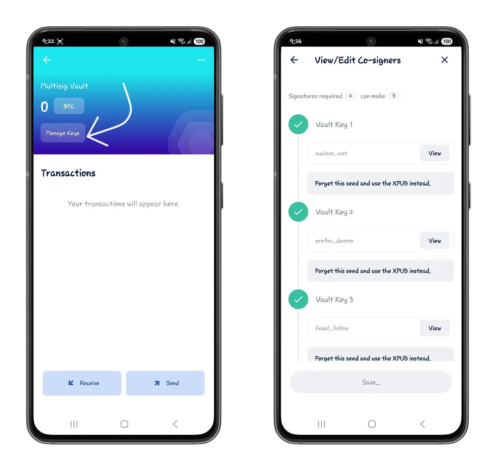
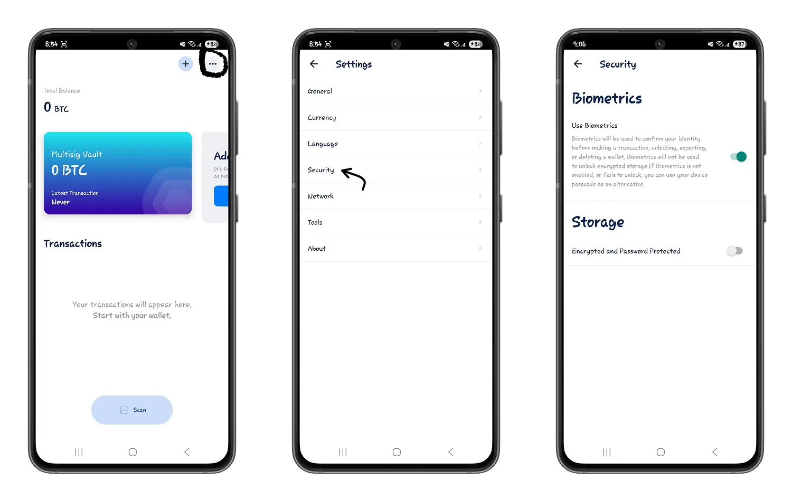

Gutangura gukoresha Bitcoin bisa n’ibigoranye cane ku bantu bakekeranya ku bijanye n’uko yoroshe gukoresha. Kuronka ibikoresho bikwiye vyo gutuma ivyo vyoroshe rero bica biba ikintu gihambaye cane kugira ngo Bitcoin yemerwe neza nk’uburyo bwo gukoresha Exchange atari nk’ububiko bw’agaciro gusa.

Muri iyi nyigisho tuzoba turiko turaraba Blue Wallet, Bitcoin Wallet yoroshe ariko ikora neza cane ishobora kugufasha gucunga amafaranga yawe bwite kandi no gushinga amakoperative y’uburongozi ashingiye kuri [Multisig]

## Gutangura n’Ubururu Wallet.

Blue Wallet ni inkomoko yuguruye, yibika Bitcoin Wallet ishobora kugufasha gufata ububasha ku bitcoins zawe. Iraboneka nk’iporogarama yo kuri telefone ngendanwa kuri Android na iOS. Muri iyi nyigisho tuzoba twishingikirije kuri verisiyo ya Android, ariko rero, inzira zose zizotegurwa zirakora kimwe kuri iOS.

⚠️ Turagusavye urabe ko ushobora gukuraho porogarama ya Blue Wallet Bitcoin Wallet ku rubuga rwemewe kugira ngo umenye neza ko ari iy’ukuri kandi ukinge amafaranga yawe ya bitcoins kugira ngo ntashobora gusohoka canke gufatwa n’abantu.

Iyo umaze gushiramwo, ushobora gukora Wallet nshasha maze ukabika amajambo 12 yo gusubizaho, canke ukazana Bitcoin Wallet iriho. Raba ingene wokora backup nziza y’amajambo yawe y’ingenzi kugira ntutakaze uburenganzira bwo gushika ku bitcoins zawe.

https://planb.network/tutorials/wallet/backup/backup-mnemonic-22c0ddfa-fb9f-4e3a-96f9-46e2a7954270

Na Blue Wallet ushobora gukora ibitabo bitandukanye, vyihariye vya Bitcoin. Nk’akarorero, urashobora kugira Wallet imwe y’amahera uzigamye, iyindi y’amahera ukoresha ku musi ku musi, vyose bikaba biri mu gitabu kimwe.

## Ubwoko bw'ibikorwa

Mu Blue Wallet, uzosangamwo ubwoko bubiri bw’ibitabo vy’ivya Bitcoin.

### Ibitabo vya Bitcoin

Niba waramenyereye ibindi bipimo vya Bitcoin nka Phoenix canke Aqua, ntuzoba uri kure y’intambwe na gato kuri Interface n’ibipimo vya Bitcoin vya Blue Wallet.

https://planb.network/tutorials/wallet/mobile/phoenix-0f681345-abff-4bdc-819c-4ae800129cdf

https://planb.network/tutorials/wallet/mobile/aqua-8e6d7dd3-8c03-45cc-90dd-fe3899a7d125

Bitcoin Wallet y’ubururu Wallet igereranya Wallet isanzwe mu bidukikije vya Bitcoin. Ushobora gukoresha ama bitcoins igihe cose uzoba ufise amajambo yo gusubiza azotanga umukono ubereye ku rubuga kugira ngo wemeze ko ari wewe ufise ayo ma bitcoins.

Kugira ngo ureme igitabu ca Bitcoin, fyonda ku buto **Ongera ubu**, winjize izina ry’igitabu cawe maze uhitemwo ubwoko bwa Bitcoin.

Iyo ukanda kuri Bitcoin Wallet yawe, uzoshobora kubona amateka yawe y’ibikorwa no kohereza no kwakira amafaranga y’ibiceri.

⚠️ Ivyo ukora vyose biri muri Bitcoin Wallet yawe biri ku ruzitiro rwa Bitcoin (Mainnet).

- Kwakira amafaranga y’ibiceri n’iyi Bitcoin Ubururu Wallet Wallet ni ikintu gisanzwe. Mu nsi y’ibarabara ryawe, ukande kuri buto **Receive**. Sangira kode ya QR canke Bitcoin Address yawe n’uwagurungikiye kugira ngo bashobore kugurungikira ama bitcoins.

Ushobora kandi gutunganya umubare wategekanijwe kugira ngo ugaragaze umubare wa Bitcoin wipfuza kwakira.

- Ku buto **Send**, wohereze bitcoins kuri Bitcoin Address, ushireho umubare wipfuza kandi wemeze igikorwa.

Blue Wallet iragufasha gutunganya amaparametere y’ivyo urungitse Bitcoin uko wipfuza.

Ushobora rero guhitamwo igipimo c’amahera y’ugucuruza kigubereye nimba ushaka kubona ugucuruza kwawe kwemezwa ningoga mu Mempool kandi gushirwa mu gice c’amabuye y’agaciro n’abacukuzi. Bivanye n’igipimo uhisemwo, abacukuzi bazoshira imbere ivy’ugucuruza vyawe ku rugero runini canke ruto. Ibindi ubimenye mu nyigisho yacu y’Ikirere ya Mempool.

https://planb.network/tutorials/privacy/analysis/mempool-space-f3e468a1-92f1-43ce-b2e4-c3298fa0e02f

- Ukoresheje Blue Wallet, urashobora kwongerako abakwakira benshi ku vyo wohereje bimwe.

Iyo wongeyeko Bitcoin Address y’umuntu wa mbere wakiriye, mu mahitamwo, ukande kuri **Add Recipient**, wongereko Bitcoin Address hanyuma ushireho amahera azorungikirwa uwo muntu, n’ibindi. Blue Wallet izorungika ama bitcoins ku vyoherezwa vyinshi bishingiye ku gikorwa cawe kimwe.

Ushobora gukuraho umwe canke bose mu gufyonda kuri **Kuraho uwuronka** na **Kuraho abaronka bose**.

- Inflate fees**: Woba warakoze igikorwa gifata igihe kirekire kugira ngo cemezwe? Mu gutuma amafaranga atera imbere urashobora kwongerako amafaranga y’ibikorwa ku giciro cawe kirindiriye kugira ngo wihutishe kwemezwa kwaco.

### Multisig Ibitabo

Multisig (ifise umukono mwinshi) Wallet igereranya Wallet yaremwe ivuye mu gukoranya umubare kanaka (nibura 2) w’amasakoshi ya Bitcoin. Muri ubwo bwoko bwa Wallet, bivanye n’imiterere n’uburyo bwatowe, gukoresha amafaranga y’ama bitcoins bica bihinduka igikorwa co gukorana no gukorana.

Mu Blue Wallet, urashobora gukora ibitabo vy’imikono myinshi vy’ishirahamwe ryawe, umuryango wawe, ishirahamwe ryawe. Muri iki gice cose, tuzokwihweza umuce wose w’ubwo bwoko budasanzwe bw’ibitabo.

Yongerako igitabo gishasha maze uhitemwo ubwoko **Multisig Vault** kugira ngo ureme igitabo c'imikono myinshi.

Sigura m-de-n imiterere mu muryango wawe w'imikono myinshi ukanda kuri **Imiterere y'ububiko**.

⚠️ Mu ntunganyo ya m-of-n, **m** igereranya umubare mutoyi w’imikono isabwa kugira ngo umuntu yemeze igikorwa co gucuruza na **n** umubare w’ibitabo biri mw’ishirahamwe ryawe.

Raba neza ko usobanura umubare mutoyi w’imikono (m) ku bantu benshi bo mw’ishirahamwe ryawe. Nk’akarorero, uburyo bwo gusinya 2 kuri 3 busaba amasakoshi abiri mw’ishirahamwe ryawe kugira ngo ashire umukono ku giciro imbere y’uko gishobora gukorwa.

❗Gusobanura m-of-n aho n ingana na m ni ingorane nini. Iyo umunyamuryango atakaje uburenganzira bwo gukoresha Wallet yiwe uratakaza uburenganzira bwo gukoresha amafaranga y’ibiceri muri Wallet.

Aha hari ingero zimwe zimwe z’imiterere myiza kugira ngo umuntu agire umutekano n’ugushika ku bitcoins:

- 2-de-3 umukono mwinshi.

- 5-de-7 umukono mwinshi.

Gumana ukora neza mu guhitamwo uburyo bwa P2WSH.

❗ **[P2WSH](https://planb.network/resources/glossary/p2wsh) canke Kwishura ku Cabona Inyandiko Hash** ni uburyo bwo gufunga bufunga amafaranga yawe asohoka (Ibisohoka) ku Hash y’inyandiko y’ubuhinga GW up-5ts. Inyungu nyamukuru y’ubwo bwoko bwo gufunga ni uko bugabanya ubunini bw’amakuru y’ibikorwa kandi bikagufasha kwishura amafaranga make y’ibikorwa.

Rema canke ushiremwo buri **n** ibitabo mu mitunganyirize yawe. Mu nyigisho yacu, tuzoba turiko turakoresha uburyo bwo gukoresha imikono myinshi 2 kuri 3. Raba neza ko ubika amajambo yo gusubirana y’igitabu kimwekimwe cose ku giti cawe.

- Kwakira ama bitcoins

Ku rupapuro rwawe rwa Multisig Wallet, uzosanga amateka yawe y’ibikorwa be n’ubuto bwa Kwakira no Kurungika.

Kwakira ama bitcoins mu Wallet y’imikono myinshi ni co kimwe n’igihe uri mu Bitcoin Wallet isanzwe.

- Wohereze **amafaranga**:

Mu gucunga Wallet y’imikono myinshi, gukoresha bitcoins bica bihinduka igikorwa gikomeye, haba n’abandi bantu canke Wallet ya kabiri yawe bwite. Umukono umwe w’igitabu cawe ca Wallet ntugihagije. Ivyo vyongera Layer y’umutekano ku bitcoins zawe, kuko umuntu w’umunyaruyeri ntazoshobora gukoresha ayo bitcoins iyo azoba afise urufunguzo rwawe rumwe gusa rw’ibanga.

Nka kurya kw'ibitabo vya Bitcoin vy'ubururu Wallet, ushobora gusobanura abakira benshi mu **Kwongera abakira**.

Igihe wemeza amafaranga yawe, uzokenera umukono wa kabiri kugira ngo wemeze ko amafaranga y’ama bitcoins akoreshwa. Ibuka, turi mu 2-de-3 y’imikono myinshi.

Uwugira kabiri ashize umukono kuri Wallet, nimba na we nyene ari umukoresha, arashobora gusinya iyo nzira naho yoba atari kuri Internet (nta Wi-Fi, nta makuru yo kuri telefone ngendanwa) mu gucapura kode ya QR y’iyo nzira [yashizweko umukono igice](https://planb.network/resources/glossary/psbt) uherutse gukora.

- Genda kure n'ibitabu vy'ibitabu vy'imikono myinshi**:

Ku Interface ya Wallet yawe ifise imikono myinshi, fyonda ku buto **Manage keys**.

Mu kwibagirwa rimwe mu majambo yo gusubirana y’imwe mu nkuru z’abasinye (**Ibagirwa iyi seed...**), umenyesha Blue Wallet gukuraho ububiko bw’ayo majambo mu bwenge bwayo. Uzoba rero warakoze ivy’inyuma.

Mu gukora iki gikorwa, ugumya gusa urufunguzo rwa bose rujanye n'aya majambo yo gusubirana.

⚠️ Gukomeza gusa imfunguruzo za bose (XPUB) bigufasha kwongerako urugero rw’umutekano ku ntunganyo yawe y’imikono myinshi 2 kuri 3. Nkako, vyoshobora kuba bibi kugumiza amajambo yose yo gukira ahantu hamwe igihe telefone yawe iriko iraterwa. Abatera bafise uburenganzira bwo gukoresha **VAULT** (ijambo ry’ingenzi) rimwe gusa ukoresha mu gusinya ku mafaranga yawe, ntibazoshobora kwiba ama bitcoins yawe (nibura amasinya 02 asabwa) kuko imfunguruzo za bose ntizishobora gukoreshwa mu gusinya ku mafaranga.

## Ibindi bihitamwo n'ubururu Wallet

### Kunoza umutekano wo gushika ku bitabo

Mu mategeko, **Umutekano** ushobora kugufasha gusobanura ikoreshwa ry'urutoke kugira ngo ukore igikorwa, wohereze hanze canke usibe Wallet yawe. Ivyo bica vyemeza uwo muntu akoresheje telefone yawe ngendanwa.

## Gukoresha Lightning Network

Lightning Network ntikigishigikirwa mu buryo bw'imvukira mu gikorwa ca Blue Wallet.

Mu Miterere > **Imiterere y'Umuravyo**, ushobora gufatanya n'amaboko Wallet yawe y'Umuravyo igihe ukoresha urudodo rwa Lightning Network Daemon (LND). Shiraho LND Hub, hanyuma ushiremwo Wallet yawe mu kwinjira mu nzira yashizweho na Hub.

https://planb.network/tutorials/node/lightning-network/umbrel-lnd-b12e0b5b-12ff-45f1-978e-62f4b4a8ba16

https://planb.network/tutorials/node/lightning-network/lightning-network-daemon-linux-59d777e9-72c8-4b32-8c50-e86cdae8f2f9

Ubu wararangije urugendo rwa Blue Wallet, witeguriye gukoresha Bitcoin mu buryo bworoshe n’ububasha bwayo bwose. Turagusavye gutera intambwe ikurikira, ukamenya ingene woshobora kwemera amahera ya Bitcoin mu maduka yawe, kubera ububasha bwa Lightning.

https://planb.network/tutorials/wallet/mobile/breez-46a6867b-c74b-45e7-869c-10a4e0263c06