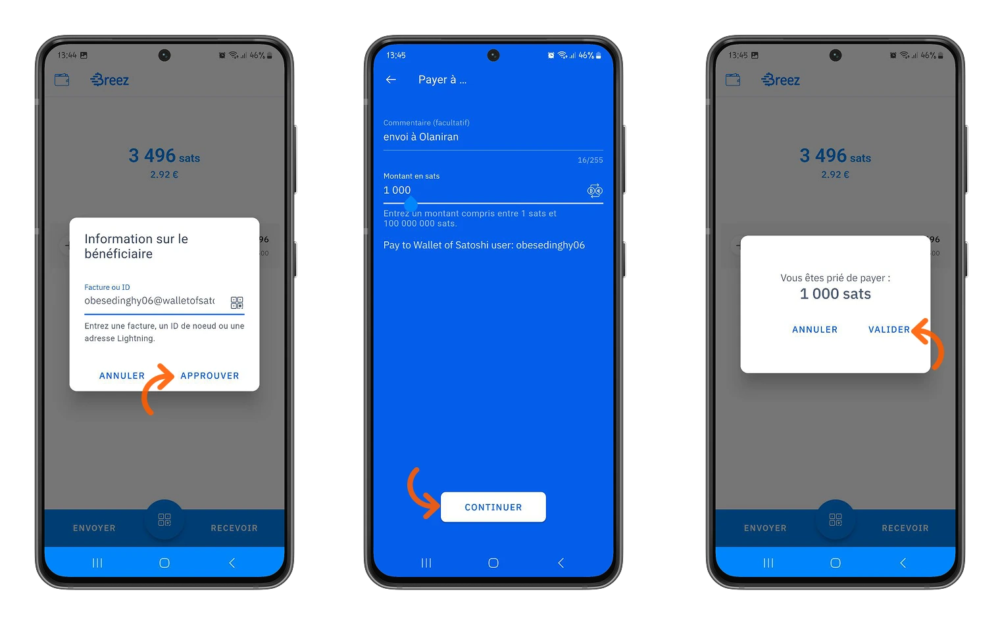
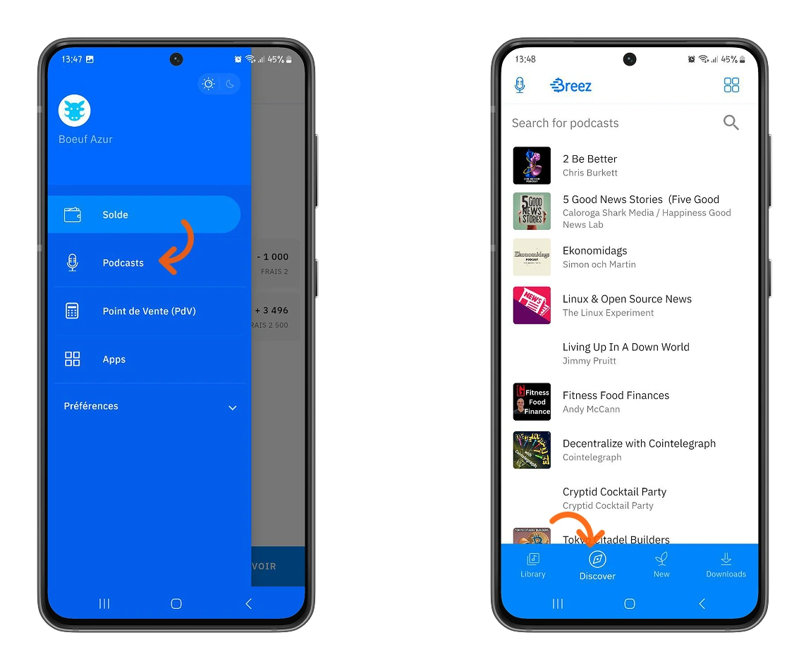
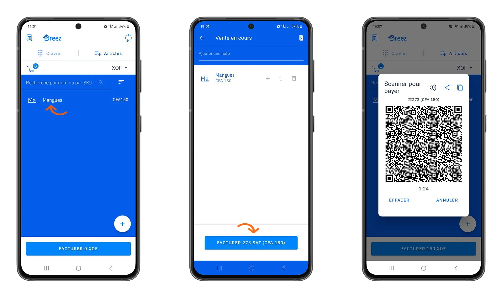
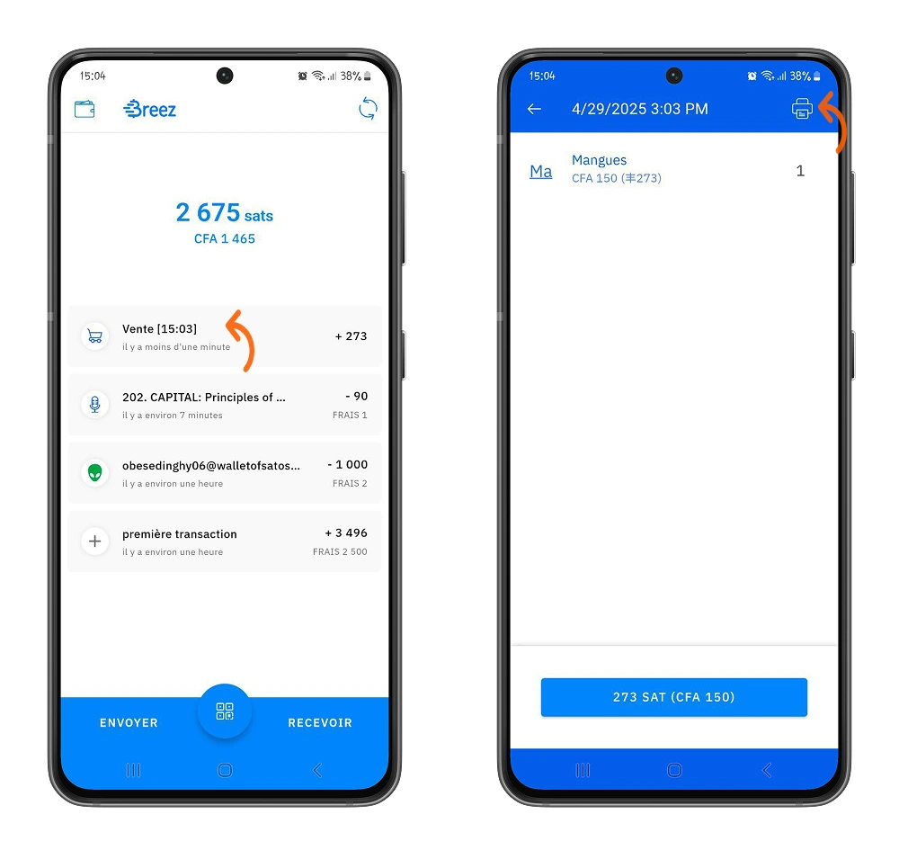
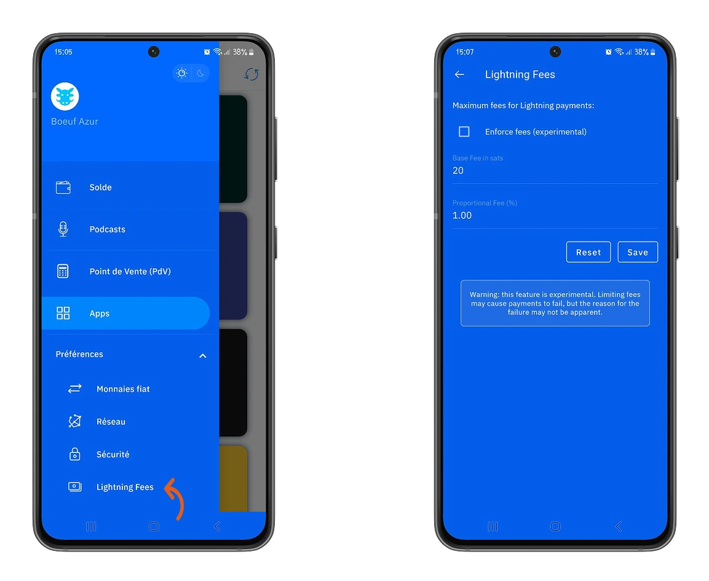
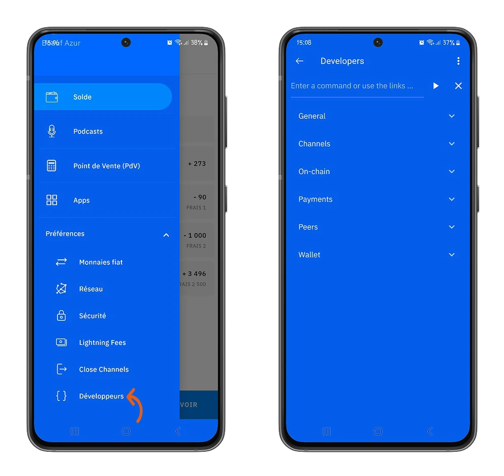

Kendi kendini tutan cüzdanlar, Bitcoin'in Lightning kaplamasının gücünden ve avantajlarından yararlanırken bitcoinlerinizi tutmak için en güvenli seçenek haline geliyor. Breez, yaklaşımı sayesinde bu cüzdan grubunda özellikle öne çıkıyor.

## Breez Wallet nedir?

Breez, Breez şirketi tarafından oluşturulan, bitcoinleriniz üzerinde kontrol sahibi olmanızı sağlayan ve aynı zamanda yenilikçi özellikleri tek bir uygulamada sunan, kendi kendine emanet edilebilen bir Wallet'tür.

Breez Wallet'ü Android ve iOS'ta resmi indirme platformlarından indirebilirsiniz. Bu eğitimde, Android platformundaki uygulamaya uygulamalı bir yaklaşım sergileyeceğiz. Aşağıda detaylandırılan tüm süreç iOS için de geçerlidir.

⚠️ **ÖNEMLİ**: Uygulamanın orijinalliğini ve gelecekteki varlıklarınızın güvenliğini sağlamak için uygulamayı Google Play Store veya Apple Store gibi resmi bir platformdan indirmeniz çok önemlidir.

İşte, Android'de **Breez** uygulaması (Breez şirketinin bir başka ürünü olan Misty Breez ile karıştırılmamalıdır).

## Wallet ile çalışmaya başlamak

Breez size yeni bir Wallet oluşturma veya mevcut bir Lightning Wallet'yı geri yükleme seçeneği sunar. Bu eğitimde, yeni bir Wallet oluşturacağız.

Bu Breez'in avantajlarından biridir: bitcoinlerinize tam erişimin anahtarları sizde. Bitcoinlerinizin efendisi sizsiniz.

⚠️ Breez Wallet şu anda geliştirme aşamasında olduğundan, şimdilik makul miktarlarda işlem yapmanızı öneririz.

> Ne anahtarlarınız, ne de bitcoinleriniz.

Wallet, doğrudan Bitcoin protokolü ile senkronize olur ve işlemleriniz için size aktif bir düğüm sağlar.

### Anahtarlarınızı kaydedin

Bir Bitcoin/Lightning Wallet oluştururken yapılacak ilk şey anahtarlarını kaydetmektir.

Menü'de **Tercihler** ve ardından **Güvenlik** seçeneğine ilerleyin.

Breez, 12 kurtarma sözcüğünüzü bir Google Drive'a veya yapılandırabileceğiniz uzak bir kişisel sunucuya kaydetmenizi sağlar.

Ardından **Chiffer yedekleme** seçeneğini etkinleştirin: bu, Wallet'nizdeki manuel olarak kaydedebileceğiniz anahtar kelimeleri ortaya çıkaracaktır.

Ardından yedeklemenizi onaylamak ve uzaktan yedekleme hesabınızı Breez Wallet'e bağlamak için talimatları izleyin.

https://planb.network/tutorials/wallet/backup/backup-mnemonic-22c0ddfa-fb9f-4e3a-96f9-46e2a7954270

⚠️ **ÖNEMLİ**: Breez Wallet'ünüze ekstra bir Layer güvenlik eklemek için bir PIN kodu tanımlayabilir ve bunu Wallet'e erişimin yetkili olduğunu doğrulamak için ayarlayabilirsiniz.

### Breez ile ilk işlemlerinizi yapma

Breez, uygulamasında sezgiselliğe öncelik verir. Bu Wallet ile ilk bitcoinlerinizi almak daha kolay olamazdı. Ana sayfada **Receive** seçeneğine tıklayın, ardından bitcoinlerinizi almak istediğiniz yöntemi seçin.

Breez size üç seçenek sunar:

- Yıldırım veya ID** Invoice ile alın: generate bir Invoice ve ödeme alın.
- Bir Bitcoin Address** aracılığıyla alın: Bitcoin ana ağındaki işlemlerle bitcoin alın.
- Bitcoin** satın alın: Breez, Bitcoin'i doğrudan fiat para birimlerinden elde etmenin bir yolunu içerir.

Invoice'niz için bir açıklama girin, ardından almak istediğiniz miktarı girin.

⚠️ Breez'deki ilk işleminiz için **2500 satoshis** tutarında bir kanal açma ve bakım ücreti ödemeniz gerekecektir. Çoğu Lightning cüzdanının aksine, Breez size tüm Lightning düğümü altyapısını sağlayarak bitcoinlerinizi yönetme özgürlüğü verir. Kendi ödeme kanallarınızı açmanız ve uygulama içinden doğrudan Lightning düğümü ile iletişim kurma özgürlüğüne sahip olmanız gerekir.

*İçiniz rahat olsun, bu ücreti yalnızca bir kez, Wallet'ünüzü başlattığınızda ödemeniz gerekecek*

Invoice'ünüz oluşturulduktan sonra bunu paylaşabilir veya faturayı ödemek ve bitcoinlerinizi almak için taratabilirsiniz.

Breez'e bitcoin göndermek, onları almak kadar sezgiseldir.

Breez, bitcoin göndermek için size üç seçenek sunar.

- Invoice veya kullanıcı kimliğini** yapıştırın: Yıldırım Invoice ödeyin.
- Ödeme yapmak için bağlanın**: Bir oturum oluşturun ve alıcınızı bitcoin göndermek için oturuma katılmaya davet edin.
- BTC Address**'ya gönderin: Bitcoin ana ağında işlem yapın.

Ardından Faydalanıcının bilgilerini girin veya bir Invoice ödemesi başlatmak ve doğrulamak için tarayın.

### Bu Wallet'un özelliği.

Breez, bitcoinleri saklamak için sezgisel bir Wallet olmanın ötesinde, yenilikçi bir ekosistemdir.

Yararlı hizmetleri doğrudan uygulama içinde bulabilirsiniz.

- Podcast dinleyin**: Breez, sevdiğiniz içerik oluşturucuları Bitcoin bağışlarıyla desteklemenizi sağlayan bir podcast 2.0 oynatıcısıdır.

Menüden **Podcast'leri** seçin, ardından favori içerik oluşturucularınızı bulun, keşfedin ve dinleyin.

Bağış yaparak sevdiğiniz içerik oluşturucuların çalışmalarını destekleyin.

- Bir Satış Noktası**: Breez, işletmenize mükemmel bir şekilde uyum sağlayarak uygulama içinde bir satış noktası çalıştırmanıza olanak tanır. Mağazanızın envanterini yönetebilir, müşterilerinizden ödeme alabilir ve yapılan her satın alma işlemi için generate yazdırılabilir faturalar alabilirsiniz. Dahası, yerel para birimlerinizi Breez tarafından desteklenen çok sayıda para biriminde bulabilirsiniz.

Para birimlerinizi **Tercihler > Fiat Para Birimleri** menüsünden özelleştirebilirsiniz.

Satış Noktası (POS)** menüsünde, mağazanızda sattığınız ürünleri yapılandırabilirsiniz.

Envanteriniz tamamlandığında, müşterilerinizi bu ürünler için kolayca Invoice yapabilir ve Bitcoin'ü işletmenize kabul edebilirsiniz.

- Üçüncü taraf hizmetlerine erişin**: Breez, Wallet'dan ayrılmak zorunda kalmadan daha fazla işlem yapmanıza olanak tanıyan üçüncü taraf hizmetlerini entegre eder. Bunlar arasında Bitrefill, LN Markets, Wavlake, Fold, Fixed Float, The Bitcoin Company, Azteco, Boltz, Geyser, Lightsats, SMS Sats, LN.PIZZA, LNCAL bulunur.

### Breez'in gücü

Breez, özerkliğinizi güçlü kılar. Breez'in altyapısı size uygulama içinden etkileşim kurabileceğiniz işlevsel bir düğüm sağlar (**Geliştiriciler** seçeneği). Ayrıca, temel yapılandırmaları özelleştirmek için özerkliğe sahipsiniz, ister :

- Bitcoin/Lightning düğümüne bağlantı: Menü **Tercihler > Ağ**.

- İşlem ücretlerini özelleştirin: Menü **Tercihler > Lightning Ücretleri**.

- Ödeme kanallarını yönetme: Menü **Tercihler > Kanalları Kapat**.

⚠️ **ÖNEMLİ**: Herhangi bir değişiklik yapmadan önce Lightning yapılandırmalarıyla ilgili biraz deneyim sahibi olmanızı öneririz. Gelecekteki işlemleriniz yaptığınız değişikliklerden doğrudan etkilenecek ve bitcoinleriniz kaybolabilecektir.

Daha deneyimli olanlar için, **Tercihler>Geliştiriciler** menüsünden düğüm ile etkileşime geçebilirsiniz.

Burada, gerekli argümanları ekleyerek çalıştırabileceğiniz Lightning komut satırlarını bulacaksınız.

Tebrikler, artık Breez Wallet'a alıştınız. Bu makaleyi faydalı bulursanız, lütfen bize bir Green beğenisi verin. Sizden haber almak isteriz. Sizden haber almak için sabırsızlanıyoruz!