*Този видео урок от BTC Sessions ви превежда през процеса на настройване и използване на Bull Bitcoin Wallet!*


Това ръководство ви запознава с инсталирането, конфигурирането и използването на Bull Bitcoin Wallet. Ще се научите да изпращате и получавате средства в мрежите Bitcoin On-Chain, Liquid и Lightning, както и как да премествате Bitcoin между тях. Широките функции на wallet го правят мощен, универсален инструмент за управление на вашия Bitcoin. Да започнем.


## Въведение


Bull Bitcoin Wallet, разработен от [Bull Bitcoin](https://www.bullbitcoin.com/), е **самостоятелен** Bitcoin wallet, което означава, че имате пълен контрол върху частните си ключове и следователно върху средствата си, без да зависите от трета страна. С отворен код и вкоренен във философията на Cypherpunk, този Wallet съчетава простота, поверителност и усъвършенствани функции като междумрежови суапове и поддръжка на PayJoin. Тя ви позволява да управлявате вашите биткойни в три мрежи: **Bitcoin onchain**, **Liquid** и **Lightning**, като всяка от тях е пригодена за специфични цели. В [BullBitcoin GitHub](https://github.com/orgs/SatoshiPortal/projects/49) можете да разгледате текущите теми и предстоящите разработки. Тъй като проектът е със 100% отворен код и е "изграден публично", можете също така да изпращате своите предложения и всички грешки, които срещате. Докато някои портфейли вече поддържат множество мрежи, Bull Bitcoin Wallet се отличава със задълбочена интеграция на функциите за защита на личните данни във всички тях, което го прави мощен инструмент за управление на вашия Bitcoin във всички основни мрежи


## 1️⃣ Предварителни условия


Преди да започнете да използвате **Bull Bitcoin Wallet**, уверете се, че разполагате със следните елементи:


- Съвместим смартфон**: **iOS** (iPhone или iPad) или **Android** устройство
- Интернет връзка
- Сигурни носители за архивиране**: Запишете своята **фраза за възстановяване** (12 думи) на хартия или метал и я съхранявайте на сигурно място.
- Основни познания**: Минимално разбиране на концепциите на Bitcoin (адреси, транзакции, такси) е полезно, въпреки че този урок обяснява всяка стъпка за начинаещи.


## монтаж на 2️⃣


Можете да инсталирате приложението чрез:


- [Apple App Store](https://apps.apple.com/app/bull-bitcoin/id6743380972)[ ](https://apps.apple.com/us/app/bitchat-mesh/id6748219622)(за устройства с iOS)
- [Google Play Store](https://play.google.com/store/apps/details?id=com.bullbitcoin.mobile&hl=en) (за устройства с Android)


Потребителите на Android също имат алтернативни възможности:


- Изтеглете APK директно от [GitHub Releases](https://github.com/SatoshiPortal/bullbitcoin-mobile/releases) страница или
- Инсталиране чрез съвместимия с Nostr [Zapstore](https://zapstore.dev/apps/naddr1qvzqqqr7pvpzq7xwd748yfjrsu5yuerm56fcn9tntmyv04w95etn0e23xrczvvraqqtxxmmd9e382mrvvf5hgcm0d9hzumt0vf5kcegnah0ap)


След като инсталирате приложението, следвайте приветстващия екран, за да конфигурирате акаунта си.


## 3️⃣ Първоначална конфигурация


При отваряне се появяват следните опции:


- `Създаване на нов Wallet`
- `Recover Wallet` и
- `Разширени опции`


Нека започнем с натискане на `Разширени опции`.


Тук можем да конфигурираме разширените настройки, преди да създадем или възстановим wallet:


1. Активирайте прокси сървъра `Tor` за маршрутизиране на трафика през мрежата Tor.

1. [Приложение Orbot](https://orbot.app/en/) трябва да бъде инсталирано и да работи, преди да разрешите

2. Tor Proxy се прилага само за Bitcoin (не и за Liquid) и може да доведе до по-бавна връзка.

2. Настройка на `Custom Electrum Server`, или

3. Регулирайте настройките на `Recover Bull`. По-късно ще научим повече за [Recover Bull](https://recoverbull.com/).


След като извършите всички допълнителни настройки, докоснете `Достатъчно`. Ако желаете да използвате отново съществуващ Wallet, щракнете върху `Възстановяване на Wallet` и попълнете 12-те думи на фразата за възстановяване.


В противен случай щракнете върху `Създаване на нов Wallet`.


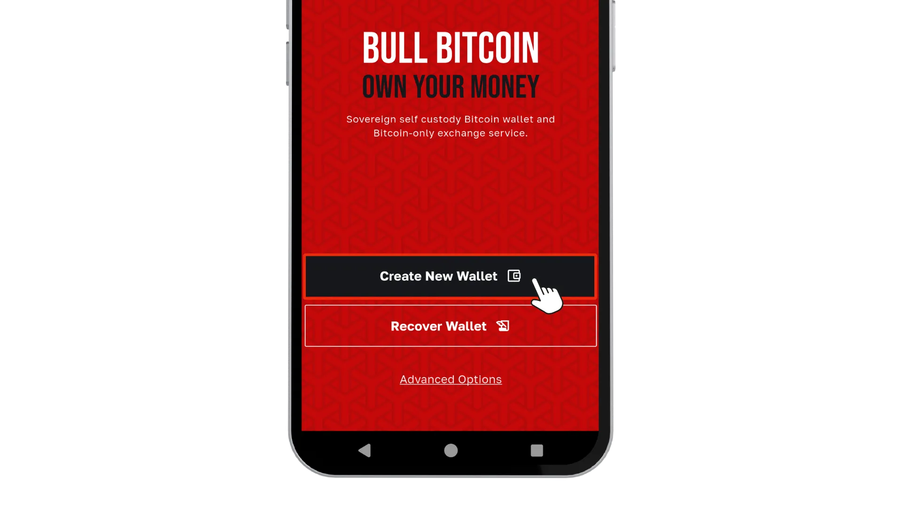


## 4️⃣ Начален екран


Преди да навлезем по-дълбоко, нека разгледаме `Home Screen` (Начален екран), за да се ориентираме:


- `преглед на транзакциите` и `меню за настройки` се намират в горната част.
- Балансът има опция за поверителност, която може да бъде включена или изключена.
- Осъществете достъп до `Bitcoin Bull Exchange`, за да `купите, продадете или платите` (това зависи от юрисдикцията и може да изисква KYC).
- `Трансфер` на средства между портфейли
- `Secure Bitcoin` е равно на Onchain Bitcoin Wallet
- `Незабавни плащания` чрез Lightning- / Liquid Network *(Забележка: Bull Bitcoin Wallet позволява да се извършват и получават плащания чрез Lightning. Средствата, получени чрез Lightning, се съхраняват в мрежата [*Liquid](https://liquid.net/) (в Wallet "Моментни плащания") благодарение на автоматична размяна чрез [*Boltz обмен](https://boltz.exchange/). Това ви дава възможност да взаимодействате с Lightning, без да се налага да управлявате каналите за ликвидност, като същевременно оставате в режим на самоохрана)*
- `Изпращане` и `Получаване` на средства


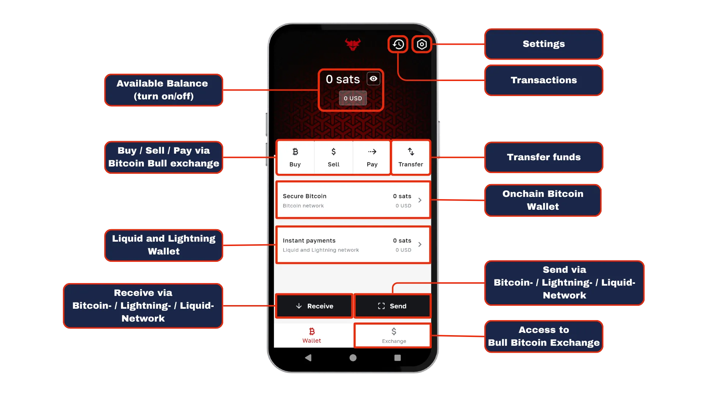


Първо, нека направим някои важни конфигурации и да започнем с `Backup`.


## 5️⃣ Резервно копие


За да започнете процеса на архивиране, докоснете иконата на "зъбчато колело (⚙)" в горния десен ъгъл на приложението и изберете `Wallet Backup`. Ще ви бъдат представени два метода за защита на вашия wallet: `Криптирано хранилище` и `Физическо резервно копие`. Нека разгледаме всеки от тях.


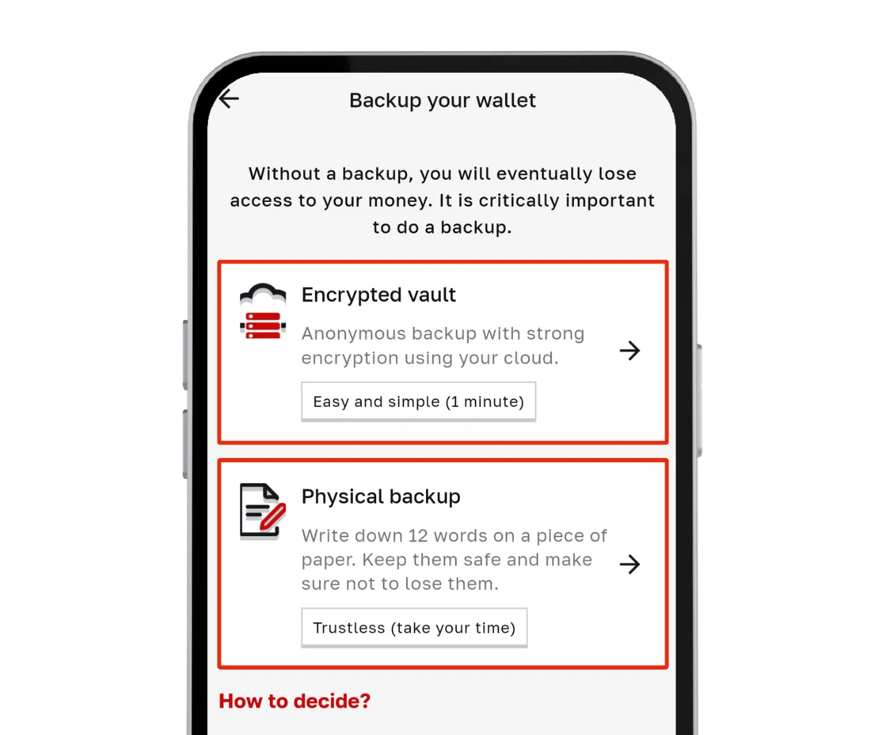


### Физическо резервно копие


Докоснете `Физическо архивиране`, за да видите списък с 12 думи, които представляват вашата фраза за възстановяване или seed. Моля, вземете предвид следното:


- Запишете своята "фраза за възстановяване" с най-голямо внимание. Запишете я на хартия или на метал и я съхранявайте на сигурно място (сейф, офлайн място). Тази фраза е единственото ви средство за достъп до вашите биткойни в случай на загуба на вашето устройство или изтриване на приложението.
- Важно е също така да се отбележи, че всеки, който разполага с тази фраза, може да открадне всичките ви биткойни. Никога не ги съхранявайте в цифров вид:
- Няма скрийншот
- Без резервни копия в облак, имейл или съобщения
- Няма копиране/вмъкване (риск от запазване в клипборда)


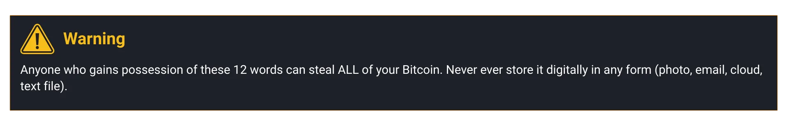


На следващия екран ще трябва да подредите думите в правилния ред, за да сте сигурни, че сте написали правилно фразата seed. Ще получите потвърждение, когато тестът приключи и е успешен.


! **Тази точка е от решаващо значение**. За допълнителна помощ :


https://planb.academy/tutorials/wallet/backup/backup-mnemonic-22c0ddfa-fb9f-4e3a-96f9-46e2a7954270

https://planb.academy/courses/46b0ced2-9028-4a61-8fbc-3b005ee8d70f

### Криптиран трезор


Има и възможност за криптирано анонимно архивиране в облака. Но нали в последния параграф споменахме, че архивирането в облак е рисковано и трябва да се избягва? Въпреки това екипът на Bull Bitcoin е разработил интелигентен начин да направи процеса безопасен. Ето как работи той:


`Recoverbull` е протокол за архивиране, който опростява защитата на вашия Bitcoin wallet, като разделя архивирането на две части. Първо, файлът за резервно копие на вашия wallet се криптира на вашето устройство с помощта на силен ключ за криптиране. Можете да запазите този криптиран файл, където пожелаете, например в Google Drive или на вашето устройство. Второ, ключът за криптиране, необходим за отключване на файла, се съхранява от сървъра за ключове на Recoverbull. За да възстановите своя wallet, се нуждаете както от криптирания резервен файл, така и от ключа, до който имате достъп с вашия ПИН код или парола. Тази конструкция гарантира, че само архивното ви копие в облака е безполезно и че само ключовият сървър е безполезен без вашия конкретен архивен файл. Това запазва средствата ви в безопасност, дори ако една от частите е компрометирана.


Мислете за него като за сейф. Криптираният файл за резервно копие е *кутията*, която можете да съхранявате навсякъде (например в Google Drive). Вашият ПИН код за възстановяване е *ключът*, който се съхранява отделно от сървъра за ключове на Recoverbull. За да я отвори, крадецът трябва да се сдобие както с конкретната ви кутия, така и с конкретния ви ключ. Този дизайн гарантира, че дори някой да се сдобие с вашия архивен файл, той е безполезен без ключа от сървъра, а ключът на сървъра е безполезен без вашия уникален архивен файл.


Научете повече за протокола за архивиране на wallet на `Recoverbull` [тук](https://recoverbull.com/).


Докоснете `Encrypted vault` и след това `Continue`, за да потвърдите използването на сървъра по подразбиране. Връзката ще бъде пренасочена през мрежата `Tor`, за да се гарантира поверителност и анонимност.


**Познаване на вашите ПИН кодове**


- пИН код за отключване на приложението**:** Незадължителният ПИН код, зададен в `Настройки > ПИН код за сигурност`, за да заключите приложението в телефона.
- `ПИН код за възстановяване`**:** Задължителният ПИН код, създаден по време на процеса на архивиране на `Енкриптиран трезор`, който се използва за декриптиране на архивния файл по време на възстановяването.


Това са два отделни ПИН кода. Не забравяйте ПИН кода за възстановяване, тъй като той е от съществено значение за възстановяването на вашия wallet."


**Настройка на ПИН за възстановяване:**


- Трябва да създадете ПИН код или парола, за да възстановите достъпа до вашия wallet.
- ПИН кодът/паролата трябва да е дълъг поне 6 цифри (например избягвайте прости последователности като 123456, които не се приемат).
- Без този ПИН код възстановяването на wallet е невъзможно.


След това изберете доставчик на трезор:


- `Google Drive` или
- "обичайно местоположение" (напр. вашето устройство)


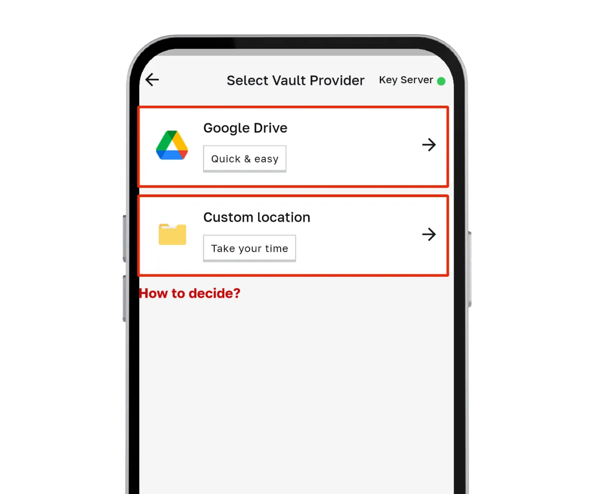


Сега запазете файла за резервно копие. След това докоснете `Тест на възстановяването`, изберете запазения резервен файл или трезор, след което докоснете `Декриптиране на трезора`. Въведете своя `PIN` или `Password`. Ако всичко е работило, ще се появи екранът `Тестът завърши успешно`.


### Етикети за внос/износ


Сега, след като създадохме нашия Backup, нека разгледаме `Labels`.  Bull Bitcoin wallet подобрява поверителността и организацията, като позволява на потребителите да създават персонализирани етикети за своите получаващи адреси и транзакции. Тези етикети ви помагат да категоризирате средствата си, тъй като транзакциите, изпратени на етикетиран адрес, ще наследят този етикет, а също така можете да етикетирате изходящи транзакции, за да проследите тяхната промяна. wallet напълно поддържа стандарта [BIP-329](https://bip329.org/), което означава, че можете да експортирате всичките си етикети във файл и да ги импортирате в друг wallet. Тази функция ви гарантира, че можете безпроблемно да архивирате историята на транзакциите и категоризациите си или да ги мигрирате между различни инстанции на wallet, без да губите персонализираната си организация.


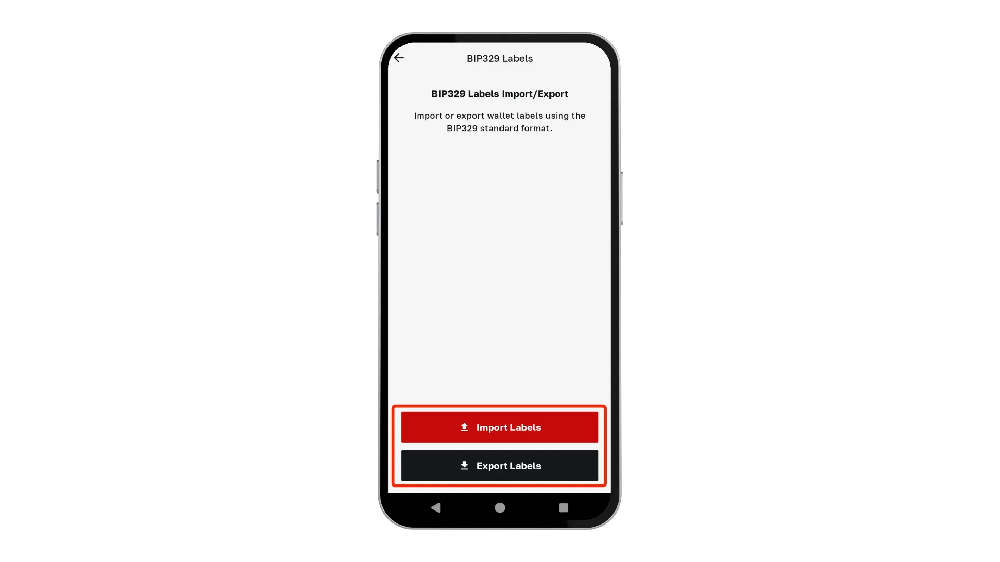


## настройки на 6️⃣


След като основното резервно копие е осигурено, нека разгледаме другите функции, налични в настройките.


### A - Осигуряване на достъп


За да защитите приложението, отидете в `Настройки` и изберете `ПИН за сигурност`, за да изберете ПИН код. Създайте силен ПИН код, за да заключите достъпа до вашия wallet. Въпреки че тази стъпка не е задължителна, тя е силно препоръчителна, за да се предотврати неоторизиран достъп, ако някой друг използва телефона ви.


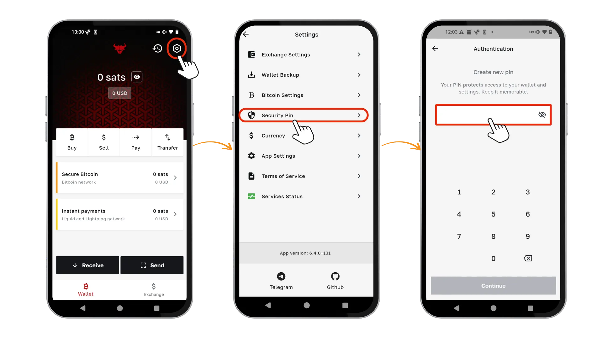


### B - Връзка с персонален възел (по избор)


BullBitcoin Wallet се свързва по подразбиране със сървъри Electrum: първият, управляван от Bull Bitcoin, и вторичен сървър от Blockstream, като и за двата се счита, че не съхраняват логове, което намалява риска от проследяване.


За по-голяма конфиденциалност можете да свържете приложението към свой собствен възел Bitcoin чрез сървър Electrum. За да направите това, докоснете `Настройки` > `Настройки на Bitcoin` > `Настройки на Electrum Server`, след което докоснете `+ Добавяне на потребителски сървър`, за да въведете адреса и идентификационните данни на вашия сървър.


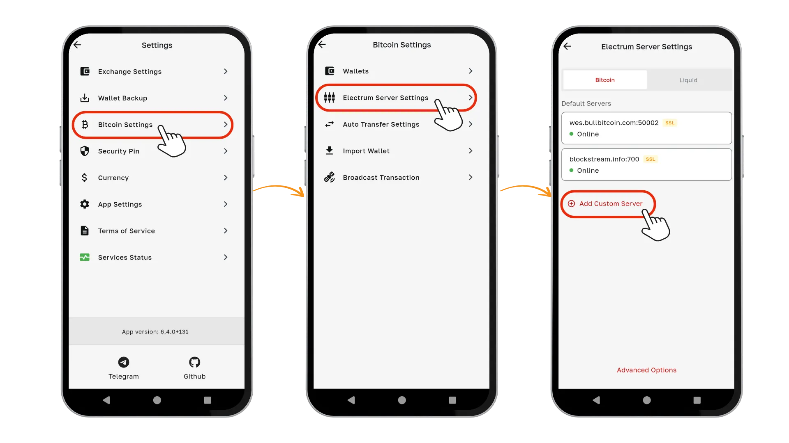


### C - Валута


Наличният баланс се показва на главния екран в `sats` и `USD`. За да промените това, отидете в `Настройки` > `Валута`. Там можете да превключвате между `sats/BTC` и да изберете Вашата `фактурна валута по подразбиране`.


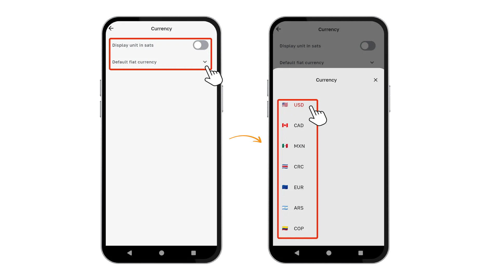


### D - Настройки на Bitcoin


Менюто `Bitcoin Settings` (Настройки на Bitcoin) предлага задълбочен достъп до основните конфигурации и данни на вашия wallet. Тук можете да проверите основните детайли на вашите `Secure Bitcoin` и `Instant payments wallets`, като ви предоставя пълна прозрачност и контрол. Основните функции в това меню включват:


- Подробности за Wallet:** Преминете към вашия защитен Bitcoin или wallet за незабавни плащания, за да видите конкретна информация.
- Пръстов отпечатък на Wallet:** Уникален идентификатор за вашия wallet.
- Публичен ключ (Pubkey):** Ключът, използван за получаване на адреси generate на вашия Bitcoin.
- Descriptor:** Техническо резюме на структурата на вашия wallet.
- Път за деривация:** Конкретният път, използван за generate на всички адреси от главния ви частен ключ.
- Address View:** Достъп до списък с неизползваните ви адреси за получаване и промяна на адреси (очаквайте скоро)


Освен това имате възможност да:


- `Активирайте настройките за автоматичен трансфер`, за да зададете максимален незабавен баланс в wallet, който след това ще бъде автоматично прехвърлен в сигурния биткойн wallet.
- Импортиране на общи портфейли чрез фразата `Mnemonic` или импортиране на `watch-only`
- Свързване на `Хардуерни портфейли`: в момента се поддържат следните устройства: ColdcardQ, SeedSigner, Specter, Krux, Blockstream Jade и Foundation Passport


## 7️⃣ Bull Bitcoin Exchange


Непосредствено от wallet имате достъп до борсата [Bull Bitcoin](https://www.bullbitcoin.com/), която ви позволява да купувате, продавате и плащате Bitcoin, без да напускате приложението. Тази интеграция осигурява удобно решение за управление на нуждите ви от Bitcoin. Моля, имайте предвид, че достъпът до борсата и нейните услуги може да бъде ограничен в зависимост от вашата юрисдикция и може да се наложи попълване на проверка "Познай своя клиент" (KYC), за да се спазят регулаторните стандарти и да се използват пълните функции на платформата.


За да започнете, докоснете `Exchange` в долния десен ъгъл, след което `Присъединете се` или `Влезте` в профила си.


Борсата предлага следните [функции](https://www.bullbitcoin.com/):


- Купете Bitcoin със самонаблюдение от банковата си сметка
- Без право на задържане
- Физически или юридически лица
- Незабавно изтегляне
- Без скрити такси
- Lightning Network на разположение
- Без ограничения на транзакциите
- Периодични опции за покупка


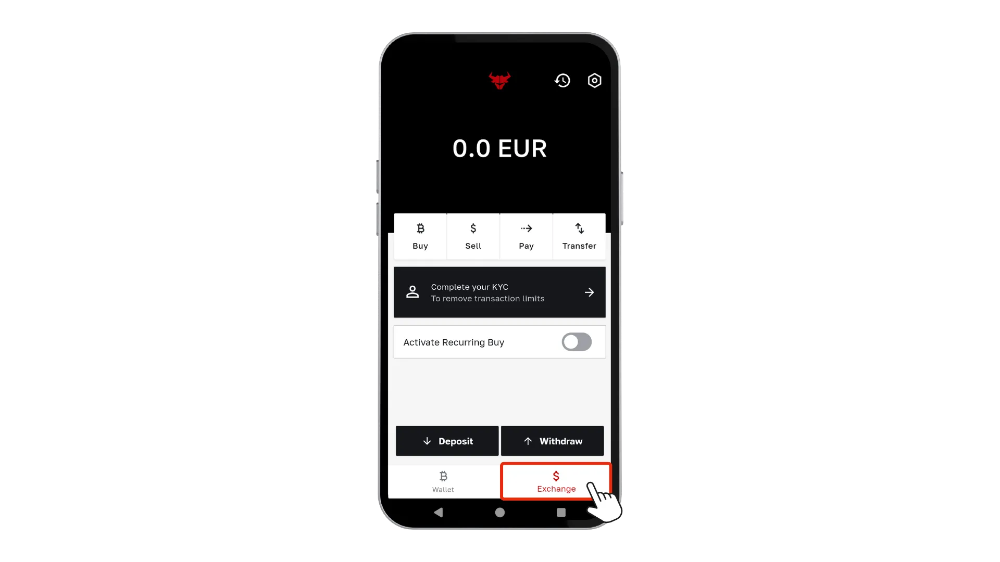


За да научите повече, посетете този урок:


https://planb.academy/en/tutorials/exchange/centralized/bull-bitcoin-europe-0ccf713e-efcd-44ec-8205-211f49ac7d53

## 8️⃣ Получаване на средства


Получаването на средства с **Bull Bitcoin Wallet** е лесно и гъвкаво, като поддържа три различни мрежи, пригодени за различни случаи на използване:


- Мрежата `Bitcoin (onchain)` за сигурно и дългосрочно съхранение.
- Мрежата `Liquid` за бързи и поверителни транзакции.
- Мрежата `Lightning` за незабавни и евтини плащания.


Приложението автоматично генерира подходящия адрес или фактура въз основа на избраната от вас мрежа. Ето как да процедирате за всяка мрежа.


### Получаване чрез Onchain (мрежа Bitcoin)


За да получавате средства от on-chain, можете да изберете `Сигурно Bitcoin Wallet` от началния екран и да докоснете `Приемане` или да докоснете главния бутон `Приемане` и след това да изберете мрежата `Bitcoin`.


Имате два основни режима за генериране на адрес за получаване:


**Режим по подразбиране (URI с допълнителни входни параметри)


По подразбиране wallet генерира [BIP21 URI](https://bips.dev/21/). Това е стандартизиран формат, който пакетира повече информация от обикновен адрес, включително сума, лична бележка и параметри на PayJoin за повишаване на поверителността. Този изчерпателен URI се кодира в QR код и се предоставя за копиране. Форматът изглежда по следния начин: `bitcoin:<адрес>?<параметър1>=<стойност1>&<параметър2>=<стойност2>`.


- Допълнителни входни параметри:**
    - Сума:** Посочете исканата сума в BTC, sats или фиатна валута.
    - Съобщение:** Добавете лична бележка, която ще бъде видима за подателя.
    - PayJoin:** Активирайте тази опция, за да подобрите поверителността чрез комбиниране на данни от изпращача и получателя в транзакцията.


Пример за URI:


```
bitcoin:bc1q0vv86t2sj7daduvdc50njms6u6jzh2y54xxxxx?amount=0.0005&message=Tip+for+tutorial&pj=HTTPS%3A%2F%2FPAYJO.IN%2F78UH9WZUP8KKJ%23RK1Q2H30FASCU9WW09DQY2LK0K8P2DPRJ99V72CA78ACQAEL675QYTMQ+OH1QYP87E2AVMDKXDTU6R25WCPQ5ZUF02XHNPA65JMD8ZA2W4YRQN6UUWG+EX1L0LYV6G
```


*Важна забележка: Моля, не изпращайте никакви средства на адресите в този урок, wallet ще бъде изтрит.*


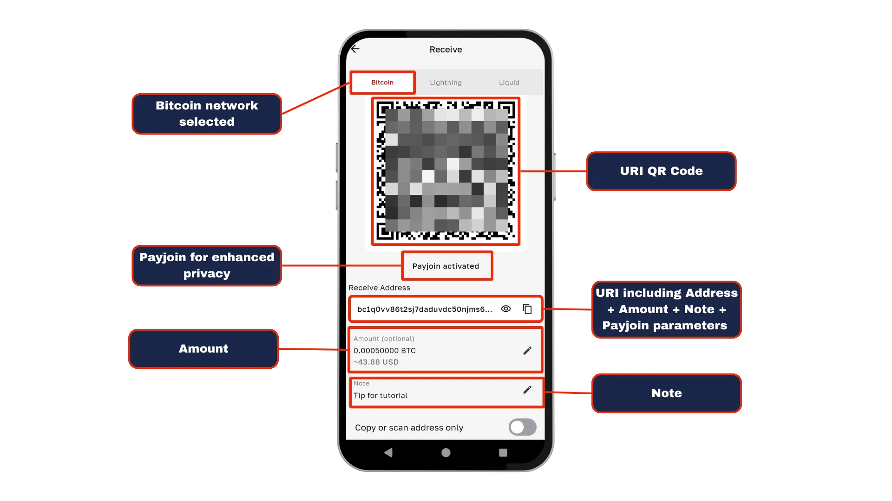


**Включена е опция за копиране или сканиране само на Address


Ако опцията `Копиране или сканиране само на Address` е разрешена, приложението генерира обикновен адрес Bitcoin във формат SegWit (bech32).


Пример:


```javascript
bc1q0vv86t2sj7daduvdc50njms6u6jzh2y54x3g56
```


Дори да въведете сума или бележка, те няма да бъдат включени в QR кода или копирания адрес.


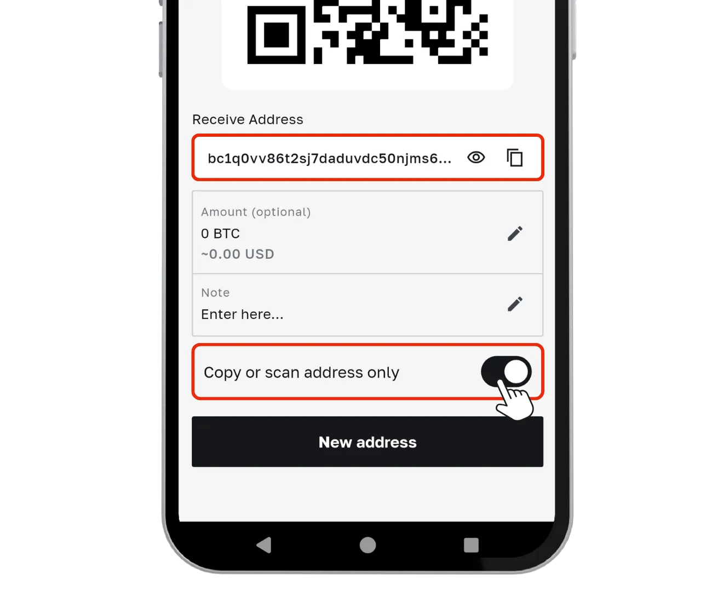


### Получаване чрез Liquid Network


Можете да получите плащане по Liquid Network. След като влезете в екрана `Приемане`, имате същите две възможности за генериране на заявка за плащане:


**1. Обикновен Address:** Копирайте стандартния адрес `Liquid`. Това е уникален идентификатор за вашия wallet в мрежата Liquid и не включва никаква конкретна сума или съобщение.


Пример Address:


```javascript
lq1qq05k3vmnvbullbitcoinjujn6h04z9jtw53xuyktqf9mam2zpfz05j2fe2x8xhejgkga3nvmp4yyp35qynkcw2xqmy7xxxxxxx
```


**2. Подробно искане за плащане (URI):** За по-структурирано искане можете да посочите сума и лична бележка. Тази информация автоматично се кодира в URI за споделяне и съответния QR код.


- Сума:** Можете да зададете сумата в Bitcoin (BTC), сатоси (Sats) или фиатна валута.
- Забележка:** Добавете лично съобщение за идентифициране на трансакцията.


**Пример на URI:**


```javascript
liquidnetwork:lq1qqdhgs7w537nun55a5sdy4gxkd08pclk3d7v4qz36sy4xp0cq6gvl52fcfv7kdgkgzmfycrud0zsygqgyjclycckpasxxxxxx?amount=0.00001&message=Test&assetid=6f0279e9ed041c3d710a9f57d0c02928416460c4b722ae3457a11eec381c526d
```


За да завършите транзакцията, предоставете на изпращача `адрес` или `УРИ`. Можете да направите това, като го копирате в клипборда си или като ги накарате да сканират QR кода директно от екрана ви.


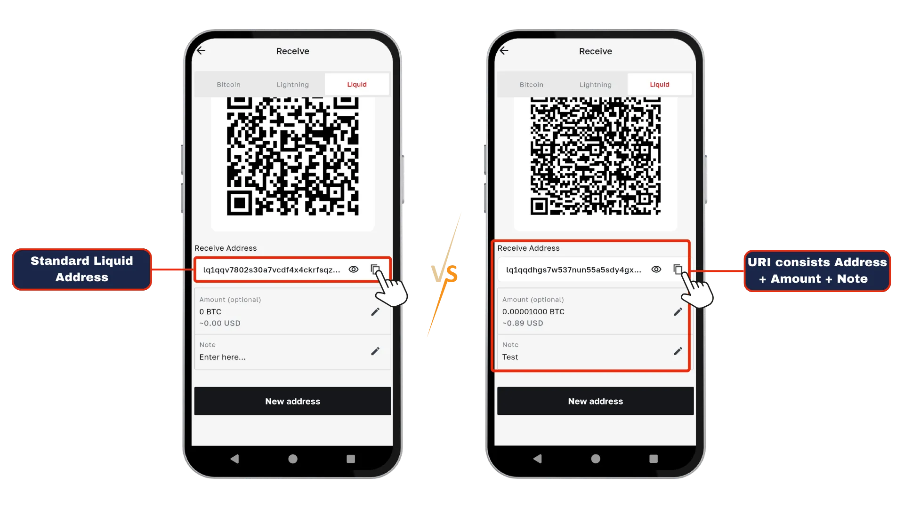


### Получаване чрез Lightning


Bull Bitcoin Wallet също така ви позволява да изпращате и получавате плащания чрез Lightning Network. Ключова функция е, че средствата, получени чрез Lightning, автоматично се разменят и съхраняват в Liquid Network в рамките на вашия Wallet за незабавни плащания. Тази услуга се поддържа от `Boltz`. Този дизайн ви позволява да се възползвате от скоростта и ниските разходи на Lightning без сложността на управлението на каналите за ликвидност, като същевременно поддържате пълно самостоятелно съхранение на вашите средства. Макар че този хибриден подход е самопопечителски и избягва сложността на управлението на каналите, той въвежда услуга на трета страна (Boltz), малка такса за суап и разчитане на федерацията от функционери на Liquid Network като титуляри, което е различно от традиционната, несамопопечителска Lightning wallet, при която управлявате собствените си канали. Можете да научите повече за Liquid и модела на управление тук:


https://planb.academy/en/courses/e17ee350-41d4-49fa-b270-29e4d26d22f8/overview-of-liquid-architecture-and-governance-model-17650c4b-cd1f-4bc6-b490-708f92dc9306


- Ограничения:**
    - Минимална сума:** Изисква се минимална сума на фактурата. Моля, проверете в приложението за текущия лимит
    - Такси:** Вие, получателят, плащате малка такса за размяна. Тази такса се приспада от сумата, която изпращачът превежда, и подлежи на промяна
- Предимства:**
    - Самостоятелно управление:** Вашите средства са винаги под ваш контрол, защитени в мрежата на Liquid.
    - Избягване на високите такси On-Chain:** Като използвате Lightning и съхранявате в Liquid, заобикаляте таксите on-chain, свързани с откриването на традиционен канал Lightning. Можете да изберете да прехвърлите средствата в канал on-chain по-късно, когато натрупаната сума оправдае разходите.
    - Съвет:** За най-изгодна трансакция между двама потребители на Bull Bitcoin използвайте директно мрежата **Liquid**, за да избегнете изцяло таксите за размяна на светкавици.


За да получите плащане, трябва да издадете generate фактура `Lightning`:


1. `Вписване на сума`**:** Посочете сумата, която искате да получите, в Bitcoin (BTC), сатоси (Sats) или фиатна валута.

2. `Добавяне на бележка` **(по избор):** Включете бележка или бележка. Тя ще бъде вградена във фактурата и показана в историята на транзакциите след приключване на плащането, което ще улесни идентифицирането му.

3. `Invoice Валидност`**:** Фактурата Lightning е чувствителна към времето и изтича след **12 часа**. Ако не бъде платена в рамките на този период, тя става невалидна и ще трябва да generate издадете нова.


Предоставете фактурата на изпращача, като я копирате в клипборда си или му позволите да сканира QR кода, показан на екрана ви.


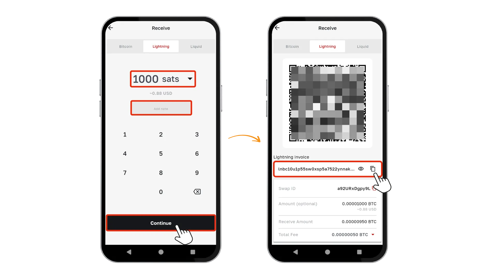


## 9️⃣ Изпращане на средства


Достъп до екрана за изпращане можете да получите директно от началната страница или от някой от портфейлите си. Bull Bitcoin Wallet опростява процеса, като автоматично открива мрежата на местоназначението - `Bitcoin`, `Liquid` или `Lightning` - въз основа на въведения от вас адрес или фактура, независимо дали са вмъкнати или сканирани чрез QR код.


### Предаване на On-Chain чрез мрежата Bitcoin


Изпращането на средства on-chain означава, че транзакцията ви се записва директно в блокчейна Bitcoin. Този метод е най-подходящ за по-големи преводи или преводи, които не зависят от времето. За да започнете, можете да докоснете бутона `Изпращане` долу вдясно и да сканирате или въведете `стандартен адрес на Bitcoin`.


Ако посоченият от вас адрес не включва конкретна сума, ще бъдете подканени да попълните данните на екрана за изпращане. Можете да посочите сумата в предпочитаната от вас единица, например BTC, сатоши или фиатен еквивалент. Също така имате възможност да добавите лична бележка, която представлява лична бележка за ваша собствена справка, за да ви помогне да идентифицирате транзакцията по-късно. Тази бележка не се споделя с получателя.


Обратно, ако искането за плащане, което сканирате или поставяте, вече съдържа всички необходими данни, като например BIP21 URI с предварително определена сума, wallet ще заобиколи екрана за въвеждане на данни и ще ви отведе директно до екрана за потвърждение, за да разрешите плащането.


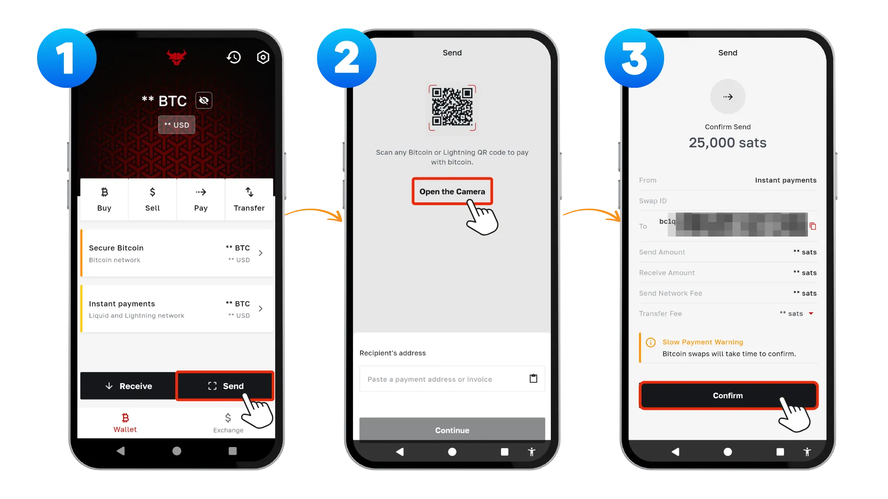


Преди транзакцията да бъде излъчена, ще се появи екран за потвърждение. Изключително важно е да отделите малко време и да прегледате внимателно всеки параметър, като обърнете специално внимание на адреса на получателя, изпращаната сума и мрежовите такси. Този екран също така предоставя мощни инструменти за персонализиране на вашата транзакция.


Можете да контролирате таксите по два основни начина. Първият метод е да изберете желаната скорост на транзакцията, например ниска, средна или висока, и wallet автоматично ще изчисли съответната такса за вас. Вторият метод позволява по-прецизен контрол, като ви позволява да зададете конкретна такса, или като абсолютна обща сума в сатоши, или като относителна ставка за байт, която след това осигурява приблизително време за потвърждение.


За напредналите потребители wallet предлага няколко настройки за фина настройка на операцията. по подразбиране е активирана функцията `Replace-by-Fee` (RBF), която е ценна функция, позволяваща ви да ускорите транзакция, ако тя заседне в мемпула, като я препредавате с по-висока такса. Можете също така ръчно да изберете от кои `Неизразходвани изходи на транзакции` (UTXO) да се изразходват средства. Това е мощен инструмент за консолидиране на UTXO - стратегия, при която комбинирате множество малки входове в един по-голям. Въпреки че това може да струва повече такси за текущата транзакция, то може значително да намали таксите за бъдещи транзакции, особено ако се очаква мрежовите такси да се повишат.


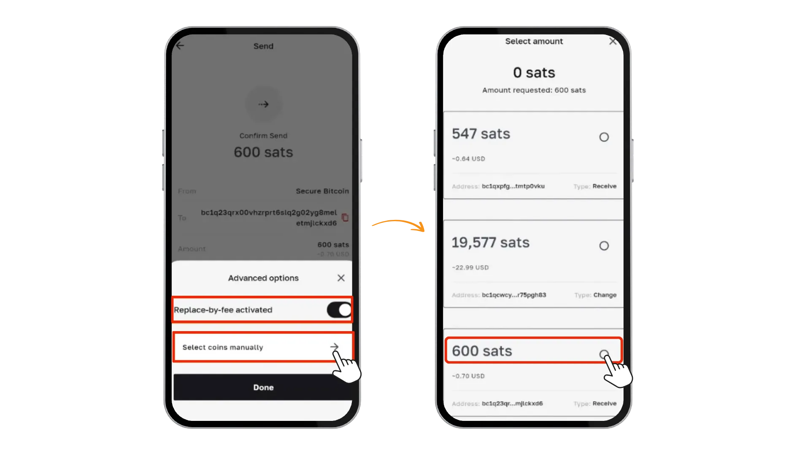


Опитът за PayJoin се извършва автоматично, когато сканирате заявка за плащане на получател (BIP21 URI), която включва параметър `pj=`. Ако просто поставите обикновен адрес без допълнителни параметри, тази функция няма да бъде активирана. Този съвместен метод подобрява поверителността чрез комбиниране на входните данни от изпращача и получателя, като нарушава евристиката на общата собственост на входните данни и позволява по-добро мащабиране, а при някои обстоятелства и спестяване на такси.


### Изпращане към Liquid Network


Моделът `Liquid Network` е предназначен за бързи и поверителни транзакции с минимални такси. Когато изпращате средства чрез Liquid, те се изтеглят от вашия `Instant Payments Wallet`. Процесът е прост: просто въвеждате или сканирате адреса на получателя `Liquid`.


Ако в адреса не е посочена сума, ще бъдете помолени да я посочите на екрана за изпращане. Можете да въведете сумата в BTC, сатоши или фиат. Ключово предимство на Liquid е нейният нисък минимален праг. Както при трансакциите on-chain, можете да добавите незадължителна лична бележка за собствените си записи. Ако заявката за плащане вече включва сума, wallet ще премине директно към екрана за потвърждение.


На екрана за потвърждение на транзакция Liquid ще прегледате подробностите. Таксите са забележително ниски и се изчисляват въз основа на сложността на транзакцията. Обикновено те са около 0,1 сат/ВВ, което за обикновена транзакция възлиза на едва 20-40 саттоши (например 26 саттоши към 21 декември 2025 г.).


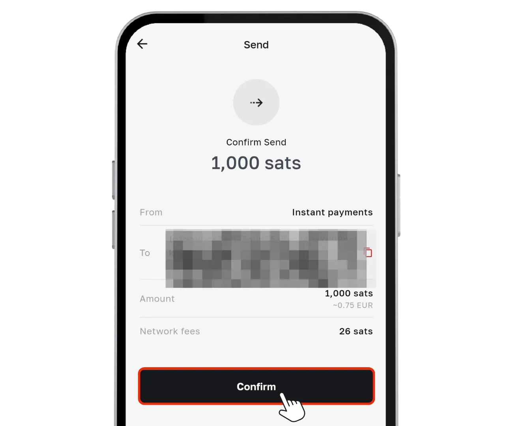


### Изпращане към Lightning Network


Можете да сканирате светкавица Address (напр. `runningbitcoin@rizful.com`), която ви позволява да зададете сумата и незадължителна бележка за получателя, или да сканирате фактура с предварително определена сума, която ви отвежда директно към екрана за потвърждение.


*Имайте предвид, че се прилагат минимални суми и такси.*


Bull Bitcoin Wallet изпраща светкавични плащания, като изтегля средства от вашия Wallet (на Liquid) и ги разменя чрез `Boltz`. Този хибриден подход е напълно самостоятелен и избягва високите такси на on-chain за управление на специализиран Lightning канал, но изисква заплащане на `такса за размяна`. За най-ниска цена изпращайте директно на адреса Liquid на получателя, ако той използва и Bull Bitcoin wallet.


## 🔟 Прехвърляне на средства между портфейлите ви


Bull Bitcoin ви позволява да премествате вашия Bitcoin между вашия `Защитен Bitcoin` wallet и вашия `Незабавен Wallet` на Liquid Network или към `Външен Wallet`. За да извършите прехвърляне, просто преминете към раздела `Прехвърляне`, изберете портфейлите източник и дестинация, въведете сумата, която искате да преместите, и потвърдете транзакцията.


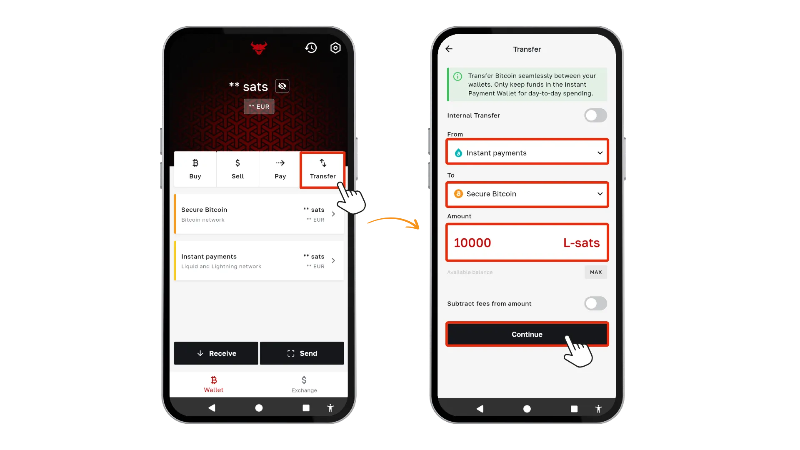


## 1️⃣1️⃣ Възстановяване на вашия Bull Bitcoin Wallet


В този раздел е обяснено как да възстановите достъпа си до средствата на Bull Bitcoin Wallet, ако загубите устройството си, деинсталирате приложението или просто трябва да преминете към ново устройство. Както вече беше обяснено, има два основни метода за възстановяване: използване на уникалния метод `Recoverbull` и използване на стандартната фраза `BIP39 seed`.


### Метод 1: Recoverbull


Обобщение: Резервните копия на Wallet се криптират локално. Криптираният файл може да се съхранява в облачно хранилище или на друго устройство. Ключът за криптиране се съхранява от сървъра за ключове на Recoverbull. И двете се съхраняват отделно и трябва да се комбинират, за да се възстанови wallet.


Като начало ще изтрия Wallet с всички средства в него и ще инсталирам отново wallet. Ще се озовем отново на екрана "Добре дошли". Този път изберете опцията `Възстановяване на Wallet`. След това преминете към метода `Криптиран трезор`, потвърдете използването на `Сервър с ключ по подразбиране` и изберете местоположението или `Предоставчик на трезор`, където сте съхранили резервния файл.


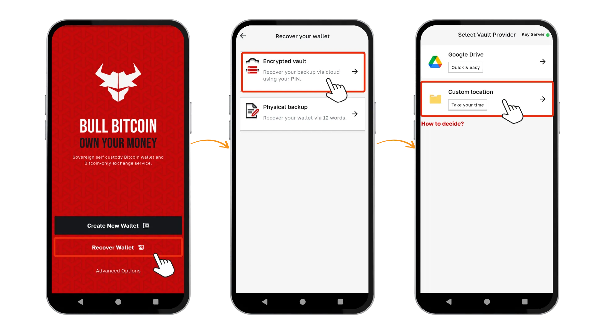


В него се посочва, че трезорът е бил успешно импортиран. Докоснете бутона `Декриптиране на трезора` и въведете `PIN`. Следващият екран ще покаже Вашите `баланси` и `броя на транзакциите`, които са били възстановени.


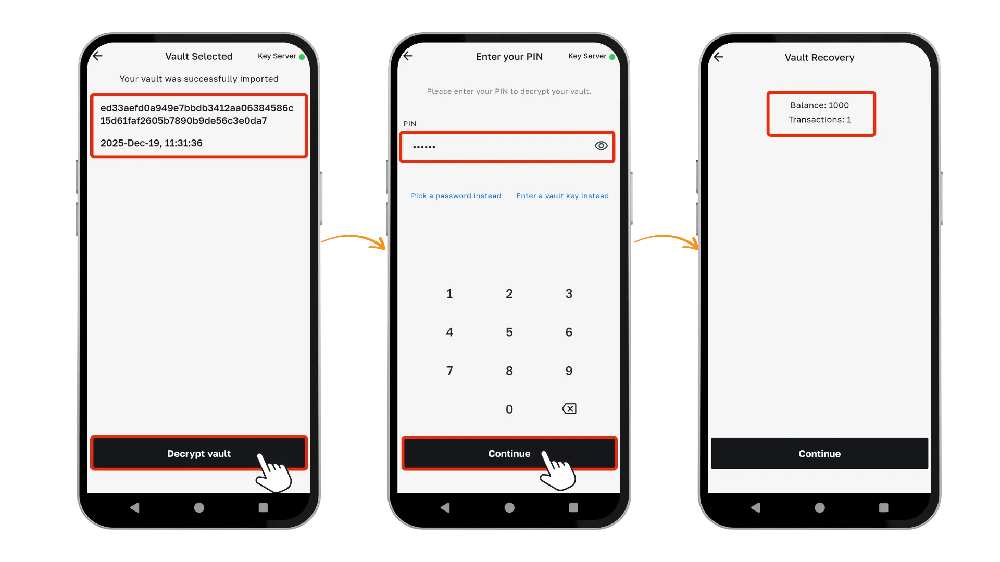


### Метод 2: изходна фраза


При този метод се използва основната фраза за възстановяване на wallet - стандартен списък от 12 думи, който служи като най-добро резервно копие на вашите средства. Това е най-универсалният начин за възстановяване на Bitcoin wallet, тъй като не е обвързан с конкретна услуга или сървър. Стига да разполагате с тази фраза, можете да възстановите wallet на всяко съвместимо устройство, дори и без достъп до ключовия сървър на Bull Bitcoin.


От екрана "Добре дошли" изберете `Recover Wallet`. Този път изберете метода `Физическо архивиране`. Приложението ще представи мрежа от думи. Внимателно изберете всяка дума от 12-те думи на вашата фраза seed в правилния ред. Бъдете педантични, тъй като една-единствена грешка ще доведе до неправилна wallet.


## 1️⃣2️⃣ Свързване на Hardware Wallet


За най-високо ниво на сигурност много потребители на Bitcoin избират да съхраняват средствата си в "хладилна камера". Това означава, че съхранявате `частните ключове`, които управляват вашия Bitcoin, на устройство, което никога не е свързано с интернет. Хардуерният wallet (или подписващо устройство) е специализирано физическо устройство, предназначено точно за тази цел. То действа като цифрово хранилище за вашите ключове, като гарантира, че те никога няма да бъдат изложени на потенциалните заплахи на онлайн компютър или смартфон.


Чрез свързване на хардуерен wallet към приложението Bull Bitcoin получавате най-доброто от двата свята: безкомпромисната сигурност на студеното съхранение на вашите частни ключове, съчетана с мощните функции и удобния за потребителя интерфейс на Bull Bitcoin wallet за преглед на салдата и управление на трансакциите. В тази последна глава ще ви покажем как да свържете хардуерен wallet, например [Coldcard Q](https://coldcard.com/q), към вашия Bull Bitcoin wallet. Това ръководство няма да разглежда задълбочено настройката на Coldcard Q; можете да научите за това тук:


https://planb.academy/en/tutorials/wallet/hardware/coldcard-q-73e86d1a-6fe6-4d8b-bb15-8690298020e3

https://planb.academy/en/tutorials/wallet/hardware/coldcard-q-advanced-b8cc3f29-eea9-48fe-a953-b003d5b115e0

### Импортиране на Wallet


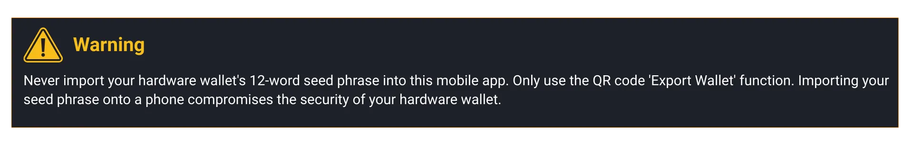


Първо, от главното меню на вашата Coldcard Q изберете `Export Wallet`, след което изберете `Bull Wallet`. Вашата Coldcard ще generate QR код.


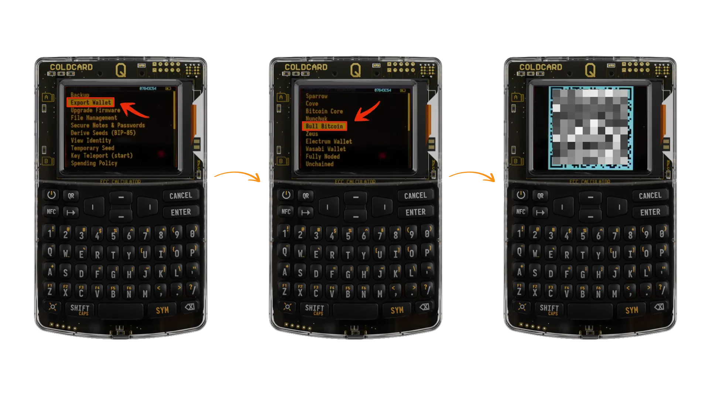


Отворете Bull Bitcoin Wallet и отидете до `Настройки` > `Настройки на Bitcoin` > `Импортиране на wallet` и изберете `Количка Q` на телефона си и докоснете `Отваряне на камерата`, за да сканирате този QR код, за да импортирате публичните ключове на вашия хардуер wallet.


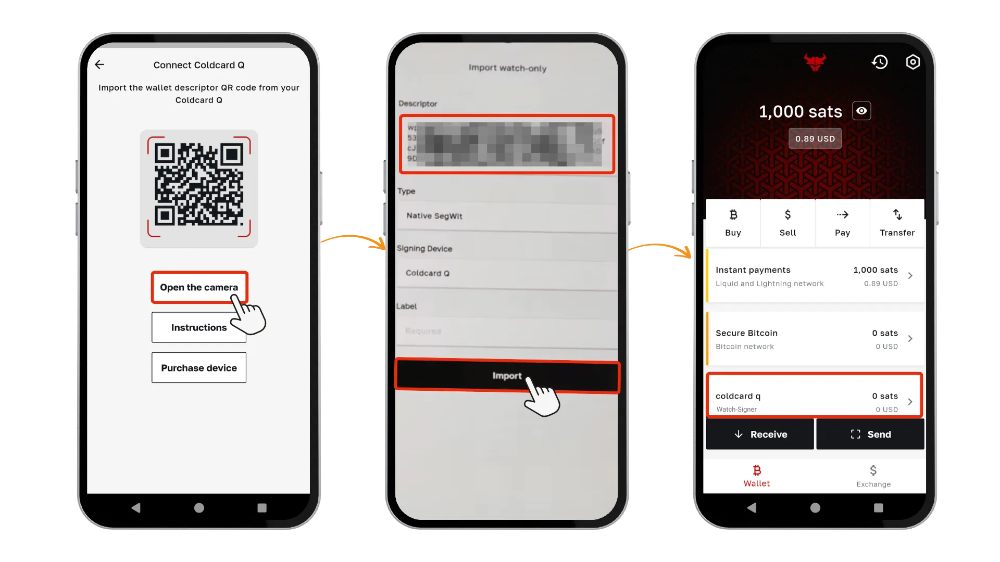


### Получаване с Coldcard Q


За да получавате Bitcoin, като използвате свързаната Coldcard Q, не е необходимо устройството да е физически свързано с телефона ви. Bull Bitcoin Wallet вече е импортирал необходимите публични ключове, което му позволява да generate адреси самостоятелно.


1. Докоснете внесеното от вас устройство за подписване на Coldcard Q и изберете `Получаване`.

2. Приложението автоматично ще покаже нов Bitcoin адрес от wallet на вашата Coldcard.

3. Използвайте този адрес, за да получавате средства. Bitcoin ще бъде подсигурен директно към ключовете на хардуерния wallet, въпреки че устройството е било офлайн по време на процеса.


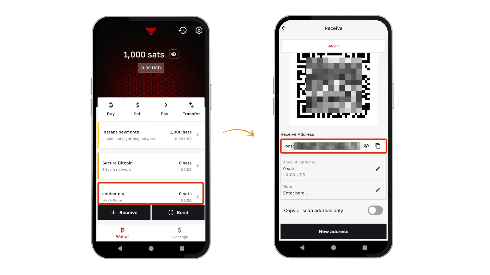


### Изпращане с Coldcard Q


Изпращането на Bitcoin с вашата Coldcard Q изисква вашето физическо потвърждение, за да разрешите всяка транзакция. Въпреки че приложението Bull Wallet се използва за изграждане на транзакцията, окончателният подпис може да бъде създаден само на самия хардуер wallet.


За да започнете, отворете вашия wallet с `Coldcard Q` и докоснете `Send`. След това `отворете камерата`, за да сканирате QR кода за адреса на получаване. След като сканирате, въведете `сумата`, която искате да изпратите, и регулирайте `приоритета на таксата`, ако е необходимо.


За повече опции можете да потърсите в раздел Разширени настройки. Тук ще намерите опцията `Замяна с такса` (RBF), която е активирана по подразбиране и ви позволява да ускорите заседнала транзакция по-късно. Разполагате и с опцията `Coin Control`, която ви позволява ръчно да изберете конкретните UTXO, които искате да похарчите.


След като прегледате всички детайли, докоснете `Показване на PSBT`, за да подготвите транзакцията.


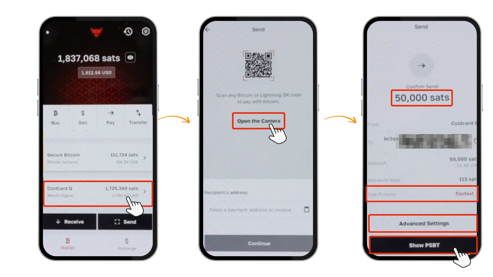


Докоснете бутона `Scan` на Coldcard Q и използвайте камерата му, за да сканирате QR кода, показан на телефона ви. След това на екрана на Coldcard ще видите всички подробности за транзакцията. Внимателно проверете сумата, адреса на получателя и вашия адрес за промяна. Ако всичко е правилно, натиснете бутона `Enter` на Coldcard Q, за да подпишете транзакцията. След това на екрана ще се появи QR код на подписаната транзакция.


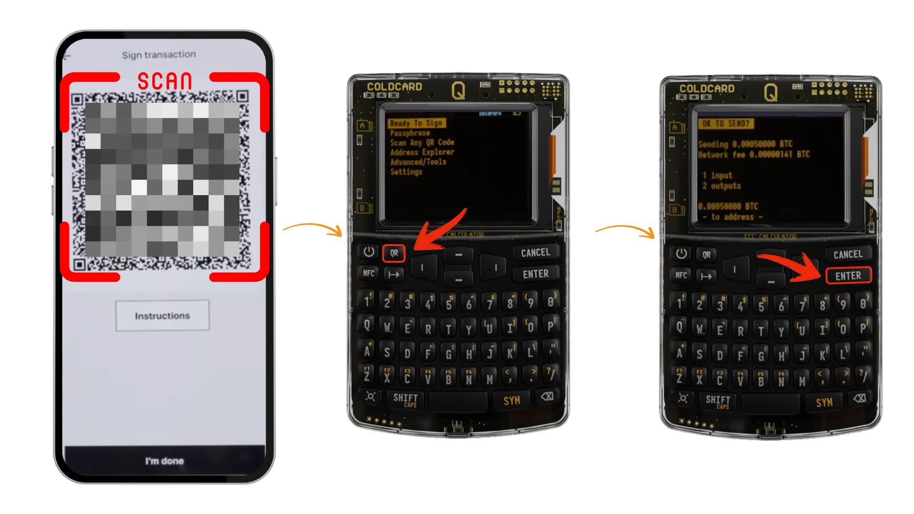


На Bull wallet докоснете `Свърших`, след което докоснете бутона `Камера`, за да сканирате QR кода на `подписаната транзакция` от вашата Coldcard Q. Сега Bull Wallet ще покаже обобщен екран на подписаната транзакция. Прегледайте я за последен път, след което докоснете `Излъчване на транзакция`. По този начин процесът се финализира, като транзакцията се изпраща в мрежата на Bitcoin, и средствата ви ще бъдат на път.


## 🎯 Заключение


Вече завършихте пътуването си в Bull Bitcoin Wallet. Приложението предоставя мощни инструменти за защита на личните данни и сигурност на върха на пръстите ви, като прави разширените функции лесни за използване. То ви помага да запазите поверителността си с функции като `PayJoin`, която скрива транзакциите ви в блокчейна, и `Tor integration`, която маскира мрежовата ви активност от любопитни очи. За тези, които искат максимален контрол, можете да се свържете със своя `собствен личен възел Bitcoin`, за да спрете да разчитате на сървъри на трети страни, и да използвате `хардуерен wallet`, за да запазите частните си ключове напълно офлайн и в безопасност. С интелигентни опции за архивиране и безпроблемна поддръжка на Bitcoin, Liquid и Lightning, Bull Bitcoin Wallet е силен, универсален избор за всеки, който сериозно иска да запази средствата си частни, сигурни и изцяло под свой контрол.


## 📚 Ресурси на Bull Wallet


[Github](https://github.com/SatoshiPortal/bullbitcoin-mobile) | [Уебсайт ](https://www.bullbitcoin.com/)| [Recoverbull](https://recoverbull.com/)