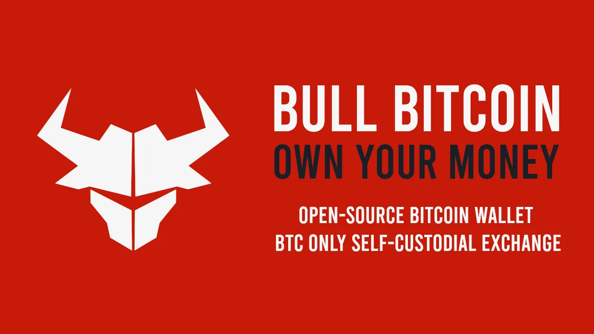


В этом руководстве вы узнаете, как установить, настроить и использовать Bull Bitcoin Mobile. Вы узнаете, как получать и отправлять средства в трех сетях: onchain, Liquid и Lightning, а также как переносить Bitcoin из одной сети в другую. В приложениях вы найдете ресурсы и контакты, справочную информацию и краткие объяснения технических концепций.


## Введение


**Bull Bitcoin Mobile**, разработанная **[Bull Bitcoin](https://www.bullbitcoin.com/)** ([создать аккаунт](https://app.bullbitcoin.com/registration/orangepeel)), представляет собой **самостоятельную** Bitcoin Wallet, что означает полный контроль над вашими приватными ключами и, следовательно, вашими средствами, без зависимости от третьей стороны. С открытым исходным кодом, основанный на философии Cypherpunk, этот Wallet сочетает в себе простоту, конфиденциальность и расширенные возможности, такие как кросс-сетевые свопы и поддержка PayJoin. Он позволяет управлять вашими биткойнами в трех сетях: **Bitcoin onchain**, **Liquid** и **Lightning**, каждая из которых предназначена для конкретных целей.


### Контекст развития


Wallet отвечает на серьезную проблему: Сетевые тарифы Bitcoin не подходят для небольших платежей или для открытия небольших самостоятельных каналов Lightning. Wallet Bull Bitcoin Mobile предлагает самостоятельное решение, опираясь при этом на 3 основные сети Bitcoin:


- Сеть Bitcoin (onchain)**: Идеально подходит для средне- и долгосрочного хранения UTXO и транзакций на крупные суммы, где комиссии пропорционально незначительны.
- Liquid Network**: Предназначен для быстрых (~2 минуты), более конфиденциальных (скрытые суммы), недорогих транзакций, идеально подходит для накопления небольших сумм или защиты вашей частной жизни.
- Сеть Lightning**: Оптимизирована для мгновенных и недорогих платежей, подходит для ежедневных транзакций малой и средней стоимости.


Например, с помощью Bull Bitcoin Mobile вы можете накапливать небольшие суммы в портфелях **Liquid** или **Lightning**, а затем, когда вы достигнете значительной суммы, вы можете :


- Передача в сеть onchain для безопасного средне- или долгосрочного хранения, с улучшенной конфиденциальностью с помощью Liquid и/или Lightning, а также с оплатой onchain за одну транзакцию


### Непрерывная эволюция


Wallet постоянно развивается, поэтому не удивляйтесь, если обнаружите несоответствия между этим руководством и вашим современным приложением.


- Например, по состоянию на 19.07.2025 кнопки **"Купить / Продать / Оплатить "** видны, но выделены серым цветом, поскольку эти опции, доступные на Exchange [bullbitcoin.com](https://app.bullbitcoin.com/registration/orangepeel), вскоре будут интегрированы в единый интерфейс. Их использование останется совершенно необязательным. В настоящее время ведутся или планируются многие другие разработки: управление несколькими Wallet, passphrase, совместимость с аппаратными кошельками...
- На [BullBitcoin GitHub](https://github.com/orgs/SatoshiPortal/projects/49) вы можете ознакомиться с текущими темами и предстоящими разработками. Поскольку проект на 100 % состоит из открытого исходного кода и "строится на публике", вы также можете присылать нам свои предложения и любые ошибки, с которыми вы столкнулись.


## 1. Пререквизиты


Перед началом использования **Bull Bitcoin Mobile** убедитесь, что у вас есть следующие предметы:


- Совместимый смартфон**: Устройство **iOS** (iPhone или iPad) или **Android**
- Подключение к Интернету
- Надежные носители резервных копий**: Запишите **фразу восстановления** (12 слов) на бумаге или металле и храните ее в надежном месте.
- Базовые знания**: Минимальное понимание концепций Bitcoin (адреса, транзакции, комиссии) будет полезным, хотя в этом руководстве каждый шаг объясняется для новичков.


## 2. Установка


- Загрузите приложение** :
 - [Google Play Store](https://play.google.com/store/apps/details?id=com.bullbitcoin.mobile&pcampaignid=web_share)** Скачать из магазина приложений для устройств Android
 - [GitHub](https://github.com/SatoshiPortal/bullbitcoin-mobile/releases) Скачать APK для устройств Android напрямую**
 - [iOS](https://testflight.apple.com/join/FJbE4JPN)** Скачать через TestFlight для устройств Apple
 - Проверьте имя разработчика (Bull Bitcoin), чтобы избежать мошенничества.
 - Убедитесь, что загруженная версия соответствует последней стабильной версии, указанной на GitHub.
 - Bull Bitcoin Mobile является **открытым исходным кодом**. Для просмотра кода: [BullBitcoin GitHub](https://github.com/orgs/SatoshiPortal/projects/49)


- Установите приложение


## 3. Начальная конфигурация


### 3.1 Запустите приложение :


В приложении используется уникальная фраза восстановления из 12 слов для обоих портфолио:


 - безопасный Bitcoin' Wallet**: Для транзакций в сети Bitcoin (onchain)
 - мгновенные платежи" Wallet**: Для мгновенных транзакций в сетях Liquid и Lightning


При открытии вам будет предложено импортировать существующую фразу восстановления или создать новую Wallet:


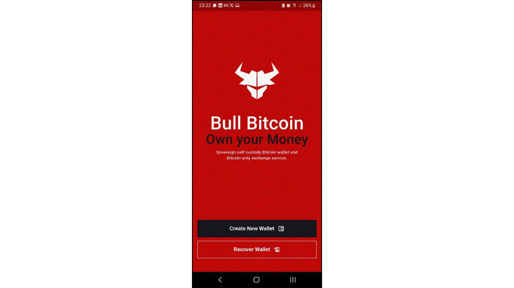


### 3.2 Фраза восстановления :


Если вы хотите повторно использовать существующий Wallet, нажмите на "**Восстановить Wallet**" и введите 12 слов фразы для восстановления.


В противном случае нажмите "**Создать новый Wallet**" :


- Запишите свою фразу восстановления с особой тщательностью. Запишите ее на бумаге или металле и храните в безопасном месте (сейф, автономное место). Эта фраза - единственное средство доступа к вашим биткоинам в случае потери устройства или удаления приложения.
- Также важно отметить, что любой человек с такой фразой может украсть все ваши биткоины. Никогда не храните их в цифровом виде:
 - Нет скриншота
 - Резервное копирование в облаке, по электронной почте или через обмен сообщениями отсутствует
 - Нет копирования/вставки (риск сохранения в буфер обмена)


**! Этот момент является критическим**. Для получения дополнительной помощи :


https://planb.network/tutorials/wallet/backup/backup-mnemonic-22c0ddfa-fb9f-4e3a-96f9-46e2a7954270

https://planb.network/courses/46b0ced2-9028-4a61-8fbc-3b005ee8d70f

### 3.3 Защита доступа :


- Перейдите в настройки и нажмите на **PIN-код**.
- Установите надежный **PIN-код** для защиты доступа к приложению.
- Этот шаг необязателен, но настоятельно рекомендуется, чтобы никто, имеющий доступ к вашему телефону, не смог получить доступ к вашему Wallet.


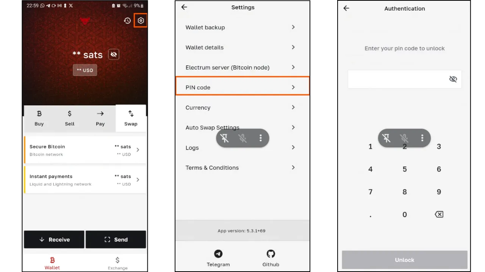


### 3.4 Подключение к персональному узлу (опционально):


Wallet BullBitcoin по умолчанию подключается к серверам Electrum: первому, управляемому Bull Bitcoin, и второму серверу Blockstream, оба из которых, как считается, не ведут никаких логов, что снижает риск отслеживания.


Для большей конфиденциальности вы можете подключить приложение к собственному узлу Bitcoin через сервер Electrum (инструкции доступны на [BullBitcoin's GitHub](https://github.com/orgs/SatoshiPortal/projects/49) ).


## 4. Получение средств


Получение средств с помощью **Bull Bitcoin Mobile** просто и соответствует вашим потребностям, независимо от того, используете ли вы :


  - сеть **Bitcoin (onchain)** для долгосрочного сохранения,
  - сеть **Liquid** для быстрого и более быстрого Confidential Transactions,
  - сеть **Lightning** для мгновенных платежей с низкой стоимостью.


Приложение автоматически генерирует адреса Lightning reception или Invoice, в зависимости от выбранной сети. Ниже описано, как действовать для каждой сети.


### 4.1. onchain (сеть Bitcoin)


На главном экране можно :


- или выберите **Secure Bitcoin Wallet**, затем нажмите "**Получить "** :


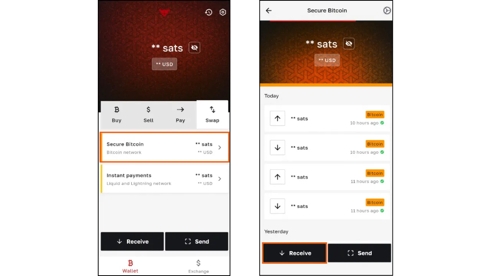


- или нажмите "**Принять "**, а затем выберите сеть **Bitcoin**:


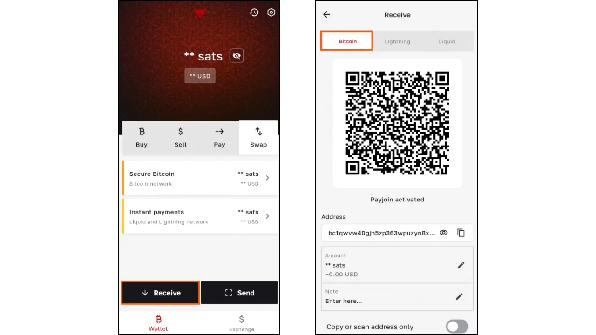


#### 4.1.1. Опция "Только копирование или сканирование Address" отключена (по умолчанию)


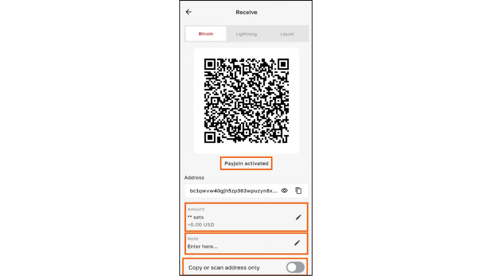


- Это дает доступ к дополнительным параметрам. Вы можете указать :
 - Сумма** в BTC, Sats или фиате.
 - **личная записка**, которая будет включена в копию URI / QR-кода.
 - Активация **PayJoin** (подробнее см. в Приложении 3), которая повышает конфиденциальность за счет объединения записей об отправителе и получателе.


- Пример автоматически сгенерированного URI** :


```
bitcoin:bc1qyv76arrcu7bullbitcoin9mgugjvcgelcjfcycjq?amount=2.1e-7&message=Exemple+de+note&pj=HTTPS%3A%2F%2FPAYJO.IN%2FUJA9LJ6L4CMHY%23RK1QT3YSGFC6PMKRUXND2DSGQMLESTUNH29AY0305XAQ678742CVT5ES+OH1QYP87E2AVMDKXDTU6R25WCPQ5ZUF02XHNPA65JMD8ZA2W4YRQN6UUWG+EX1RRH8C6Q
```


- Использование**: Скопируйте URI, чтобы поделиться с отправителем, или позвольте ему отсканировать QR-код.


#### 4.1.2. Включена опция "Только копирование или сканирование Address"


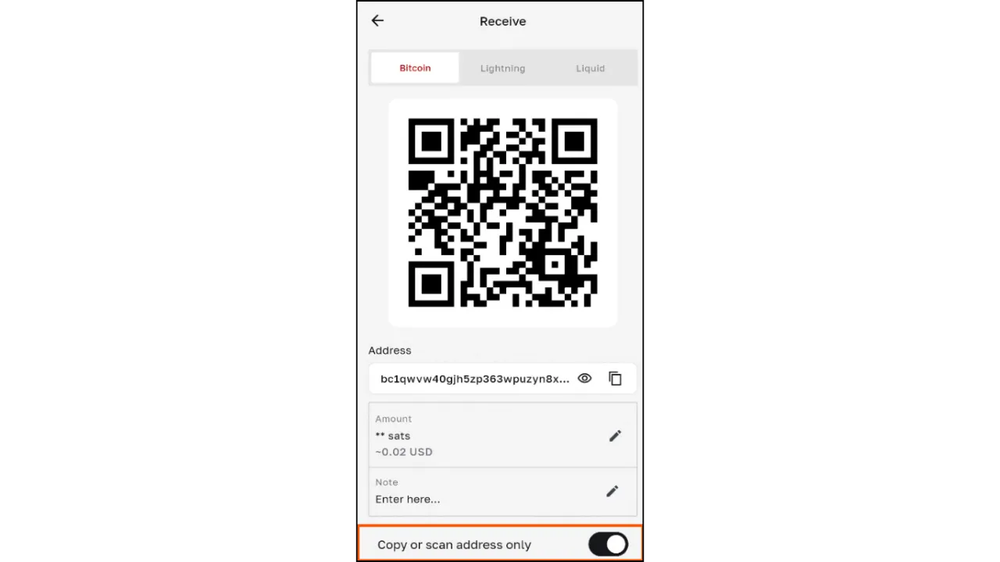


- При включенной опции **"Копировать или сканировать только Address"** приложение генерирует простой Bitcoin Address в формате SegWit (bech32).


- Пример:


```
bc1qyv76arrcu7bullbitcoin9mgugjvcgelcjfcycjq
```


Даже если вы введете сумму или примечание, они не будут включены в QR-код или в копию Address


- Использование**: Скопируйте Address, чтобы поделиться им с отправителем, или позвольте ему отсканировать QR-код.


#### 4.1.3. Генерация нового Address


- Зачем использовать новый Address для каждой транзакции? Это **защищает вашу конфиденциальность**, предотвращая привязку нескольких платежей к одному и тому же Address, и ограничивает возможности отслеживания на Blockchain.
 - По умолчанию Bull Bitcoin автоматически генерирует неиспользуемый Address.**
 - Вы можете принудительно создать новый Address, нажав на **"New Address"** в нижней части экрана.
 - Все ваши адреса привязаны к фразе seed: независимо от того, сколько адресов вы используете, ваш портфель будет отображать единый баланс и может автоматически консолидировать средства при отправке.


- Совет: Всегда используйте новый Address**, предоставляемый Bull Bitcoin, если только у вас нет особой необходимости (например, публичный Address для приема пожертвований).


### 4.2. Liquid


На главном экране можно :


- или выберите **Мгновенные платежи Wallet**, затем нажмите на **"Получить "**, затем **"Liquid"**:


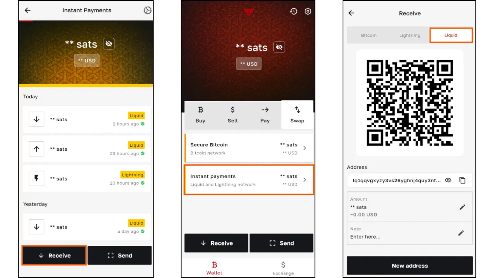


- или нажмите "**Принять "**, а затем выберите сеть **Liquid**:


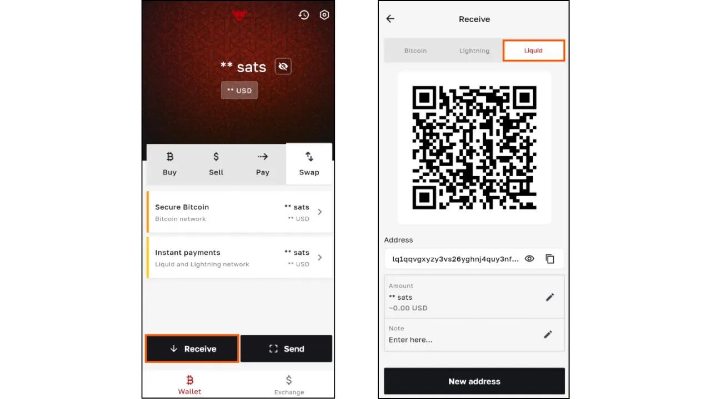


Оказавшись на экране **"Получить "**, скопируйте Liquid Address:


- Без суммы или примечания. Пример:


```
lq1qq05k3vmnvbullbitcoinjujn6h04z9jtw53xuyktqf9mam2zpfz05j2fe2x8xhejgkga3nvmp4yyp35qynkcw2xqmy7x53ahpz
```


- Или указав **сумму** (в BTC, Sats или фиате) и/или **личную заметку**, которая будет включена в копию URI / QR-кода. Пример:


```
liquidnetwork:lq1qq05k3vmnvbullbitcoinjujn6h04z9jtw53xuyktqf9mam2zpfz05j2fe2x8xhejgkga3nvmp4yyp35qynkcw2xqmy7x53ahpz?amount=2.1e-7&message=Test+de+note+Liquid&assetid=6f0279e9ed041c3d710a9f57d0c02928416460c4b722ae3457a11eec381c526d
```


**Использование**: Скопируйте Address/URI, чтобы поделиться с отправителем, или позвольте ему отсканировать QR-код.


### 4.3. Молния


На главном экране можно :


- или выберите **Мгновенные платежи Wallet** и нажмите "**Получить "** :


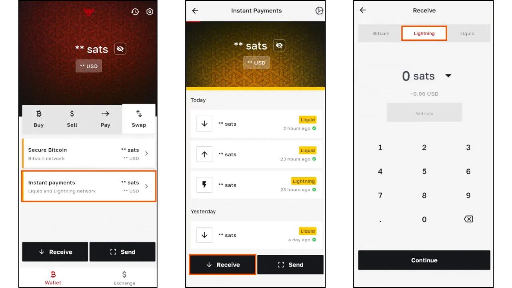


- или нажмите "**Принять "**, а затем выберите сеть **Лайтнинг**:


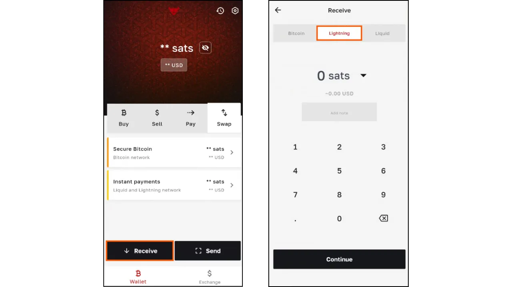


#### 4.3.1. Работа, ограничения и преимущества


- Механизм**: Bull Bitcoin Wallet - это Wallet, позволяющий совершать и получать платежи через Lightning. Средства, полученные через Lightning, хранятся в сети **Liquid** (в Wallet Instant Payments) благодаря автоматическому свопу через **Boltz**. Это дает вам возможность взаимодействовать с Lightning без необходимости управлять каналами ликвидности, оставаясь при этом в самоохране.


- Пределы:**
 - Минимальная сумма** составляет 100 сатоши (по состоянию на 19.07.2025) при покупке generate и Invoice.
 - Вы оплачиваете расходы**, которые будут вычтены из суммы, отправленной отправителем, в отличие от получения с помощью Wallet Lightning native, где только отправитель оплачивает расходы на перевод в дополнение к сумме отправления. По состоянию на 19/07/2025, 47 Sats вычитаются из отправленной суммы.


- Преимущества** :
 - Самостоятельное хранение**: Ваши средства остаются под вашим контролем и хранятся на Liquid Network.
 - Никаких высоких комиссий за хранение в сети**: Хранение на Liquid позволяет избежать дорогостоящих депозитов в ончейн для открытия канала Lightning или добавления ликвидности. Эти операции можно выполнить позже, когда накопленная на Liquid сумма оправдает комиссионные.


- Совет:** Если у отправителя есть Wallet Bull Bitcoin, используйте Liquid Network напрямую, чтобы избежать платы за обмен


#### 4.3.2. generate Invoice


- Введите **сумму** (в BTC, Sats или фиате)


- Добавьте **личную записку**, которая будет интегрирована в Invoice. Если отправитель оплатит Invoice, ваш Wallet также включит его в детали транзакции.


- Срок действия Invoice:** Молния Invoice действительна в течение **12 часов**. По истечении этого времени срок его действия истекает, и он больше не может быть оплачен. Необходимо сгенерировать новый Invoice.


- Использование**: Скопируйте Invoice, чтобы поделиться им с отправителем, или позвольте ему отсканировать QR-код.


## 5. Отправка средств


### 5.1. Основной принцип


Либо с главной страницы, либо с кошельков:


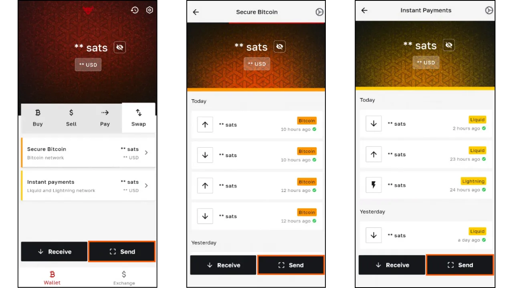


чтобы перейти к экрану отправки:


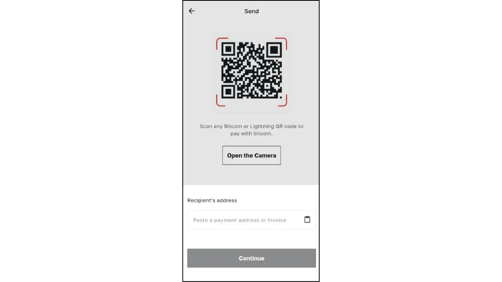


**Bull Bitcoin Mobile** упрощает отправку денег, автоматически определяя сеть (Bitcoin, Liquid или Lightning) на основе введенного Address или Invoice (скопированного или отсканированного с помощью QR-кода).


### 5.2. передача по цепочке (сеть Bitcoin)


#### 5.2.1. Экран отправки


**Действие**: Введите или отсканируйте Bitcoin на цепочке Address


- Если сумма не определена, например :


```
bc1qyv76arrcu7bullbitcoin9mgugjvcgelcjfcycjq
```


- Затем вы можете выбрать на экране отправки :
 - Сумма в BTC, сатах или фиатах. Минимальная сумма: 546 сатоши на 22/07/2025.
 - Необязательное примечание для идентификации транзакции. Видно только вам, в деталях транзакции.


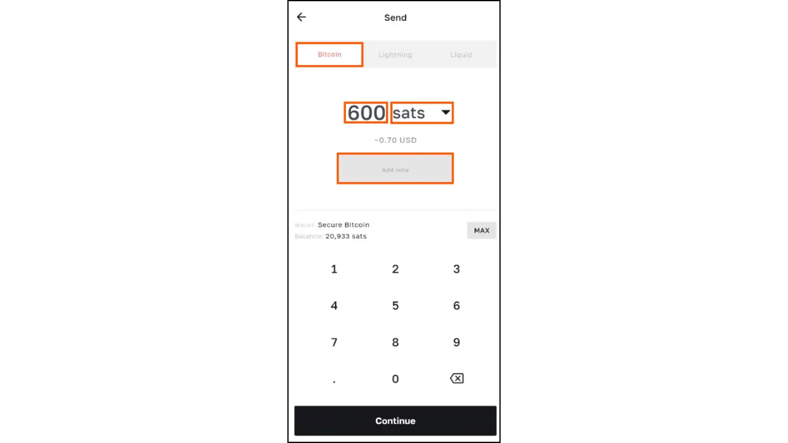


- Если сумма уже определена, например :


```
bitcoin:bc1qyv76arrcu7bullbitcoin9mgugjvcgelcjfcycjq?amount=0.000006&pj=HTTPS%3A%2F%2FPAYJO.IN%2F7GAEA52UMTYQ7%23RK1QVJZYR38X2MC585ZPZ60QY72DMXHWT67LERFWW6GQ4LDEA7MRP78X+OH1QYP87E2AVMDKXDTU6R25WCPQ5ZUF02XHNPA65JMD8ZA2W4YRQN6UUWG+EX1EJ78U6Q
```


После этого вы перейдете непосредственно к экрану подтверждения, расположенному ниже.


#### 5.2.2 Экран подтверждения


Проверьте все параметры, особенно сумму, пункт назначения Address и сборы.


Затем вы можете настроить параметры:


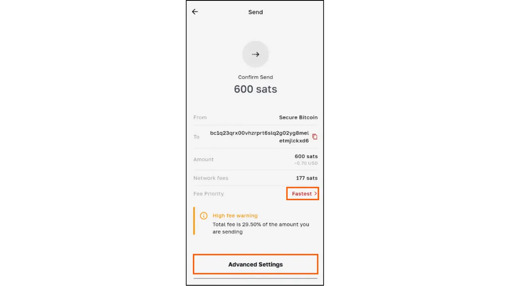


- Плата**: Вы можете выбрать :
  - Скорость выполнения** вашей транзакции и связанные с ней комиссии будут оценены
  - Оценивается либо стоимость**, в режиме абсолютных сборов (общая сумма сборов в сатоши) или относительных сборов (сборы за байт), а также скорость вашей транзакции


- Дополнительные настройки** :


 - Replace-by-fee (RBF)** : Активированная по умолчанию, эта функция ускоряет транзакцию за счет более высокой комиссии (подробнее см. Приложение 4).


 - Ручной выбор адреса UTXO**: Если ваши средства хранятся на нескольких разных адресах Wallet, вы можете выбрать адреса, с которых будут отправляться средства. Почему вы должны это сделать? С ростом использования Bitcoin комиссии за переводы растут. Отправка с нескольких адресов небольших сумм обходится дороже, чем с одного Address, но, сделав это сейчас, вы избежите необходимости делать это позже, когда комиссии будут еще выше. Это называется **консолидация UTXO.**


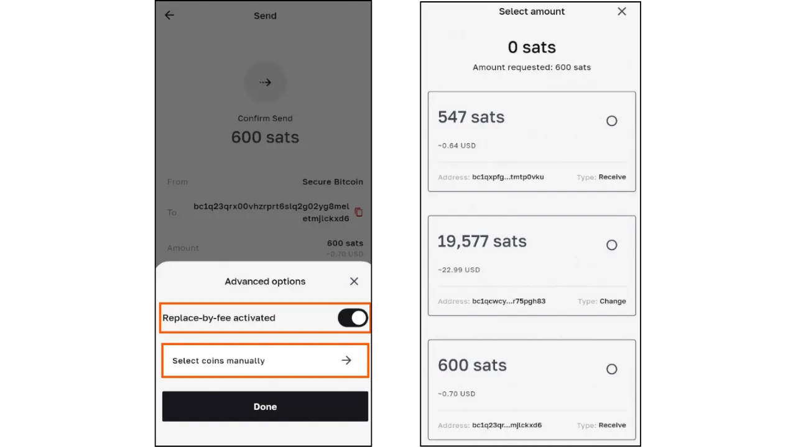


- Отправка с помощью PayJoin**: Если функция была активирована получателем, предоставившим URI, например :


```
bitcoin:bc1qyv76arrcu7bullbitcoin9mgugjvcgelcjfcycjq?amount=0.000006&pj=HTTPS%3A%2F%2FPAYJO.IN%2F7GAEA52UMTYQ7%23RK1QVJZYR38X2MC585ZPZ60QY72DMXHWT67LERFWW6GQ4LDEA7MRP78X+OH1QYP87E2AVMDKXDTU6R25WCPQ5ZUF02XHNPA65JMD8ZA2W4YRQN6UUWG+EX1EJ78U6Q
```


Затем Bull Bitcoin Mobile настроит отправку, объединив ваши UTXO с UTXO получателя в качестве входных данных, что повышает конфиденциальность (подробнее см. в Приложении 3).


### 5.3. Отправьте на Liquid


#### 5.3.1 Экран отправки


Сеть **Liquid** обеспечивает быстрые транзакции (~2 минуты благодаря одному блоку в минуту), более конфиденциальные (маскировка сумм), чем в сети onchain, и с очень низкой комиссией. Средства выводятся из **Instant Payments Wallet**.


**Действие**: Введите или отсканируйте Liquid Address


- Если сумма не определена, например :


```
lq1qq05k3vmnvbullbitcoinjujn6h04z9jtw53xuyktqf9mam2zpfz05j2fe2x8xhejgkga3nvmp4yyp35qynkcw2xqmy7x53ahpz
```


Затем вы можете выбрать на экране отправки :


- Сумма в BTC, сатах или фиатах. Без минимума, возможен 1 Satoshi;
- Необязательное примечание для идентификации транзакции. Видно только вам, в деталях транзакции.


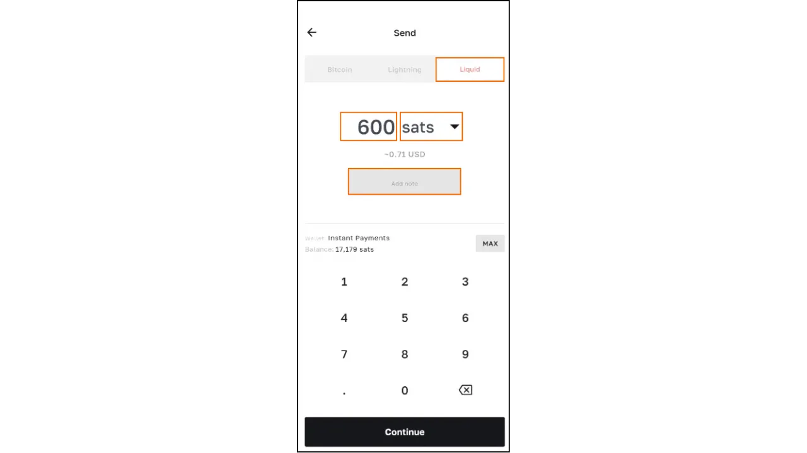


- Если сумма уже определена, например :


```
liquidnetwork:lq1qq05k3vmnvbullbitcoinjujn6h04z9jtw53xuyktqf9mam2zpfz05j2fe2x8xhejgkga3nvmp4yyp35qynkcw2xqmy7x53ahpz?amount=2.1e-7&message=Test+de+note+Liquid&assetid=6f0279e9ed041c3d710a9f57d0c02928416460c4b722ae3457a11eec381c526d
```


После этого вы перейдете непосредственно к экрану подтверждения, расположенному ниже.


#### 5.3.2 Экран подтверждения


Потратьте время на проверку всех параметров, особенно количества и назначения Address.


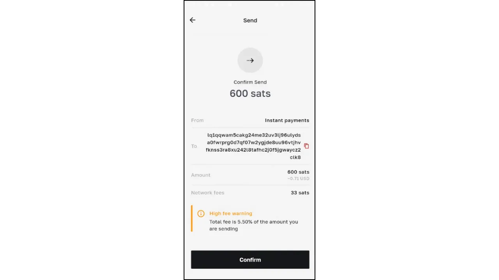


- Комиссионные**: Пропорционально сложности транзакции, обычно из расчета 0,1 сатоши за ввб, т.е. 20-40 сатоши за простую транзакцию (33 Sats на 07/22/2025).


### 5.4. Отправить в Lightning


#### 5.4.1 Экран отправки


Сеть **Lightning** обеспечивает мгновенные и недорогие платежи на небольшие суммы, что идеально подходит для мелких ежедневных операций.


**Действие**: Введите или отсканируйте молнию Invoice


- Если вы сканируете LN-URL Address, который позволяет установить количество


Пример: `orangepeel@walletofsatoshi.com`.


затем вы можете выбрать на экране отправки :


 - Сумма в BTC, сатоши или фиатах. Минимальная сумма 1000 сатоши на 23/07/2025
 - Необязательное примечание для идентификации транзакции. Она будет отправлена получателю.


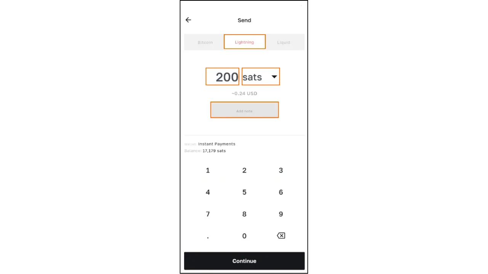


- Если вы сканируете Lightning Invoice, содержащий определенное количество


Пример:


```
lnbc210n1p58hhk6bullbitcoint4a9jq34dmrmcrursjmw3wjf8elz0nxtdsw9pscqzyssp52jg9dm8vc3xy26er5rc965lxjllhd82je97au7ysvv6lpq7r7shs9q7sqqqqqqqqqqqqqqqqqqqsqqqqqysgqdqqmqz9gxqyjw5qrzjqwryaup9lh50kkranzgcdnn2fgvx390wgj5jd07rwr3vxeje0glclle6wrlm37k39uqqqqlgqqqqqeqqjqnf7w9f2evnzptm2vtdknk7483hsndkl98c4mv2kfe64v5pkq0j6x2dqt9y9wayszv3z33az7c8hkj3yqj9jd7ans7ugq8xv0xefp23gqltph72
```


После этого вы перейдете непосредственно к экрану подтверждения, расположенному ниже.


Примечание: сумма должна быть больше 21 Sats на 07/23/2025


#### 5.4.2 Эксплуатация, ограничения и преимущества


- Механизм**: Средства берутся из **Instant Payments Wallet** (Liquid) и конвертируются через своп **Liquid → Lightning** с **Boltz**.


- Пределы:**
 - Минимальная сумма** выше, чем у Wallet Lightning native (см. выше)
 - Расходы** плюс Liquid → Молниеносный обмен через Boltz


- Преимущества** :
 - Самостоятельное хранение**: Ваши средства остаются под вашим контролем, хранятся на Liquid Network и при необходимости могут быть переданы через Lightning
 - Никаких высоких комиссий за хранение в сети**: Хранение на Liquid избавляет вас от дорогостоящих вкладов в ончейн для открытия канала Lightning или пополнения ликвидности. Эти операции можно провести позже, когда накопленная на Liquid сумма оправдает комиссионные сборы.


- Совет:** Если у получателя есть Wallet Bull Bitcoin, используйте Liquid Network напрямую, чтобы избежать расходов на обмен


#### 5.3.3 Экран подтверждения


Потратьте время на проверку всех параметров, особенно количества и назначения Address.


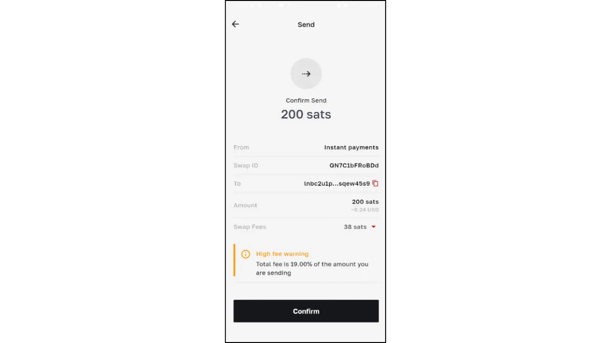


## 6. Посмотреть историю


**Bull Bitcoin Mobile** позволяет легко отслеживать ваши транзакции в сетях **Bitcoin (onchain)**, **Liquid** и **Lightning**. История может быть доступна двумя способами и отображает подробную информацию по каждому типу транзакций. Вы также можете проверить свои транзакции с помощью внешних блокчейн-браузеров.


### 6.1. История доступа


- Через главный экран** :
 - Нажмите на **Secure Bitcoin Wallet** для просмотра **onchain** транзакций, или на **Instant Payments Wallet** для **Liquid** и **Lightning** транзакций.
 - История отображается непосредственно под общим портфелем, отфильтрованная в соответствии с выбранным типом Wallet.


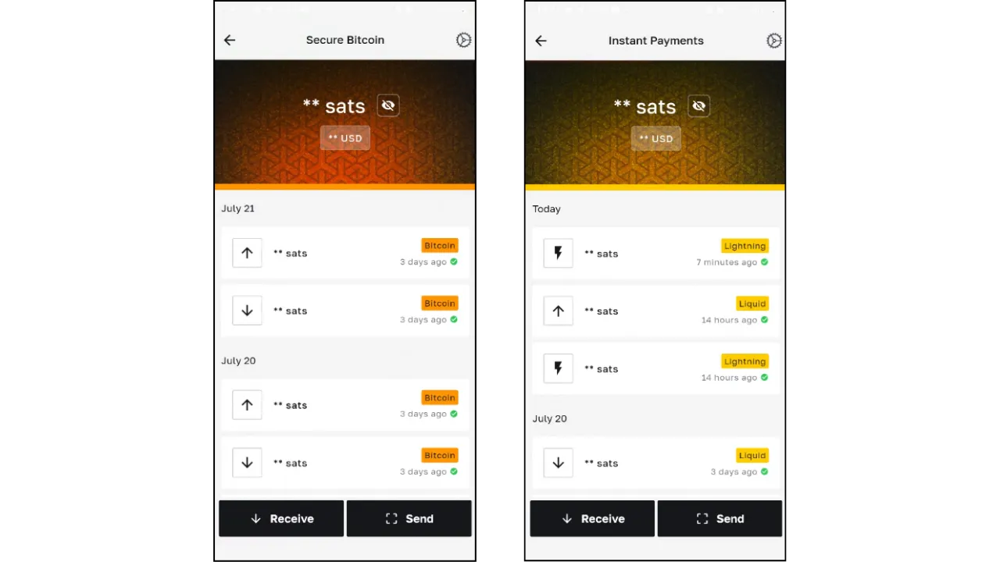


- Через специальную страницу**:
 - На главном экране нажмите на символ **истории** (значок часов или аналогичный).
 - Получите доступ к странице со списком всех транзакций, с фильтрами по типу действий: **Отправка**, **Получение**, **Обмен**, **PayJoin**, **Продажа**, **Покупка** (примечание: Продажа и Покупка находятся в стадии разработки и на данный момент недоступны, 20 июля 2025 года).


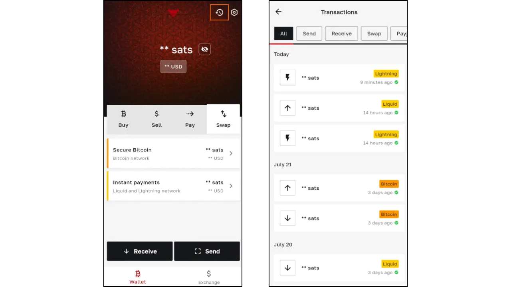


### 6.2. Детали сделки


Каждая транзакция отображает определенную информацию в зависимости от сети и типа действия (отправка или получение). Вот детали, доступные для **транзакции на цепочке**:


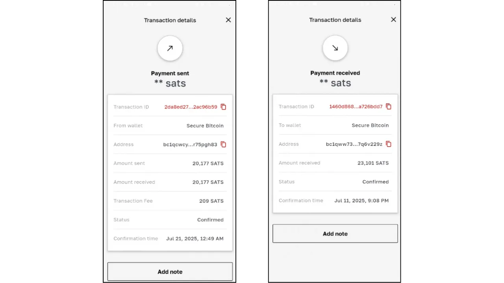


### 6.3. Проверка через Block explorer


Список исследователей для сетей **Bitcoin onchain**, **Liquid** и **Lightning** приведен в Приложении 4.


Для **Lightning** транзакции не видны в публичных браузерах. Проверьте детали (включая Swap ID для Boltz) в приложении.


## 7. Настройки


Страница "Настройки" доступна непосредственно с главной страницы приложения Bull Bitcoin и используется для настройки и управления различными аспектами портфолио и пользовательского опыта.


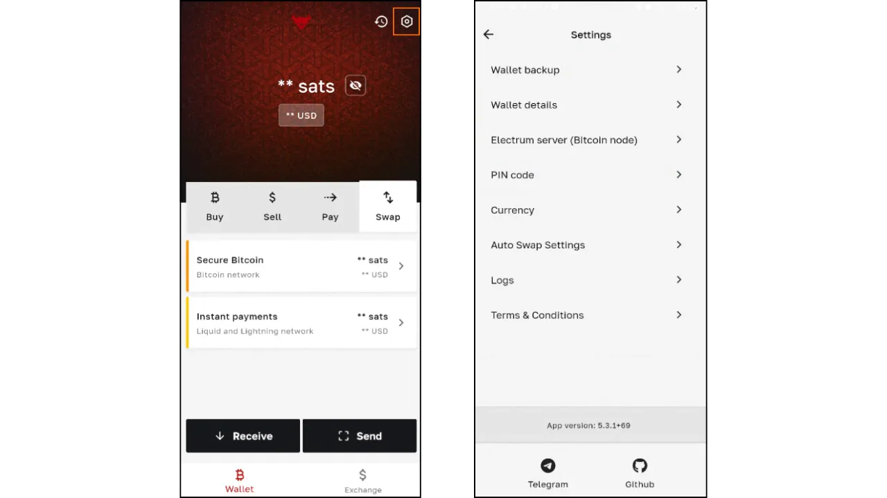


- Wallet Резервное копирование**: Отображает фразу восстановления портфеля для безопасного резервного копирования. О лучших практиках управления и хранения фразы восстановления см. в разделе 3. о создании портфеля.


- Wallet Подробнее** :
 - Pubkey**: Открытый ключ, связанный с Wallet, используемый для адресов приема generate Bitcoin.
 - Путь деривации**: Путь деривации, используемый для получения адресов generate Wallet из закрытого ключа.


- Electrum Server (Bitcoin Node)**: Установите соединение с настраиваемым узлом Bitcoin для транзакций в ончейн.


- PIN-код**: Активируйте и/или измените код безопасности для защиты доступа к приложению и функциям Wallet.


- Валюта**: Выберите, в какой валюте будут отображаться суммы - BTC или Sats, а также фиатную валюту по умолчанию (доллар, евро и т. д.).


- Настройки автообмена**: Функция _Автообмен_ позволяет автоматизировать перевод ваших BTC с **Instant Payments Wallet (Liquid)** на ваш **Bitcoin On-Chain** Wallet, как только сумма достигнет порога, который вы считаете достаточно высоким, чтобы оправдать комиссию за транзакцию.


- Журналы**: Просматриваемые журналы действий, которые могут быть переданы в службу технической поддержки для облегчения поиска и устранения неисправностей.


- Доступ к Telegram для поддержки**: Прямая ссылка на официальный канал Telegram для получения помощи пользователям.


- Доступ к Github** : Ссылка на [Bull Bitcoin Github repository](https://github.com/SatoshiPortal) для просмотра открытого кода или сообщения о проблемах.


## ПРИЛОЖЕНИЯ


### A1. Объяснение PayJoin (P2EP)


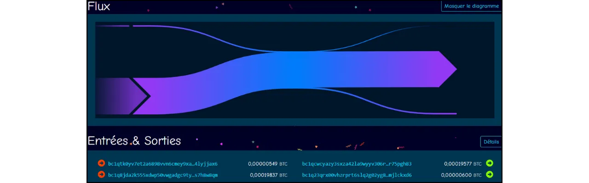


**Определение** :


- PayJoin, или **Pay-to-EndPoint (P2EP)**, - это техника транзакций Bitcoin, которая повышает конфиденциальность в сети **onchain**. Она объединяет записи отправителя и получателя в одной транзакции, что затрудняет отслеживание сумм и адресов.


**Операция:**


- В транзакции PayJoin отправитель и получатель работают вместе через совместимый сервер PayJoin для совместной транзакции generate.
- Вместо того чтобы только отправитель предоставлял записи (UTXO), получатель также вносит свой вклад в виде одного из своих UTXO. Это размывает информацию, отображаемую на Blockchain: вместо одной записи, соответствующей фактической сумме, теперь есть две записи, и выходы не отражают напрямую сумму обмена.
- Финальная транзакция напоминает стандартную транзакцию Bitcoin (мульти-вход/мульти-выход), но скрывает фактическую сумму отправки и связи между адресами благодаря стеганографической структуре.


**Для использования в Bull Bitcoin Mobile**


- Получение** (Address Supply): PayJoin включен по умолчанию.
- Отправить** : Wallet автоматически обнаруживает URI PayJoin и соответствующим образом настраивает транзакцию, например:


```
bitcoin:bc1qp2nxbullbticoinzt6tx7x5tlnpzhv37?amount=0.000006&pj=HTTPS%3A%2F%2FPAYJO.IN%2F475QR36G3ZCFZ%23...
```


**Преимущества**


- Повышенная конфиденциальность**: PayJoin опровергает предположение о том, что все записи в транзакции принадлежат одному субъекту. В PayJoin входные данные поступают как от отправителя, так и от получателя, что нарушает это предположение.
- Маскировка суммы** : Фактическая сумма обмена не отображается непосредственно в выходных данных. Она рассчитывается как разница между входящим и исходящим UTXO получателя, что вводит анализ в заблуждение.


**Лимиты*


- PayJoin требует, чтобы отправитель и получатель использовали совместимые кошельки, в противном случае используется стандартная транзакция onchain.
- Сделка немного сложнее (больше входов и выходов), что приводит к немного большим затратам.
- Несмотря на то, что по дизайну он напоминает стандартную транзакцию, продвинутые эвристики (например, двусмысленные выводы, известные серверы PayJoin) могут навести на мысль о его использовании, хотя и без абсолютной уверенности.


**Дополнительная информация:*


- [Глоссарий] (https://planb.network/fr/resources/glossary/payjoin)
- Chapitre [Les transactions PayJoin](https://planb.network/courses/65c138b0-4161-4958-bbe3-c12916bc959c/c1e90b95-f709-4574-837b-2ec26b11286f)


### A2. Объяснение Replace-by-fee (RBF)


**Определение**: Replace-by-fee (RBF) - это функция сети Bitcoin, которая позволяет отправителю ускорить подтверждение **onchain** транзакции, согласившись заплатить более высокую комиссию.


**Лимиты** :


- RBF недоступен для транзакций Liquid или Lightning.
- Первоначальная транзакция должна быть помечена как RBF-совместимая при ее создании, что Bull Bitcoin Mobile делает автоматически, если не отключена.


**Дополнительная информация:*


- [Глоссарий] (https://planb.network/fr/resources/glossary/rbf-replacebyfee)


### A3. Лучшие практики


Чтобы безопасно и эффективно использовать **Bull Bitcoin Mobile**, следуйте этим рекомендациям. Они помогут вам защитить ваши средства, оптимизировать транзакции и сохранить конфиденциальность в сетях **Bitcoin (onchain)**, **Liquid** и **Lightning**.


- Зафиксируйте фразу восстановления**:
 - Самоучитель: [Save your Mnemonic phrase](https://planb.network/fr/tutorials/wallet/backup/backup-mnemonic-22c0ddfa-fb9f-4e3a-96f9-46e2a7954270)
 - Cours [La phrase mnémonique](https://planb.network/courses/46b0ced2-9028-4a61-8fbc-3b005ee8d70f/8f9340c1-e6dc-5557-a2f2-26c9669987d5)


- Используйте безопасную аутентификацию** :
 - Активируйте **строгий PIN-код** или **биометрическую аутентификацию** (отпечаток пальца или распознавание лица) для защиты доступа к приложению.
 - Никогда не сообщайте свой PIN-код или биометрические данные.


- Защитите свою конфиденциальность** :
 - generate новый Address для каждого приема onchain или Liquid, чтобы ограничить трассировку на Blockchain.
 - Используйте PayJoin, когда он доступен, чтобы повысить конфиденциальность в отношении суммы, отправленной по цепочке
 - Для обеспечения максимальной конфиденциальности подключите свой Wallet к собственному узлу Bitcoin через сервер Electrum, а не используйте публичный узел


- Выберите сеть, наиболее соответствующую вашим потребностям**:
 - Onchain**: Предпочтительно для долгосрочного хранения или операций с большими суммами (комиссии незначительны по отношению к сумме).
 - Liquid**: Используется для быстрой и недорогой передачи данных с повышенной конфиденциальностью.
 - Молния**: Выбирайте мгновенные и недорогие переводы для небольших сумм. Если вы являетесь двумя пользователями Wallet Bull Bitcoin, выберите Liquid, чтобы избежать комиссии за обмен Lightning <> Liquid через Boltz.


- Всегда проверяйте адреса доставки** :
 - Перед отправкой средств внимательно проверьте Address. Средства, отправленные на неправильный Address, теряются навсегда. Используйте копирование/вставку или сканирование QR-кода, никогда не копируйте/изменяйте Address от руки.


- Оптимизируйте расходы** :
 - Для транзакций onchain выбирайте соответствующие тарифы (медленный, средний, быстрый) в зависимости от срочности и загруженности сети.
 - Используйте Liquid или Lightning для небольших объемов.
 - Активируйте Replace-by-fee (RBF) (см. Приложение 4) для отправлений onchain, если ожидается необходимость ускорить подтверждение.


- Поддерживайте приложение в актуальном состоянии


### A4. Дополнительные ресурсы


- Официальные ссылки и поддержка:**
 - [staff@bitcoinsupport.com](mailto:staff@bitcoinsupport.com)**, support@bullbitcoin.com : электронная почта службы поддержки
 - [Официальный сайт Bull Bitcoin](https://bullbitcoin.com/) :** Информация об услугах Bull Bitcoin, создание аккаунта, доступ к приложению
 - [GitHub Bull Bitcoin Mobile](https://github.com/SatoshiPortal/bullbitcoin-mobile) :** Просмотр кода, эволюции и дорожной карты, вклад в развитие...
 - [Аккаунт X - Twitter Bull Bitcoin](https://x.com/BullBitcoin_)**
 - Группа Telegram** для мобильного Wallet: групповой чат со службой поддержки, см. страницу "Настройки".


- Исследователи блоков :**
 - on chain : **[Mempool.space](https://Mempool.space/)**
 - Liquid : **[Blockstream Info](https://blockstream.info/Liquid)**
 - Молния: **[1ML (Lightning Network)](https://1ml.com/)**


- Обучение и учебные пособия:** **[Plan ₿ Network](https://planb.network/)** :
 - Защита фразы для восстановления


https://planb.network/tutorials/wallet/backup/backup-mnemonic-22c0ddfa-fb9f-4e3a-96f9-46e2a7954270


https://planb.network/courses/46b0ced2-9028-4a61-8fbc-3b005ee8d70f


- Liquid Network** :
 - [Глоссарий](https://planb.network/resources/glossary/liquid-network)**


https://planb.network/courses/6d26bcff-51a3-405f-bcdd-9af8297ce727


- Lightning Network** :
 - [Глоссарий](https://planb.network/resources/glossary/lightning-network)**


https://planb.network/courses/34bd43ef-6683-4a5c-b239-7cb1e40a4aeb


### A5. Бык Bitcoin


#### Обзор компании


**[Bull Bitcoin](https://www.bullbitcoin.com/fr)** - старейшая бездепозитарная платформа Exchange, посвященная исключительно Bitcoin, основанная в 2013 году в посольстве Bitcoin в Монреале, Канада. Возглавляемая Франсисом Пулиотом, признанным пионером в экосистеме Bitcoin, компания позиционирует себя как ключевой игрок в продвижении финансового суверенитета и автономии пользователей. Миссия компании заключается в том, чтобы позволить людям вернуть контроль над своими деньгами, используя Bitcoin в качестве инструмента для свободы и платежей, отвергая фиатные валюты и криптовалюты, отличные от Bitcoin.


[Создайте свой аккаунт](https://app.bullbitcoin.com/registration/orangepeel) со скидкой 0,25% на покупки и продажи Bitcoin.


#### Ценности и философия


Bull Bitcoin выделяется своими принципами Commitment - Cypherpunk и этикой Bitcoin:


- Эксклюзивный фокус на Bitcoin**: Платформа соответствует видению децентрализованной, устойчивой к цензуре валюты.


- Некастодиан**: Пользователи сохраняют полный контроль над своими биткойнами, направляя средства в собственные портфели.


- Конфиденциальность**: Минимальный сбор персональных данных, возможность покупки без KYC для сделок на сумму менее 999 долларов США. Данные защищены в соответствии с нормативными актами (FINTRAC в Канаде, AMF во Франции).


- Прозрачность**: Никаких скрытых комиссий, расходы включены в спред (разницу между ценой покупки и продажи).


- Финансовый суверенитет**: Bull Bitcoin способствует независимости от традиционных банковских систем и централизованных институтов.


#### Основные услуги


- Фиатный депозит** : Пользователи могут пополнить свой счет Bull Bitcoin фиатной валютой (CAD, EUR и т. д.) с помощью банковского перевода или наличных/дебетовой карты в выбранных почтовых отделениях Канады.


- Покупка Bitcoin** : Пользователи могут приобрести Bitcoin, который отправляется непосредственно в их недепозитарный портфель, гарантируя полный контроль над средствами.


- Запланированная покупка Bitcoin**: Bull Bitcoin предлагает услугу автоматической повторяющейся покупки (DCA - Dollar Cost Averaging) через регулярные промежутки времени, используя ваш доступный баланс, с прямым переводом биткойнов на контролируемый пользователем Wallet, снижая влияние волатильности цен.


Обратите внимание, что опция под названием "AutoBuy" позволяет конвертировать фиаты, как только они коснутся вашего баланса Bull Bitcoin, и отправлять биткоины на ваш собственный Wallet. Эту опцию также можно совместить с периодическим банковским переводом, запланированным в вашем банке, чтобы сделать DCA. Эта опция автоматизирует накопление Bitcoin без необходимости открывать приложение.


- Купить Bitcoin по фиксированной цене 'Limit Order'**: Позволяет купить Bitcoin по заранее указанной пользователем цене, которая автоматически исполняется, когда цена индекса Bull Bitcoin достигает или опускается ниже установленного лимита.


- Продажа Bitcoin**: Пользователи могут продать свои биткойны и получить средства в фиатной валюте непосредственно на свой банковский счет с помощью банковского или SEPA-перевода.


- Сторонние платежи**: Bull Bitcoin позволяет пользователям отправлять фиатные деньги на банковские счета со своих биткоинов, совершенно прозрачно для получателя.


- Bull Bitcoin Prime**: Bull Bitcoin Prime - это премиум-сервис для состоятельных и корпоративных клиентов, предлагающий индивидуальные решения и премиум-поддержку. Это включает в себя доступ к сниженным комиссиям, выделенному менеджеру по работе с клиентами и индивидуальному корпоративному обслуживанию. Эта услуга предназначена для учреждений, профессиональных трейдеров и корпоративных клиентов, которым требуется глубокая экспертиза и приоритетное обслуживание.


- Мобильный Wallet**: Bull Bitcoin предлагает мобильный Wallet с открытым исходным кодом, доступный на Android и iOS, который поддерживает транзакции onchain, Liquid и Lightning Network.


- Образовательная поддержка**: Бесплатные руководства и индивидуальные тренинги помогут пользователям создавать, защищать и управлять своими портфелями Bitcoin, укрепляя финансовую самостоятельность.


#### Соблюдение требований и безопасность


- Регулирование**: Зарегистрированный в FINTRAC (Канада) и AMF (Франция), Bull Bitcoin соответствует требованиям KYC/AML.


- Безопасность**: Использование защищенных портфелей и рекомендации по хранению данных в автономном режиме. Личные данные размещаются на инфраструктуре Bull's Bitcoin, которая на 100 % состоит из собственных ресурсов и не зависит от третьих сторон.