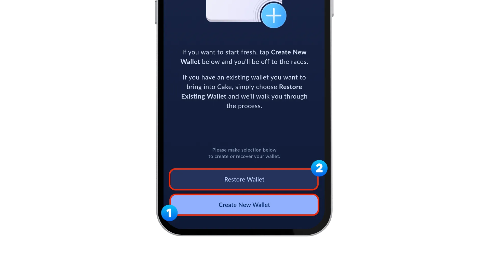
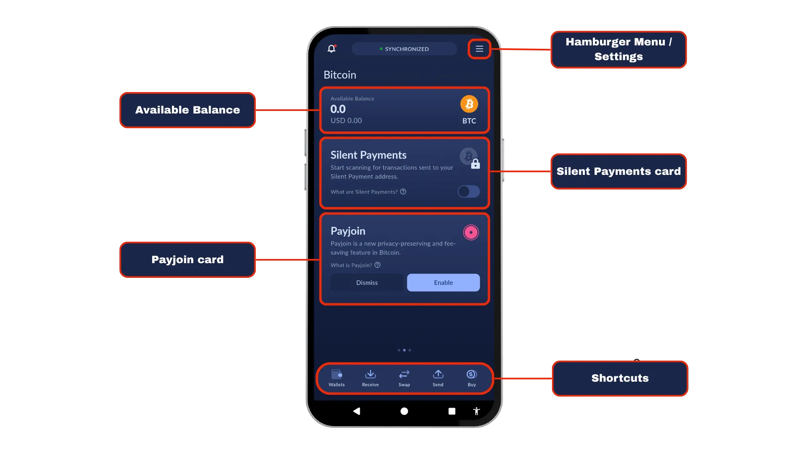
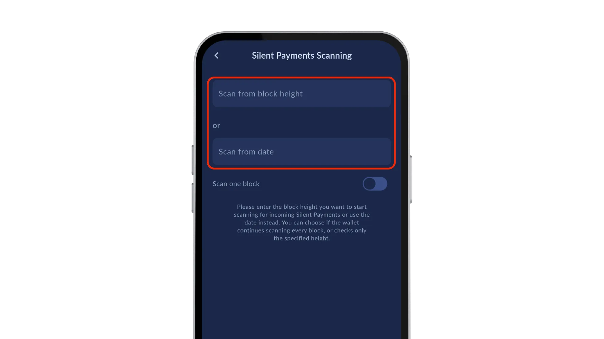
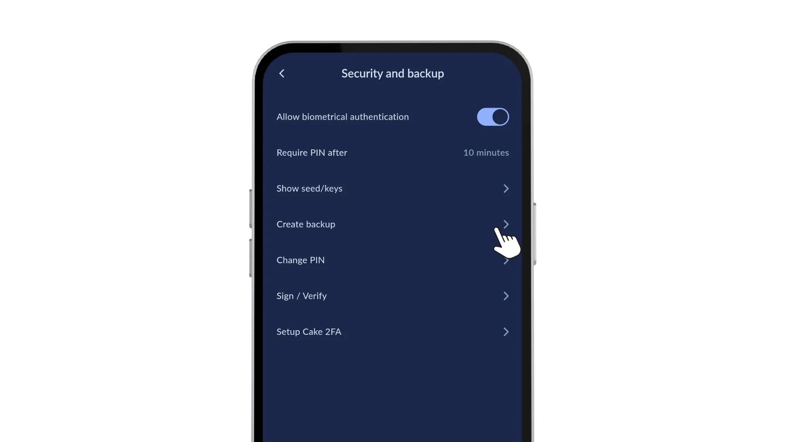
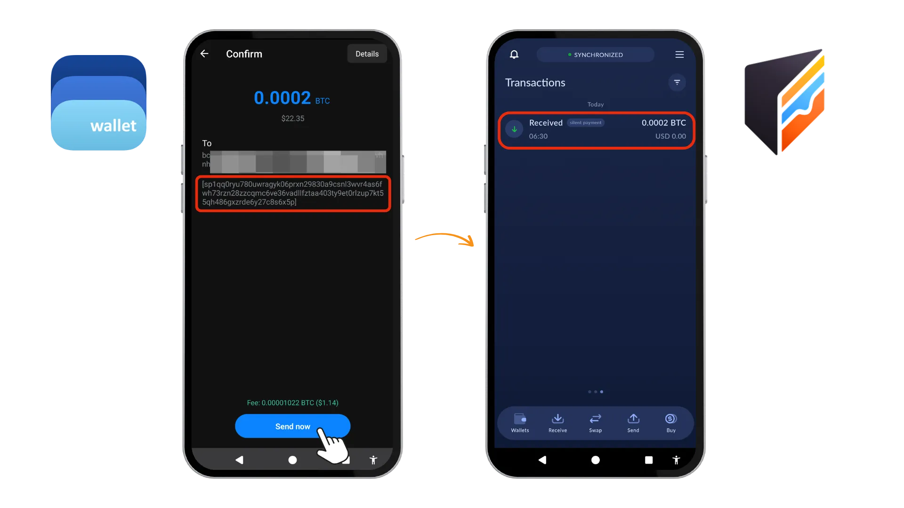
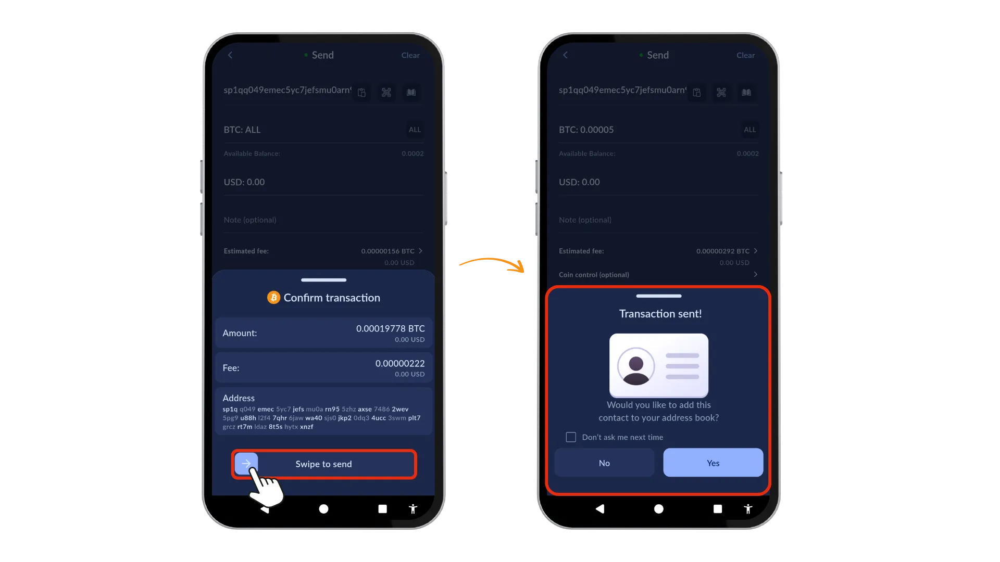
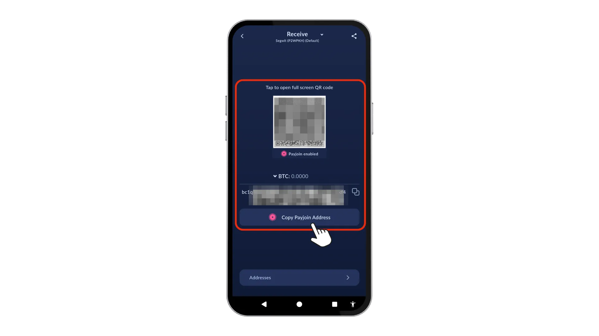

本指南探討 [**Cake Wallet**](https://cakewallet.com/)：一個開放源碼、非監管、注重隱私的多貨幣 wallet，適用於 Android、iOS、macOS、Linux 和 Windows。我們會深入探討其 Bitcoin 特有的隱私權功能，透過 **Silent Payments**（改良的 on-chain 隱私權通訊協定）來傳送/接收 Bitcoin，並會看看 PayJoin v2 對於異步交易的實作。


## 主要功能


- [**無聲付款 (BIP-352)**](https://bips.dev/352/) 改善之前的 [BIP 47 付款代碼](https://silentpayments.xyz/docs/comparing-proposals/bip47/) 也稱為 "PayNyms" 的可重複使用的隱身地址。當發件人使用您的隱形付款地址時，他們的 wallet 會使用不同的鑰匙衍生出唯一的一次性地址，這些鑰匙將合併成唯一的一次性 Taproot 地址。區塊鏈記錄會顯示不相關的交易，防止將收到的付款聯繫起來。無聲支付提供一系列優點，包括
    - 可重複使用的地址：每次交易都不需要 generate 新地址，提供更好的使用者體驗並增加隱私性
    - 零成本增加：無聲支付不會增加交易的規模或成本。
    - 增強匿名性：外部觀察者無法將交易與 Silent Payment 位址相連。
    - 不需要寄件者與收件者之間的互動：雙方之間無需任何溝通即可進行交易。
    - 每筆付款都有唯一的地址：消除意外重複使用地址的風險。
    - 無需伺服器：無需專用伺服器即可進行無聲付款。
- PayJoin v2** 將發送者和接收者的輸入合併為單一交易，以減輕交易圖分析的問題。Cake Wallet 實現了兩項關鍵進步：
    - 異步交易**：寄件者和收件者不再需要同時在線就能完成私人交易。
    - 無伺服器通訊**：任何一方都不需要執行 Payjoin 伺服器，消除了主要的技術障礙。
- Coin Control** 可在交易時手動選擇 UTXO。這可以防止在使用多個不同來源的 UTXO 時，意外連結地址。
- 支援 TOR**，允許使用者透過 Tor 網路路由其網路流量
- RBF** (Replace-By.Fee) 可讓您在傳送交易後調整費用。


## 1️⃣設定您的 Wallet


Cake Wallet 提供廣泛的平台支援。您可以選擇「Android」、「iOS / macOS」、「Linux」和「Windows」。  要開始使用，請造訪 https://docs.cakewallet.com/get-started/ 並選擇您的作業系統。


安裝完成後，設定一個 `PIN` (4 或 6 位數)。然後您會看到


1.建立新的 Wallet」（適用於新使用者）

2.還原 Wallet」（適用於現有錢包）





在下一個畫面中，您可以選擇多種加密貨幣。選擇`Bitcoin`，然後點擊`下一步`，並提供一個`Wallet 名稱`以識別 wallet。點選`進階設定「，會出現一系列`隱私設定」。進行這些變更：


- Fiat API:** 選擇 `Tor Only` (透過 Tor 傳送價格要求)
- 交換：** 選擇 `Tor Only` (匿名交換流量)


預設產生 BIP-39 seed 類型，可選擇變更為 Electrum seed 類型。衍生路徑如下：


- Electrum：`m/0'`
- BIP-39：`m/84'/0'/0`


如果您想要增加額外的安全層級，您可以設定一個 `passphrase`。  passphrase 的主要目的是提供額外的保護，防止物理攻擊。即使攻擊者找到 seed 詞組，如果沒有正確的 passphrase，他們也無法存取您的 wallet。換句話說，seed 短語單獨代表一個 wallet，而 seed 短語加上 passphrase 則會產生一個完全不同的 wallet，與原本的 wallet 沒有任何關聯。此功能也可讓您使用受 passphrase 保護的「秘密錢包」，並提供您看似可信的推诿。在強制的情況下，您可以透露 seed 詞組，而將較大的資產安全地保存在受 passphrase 保護的 wallet 中。


如果您已經在執行自己的節點，請切換 `新增自訂節點 ` 並提供您的 `節點 Address`，以驗證您自己基礎架構內的交易和區塊。完成後，點選 `Continue` 和 `Next` 創建您的 wallet。


在下一個畫面中，您會看到免責聲明：


```
On the next page you will see a series of words. This is your unique and private seed and it is the ONLY way to recover your wallet in case of lass or malfunction. It is YOUR responsibility to write it down and store it in a safe place outside of the Cake Wallet app.
```


若要瞭解儲存記憶詞組的最佳做法，請參閱本教程：


https://planb.academy/tutorials/wallet/backup/backup-mnemonic-22c0ddfa-fb9f-4e3a-96f9-46e2a7954270

點選 `我了解。讓我看看我的 seed`，並將這些字保存在安全的地方！然後點選 `驗證 seed`，驗證後再點選 `開啟 Wallet`。


## 2️⃣設定


在深入了解之前，讓我們先來看看「主畫面」和「設定」。


在主畫面上，我們可以看到顯示的不同項目：


- 漢堡選單」會帶我們到「設定」。
- 可用餘額
- Silent Payments 卡開始掃描發送到您的 Silent Payment 地址的交易
- Payjoin 卡「啟用」Payjoin 作為隱私保護和節省費用的功能
- 底部的捷徑是`Wallet 總覽`、`接收`、`Bitcoin 和其他貨幣之間的交換`、`發送`和`購買`。





點選「漢堡包功能表」圖示開啟設定功能表。讓我們檢視一下選項。


### A - 連線與同步 🔗


在這裡，我們可以重新連線 wallet、管理節點，以及連線到我們自己的節點 (建議使用)。無聲付款掃描」讓我們可以自訂掃描，指定「從區塊高度掃描」或「從日期掃描」。





作為「Alpha」功能，還有「啟用內建 Tor」選項，可透過 Tor 網路路由流量。


### B - 靜音付款設定 🔈


我們可以在主畫面的 Silent Payments 卡上切換顯示此功能。啟用「不斷掃描」功能可讓 wallet 持續監控區塊鏈，以檢查傳入的 Silent Payments。我們可以指定掃描參數，以根據上述需求自訂掃描程序。


### C - 安全與備份 🗝️


為了保護我們的 wallet，我們可以按照應用程式內的提示建立備份。這將確保我們擁有私人密碼匙的安全副本，讓我們在 wallet 遺失或被盜時能找回它。此外，我們還可以檢視 seed 短語和私人金鑰、變更 PIN 碼、啟用生物特徵驗證、簽名/驗證和設定 2FA，以提供額外的保護。





**註**：自 2025 年 9 月起，Android 裝置上的指紋生物辨識驗證須至少以 Class 2 生物辨識實作運作，詳情請參閱 [此處](https://source.android.com/docs/security/features/biometric/measure#biometric-classes)。然而，此要求在未來可能會改變。


### D - 隱私設定 🔒


我們也可以使用 Tor 加密我們的網路連線，並在存取外部來源時保護我們的隱私，以加強 wallet 的安全性。此外，我們可以防止截圖，以保持我們的 wallet 資訊的機密性，啟用自動生成地址，為每次交易創建新的地址，並禁止買入/賣出操作，以防止未經授權的交易。此外，我們還可以「啟用 PayJoin」，這是我們稍後檢討的另一項隱私功能。


### E - 其他設定 🔧


其他設定允許我們管理費用優先順序，並設定我們交易的預設費用水平。這使我們能夠控制與我們的無聲支付相關的交易費用，並考慮到當前的網絡利用率。


## 3️⃣使用Silent Payments接收₿itcoin


有幾種選項和位址類型可供接收 Bitcoin。`Segwit (P2WPKH)` *(以 bc1q.... 開頭)*是預設選項。  讓我們在這個範例中選擇 `Silent Payments`。


若要接收無聲付款，請先點選 Cake Wallet 中的「接收」圖示。接下來，輸入您期望收到的金額。要指定地址類型，再次點擊螢幕上方的`接收`，然後從選項中選擇`無聲付款`。


在主螢幕上，會顯示您可重複使用的 Silent Payment QR 代碼和地址。不出所料，地址相當長：


`sp1qq0ryu780uwragyk06prxn29830a9csnl3wvr4as6fwh73rzn28zzcqmc6ve36vadllfztaa403ty9et0rlzup7kt55qh486gxzrde6y27c8s6x5p` .


現在，使用與 BIP-352 相容的 wallet（例如 Blue Wallet）掃描此 QR 碼，然後發送付款。您會看到 wallet 會從您的無聲地址衍生出獨特的目的地地址。





## 4️⃣使用Silent Payments發送₿itcoin


由於 Blue Wallet 只能`發送`靜音付款，我們會使用另一個 BIP 352 相容的 wallet 作為接收方。此流程與一般 Bitcoin 交易相同。


- 點選主畫面上的 ` 傳送
- 無論是貼上我們可重複使用的「sp1qq...」位址，或是直接在應用程式中掃描 QR 代碼。
- 選擇您想從可用餘額中花費的金額
- 點選螢幕下方的「傳送」確認交易


一旦我們輸入了 `sp1qq...` 位址，wallet 就會自動在後台衍生出一個對應的 `bc1p...` Taproot 位址 (P2TR)，這個位址將用於靜音付款。


我們可以選擇使用「Coin Control」功能為每筆交易撰寫內部備註、調整費用設定或為交易選擇特定的 UTXO。


向右滑動以確認交易。


發送交易後，系統會詢問您是否要將此聯絡人加入通訊錄。





## 5️⃣ PayJoin


讓我們回顧一下 PayJoin [關於](https://docs.cakewallet.com/cryptos/bitcoin/#payjoin)：


_Payjoin v2 是 Bitcoin 的一項隱私保護和節省費用的功能，它允許交易的發送方和接收方共同創建單一交易。此交易有來自發送者和接收者雙方的輸入，破解了針對 Bitcoin 最常見的監控技術，並在某些情況下允許更好的擴展和節省費用。


若要深入瞭解 PayJoin，您也可以造訪以下教學。


https://planb.academy/tutorials/privacy/on-chain/payjoin-848b6a23-deb2-4c5f-a27e-93e2f842140f

要使用 PayJoin，雙方都需要一個 PayJoin 相容的 wallet，而收件人的 wallet 中至少要有一個硬幣或輸出。要開始使用，請遵循以下步驟：


1.點選「漢堡選單」，然後點選「隱私權」按鈕

2.切換「使用 Payjoin」選項

3.  點選主畫面上的「接收」，您會看到 PayJoin QR 碼和複製按鈕 (當選擇 Segwit 時)





## 6️⃣其他功能


還有其他一些功能，例如多種貨幣「交換」、與不同供應商連線的「買賣」選項，以及可讓您購買預付卡或禮品卡的「Cake Pay」等 Cake 特定程式。


## 🎯 結論


這是我們對 Cake Wallet 的評測，由於具有 Silent Payments (BIP-352) 和 Payjoin v2 等功能，Cake Wallet 可提供實用的 Bitcoin 隱私功能。


Silent Payments 以可重複使用的隱身地址取代一次性地址，以防止傳入交易的 on-chain 連結。雖然先前版本的同步問題有顯著改善，但掃描和偵測 Silent Payments 所需的計算需求有所提高，需要更多的資源和頻寬。


Payjoin v2 將寄件者和收件者的投入合併為單一交易，而無需額外費用或中央協調，因此打破了連鎖分析。這打破了一般的輸入所有權啟發式，這是一個顯著的優點，因為這意味著您不能假設所有的輸入都屬於寄件者。


對於以財務匿名性為優先考量的使用者而言，Cake Wallet 是一個可行的選擇。它將隱私協定直接納入其核心功能，使其無需任何複雜技術即可使用。隨著對公共區塊鏈的監控增加，像這樣的工具有助於在最重要的地方維護交易隱私。在 wallet 領域內更廣泛地實施這些標準將是一個值得歡迎的發展。


## 資源


https://cakewallet.com


https://docs.cakewallet.com/


https://github.com/cake-tech/cake_wallet


https://blog.cakewallet.com/


[https://silentpayments.xyz/](https://silentpayments.xyz/)


[ttps://bips.dev/352/](https://bips.dev/352/)


https://payjoin.org/