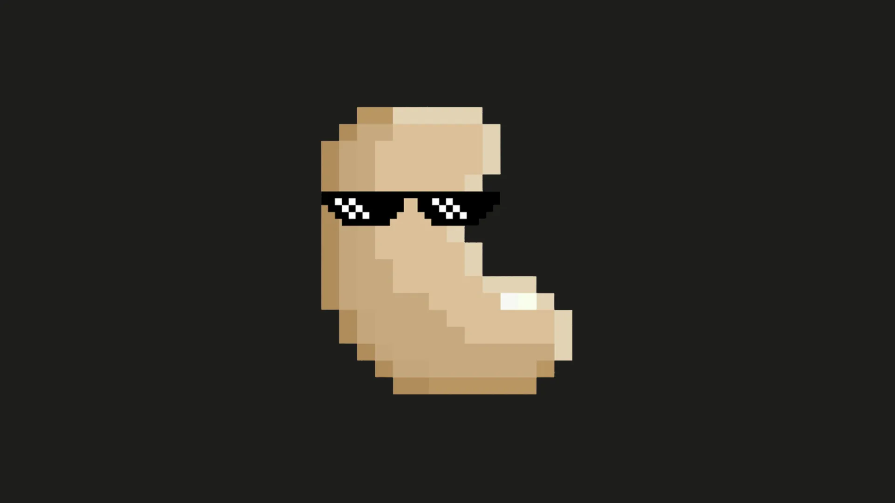

*Here is a video tutorial from BTC Sessions, a video guide that walks you through how to set up and use the Cashu.me Bitcoin wallet, which gives you access to simple, cheap and private Bitcoin transactions - without the need for an app store!*

In this tutorial we'll explore Cashu.me, a browser-based wallet for private Bitcoin payments using Chaumian ecash. Before we dive in, let's have a brief introduction into ecash and how it works.

## Introduction to ecash

Imagine having digital cash that works exactly like physical bills in your pocket - private, instant, and usable peer-to-peer without intermediaries. That's what ecash enables: a digital payment approach that brings back the privacy of physical cash to the digital world. Unlike onchain-Bitcoin, which records every transaction on a public ledger visible to anyone, ecash creates private tokens that represent real Bitcoin value while keeping your spending habits confidential.

Think of ecash as digital bearer instruments stored on your device - if you hold them, you own them, just like physical cash. These tokens are issued by trusted services called `Mints` that hold the underlying Bitcoin reserves. When you use ecash, you're not broadcasting your transactions to the entire network. Instead, you're exchanging private tokens directly with others, creating a payment experience that feels more like handing someone cash than making a traditional digital payment.

Cashu is a free and open-source Chaumian ecash protocol built for Bitcoin. The technology builds on David Chaum's pioneering 1980s cryptographic research, using `blind signatures` to ensure privacy. When you receive ecash tokens, the mint signs them without knowing where they'll be spent next - a crucial feature that prevents transaction tracking. Importantly, ecash doesn't replace Bitcoin; it complements it by addressing some critical issues that come with Bitcoin architecture requirements. It provides the privacy that physical cash offers (which Bitcoin's transparent ledger lacks) and enables instant microtransactions without blockchain fees or confirmation delays.

Ecash integrates seamlessly with the Lightning Network. You use Lightning to deposit Bitcoin into a mint (converting your Bitcoin value to ecash tokens) and to withdraw later (converting tokens back to spendable Lightning balance). Together, they form a powerful combination: Bitcoin provides the secure settlement layer, Lightning enables fast transactions and network interoperability and ecash adds the privacy layer that makes digital payments feel truly private again.

## Cashu.me

Cashu.me is a `Progressive Web App (PWA)` that implements the Cashu protocol - a specific implementation of Chaumian ecash designed for Bitcoin. As a PWA, it works directly in your browser without requiring installation from app stores, though you can `install` it to your device for easier access. This web-based approach ensures wide compatibility across operating systems while maintaining security through cryptographic protocols rather than platform restrictions.

## 🎉 Key Features

Let's dive into the features and explore what Cashu.me has to offer:

- **Chaumian ecash on Lightning**: Uses blind signatures so mints cannot track user balances or transaction histories
- **Self-custody of tokens**: You control ecash tokens locally with your seed phrase
- **Seed phrase backups**: 12-word recovery phrase for wallet restoration
- **Mint independence**: Works with multiple independent mints—you're not locked into one provider
- **Instant, free transactions**: Within same mint, payments finalize in seconds with zero fees
- **Privacy-preserving architecture**: Mints cannot see who transacts with whom
- **Offline ecash**: Send/receive tokens through a local transmission protocol, like NFC, QR code, Bluetooth, etc. without internet connection
- **Discover ecash mints via Nostr**: Find and verify trusted mints through the Nostr protocol
- **Swap ecash between mints**: All mints speak Lightning which, means you can transfer value between them. 
- **Remote control your wallet with Nostr Wallet Connect (NWC)**: Connect to other apps like Nostr Client and start zapping via NWC 

The critical tradeoff is `trust`: while you control the tokens themselves, you must trust mints to custody the underlying Bitcoin reserves. As Cashu's documentation states: 

> ...the mint is running the Lightning infrastructure and custodies the satoshis for the mints ecash users. Users must trust the mint to redeem their ecash once they want to swap out to Lightning. 

— Cashu Documentation, [General Safety and Privacy Questions](https://docs.cashu.space/faq#general-safety-and-privacy-questions) 

This makes ecash a custodial solution for the Bitcoin itself, though you retain full control of the tokens.

## 1️⃣ Initial Setup

① Begin by visiting [wallet.cashu.me](https://wallet.cashu.me) in your browser. Since Cashu.me is a `PWA`, you don't need to download it from app stores, simply open the site directly in your browser. For easier access, you can optionally install it to your device's home screen.

② To install the PWA, tap the ⋮ menu button in your browser and select `Add to Home Screen`. Once installed, close the browser tab and launch Cashu.me from your device's home screen. On the welcome screen, tap `Next` to continue.

③ Security is critical. Store your seed phrase securely in a password manager or, even better, write it down on paper. This 12-word recovery phrase is your only way to recover funds if you lose access to this device. Tap the 👁️ icon to reveal your seed phrase, carefully write down all 12 words in order, then check the box marked `I have written it down`. Tap `Next` to continue, and check the box to confirm you accept the `terms` on the following screen.

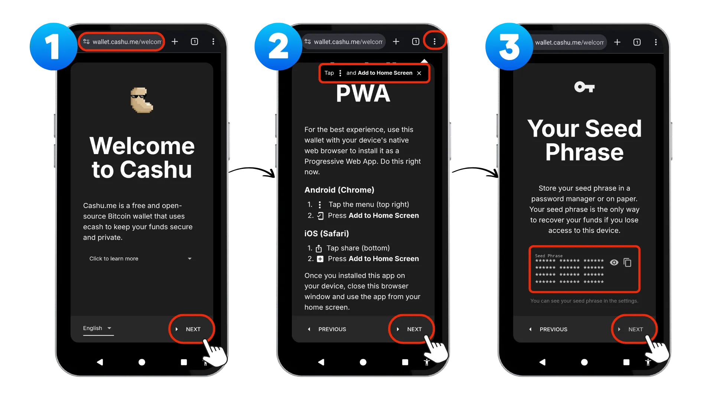

After completing setup, you'll need to connect to a `Mint`. Tap on `ADD MINT` followed by `DISCOVER MINTS`  to view mints recommended by the Nostr community. For additional verification, you can review mint ratings at [bitcoinmints.com](bitcoinmints.com). 

Next tap on `Click to browse mints` to see the full list. Select a mint by copying its URL, pasting it into the URL field, and giving it a recognizable name. For this example, we'll use:

URL: `https://mint.minibits.cash/Bitcoin`
Name: `Minibits`

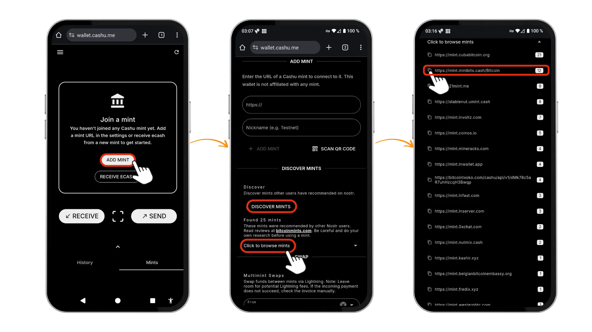

Tap `ADD MINT` to complete the process. On the confirmation screen, verify that you trust this mint's operator, then tap `ADD MINT` again. The Minibits mint will now appear on your Home Screen. Once your wallet is set up, you'll need to fund it before making transactions.

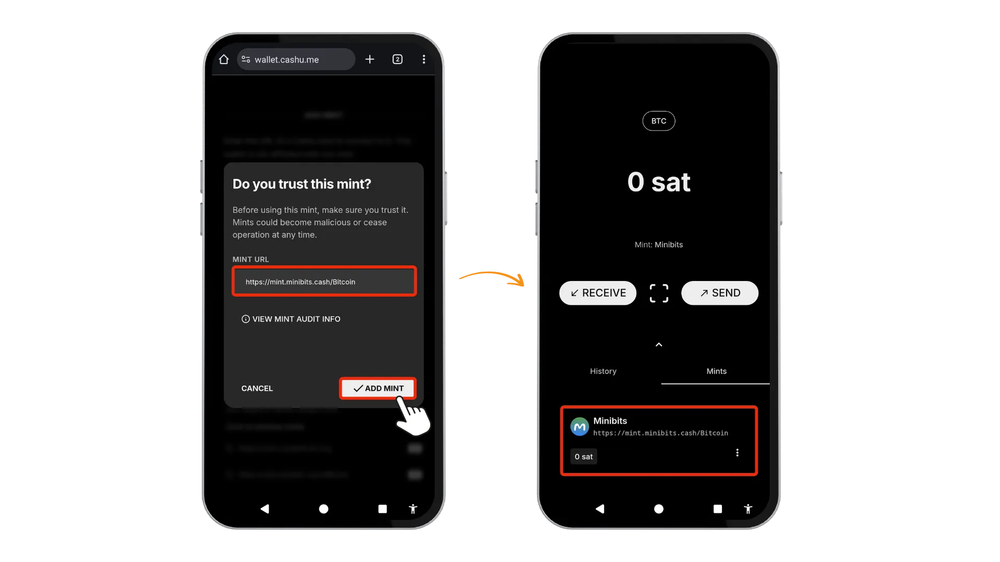

## 2️⃣ Funding Your Wallet

Cashu.me offers two distinct methods to fund your wallet. When you tap `Receive` on the Home Screen, you'll see options to receive funds via `ECASH` or via `LIGHTNING.` Let's explore both options.

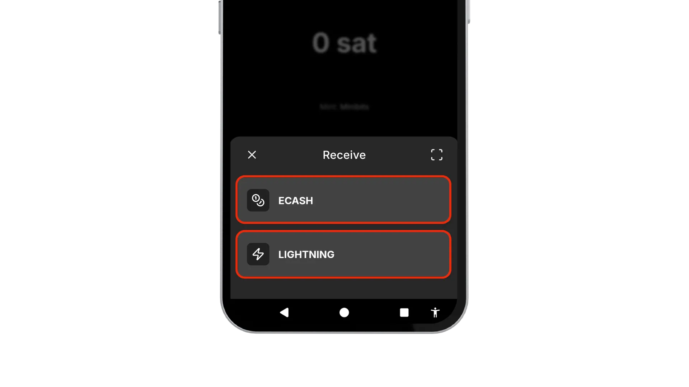

### Funding via LIGHTNING  

The first option is to fund the wallet via Lightning invoice. `Select a mint` if you have added different mints and define the `amount (sats)` you want to receive. Then tap on `CREATE INVOICE.` Now you get a QR-Code displayed you can scan with another lightning wallet or you  can simply `Copy` the invoice and paste into another wallet to pay and fund your cashu.me wallet. 

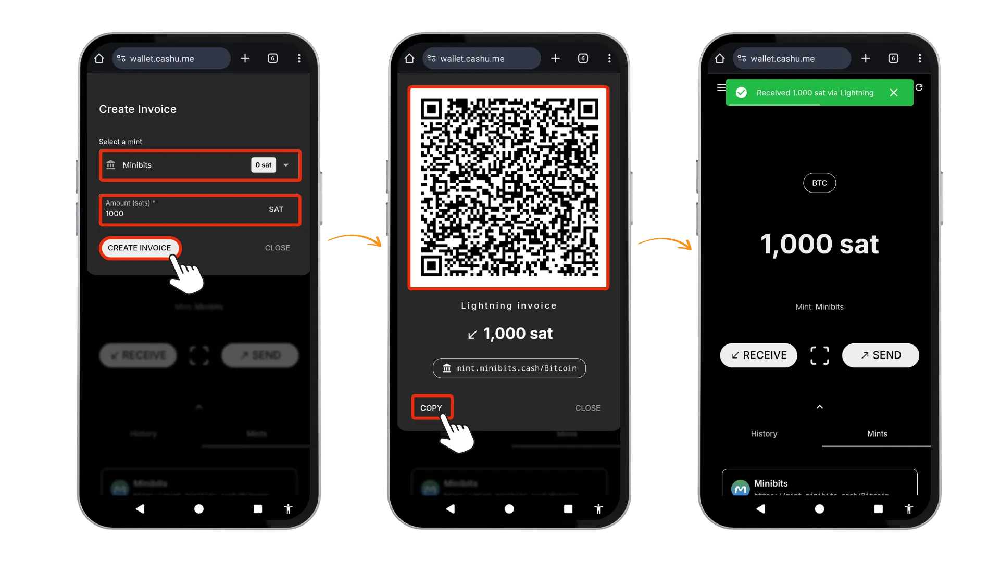

### Receiving ecash

The ecash method lets you receive tokens directly from another ecash wallet. Start by tapping the `Receive` button, and selecting the `ECASH` option. You'll be able to `Paste` or `Scan` or use `NFC` to submit a Cashu token from another wallet. If you choose to paste, enter the token string you've copied from another wallet, the `Amount` and the `Mint` will automatically be displayed. Tap `RECEIVE` to complete the transaction, and the sats will appear in your wallet. Notice that your balance is now distributed across multiple mints. For example, you might have 1,000 sats in your Minibits `Mint` and an additional 1,000 sats in a Coinos `Mint`. This separation across different mints is an important aspect of Cashu's architecture.

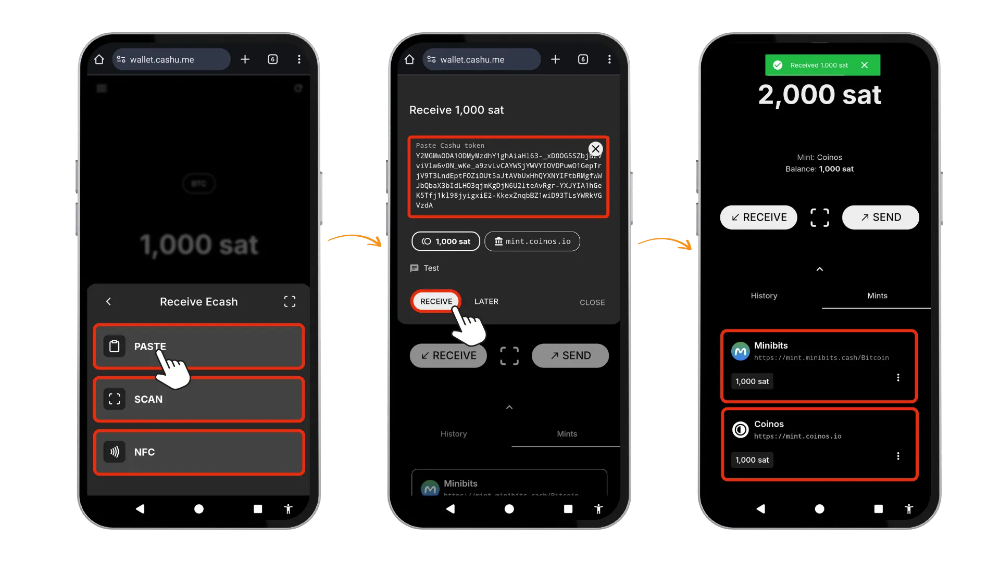

### Swapping Between Mints

If you no longer trust a particular mint you've added, cashu.me offers a feature to `Swap` funds from one mint to another. Navigate to the mints tab and scroll down until you see `Multimint Swaps`. Select the mint `FROM` and `TO` from the dropdown menus and enter the amount you wish to transfer. Tap `SWAP`to move the tokens between mints. This will be executed via Lightning transaction, so you need to leave room for potential Lightning fees. In my example, 1 sat was sufficient.

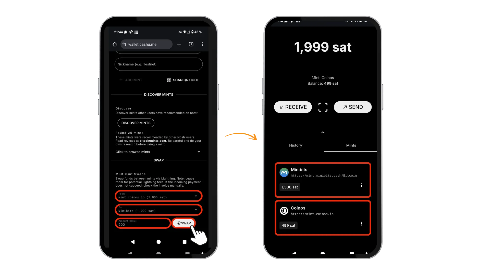

## 3️⃣ Sending funds

To send sats, Cashu.me provides two options. To send via `ecash` or via `lightning`. Let's have a look on both options. 

### Sending via Lightning

To send via Lightning, follow these steps: 

1. Tap on `SEND` on the Home Screen and select `Lightning`
2. The app will prompt you to enter a  `Lightning invoice` or `-address`. You can paste the invoice/address directly, or use the scan QR code option to capture it visually, then confirm with `ENTER`
3. Select the Mint from which you want to pay using the Dropdown field and tap `PAY` to confirm. **Note**: there is also an option to use `Multinut` under `Settings` -> `Experimental` which allows you to pay invoices from multiple mints at once. 
4. After successful completion, you'll see payment confirmation and the amount deducted from your balance.

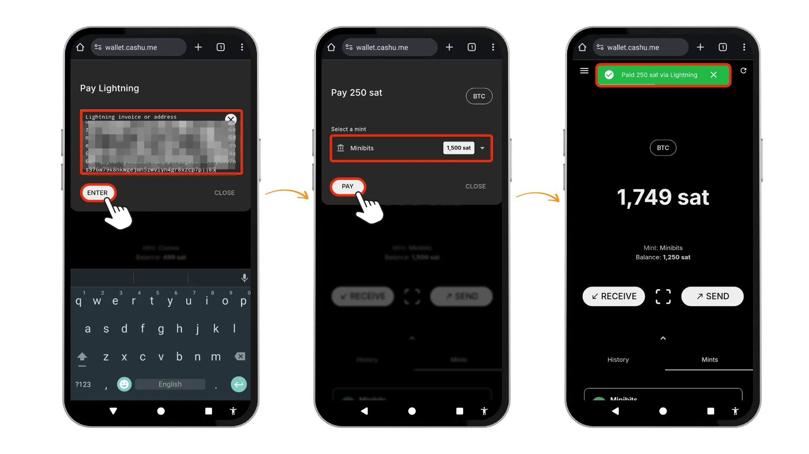

### Sending via ecash

Sending ecash is similarly straightforward.

1. Tap on `SEND` and this time select the  `ECASH` option. 
2. `Select a mint` and enter the `Amount` you want to send in sats and tap `SEND` to confirm
3. This creates an `Animated QR Code` that you can customize by adjusting the Speed and Size parameters. Anyone can scan this QR Code to redeem the sats immediately, or you can tap COPY to send the token string to someone else through alternative channels like Bluetooth, NFC, or standard messaging.
4. I'm opening another wallet. Paste from the clipboard and select `Receive ecash` in the other wallet. 

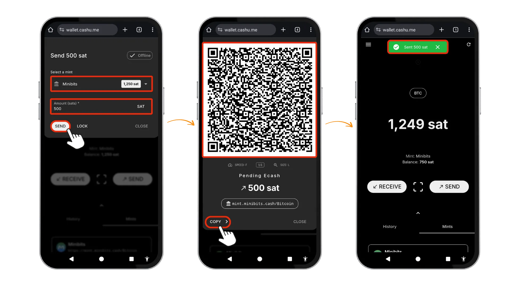

## 4️⃣ Additional Features

Beyond the core sending and receiving functionality, Cashu.me offers powerful additional features that enhance your Bitcoin experience within the Nostr ecosystem.

### Nostr Wallet Connect

Nostr Wallet Connect (`NWC`) transforms how you interact with Nostr applications by creating a seamless connection between your wallet and social apps. This protocol allows applications like [Damus](https://damus.io/) or [Primal](https://primal.net/home) to request payments directly through Nostr relays without requiring you to leave the app.

To set up `NWC` in Cashu.me:  

1. Go to `Settings` on the top left Hamburger menu
2. Scroll to the `NOSTR WALLET CONNECT` Section and tap the `Enable` Button
3. You'll then set an allowance to establish the maximum amount applications can spend from your wallet.
4. Once configured, you can copy the connection string and paste it into any Nostr client that supports `NWC`, enabling instant zapping and tipping functionality.

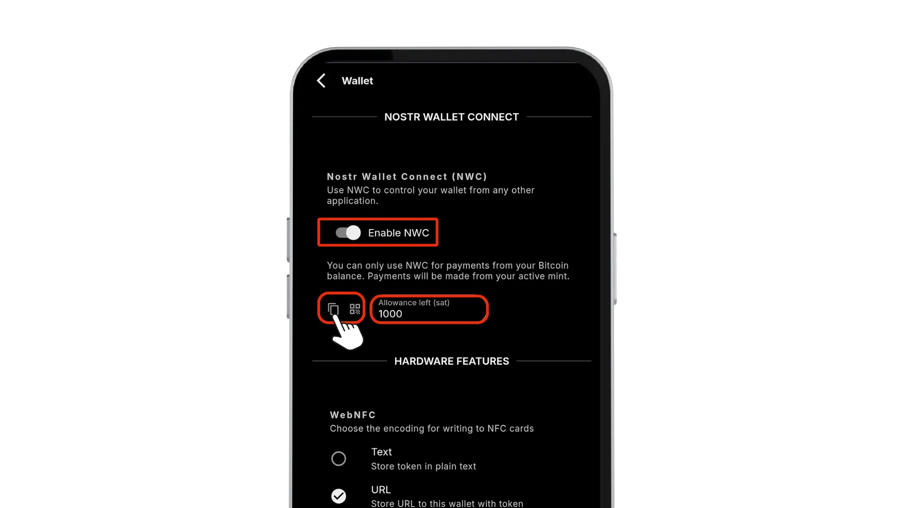

### Lightning Address via npub.cash

Cashu.me integrates with [npub.cash](https://npub.cash/) to provide you with a Lightning address that works seamlessly with the Nostr protocol. Here you can sign up and claim your username by providing your Nostr `nsec`, which costs 5,000 sats and supports the npub.cash project, or you can use any Nostr public key (`npub`) without registration.

First, go to `Settings` and tap `Enable` Lightning address with npub.cash. This will generate an npub.cash address using a `npub` string derived from your wallet seed phrase by default.

Alternatively, visit [this webpage](https://npub.cash/username) to claim a custom username using your own Nostr `nsec`, giving you a personalized Lightning address like username@npub.cash.
 
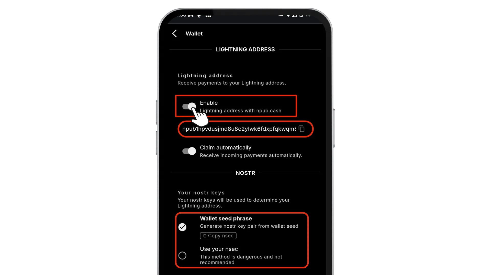

## 🎯 Conclusion

Cashu.me delivers private Bitcoin payments that function like physical cash — instantly and peer-to-peer without exposing your transaction history. I personally appreciate its PWA architecture because it operates free from app store restrictions. By combining the security of Bitcoin, the speed of Lightning, and the privacy of ecash, the wallet offers use cases that could enhance everyday Bitcoin adoption.

While you have full control over your ecash tokens through self-custody, remember that mints act as trusted third parties that hold the underlying Bitcoin reserves. The ability to use multiple mints and swap between them provides flexibility while maintaining privacy.

Thanks to features like NWC and npub.cash addresses, Cashu.me is an appealing wallet option for social clients who value privacy and sovereignty over big tech policy restrictions.

## 📚 Resources

[https://github.com/cashubtc/cashu.me](https://github.com/cashubtc/cashu.me)

[https://github.com/cashubtc](https://github.com/cashubtc)

[https://github.com/cashubtc/awesome-cashu](https://github.com/cashubtc/awesome-cashu)

[https://cashu.space/](https://cashu.space/)
