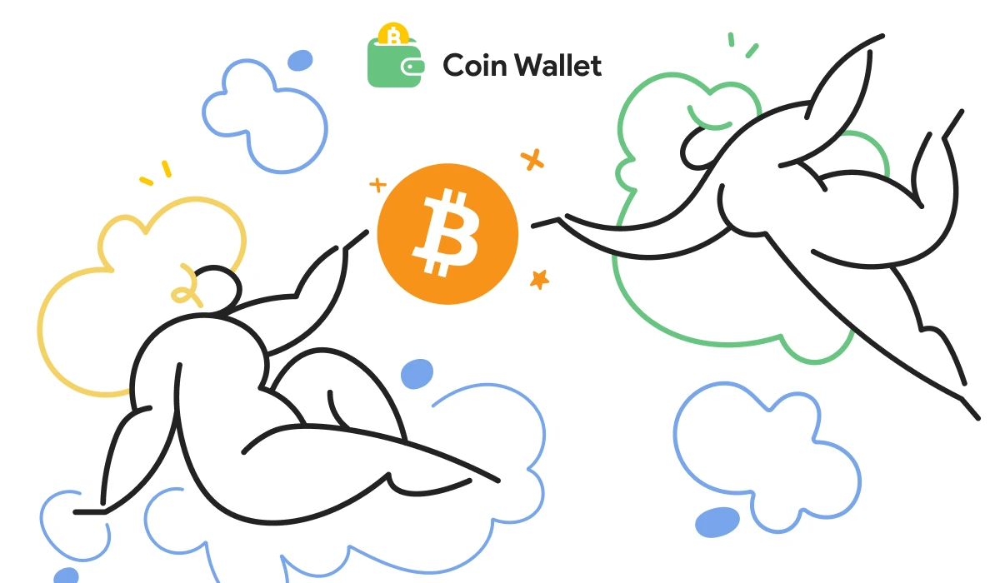
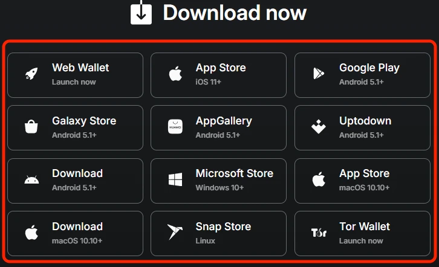
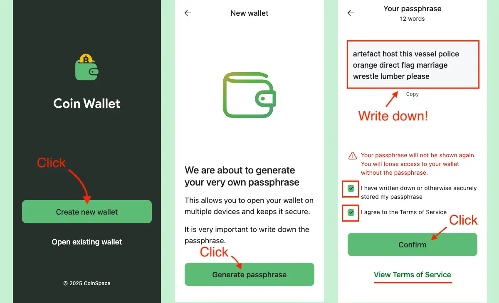
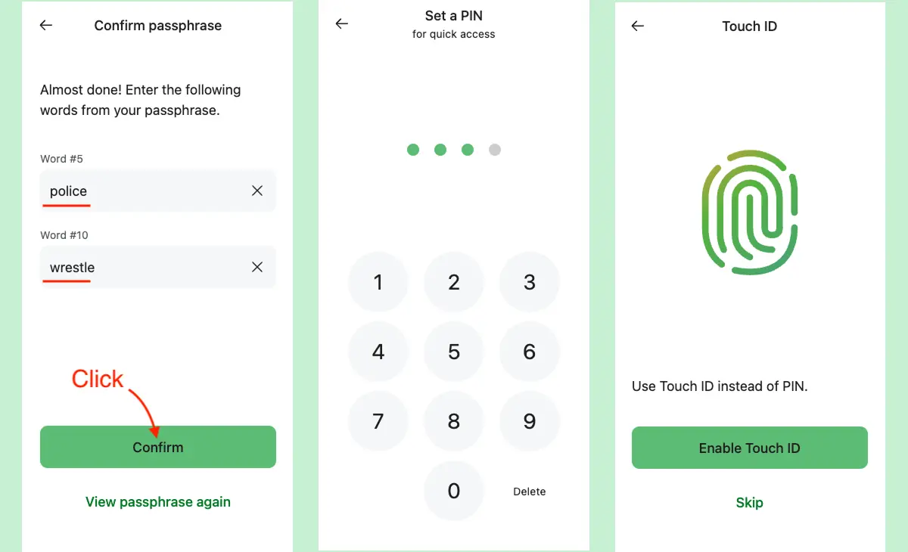
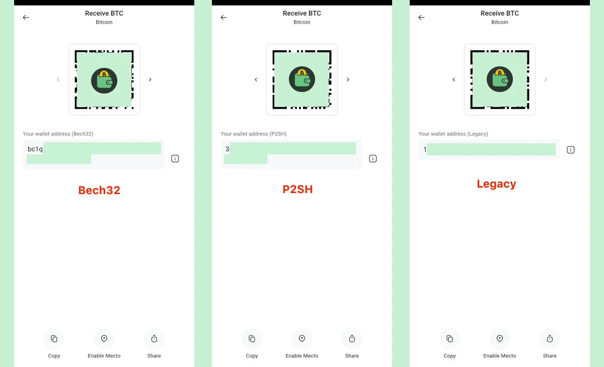
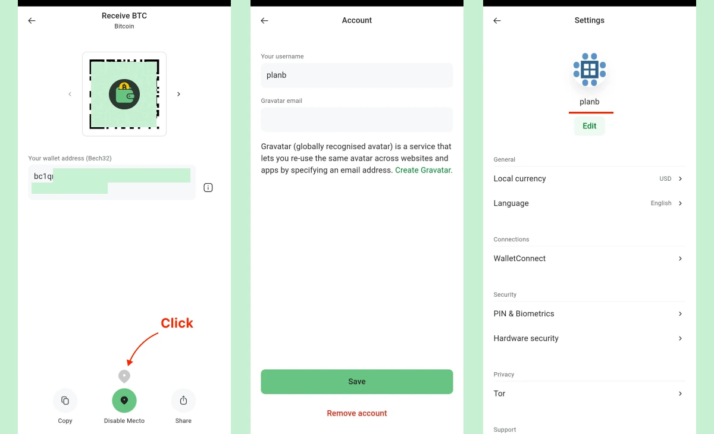
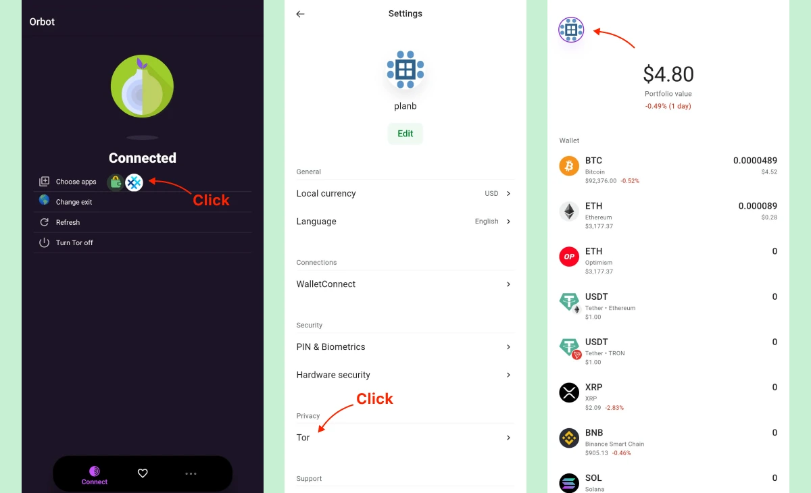

Ce tutoriel traite de [Coin Wallet](https://coin.space/) - un crypto wallet autodéclaratif pour les appareils mobiles, et de la manière d'améliorer la sécurité et la confidentialité lors de l'utilisation d'applications mobiles wallet.

## À propos de Coin Wallet

**Coin Wallet** est un wallet auto-détenu / non-détenu, open-source, créé par une équipe de passionnés de Bitcoin en 2015. Il a commencé comme une application web, suivie par l'application iOS en 2017, et l'application Android en 2020 - disponible sur Google Play, Samsung Galaxy Store, et Huawei AppGallery.

Principaux avantages :

- Architecture non privative de liberté
- Entièrement [code source ouvert](https://github.com/CoinSpace/CoinSpace/blob/master/LICENSE)
- Un design simple et épuré
- Concentré sur l'objectif principal - stocker les crypto-monnaies en toute sécurité, sans fonctionnalités superflues
- Prise en charge multiplateforme : mobile (iOS et Android), bureau, web
- Prise en charge RBF (Replace-By-Fee) - accélère les transactions bloquées à tout moment
- 2FA matériel avec [YubiKey](https://www.yubico.com/works-with-yubikey/catalog/coin-wallet/) / clé FIDO2
- Prise en charge intégrée de Tor : acheminez tout le trafic via le réseau Tor pour une confidentialité maximale

## 1️⃣ Installation de Coin Wallet

Coin Wallet est disponible sur toutes les principales plateformes.

- [iOS App Store](https://apps.apple.com/app/coin-wallet-bitcoin-crypto/id980719434)

- [Android Google Play](https://play.google.com/store/apps/details?id=com.coinspace.app)

- [Android (Galaxy Store)](https://galaxystore.samsung.com/detail/com.coinspace.app)

- [Android (Huawei AppGallery)](https://appgallery.huawei.com/app/C112183767)

- [Android (Uptodown)](https://coin-wallet.en.uptodown.com/android)

- [Android APK](https://coin.space/api/v3/download/android-apk/any)

- [Tous les liens de publication](https://github.com/CoinSpace/CoinSpace/releases)

Également disponible pour le bureau (Windows, Linux, macOS), en tant qu'application web et via Tor.

## 2️⃣ Création d'un Wallet et définition du code PIN

Une wallet est créée à partir d'une passphrase - une séquence aléatoire de 12 mots séparés par des espaces, générée à partir d'une [liste de 2048 mots](https://github.com/paulmillr/scure-bip39/blob/main/src/wordlists/english.ts).

Coin Wallet prend en charge les phrases de passe de 12, 15, 18, 21 ou 24 mots importées d'autres portefeuilles.

La passphrase est la forme lisible par l'homme de la clé privée principale. Elle doit être sauvegardée en toute sécurité. La passphrase est tout ce qui est nécessaire pour accéder à la wallet ou la restaurer. Si la passphrase est perdue, la wallet et tous les fonds sont définitivement perdus. La passphrase ne doit jamais être partagée. La Coin Wallet ne stocke pas les clés sur un serveur ou une base de données.

**Est-ce qu'un passphrase de 12 mots est sûr ?

Avec 2048 mots possibles par position, il y a 2048¹² ≈ 10³⁹ combinaisons - ce qui fournit ~128 bits de sécurité, comparables aux clés privées Bitcoin. Ce niveau est largement considéré comme suffisant.

Une fois le passphrase noté et confirmé, l'application demande de définir un **NIP à 4 chiffres** pour l'accès quotidien. Pour plus de commodité, vous pouvez activer l'authentification biométrique (empreinte digitale ou reconnaissance faciale) au lieu d'utiliser un code PIN.

Il n'y a pas de compte, pas de récupération de clé, pas de réinitialisation passphrase et pas d'annulation de transaction. La sécurité relève de l'entière responsabilité de l'utilisateur.

Pour plus de détails sur les meilleures pratiques en matière de sauvegarde de la phrase mnémonique :

https://planb.academy/tutorials/wallet/backup/backup-mnemonic-22c0ddfa-fb9f-4e3a-96f9-46e2a7954270

## 3️⃣ Passphrase + PIN. Quand et comment ils sont utilisés

**Quand la passphrase est-elle requise ?

Seulement dans ces rares cas :

- Installation du wallet sur un nouvel appareil
- Réinstallation de l'application Coin Wallet
- Effacer les données de l'application/du navigateur (stockage local)
- Suppression d'une clé matérielle du compte
- Saisir trois fois un code PIN erroné (l'application se verrouille pour des raisons de sécurité)

Au quotidien, le code PIN à 4 chiffres suffit à déverrouiller le wallet.

**Phrase de passe + code PIN : comment ça marche**

La passphrase est la véritable clé privée principale et fonctionne sur n'importe quel appareil.

Comme il serait peu pratique de taper 12 à 24 mots à chaque fois, Coin Wallet utilise un code PIN à 4 chiffres pour un accès rapide et quotidien sur l'appareil actuel.

Un simple code PIN n'est pas suffisamment sûr pour protéger directement la clé principale, c'est pourquoi il n'est jamais utilisé pour le cryptage. Au lieu de cela :

- Le code PIN est envoyé au serveur et échangé contre un long token cryptographique.
- Cette token décrypte la clé principale cryptée stockée uniquement sur l'appareil.

Si le code PIN est saisi trois fois de manière incorrecte, le serveur efface définitivement la token. La clé stockée localement devient inutilisable et la seule façon de récupérer la wallet est d'entrer la passphrase d'origine.

Cette conception est à la fois pratique et offre une solide protection de repli.

## 4️⃣ Recevoir des ₿itcoins - Types de Address et confidentialité

Coin Wallet prend en charge les trois formats d'adresse Bitcoin :

- Native SegWit (Bech32)** - commence par **bc1q** - frais les plus bas, recommandé
- SegWit (P2SH)** emboîté - commence par **3**
- Héritage (P2PKH)** - commence par **1**

**Pourquoi l'adresse change-t-elle après chaque dépôt ?

Ceci est intentionnel et protège la vie privée. Chaque fois que des pièces sont reçues, Coin Wallet génère automatiquement une nouvelle adresse inutilisée. Si la même adresse était réutilisée (par exemple, pour le salaire mensuel), n'importe qui pourrait facilement faire la somme de toutes les transactions entrantes sur un explorateur de blockchain et connaître le revenu total.

Les anciennes adresses restent valables pour toujours - vous pouvez toujours les recevoir - mais l'utilisation d'une nouvelle adresse à chaque fois est la meilleure pratique recommandée en matière de protection de la vie privée.

**Comment recevoir Bitcoin:**

1. Ouvrir la pièce

2. Tapez **Recevoir**

3. Choisissez le type d'adresse souhaité (de préférence **bc1q** - `Native SegWit`)

4. Montrer le code QR ou copier l'adresse et l'envoyer au payeur

**En option - Mecto (pour les paiements en personne):**

Sur le même écran de réception, il y a un bouton "Mecto".

Lorsque vous l'allumez :

- Il vous sera demandé d'entrer un **nickname** (gravatar)
- Votre position actuelle et votre adresse de réception sont temporairement partagées avec d'autres utilisateurs Coin Wallet qui ont également activé Mecto
- Ils peuvent vous découvrir sur une petite carte et vous envoyer des pièces sans avoir à taper ou à scanner

Les données ne sont visibles que par les autres utilisateurs de Mecto et sont automatiquement supprimées au bout d'une heure (ou immédiatement lorsque vous l'éteignez).

Mecto est totalement optionnel - laissez-le désactivé si vous préférez un maximum de confidentialité.

## 5️⃣ Envoi de ₿itcoin

Pour envoyer Bitcoin :

1. Ouvrez la pièce → tapez **Envoyer**

2. Coller l'adresse ou scanner le code QR

3. Saisir le montant (ou appuyer sur **Max**)

4. Choisissez la vitesse de transaction :

| Speed   | Approx. confirmation time | Fee level     |
|---------|---------------------------|---------------|
| **Slow**    | ~120 minutes              | Lowest
| **Default** | ~60 minutes               | Medium
| **Fast**    | ~20 minutes               | Higher

5. Confirmez avec votre code PIN à 4 chiffres → la transaction est diffusée

### Comment accélérer une transaction ₿itcoin en attente (RBF)

Si vous avez choisi un tarif lent et que la transaction est bloquée :

1. Aller dans l'onglet **Histoire**

2. Appuyez sur la transaction en attente

3. Tap **Accelerate** (Remplacement à titre onéreux)

4. Confirmer → la transaction sera rediffusée avec une redevance plus élevée

L'accélération RBF est actuellement prise en charge pour :

Bitcoin - Avalanche - Binance Smart Chain - Ethereum - Ethereum Classic - Polygon

En savoir plus sur Replace-by-fee (RBF) : https://bitcoinops.org/en/topics/replace-by-fee/

## 6️⃣ Exportation de clés privées

**Quand avez-vous besoin d'une clé privée ?

(99 % des utilisateurs ne le font jamais - les 12 mots de passphrase suffisent)

| Situation                                      | Why you need the private key                     |
|------------------------------------------------|--------------------------------------------------|
| Sweeping an old paper wallet                   | To move funds to your current wallet             |
| Importing into a hardware signer (e.g. Coldcard) | For offline signing                              |
| Emergency recovery (lost seed but app still open) | To rescue coins before the app is gone           |
| Using tools that don’t accept seed phrases     | Some watch-only or signing utilities             |

### Comment exporter des clés privées dans Coin Wallet

1. Ouvrir **Bitcoin (BTC)**

2. Descendez au bas de la page et appuyez sur **Exporter les clés privées**

3. L'application affiche chaque adresse avec solde + sa clé privée au format **WIF** (commence par 5, K ou L) et un code QR.

Seules les adresses non vides apparaissent.

**Exemple de clé WIF**

`L2v1eK4i9j3k3j4k3j4k3j4k3j4k3j4k3j4k3j4k3j4k3j4k3j4k3j4k`

**Ce qu'il faut faire ensuite (recommandé)**

- Ouvrir Electrum, Sparrow, BlueWallet ou tout matériel wallet
- Importer/effacer la clé privée
- Tous les fonds sont instantanément transférés à une nouvelle adresse sécurisée sous votre seed actuelle

Ne stockez jamais la clé privée sous forme numérique en texte clair. Après le balayage, elle peut être supprimée en toute sécurité.

Pour un guide complet sur les clés privées et les chemins de dérivation : [How to Work with Private Keys : The Ultimate Guide](https://coin.space/how-to-work-with-private-keys-the-ultimate-guide/)

## 7️⃣ Détails techniques - BIP39, BIP32 et voies de dérivation

Coin Wallet respecte strictement les normes officielles Bitcoin utilisées par presque tous les portefeuilles sérieux.

`BIP39` - comment le passphrase devient la clé privée principale

- Nombre de mots par défaut : 12
- Facultatif passphrase/mot de passe : aucun ("")
- Entropie initiale : 128 bits (12 mots) → 256 bits (24 mots)
- Mise en œuvre d'un logiciel libre : https://github.com/paulmillr/scure-bip39
- Liste de mots : liste standard de 2048 mots en anglais
- Importation de phrases de 12, 15, 18, 21 et 24 mots à partir de n'importe quel autre BIP39 wallet

`BIP32 + BIP44/BIP49/BIP84` - génération déterministe de toutes les adresses

A partir d'une clé principale, le wallet peut generate des milliards d'adresses dans un ordre strictement défini. C'est pourquoi les 12 mêmes mots entrés dans Electrum, Sparrow, Trezor, Ledger, BlueWallet, etc. afficheront exactement les mêmes adresses et les mêmes soldes.

**Chemins de dérivation utilisés dans Coin Wallet pour Bitcoin**

| Address type              | Standard | Derivation path       | Starts with | Comment                              |
|---------------------------|----------|-----------------------|-------------|--------------------------------------|
| Native SegWit (Bech32)    | BIP84    | `m/84'/0'/0'`         | bc1q…       | Modern format, lowest fees           |
| Nested SegWit (P2SH)      | BIP49    | `m/49'/0'/0'`         | 3…          | Compatibility wrapper for old services |
| Legacy (P2PKH)            | BIP44    | `m/44'/0'/0'`         | 1…          | Oldest format, highest fees          |

A l'intérieur de chaque chemin :

- `/0` - chaîne externe (adresses que vous indiquez pour recevoir des paiements)
- `/1` - chaîne interne (modifier les adresses que le wallet utilise lui-même)

Comme la Coin Wallet suit ces normes publiques sans aucun changement, vos fonds resteront récupérables dans n'importe quelle autre wallet compatible, même dans 10-20-30 ans.

## 8️⃣ Améliorer l'anonymat avec Tor

**Pourquoi utiliser Tor en Coin Wallet** ?

Tor cache votre adresse IP réelle aux nœuds Bitcoin, aux échanges et aux observateurs.

Tout le trafic (soldes, transactions, échanges) passe par le réseau Tor - pas de connexions directes, pas de fuites d'IP.

Ceci est implémenté directement dans le code source de l'application (voir [.env configuration](https://github.com/CoinSpace/CoinSpace/blob/master/web/.env#L31)).

Coin Wallet a une adresse .onion cachée et, depuis la v6.6.3 (décembre 2024), **un support Tor intégré directement dans l'application mobile**.

### Comment activer Tor sur Android et iOS

1. **Installer Orbot** - application officielle du projet Tor (gratuite)

   - Android → [Google Play](https://play.google.com/store/apps/details?id=org.torproject.android) / [F-Droid](https://orbot.app/en/)
   - iPhone / iPad → [App Store](https://apps.apple.com/us/app/orbot/id1609461599)

2. **Ouvrez Orbot → appuyez sur Start**

Sélectionnez **Coin Wallet** dans la liste pour que seul le wallet utilise Tor (facultatif mais recommandé)

Attendez que le message **"Connected "** s'affiche (10 à 30 secondes)

3. **Ouvrez Coin Wallet → Paramètres → Réseau**

Activer **Utiliser Tor**

4. **Vérifier l'état**

Une **icône violette d'oignon Tor** apparaît dans la barre supérieure → tout le trafic est désormais acheminé via Tor

C'est tout - votre mobile Coin Wallet est totalement anonyme.

Profitez d'une gestion privée des crypto-monnaies !

## 📝 Conclusion

[Coin Wallet](https://coin.space/) - l'un des véritables pionniers Bitcoin wallet avec un historique de développement de 10 ans.

Il est délibérément simple et reste concentré sur sa mission principale : stocker vos crypto-monnaies en toute sécurité.

Il n'y a pas de publicité, pas de fil d'actualité, pas d'abonnement, pas de fonctions sociales, pas de distractions - juste un wallet propre, rapide et autonome qui fait exactement ce qu'il est censé faire.

Coin Wallet met la simplicité et la sécurité au premier plan - depuis toujours et pour toujours.

## 📖 Ressources

https://coin.space/

https://support.coin.space/hc/en-us

https://en.bitcoin.it/wiki/Wallet

https://bitcoinops.org/

https://github.com/CoinSpace/CoinSpace/

https://www.yubico.com/works-with-yubikey/catalog/coin-wallet/

https://github.com/paulmillr/scure-bip39/blob/main/src/wordlists/english.ts

https://github.com/paulmillr/scure-bip39