Czym jest funkcja **Key Teleport** oferowana przez Coinkite z jej flagowym urządzeniem ColdCardQ?

**Key Teleport** pozwala bezpiecznie przesyłać poufne dane między 2 urządzeniami ColdCardQ. Kanał transmisji nie musi być nawet szyfrowany i może być publiczny.

Może to być wykorzystane do transferu:

- frazy **gW-0** (mistrz seed ColdCardQ lub sekrety przechowywane w [skarbcu seed] ColdCardQ (https://coldcard.com/docs/temporary-seeds/#seed-vault).
- **poufne notatki i hasła**: może to być dowolny sekret lub cały katalog [Secure Notes & Passwords] (https://coldcard.com/docs/secure_notes/) w ColdCardQ.
- kopia zapasowa całego **ColdCardQ**: ColdCardQ odbierający tę kopię zapasową nie może mieć seed Master, aby to zadziałało.
- gW-3 (**częściowo podpisane transakcje Bitcoin**) jako część schematu wielopodpisowego.

Wymaga to aktualizacji [oprogramowania sprzętowego urządzenia do wersji v1.3.2Q](https://coldcard.com/docs/upgrade/) lub nowszej.

## Jak korzystać z Key Teleport?

### 1- Przesyłanie dowolnego typu danych

Tutaj przyjrzymy się transferowi zdań seed, notatek, haseł lub całego transferu kopii zapasowej ColdCardQ. Przypadek transferu PSBT dla transakcji z wieloma podpisami zostanie omówiony później.

#### Przygotowanie urządzenia do odbierania wpisów tajnych

W menu **"Zaawansowane/Narzędzia**" na karcie ColdCardQ wybierz **"Kluczowy teleport (start) "**.

Na następnym ekranie proponowane jest 8-cyfrowe hasło, tutaj "20420219". Będziesz musiał przekazać to hasło nadawcy. Do wysłania tego hasła można użyć na przykład wiadomości sms lub ulubionego bezpiecznego systemu przesyłania wiadomości, a nawet połączenia głosowego.

Następnie kliknij przycisk **"Enter**" na ColdCardQ, aby przejść do następnego kroku.

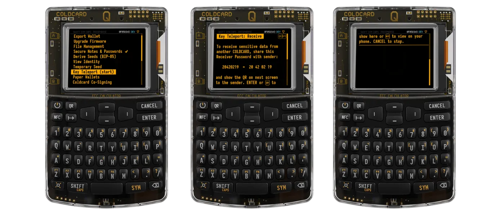

Na ekranie zostanie wygenerowany kod QR. Po raz kolejny musisz przekazać ten kod QR "nadawcy" ColdCardQ. Najłatwiej to zrobić za pomocą połączenia wideo.

**NIE WYSYŁAJ TEGO KODU QR TYM SAMYM KANAŁEM TRANSMISJI, KTÓRY ZOSTAŁ UŻYTY DO WYSŁANIA POPRZEDNIEGO 8-CYFROWEGO HASŁA**.

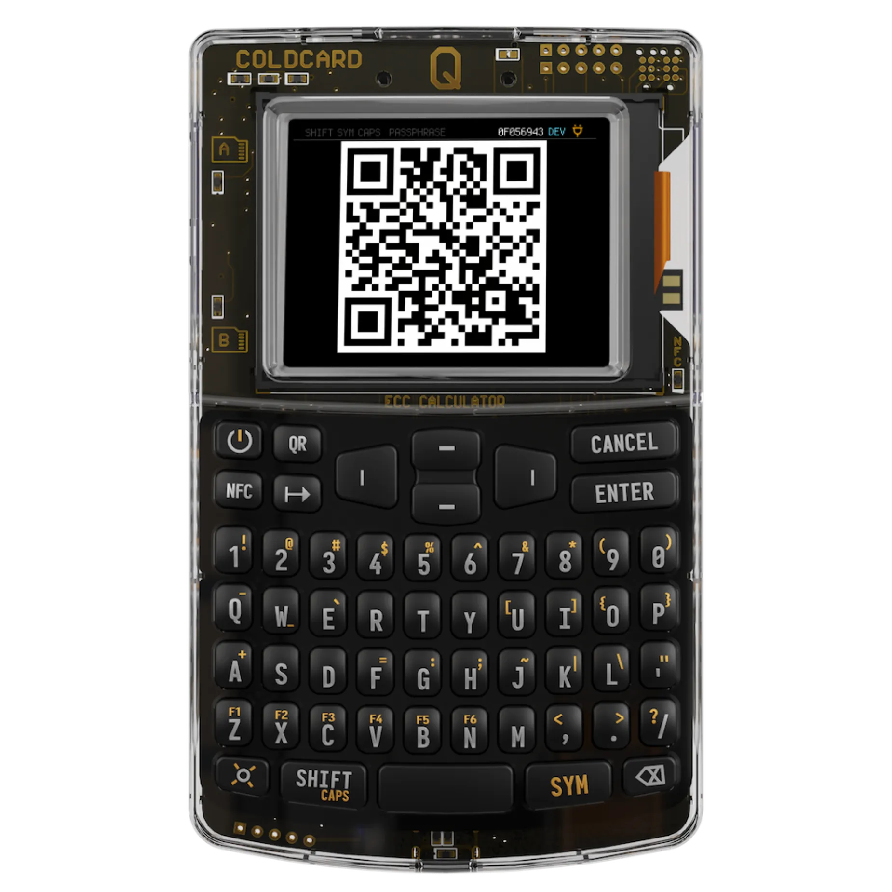

*Dla tych, którzy są zainteresowani, spróbujmy zrozumieć podstawowy mechanizm, który pozwala na przesyłanie tajemnic przez niezabezpieczone kanały*

*To, co faktycznie tutaj robimy, to inicjowanie transferu sekretów za pomocą metody Diffiego-Hellmana, omówionej w kursie BTC204, który zamieściłem poniżej*

https://planb.network/courses/65c138b0-4161-4958-bbe3-c12916bc959c

*Obecnie posiadamy:*

- wygenerował efemeryczną parę kluczy (publiczny/prywatny odpowiednio Ka i ka z Ka=G.ka, G jest punktem generatora ECDH) oraz 8-cyfrowe hasło.
- użył tego hasła do zaszyfrowania klucza publicznego (Ka) za pomocą AES-256-CTR, a następnie przesłał to hasło kanałem komunikacyjnym A do "wysyłającego" **ColdCardQ**.
- na koniec przesłaliśmy zaszyfrowany pakiet do nadawcy za pośrednictwem powyższego kodu QR, używając drugiego kanału komunikacyjnego B innego niż pierwszy.

#### Przygotuj urządzenie, które będzie wysyłać sekrety

Z urządzenia wysyłającego kliknij przycisk **"QR "**, aby zeskanować kod QR wysłany do Ciebie przez urządzenie odbierające, a następnie wprowadź 8-cyfrowe hasło przekazane Ci w poprzednim kroku osobnym kanałem. Jesteśmy teraz gotowi do rozpoczęcia wysyłania danych z urządzenia "wysyłającego".

**Nie należy wprowadzać nieprawidłowego 8-cyfrowego hasła, ponieważ nie zostanie wyświetlony żaden komunikat o błędzie i proces będzie kontynuowany. Jednak końcowy transfer danych nie powiedzie się i konieczne będzie rozpoczęcie od nowa**.

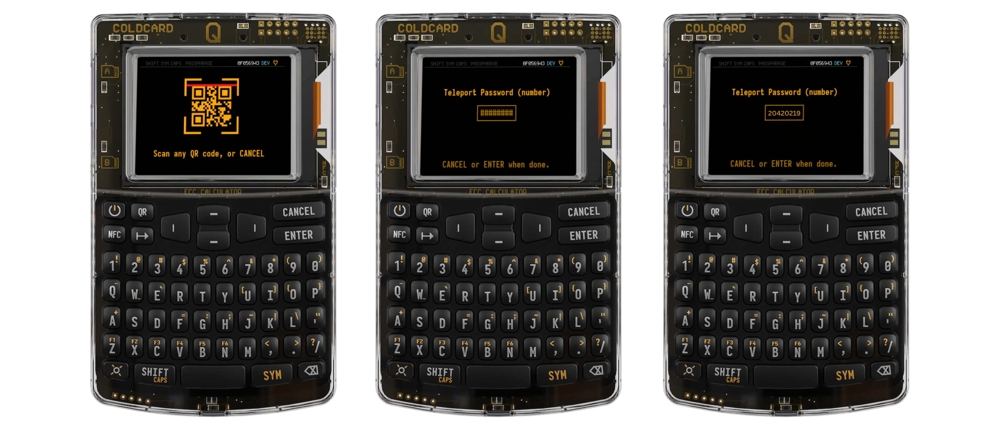

*Dla bardziej dociekliwych przyjrzyjmy się jeszcze raz, co robimy w zakresie kryptografii i tajnego transferu:*

- zaimportowaliśmy zaszyfrowane dane, skanując kod QR na urządzeniu odbierającym.
- następnie odszyfrowaliśmy je za pomocą 8-cyfrowego hasła przesłanego nam za pośrednictwem drugiego kanału.
- jesteśmy zatem w posiadaniu klucza publicznego (Ka) wygenerowanego początkowo przez odbiorcę.
- Następnie generate nową efemeryczną parę kluczy (Kb/kb, z Kb=G.kb) na urządzeniu wysyłającym, której używamy do zastosowania ECDH do Ka. Wykonujemy zatem operację kb.Ka=Ks , gdzie Ks jest nazywany **"kluczem sesji "**

Zostaniesz teraz poproszony o wybranie charakteru tajemnic, które mają być przesyłane między 2 urządzeniami ColdCardQ (poufne notatki, hasło, pełna kopia zapasowa, nasiona zawarte w skarbcu, urządzenie główne seed).

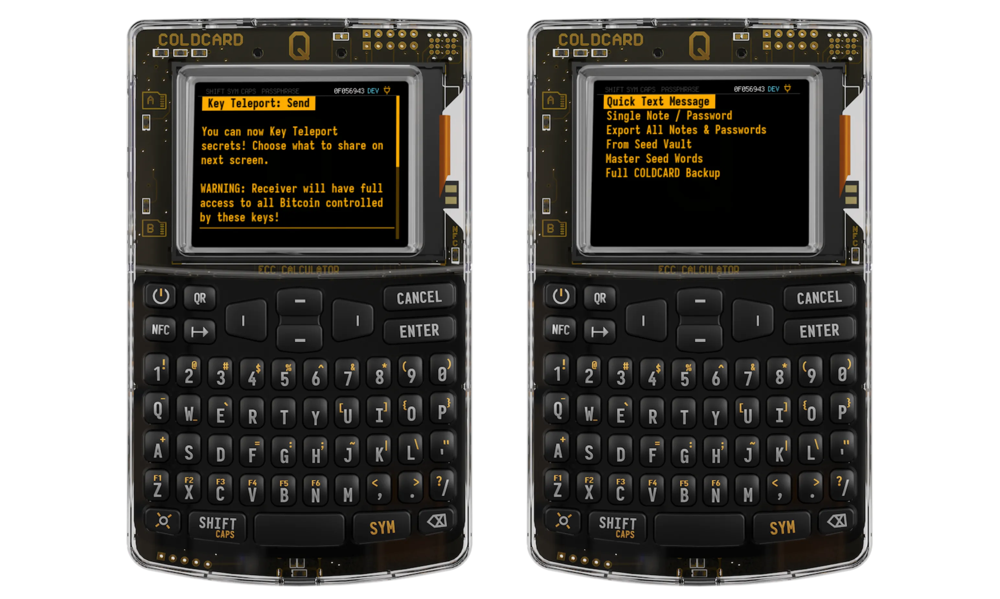

Tutaj naszym sekretem będzie krótka wiadomość poprzez wybranie **"Quick Text Message "**. Wpisz swoją wiadomość (dla nas "PlanB Network rocks"), a następnie naciśnij **"ENTER "**.

Następnie urządzenie wygeneruje nowe losowe hasło o nazwie **"Teleport Password "** , w przykładzie "NE XG BT SK".

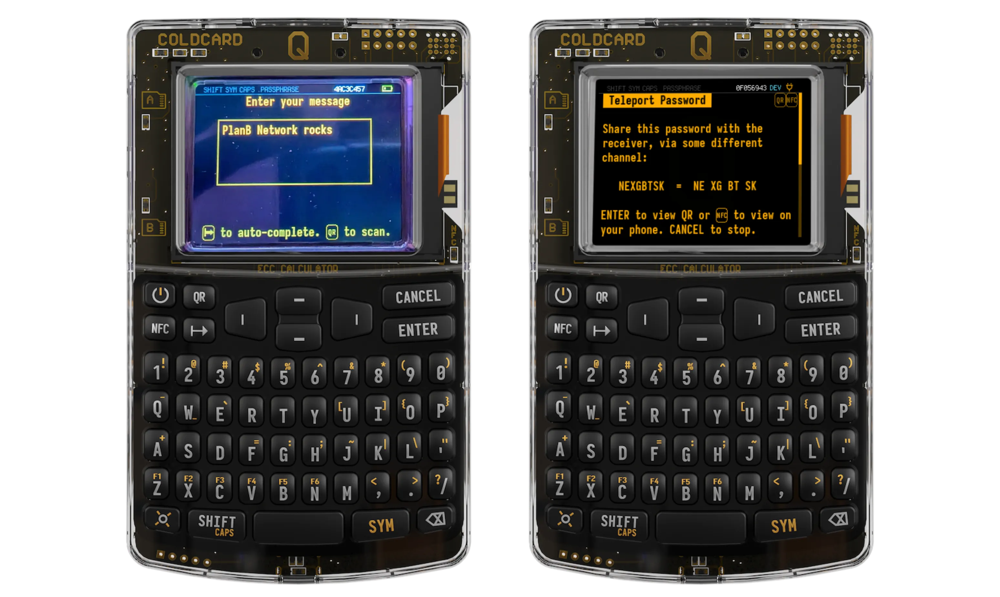

Naciśnij **"ENTER "**, a zostanie wyświetlony nowy kod QR. Należy go zeskanować przez urządzenie odbierające. Na innym kanale komunikacji prześlij **"Hasło teleportu** do odbiornika.

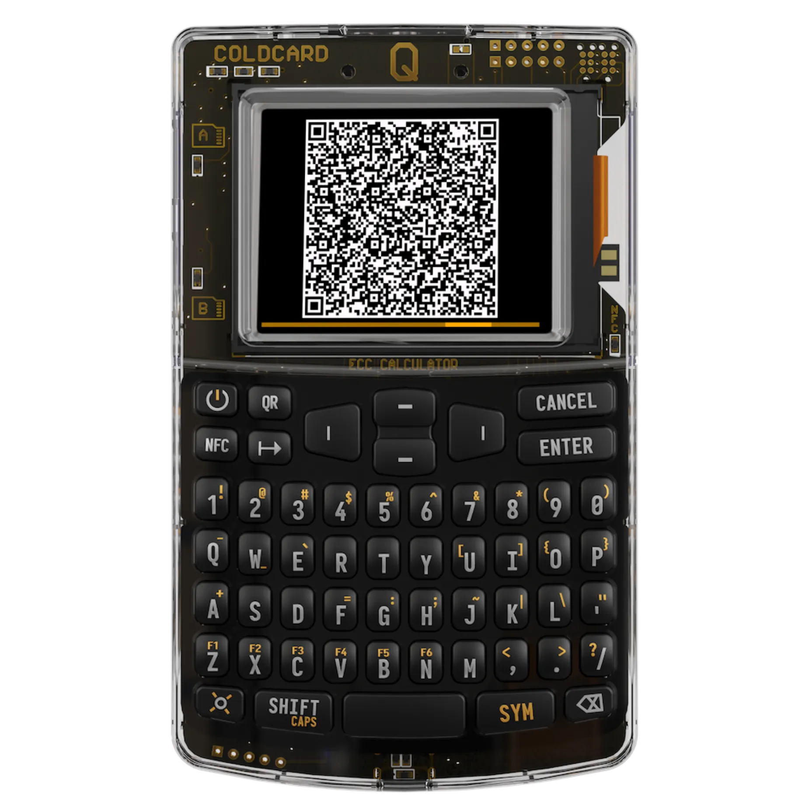

*Jeszcze raz, dla ciekawskich, na tym etapie:*

- po wybraniu sekretów do przesłania, generate tworzy nowe losowe hasło o nazwie **"Teleport Password"**.
- następnie szyfrujemy sekrety za pomocą AES-256-CTR przy użyciu **"klucza sesji "**, "Ks", wygenerowanego w poprzednim kroku
- poprzedzamy pakiet już zaszyfrowany **"Kluczem sesji "** naszym kluczem publicznym Kb, a następnie dodajemy kolejne Layer szyfrowania AES-256-CTR z **"Hasłem teleportu "**. Całość jest następnie kodowana jako kod QR

#### Sfinalizowanie transferu tajnych informacji do urządzenia odbiorczego

Naciśnij przycisk **"QR "**, aby zeskanować kod QR przedstawiony przez urządzenie wysyłające za pośrednictwem kanału visio. Zostaniesz poproszony o wprowadzenie **"Hasła teleportu "** dla nas "NE XG BT SK".

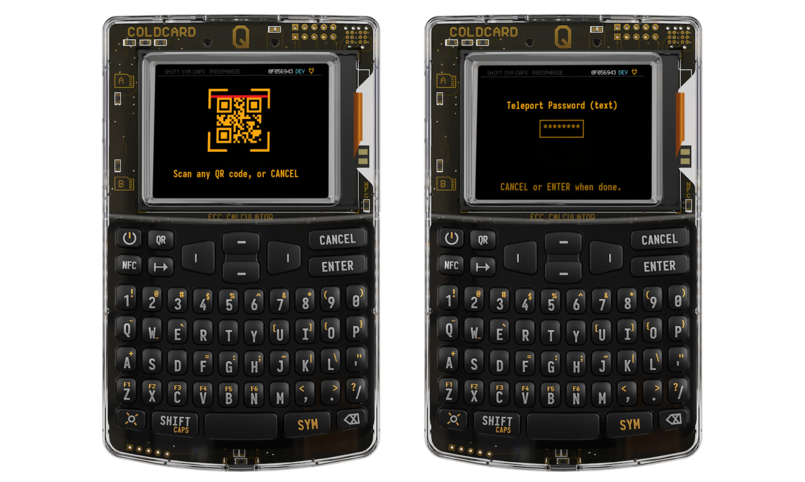

Dane są następnie odszyfrowywane i zrozumiałe dla urządzenia odbierającego. Otrzymana wiadomość to rzeczywiście "PlanB Network rocks". To wszystko.

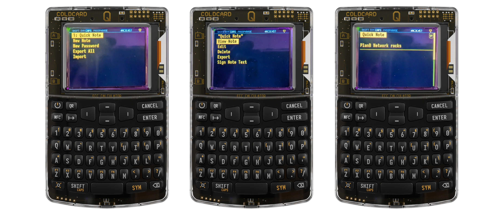

*Co właściwie wydarzyło się podczas tego ostatniego etapu :*?

- odszyfrowaliśmy dane przesłane przez nadawcę przy użyciu **"hasła teleportacyjnego "**
- mamy zatem klucz publiczny Kb i naszą tajną wiadomość zaszyfrowaną przez **"klucz sesji "**, "Ks". Ale jak możemy to zrobić, skoro jako odbiorca nie znamy Ks, który został utworzony przez nadawcę?
- Musimy zastosować nasz klucz prywatny "ka" z początkowego kroku **"Przygotuj urządzenie, które będzie odbierać dane"** do klucza publicznego Kb.
- W rzeczywistości, obliczając ka.Kb = ka.kb.G=kb.ka.G=kb.Ka=Ks, znajdujemy Ks. Który jest ostatecznie używany do odszyfrowania tajnej wiadomości.

### 2- Aby przenieść PSBT do Multisig (zaawansowane)

Zakłada to, że urządzenie Wallet Multisig zostało już utworzone i że urządzenie ColdCardQ zostało już wstępnie ustawione tak, aby mogło wykonywać transakcje z wieloma podpisami. Jeśli tak nie jest, wyjaśnienia są dostępne [tutaj](https://coldcard.com/docs/Multisig/) na stronie internetowej Coinkite.

Krótkie przypomnienie, czym jest Wallet (Multisig) z wieloma podpisami.

Zazwyczaj, aby wydać fundusze Wallet, potrzebny jest tylko jeden klucz prywatny do odblokowania UTXO powiązanych z adresami.

W przypadku Wallet Multisig do wydania środków może być potrzebnych do 15 kluczy prywatnych, a zatem 15 podpisów. Jest to znane jako portfel "M z N", gdzie N wynosi od 1 do 15, a M to liczba podpisów wymaganych do wydania środków. Na przykład Wallet Multisig 3 z 5 będzie wymagać co najmniej 3 podpisów z możliwych 5.

Następnie wyzwaniem jest koordynacja między sygnatariuszami w celu podpisania "PSBT" dla "Partially Signed Bitcoin Transaction". W tym kontekście "**Key Teleport**" może być używany do przesyłania PSBT między współsygnatariuszami w prosty i poufny sposób. Wystarczy zwykła rozmowa wideo między współsygnatariuszami.

Oto jak to zrobić na Multisig 3 z 4.

**Sygnatariusz 1:**

Sygnatariusz 1 importuje i podpisuje PSBT. Na koniec klika **"T "**, aby użyć **"Key Teleport "** do przesłania PSBT do sygnatariusza 2.

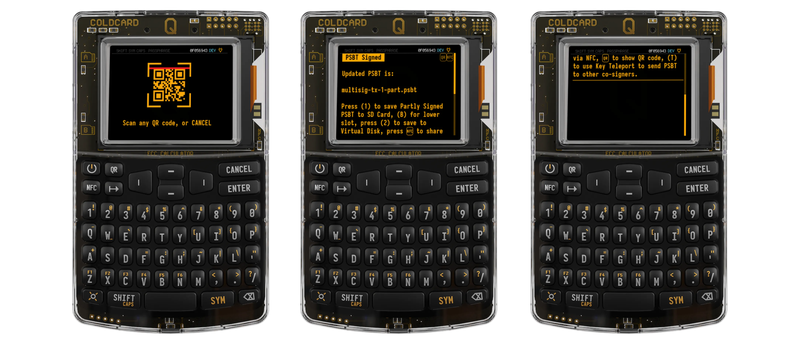

Po wybraniu sygnatariusza 2 poprzez kliknięcie **"ENTER "**, podawane jest "HASŁO TELEPORTU" (tutaj JJ YC AB 6A), które musi zostać przesłane do sygnatariusza 2 za pośrednictwem innego kanału komunikacji. Na przykład SMS lub połączenie głosowe, ale **nie** połączenie wideo.

Naciśnij ponownie **"ENTER "**, a pojawi się kod QR reprezentujący PSBT podpisany przez 1, a następnie zaszyfrowany przez "HASŁO TELEPORTU".

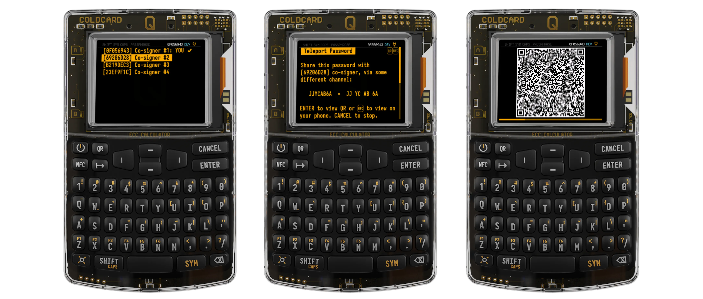

**Sygnatariusz 2:**

Sygnatariusz 2 skanuje kod QR przedstawiony mu przez sygnatariusza 1. Następnie wprowadza "HASŁO TELEPORTU" przesyłane przez dodatkowy kanał komunikacyjny w celu odszyfrowania przesyłanych danych.

Sygnatariusz 2 podpisuje transakcję, a następnie klika **"T "**, aby przesłać PSBT do sygnatariusza 3 za pośrednictwem "Key Teleport".

Najwyraźniej 2 podpisy zostały już złożone. Brakuje tylko podpisu sygnatariusza 3, aby transakcja była ważna. Wybierz sygnatariusza 3, klikając **"ENTER "**.

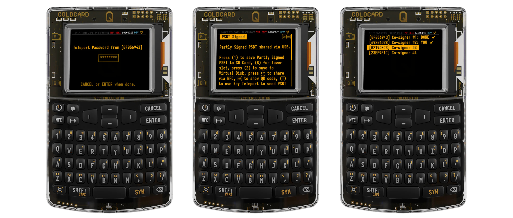

Tworzone jest nowe "HASŁO TELEPORTU", a następnie kod QR kodujący PSBT podpisany przez 1 i 2, a następnie zaszyfrowany przez to nowe "HASŁO TELEPORTU" (GW YQ K3 LL).

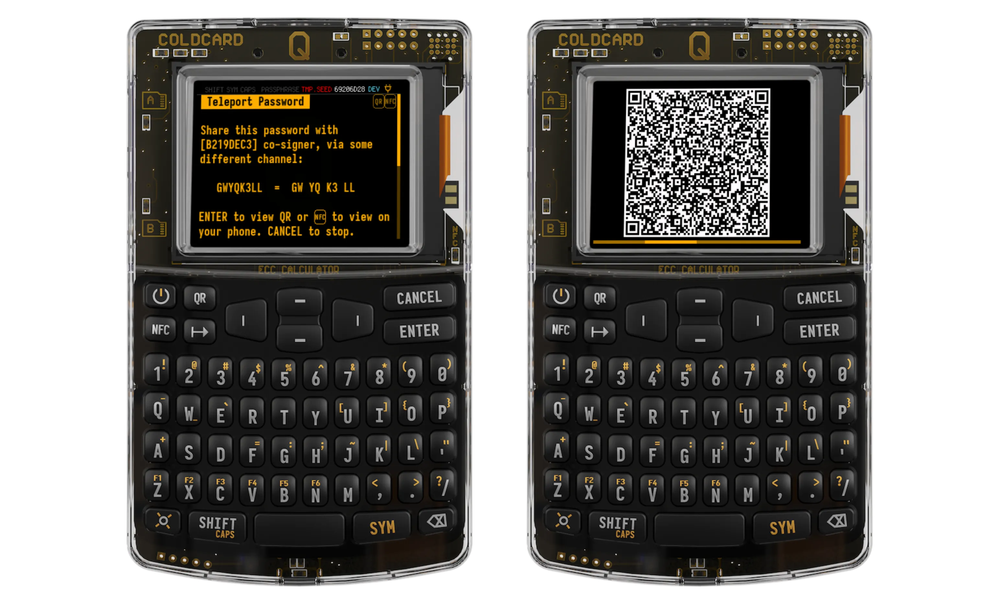

**Sygnatariusz 3:**

Powtórz ten sam krok, co powyżej.

Sygnatariusz 3 skanuje kod QR przedstawiony mu przez sygnatariusza 2. Następnie wprowadza "HASŁO TELEPORTU" przesłane przez dodatkowy kanał komunikacyjny.

Sygnatariusz 3 podpisuje transakcję i tym razem, ponieważ zastosowano 3 z 4 podpisów, transakcja jest oznaczona jako sfinalizowana i jest gotowa do dystrybucji za pośrednictwem różnych mediów (karta SD, NFC, QR itp.).

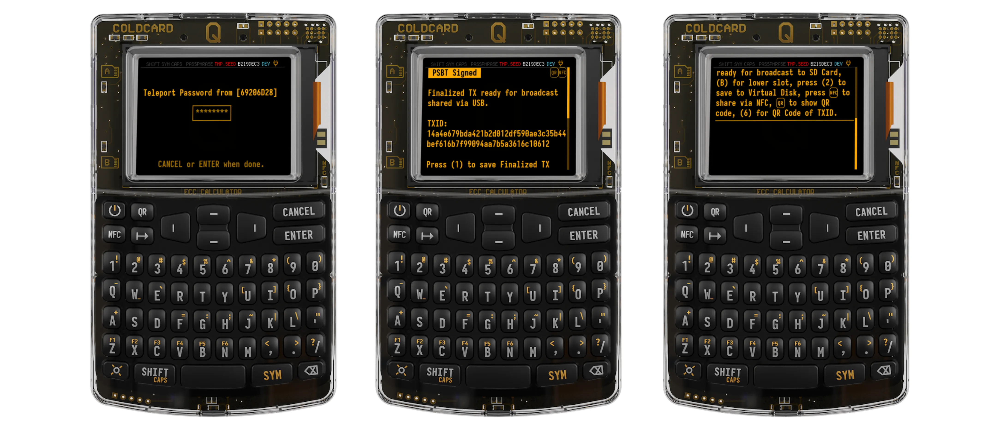

Jeśli funkcja "Push Tx" karty ColdCardQ jest aktywna, wystarczy przyłożyć kartę ColdCardQ do tylnej części dowolnego urządzenia podłączonego do Internetu (smartfona/tabletu) z obsługą NFC, aby rozgłosić transakcję za pośrednictwem sieci Bitcoin.

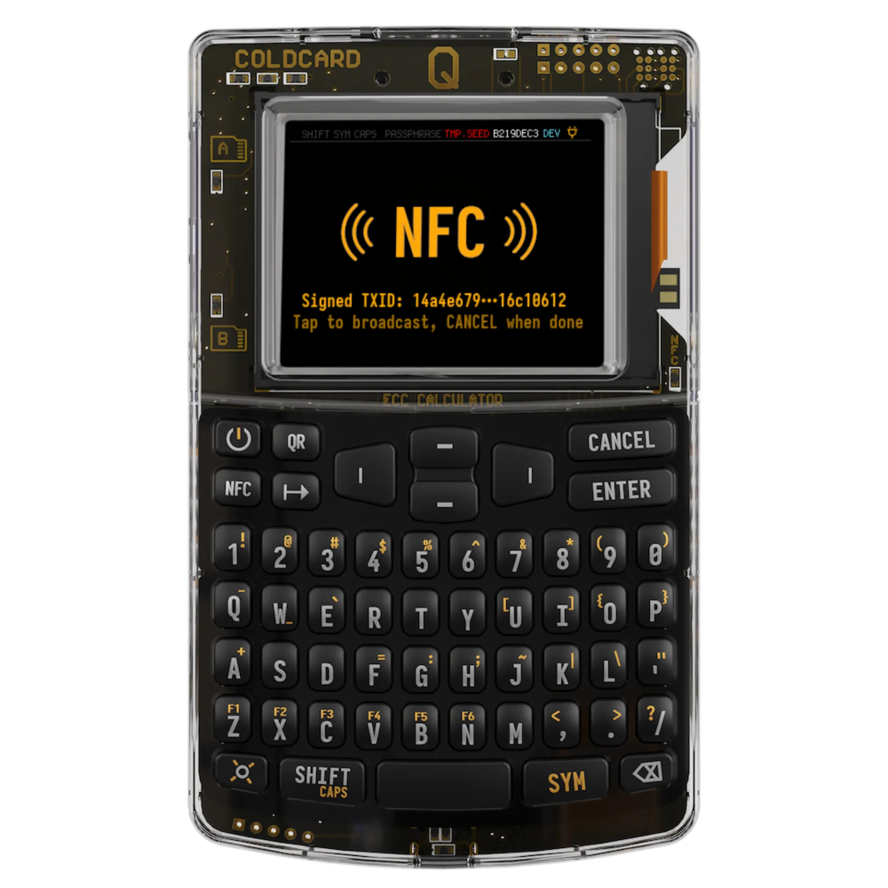

*W przypadku transferów PSBT od jednego sygnatariusza do drugiego, "Key Teleport" jest po prostu używany za pośrednictwem "Teleport Password" na każdym etapie, który szyfruje PSBT, gdy jest on przesyłany od jednego sygnatariusza do drugiego. Ponieważ przesyłane dane nie mogą być wykorzystane do kradzieży środków, nie ma potrzeby stosowania algorytmu Diffie-Hellmana, jak ma to miejsce w przypadku przesyłania wysoce poufnych tajemnic (seed, hasło itp.)*.

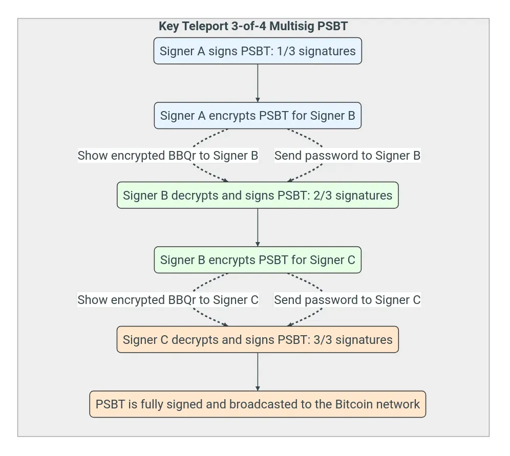

*Źródło: [Oficjalna strona ColdCard](https://coldcard.com/)*