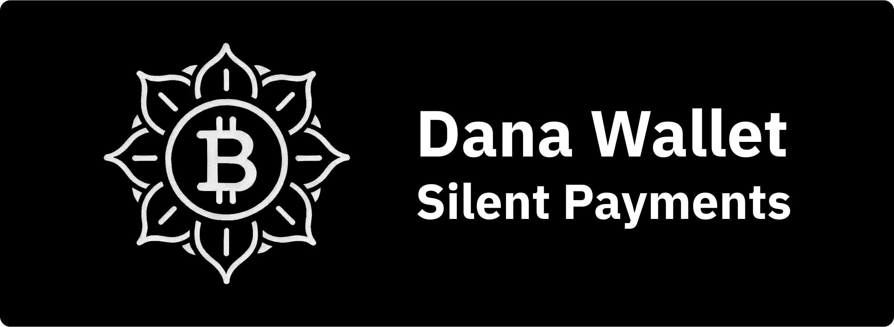
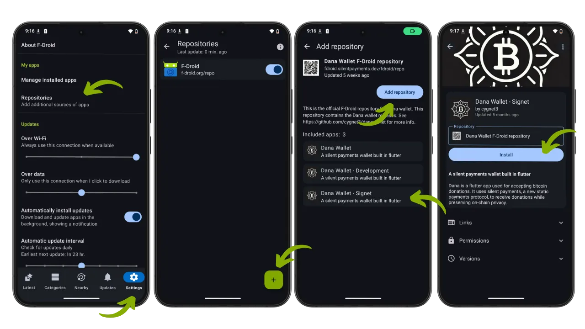
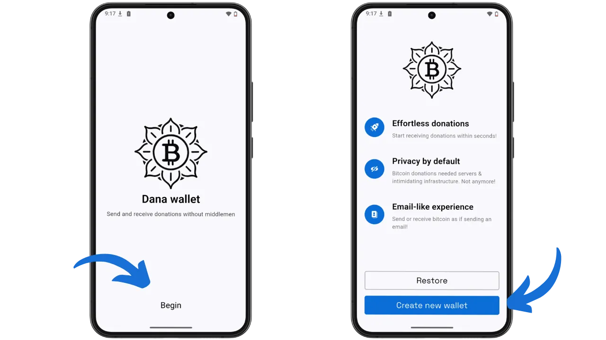
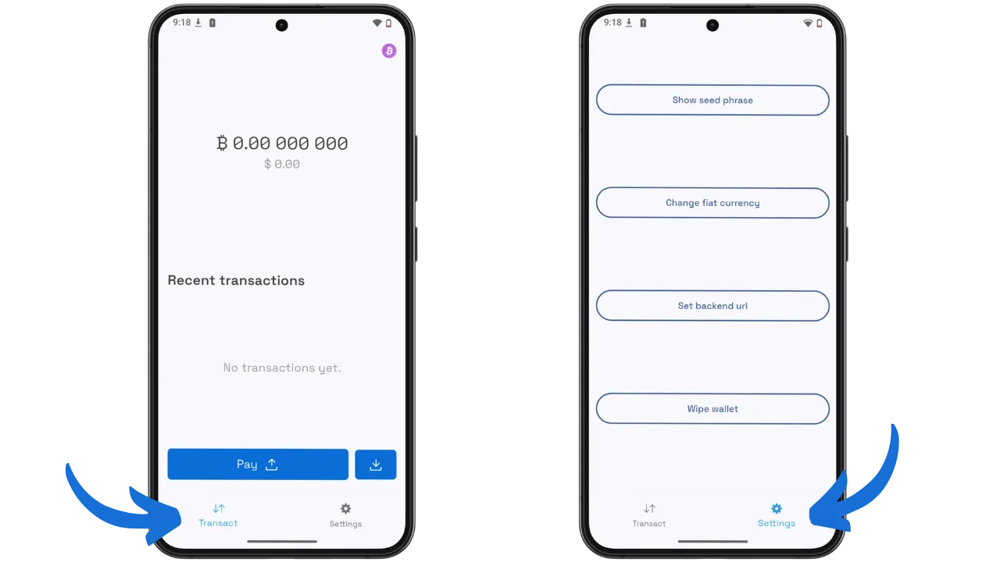
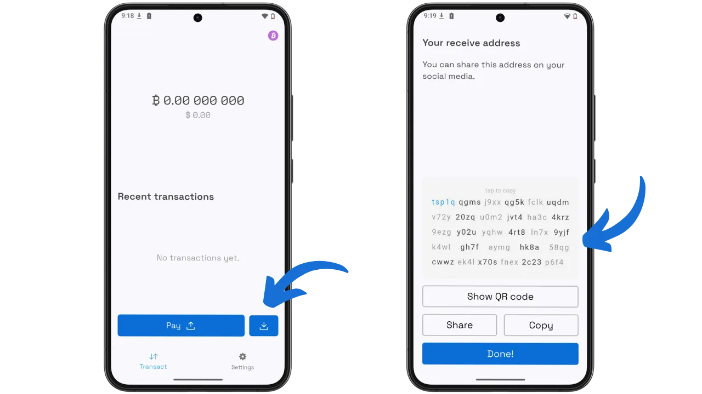
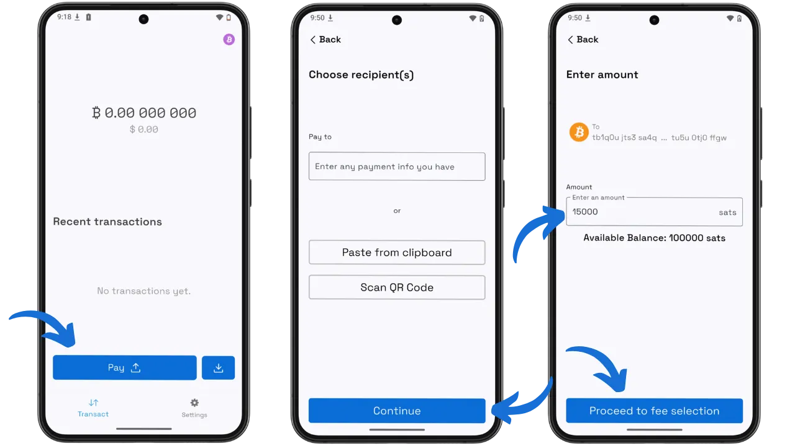
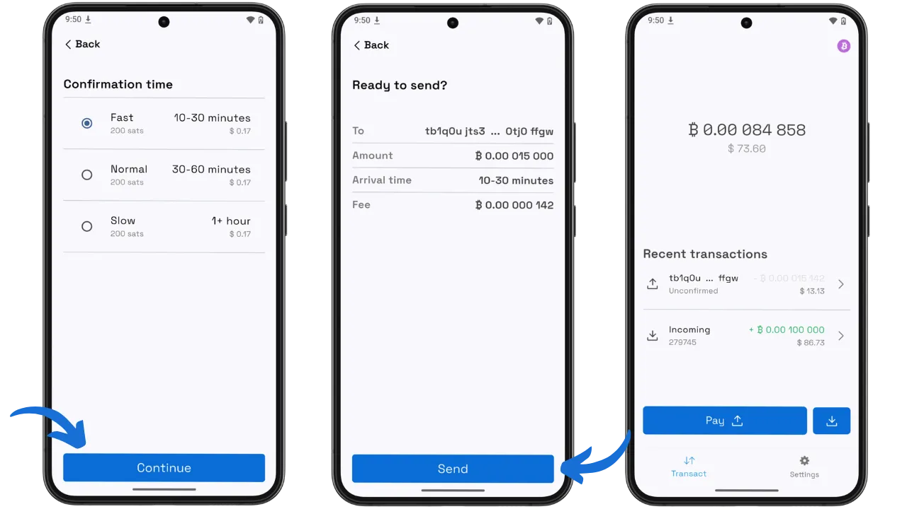

Повторното използване на адреси Bitcoin е една от най-преките заплахи за поверителността на потребителите. Когато един получател използва един адрес за получаване на множество плащания, всеки наблюдател може да проследи всички свързани с него транзакции и да възстанови финансовата му история. Този проблем засяга особено силно създателите на съдържание, благотворителните организации или активистите, които желаят да покажат публично адреса на дарението, без да нарушават своята поверителност или тази на дарителите си.

Dana Wallet отговаря на този проблем с елегантно решение: Тихи плащания. Тази минималистична wallet с отворен код, стартирана през 2024 г., генерира статичен адрес за многократна употреба, като същевременно гарантира, че всяко получено плащане се озовава на отделен адрес в блокчейна. Изпращачът не се нуждае от предварително взаимодействие с получателя и никой външен наблюдател не може да свърже отделните транзакции. В блокчейна тези плащания изглеждат като напълно обикновени транзакции Taproot.

Dana Wallet е достъпен в Mainnet и Signet, но разработчиците все още го смятат за експериментален и препоръчват да не депозирате средства, които не сте готови да загубите. В този урок ще използваме версията за Signet, за да открием Silent Payments, без да рискуваме реални средства.

## Какво е Dana Wallet?

### Философия и цели

Dana Wallet прилага подход "SP-first": wallet генерира единствено адреси за тихи плащания и приема само този вид плащания. С това приложение няма да можете да създадете класически адрес Bitcoin (наследен, стандартен SegWit или Taproot). Това умишлено ограничение ви позволява да се концентрирате изцяло върху изучаването на протокола BIP-352, без да се разсейвате с други функции. Непретрупаният интерфейс умишлено дава предимство на лекотата на използване пред изобилието от опции, което прави инструмента достъпен дори за потребители, които не познават концепциите за конфиденциалност на on-chain.

Проектът е изцяло с отворен код и е разработен с Flutter за мобилния интерфейс и Rust за вътрешната криптографска логика. Тази архитектура съчетава плавно потребителско изживяване с оптимална производителност за интензивни операции по сканиране.

### Как работят тихите плащания?

Тихите плащания (BIP-352) се основават на усъвършенстван криптографски механизъм, използващ ключ Exchange Elliptic Curve Diffie-Hellman (ECDH). Получателят генерира статичен адрес (започващ с `sp1...` при mainnet или `tsp1...` при Signet), състоящ се от два различни публични ключа: ключ за сканиране ($B_{scan}$) за откриване на входящи плащания и ключ за изразходване ($B_{spend}$) за изразходване на получените средства. Това разделение дава възможност ключът за харчене да се съхранява на хардуера на wallet, докато ключът за сканиране се използва на свързано устройство.

Когато изпращачът желае да извърши плащане, неговият wallet комбинира сумата от частните ключове на входовете си с публичния ключ за сканиране на получателя, за да изчисли споделената ECDH тайна. Тази тайна генерира криптографски "туид", който, добавен към ключа за разходи на получателя, създава уникален адрес на Taproot за тази транзакция.

Получателят може да възпроизведе това изчисление, като използва своя частен ключ за сканиране и публичните ключове, видими в транзакцията (математическо свойство на Дифи-Хелман). Това му позволява да открие и изразходва средствата без предварително взаимодействие с изпращача.

Този подход има няколко предимства:

- Конфиденциалност на получателя**: всяко плащане се извършва на различен адрес
- Поверителност на изпращача**: няма постоянен идентификатор, който да свързва плащанията
- Не е необходим сървър на трета страна**: протоколът работи самостоятелно
- Неразличими операции**: Тихите плащания изглеждат като обикновени транзакции Taproot

Основният недостатък е разходът за сканиране: получателят трябва да анализира всяка нова транзакция Taproot, за да открие предназначените за него транзакции.

Ако искате да научите повече за техническата работа на "Тихите плащания", препоръчваме ви курса BTC204 за поверителност в Bitcoin, който включва глава, посветена на "Тихите плащания":

https://planb.academy/courses/65c138b0-4161-4958-bbe3-c12916bc959c

## Поддържани платформи

Dana Wallet се предлага като приложение за Android. APK може да бъде изтеглен от специалното хранилище на F-Droid, предоставено от разработчиците, чрез Obtainium или директно от GitHub. За потребителите на Linux е технически възможно да компилират приложението Flutter за настолен компютър.

Приложението не е достъпно за iOS или в официалните магазини (Google Play, App Store), което отразява експерименталния му статус и насочеността му към техническата аудитория.

## Инсталация

### Основни предпоставки

За да инсталирате Dana Wallet в Android, трябва да имате устройство с Android с активирана опция "Неизвестни източници" в настройките за сигурност. Не се изисква акаунт или регистрация.

### Добавяне на депозит F-Cold

Препоръчителният метод е да добавите специалното хранилище Dana Wallet на F-Droid. Отидете на `fdroid.silentpayments.dev`, където ще намерите връзката към хранилището и QR код за сканиране. В момента хранилището предлага 3 приложения: версията Mainnet, Development (Разработване) и Signet (Сигнал).

### Инсталиране чрез F-Droid

Отворете приложението F-Droid на вашето устройство с Android, след което отворете Настройки чрез иконата в долния десен ъгъл. Изберете "Repositories" (Хранилища), за да управлявате източниците на приложения. Натиснете бутона "+", за да добавите ново хранилище, след което сканирайте QR кода или поставете връзката `https://fdroid.silentpayments.dev/fdroid/repo`. След като бъде добавено хранилището, ще видите трите налични версии на Dana Wallet. Изберете "Dana Wallet - Bookmark" и натиснете "Install" (Инсталиране).

## Първоначална конфигурация

### Създаване на портфолио

При първото изстрелване Dana Wallet показва приветстващ екран, представящ мисията му: "Изпращане и получаване на дарения без посредници". Натиснете "Begin", за да продължите. На следващия екран се представят трите основни предимства на приложението:

- Безпроблемни дарения**: започнете да получавате дарения за секунди
- Поверителност по подразбиране**: няма нужда от сървъри или сложна инфраструктура
- Подобно на имейл изживяване**: изпращайте и получавайте биткойни толкова просто, колкото и с имейл

Можете да избирате между "Възстановяване", за да възстановите съществуващ портфейл, и "Създаване на нов wallet", за да създадете нов портфейл. Натиснете "Create new wallet" (Създаване на нов wallet).

След това приложението генерира фраза за възстановяване, която трябва внимателно да запишете на физически носител. Дори за тестови средства без реална стойност, прилагайте добри практики за архивиране.

### Interface и параметри

След като създадете портфолиото, ще бъдете прехвърлени към основния интерфейс, разделен на два раздела: "Транзакции" и "Настройки".

В раздела **Транзакции** се показват балансът ви в биткойни (и преобразуването му в долари), списък с последните транзакции и два бутона за действие: "Плати" за изпращане на средства и бутон за получаване (икона за изтегляне).

Табът **Настройки** предлага четири опции:

- Покажи фразата seed**: показва вашата фраза за възстановяване за съхранение
- Промяна на фиатната валута**: промяна на валутата на дисплея (USD по подразбиране)
- Задаване на backend url**: конфигурирайте URL адреса на Blindbit сървъра (вижте следващия раздел)
- Избършете wallet**: напълно изтрива wallet от устройството

### Сървърът Blindbit

Dana Wallet използва сървър за индексиране, наречен **Blindbit**, за да открие вашите тихи плащания. Разбирането на начина, по който той работи, е важно за оценката на модела на доверие на приложението.

**Защо ни е необходим сървър?

За да открие "тихо" плащане, вашият wallet теоретично трябва да сканира всички транзакции Taproot във всеки блок и да извърши криптографско изчисление (ECDH) за всяка от тях. На мобилен телефон тази операция би била твърде интензивна от гледна точка на изчисленията и пропускателната способност.

Сървърът Blindbit решава този проблем чрез предварително изчисляване на междинни данни (наречени "tweaks") за всички транзакции Taproot. След това вашият wallet изтегля тези данни (33 байта на транзакция) и извършва окончателното изчисление **на място**, за да провери дали дадено плащане ви принадлежи.

**Запазена поверителност**

За разлика от конвенционалния сървър Electrum, при който разкривате адресите си, сървърът Blindbit не знае кои плащания ви принадлежат. Той предоставя едни и същи данни на всички потребители, а телефонът ви е този, който извършва окончателната проверка. Следователно вашата поверителност се запазва спрямо сървъра.

**Сървър по подразбиране

Dana Wallet използва публичния сървър `silentpayments.dev/blindbit/signet` (за Signet) или `silentpayments.dev/blindbit/mainnet` (за Mainnet). Можете да промените този URL адрес в настройките, ако хоствате свой собствен сървър.

**Хостинг на собствен Blindbit сървър**

За потребителите, които желаят пълна независимост, е възможно да хостват свой собствен Blindbit Oracle сървър. Това изисква :

- Пълен възел на ядрото Bitcoin **без орбити** (не-pruned)
- Инсталиране на Blindbit Oracle (налично в GitHub: `setavenger/blindbit-oracle`)
- Приблизително 10 GB допълнително дисково пространство
- Технически умения (компилиране на Go, конфигуриране на сървър)

Все още не е налично пакетирано приложение за Umbrel или Start9. Засега инсталацията остава ръчна. Тази област е в процес на активно развитие и в бъдеще може да се появят по-достъпни решения.

## Ежедневна употреба

### Получаване на средства

За да получите биткойни, натиснете бутона за получаване (икона за изтегляне) на главния екран. След това Dana Wallet ще покаже пълния ви адрес за тихо плащане във формат `tsp1q...` на Bookmark. Интерфейсът предлага няколко възможности:

- Показване на QR код**: показва QR кода на адреса ви за лесно сканиране
- Споделяне**: споделяне на адреса чрез приложенията на телефона
- Copy**: копира адреса в клипборда

Както е показано на екрана, можете да споделите този адрес публично в социалните мрежи, без да нарушавате поверителността си.

За да получите първите си тестови средства в Signet, използвайте специалния кран Silent Payments, достъпен на адрес `silentpayments.dev/faucet/signet`. Копирайте адреса си `tsp1...`, поставете го в полето, предоставено на кранчето, след което потвърдете заявката. Изчакайте да бъде добит блок (около 10 минути в Signet).

### Изпращане на плащане

За да изпратите средства, натиснете бутона "Плащане" от главния екран. Появява се екранът "Choose recipient(s)" (Избор на получател(и)) с три опции за посочване на получателя:

- Въвеждане на информация за плащане ръчно
- Вмъкване от клипборда**: вмъкване на адрес от клипборда
- Сканиране на QR код**: сканиране на QR код, съдържащ адреса

След като адресът на получателя бъде потвърден, екранът "Въведете сумата" ви позволява да въведете сумата за изпращане в сатоши. Наличният ви баланс се показва за справка. Натиснете "Продължете към избор на такса", за да продължите.

На следващия екран се показват три нива на таксите в зависимост от необходимата спешност:

- Бързо** (10-30 минути): по-високи такси за бързо потвърждение
- Нормален** (30-60 минути): умерени разходи
- Бавно** (1+ час): минимална такса за неспешни трансакции

След като изберете нивото на таксата, на екрана за потвърждение "Готови ли сте да изпратите?" се обобщават всички подробности: адрес на дестинацията, сума, очаквано време и такса за транзакцията. Проверете внимателно тази информация, след което натиснете "Изпрати", за да изпратите транзакцията.

След като бъде изпратена, транзакцията се появява в историята ви със статус "Непотвърдена", докато не бъде включена в блок. Балансът ви се актуализира съответно.

## Предимства и ограничения

### Акценти

- Педагогически**: опростен интерфейс, насочен към обучението Тихи плащания
- Двупосочен**: поддържа както изпращане, така и получаване, за разлика от други портфейли
- Отворен код**: напълно одитируем код в GitHub
- Специализиран Faucet**: улеснява получаването на финансиране за тестове
- Без акаунт**: не се изисква регистрация или лични данни

### Ограничения, които трябва да се вземат предвид

- Експериментален**: неодитиран софтуер, използвайте с повишено внимание Mainnet
- Ограничена платформа**: предимно Android, няма версия за iOS
- Намалена функционалност**: няма контрол на монетите, няма подсметки, няма Lightning
- Интензивно сканиране**: откриването на плащания изисква значителни ресурси

## Най-добри практики

### Безопасност на seed

Дори за тестовете на Сигнет с безполезен произход, се отнасяйте сериозно към фразата за възстановяване. Използвайте опцията "Покажи seed фраза" в настройките, за да я запишете внимателно. Като добра практика поддържайте напълно отделни портфейли за Signet и Mainnet: никога не използвайте seed, създаден за тестване, в wallet, предназначен за получаване на реални средства.

### Предупреждение за експериментален статус

Разработчиците на Dana Wallet все още го смятат за експериментален. Както те ясно заявяват: "Не използвайте средства, които не сте готови да загубите". За целите на обучението изберете версията Signet. Ако използвате версията Mainnet, ограничете се до суми по token.

### Архивиране и възстановяване

Възстановяването на средства от тихи плащания изисква wallet, съвместим с протокола BIP-352. Стандартният wallet не може да сканира блокчейна, за да възстанови вашите UTXO тихи плащания. Поддържайте инсталиран Dana Wallet или използвайте опцията "Възстановяване" при първото стартиране, за да възстановите съществуващ wallet.

## Сравнение с BIP-47 и PayJoin

| Critère | Silent Payments (BIP-352) | BIP-47 PayNyms | PayJoin (BIP-78) |
|---------|---------------------------|----------------|------------------|
| Adresse statique | Oui (`sp1...`) | Oui (code de paiement) | Non |
| Interaction requise | Aucune | Transaction de notification initiale | À chaque paiement |
| Empreinte on-chain | Aucune (transactions normales) | OP_RETURN visible | Transaction modifiée |
| Scan côté receveur | Intensif (chaque bloc) | Léger (après notification) | Aucun |
| Confidentialité expéditeur | Excellente | Limitée (lien après notification) | Bonne (brouillage) |

Тихите плащания премахват транзакцията за уведомяване BIP-47 за сметка на по-скъпо сканиране. PayJoin решава различен проблем (корелация на входните данни) и може да се комбинира с "Тихи плащания".

## Заключение

Dana Wallet е ценен образователен инструмент за изучаване на тихите плащания в безрискова среда. Минималистичният му подход ви позволява да разберете основните механизми на протокола BIP-352, без да се разсейвате с второстепенни функции. Експериментирайки със Signet, ще развиете практическо разбиране за тази обещаваща технология за конфиденциалност на транзакциите Bitcoin.

Тихите плащания представляват значителна стъпка напред в съчетаването на лекотата на използване и зачитането на неприкосновеността на личния живот. Ентусиазмът на общността и първите интеграции в различни портфейли (Cake Wallet, BitBox02, BlueWallet за изпращане) сочат към бъдеще, в което публикуването на адрес за дарение вече няма да застрашава финансовата неприкосновеност на неговия собственик.

## Ресурси

### Официална документация

- Dana Wallet Хранилище в GitHub: https://github.com/cygnet3/danawallet
- F-Cold депозит: https://fdroid.silentpayments.dev
- Сайт на общността за безшумни плащания: https://silentpayments.xyz
- Спецификация BIP-352: https://bips.dev/352

### Инструменти за изпитване на Signet

- Faucet Безшумни плащания: https://silentpayments.dev/faucet/signet
- Signet Mempool Explorer: https://mempool.space/signet

### Сървър Blindbit (самостоятелно хостван)

- Blindbit Oracle (GitHub): https://github.com/setavenger/blindbit-oracle