Bu adım adım öğretici, Wallet Electrum kullanarak Blockchain Bitcoin üzerine nasıl mesaj yazılacağını gösterir. Bu işlem, Blockchain'te herkese açık olarak görülebilen bir işleme metin eklemek için OP_RETURN talimatını kullanır. Başarılı bir kayıt için bu basit adımları izleyin.


---
## Ön Koşullar


- Bir bilgisayar (Windows, macOS veya Linux).
- İnternet bağlantısı.
- İşlem tutarını ve ücretlerini karşılamak için Wallet'nizde birkaç satoshi (Sats) veya bitcoin (BTC).
- Bir metinden hex'e dönüştürücü (örneğin çevrimiçi bir site) veya [bu OP_RETURN komut dosyası oluşturucu] (https://resources.davidcoen.it/opreturnelectrum/) gibi özel bir araç.


---

## Adım 1: Electrum'u indirin ve yükleyin


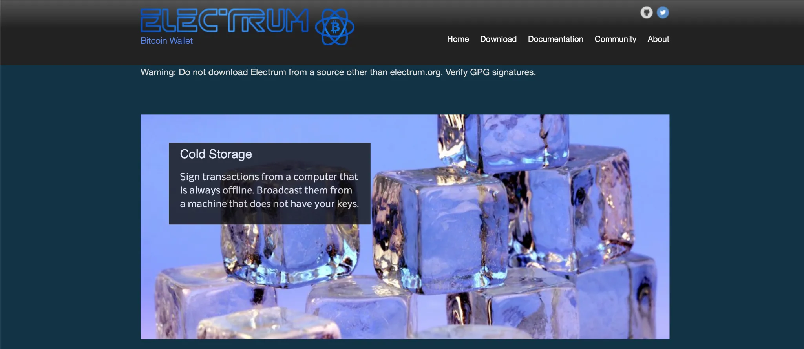


1. Resmi Electrum web sitesini ziyaret edin: [electrum.org](https://electrum.org/).


2. İşletim sisteminize (Windows, macOS, Linux) karşılık gelen sürümü indirin.


3. Electrum'u yükleyicinin talimatlarına göre yükleyin.


4. Dosyanın imzasını veya Hash'u karşılaştırarak indirilen dosyanın bütünlüğünü kontrol edin (isteğe bağlıdır, ancak güvenlik nedeniyle önerilir).


→ Electrum eğitiminde daha fazla ayrıntı :


https://planb.network/tutorials/wallet/desktop/electrum-efec9166-46b5-4937-8cee-6bc310975177


---

## Adım 2: Bir Wallet oluşturun veya içe aktarın


1. Electrum'u başlatın.


2. Zaten bir seed cümleniz (kurtarma cümlesi) varsa Yeni bir Wallet oluştur veya Mevcut bir Wallet'yi geri yükle öğesini seçin.


3. Wallet'ünüzü yapılandırmak için talimatları izleyin:


 - Yeni bir Wallet için, seed cümlenizi not edin ve güvenli bir yerde (kağıt, kasa vb.) saklayın.
 - Mevcut bir Wallet'yi geri yüklemek için seed ifadenizi girin.


4. Wallet'unuzu güvence altına almak için bir parola belirleyin.


→ Electrum eğitiminde daha fazla ayrıntı :


https://planb.network/tutorials/wallet/desktop/electrum-efec9166-46b5-4937-8cee-6bc310975177


---

## Adım 3: Mevcut fonları kontrol edin


Wallet'nizin yeterli bitcoin (BTC) veya satoshis (Sats) içerdiğinden emin olun:


- İşlem tutarı (örneğin, 0.00001 BTC veya 1000 Sats).
- Ağın büyüklüğüne göre değişen işlem ücretleri (genellikle birkaç bin Sats).


Paranızı kontrol etmek için Electrum'daki Bakiyeye bakın.


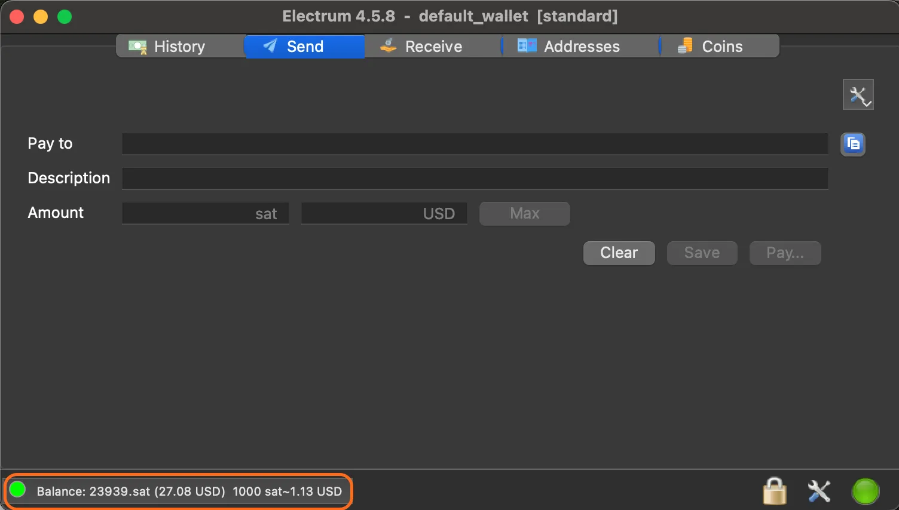


Gerekirse, Wallet'ünüzü beslemek için BTC veya Sats aktarın. Bunu yapmak için 'Al' sekmesine gidin ve 'Talep Oluştur'a tıklayın:


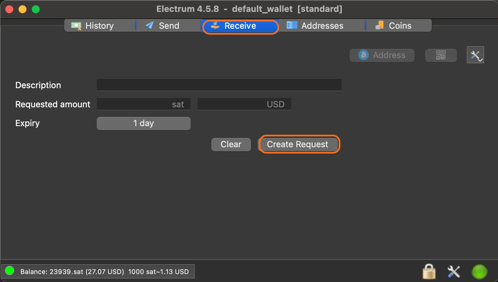


Bu, Address resepsiyonunu gösterecektir:


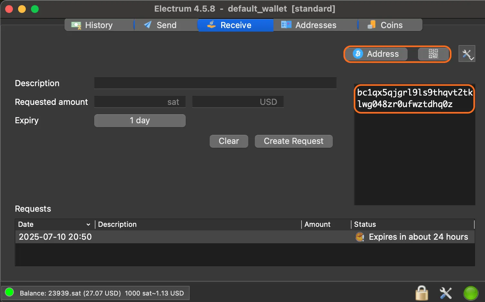


→ Electrum eğitiminde daha fazla ayrıntı :


https://planb.network/tutorials/wallet/desktop/electrum-efec9166-46b5-4937-8cee-6bc310975177


---

## Adım 4: Yazılacak mesajı hazırlayın


Girmek istediğiniz mesajı seçin (örneğin `Teşekkürler Satoshi`). Not: OP_RETURN mesajları 80 bayt, yani yaklaşık 80 ASCII karakteri ile sınırlıdır.


*Bir an için düşünün: Blockchain Bitcoin üzerine yazdıklarınız ebedidir ve herkes tarafından erişilebilir, bu yüzden :*


- insanlığımızın güzel bir ifadesini bırakır,*
- pişman olabileceğiniz içerikler girmekten kaçının*


*Blockchain alanı ve bitcoinleriniz değerlidir, onları akıllıca ve niyetle kullanın*


Mesajınızı onaltılık sayıya dönüştürün :


- Bir [çevrimiçi araç] (https://www.rapidtables.com/convert/number/ascii-to-hex.html) kullanabilirsiniz, ancak hassas verileri burada işlememeye dikkat edin (ilke olarak, Blockchain Bitcoin'te bir OP_RETURN aracılığıyla yayınlanması amaçlanan bilgiler herhangi bir gizlilik sorunu oluşturmaz);
- Daha fazla gizlilik için, dönüşümü küçük bir Python kullanarak yerel olarak gerçekleştirin:


```py
#!/usr/bin/env python3

def main():
ascii_text = input("Enter ASCII text: ")
try:
hex_output = ascii_text.encode('ascii').hex()
print(hex_output)
except UnicodeEncodeError:
print("Error: Input contains non-ASCII characters.", file=sys.stderr)

if __name__ == "__main__":
import sys
main()
```


Örnek: ASCII olarak `Thanks Satoshi` onaltılık olarak `5468616e6b73205361746f736869` verir.


İşlem komut dosyasını hazırlayın. İşte beklenen biçimin bir örneği:


```script
bc1q879cv4p5q6s9537orange3zss33d3turzad8, 0.00001
script(OP_RETURN 5468616e6b73205361746f736869), 0
```


'den oluşur:


- Hedef Address**: Geçerli bir Bitcoin Address. Ici, `bc1q879cv4p5q6s9537orange3zss33d3turzad8`. Aktarılan fonları kendinize iade etmek istiyorsanız, bu kendi Address'nız olabilir;
- Aktarılan tutar**: işlemin tutarı, burada `0.00001` BTC. **Lütfen dikkat**: Electrum'da kullanılan birim BTC olduğundan, işlem komut dosyasında belirtilen miktar da Sats cinsinden değil BTC cinsinden ifade edilmelidir;
- Kod OP_RETURN**: Önünde script(`OP_RETURN <messsage>), 0` bulunan onaltılık sayıya dönüştürülmüş mesaj. Burada, onaltılık sayıdaki mesaj için `5468616e6b73205361746f736869`.


⚠️ **Dikkat**: OP_RETURN'tan sonra `0` belirtmek çok önemlidir, çünkü bu işlem kodu komut dosyasını geçersiz olarak işaretler ve çıktıyı kalıcı olarak harcanamaz hale getirir. Ağ düğümleri bu çıktıyı UTXO setlerinden silecektir. Eğer `0` dışında bir değer girerseniz, bu geri dönüşü olmayan bir şekilde kaybolacaktır: bitcoinleriniz yanmış sayılacaktır. Bu nedenle, istenen verileri kaydetmek için her zaman bir OP_RETURN ile `0` girmelisiniz, ancak kaybolacak olan fonları bununla ilişkilendirmeden.


İpucu: Komut dosyasını otomatik olarak generate yapmak için [OP_RETURN Generator] aracını (https://resources.davidcoen.it/opreturnelectrum/) kullanın. Bu araç miktarı BTC olarak girmenizi önerse bile, birimi Electrum olarak yapılandırılmış halde tutun.


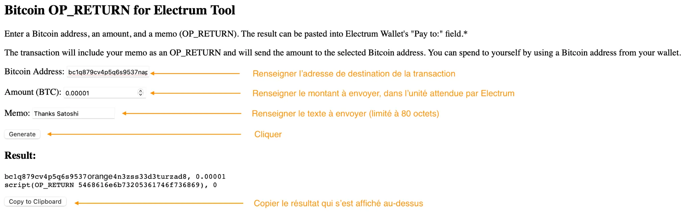


Electrum tarafından kullanılan birimi değiştirmek için, menü çubuğunda "Tercihler "i bulun, ardından "Birimler" sekmesinde BTC / mBTC / bit veya Sats'ü seçin:


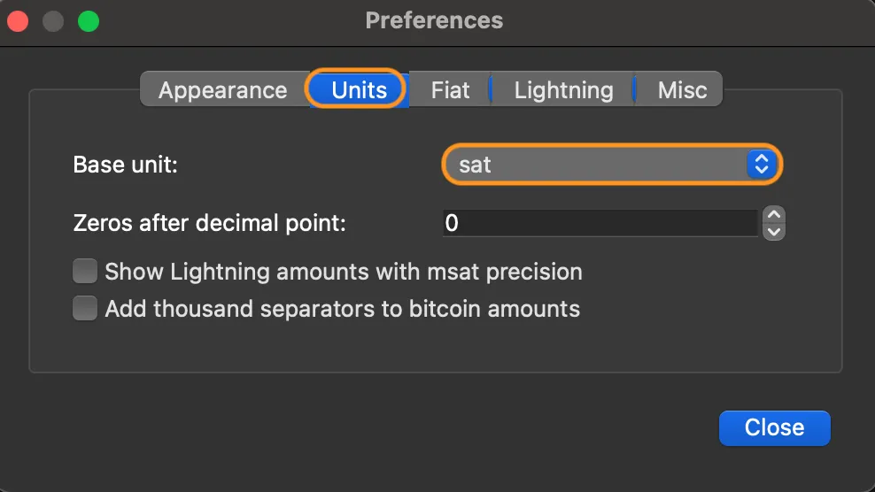


---

## Adım 5: İşlemi gönderin


Electrum'da Gönder sekmesine gidin.


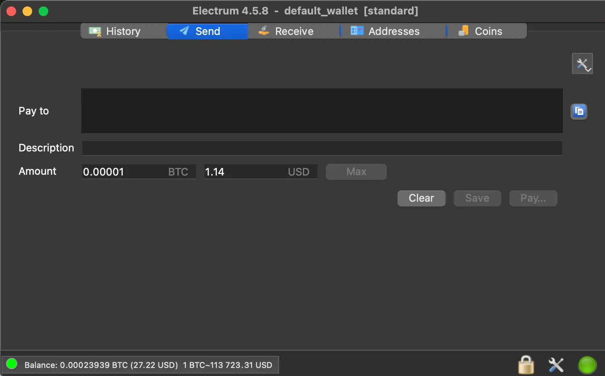


"Pay to" alanına, hazırlanan komut dosyasını (örneğin, yukarıdaki) yapıştırın.


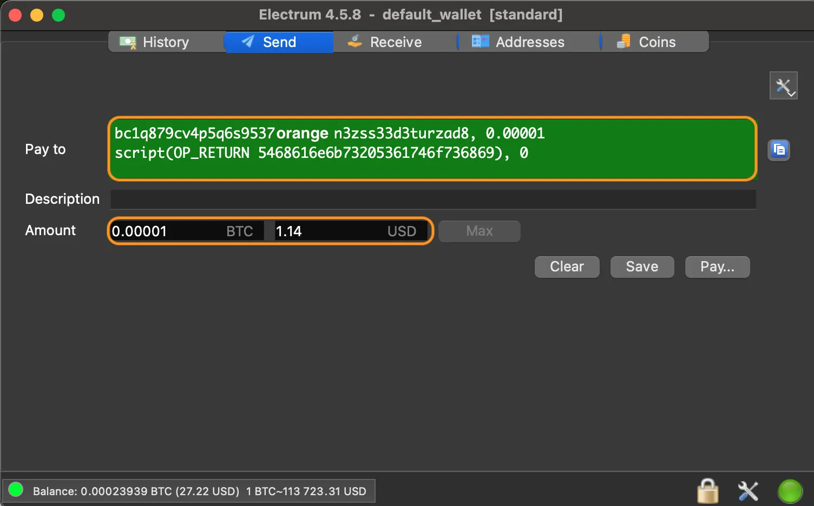


"Pay to" alanı Green'te görüntülenmeli ve işlem tutarı aşağıdaki satırda görünmelidir.


Tutar alanında tutarı ve birimini kontrol edin.


"Öde... "ye tıklayın ve işlem ücretlerinizi ödemek istediğiniz tutara ve işleminizin bir Miner tarafından işlenmesini ve bir bloğa entegre edilmesini istediğiniz hıza göre ayarlayın.


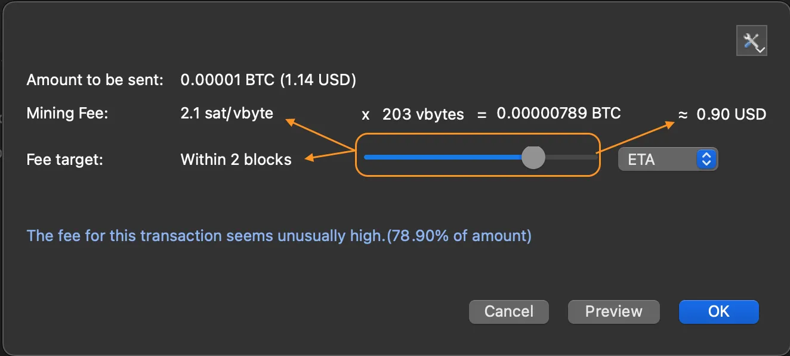


Tamam'a tıklayın ve işlemi şifrenizle onaylayın. Bir onay penceresi görünecektir.


---

## Adım 6: Kaydı doğrulayın


İşlem onaylandıktan sonra (bu birkaç dakika sürebilir), "Geçmiş" sekmesine gidin.


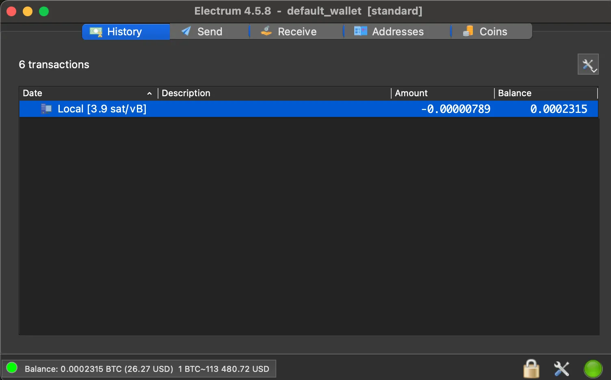


İşlemin üzerine sağ tıklayın ve ayrıntıları görmek için "Explorer'da Görüntüle "yi seçin.


Alternatif olarak, hedef Address'i kopyalayın (örneğin, `bc1q879cv4p5q6s9537orange3zss33d3turzad8`) ve [Mempool.space](https://Mempool.space/) veya [blockstream.info](https://blockstream.info/) gibi bir Blockchain gezgininde görüntüleyin.


Mesajınızı görmek için işlem ayrıntılarında OP_RETURN alanını arayın.


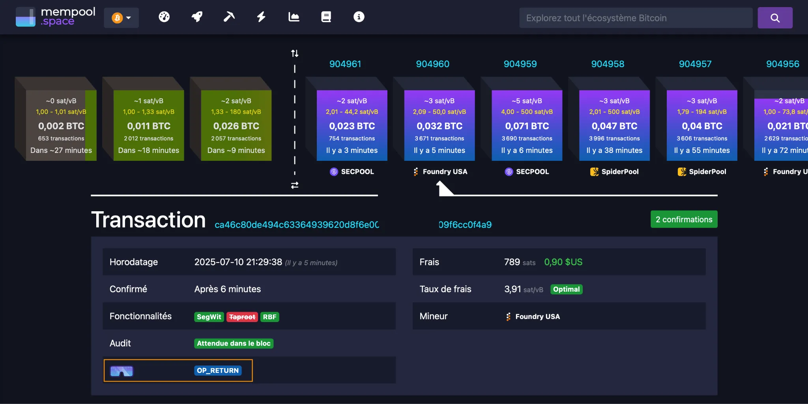


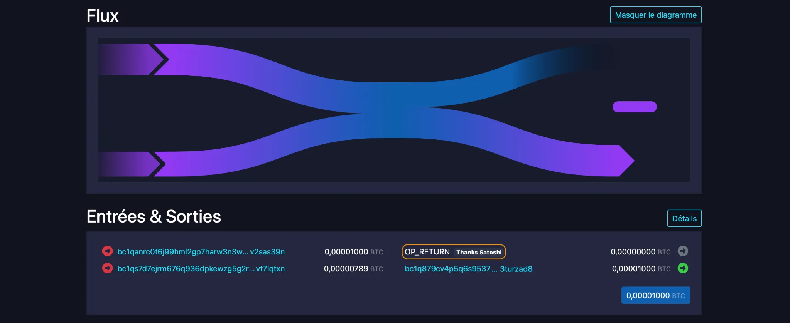


---

## İpuçları ve en iyi uygulamalar


- Küçük bir miktarla test edin: Maliyetli hatalardan kaçınmak için küçük bir işlemle başlayın (örn. Sats 1000).
- OP_RETURN içeren çıktının sıfıra eşit olduğundan emin olun, aksi takdirde bitcoinleriniz kalıcı olarak kaybolacaktır.
- Birimi kontrol edin: Girilen miktarın Electrum'da görüntülenen birime (BTC, mBTC veya Sats) karşılık geldiğinden emin olun.
- İşlem ücreti: Ağ sıkışıksa, daha hızlı onay için ücreti artırın.
- Kısa mesaj: OP_RETURN girişleri 80 bayt ile sınırlıdır. Mesajınızı buna göre planlayın.


---

## Yararlı kaynaklar


- Electrum'u indirin: [electrum.org](https://electrum.org/)
- OP_RETURN komut dosyası oluşturucu: [resources.davidcoen.it/opreturnelectrum/](https://resources.davidcoen.it/opreturnelectrum/)
- Blockchain Kaşifleri: [Mempool.space](https://Mempool.space/), [blockstream.info](https://blockstream.info/)