## Bitcoin Hardware Wallet - शुरुआती निर्माण

**श्रोतागण:** जिज्ञासु बिल्डर्स जिनके पास एम्बेडेड अनुभव बहुत कम या बिल्कुल नहीं है।

**अवधि:** 2 घंटे (लचीला)

**परिणाम:** अंत तक, छात्र:

- वाणिज्यिक उपकरणों की तुलना में DIY हार्डवेयर वॉलेट के सुरक्षा मॉडल को पहचानें।
- माइक्रोकंट्रोलर-आधारित हस्ताक्षर डिवाइस को असेंबल करें।
- ओपन-सोर्स फर्मवेयर फ्लैश करें और बिल्ड चेकसम सत्यापित करें।
- अपने नए डिवाइस का उपयोग करके mainnet लेनदेन पर हस्ताक्षर करें और उसे प्रसारित करें।

---

## अमूर्त

यह दो घंटे की कार्यशाला शुरुआती छात्रों को $15 के लिलीगो टी-डिस्प्ले बोर्ड पर ओपन-सोर्स जेड फ़र्मवेयर फ्लैश करके एक कार्यात्मक Bitcoin हार्डवेयर wallet बनाना सिखाती है। छात्र सामान्य विकास हार्डवेयर को $150 की लागत वाले व्यावसायिक वॉलेट के बराबर एक हस्ताक्षर उपकरण में बदल देते हैं, और केवल सिद्धांत के बजाय व्यावहारिक अनुभव के माध्यम से सुरक्षा की बुनियादी बातें सीखते हैं।

### दर्शन

अपना खुद का साइनिंग डिवाइस बनाना सिर्फ़ पैसे बचाने के बारे में नहीं है—यह आपके Bitcoin की सुरक्षा करने वाली तकनीक को समझने के बारे में है। यह कार्यशाला ब्लैक-बॉक्स ट्रस्ट की बजाय "समझ के ज़रिए सुरक्षा" पर ज़ोर देती है। पुर्ज़ों की सोर्सिंग, ओपन-सोर्स फ़र्मवेयर फ्लैश करने और खुद एन्ट्रॉपी जनरेट करने से, छात्र आपूर्ति श्रृंखला के जोखिम को कम करते हैं और साथ ही सुरक्षा दावों का गंभीरता से मूल्यांकन करना सीखते हैं। इसका लक्ष्य सूचित स्वायत्तता है: छात्रों को मज़बूत व्यावसायिक विकल्पों की तुलना में अपने DIY डिवाइस की शक्ति और सीमाओं, दोनों को समझना चाहिए।

---

## कॉन्सेप्ट प्राइमर (15 मिनट)

### स्व-संरक्षण क्या है और इसका महत्व क्यों है?

Bitcoin का निर्माण हमारी मुद्रा प्रणाली से बैंकों और निगमों जैसे विश्वसनीय तृतीय पक्षों की आवश्यकता को समाप्त करने के लिए किया गया था। विश्वास के बजाय, बिटकॉइन गणित, भौतिकी और क्रिप्टोग्राफी का उपयोग करके किसी को भी बिना किसी की अनुमति के अपने धन का स्वामित्व और नियंत्रण करने की शक्ति प्रदान करता है।

यह इस प्रकार काम करता है कि बिटकॉइन एक वैश्विक डिजिटल खाता बही पर मौजूद होता है जिसे ब्लॉकचेन उर्फ ​​बिटकॉइन टाइमचेन कहा जाता है, जो कि बैंक खाते जैसे केंद्रीकृत खाता बही के बजाय कंप्यूटर द्वारा संचालित एक सार्वजनिक और पारदर्शी खाता बही है।

समझने वाली ज़रूरी बात यह है कि बिटकॉइन को एक जगह से दूसरी जगह ले जाने के लिए, आपको उस लेन-देन पर एक निजी कुंजी (प्राइवेट की) से हस्ताक्षर करने होंगे। इसे ऐसे समझें जैसे पासवर्ड से तिजोरी खोलना और बिटकॉइन को किसी और की तिजोरी में ले जाना। Bitcoin आपको उस तिजोरी की चाबियाँ खुद रखने की शक्ति देता है, बजाय इसके कि आपको अपना पैसा किसी बैंक पर स्थानांतरित करने के लिए निर्भर रहना पड़े।

बड़ी ताकत के साथ बड़ी ज़िम्मेदारियाँ भी आती हैं, अपनी चाबियाँ खो दो और आपका पैसा हमेशा के लिए चला जाएगा। इस तरह, आप तिजोरी की चाबियों को ही पैसा समझ सकते हैं। हालाँकि चाबियाँ बिटकॉइन जैसी नहीं होतीं, लेकिन वे आपके पैसे को इधर-उधर ले जाने का तरीका होती हैं और इसलिए उनकी सुरक्षा बेहद ज़रूरी है। इसीलिए हम कहते हैं, "आपकी चाबियाँ नहीं, तो आपके सिक्के नहीं"।

स्व-संरक्षण शब्द भ्रामक लग सकता है, लेकिन इसका मतलब है अपनी निजी कुंजियाँ रखना और अपने बिटकॉइन को नियंत्रित करना। अगर आपके पास वह कुंजी नहीं है, तो आप किसी और पर भरोसा कर रहे हैं कि वह आपके लिए उसे संभालेगा। अगर आपका बिटकॉइन किसी ETF या एक्सचेंज (माउंट गोक्स, FTX, कॉइनबेस, बिनेंस, आदि) में है, तो आप बिटकॉइन के मालिक नहीं हैं, बल्कि बिटकॉइन पर आपका दावा है। इससे कई तरह के जोखिम पैदा होते हैं, जैसे एक्सचेंजों का हैक हो जाना और आपका बिटकॉइन खो जाना या कंपनियाँ आपका पैसा उधार देकर आपको केवल एक छोटा सा हिस्सा ही रिज़र्व में दे दें। इसके अलावा, विश्वसनीय तृतीय पक्षों का आपके पैसे पर पूरा नियंत्रण होगा और वे निकासी को सीमित या रोक सकते हैं।

स्व-संरक्षण के साथ, आप समीकरण से विश्वास को हटा देते हैं। कोई भी आपके धन को ज़ब्त नहीं कर सकता या किसी लेनदेन से इनकार नहीं कर सकता, आप किसी को भी, कभी भी, सीमा पार पैसा भेज सकते हैं, और आपको किसी बैंक खाते, पहचान पत्र या किसी की अनुमति की आवश्यकता नहीं है। कोई भी आपको रोक नहीं सकता, आपको सेंसर नहीं कर सकता, या आपसे चोरी नहीं कर सकता, जिससे बिटकॉइन की पूरी शक्ति मुक्त मुद्रा के रूप में उपलब्ध हो जाती है। इसलिए हम कहते हैं, बिटकॉइन के साथ आप अपना खुद का बैंक बन सकते हैं।

Bitcoin को विश्वास और धन के हेरफेर की समस्या को हल करने के लिए बनाया गया था, ताकि हमारी मौजूदा व्यवस्था से बाहर निकला जा सके, लेकिन यह व्यवस्था तभी काम करती है जब आप चाबियाँ अपने पास रख लें। यही कारण है कि स्व-संरक्षण इतना महत्वपूर्ण है।

### Wallet क्या है?

wallet शब्द थोड़ा ग़लत है और इसलिए भ्रामक हो सकता है। हाँ, यह सच है कि एक बिटकॉइन wallet, एक भौतिक wallet की तरह, मूल्य संग्रहीत करता है। लेकिन मुख्य अंतर यह है कि बिटकॉइन वॉलेट वास्तव में कोई बिटकॉइन संग्रहीत नहीं करते हैं।

Bitcoin केवल सार्वजनिक ब्लॉकचेन पर एक लेज़र प्रविष्टि के रूप में, या साइबरस्पेस में प्रतीकात्मक तिजोरियों में मौजूद होता है। याद रखें कि बिटकॉइन को स्थानांतरित करने के लिए आपको तिजोरी को अनलॉक करने और सिक्कों को कहीं और ले जाने के लिए अपनी कुंजियों का उपयोग करना होगा, निजी कुंजियों का उपयोग बिटकॉइन खर्च करने के लिए किया जाता है। जब आप अपने wallet से कोई लेन-देन करते हैं, तो आप वास्तव में लेन-देन पर हस्ताक्षर करने के लिए अपनी कुंजियों का उपयोग कर रहे होते हैं। इस तरह आप यह प्रमाण प्रस्तुत करते हैं कि धन आपका है और आपको उन सिक्कों को खर्च करने का अधिकार है।

Bitcoin वॉलेट वास्तव में आपकी निजी कुंजियों को संग्रहीत करते हैं, इसलिए उन्हें कीचेन कहना अधिक सटीक होगा।

### Hot बनाम Cold वॉलेट

हॉट wallet आपके फ़ोन या कंप्यूटर पर मौजूद एक सॉफ़्टवेयर ऐप है। यह इंटरनेट से जुड़ा होता है, इसलिए इसका इस्तेमाल आसान होता है और लेन-देन पर हस्ताक्षर करना तेज़ होता है, लेकिन इसका मतलब यह भी है कि यह हैकर्स, मैलवेयर और फ़िशिंग के लिए ज़्यादा संवेदनशील होता है। इसे "हॉट" इसलिए कहा जाता है क्योंकि यह इंटरनेट से जुड़ा होता है, प्लग इन होता है और चालू रहता है। इसका एक उदाहरण फ़ोन wallet या ब्राउज़र wallet हो सकता है।

दूसरी ओर, कोल्ड wallet, या हार्डवेयर wallet, एक ऐसा उपकरण है जो आपकी कुंजी को ऑफ़लाइन बनाता और संग्रहीत करता है। यह किसी के लिए आपके धन को हैक करने की क्षमता को समाप्त कर देता है और दीर्घकालिक बचत के लिए अधिक सुरक्षित है, हालाँकि यह एक ऐसा उपकरण है जिसकी आवश्यकता प्रत्येक लेनदेन पर हस्ताक्षर करने के लिए होती है और यह कम सुविधाजनक हो सकता है।

### Hardware Wallet खतरा मॉडल

हार्डवेयर वॉलेट एक बुनियादी समस्या का समाधान करने के लिए मौजूद हैं: आप अपनी निजी कुंजियों को इंटरनेट से जुड़े किसी ऐसे कंप्यूटर के सामने उजागर किए बिना Bitcoin लेनदेन पर हस्ताक्षर कैसे करते हैं, जिसे मैलवेयर या दूरस्थ हमलावरों द्वारा हैक किया जा सकता है? मुख्य खतरा मॉडल यह मानता है कि आपका रोज़मर्रा का लैपटॉप या फ़ोन संभावित रूप से आक्रामक है। एक हार्डवेयर wallet एक अलग वातावरण बनाता है जहाँ निजी कुंजियाँ डिवाइस से बाहर नहीं निकलतीं, और लेनदेन पर हस्ताक्षर एक secure element या माइक्रोकंट्रोलर में होता है जो केवल हस्ताक्षर को होस्ट कंप्यूटर तक पहुँचाता है, कुंजी को नहीं। भले ही आपका कंप्यूटर पूरी तरह से हैक हो गया हो, कोई हमलावर डिवाइस और आपके पिन तक भौतिक पहुँच के बिना आपका Bitcoin नहीं चुरा सकता।

हालाँकि, हार्डवेयर वॉलेट अपने स्वयं के खतरे प्रस्तुत करते हैं। आपको यह विश्वास होना चाहिए कि निर्माता ने बैकडोर नहीं लगाए हैं, आपूर्ति श्रृंखला में कोई छेड़छाड़ नहीं की गई है, और यादृच्छिक संख्या जनरेशन वास्तव में यादृच्छिक है। भौतिक हमलावर साइड-चैनल हमलों या चिप हेरफेर के माध्यम से कुंजियाँ निकाल सकते हैं, और अस्थायी पहुँच वाला कोई व्यक्ति आपके डिवाइस को संशोधित कर सकता है। अपना स्वयं का हार्डवेयर wallet बनाने से आपको इन समझौतों को समझने में मदद मिलती है—आप सुरक्षित तत्वों बनाम सामान्य-उद्देश्य वाले माइक्रोकंट्रोलर, डिस्प्ले पर लेनदेन की पुष्टि कैसे करें, और दूरस्थ और भौतिक दोनों प्रकार के खतरों से कैसे सुरक्षा करें, इस बारे में निर्णय लेंगे। लक्ष्य पूर्ण सुरक्षा नहीं है, बल्कि यह समझना है कि आप किन खतरों से सुरक्षा कर रहे हैं और कौन से खतरे बने हुए हैं।

### महत्वपूर्ण अवधारणाएं

- एन्ट्रॉपी और seed वाक्यांश:** आपका wallet उतना ही सुरक्षित है जितना कि उसे जन्म देने वाली यादृच्छिकता। हम डिवाइस के रैंडम नंबर जनरेटर को पासा फेंकने जैसी मानव-अनुकूल तरकीबों के साथ मिलाएँगे, उस एन्ट्रॉपी को 12 या 24 शब्दों वाले [BIP39 वाक्यांश](https://github.com/bitcoin/bips/blob/master/bip-0039.mediawiki) में बदलेंगे, और आपके द्वारा विश्वसनीय लिखित या धातु बैकअप के साथ कमरे से बाहर निकलेंगे।
- बीज वाक्यांश स्वच्छता:** seed को अपनी बचत की मास्टर कुंजी की तरह इस्तेमाल करें। इन शब्दों को कभी भी फ़ोन या कंप्यूटर में टाइप न करें—कीलॉगर, स्क्रीनशॉट और क्लाउड बैकअप इसे हमेशा के लिए लीक कर सकते हैं। वाक्यांश को ऑफ़लाइन रखें, इसे ऐसी जगह पर रखें जहाँ केवल आपकी पहुँच हो, और जाने से पहले इसे ज़ोर से पढ़ने का अभ्यास करें।
- सुरक्षित तत्व + माइक्रोकंट्रोलर:** secure element को तिजोरी और माइक्रोकंट्रोलर को दिमाग़ समझें। secure element छेड़छाड़-रोधी निजी कुंजियों की सुरक्षा करता है, जबकि माइक्रोकंट्रोलर स्क्रीन, बटन और फ़र्मवेयर लॉजिक को संभालता है। ध्यान दें कि आज हम जो हार्डवेयर वॉलेट बना रहे हैं, उनमें secure element नहीं है। इसका मतलब यह नहीं है कि यह असुरक्षित है, बस इसकी सुरक्षा का एक स्तर कम है।
- फ़र्मवेयर पर भरोसा करें:** फ़र्मवेयर wallet का अदृश्य ऑपरेटिंग सिस्टम है। हमेशा टैग किए गए रिलीज़ से डाउनलोड करें, प्रकाशित हैश की जाँच करें, और समझें कि पुनरुत्पादनीय बिल्ड कई लोगों को एक ही कोड संकलित करने और बिल्कुल समान बाइनरी तक पहुँचने देते हैं। यदि चेकसम मेल नहीं खाता है, तो आप हस्ताक्षर नहीं करते हैं।

---

## हम क्या बना रहे हैं?

हम सामान्य हार्डवेयर, लिलीगो टी-डिस्प्ले, ले रहे हैं और उस पर जेड एसडीके फर्मवेयर फ्लैश कर रहे हैं। [जेड प्लस](https://blockstream.com/jade/jade-plus/) एक ओपन-सोर्स wallet है, जिसकी कीमत आमतौर पर $150 होती है:

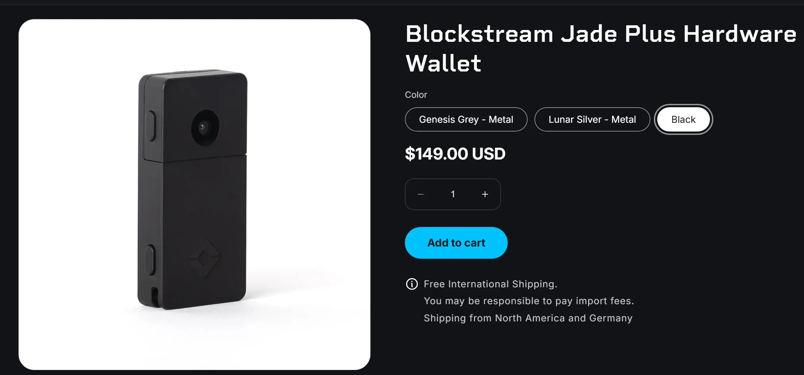

आज, हम उनके फर्मवेयर को 15 डॉलर के हार्डवेयर पर फ्लैश करेंगे।

### क्या खरीदे

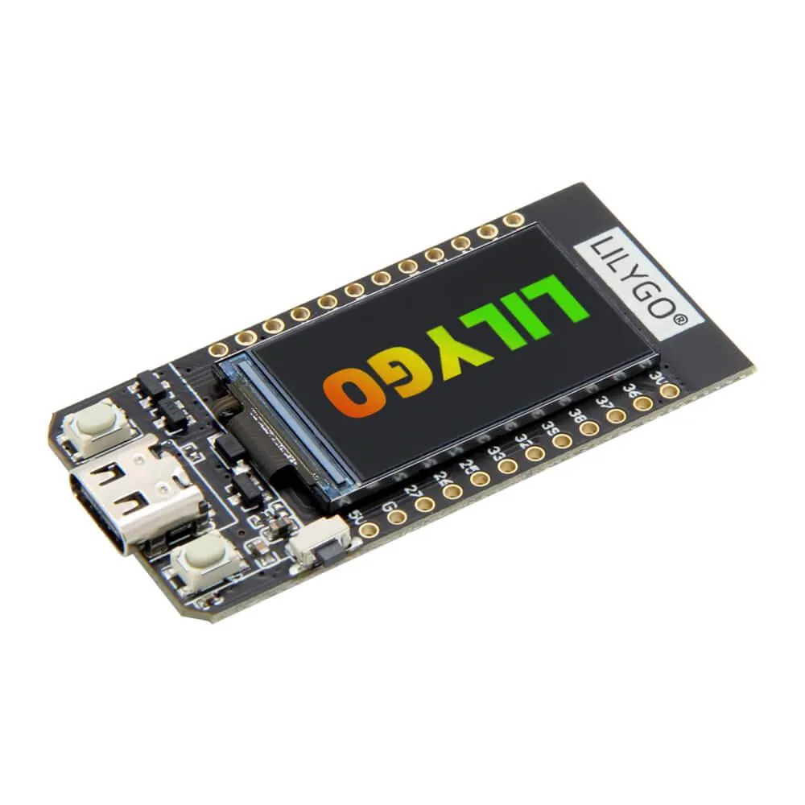

- LilyGO T-डिस्प्ले (16MB शेल के साथ, मॉडल K164)** — [LilyGO से सीधे ऑर्डर करें](https://lilygo.cc/products/t-display?srsltid=AfmBOornob5U3FzZifuSwBBOdeXKcdPDqkYEnAVYKBLdzl0BPyNglGBR) लगभग $15 में। यह ESP32 बोर्ड डिस्प्ले, बटन और USB इंटरफ़ेस प्रदान करता है जो Blockstream के Jade Plus जैसा ही है। ऑनबोर्ड ESP32 में वाई-फ़ाई और ब्लूटूथ रेडियो भी शामिल हैं; हम फ़र्मवेयर भेजेंगे जो उन्हें निष्क्रिय रखेगा, लेकिन वे आपके ख़तरे के मॉडल को आकार देते हैं क्योंकि दुर्भावनापूर्ण कोड उन्हें वापस चालू कर सकता है।
- यूएसबी-सी केबल** - एक डेटा-सक्षम केबल लाएं ताकि आप फर्मवेयर फ्लैश कर सकें और अपने लैपटॉप से ​​सीधे बोर्ड को पावर दे सकें (कक्षा में उपयोग के लिए पूरी तरह से ठीक है)।

### अपना स्वयं का Hardware Wallet क्यों बनाएं?

- वाणिज्यिक उपकरण खरीदने की तुलना में लगभग 135 डॉलर की बचत करें।
- फर्मवेयर फ्लैशिंग, सुरक्षित तत्वों और wallet स्वच्छता के साथ आराम का निर्माण करें।
- बचत को विभिन्न वॉलेट्स में फैलाने के लिए अतिरिक्त हस्ताक्षर डिवाइस का उपयोग करें।
- प्रत्येक घटक को स्वयं प्राप्त करके और संयोजन करके आपूर्ति श्रृंखला जोखिम को कम करें।
- लोप के मंत्र को ध्यान में रखें: संप्रभुता और सुविधा हमेशा एक दूसरे के विपरीत होती हैं।

## भौतिक सेट अप

### अपना मामला तैयार करें

आपके पास अपने LilyGO T-डिस्प्ले बोर्ड को रखने के लिए दो विकल्प हैं: एक 3D प्रिंटेड केस या आधिकारिक LilyGO एनक्लोजर। प्रिंटेड केस [इस मॉडल](https://www.printables.com/model/119144-lilygo-ttgo-t-display-enclosure) से पाया और प्रिंट किया जा सकता है। यह आपके डिवाइस के लिए एक हल्का और अनुकूलन योग्य शेल प्रदान करता है।

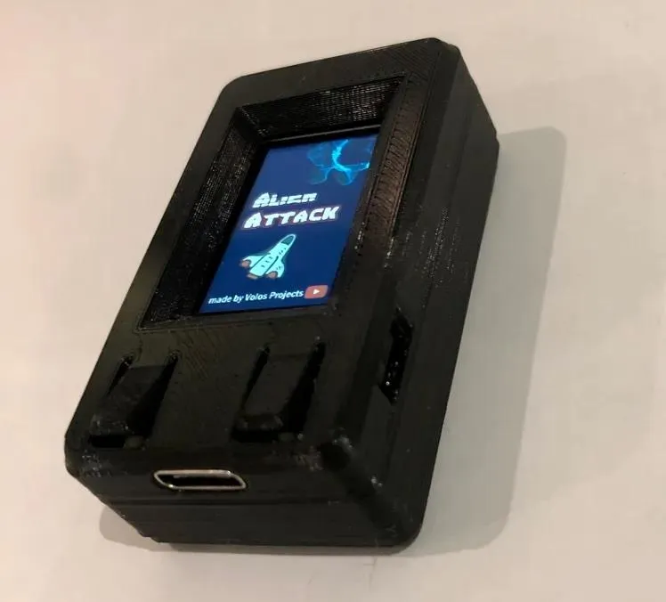

वैकल्पिक रूप से, आप आधिकारिक LilyGO केस का उपयोग कर सकते हैं, जो थोड़ा अलग फिट और फिनिश प्रदान करता है, और अधिक मजबूत सुरक्षा और पॉलिश लुक प्रदान करता है।

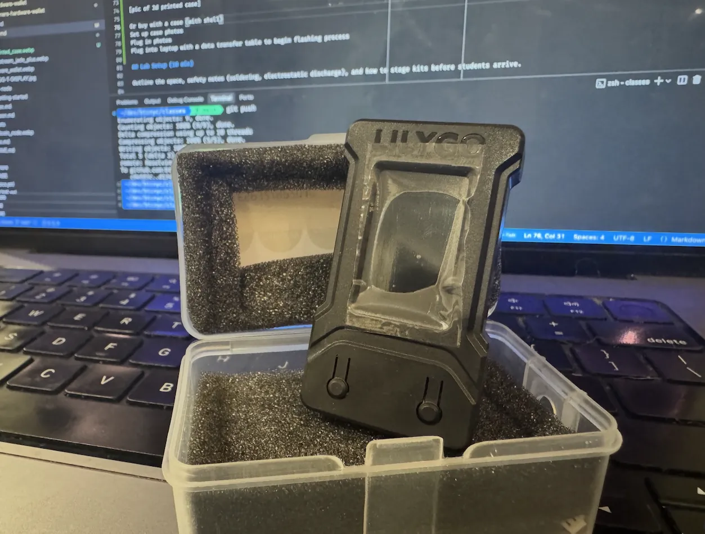

ध्यान दें कि मुद्रित और आधिकारिक केस डिज़ाइन और असेंबली में थोड़े भिन्न होते हैं। आप जो भी विकल्प चुनें, सुनिश्चित करें कि बोर्ड केस के अंदर ठीक से लगा हो ताकि ढीले कनेक्शन या क्षति से बचा जा सके।

### बोर्ड का निरीक्षण करें

आगे बढ़ने से पहले, अपने LilyGO T-डिस्प्ले बोर्ड का ध्यानपूर्वक निरीक्षण करें कि कहीं कोई दिखाई देने वाला दोष या गंदगी तो नहीं है। जाँच लें कि डिस्प्ले, बटन और USB-C पोर्ट साफ़ हैं और उन पर धूल या सोल्डर के छींटे नहीं हैं। बोर्ड को सावधानी से संभालें, और संवेदनशील घटकों को नुकसान से बचाने के लिए इलेक्ट्रोस्टैटिक डिस्चार्ज (ESD) सुरक्षा का ध्यान रखें, खुद को ग्राउंड करें या ESD रिस्ट स्ट्रैप का इस्तेमाल करें।

### अपने लैपटॉप से ​​कनेक्ट करें

डेटा-सक्षम USB-C केबल का उपयोग करके, LilyGO बोर्ड को अपने लैपटॉप से ​​कनेक्ट करें। यह कनेक्शन आपको पावर देगा और फ़र्मवेयर फ्लैश करने में आपकी मदद करेगा।

बूट होने पर, आपको निम्नलिखित स्क्रीन दिखाई देगी:

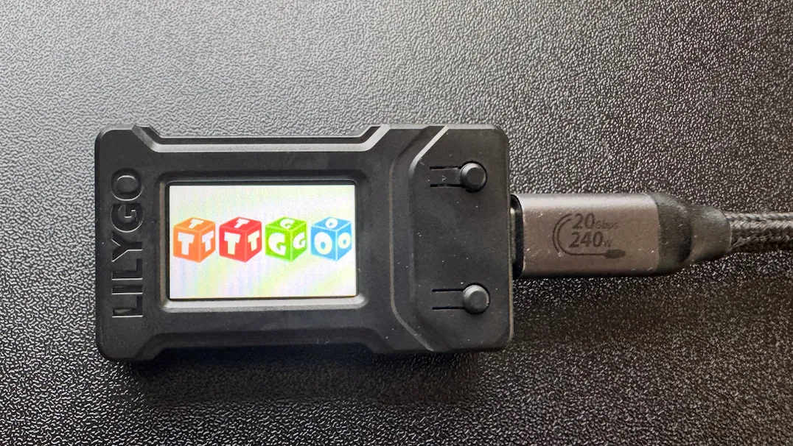

पावर ऑन होने पर, LilyGO ठोस रंगों के बीच एक कलर टेस्ट स्क्रीन प्रदर्शित करेगा। यह फ़र्मवेयर फ्लैश करने से पहले यह पुष्टि करता है कि डिस्प्ले और बोर्ड ठीक से काम कर रहे हैं।

एक बार रंग परीक्षण पूरा हो जाने पर, स्क्रीन डिफ़ॉल्ट स्थिति में आ जाएगी, जो यह संकेत देगा कि बोर्ड निर्माण प्रक्रिया के अगले चरण के लिए तैयार है।

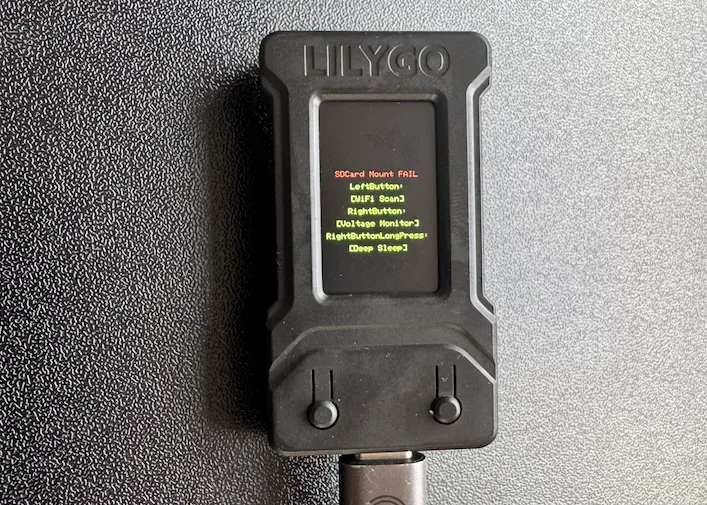

## आसान तरीका या Hard तरीका

आपके हार्डवेयर wallet फ़र्मवेयर को फ्लैश करने के दो मुख्य तरीके हैं: आसान तरीका और कठिन तरीका। आसान तरीका पूर्व-कॉन्फ़िगर किए गए टूल या वेब-आधारित फ़्लैशर्स का उपयोग करता है जो न्यूनतम इनपुट के साथ फ़र्मवेयर को आपके डिवाइस पर स्वचालित रूप से लोड कर देते हैं। यह तरीका उन शुरुआती लोगों के लिए आदर्श है जो त्वरित सफलता चाहते हैं या डिबगिंग और कमांड-लाइन इंटरैक्शन की जटिलताओं से बचना चाहते हैं। यह प्रक्रिया को सरल बनाता है और आपको तेज़ी से काम करने में मदद करता है, जिससे यह एम्बेडेड डेवलपमेंट या हार्डवेयर वॉलेट में नए लोगों के लिए भी सुलभ हो जाता है।

दूसरी ओर, कठिन तरीका फ़र्मवेयर को फ्लैश करने के लिए मैन्युअल रूप से कमांड-लाइन टूल्स का उपयोग करना है। इस तरीके में फ़र्मवेयर की प्रामाणिकता और अखंडता सुनिश्चित करने के लिए फ़र्मवेयर सिग्नेचर और चेकसम की पुष्टि करना आवश्यक है, जिससे आपको फ्लैशिंग प्रक्रिया और फ़र्मवेयर के हार्डवेयर के साथ इंटरैक्ट करने के तरीके की गहरी समझ मिलती है। हालाँकि इसके लिए ज़्यादा प्रयास और टर्मिनल कमांड्स की जानकारी की आवश्यकता होती है, लेकिन यह आपके डिवाइस की सुरक्षा पर बेहतर नियंत्रण, पारदर्शिता और विश्वास प्रदान करता है।

हर तरीके के अपने नुकसान हैं: आसान तरीका गति और सुविधा के लिए कुछ हद तक विश्वास और समझ का त्याग करता है, जबकि कठिन तरीका ज़्यादा समय और तकनीकी कौशल की माँग करता है, लेकिन आपको लचीलापन और अंतर्निहित तकनीक की बेहतर समझ प्रदान करता है। प्रशिक्षकों को छात्रों को वह रास्ता चुनने के लिए प्रोत्साहित करना चाहिए जो उनके सहजता और जिज्ञासा के स्तर के साथ सबसे उपयुक्त हो, जिससे आत्मविश्वास और अन्वेषण दोनों को बढ़ावा मिले।

## आसान तरीका

ESP32 फ्लैश करने का सबसे आसान तरीका

- आधिकारिक ब्लॉकस्ट्रीम गिटहब पर जाएं: [https://github.com/Blockstream/jadediyflasher](https://github.com/Blockstream/jadediyflasher)

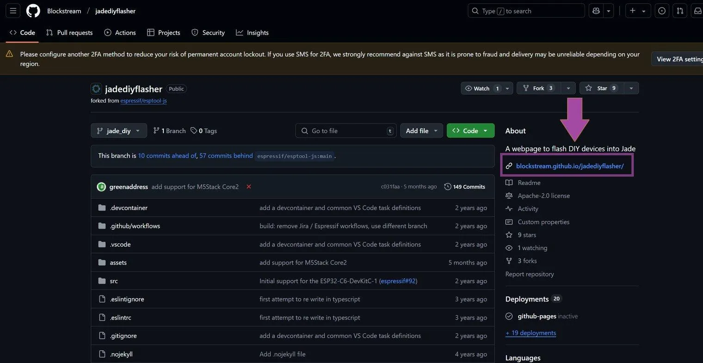

- आप स्रोत फ़ाइल डाउनलोड कर सकते हैं और वेबसाइट को स्थानीय रूप से चला सकते हैं, लेकिन GitHub इसे पहले से ही [https://blockstream.github.io/jadediyflasher/](https://blockstream.github.io/jadediyflasher/) पर होस्ट करता है। GitHub HTML, CSS, JavaScript आदि को सीधे आपके ब्राउज़र में भेजता है ताकि आप डेवलपर टूल इंस्टॉल किए बिना डिवाइस को फ्लैश कर सकें।

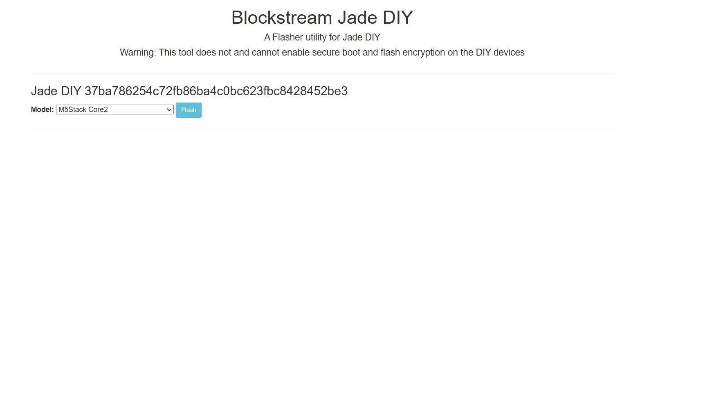

- ड्रॉपडाउन मेनू खोलें (यह संभवतः `M5Stack Core2` पर डिफ़ॉल्ट होगा) और अपना डेवलपमेंट बोर्ड चुनें - इस वर्ग के लिए, `LILYGO T-Display` चुनें।

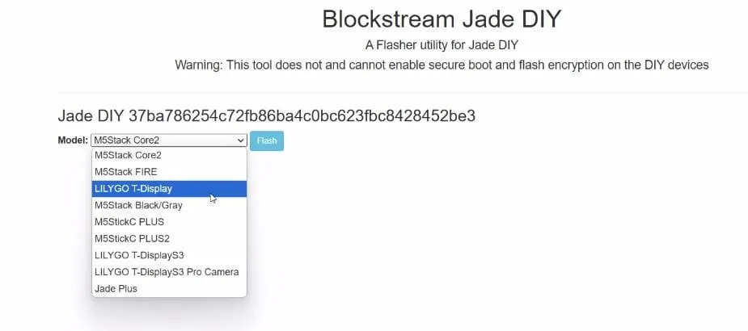

- जब आप फ़्लैश पर क्लिक करेंगे तो यह दिखाई देगा। यह जानने के लिए कि कौन सा डिवाइस LILYGO है, lilygo को अनप्लग करें और वापस प्लग इन करें। lilygo वाला कॉम पोर्ट दिखाई देगा और गायब हो जाएगा। उस COM पोर्ट पर क्लिक करें जिसमें जेड प्लग किया गया है।

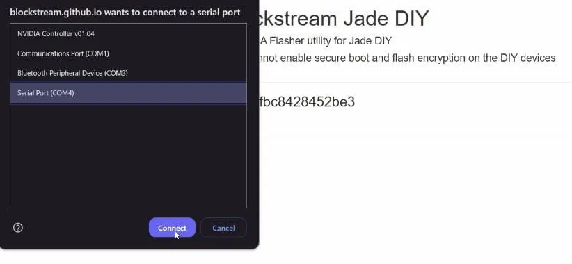

- बस, एक प्रगति पट्टी दिखाई देनी चाहिए और जब यह समाप्त हो जाए तो आप इसे सेट अप करने के लिए तैयार हैं

## जेड Wallet की स्थापना

फ़र्मवेयर सफलतापूर्वक फ़्लैश हो जाने के बाद, आपका LilyGO T-डिस्प्ले अब पूरी तरह से कार्यात्मक जेड हार्डवेयर wallet बन गया है। यह अनुभाग आपको प्रारंभिक सेटअप प्रक्रिया से परिचित कराएगा, जिसमें आपका seed फ़्रेज़ जनरेट करने से लेकर डिवाइस को Sparrow जैसे wallet सॉफ़्टवेयर या Blockstream Green मोबाइल ऐप से कनेक्ट करने तक की पूरी जानकारी शामिल है।

### प्रारंभिक बूट और डिवाइस सेटअप

- डिवाइस चालू करें:** LilyGO अभी भी USB-C के ज़रिए आपके लैपटॉप से ​​कनेक्टेड है, तो जेड फ़र्मवेयर अपने आप बूट हो जाना चाहिए। आपको डिस्प्ले पर जेड लोगो दिखाई देगा।

- सेटअप मोड में प्रवेश करें:** डिवाइस आपको एक प्रारंभिक मेनू दिखाएगा। नेविगेट करने के लिए बोर्ड पर दिए गए दो भौतिक बटनों का उपयोग करें:
 - बायां बटन:** ऊपर/पीछे ले जाएं
 - दायाँ बटन:** नीचे/आगे बढ़ें
 - दोनों बटन एक साथ:** चयन/पुष्टि करें

- "सेटअप" चुनें:** सेटअप विकल्प पर जाएँ और पुष्टि करने के लिए दोनों बटन दबाएँ। डिवाइस आपको शुरुआती कॉन्फ़िगरेशन प्रक्रिया में मार्गदर्शन करेगा।

### अपना Wallet बनाना

- "सेटअप शुरू करें" चुनें:** डिवाइस आपको wallet निर्माण प्रक्रिया शुरू करने के लिए संकेत देगा। अपने चयन की पुष्टि करें।

- "नया Wallet बनाएं" चुनें:** आपको दो विकल्प प्रस्तुत किए जाएंगे:
 - नया Wallet बनाएँ:** एक नया seed वाक्यांश उत्पन्न करता है (कार्यशाला के लिए इसे चुनें)
 - Wallet को पुनर्स्थापित करें:** seed वाक्यांश से मौजूदा wallet को पुनर्प्राप्त करें (उन्नत उपयोगकर्ताओं के लिए)

- "नया Wallet बनाएं" का चयन करें और पुष्टि करें।

- एन्ट्रॉपी उत्पन्न करें:** डिवाइस क्रिप्टोग्राफ़िक एन्ट्रॉपी बनाने के लिए अपने रैंडम नंबर जनरेटर का उपयोग करेगा। इस प्रक्रिया में कुछ सेकंड लगते हैं क्योंकि डिवाइस कई स्रोतों से रैंडमनेस एकत्र करता है।

### अपना बीज वाक्यांश रिकॉर्ड करना

- अपना seed वाक्यांश लिखें:** अब डिवाइस एक 12-शब्द BIP39 seed वाक्यांश, एक-एक शब्द, प्रदर्शित करेगा। यह पूरी प्रक्रिया का सबसे महत्वपूर्ण चरण है।

**महत्वपूर्ण सुरक्षा प्रथाएँ:**

- प्रत्येक शब्द को कागज़ पर स्पष्ट रूप से लिखें (यदि उपलब्ध हो तो दिए गए seed वाक्यांश कार्ड का उपयोग करें)
- लिखते समय प्रत्येक शब्द की दोबारा जांच करें
- अपने फ़ोन से कभी भी seed वाक्यांश की तस्वीर न लें
- किसी भी कंप्यूटर या फोन में शब्दों को कभी भी टाइप न करें
- अपने seed वाक्यांश को निजी रखें—अपनी स्क्रीन साझा न करें या दूसरों को न दिखाएँ

- अपने seed वाक्यांश की पुष्टि करें:** सभी 12 शब्द लिखने के बाद, डिवाइस आपसे वाक्यांश के कुछ शब्दों की पुष्टि करने के लिए कहेगा ताकि यह सुनिश्चित हो सके कि आपने उन्हें सही ढंग से रिकॉर्ड किया है। प्रत्येक संकेत के लिए सही शब्द चुनने के लिए बटनों का उपयोग करें।

**प्रो टिप:** आगे बढ़ने से पहले, अपने seed वाक्यांश को ज़ोर से (धीरे ​​से, ताकि दूसरे न सुन सकें) खुद पढ़ने का अभ्यास करें। इससे लिखावट की किसी भी गलती या अस्पष्टता को पकड़ने में मदद मिलती है।

### कनेक्शन विधि

- कनेक्शन प्रकार चुनें:** जेड फर्मवेयर दो कनेक्शन विधियों का समर्थन करता है:
 - यूएसबी:** यूएसबी-सी केबल के माध्यम से वायर्ड कनेक्शन (इस कार्यशाला के लिए अनुशंसित)
 - ब्लूटूथ:** मोबाइल उपकरणों से वायरलेस कनेक्शन

- अभी के लिए USB का चयन करें, क्योंकि यह डेस्कटॉप wallet सॉफ्टवेयर के लिए सबसे सरल विकल्प है और इसमें वायरलेस आक्रमण वेक्टर नहीं होते हैं।

- डिवाइस का नामकरण:** जेड एक विशिष्ट पहचानकर्ता प्रदर्शित करेगा, जैसे "कनेक्ट जेड A7D924"। यदि आप एक से ज़्यादा हार्डवेयर वॉलेट बना रहे हैं, तो यह पहचानकर्ता आपको कई हार्डवेयर वॉलेट के बीच अंतर करने में मदद करता है। यदि आप चाहें, तो इस पहचानकर्ता को नोट कर लें।

### Wallet सॉफ़्टवेयर से कनेक्ट करना

अब आपके पास अपने नए बनाए गए हार्डवेयर wallet के साथ इंटरफेस करने के लिए दो मुख्य विकल्प हैं: Blockstream Green मोबाइल ऐप (चलते-फिरते इस्तेमाल के लिए) या Sparrow Wallet (डेस्कटॉप इस्तेमाल के लिए और ज़्यादा उन्नत सुविधाओं के साथ)। इस कार्यशाला में, हम Sparrow Wallet पर ध्यान केंद्रित करेंगे, क्योंकि यह Bitcoin लेनदेन के तकनीकी विवरणों की बेहतर जानकारी प्रदान करता है।

#### विकल्प 1: Blockstream Green मोबाइल ऐप (त्वरित प्रारंभ)

यदि आप मोबाइल डिवाइस से अपने डिवाइस का शीघ्रता से परीक्षण करना चाहते हैं:

- ऐप स्टोर (iOS) या गूगल प्ले (एंड्रॉइड) से **Blockstream Green** ऐप डाउनलोड करें
- ऐप खोलें और "Connect Hardware Wallet" चुनें
- समर्थित उपकरणों की सूची से "जेड" चुनें
- USB-C से USB-C केबल (या iPhone 15+ के लिए USB-C से लाइटनिंग एडाप्टर) का उपयोग करके अपने जेड को अपने फ़ोन में प्लग करें
- कनेक्ट करने और अपना पहला wallet बनाने के लिए ऑन-स्क्रीन संकेतों का पालन करें

**Liquid के बारे में नोट:** Blockstream Green ऐप Bitcoin और Liquid (एक Bitcoin साइडचेन) दोनों को सपोर्ट करता है। अगर आप Liquid सुविधाओं का इस्तेमाल कर रहे हैं, तो आपको "मास्टर ब्लाइंडिंग की एक्सपोर्ट करें" का विकल्प दिया जा सकता है—इससे ऐप Liquid नेटवर्क पर लेन-देन की राशि देख सकता है, जो अन्यथा गोपनीय होती है। इस वर्कशॉप के लिए, आप Liquid सुविधाओं को छोड़कर मानक Bitcoin लेन-देन पर ध्यान केंद्रित कर सकते हैं।

#### विकल्प 2: Sparrow Wallet (कार्यशाला के लिए अनुशंसित)

Sparrow Wallet एक शक्तिशाली डेस्कटॉप अनुप्रयोग है जो आपको अपने Bitcoin लेनदेन पर विस्तृत नियंत्रण प्रदान करता है और आपके जेड हार्डवेयर wallet के साथ सहजता से जुड़ता है।

**स्थापना:**

- आधिकारिक वेबसाइट से Sparrow Wallet डाउनलोड करें: [sparrowwallet.com](https://sparrowwallet.com)
- डाउनलोड हस्ताक्षर सत्यापित करें (विवरण के लिए Sparrow दस्तावेज़ देखें)
- एप्लिकेशन इंस्टॉल करें और लॉन्च करें

**अपने जेड को Sparrow से जोड़ना:**

- Sparrow में, **फ़ाइल → नया Wallet** पर जाएँ
- अपने wallet को एक नाम दें (उदाहरण के लिए, "मेरा जेड Wallet")
- **कनेक्टेड Hardware Wallet** पर क्लिक करें
- Sparrow को स्वचालित रूप से आपके प्लग-इन जेड डिवाइस का पता लगाना चाहिए
- यदि संकेत दिया जाए, तो दोनों बटन दबाकर जेड डिस्प्ले पर कनेक्शन की पुष्टि करें
- अपनी इच्छित स्क्रिप्ट प्रकार का चयन करें:
 - नेटिव सेगविट (P2WPKH):** शुरुआती लोगों के लिए अनुशंसित—सबसे कम शुल्क, आधुनिक वॉलेट के साथ व्यापक संगतता
 - नेस्टेड सेगविट (P2SH-P2WPKH):** पुरानी सेवाओं के साथ संगतता के लिए
 - Taproot (P2TR):** सबसे उन्नत, सर्वोत्तम गोपनीयता और न्यूनतम शुल्क प्रदान करता है, लेकिन इसके लिए अत्याधुनिक wallet समर्थन की आवश्यकता होती है
- कनेक्शन पूरा करने के लिए **कीस्टोर आयात करें** पर क्लिक करें

**Sparrow के सर्वर कनेक्शन को कॉन्फ़िगर करना:**

इससे पहले कि आप अपना बैलेंस देख सकें या लेन-देन प्रसारित कर सकें, Sparrow को ब्लॉकचेन डेटा प्राप्त करने के लिए Bitcoin नोड से कनेक्ट होना होगा। आपके पास कई विकल्प हैं, जिनमें से प्रत्येक में सुविधा, गोपनीयता और विश्वास के बीच अलग-अलग समझौते हैं:

- सार्वजनिक Electrum Server (सबसे आसान, सबसे कम निजी):** किसी तृतीय पक्ष द्वारा संचालित सार्वजनिक सर्वर से कनेक्ट होता है। सेटअप करना तेज़ है, लेकिन सर्वर आपके wallet के पते देख सकता है और संभवतः उन्हें आपके IP पते से लिंक कर सकता है। टेस्टनेट पर परीक्षण के लिए उपयुक्त।
 - Sparrow में, **टूल्स → प्राथमिकताएँ → सर्वर** पर जाएँ
 - **सार्वजनिक सर्वर** चुनें और सूची से एक सर्वर चुनें
 - सत्यापित करने के लिए **कनेक्शन परीक्षण** पर क्लिक करें

- Bitcoin कोर या नॉट्स नोड (सबसे निजी, सबसे ज़्यादा काम):** अपना पूरा Bitcoin नोड चलाएँ। यह गोपनीयता और सत्यापन का सर्वोत्तम मानक है, क्योंकि आप हर लेन-देन की पुष्टि स्वयं करते हैं और किसी और के सर्वर पर भरोसा नहीं करते। हालाँकि, इसके लिए पूरे ब्लॉकचेन (लगभग 600GB) को डाउनलोड करना और अपने नोड को सिंक्रोनाइज़ रखना आवश्यक है।
 - Bitcoin कोर या नॉट्स को स्थापित और सिंक करें
 - Sparrow में, **टूल्स → प्राथमिकताएँ → सर्वर** पर जाएँ
 - **Bitcoin कोर या नॉट्स** चुनें और अपने नोड का कनेक्शन विवरण दर्ज करें

- निजी Electrum Server (अच्छा संतुलन):** अपने Bitcoin कोर या नॉट्स नोड से जुड़े अपने Electrum सर्वर (जैसे फुलक्रम या Electrs) को होस्ट करें। यह आपके नोड के समान मशीन पर Sparrow चलाने की आवश्यकता के बिना पूर्ण गोपनीयता प्रदान करता है।
 - अपने Bitcoin कोर या नॉट्स नोड की ओर इंगित करते हुए एक Electrum सर्वर सेट अप करें
 - Sparrow में, **टूल्स → प्राथमिकताएँ → सर्वर** पर जाएँ
 - **निजी Electrum** चुनें और अपने सर्वर का URL दर्ज करें

इस कार्यशाला के लिए, टेस्टनेट लेनदेन के लिए **पब्लिक Electrum Server** का उपयोग करना बिल्कुल सही है। वास्तविक धन वाले उत्पादन परिवेश में, आप अधिकतम गोपनीयता के लिए अपना स्वयं का नोड चलाने या किसी विश्वसनीय निजी सर्वर का उपयोग करने पर विचार कर सकते हैं।

#### विकल्प 3: Blockstream Green डेस्कटॉप ऐप (त्वरित प्रारंभ)

Blockstream Green जेडडीआईवाई की स्थापना पूरी करने के लिए सॉफ्टवेयर है और यह डेस्कटॉप संस्करण के साथ होना चाहिए

- आधिकारिक ब्लॉकस्ट्रीम एप्लिकेशन डाउनलोड करें — यह उनकी वेबसाइट का लिंक है। जब आप वहां पहुँच जाएँ, तो [अभी डाउनलोड करें](https://blockstream.com/app/) पर क्लिक करें।

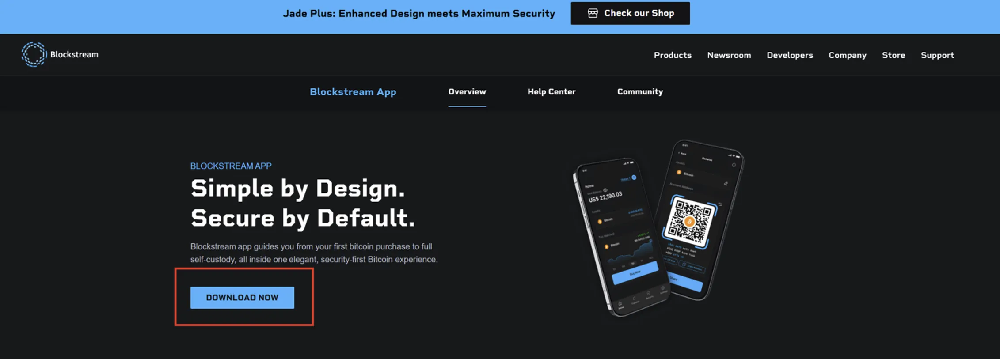

- आपके डाउनलोड कहाँ जाते हैं, इसके आधार पर, फ़ाइल संभवतः आपके डाउनलोड फ़ोल्डर में होगी। वहाँ जाकर सॉफ़्टवेयर इंस्टॉल करने के लिए एक्ज़ीक्यूटेबल फ़ाइल पर डबल-क्लिक करें।

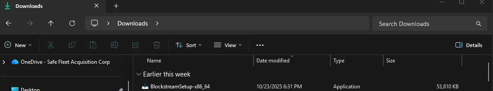

- इंस्टॉलर चलाने के लिए आपको एडमिन राइट्स देने पड़ सकते हैं। ऐसा करने पर, एक विंडो खुलेगी जो नीचे दी गई तस्वीर जैसी दिखेगी—**अगला** पर क्लिक करें।

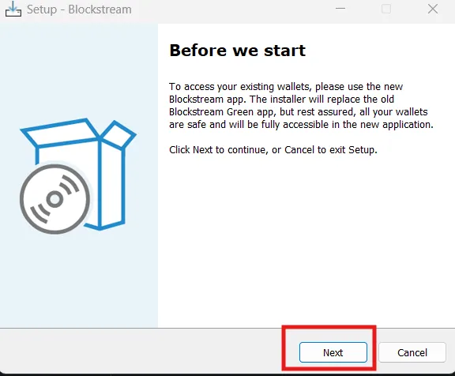

- चुनें कि आप इंस्टॉल किए गए एप्लिकेशन को कहां रखना चाहते हैं (आपके अन्य प्रोग्रामों वाला स्थान या कोई ऐसी जगह जहां उसे ढूंढना आसान हो), फिर **अगला** पर क्लिक करें।

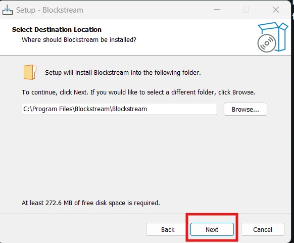

- इंस्टॉलर एक शॉर्टकट नाम पूछेगा। एक नाम दर्ज करें या डिफ़ॉल्ट नाम रखें, फिर **अगला** पर क्लिक करें।

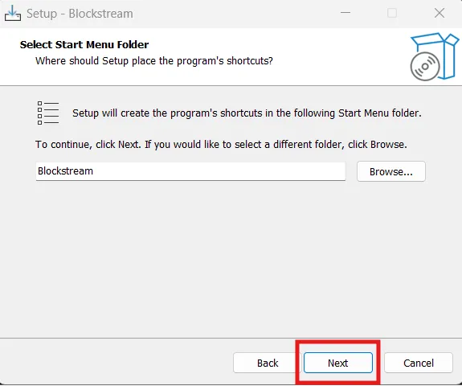

- यदि आप डेस्कटॉप शॉर्टकट चाहते हैं, तो बॉक्स को चेक करें; अन्यथा **अगला** पर क्लिक करें।

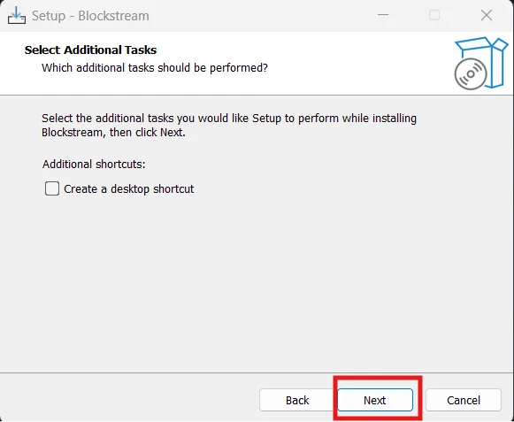

- अंत में, **इंस्टॉल करें** पर क्लिक करें और इंस्टॉलेशन पूरा होने के लिए कुछ मिनट प्रतीक्षा करें।

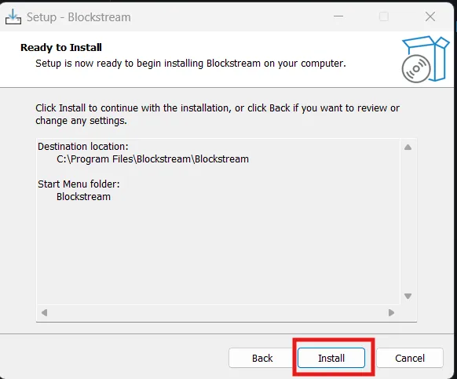

- प्रगति पट्टी अंत तक भरनी चाहिए।

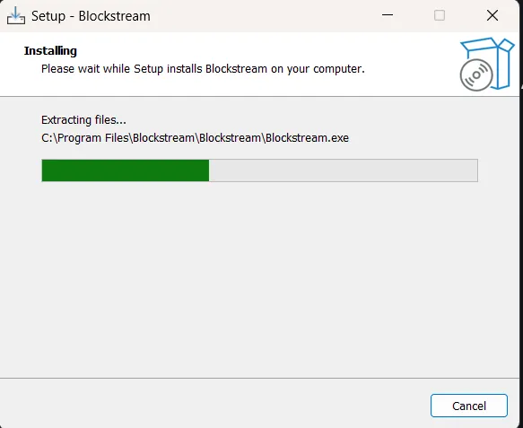

- जब यह समाप्त हो जाएगा, तो एक नया पृष्ठ दिखाई देगा - **समाप्त** पर क्लिक करें।

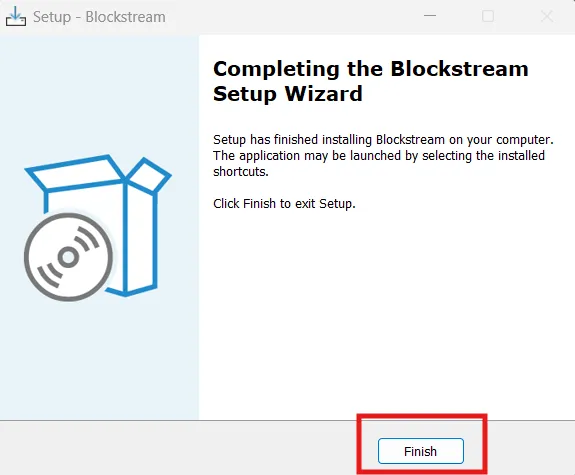

- अपना नया इंस्टॉल किया गया ब्लॉकस्ट्रीम एप्लिकेशन ढूंढें (उदाहरण विंडोज 11 स्टार्ट मेनू में दिखाया गया है)।

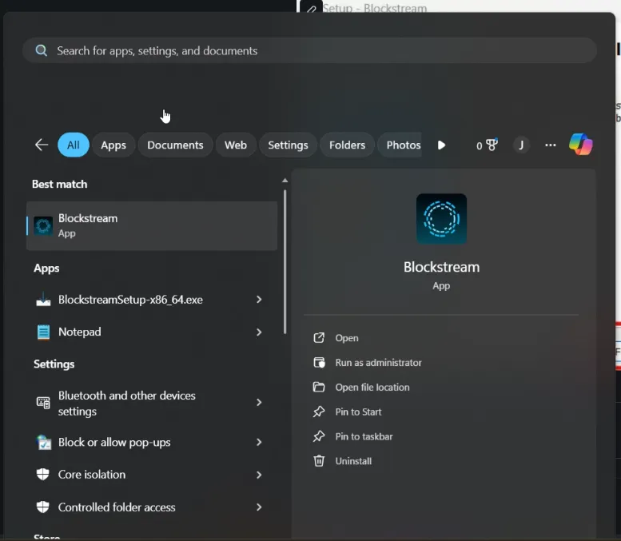

- एक बार जब आप इसे पा लें, तो लॉन्च करने के लिए क्लिक करें - एक स्प्लैश स्क्रीन दिखाई देनी चाहिए।

### अपना सेटअप सत्यापित करना

एक बार Sparrow (या किसी अन्य wallet अनुप्रयोग) से कनेक्ट होने पर:

- अपने पते जांचें:** Sparrow आपके seed वाक्यांश से प्राप्त प्राप्त पते प्रदर्शित करेगा। आप Sparrow में "प्राप्त करें" टैब पर जाकर और "Address प्रदर्शित करें" पर क्लिक करके अपने जेड डिवाइस पर पते की पुष्टि कर सकते हैं—पता आपकी कंप्यूटर स्क्रीन और जेड डिस्प्ले, दोनों पर दिखाई देना चाहिए।

- प्राप्त करने वाला पता उत्पन्न करें:** Sparrow में **प्राप्त करें** टैब पर क्लिक करें और अपना पहला Bitcoin प्राप्त करने वाला पता कॉपी करें।

- लेन-देन के लिए तैयार:** आपका हार्डवेयर wallet अब पूरी तरह से कॉन्फ़िगर हो चुका है और Bitcoin लेन-देन प्राप्त करने और उन पर हस्ताक्षर करने के लिए तैयार है। टेस्टनेट लेन-देन पर हस्ताक्षर करने का अभ्यास करने के लिए अगले भाग पर जाएँ।

---

### त्वरित सेटअप चेकलिस्ट

- जेड फर्मवेयर सफलतापूर्वक बूट हुआ
- 12-शब्द seed वाक्यांश के साथ बनाया गया नया wallet
- बीज वाक्यांश स्पष्ट रूप से लिखा और सत्यापित किया गया
- USB कनेक्शन मोड चयनित
- Wallet सॉफ़्टवेयर (Sparrow) स्थापित और कनेक्टेड
- सर्वर कनेक्शन कॉन्फ़िगर किया गया (mainnet के लिए सार्वजनिक Electrum)
- डिवाइस पर पहला प्राप्तकर्ता पता जनरेट और सत्यापित किया गया

---

**MIT लाइसेंस**

**कॉपीराइट (c) 2025 Bitcoin नेटवर्क NYC**

इस सॉफ्टवेयर और संबंधित दस्तावेज फाइलों ("सॉफ्टवेयर") की प्रतिलिपि प्राप्त करने वाले किसी भी व्यक्ति को, बिना किसी प्रतिबंध के सॉफ्टवेयर में सौदा करने की अनुमति नि:शुल्क दी जाती है, जिसमें बिना किसी सीमा के सॉफ्टवेयर की प्रतियां उपयोग करने, प्रतिलिपि बनाने, संशोधित करने, विलय करने, प्रकाशित करने, वितरित करने, उप-लाइसेंस देने और/या बेचने के अधिकार शामिल हैं, और जिन व्यक्तियों को सॉफ्टवेयर प्रदान किया गया है उन्हें ऐसा करने की अनुमति देने की अनुमति निम्नलिखित शर्तों के अधीन है:

उपरोक्त कॉपीराइट नोटिस और यह अनुमति नोटिस सॉफ्टवेयर की सभी प्रतियों या पर्याप्त भागों में शामिल किया जाएगा।

सॉफ़्टवेयर "जैसा है वैसा" प्रदान किया जाता है, बिना किसी प्रकार की, व्यक्त या निहित, वारंटी के, जिसमें व्यापारिकता, किसी विशेष उद्देश्य के लिए उपयुक्तता और गैर-उल्लंघन की वारंटी शामिल हैं, लेकिन इन्हीं तक सीमित नहीं हैं। किसी भी स्थिति में लेखक या कॉपीराइट धारक किसी भी दावे, क्षति या अन्य देयता के लिए उत्तरदायी नहीं होंगे, चाहे वह अनुबंध, अपकृत्य या अन्यथा, सॉफ़्टवेयर से उत्पन्न, उससे बाहर या सॉफ़्टवेयर के संबंध में या सॉफ़्टवेयर के उपयोग या अन्य लेन-देन से उत्पन्न हो।

---