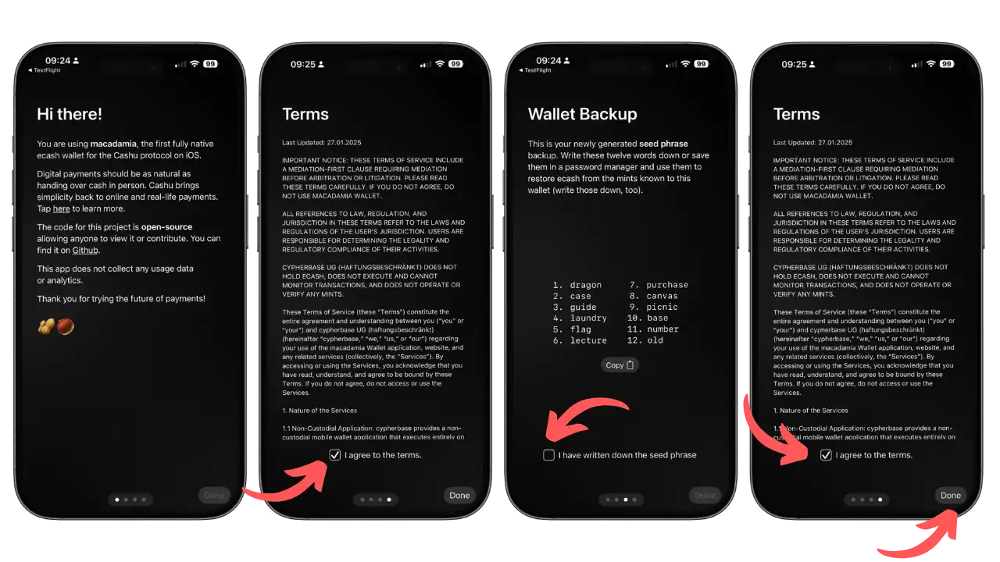
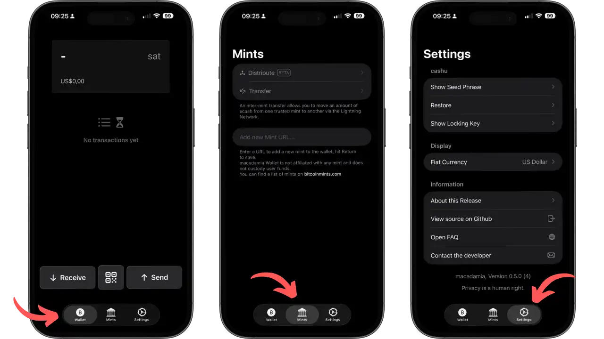
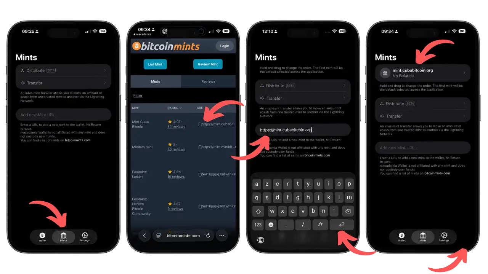
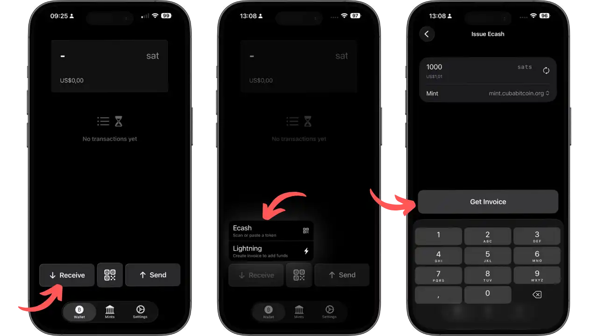
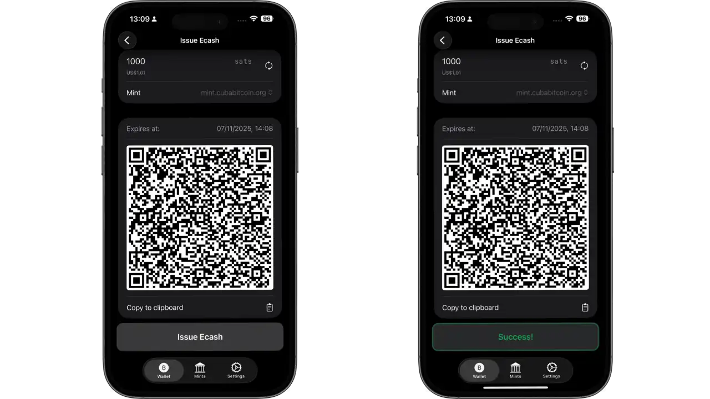
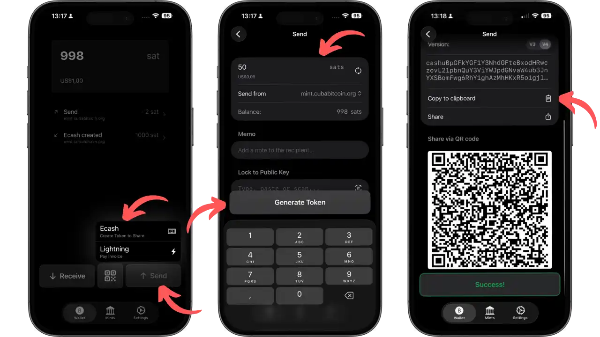
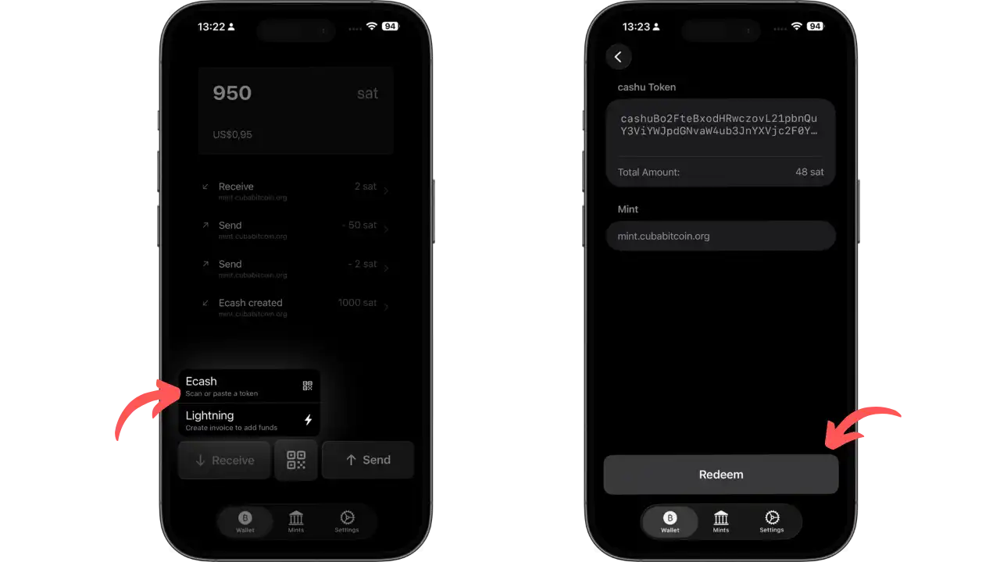
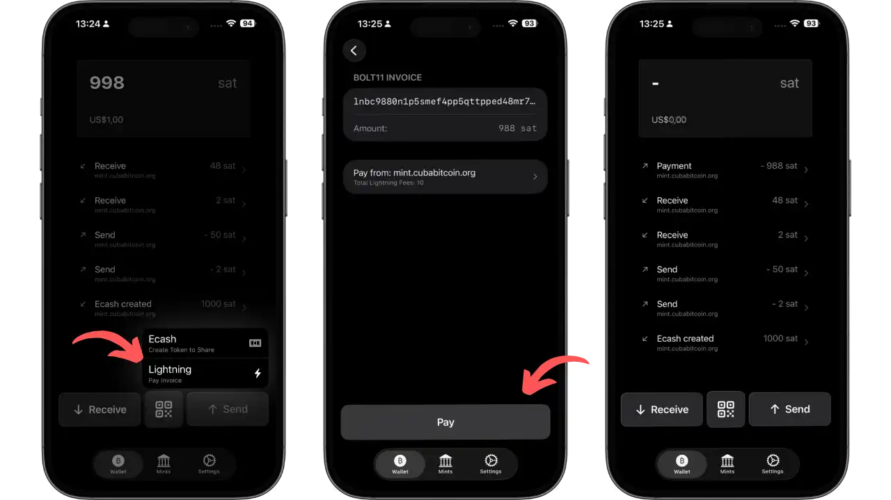
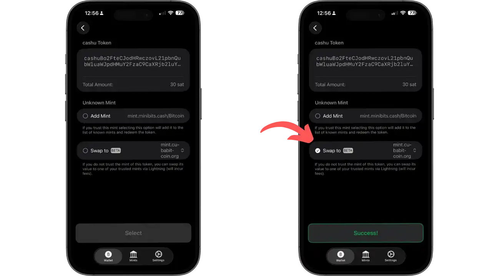
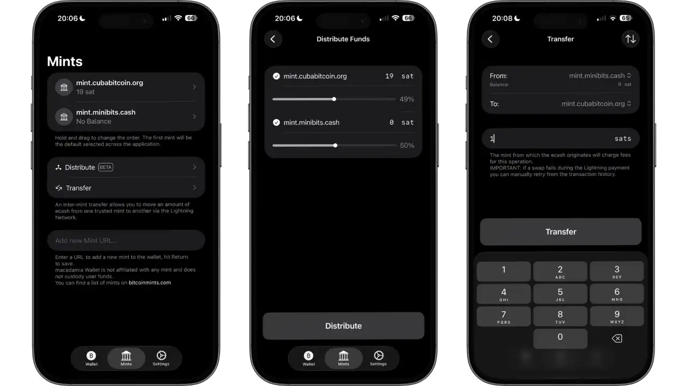

Macadamia Wallet ni telefone ngendanwa ya iOS wallet ikoresha umurongo wa Cashu, uburyo bwo gutanga amahera bwa Chaumian bushoboza kwishura Bitcoin ata mazina. Kubera imikono y’impumyi, nta n’umwe yihweza ashobora guhuza amahera ubika n’amahera ukoresha, ivyo bikaba bitanga ibanga risa n’iry’amahera y’umubiri.

Muri iyi nyigisho, turaza kuraba ingene woshiramwo no gutunganya Macadamia, gukora ibikorwa vyawe vya mbere vya Cashu (Mint, Send, Receive, Melt), no gucunga ama mint menshi kugira ngo ukingire amahera yawe.

## Igiti c’umukaraba Wallet ni iki?

### Amasezerano ya Cashu

Cashu ikoresha imikono y’impumyi yahinguwe na David Chaum: ushiramwo amafaranga y’ibiceri (bitcoins) kuri server yitwa "mint", itanga ibimenyetso bingana mu bice vy’amasatoshi. Iryo shirahamwe ry’amahera ry’iminwe rishinya kuri ivyo bimenyetso ritabona ibirimwo, ivyo bikaba bituma bidashoboka guhuza token n’uwuyikoresha. Ivyiyumviro ni off-chain, peer-to-peer, kandi ntibiboneka neza - mbere n’ivy’ubuhinga ntibishobora gukurikirana uwuriko ariha uwundi.

Macadamia ni iOS y’inkomoko yuguruye wallet yateguwe muri Swift/SwiftUI. Ikora ata konti canke KYC, ibimenyetso vyawe bibikwa aho hantu kandi birinzwe n’ijambo seed. Kode iragenzurwa kuri GitHub kandi ibimenyetso birakorana n’ibindi bikoresho vya Cashu (Minibits, Cashu.me).

### Icitegererezo c'ububiko n'ugusenyera ku mugozi umwe

**Igihambaye**: Cashu ikora ku buryo bwo kubungabunga. Ivyiyumviro ni amasezerano yo kwishura (IOUs) ashigikiwe n’amafaranga y’i mint Bitcoin. Iyo iyo mint izimvye, ibimenyetso vyawe biratakaza agaciro kavyo. Ivyo ni vyo bituma habaho ibanga ryinshi.

Koresha Macadamia nk’umubiri wallet: n’ibindi bike gusa. Ushire amahera yawe ku bibanza vyinshi kugira ngo ugabanye ingorane.

## Ibirango nyamukuru

Macadamia ishira mu ngiro ibikorwa bine vy’ishimikiro vy’amasezerano ya Cashu. **Mint** ihindura satoshis zawe mu bimenyetso biciye ku nsiguro y'umuravyo. **Send** bigufasha kohereza ibimenyetso ku buntu biciye kuri kode ya QR canke link, vyose bifise off-chain. **Kwakira** bigufasha kwakira ibimenyetso canke generate invoice y'umuravyo. **Melt** iriha invoice y'umuravyo mu gusenya ibimenyetso vyawe.

wallet ishigikira uburongozi bw’amahinguriro menshi icarimwe. Ushobora guhindura ibimenyetso hagati y'ama mints atandukanye biciye ku Muravyo.

## Imbuga zishigikiwe

Macadamia iboneka gusa kuri iOS 17 canke hejuru kuri iPhone na iPad. Igikoresho ca Swift/SwiftUI gitanga ubufatanye bwiza n’ibidukikije vya Apple.

Iryo tegeko rya Cashu ritanga icemezo c’ugukorana hagati y’amasakoshi. Ushobora kugarura ijambo ryawe rya seed mu bindi bikoresho nka Minibits kuri Android canke Nutstash kuri mudasobwa.

Verisiyo iriho ubu irakwiragizwa biciye kuri TestFlight. Koresha gusa ibice bikeyi n'iyi verisiyo ya beta.

## Gushiramwo

Macadamia ubu iraboneka biciye kuri TestFlight, porogarama ya Apple yo gupima ivy’ubuhinga bwa none. Ehe ingene wobishiramwo:

### Gushiramwo biciye ku kigeragezo c'indege

**Intambwe ya 1: Gukuraho TestFlight**

Niba utarafise porogarama ya TestFlight ku gikoresho cawe, rondera "TestFlight" muri App Store maze uyishiremwo. TestFlight ni porogaramu yemewe ya Apple yo kugerageza verisiyo za beta z’iOS.

**Intambwe ya 2: Niwinjire muri porogarama ya Macadamia beta** (mu gifaransa)

Igihe TestFlight imaze gushirwaho, kurikiza iyi nzira y’ubutumire kuri iPhone canke iPad yawe: [injira muri RMU6PaRu]

Iryo huriro rizoca rifungura TestFlight maze riguhe gushiramwo Macadamia Wallet. Kora kuri "Emera" hanyuma "Shiraho" kugira ngo utangure gukuraho. Iryo koraniro ripima nk’ama megabyte cumi kandi rifata amasegonda makeyi gusa kugira ngo rishiremwo.

### Amakuru ahambaye yerekeye verisiyo za beta

Macadamia iracari mu rwego rwo gutera imbere. Verisiyo za TestFlight zirahindurwa kenshi kandi zishobora gushiramwo ibintu bishasha canke gukosora ibibazo. Ariko rero, nk’uko bigenda kuri verisiyo iyo ari yo yose ya beta, bishobora gutuma habaho ukudakora neza. **Turagusavye cane gukoresha amafaranga makeyi gusa**, ayo wemera ko yoshobora gutakazwa iyo habaye ingorane y’ubuhinga.

Macadamia ntikwegeranya amakuru y’abakoresha hakurikijwe amategeko y’ubuzima bwite yerekanwa. Raba neza ko umuhinguzi ari cypherbase UG igihe ushiramwo.

## Imiterere y'intango

Ku gutangura kwa mbere, Macadamia itanga interuro BIP-39 y’amajambo 12. Bindike ahantu hatagira inkomanzi - ntimwigere bifata nk’igishushanyo co ku rubuga. Aya majambo aragufasha gusubira kurema wallet yawe no gukoresha ibimenyetso vyawe.

Kurikiza intambwe zine: kwakira, kwemera amajambo, kubika interuro ya seed, no kwemeza kwa nyuma.

Igihe ivy’ugutunganya birangiye, Macadamia yerekana amabara atatu nyamukuru. **Wallet** yerekana umubare wawe n'amateka y'ibikorwa vyawe. **Mints** iragufasha gucunga ama server yawe ya Cashu. **Imiterere** itanga uburenganzira bwo gushika ku miterere n'ijambo ryawe rya seed.

Ubu ukeneye gutunganya mint, ni ukuvuga server ya Cashu izotanga ibimenyetso vyawe. Genda ku rubuga rwa "Imint", ukande kuri "Ongera URL nshasha y'Imint", hanyuma winjize aderesi y'Imint wahisemwo (nk'akarorero mint.cubabitcoin.org). Raba kuri bitcoinmints.com canke kuri cashu.space kugira ngo ubone amafaranga y’abantu bose afise izina ryiza. Validate gusa ama mints mwasuzumye izina ryayo, kuko azoba afise uburenganzira bwo kubungabunga ama satoshis yawe.

## Gukoresha buri musi

### Guhingura ibimenyetso bishasha (Mint)

Kugira ngo ugaburire wallet Macadamia yawe ecash, ukeneye gukora igikorwa ca "Mint" (kugira ngo ureme ibimenyetso). Kora kuri "Kwakira", hanyuma uhitemwo "Imiravyo". Injira umubare wipfuza (nk’akarorero 1000 sats), uhitemwo ivyuma uzokoresha, hanyuma generate invoice y’umuravyo.

Ishura inyemezabuguzi y’umuravyo yashizweho n’igice cawe ca wallet gisanzwe (Phoenix, Zewu, BlueWallet).

Cashu tokens zica ziboneka ubwo nyene mu giciro cawe umaze kwishura.

### Wohereze ibimenyetso

Kugira ngo wohereze ibimenyetso vya Cashu ku wundi mukozi, kora kuri buto ya "Kohereza" ku mugaragaro nyamukuru, hanyuma uhitemwo "Ecash". Injira amafaranga azorungikwa (nk’akarorero 50 sats) wongereko n’inyandiko idondora nimba bisabwa.

Sangira kode ya QR canke umwandiko wavutse biciye ku butumwa bwa iMessage, Signal canke Telegram. Uwuronka ayo mahera aca asaba ayo mahera ubwo nyene kandi ataco yishuye.

### Kwakira ibimenyetso

Kugira ngo uronke amafaranga yoherejwe n'uwundi muntu, kora kuri "Kwakira" hanyuma uhitemwo "Ecash". Scan code QR ya token canke ushireko link ya token waronse.

Kora kuri "Redeem" kugira ngo usabe token.

### Ivyishyurwa vy'umuravyo (Melt)

Kugira ngo wishyure invoice y'umuravyo n'ibimenyetso vyawe vya Cashu, kora kuri "Ohereza" hanyuma uhitemwo "Umuravyo". Nimushireko invoice ya BOLT11 wipfuza kwishura.

Iminwe irasambura ibimenyetso vyawe maze igashitsa ukwishyura kw’Umuravyo. Ushobora rero kwishura igikorwa cose ca Lightning mu gihe uzigama amazina yawe.

### Guhinduranya hagati y'ibiceri

Iyo uronse ibimenyetso bivuye mu mint utatunganije, Macadamia iraguha uburyo bwinshi bwo gucunga ivyo bimenyetso.

Wongereko iyo mint nshasha canke uhindure ibimenyetso ku mint isanzweho. Iryo swap rikoresha Lightning nk’ikiraro co gutanga amahera yawe ata wubizi.

### Ubuyobozi buteye imbere bw'amafaranga menshi

Macadamia itanga ibikoresho bikomeye vyo gucunga ama mint menshi icarimwe no gutanga amahera yawe mu buryo bubereye.

"Gangira Amafaranga" ihita itanga amafaranga yawe hakurikijwe amajana (nk'akarorero 50/50). "Transfer" iremesha kwimurira n'amaboko hagati y'ama mints kugira ngo uhindure ingorane zawe.

## Inyungu n'aho bigarukira

**Ibintu bihambaye** :

- Ibanga ryinshi**: Amafaranga adashobora gukurikirana, mbere n’ivy’amahera. Nta makuru y’ivy’ubuhinga bwa none, guhanahana amakuru hagati y’abantu ata n’umwe akurikirana.
- Ivyihuta kandi ku buntu**: Ugutanga amahera ku buntu mu gihe c’iminwe, ni vyiza ku kwishura amahera make.
- Ugukorana**: ibimenyetso vya Cashu bihuye n’ibindi bikoresho bihuye (Minibits, Nutstash).
- Ukworohereza**: Interface iOS native irashikira abatangura mu gihe iguma ishobora gusuzumwa (inkomoko yuguruye).

**Ibibujijwe** :

- Icogereranyo c’ububiko**: ukwizigira kwa mint birakenewe. Iyo minti izimye, ibimenyetso vyawe biratakaza agaciro kavyo.
- iOS gusa**: Nta verisiyo ya Android/ibiro. Cashu interoperability ishobora gutuma umuntu ashobora kuyironka biciye mu bindi bikoresho, ariko ubumenyi bwiza buguma ari iOS.
- Ugushingira ku Mint**: Mint iri hanze y’umurongo = idashobora gukora ibikorwa bisaba ko yinjiramwo (Mint, Melt).
- Ikoranabuhanga rishasha** : Iterambere rikomeye, ibikoko bishoboka, ingingo mfatirwako ziriko zirahinduka.

## Ibikorwa vyiza

- Diversify your mints**: Gukwiragiza ama chips yawe mu mints nyinshi zizwi kugira ngo ugabanye ingorane.
- Igitigiri c’amahera**: Koresha Macadamia nk’igitabu c’amahera wallet ku musi ku musi, atari nk’igitabu c’amahera.
- Gukingira seed** yawe: Gumana amajambo yawe y’amajambo 12 ku mpapuro ahantu hatagira inkomanzi. Igerageza ryo gusubizaho rimwe na rimwe.
- Suzuma amafaranga**: Raba cashu.space n’amahuriro y’abanyagihugu imbere yo kwongerako amafaranga. Hitamwo abo bafise umwanya mwiza wo gukora kandi bafise izina rikomeye.
- VPN canke Tor**: Hisha IP yawe ukoresheje VPN/Tor kugira ngo ukoreshe ubuzima bwite bw’urubuga.
- Injira mu muryango**: Amatsinda ya Telegram/Discord Cashu kugira ngo ubone amakuru mashasha, impanuro z’ivy’ubuhinga n’ingene wobikora neza.

## Iciyumviro

Macadamia Wallet izana imiterere y'amahera y'umubiri ku Bitcoin y'ubuhinga bwa none. Mu gufatanya imikono y’impumyi ya Chaum na Lightning, itanga umuti mwiza w’ibanga ry’ibikorwa. Igikoresho caco ca iOS gituma ubuhinga buteye imbere bwo gukora amakuru y’ibanga bushobora gushikwako mu gihe buguma ari ubw’inkomoko yuguruye kandi bukorana n’ibidukikije vya Cashu.

Icogereranyo co kubungabunga gisaba ko umuntu aba maso kandi akagira ingendo nziza zo gucungera umutekano. Iyo ikoreshejwe neza, Macadamia iba igikoresho c’agaciro kanini co kwishura buri musi bisaba ko umuntu atamenyekana, igashigikira amasakoshi atagira ububiko bwo kuzigama.

## Ubutunzi

### Inyandiko zemewe

- Urubuga rwemewe: [amafaranga y'amafaranga](https://amafaranga y'amafaranga)
- Ibibazo vy'amakara: [amafaranga y'amakara/ibibazo](https://amafaranga y'amakara/ibibazo)
- Kode y'inkomoko ya GitHub:

### Inyandiko za Cashu

- Ivyandiko vy'ubuhinga: [inyandiko.cashu.umwanya](https://inyandiko.cashu.umwanya)
- Urutonde rw'amafaranga y'abantu bose: [amafaranga y'amafaranga.com] (https://amafaranga y'amafaranga.com)
- Urubuga rwemewe rw'amasezerano: [amahera.ikibanza](https://amahera.ikibanza)

### Umugyango

- Itsinda ry'amahera y'itelegaramu: [t.me/amahera_y'amahera](https://t.me/amahera_y'amahera)