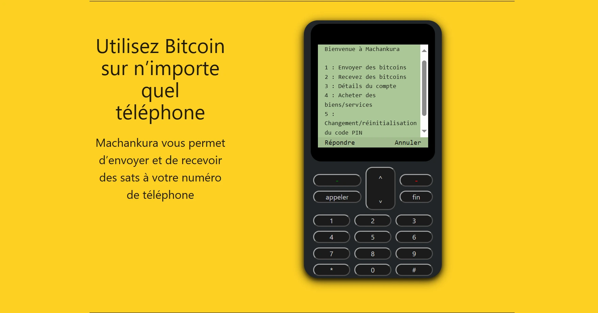

L’Afrique avance, innove, bâtit, pourtant elle continue de faire face à de nombreux défis notamment la connectivité Internet et l’accès aux services financiers de base.
Selon l'Union Internationale des Télécommunications, en 2024, le taux de pénétration d’Internet en Afrique (le rapport du nombre d’individus utilisant Internet sur la population totale du continent) était de 38 %, contre 68 % à l’échelle mondiale.

Relativement à l’accès aux services financiers, les services de transfert d’argent (mobile money) ont connu un essor sur le continent suite aux difficultés d’accès aux services de crédits bancaires.
Face à ce constat, Kgothatso Ngako, un développeur sud-africain, a créé une solution révolutionnaire qui permet à cette couche de la société africaine sans internet et non bancarisée de bénéficier de bitcoin avec son projet dénommé **Machankura**.

## QU’EST-CE MACHANKURA ?

Machankura, argot sud-africain signifiant « argent » est un projet qui a pour vision de connecter l'Afrique avec ses couches rurales à l'écosystème Bitcoin.

Il s'agit d'un portefeuille custodial qui permet d’envoyer et de recevoir des bitcoins sur le Lightning Network via la technologie USSD. Machankura fonctionne sur tous les téléphones, même les plus basiques (téléphone Symbian) en utilisant le réseau GSM traditionnel.
Le **8333.mobi** qui figure généralement en bas du logo est un clin d’œil assez subtil. En effet, **8333** est le port par défaut qu’utilisent les nœuds bitcoin pour communiquer entre eux. Machankura montre ainsi que l'Afrique ne reste pas en marge de cette révolution et constitue une terre d'innovation dans le domaine.

Le domaine **.mobi** est conçu pour les services mobiles qui fonctionnent sur des téléphones basiques via USSD. Par conséquent, le **8333.mobi** résume bien la particularité de la solution Machankura.

Avant de continuer ce tutoriel, attardons-nous un peu sur l’USSD, cette technologie qui permet l’utilisation de la solution Machankura sans internet. 

## L'USSD

La technologie USSD (*Unstructured supplementary Service Data*) qui signifie ‘’Service supplémentaire pour les données non structurées’’ est utilisée généralement par les opérateurs de téléphonie mobile GSM. C’est une fonctionnalité qui permet de communiquer avec un service distant et ceci même sans internet à travers des codes spécifiques et en sélectionnant une option suivant les possibilités offertes par ce service.

Dans un processus de communication USSD, imaginez que vous tapez un code spécial comme `*123#` sur votre téléphone. En exécutant ce code USSD, vous envoyez une requête spécifique à votre réseau GSM afin d'accéder au service relié à ce code. 

 Vous pouvez donc utiliser l'USSD pour effectuer des actions comme la consultation de votre forfait internet, le solde de crédit de communication, etc.

C’est via ce même système de communication que s’est développé sur le continent le mobile banking et les transferts d’argent mobile comme M-PESA, MTN Mobile Money, etc. 
Comme nous l’avions dit précédemment, développé particulièrement pour l'Afrique, ce service fonctionne sur tous les téléphones sans aucune configuration technique complexe ni connexion Internet requise.

## L'innovation de Machankura

Contrairement à une solution de portefeuille classique, Machankura a pu se baser sur la technologie USSD afin de répondre à un problème concret que rencontrent les populations africaines : la couverture internet.

Machankura est un service développé puis relié à un code GSM dans le but de permettre aux utilisateurs de recevoir et d'envoyer des bitcoins sans Internet. Vous pouvez utiliser le service dans les pays ci-dessous en utilisant le code USSD associé :

| PAYS           | CODE USSD              |
| -------------- | ---------------------- |
| Ghana          | `*920*8333#`           |
| Kenya          | `*483*8333#`           |
| Malawi         | `*384*8333#`           |
| Namibie        | `*142*8333#`           |
| Nigeria        | `*347*8333#`           |
| Afrique du Sud | `54052.co.za`          |
| Tanzanie       | `SMS +255 679 066 977` |
| Ouganda        | `SMS +256 744 830 624` |
| Zambie         | `*384*8333#`           |
| Côte d’Ivoire  | `*9141#`               |

En se basant sur ce tableau, nous pouvons constater que les pays tels que la Tanzanie, l'Ouganda, et l'Afrique du Sud ne disposent pas de code USSD spécifique pour le service. 

Toutefois, Machankura pallie ce problème en élargissant ses fonctionnalités via son site web, une messagerie SMS et WhatsApp.

Pour être informé des nouveaux pays où le service sera disponible, veuillez consulter régulièrement leur [site web](https://8333.mobi).

Ce tutoriel explique pas à pas comment utiliser Machankura, d’abord sur un téléphone basique sans Internet, puis sur un smartphone.

## Utilisation sans smartphone (via l'USSD)

### Créer son portefeuille

Pour votre première connexion :
- Tapez le code USSD correspondant à votre pays ;
- Appuyez sur la touche d’appel pour lancer.

Le système vous demandera de créer un code PIN à 5 chiffres 
-  Choisissez un code PIN sécurisé (5 chiffres).
- Confirmez votre code PIN.
- Votre portefeuille Bitcoin est créé instantanément.

Ce portefeuille Bitcoin est associé à votre numéro de téléphone. Le code PIN soigneusement choisi cryptera votre portefeuille et servira également à confirmer toutes vos futures transactions sur Machankura.
Une fois votre portefeuille créé, vous accéderez au menu principal avec les options suivantes :

1. Envoyer des bitcoins
2. Recevez des bitcoins
3. Détails du compte
4. Acheter des biens/services
5. Changement/réinitialisation du code PIN
6. Sortie

Pour accéder à n’importe quelle option du menu principal, il suffit d’appuyer le numéro d’ordre auquel il est associé.
Pour accéder aux ‘’détails du compte’’, sélectionnez l'option **3** et appuyez sur la touche d’appel pour lancer.

### Sécurité et bonnes pratiques

Machankura est un portefeuille custodial Lightning donc vos bitcoins sont gérés via les nœuds de Machankura. Votre compte est protégé par le code PIN que vous avez choisi.

- Ne définissez pas un code PIN en rapport avec une date importante de votre vie.
- Ne partagez jamais votre code PIN avec qui que ce soit.
- Mémorisez votre code PIN.
- Vérifiez toujours les numéros de téléphone avant d'envoyer.
- Conservez un solde raisonnable pour un usage quotidien.

Votre portefeuille est lié à votre numéro de téléphone donc :
- En cas de perte de votre téléphone, contactez le support Machankura ;
- Gardez une trace de vos transactions importantes.

### Recevoir des bitcoins

- Sélectionnez le numéro d’ordre de l’option "Recevoir des Bitcoins" dans le menu principal.
- Votre numéro de téléphone sert d'adresse publique.
- Partagez votre numéro avec la personne qui veut vous envoyer des bitcoins.

#### Adresse Lightning personnalisée

À chaque compte Machankura est associé une adresse Lightning basée sur votre numéro
`votrenumero@8333.mobi`
Exemple : un numéro +2371234567890 deviendra `+2371234567890@8333.mobi`
 Toutefois, vous pouvez choisir un nom d’utilisateur personnalisé pour remplacer le numéro (ex. `satoshi@8333.mobi`). 
 Toute personne possédant votre adresse Lightning peut vous envoyer des bitcoins sans connaître votre numéro de téléphone.
 
#### Rechargement de son portefeuille Machankura

Hormis la réception de bitcoins provenant d’un autre portefeuille Lightning, l’approvisionnement de son portefeuille Machankura est possible avec **Azteco** et **1Voucher** de l’entreprise **Flash Group**. 

**Azteco** et **Flash Group** sont deux entreprises qui proposent des **vouchers Bitcoin**, c’est-à-dire des services de bons prépayés que vous pouvez acheter en ligne ou chez des revendeurs pour obtenir du Bitcoin sans passer par une plateforme d’échange. Ces bons fonctionnent comme des **cartes-cadeaux**. Il existe des bons **On-Chain** et des bons **Lightning**.

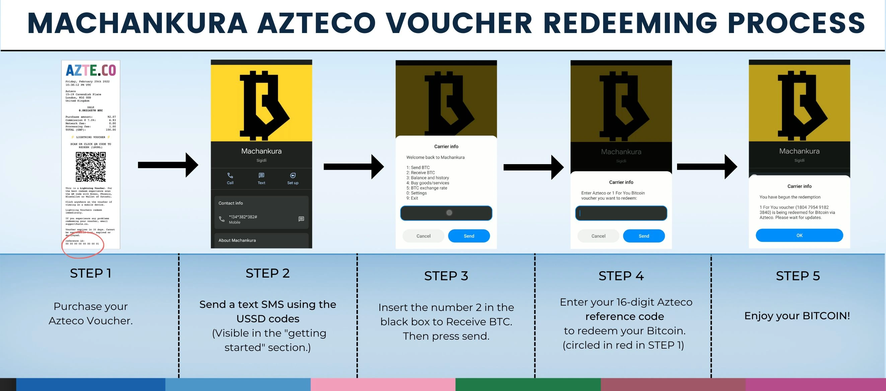

Le processus est simple :

- Vous achetez un bon d’un montant fixe ;
- Vous recevez un code à **16 chiffres** par e-mail ou sur une petite facture.

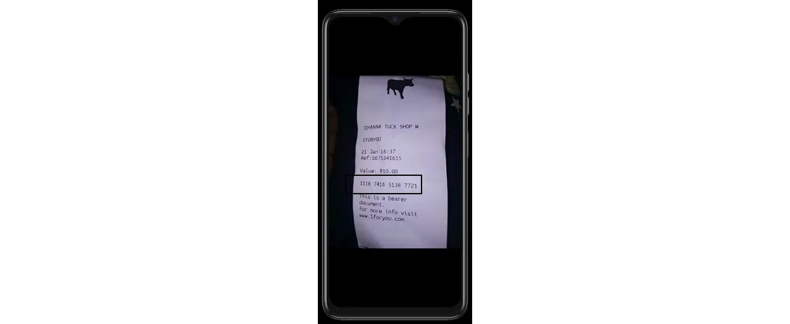

- Vous tapez le code USSD MACHANKURA de votre pays sur votre téléphone.
- Attendez que le menu principal apparaisse.
- Sélectionnez le numéro d’ordre de l’option ‘’Recevoir des bitcoins’’. 
- Entrez le code de 16 chiffres (le code de référence du bon Azteco qui se trouve au bas du bon ou le code PIN du 1Voucher sur la facture).

Les bitcoins équivalents au montant du bon acheté sont directement ajoutés à votre portefeuille Machankura.

### Envoyer des Bitcoins

- Rendez-vous dans le menu principal.
- Sélectionnez l’option ‘’Envoyer Bitcoin’’ en tapant son numéro d’ordre.
- Renseignez soit le numéro de téléphone, soit l’adresse Lightning ou encore le nom d’utilisateur Machankura du destinataire.
- Mettez ensuite le montant à envoyer en sats.
- Confirmez avec votre code PIN.

Machankura envoie alors les bitcoins via le Lightning Network en quelques secondes. Notons que l’envoyeur a la possibilité d’envoyer les bitcoins dans d’autres devises notamment des devises locales.

Lorsque le numéro du destinataire n'est pas encore inscrit en tant qu'utilisateur, Machankura effectue un préenregistrement puis crédite le compte de votre destinataire. 

Un message est automatiquement envoyé au numéro préenregistré et cet utilisateur entre en possession de ses bitcoins une fois qu'il a confirmé son inscription au service.

Vous pouvez retrouver la [vidéo démo d'envoi](https://www.linkedin.com/posts/activity-7351143606121820162-Ua3T?utm_source=share&utm_medium=member_android&rcm=ACoAAAeTubUB8GuaMia5yNBlBg4WhZpGOeVLY0w) de bitcoins par PIO TARAS (Lead Machankura Afrique Francophone) via Machankura sur un téléphone basique.

*Vidéo de Vladimir FOMENE, développeur bitcoin :*

### Vérifier votre solde 

- Sélectionnez le numéro d’ordre de l’option ‘’Solde’’ dans le menu principal.
- Votre solde s'affiche en satoshis et en équivalent monnaie locale.

### Historique des transactions

- Sélectionnez le numéro d’ordre de l’option ‘’Historique’’ dans le menu principal.
- Consultez vos dernières transactions (envois et réceptions).
- Vérifiez les détails de chaque transaction.

### Fonctionnalités supplémentaires 

Machankura n’est pas qu’un simple portefeuille. Vous pouvez échanger vos satoshis contre des biens et services (par exemple cartes-cadeaux Bitrefill ou Lightning Watts) directement depuis l’application.

https://planb.network/tutorials/exchange/centralized/bitrefill-8c588412-1bfc-465b-9bca-e647a647fbc1

Vous avez également la fonction « **Clan** » qui permet de gérer un système coopératif de multisignatures : les membres du clan doivent approuver chaque dépense, et vous pouvez répartir automatiquement les fonds entre ces derniers.

## Utilisation avec un smartphone
 
En ce qui concerne son utilisation sur smartphone, Machankura a choisi WhatsApp comme plateforme intermédiaire.

Cela pour deux principales raisons. La première étape consiste à rendre la solution plus accessible aux Africains sans les obliger à installer une application : une application qu'ils pourraient facilement désinstaller en cas de problème de mémoire de stockage sur leur téléphone. 

La seconde, qui n'est qu'une suite logique de la première, est celle d'être une solution inclusive et de proximité en passant par une application très utilisée par les Africains dans leurs échanges quotidiens : WhatsApp.

### Créer son portefeuille

Pour commencer, vous devez écrire un message au bot WhatsApp de Machankura (un simple ”Salut” suffit largement). Son numéro WhatsApp c'est le [+27 73 762 5720](https://wa.me/+27737625720).

Il vous demandera de choisir la langue dans laquelle vous voudriez discuter.

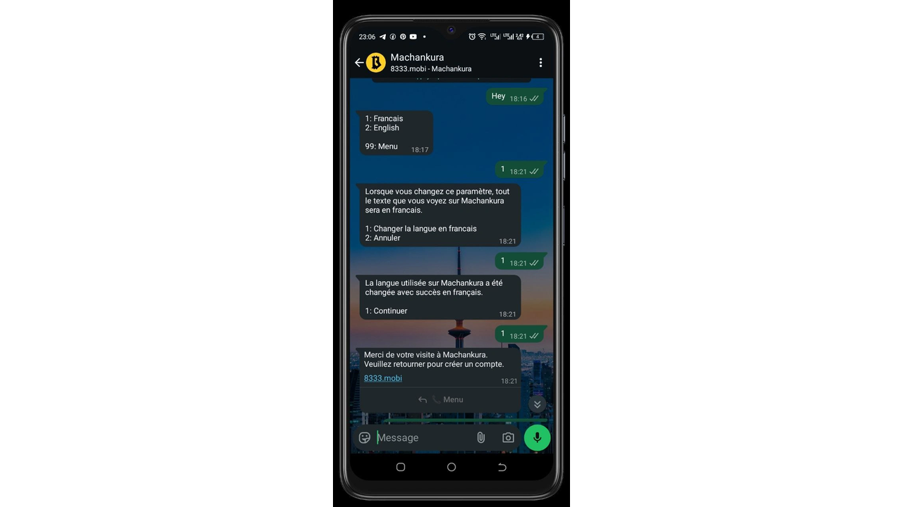

Une fois la langue choisie, vous accéderez au menu principal.
- Répondez **1** qui correspond à l’option “**Créer un compte**“.
- Entrez une adresse mail unique.

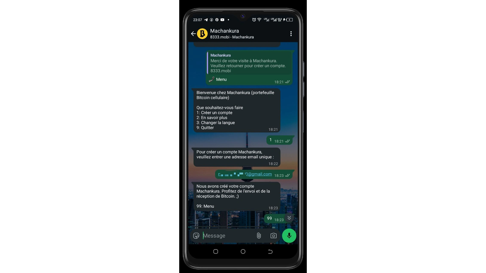

Votre compte Machankura est automatiquement créé. Repartez ensuite vers le menu pour définir votre nom d'utilisateur. 

Pour le faire:
- Répondez **0**, qui correspond à l'option ''**Paramètres**'' ;
- Répondez ensuite **1**, qui correspond à l'option ''**Nom d'utilisateur**''.

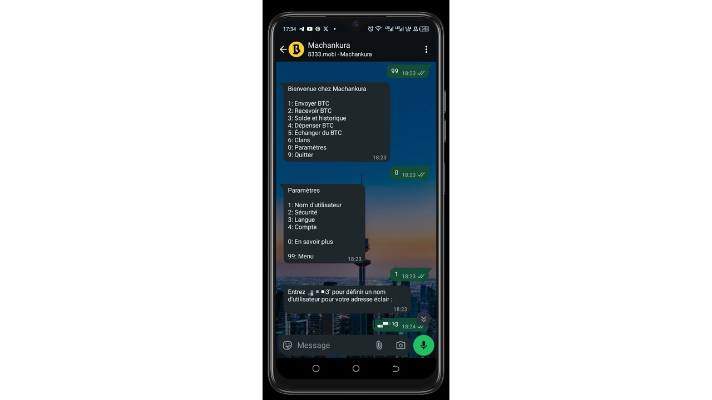

Le bot vous enverra ensuite un code à **6 chiffres** que vous devez taper puis choisissez votre nom d'utilisateur. Une fois votre nom d'utilisateur mis à jour, repartez vers le menu pour profiter de l'envoi et de la réception de bitcoins par Machankura.

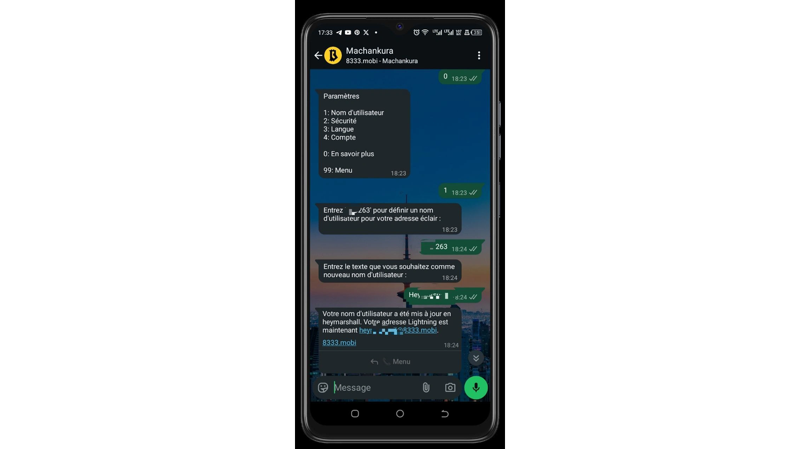

### Envoyer des bitcoins

Machankura vous permet d'envoyer vos bitcoins via différentes options :
- numéro de téléphone ;
- adresse Lightning, ce format d'adresse Bitcoin humainement lisible est beaucoup plus utilisé pour éviter les erreurs de frappe lors des paiements ;
- nom d’utilisateur du récepteur, dans le cadre d'un paiement vers un compte Machankura ;
- facture LN, une facture Lightning standard ;
- adresse on-chain, par l'intermédiaire du service Boltz.

https://planb.network/tutorials/exchange/centralized/boltz-34ad778e-6dc7-41c2-8219-e11e3361a43d

Machankura permet une interopérabilité entre les différents portefeuilles Lightning. Dans cette démonstration, nous envoyons des bitcoins depuis notre portefeuille Machankura WhatsApp vers un portefeuille Wallet of Satoshi.

https://planb.network/tutorials/wallet/mobile/wallet-of-satoshi-39149d86-e42b-4e8f-ae9f-7e061e7784f7

Pour envoyer, veuillez saisir le chiffre 1, correspondant à l'option "ENVOYER BTC". Par la suite, choisissez l'option d'envoi "Adresse Lightning", puis indiquer l'adresse du destinataire des bitcoins. Enfin, sélectionnez la mesure de valeur "sats", indiquez le nombre de satoshis à envoyer et confirmez l'envoi.

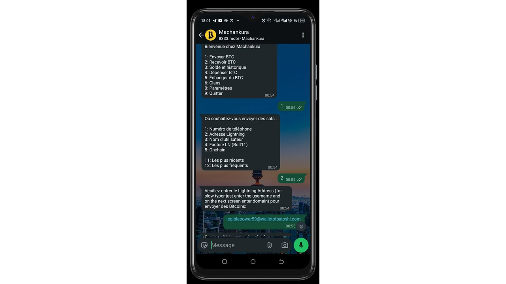

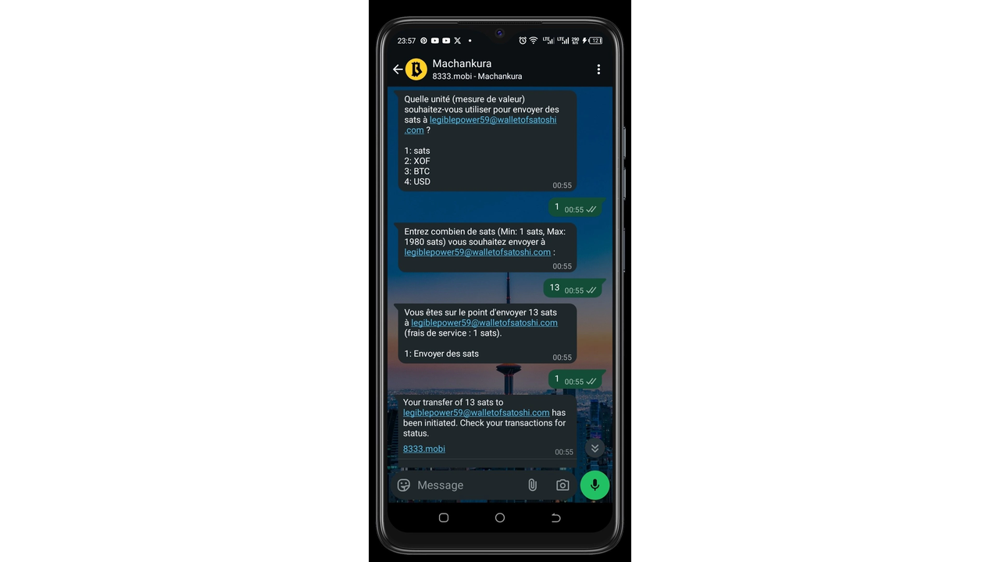

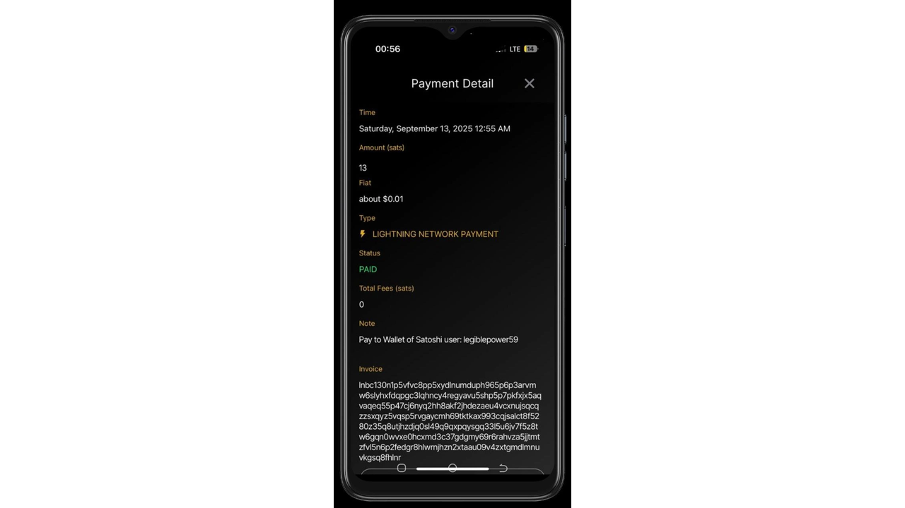

Félicitations !! Vous venez d'envoyer des satoshis à votre destinataire.

### Recevoir des bitcoins

Une fois dans le menu, Sélectionnez **2**, qui correspond à l'option ''**Recevoir BTC**''. Le bot vous affichera votre adresse Lightning.

Il vous proposera aussi diverses options, notamment : 
- UTILISER BTC ;
- Facture LN (Bolt11) ;
- Le code QR ; 
- L'adresse on-chain.

L’option 1 ‘’UTILISER BTC’’ vous permet de recharger votre compte avec un bon Azteco. 

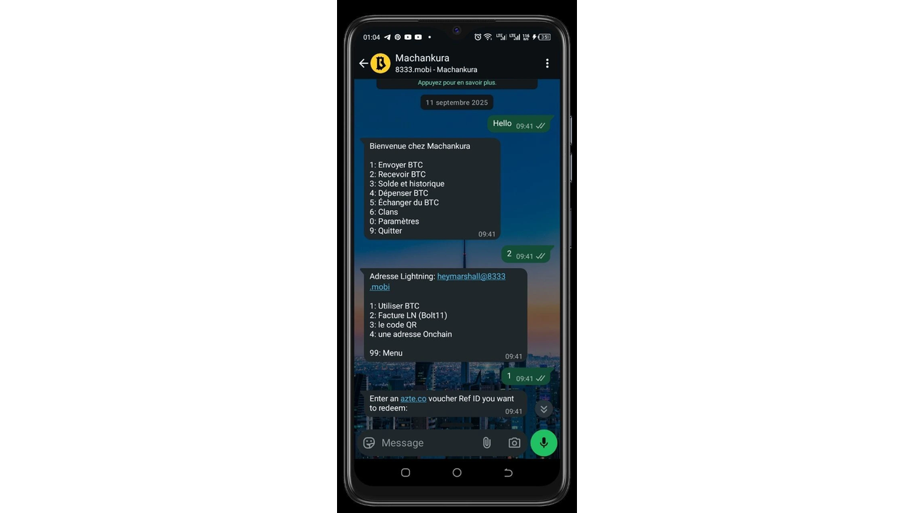

L’option 4 ''UNE ADRESSE ONCHAIN'' vous permet d'obtenir une nouvelle adresse on-chain à usage unique pour garder plus d'anonymat. 

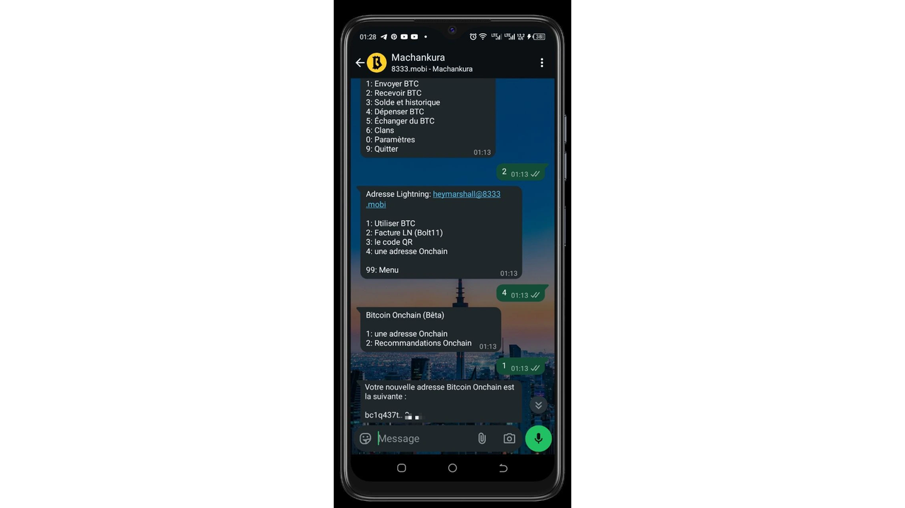

Tandis que les autres options vous redirigent vers une page web reliée à votre adresse Lightning.  

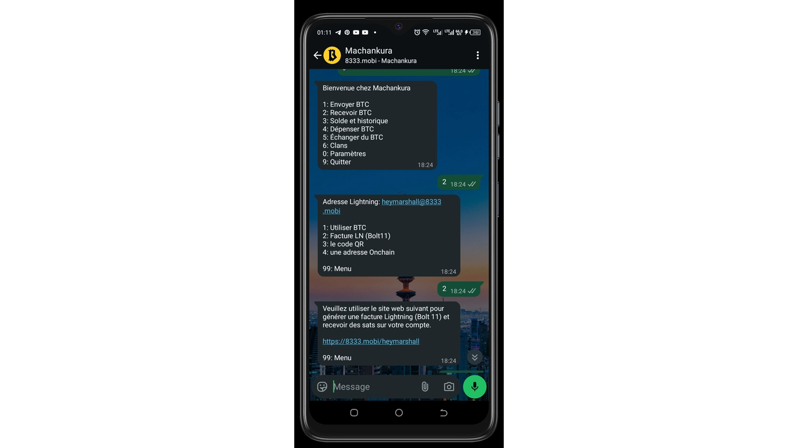    

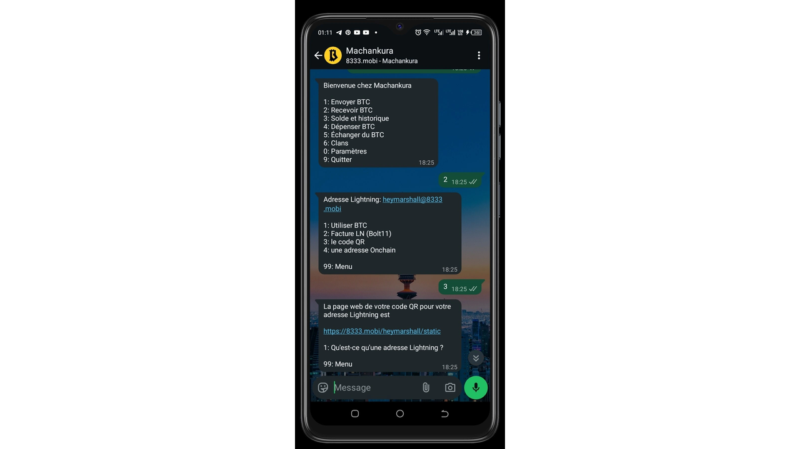

Vous avez la possibilité de vous procurer : 
- soit le code QR de votre portefeuille ; 

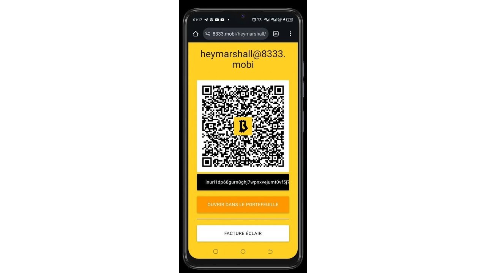

- soit de générer carrément une facture Lightning sur cette page web. 

Pour obtenir une facture précise, veuillez indiquer l'unité de compte et le montant de bitcoins dans cette unité de compte que vous souhaitez recevoir. 
Après avoir indiqué le montant dans cette unité de compte, le système s'occupe de convertir l'équivalent en Bitcoin, et vice versa. 

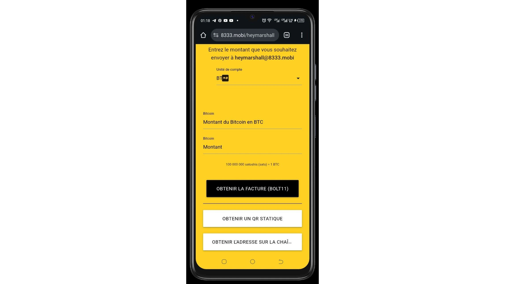 

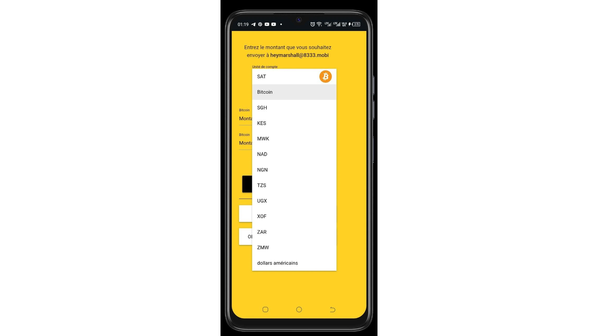

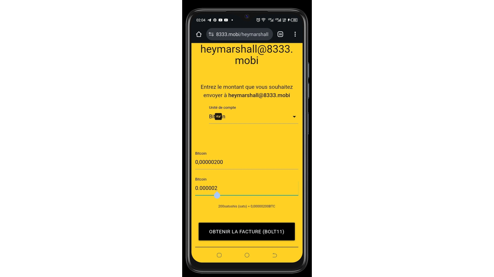

Notez que, vous pouvez aussi obtenir votre adresse on-chain sur la page web reliée à votre portefeuille.  

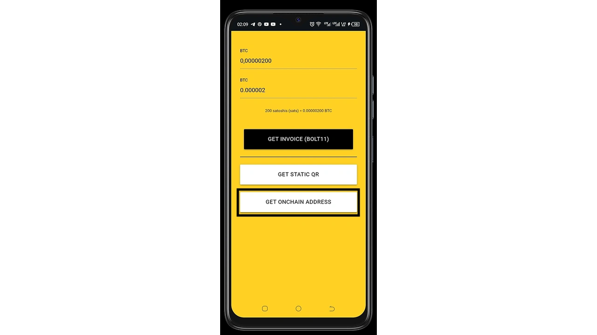

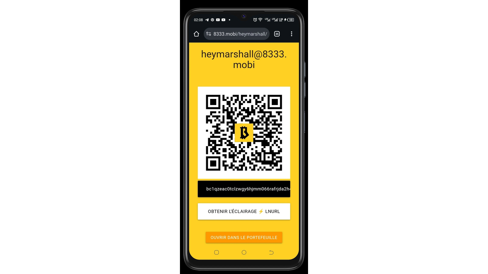

De plus, Machankura offre la possibilité à toute personne souhaitant vous envoyer des bitcoins de le faire depuis votre site web en utilisant son portefeuille dédié. Il vous suffit de lui envoyer le lien de la page web associée à votre adresse Lightning. Après avoir accédé à cette page web, il aura la possibilité d'ouvrir votre code QR ou votre facture directement dans son portefeuille.

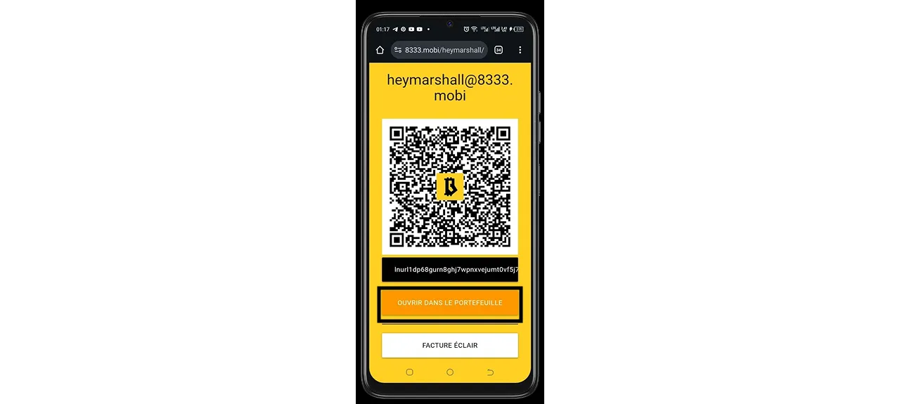

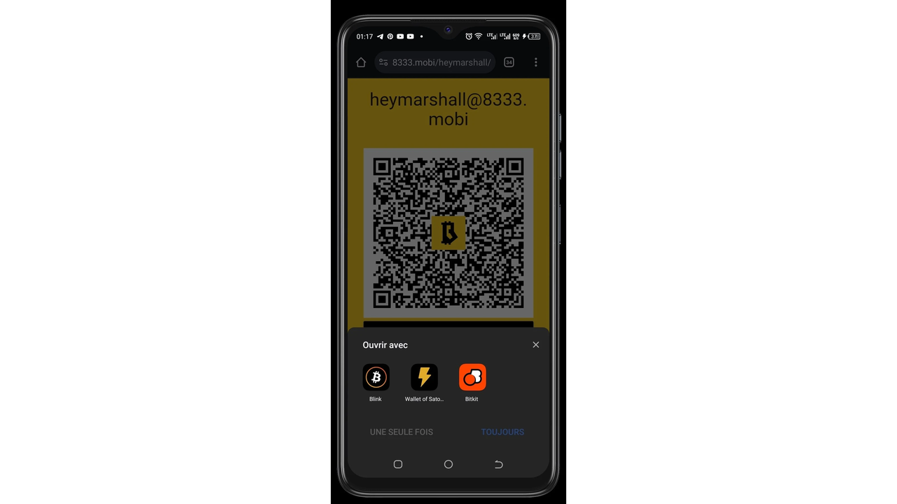

https://planb.network/tutorials/wallet/mobile/blink-7ea5f5a4-e728-4ff9-b3f9-cf20aa6fc2bd

https://planb.network/tutorials/wallet/mobile/bitkit-a7224674-85c4-4045-9baf-37018d89550c

### Vérification du solde

Vous pouvez consulter votre solde sur le portefeuille Machankura en sélectionnant l'option 3, qui correspond à l'option "Solde et historique".

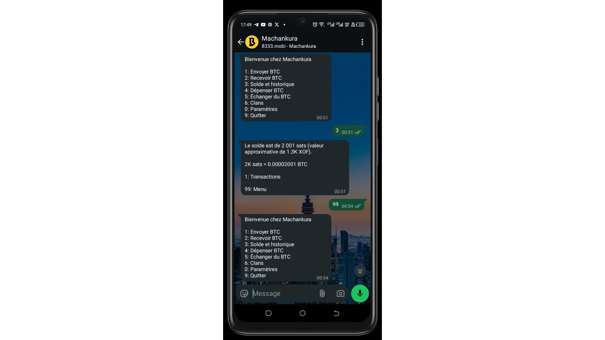

Félicitations !! Vous êtes à présent en mesure d'utiliser par vous-même Machankura  pour recevoir et dépenser des bitcoins.

Si ce tutoriel vous a été utile, je vous prie de me laisser un pouce vert ci-dessous. Merci beaucoup !